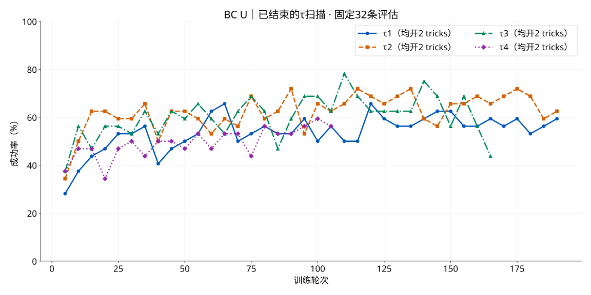
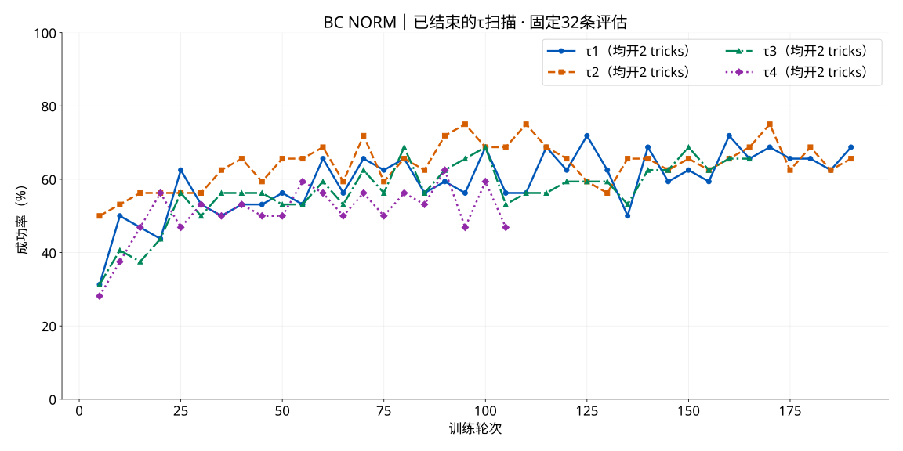

# BC U / Norm trick消融 · 2026-10-08

用户要求停止τ1–4八组，保存轻量产物并上传Git；再启动以下八组。两个trick已经完整接入U/Norm，复用在线BC DVCA控制，不新增训练算法或调度层。

- D：chunk dropout，20%成功chunk的训练权重恢复为1，不删除采样。
- A：α退火，local/chunk的α从R1的1降到R200的0，此后等权。
- τ同时用于local与chunk两个温度；仅改τ和两个已有布尔开关。

| 机器/卡 | 信号 | τ | D | A |
|---|---|---:|---|---|
| 1/4 | U | 2.5 | 关 | 关 |
| 1/5 | Norm | 2.5 | 关 | 关 |
| 1/6 | U | 3 | 开 | 开 |
| 1/7 | Norm | 2 | 开 | 开 |
| 2/6 | U | 3 | 开 | 关 |
| 2/7 | Norm | 2 | 开 | 关 |
| 3/6 | U | 3 | 关 | 开 |
| 3/7 | Norm | 2 | 关 | 开 |

从原SFT、空回放重新正式训练。继承当前配置：move_pillbottle_pad / π0.5 / ODE10（U额外ODE5）/ H50 / D14 / N8 / 每轮5次更新 / GB1024 / MB32 / 300轮 / 最多200物理动作 / 每5轮固定32条评估。两项全开组按用户要求fresh重跑；旧组结果作为历史比较，单种子固定32条不能断言显著提升。

源码保持105170b871。复用三机原ops/owner.py和当前plan/status，精确停旧BC及其CPU owner后只改上述8卡priority请求；fallback和2机EXPO/3机WM保持。切换期间RLT不插队；新BC正式首轮通过后恢复候补。结束条件为300轮或该driver退出，随后逐卡确认释放再接原RLT。

新输出：/data/chenyiteng/results/bc-tricks-20261008/bc-{u,norm}-tau{T}-{none,both,drop,anneal}-{host}-g{G}-300-1008-v1。命令仍为当前owner调用ops/driver.py --plan .../bc-signal-tau-v1/plan.json --request .../trick-ablation-20261008/requests/bc-g{G}.json；driver读取该输出runtime/resolved.yaml。每卡使用继承的本机计算/图形scope。

验收只做已有开关的CPU权重/退火/RNG检查，以及正式首轮真实参数更新和卡位检查；不追加长smoke。旧实验保留日志、配置、轻量曲线和最后完整断点，Git不上传权重/回放/凭据。执行回执随后补入本专题。

## 已结束的τ扫描

旧八组均使用两个trick。旧日志、最新完整恢复点保留在服务器；此目录归档标量曲线和实配。各组停止轮次不同，以下末5次均值仅描述各自末段，不是相同预算对照。

| 位置 | 信号/τ | 完成轮数 | 保留CP | 最新评估 | 末5次评估均值 |
|---|---|---:|---:|---:|---:|
| sz1/4 | u/1 | 193 | global_step_190 | 59.375% | 56.875% |
| sz1/5 | norm/1 | 194 | global_step_190 | 68.750% | 66.250% |
| sz1/6 | u/2 | 194 | global_step_190 | 62.500% | 66.250% |
| sz1/7 | norm/2 | 193 | global_step_190 | 65.625% | 66.875% |
| sz2/6 | u/3 | 166 | global_step_160 | 43.750% | 58.750% |
| sz2/7 | norm/3 | 165 | global_step_160 | 65.625% | 65.000% |
| sz3/6 | u/4 | 108 | global_step_100 | 56.250% | 55.625% |
| sz3/7 | norm/4 | 107 | global_step_100 | 46.875% | 53.750% |

U τ3中段有较高点，但末段没有稳定优于τ2；Norm τ2末段略高于τ1/τ3，差距较小。新消融依用户指定选择U3、Norm2，不将它写成统计显著结论。

## 结束时曲线

