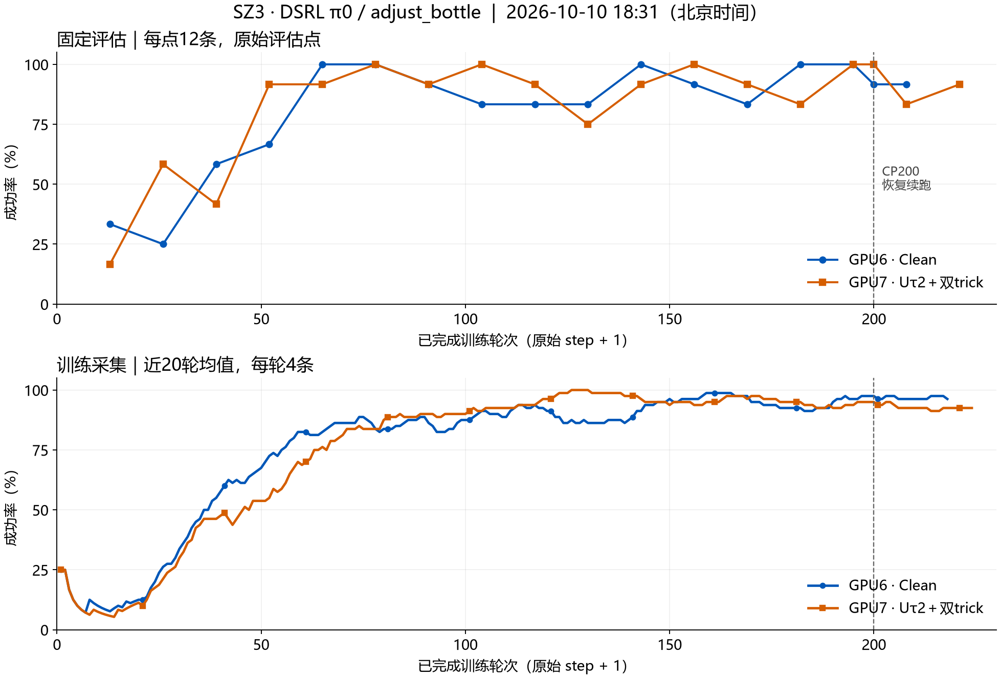

# DSRL Clean / U tau2 closeout
2026-10-10. User requested closing DSRL, publishing the results and assigning SZ3 GPUs 6/7 to attention inference. No method or training configuration was changed during closure.

| | GPU6 Clean | GPU7 U tau2 + dropout + anneal |
|---|---:|---:|
| Last completed training round | 218 | 224 |
| Latest fixed evaluation | R208: 11/12 | R221: 11/12 |
| Mean of last five common evaluations | 93.33% | 91.67% |
| Last complete restorable checkpoint | CP200 | CP200 |

Common evaluation rounds: 169, 182, 195, 200, 208. Each uses 12 fixed episodes; repeated evaluations are not independent 60-episode samples. Both methods learn successfully; these results do not establish a stable U advantage.

The original 200-round runs exited successfully. The continuation runs were stopped by the authorized switch, with exit 15 and cleanup_error=null. Their last completed learning rounds are not new saved checkpoints: the complete model/optimizers/alpha/target/trainer/replay recovery anchor remains CP200. Checkpoints and large raw logs remain on SZ3.

U annealing ended at R200 as configured, so continuation used alpha_chunk_effective=0 and unit weights. The 400-round budget was not completed. Source/config provenance remains ae8a8ad plus the documented continuation routing patch; no algorithm change in this closeout.

Exact driver identities, empty Ray namespaces and empty GPU C/G contexts were verified before reserving 6/7 for Attn. Shared Ray and WM slots 4/5 were preserved. Original per-card RLT CP150 requests remain behind Attn; new inference completes and clears each card before its original RLT resumes.

See concluded/curves-and-receipts.json and concluded/clearance.json for lightweight evidence. The attention implementation uses its own branch and original pi0.5 DV50 baseline.
