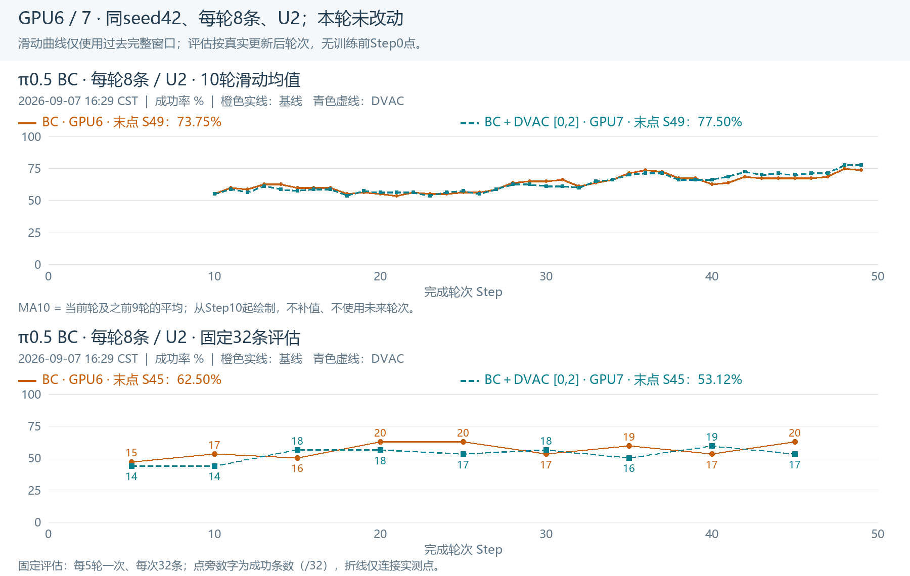

# π0.5显式Adv-DVAC切换结果与GPU6/7 BC刷新

## 1. 已完成与验证边界

2026-09-07北京时间16:27在GPU4/5从原Sidney SFT fresh启动；16:32确认进入首轮rollout（0/4串行批次起点），六个Actor/Rollout/Env worker源码包逐文件hash一致，实际配置与准备配置零差异，未检出所查fatal/OOM。**尚未完成首轮更新，不称长程稳定性或新checkpoint恢复已经验证。**

新增应用模式`chunk_clipped_action_advantage`：显式逐动作正优势×DVAC，原chunk ratio/clip，负/零优势权重1，不做chunk权重均值1；不再经logprob_ST加权入口。模型、rollout、GRPO优势、DVAC统计模块均与切换前源码字节一致。

本次在既有DVAC支持上改3个生产文件，新增74行、删除3行，另新增方法YAML及测试。不是声称整个DVAC支持相对纯Control只有这点代码。

42项CPU回归通过，覆盖H2/50、14维动作、正负零优势、mask、原数值clamp、全1值/梯度等价、交换局部权重、整段增强和共享参数梯度。真实Step7采样权重/优势展平为[512,50]，经正式policy_loss registry检查梯度通过。未另跑模型/环境smoke；没有依赖升级或更改共享Ray。

## 2. 新实验参数与发布

| 项目 | 实值 |
|---|---|
| 方法 | chunk-clipped action advantage；positive-only；[0.5,1.5] |
| 信号处理 | 复用selected_l3、warmup1、history5、logV标准化、z限[-2,2]；w=1+0.25z；无chunk中心化 |
| 数据/更新 | 32环境/卡×两卡×串行4＝256条；G8；micro32/global1024/U2 |
| 模型/环境 | 原π0.5 SFT、expert-only；C50/M10/noise0.5；move_pillbottle_pad、horizon200 |
| 其他预算 | LR5e-6；原优化器/精度/FSDP/种子；200轮；fixed32每5轮；save10 |
| 分支 | codex/sz-pi05-grpo-dvac-adv-chunk-positive |
| 运行源码提交 | ebfe2a27dedb8cbb1c366e2c546e93053c232ad1 |
| 启动证据提交 | a35fc6ee22709569714deb80e1a6310a4d3b67b6，已推并核验远端 |

相对切换前ST实际resolved只有1个方法叶`application`＋9个路径/身份叶；没有采样/batch/U变化。另与原Control实际配置逐叶核对，差异为DVAC方法、必要路径/身份与历史缺省字段；验证器默认per_worker_log=false、weight_sync_interval=1、overlap_env_bootstrap=false、cluster.tracer.enable=false单列，不算新训练超参。

输出：`/home/chenyiteng/results/rlinf-shenzhen/pi05-sidney/runs/move-pillbottle-pad-grpo-dvac-adv-chunk-positive-w05to15-formal200-2gpu64x4-g8-b1024-u2-m10-noise05-h200-fixed32-phys45-20260907-v1`。

[完整启动命令](ADV_CHUNK_FORMAL_COMMAND_20260907.txt)；[源码diff](ADV_CHUNK_CODE_REVIEW_20260907.txt)；[配置/真实张量核对](ADV_CHUNK_CONFIG_AND_REAL_TEST_20260907.txt)；[42项测试](ADV_CHUNK_TESTS_20260907.txt)；[最终健康快照](ADV_CHUNK_LAST_HEALTH_20260907.json)。测试文件末尾之后的脚本曾因并行准备合同尚未生成而中断，42项单测本身全过；后续真实张量检查单独完成，没有借此重跑训练。

## 3. loss是否常规、有依据

优势乘固定非负权重、按原PPO clip构造目标，是常见可解释的加权方式；“整序列裁剪＋位置级adv＋stop-gradient分离入口”有[GSPO-token论文§4.3](https://arxiv.org/html/2507.18071v2#S4.SS3)和[TRL固定实现](https://github.com/huggingface/trl/blob/1ecae07b30a5189795f62c8b9a0ba23a5b04f73e/trl/experimental/gspo_token/grpo_trainer.py#L59)的直接先例。

我们的适配保留π0.5 Control的logprob沿H/D求和，而非照搬GSPO长度平均；H补偿保持全1时原更新尺度。**它不是无依据的临时补丁，也不是原生π0 GRPO的标准现成开关。** DVAC信号、历史5轮、范围等仍是本研究设计，不能说每个具体选择均已由论文证明最优。

与旧ST在同权重/门控/clip/聚合条件下可有相同一阶梯度，因此显式adv接点更符合合同，但不保证仅换接口就改善效果。旧action-ratio Adv则改变了裁剪，不能混为同一目标。

## 4. 旧ST收尾

16:26仅停止经uid/pid/starttime/job验证的旧GRPO driver506059及RLinf namespace，其他namespace集合保持。旧ST最终完成8轮，固定Step5为12/32；尚无checkpoint文件，不虚构可恢复模型。没有删除大文件。

[轻量ZIP](st-positive-closeout-20260907.zip)包含日志、配置、TensorBoard、全scalars及checkpoint空清单。旧分支`codex/sz-pi05-grpo-dvac-st-positive`收尾提交`5a5ec53dc39de9dadb3cecf5b9f36a678de47a4a`已推并核验。

## 5. GPU6/7 BC（16:29快照，均未中断）

| 项目 | GPU6 BC | GPU7 BC＋DVAC[0,2] |
|---|---:|---:|
| 完成轮次 | 49 | 49 |
| 最新采集 | 6/8 | 6/8 |
| 最近5轮采集 | 33/40＝82.5% | 32/40＝80.0% |
| 最近10轮采集 | 59/80＝73.75% | 62/80＝77.50% |
| 最新固定评估 | Step45：20/32 | Step45：17/32 |

两项采集趋势均在上升，DVAC近期采集略高但固定评估未持续领先，**目前不能认定稳定收益**。8条/轮、U2、seed42和原BC权重映射都未修改，BC-DVAC仍为chunk内均重1，不把本次GRPO语义更改偷偷应用到BC。

[逐轮、MA5、MA10、评估完整图](bc8-refresh-20260907-adv-cutover/overview.png)；[统计与原始快照](ADV_CHUNK_STARTUP_BC_REFRESH_20260907.json)。图每行一图，滑动窗口只使用过去完整窗口，不补训练前Step0。

16:32新GRPO4/5占约23.64/24.02GiB，属于首轮采样启动期，不是峰值；GPU6/7约40.25/42.79GiB。16:29磁盘/data余约699GiB、/home余约1246GiB；当前没有清理。GPU0原其他用户进程未操作。

## 6. 下一次定位

执行stage：`/data/chenyiteng/results/server-maintenance-20260907/adv-chunk-positive`。create/prepare/tests/publish/stop/launch/finish-publish均有attempt或receipt，禁止重复执行切换。最新源码发布和现场来自上述证据；下次查动态step/GPU/fatal/checkpoint仍须重新刷新。
