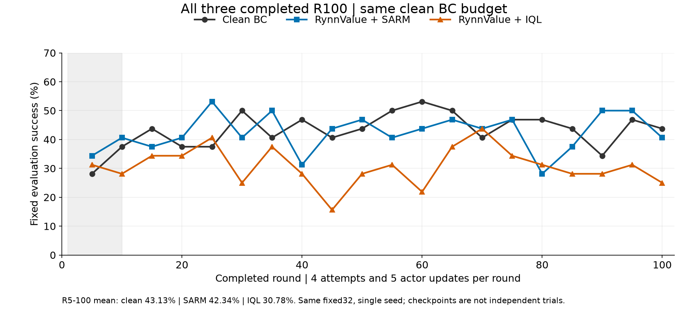
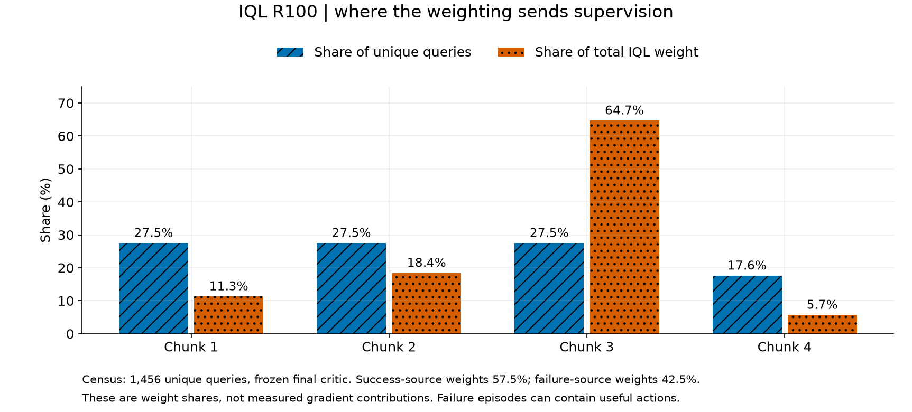
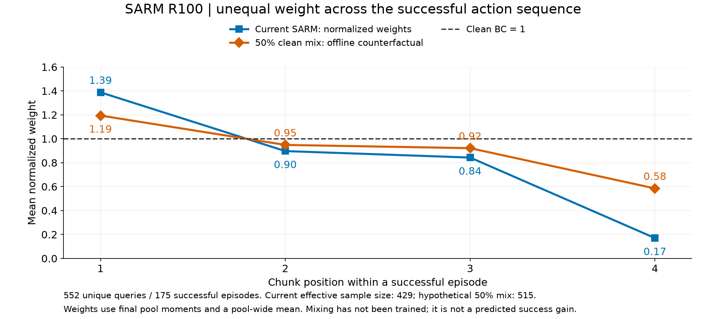

# π0.5 在线 SARM / IQL：为什么没超过成功 BC，下一步改什么

2026-09-10。本轮已只读刷新深圳服务器，复核正式配置、代码与官方来源，读取最终回放；在CPU上重放小型critic前向，未加载π0.5大权重，未训练或改变生产。证据目录：[sarm-iql-diagnosis-20260910](evidence/sarm-iql-diagnosis-20260910/)。

**判断：IQL有明确退步；SARM目前接近clean、没有明确收益。未发现已证的数值实现错误。更有依据的问题是：局部信号带有阶段偏好，而IQL又让尚未成熟的critic同时承担失败筛选与较强重加权。** 两组应分别处理，不能统一归因于“RynnValue无效”或“κ/β没调好”。

## 1. 先确定结果与比较口径

11:49 CST现场：IQL于11:41正常完成R100，exit0；SARM已完成R100，训练exit0，wrapper92来自此前评分器退出检查误报。GPU6/7已释放，GPU4/5的GRPO继续。无数值异常、漏更新或评分失败的当前证据。

| 同为4/U5、100轮 | R5–100固定32评估均值 | 相对clean | R100 |
|---|---:|---:|---:|
| 干净成功BC | 43.13% | — | 14/32 |
| RynnValue＋SARM | 42.34% | −0.78个百分点 | 13/32 |
| RynnValue＋IQL | 30.78% | −12.34个百分点 | 8/32 |

IQL在20个共同评估点中17个低于clean，最后5点平均低14.38pp；SARM为10高、9低、1相等。两者都是单seed，同32个场景反复评估，不把20个checkpoint当20次独立实验。采集成功率由更新前策略产生，固定评估在更新后。[原始快照](evidence/sarm-iql-diagnosis-20260910/snapshot.json)、[复算结果](evidence/sarm-iql-diagnosis-20260910/runtime-analysis.json)

正式基础参数与clean一致：原始Sidney模型、空池、4条/U5、actor1024/micro32、LR2.5e−5/constant、原Adam、clip1、长度过滤off、每5轮评估32、每10轮保存。SARM新增进展权重；IQL还新增完整转移池、Q/V、奖励和R11的数据切换，这些方法内变化本身足以改变训练分布。[SARM配置审计](evidence/sarm-iql-diagnosis-20260910/SARM_CODE_AND_UPSTREAM.md)、[IQL配置审计](evidence/sarm-iql-diagnosis-20260910/IQL_CODE_AND_UPSTREAM.md)

## 2. IQL：有筛选能力，但不足以替代成功筛选，且权重很集中

**实际数据。** R100共400次尝试，164成功、236失败；成功通常3段、失败4段，所以1456条query中只有512条来自成功（35.16%）。在完整终池上用冻结R100 critic重算，而非只看随机小样本：

| 指标 | 实测 | 含义 |
|---|---:|---|
| 成功来源query占比 → 权重份额 | 35.16% → 57.50% | critic确实富集成功来源，不能说完全没学会 |
| 失败来源权重份额 | 42.50% | actor仍用较大份额模仿失败来源；其中也可能有好动作 |
| 第3段：query占比 → 权重份额 | 27.47% → 64.65% | 很强的段序号偏好，未证明等于动作质量 |
| 权重均值 / ESS | 3.40 / 132.34 of 1456 | unique池有效样本比例仅9.09%，分配很集中 |

这是**权重份额**，不是实际梯度份额，也不是独立泛化测试。真实R100日志是5个训练槽的均值（meanW4.20、ESS136/1024），与冻结终点、遍历unique池的3.40不同，不是计算不一致。CPU调用生产`prepare_dagger_sft_batch`完整动作变换和三相机预处理，未自行另拟Normalize；已独立复核A与exp计算。[完整前向](evidence/sarm-iql-diagnosis-20260910/critic-probe-full.json)、[复核](evidence/sarm-iql-diagnosis-20260910/IQL_CODE_AND_UPSTREAM.md)

**R11切换偏激进有直接证据。** R10只收集40次尝试、143转移，随机视觉critic更新50次。R11同时“成功池→全池”“w=1→exp(10A)”；实际均重24.36、16.95%触顶100，actor记录的梯度范数从R10的0.036变为R11的2.78。两个因素同时变动，不能把退步全部归因于其中一个。

在同一R10 checkpoint、同一143条数据上的配对前向：current minQ均0.291，target minQ均−0.015，V均0.052；因此currentQ−V均+0.239，而targetQ−V均−0.067。分解为：

`currentQ − V = (targetQ − V) + (currentQ − targetQ)`。

后项均+0.306，足以显著改变优势。V追踪慢targetQ，actor却用currentQ，这是官方顺序；**问题候选是短预热下的估计时滞被exp放大，不是写错了公式，也不意味着换targetQ一定更好。** R10冻结模型对随后R11–14的58条未见转移仍会给失败来源43.4%的权重；样本较小，仅为泛化线索。到R100 current/target平均差降至0.057，早期问题减弱，不代表受损的actor已恢复。

**为什么不能只降β？** 同一终池、同一A的反事实重算：

| β（未重新训练） | ESS比例 | 失败来源权重份额 |
|---|---:|---:|
| 10（当前） | 9.09% | 42.50% |
| 3 | 76.42% | 57.42% |
| 1 | 97.00% | 62.23% |

降β降低尖锐度，也削弱了critic对失败来源的筛选。因此先保住成功actor数据，再单独温和化，更贴近“基于干净成功BC提升”的目标。全batch均重归一只控制总体loss系数，不改变该份额；Adam/clip使均重不能直接解释为学习率倍数。

**官方成功条件不同。** RynnValue论文IQL使用约97.1%成功的离线池；论文实机优势均权预热200次、总10k更新，公开RoboTwin模板为2000/200k。当前在线小池50/500不是已知充分预算；2000也不能混称所有论文设置。论文在线提升则用冻结VLA的DSRL，不是本实验的在线IQL。β10是可调温度；原IQL在其他任务也用3或.5。[RynnValue论文B.4–B.6](https://arxiv.org/html/2608.09853v1)、[原IQL](https://arxiv.org/pdf/2110.06169)

## 3. SARM：公式正确，但更像在挑阶段，局部质量依据还不够

R100最终成功池175条episode、552条query的差值、Welford count/mean/M2全部复算一致，μ=1.565秒、σ=1.114秒。实际归一权重如下，括号内为clean参照：

| 第几段 | 第1段 | 第2段 | 第3段 | 第4段 |
|---|---:|---:|---:|---:|
| 当前池平均归一权重 | 1.388 | 0.897 | 0.843 | 0.170 |
| 干净BC | 1 | 1 | 1 | 1 |
| 原始负进展置0比例 | 10.86% | 0% | 0% | 44.44% |

即使只看长度同为3的episode，偏第一段仍存在。30/175条成功轨迹至少有一段完全零权。第四段可能是低效补动作，也可能是必要收尾，**仅凭序号不能确定哪种解释正确**。成功终帧平均仍预测剩余0.618秒，终段delta又小；κ2硬满权主要落在第一段。简单把秒缩放并同步改κ/μ/σ，不会修复排序；κ降低也不改变负进展置0。[详细池分析](evidence/sarm-iql-diagnosis-20260910/SARM_CODE_AND_UPSTREAM.md)

**RynnValue有部分有用信号，也有局部反例。** 在IQL完整400条轨迹中，同为第1段时，较大delta区分最终成功的AUC仅0.579；第3段为0.778。成功终态剩时均0.610秒，失败终态均2.133秒，说明它有识别后期状态的能力；但这不等于前期能精准给动作分配学习权重。这里是未控制场景/指令的结果关联，不是因果动作质量或评估成功率，也不是SARM自身池的检验。

已查看4条成功episode的真实执行边界图。一个R61例子中，初始瓶子在蓝垫旁、任务尚未完成，模型给0.239秒；夹爪接近后给3.721秒，首段delta=−3.481；最终成功帧给0.483秒。该例说明“模型预测负进展”不能直接当作“有害动作”。另一个成功末段delta仅−0.087秒，接近图像/预测细微变化；需要完整执行视频判断最后动作作用。它们来自IQL池、是选取的反例，不能冒称SARM的实际失败根因。[首段反例](evidence/sarm-iql-diagnosis-20260910/success_negative_first_1.png)、[末段反例](evidence/sarm-iql-diagnosis-20260910/success_negative_last_1.png)、[索引](evidence/sarm-iql-diagnosis-20260910/boundary-images-index.json)

**与原SARM的主要差异是信号，而不只是单位。** 我们借用RA-BC映射；原SARM会训练任务内阶段/进展模型，应用于质量不一示范。这里换成通用冻结剩余秒模型，并且训练数据已通过真实成功过滤。LeRobot官方也说明：质量较一致时，额外重权未必有明显收益，κ需按任务调。4帧因果前缀与官方入口一致，slot isolation也已启用；不过相邻边界的历史/重复帧不同，对差值的影响尚未独立量化。[官方SARM说明](https://huggingface.co/docs/lerobot/en/sarm#tuning-ra-bc-kappa)

## 4. 实现检查：哪些已排除，哪些仍需实验

| 项目 | 当前判断 |
|---|---|
| 进展反号、秒解码错误、reset图当终帧 | 代码/已有真实smoke未支持；最终数据差值复算正确 |
| 1024/micro32分母、重复统计、mask遗漏 | 与约定一致；SARM按全1024 weighted mean，IQL按官方mean(w·loss)，不能混为一种归约 |
| IQL更新顺序、crop/Normalize、shape/target折扣 | 与已锁定实现和本地合同一致；actor/QV各500更新，无跳步 |
| 失败终止的正塑形奖励 | 不是单独的bug证据；全400轨迹折扣相消误差<9.4e−8 |
| 目标适配 | 我们success0/1与论文完成前−1成本不同，速度偏好不同；当前两侧γ一致，不应只把target改γ^50 |
| 状态信息 | critic仅三相机；奖励有历史前缀，终止有剩余预算。缺历史/预算可能增加拟合难度，尚非已证主因 |
| 成功过程中的50动作标签 | 继承clean“完整提交proposal”合同；真实插值/提前成功不等于50个命令逐项已执行。改变标签需同步clean对照 |

PBRS虽在理想完整状态中保持奖励结构，有限样本的近似Q/V仍可能难以学习。MC行为回报可作诊断，不是IQL最优Q真值；若加MC辅助，shaped Q应对齐`G_task−λΦ`，不可把原始success回报与带势函数的TD目标直接混用。[IQL代码与奖励分析](evidence/sarm-iql-diagnosis-20260910/IQL_CODE_AND_UPSTREAM.md)

## 5. 建议的下一步：先做最有辨别力的小改动

| 优先级 | 只改变一项 | 为什么，怎样解释结果 |
|---|---|---|
| IQL第一组 | **actor始终从成功池取样并乘IQL权重；Q/V仍用全池** | 隔离R11引入失败actor数据的影响，最贴近clean＋重权。若明显恢复，优先处理数据混合；仍差则查权重/critic |
| SARM第一组 | **g_new=0.5+0.5g_SARM**，g在完整1024内原样归一；κ仍2 | 每段保留至少0.5的clean监督。终池反事实ESS429→515/552，第4段均权.17→.585，检测强删权是否伤害成功链；尚未训练 |
| IQL后续A | 在确定的actor池上，仅β10→3；或另组仅均重1 | 分开检查相对权重与整体loss强度，不同时改 |
| IQL后续B | 仅塑形系数.1→0，保持真实success奖励/折扣/actor池 | Sparse-IQL区分进展奖励与IQL机制；不能再同时改−1成本 |
| critic诊断 | 冻结actor、固定回放，比较50/200/1000次Q/V训练，并用新episode验证 | 区分欠训练与过拟合；增加Q/V预算须单列，训练loss下降不足以放行 |
| 信号诊断 | 同阶段片段盲排、同末图改历史、query序号均重/同序号打乱对照 | 检查是否真有段内质量信息，而不是只按阶段分权；不使用fixed32结果挑信号 |

第一轮仍保持4/U5、初始化、长度过滤off等clean预算。不要把成功池、β、κ、奖励和critic预算合并成一次修改。温和混合是明确的新消融，不是声称原论文默认；完整batch全零时可直接回clean权重，需在实现合同中写清。

## 6. 广泛调研后，最值得继续模仿的内容

- **SARM2/SPIRAL：先让奖励适应自身rollout。** 作者用约50–100条弱BC轨迹做一次奖励适配，还结合真实结局的MC与dense TD；这是比再换一个压缩函数更实质的启发。其冻结VLA＋受BC约束残差策略、更多数据和训练同时变化，不能把收益全归因于奖励。论文与代码MC混合方式还有差异，已单列。[论文](https://arxiv.org/html/2606.10305v1)、[官方代码](https://github.com/Qianzhong-Chen/openspiral)
- **IQL/AWR/AWAC：温度、奖励尺度、初始数据质量要成套看。** AWR有标准化优势的实现先例，IQL则未要求均重1；不能因另一个方法做归一就认为我们漏了一步。[AWR代码](https://github.com/xbpeng/awr/blob/master/learning/awr_agent.py#L361-L379)、[AWAC](https://awacrl.github.io/)
- **RLPD/Cal-QL：更多critic更新不是万能修复。** 数据复用需要表征、正则和价值诊断配合；Cal-QL所测设置中提高IQL的UTD并没有改善渐近效果。先做固定池、按episode验证，再决定预算。[RLPD](https://arxiv.org/html/2302.02948v3)、[Cal-QL](https://arxiv.org/html/2303.05479v2)
- **RECAP/DSRL：保留已有策略能力。** 前者优势条件化，后者冻结VLA改latent；可作后续路线，先完成上面成功监督和权重强度的最小对照。[RECAP](https://arxiv.org/html/2511.14759v1)

完整机制、官方设置、实现差异和来源：[相关工作与决策](evidence/sarm-iql-diagnosis-20260910/RELATED_WORK_AND_DECISIONS.md)。本轮没有证据保证上述改动会超过clean；这些实验能以较少变量回答下一步该投向哪一处。

## 证据与复现边界

- [图表页](evidence/sarm-iql-diagnosis-20260910/index.html)：三张单列宽图、两条实际边界反例；使用颜色＋marker/填充区分。
- 完整SARM552条unique query、本次IQL1456条unique转移；CPU前向R10训练143条＋未来58条，R100先随机256条后补全池。正文最终比例均用全池，避免重尾权重下小样本误差。
- 原始probe/metadata里的`time_cst`字段由无时区`datetime.now()`生成，实际为服务器UTC，应加8小时；报告现场锚点采用snapshot带明确`+08:00`的11:49时间。计算前向完成时间晚于现场快照，数据均为已完成R100不可变checkpoint。
- 本轮只读服务器、未修改其他用户/共享Ray、未清理、未训练、未推Git。证据和分析保存于Windows项目；既有工程测试复用，不把测试通过当性能验证。
