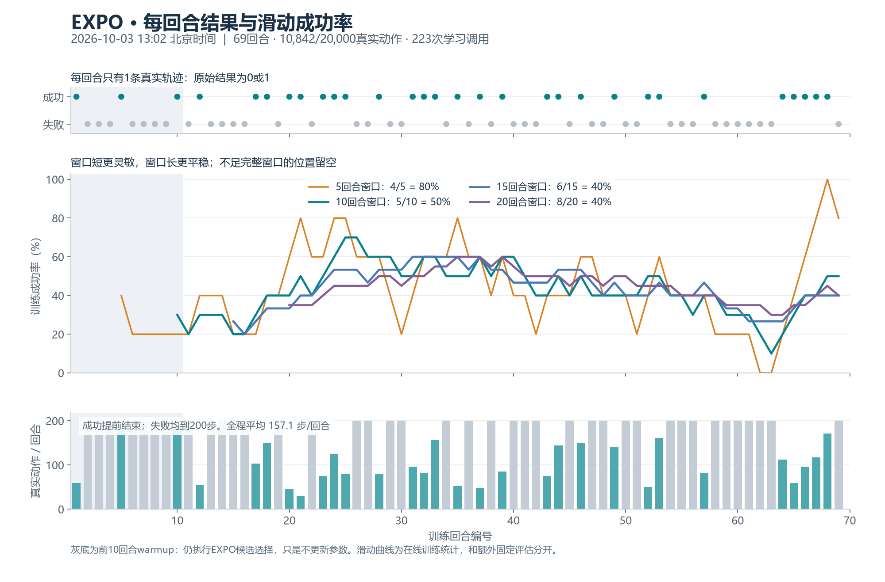
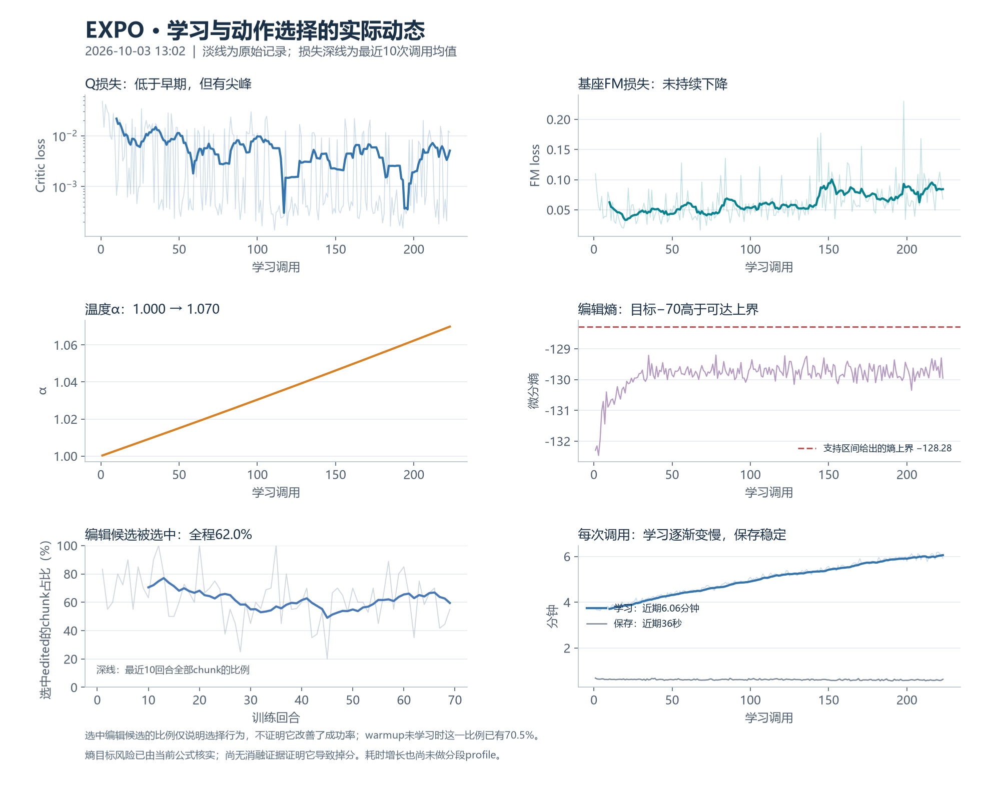

# EXPO 当前训练、采样、评估与云端审计

历史快照说明：本文保留13:02的只读测量及当时云端状态。用户后续授权的评估10与发布进展见[部署记录](EVAL10_DEPLOYMENT_20261003.md)；机制补充见[熵、四卡与采样节奏](ENTROPY_PARALLEL_20261003.md)。

证据截点：2026-10-03 13:02 北京时间。深圳2，`turn_switch`，GPU 4–7；固定 host key、chenyiteng/UID20001 校验后只读。此次新增图表、统计和本文，没有修改训练、评估频率、资源归还路由，也没有提交或推送 Git。

## 1. 当前结论与图

当前 owner/driver 存活，17 份锁定运行源码哈希核同；日志中的学习指标均有限值。完成 **69 回合、10842/20000 真实在线动作（54.21%）、223 次学习调用**；第224次调用正在执行。训练中30/69回合成功，累计43.48%。固定评估仍为45%→50%→30%，尚无稳定增益证据。

| 最近窗口 | 成功数/回合数 | 成功率 |
|---|---:|---:|
| 5回合 | 4/5 | 80% |
| 10回合 | 5/10 | 50% |
| 15回合 | 6/15 | 40% |
| 20回合 | 8/20 | 40% |

每回合只有一个训练环境的一条轨迹，所以原始结果是0/1；图中的百分数来自最近若干回合的平均。采用完整窗口，不足5/10/15/20回合时相应位置留空。相邻滑动点大量共享样本，不是独立评估；短窗口敏感，长窗口更平稳。在线训练的场景及策略会变化，不能直接当固定评估曲线。

全部训练回合实际动作数29–200，平均157.13；成功回合平均101.4，失败回合全部达到200。灰底前10回合为warmup：仍使用EXPO候选和Q选择，只是不学习。

## 2. 每轮到底采样多少，如何学习

要区分四个单位：一个真实动作、一个执行chunk、一个环境回合、一次学习调用。

1. 采集只有 **N1环境**。π0.5根据观察生成8个候选，每个模型预测H50；取前C10步、14维双臂关节动作给EXPO。
2. Editor为8个原候选各生成一个有界增量，得到8个编辑候选；共16个候选。增量各归一化维度在±0.2内，这不是物理角度/位移限制，也不是最终合成动作的±0.2限制。
3. Q集合有10个网络，抽2个取较小值作保守评分，从16个候选选1个；最多执行10个真实动作。成功提前停止，失败最多200步。因此8+8不是16条环境轨迹，4张GPU也不是N4采集。
4. 前10回合仅积累数据。之后每积累40个真实动作产生1次学习调用额度，在回合结束后集中执行，余数跨回合保留。一个200步失败回合通常产生5次调用；warmup动作不补算更新。
5. 每次调用执行Q更新20次、基座FM一次、Editor一次、温度一次，然后保存。223次调用对应4460次Q optimizer step，以及各223次FM/Editor/温度更新。

| 用途 | 每次调用的采样 | 数据来源/含义 |
|---|---|---|
| Q更新 | 20批×64个C10窗口 | 50条示范＋在线成功/失败轨迹中的合格窗口；每批重新有放回抽样 |
| 基座FM | 1批×64个H50窗口 | 示范＋在线成功轨迹；成功轨迹少于50步也没有完整H50窗口 |
| Editor/温度 | 复用最后一批Q样本 | 以历史实际动作作编辑参考，更新编辑策略及熵权重 |

1280个Q窗口是回放抽样量，可以重复、重叠，不是新收集1280个真实动作。抽样在合格窗口间均匀，因此长轨迹提供更多窗口；没有固定的demo:online比例。一次Q更新的下一状态候选需要64×8=512个基座proposal，20次共10240个proposal，这也是计算开销的来源。

边界处理：Q只抽完整、同一回合的C10窗口；成功终止在最后一步的窗口保留，碰到timeout的窗口排除。TD使用窗口内折扣奖励和下一状态候选Q，成功终止不bootstrap；不是把不足10步的尾巴补造出来。FM只用真实完整H50动作，不填充虚构动作尾巴。示范parquet没有实测reward/done，使用已核验成功示范的离线标注：前面reward0，末步reward1/terminated；在线奖励来自实际env.step。这两类奖励来源在回放记录中有区分。

## 3. 生效配置与模块作用

| 项目 | 当前实际配置 |
|---|---|
| 任务与基座 | RoboTwin Clean `turn_switch`；Sidney π0.5 RoboTwin权重 |
| 观察/动作 | 3相机；14维双臂关节；模型H50、执行C10、ODE10 |
| 数据/在线预算 | 50条Clean示范；20000真实在线动作，含warmup；无人工接管 |
| 采集/评估并行度 | 采集N1；额外固定评估N4×5组 |
| 候选/Q | 8原始＋8编辑；Q集合10、随机2取min；编辑幅度0.2 |
| 回放学习 | B64；每40个warmup后动作记1call；每call Q20/FM1/editor1/temp1 |
| 优化 | Q/editor/temp学习率3e-4；基座2.5e-5；gamma0.99、target tau0.005 |
| 基座可训练范围 | 完整action expert＋原生输入/输出/时间投影；冻结视觉/语言prefix；不用LoRA |
| 图像处理 | 等比例resize＋padding至224；按此前决定关闭图像增强 |
| 熵 | α初始1；140维编辑空间，目标熵-70；密度包括0.2缩放的Jacobian |

模块分工：基座负责产生原始动作；Q学习哪些动作具有更高后续回报；Editor通过Q梯度和熵项学习局部修改；基座本身通过成功数据的flow-matching监督更新。Q梯度不会直接穿过VLA把它变成普通SAC actor。FM loss变化同时受数据混合比例和噪声/时间抽样影响，不能直接换算为任务成功率。

实际生效值应以上述formal入口及native base合同为准；旧smoke的B4和外层遗留model.num_steps字段不代表本次B64、ODE10。

## 4. 评估是额外的吗？改为10怎么样？

是训练运行中的**独立额外评估阶段**。它会暂停采集与学习、关闭训练环境，运行固定20个Control seeds，然后恢复训练RNG继续。N4分5组，每个环境固定跑200真实动作，用success_once统计是否曾成功；每次额外4000动作，不进replay，也不计入20000训练预算。环境种子及评估动作噪声种子均固定。

| 评估位置 | 策略 | 结果 | 耗时 |
|---|---|---:|---:|
| 训练前 | raw base，单候选 | 9/20=45% | 28.28分钟 |
| 第25训练回合后 | 完整EXPO，8+8候选 | 10/20=50% | 30.64分钟 |
| 第50训练回合后 | 完整EXPO，8+8候选 | 6/20=30% | 30.75分钟 |

初评与后续评估策略不同，因此差值不能单独归因于基座FM更新。当前没有同一checkpoint下的base单候选、base八候选、完整EXPO三组消融。20样本的一个成功就对应5个百分点；45%→50%只多成功1次，50%→30%少4次，目前不能据此确认稳定改善或锁定掉分原因。

**建议诊断期每10个训练回合评估一次，仍保留20个评估样本。** 相比25回合一次，评估频率及总评估开销约为2.5倍。按本次约30.7分钟/评估，均摊每训练回合从1.23增到3.07分钟，多约1.84分钟。曲线更及时，但单个点的样本量与噪声不变；如果“10”指只测10个评估样本，分辨率会从5个百分点变成10个百分点，不建议这样减。

当前formal driver对25有硬校验，inputs/source/checkpoint合同也锁定；更改不能只编辑配置文件。要在恢复边界做明确的合同迁移，保留optimizer、replay、RNG与动作计数，并沿唯一owner处理资源归还。本次只解释取舍，未应用频率变更。

## 5. 保存其实很频繁，缺的是历史版本

截至截点已经提交295次checkpoint：1次初评、69次回合边界、223次学习调用、2次周期评估。每份约8.79GB，滚动保存latest/last1；近期单次保存约36秒。

因此恢复用的保存频率已经足够高。问题在于只有最近两版，没有独立保留第25/50回合历史checkpoint；现在不能拿那两个旧时间点补做完整消融。建议“每10回合另留一个历史版本”，与滚动恢复checkpoint分工；不要把现有恢复保存简单降为每10回合一次。历史版本会占用大盘空间，应按保留数量明确预算。

## 6. 已观察到的学习行为与风险

| 观察 | 证据 | 能说明什么 |
|---|---|---|
| 编辑候选被选中62.0% | 680/1097个真实chunk；warmup已70.5% | 编辑分支经常参与执行；不能证明编辑带来增益 |
| 基座开始利用在线成功数据 | 14272个FM窗口中3735个在线，占26.17%；最近10call为40% | 成功回流路径在生效；这不是在线成功率，也不是独立轨迹数 |
| Q loss总体低于早期 | 前10call均值0.02170，最近10为0.00509 | 对当前TD目标拟合改善；仍有尖峰，不等于任务成功率提高 |
| FM loss未持续下降 | 前10call均值0.06251，最近10为0.08426 | 混合数据/噪声/策略均在变化，不能简单据此判崩溃 |
| α持续上升 | 约1→1.0699，熵最新约-129.96 | 需要核对熵目标与编辑坐标的口径 |
| 学习调用逐渐变慢 | 前10call均值3.71分钟，最近10为6.06分钟 | 开销增长真实存在，不能用保存耗时解释 |

**熵目标的具体问题：** 编辑向量共10×14=140维，支持区间是每维[-0.2,0.2]。该区间内连续分布的最大微分熵是：

$$
H_{\max}=140\ln(0.4)\approx-128.28.
$$

当前目标-70高于这个上界，长期平均意义下无法达到，会持续推动温度增大。该口径继承作者代码默认未按edit scale调整目标的设置，不是凭日志猜出的本地新增错误。官方另有adjust_target_entropy选项；按其公式会把目标平移为-295.32，但这不等于已经验证该值适合本任务。当前α仅增长约7%，没有温度爆炸的证据，也没有消融证明这个问题导致固定评估降到30%。Editor总loss约139含较大的熵数值，单看绝对大小不能认定策略恶化。

**变慢的候选原因：** 当前replay只缓存一条episode。随机B64窗口会涉及多条轨迹，cache miss时反序列化整条在线轨迹并核验全部帧/动作等hash；回放随训练增加、没有容量淘汰。当前69份在线episode清单合计约7.04GiB，平均约104MiB/份。即使OS缓存避免物理读盘，反序列化和全帧哈希仍有CPU开销。源码支持这是高优先级排查方向，但未做加载/哈希、VLA采样、反向传播的分段计时，不能量化它解释了多少增幅。learner_seconds在checkpoint之前结束，保存约36秒且较稳定。

当前未启用训练/评估视频，也没有观看机器人动作录像；能描述的是成功/时长/候选选择/优化动态，不能断言具体是接触、对准还是末端动作失败。

## 7. 与论文和官方代码的关系

这是 **EXPO-FT的RoboTwin/action-expert移植实验**。核心候选编辑、Q选择、Q密集更新、成功数据FM路径对齐作者实现；硬件、动作合同和微调范围有明确差异，不能视作原论文任务的直接复现。

| 维度 | 论文/锁定官方实现 | 当前实验 |
|---|---|---|
| 平台 | 真机Franka/DROID示例，7维笛卡尔动作、双相机 | RoboTwin双臂14维关节、三相机 |
| 动作时间合同 | 官方OpenPI示例H16；论文执行chunk4或8 | H50/C10、ODE10，继承本地基座 |
| 基座微调 | 论文与示例采用LoRA相关配置 | 完整action expert＋小投影，不用LoRA |
| 数据收集 | 任务级少量示范，并有早期人工接管 | 50条Clean示范，无人工接管 |
| 图像增强 | 发布代码含裁剪/旋转/颜色增强 | 按此前决定关闭 |
| 学习调度 | 主文约40动作一次更新；公开pick示例另有按episode调用设置 | 40真实动作记额度，episode末集中执行 |
| 评估 | 论文每策略30次试验 | 固定20个Control seeds，每25训练回合 |
| 框架 | Flax/JAX、OpenPI | PyTorch/RLinf；视觉Q用作者结构等价实现，数值/初始化不逐位一致 |

论文中的在线交互分钟数不能等同于本次包含学习、checkpoint与额外评估的总墙钟时间。官方保留了一份未用于当前候选备份路径的base EMA；当前TD候选同样使用live base，不因为未保存这份未用EMA而改变备份行为。

另外，论文“冻结图像编码器”和发布OpenPI freeze filter的对应关系需要以实际参数梯度核实；不能仅凭freeze_pi05_encoder字段声称两边参数组完全相同。当前已核实本地冻结prefix没有梯度，可训练action expert及投影实际变化。

来源：[论文2605.25477v2](https://arxiv.org/html/2605.25477v2)、[固定官方核心](https://github.com/pd-perry/expo-ft/blob/023cf9cfcb09dab962b6e806fea47d2954b2b9bb/expo_ft/agents/alg/expo_ft.py)、[固定官方模型配置](https://github.com/pd-perry/expo-ft/blob/023cf9cfcb09dab962b6e806fea47d2954b2b9bb/configs/model/expo_ft_pi_config.py)、[固定OpenPI配置](https://github.com/pd-perry/openpi/blob/46407a41183b037313a383ff679683f2773b766d/src/openpi/training/config.py#L875)。本地已有对应pin源码供交叉核验。

## 8. 哪些已推云端

已通过git ls-remote确认修复分支远端为`0bd979f042a7e4c1f4cbe58496412b3e8aa0b944`。17/17当前运行锁定源码的SHA256与该提交的文件内容一致；本次服务器读取又确认部署文件与锁定manifest一致。

| 内容 | 状态 |
|---|---|
| 当前运行正式源码/执行入口 | 已推`codex/sz2-expo-ft-repair-20261002`，17/17逐文件核同 |
| 专题文档/轻量运行证据 | 已推15份专题Markdown＋9份轻量证据；云端最新运行证据只到10月2日12:42、2回合259动作0更新 |
| 最新讨论/行为审计 | `FORMAL_DISCUSSION_20261001.md`、`FORMAL_BEHAVIOR_AUDIT_20261001.md`尚缺于修复分支 |
| 微调范围文档 | 本地`IMPLEMENTATION_BASIS_20261001.md`已确认action expert/no LoRA；云端版本还留有未决表述 |
| 文档链接 | 云端README/CONTEXT引用FORMAL_DISCUSSION，但该文件未推，存在断链 |
| 最新图表/统计/本审计 | 本地E盘图表和本文尚未推送，不是云端自动更新 |
| 根盘迁移相关 | 本地`docs/maintenance/ROOTFS_OFFLOAD_20261002.md`及`local_scripts/expo_disk_20261002`尚未同步到该分支 |
| checkpoint、replay、完整日志 | 留在服务器；不在GitHub源码仓库持续备份 |
| main | 远端main为`fb011f7fefcff56a003f8702418058137e840ad9`，尚未包含EXPO源码与专题 |

可核验：[修复提交](https://github.com/Yutenji-Nyamu/rlinf_fastwam/commit/0bd979f042a7e4c1f4cbe58496412b3e8aa0b944)、[云端专题目录](https://github.com/Yutenji-Nyamu/rlinf_fastwam/tree/0bd979f042a7e4c1f4cbe58496412b3e8aa0b944/docs/methods/expo-ft)、[当时运行证据](https://github.com/Yutenji-Nyamu/rlinf_fastwam/blob/0bd979f042a7e4c1f4cbe58496412b3e8aa0b944/docs/methods/expo-ft/evidence/native-repair-20261002.json)。本次回答“是否已推”，未额外commit/push。

## 9. 复核入口与工作范围

- 当前scope：`/data/chenyiteng/projects/expo-ft-sz2-20261001/formal-turn-switch-repair-20261002`；owner197649/start371818311，driver2892740/start371974616。身份仅用于核对本次快照，不作为未来清理依据。
- [机器可读汇总](evidence/20261003/summary.json)、[逐回合CSV](evidence/20261003/per-episode.csv)、[只读轻量快照（附完整原始快照SHA256）](evidence/20261003/live-audit-snapshot.json)。图另有同名SVG。
- 当前源码镜像：上述快照同目录`audit-sources`，从运行机读取并与manifest核对；`train_expo_formal.py`负责cadence/保存/评估，`formal_replay.py`负责窗口/数据源，`core.py`负责候选/Q/editor/熵，`formal_eval.py`负责固定20次评估，`backend.py`负责原生π0.5接口及训练参数组。
- 可复算脚本：工作区`.tmp/expo_training_20261003/render_audit.py`。已检查回合/调用连续性、episode与chunk真实动作总数一致、全部指标有限、候选编号范围，并人工查看两张PNG布局。
- 建议次序：用10/20回合曲线观察趋势；后续诊断可采用每10训练回合固定评估并保留历史版本；优先核清熵坐标与replay耗时，再用同checkpoint消融区分base/候选选择/editor贡献。建议没有在此次只读审计中执行。
