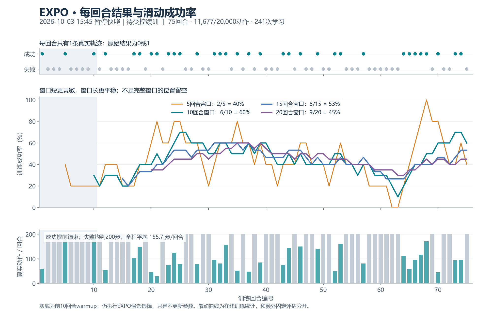
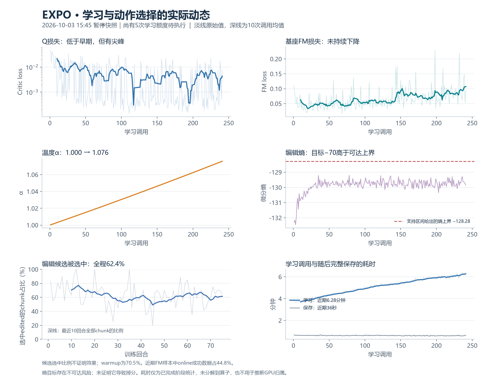

# EXPO固定评估25→10：迁移与资源续接记录

**部署报告草稿：新控制器的迁移及训练恢复仍待最终回执补齐，目前不声明eval10已恢复成功。** 2026-10-03，北京时间。本文追加执行事实；[13:02训练审计](AUDIT_20261003.md)和[熵/并行机制讲解](ENTROPY_PARALLEL_20261003.md)中的历史测量保留原时间。

## 授权变更与不变合同

用户授权把固定评估间隔从每25个训练回合改成每10个；保持20个固定评估种子、每回合200动作、N4评估，以及原latest/last1保存方式。在线仍为N1、20,000真实动作总预算、10回合warmup、每40个warmup后动作记一次学习调用、B64、Q20/FM1/editor1/temp1。熵目标、α设置、采集并行度与训练方法未在此变更中调整。

正式driver只改变评估合同检查中的两个25→10字面量；周期调度原本读取`evaluation.every_episodes`。保存函数、优化器、replay、动作计数和运行输出目录保持。迁移另外更新inputs及checkpoint外层合同；六类训练payload（base、core、replay、cadence、rng、progress）要求迁移前后完整digest相等。

## 第一次交接为何中止

15:19，旧driver按SIGTERM在提交边界退出；停止回执与完整checkpoint一致：**75回合、11,677真实动作、241次已完成学习调用，另有5次待执行额度、10动作余数**。checkpoint约8.79GB，有限性检查为true，原件保留。

交接控制器随后立即检查GPU4–7的计算进程列表，仍观察到分配，于`Old driver did not release GPU4-7`门禁中止，没有接受该次eval10合同迁移。进程退出与GPU分配消失不是同一观察时点；本次记录证明门禁触发，不把瞬时列表直接解释成驱动故障或新的训练方法问题。

原唯一资源owner继续原有归还流程。15:29，`RLT_RESTORED`、`gpu_released=true`、`rlt_first_rounds_verified=true`及四卡逐项首轮证明均已取得。旧owner把人为停止的driver退出143记录为formal失败；这不是20k训练自然完成，也不是训练指标退化的证据。[停止边界与归还轻量回执](evidence/20261003-eval10/first-attempt-and-return.json)

首次交接的旧owner/handoff实现不作为本次发布的可执行入口。原现场错误证据保留，不重放旧owner。

随后新cycle的prepare发现：这四条刚归还的RLT run尚未达到25轮保存周期，尚无新的完整checkpoint根目录，因此prepare在借卡前停止，没有再次停止任何RLT。当前处理是只读等待每条新run生成完整checkpoint后再prepare；不使用旧checkpoint回退。等待逻辑已纳入本包并通过服务器CPU检查。16:00快照中唯一新owner为4086166/start381843377，状态`WAITING_FOR_RLT_CHECKPOINTS`；四条原RLT继续运行，尚未新借卡，训练inputs实际评估间隔仍为25。[等待状态轻量回执](evidence/20261003-eval10/waiting-for-fresh-checkpoints.json)

另核对了借卡后、训练driver启动前失败的归还合同：managed进程列表为空时应标记`not_started`；driver已启动后的失败仍标记`failed`。旧CPU等待owner精确退出并归档为`attempt-2-cpu-wait-release-contract`，该次修订没有停止任何训练；当前唯一owner与最终37项检查使用本包同一版本。

## 15:45暂停截点

这组图来自15:45只读快照，**状态为暂停、等待受控续训**；不能作为恢复后推进的证明。已完成75回合、11677动作、241次学习，33/75在线成功；最近5/10/15/20回合分别为40%/60%/53.33%/45%。固定评估仍只有45%→50%→30%这三个点，第75回合评估尚无新增结果。

[指标摘要](evidence/20261003-1545/summary.json) · [逐回合CSV](evidence/20261003-1545/per-episode.csv) · [行为统计](evidence/20261003-1545/behavior-statistics.json) · [图表核验与SHA](evidence/20261003-1545/visual-qa.json)。13:02两张图仍按原时间保留在原审计中。

## 新控制路径和两条等待队列

训练目录继续使用`formal-turn-switch-repair-20261002`；新资源控制目录为同级`eval10-continuation-20261003`，独立cycle为`rlt-cycle-expo-eval10-20261003-v1`。执行次序为：

1. 核实原owner退出、GPU释放、原RLT四卡首轮全部归还；只读等待四条新run各自出现complete标记，随后由原bridge.prepare严格验证payload/合同并准备新cycle。最多等待两小时，身份变化、失败或超时即关闭本次准备；不回退旧CP。
2. 将`place_object_stand`与`move_playingcard_away`两条已完成Stage1、尚未切换clean/combo的等待队列改绑新cycle。原plan只允许改变`gates`与`old_runs`；原训练runs、源码HEAD、配置、预算和Stage1权重保持。
3. 原等待owner精确退休后，continuation取得同一`owner.lock`，保留原owner身份，另写`owner-identity-continuation.json`。校验Stage1完成、约10.02GB full weights及成功退出回执，复用已完成Stage1，不再launch/wait Stage1。
4. 两条新队列均登记且SHA核同后，新owner才借回4–7。沿既有精确RLT桥接逻辑停止目标，GPU清空后至少隔2秒再次观察为空；默认90秒有界等待，若分配再次出现则重新计空闲时间。
5. 在CPU完成合同迁移并逐payload核对，然后从原完整checkpoint恢复。训练退出后只由新owner释放其进程、续RLT并核首轮；等待队列仍按原gate/stop/launch/watch逻辑行动。

队列owner/wrapper不执行共享Ray重启、驱动操作或宽泛进程清理。单独发布这些脚本是为了复核这次固定路径的执行合同，不代表可以重放已完成的单次操作。

## 发布源码与现场部署映射

| 仓库路径 | 现场映射/用途 |
|---|---|
| [正式driver](../../../examples/embodiment/train_expo_formal.py) | 审核后暂存到新控制目录，迁移时原子替换原source下同路径 |
| [reborrow_owner.py](../../../tools/expo_eval10_20261003/reborrow_owner.py) | 新控制目录`tools/`；唯一资源owner |
| [reborrow_resources.py](../../../tools/expo_eval10_20261003/reborrow_resources.py) | 新控制目录`tools/`；沿原精确RLT bridge准备/借还 |
| [queue_continuation.py](../../../tools/expo_eval10_20261003/queue_continuation.py) | 新控制目录`tools/`；跳过已完成Stage1，继续两条等待队列 |
| [rebind_nextsix.py](../../../tools/expo_eval10_20261003/rebind_nextsix.py) | 新控制目录`tools/`；单次精确改绑与ready回执 |
| [migrate_eval10.py](../../../tools/expo_eval10_20261003/migrate_eval10.py) | 新控制目录根下；CPU合同迁移和完整原件保留 |
| [preflight_migration.py](../../../tools/expo_eval10_20261003/preflight_migration.py) | 新控制目录根下；真实checkpoint只读CPU预检，非控制器运行依赖 |

[工具包README](../../../tools/expo_eval10_20261003/README.md)记录部署映射、三份原字节测试和两份driver必须保持同SHA的约束。

模型、checkpoint、replay、完整日志和凭据不进Git。原始大文件继续保留服务器；轻量回执附原始快照SHA256便于核对。

## 已有验证与待补状态

15:59最终候选版本的服务器CPU检查已经通过：资源续接14项、队列16项、合同迁移7项，共37项，包含新checkpoint等待/超时/身份变化拒绝检查；没有初始化训练CUDA或启动额外训练。[原始CPU检查回执](evidence/20261003-eval10/cpu-tests.json) 发布测试文件与服务器已测字节一致；工具目录另保留同SHA的driver部署补丁/测试fixture，正式examples路径仍是唯一训练源码入口。

15:54另完成真实checkpoint的只读CPU预检：17项现场源码与原合同一致；latest与last1均完整读取、分别验证base/core/replay/cadence/rng/progress六类payload的既存digest，边界分别为75回合/11677动作与74回合/11477动作。latest同时核对停止回执、checkpoint回执、replay索引及零截断回合；两文件读取前后stat保持。driver补丁恰为两处字面替换，未初始化CUDA、未修改训练状态。此时原source/inputs仍为eval25，新控制器继续只读等待四条RLT的新完整CP。[真实CPU预检原始回执](evidence/20261003-eval10/migration-preflight.json)；这项预检通过尚不代表正式迁移或恢复已经发生。

| 验收项 | 此草稿状态 |
|---|---|
| 原停止checkpoint与stopped计数一致 | 已核75回合/11677动作/241调用，pending5 |
| 原资源owner归还四卡RLT并验首轮 | 已核；不是新EXPO恢复证明 |
| 借卡前真实CPU预检 | 已核17项源码、latest/last1完整六payload与75/74回合边界；未改训练状态 |
| 等待归还RLT的新完整CP | 当前WAITING_FOR_RLT_CHECKPOINTS，未借卡 |
| 新队列ready、旧队列退休且Stage1未重跑 | 等待最终回执 |
| eval10实际输入、source和checkpoint合同一致 | 等待迁移回执；driver已按原493个CRLF逐字节生成两处字面替换；实际迁移证明待补 |
| 六类训练payload、replay索引及保存方式保持 | 实现要求已检查；等待实际迁移digest |
| 新driver `resume_verified`及首个真实推进 | 等待恢复后回执 |
| 首次新间隔固定评估 | 等待运行达到新整十回合点；不补造旧评估 |
| 云端commit、远端SHA及部署源码SHA一致 | 等待最终发布，不以本草稿视作已推送 |

从75回合恢复后，先按原pending_calls补齐5次学习，再继续原轨迹序列。10回合周期的下一个整十点是80；仍需以真实事件确认，不能以配置文件代替执行证明。

补最终证据时应写明：新owner/driver身份、迁移完成时间、old/new inputs与source SHA、六payload对应digest、队列ready/plan SHA、GPU归属、首次恢复事件及首个新增学习调用或回合、后续评估实际标签与20样本结果、最后推送分支commit及远端核验结果。仅此表及追加段更新，13:02和15:00的历史图不改写为最新。
