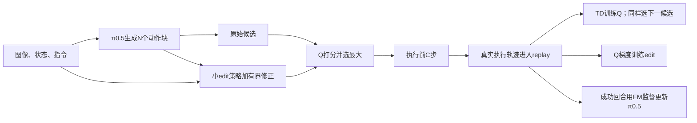

# EXPO-FT：方法、开源与我们怎样接 · 2026-10-01

结论：**适合在现有 RLinf＋RoboTwin＋π0.5 中独立实现，复用我们已跑通的环境和训练管理。核心思路清楚，但完整方法包括多候选 Q 选优与 VLA 在线监督更新，不能只把 RLT/DSRL 换一个动作 head。** 官方已有算法与真机训练闭环；论文全部任务的复现资产尚未齐。

本轮完成论文、附录、作者调参说明、官方主仓库及配套 OpenPI/DROID fork、公开 issue 和本地/深圳1源码合同审查。只读深圳1核对身份及当前源码配置；没有部署 EXPO、安装环境或启停实验。原有服务器运行路由仍以根 HANDOFF.md 为准。

## 1. 哪篇论文，效果应怎样理解

- 原版：[EXPO-FT](https://arxiv.org/abs/2605.25477)，Stanford 的 Perry Dong、Kuo-Han Hung、Tian Gao、Dorsa Sadigh、Chelsea Finn；v1 为2026-05-25，当前核查 v2 为2026-08-17。
- 来源方法：[EXPO](https://arxiv.org/abs/2507.07986)，一般 expressive policy 的 off-policy RL；EXPO-FT 将它接到 π0.5、动作块和真机干预/采集系统。
- 另外一篇：[Real-Time EXPO-FT](https://arxiv.org/abs/2609.18207)，2026-09-16。它增加延迟处理和异步实时控制，不默认纳入我们第一版 RoboTwin 实现。

原版报告8项真机任务各30/30，平均19.1分钟 **online robot data**。这是有限评估样本及有演示/人类干预的协议，时间不等于从零搭建、SFT和训练全部完成的墙钟时间，也不是 RoboTwin 上的结果。完整实验/消融位置见[论文笔记](RESEARCH_PAPER_NOTES_20261001.md)。

## 2. 方法：在 VLA 的动作附近找更好的动作

以下按当前官方发布的原版learner绘出训练闭环：

原配方每个观测生成8个 base，分别编辑一次，共16个候选，由 Q 选优。小 edit actor 在**动作空间**输出残差；Q 的梯度训练它，不穿过 VLA 的整条 denoising chain。VLA 本体继续走原生监督/flow-matching loss；当前官方发布实现默认从成功回合取base训练数据，原版论文未明确列出这个success-only开关。rollout 和 TD 的下一动作都要候选选优；这是完整算法的重要部分。[方法与附录](https://arxiv.org/html/2605.25477v2#S4)、[当前选优源码](https://github.com/pd-perry/expo-ft/blob/023cf9cfcb09dab962b6e806fea47d2954b2b9bb/expo_ft/agents/alg/expo_ft.py#L521)、[当前成功数据采样](https://github.com/pd-perry/expo-ft/blob/023cf9cfcb09dab962b6e806fea47d2954b2b9bb/expo_ft/data/batch_processor.py#L81)。

| 路线 | 小策略改什么 | 当前对应的 base 更新 |
|---|---|---|
| 我们的 RLT Stage2 | 输入 token/状态/参考块，直接输出完整动作块 | 冻结 VLA，小 actor 带 BC 正则 |
| 既有 DSRL port | 修改 **VLA生成前的32维 latent noise** | 冻结 VLA，Q训练 noise actor |
| EXPO-FT | 修改 **VLA生成后的执行动作块**，与原块共同候选选优 | 成功轨迹继续 FM 更新 base |

所以它在 SAC/replay/Q 基础设施上接近 DSRL，在动作块输出维度上接近 RLT，但三者不是同一策略参数化。我们的 RLT 小 actor 输出动作，Stage1 encoder 输出 token；两者不要混称。

## 3. 开源完整到哪一层

审查固定官方主仓库 [`023cf9cf`](https://github.com/pd-perry/expo-ft/tree/023cf9cfcb09dab962b6e806fea47d2954b2b9bb)，原方法 OpenPI fork `expo_ft@46407a4`。

| 层 | 查到的内容 | 实际边界 |
|---|---|---|
| 核心算法 | base/edit/Q、候选选优及backup、成功回合BC、replay、target和checkpoint | 可作为完整方法移植参考 |
| 运行系统 | DROID＋π0.5，同步/异步训练、采集、SFT、评估脚本 | 需要真实机器人、相机/校准、NUC控制等 |
| 任务示例 | pick/light2/dynamic_pick；原版脚本在 `scripts/pick/` | 未找到全部8任务的逐任务复现配方 |
| 数据与模型 | 基础 π0.5 的公共权重入口 | 未定位全部论文 demo/norm/SFT/最终RL checkpoint下载包；脚本内路径是待自备的本地资产 |
| 我们的环境 | 通用结构可参考 | 没有开箱即用的 RLinf/RoboTwin 接口；MuJoCo依赖不代表已提供仿真训练入口 |

因此更准确的说法是：**方法和训练闭环开源，逐任务实验资产不完整**。当前代码唯一实际 VLA wrapper 是 π0.5；不能把 upstream π0/其他配置视为 EXPO 已接好。主仓库 MIT，第三方依赖/数据/模型各有其许可。[官方 README](https://github.com/pd-perry/expo-ft/blob/023cf9cfcb09dab962b6e806fea47d2954b2b9bb/README.md)、[逐文件审计](CODE_AUDIT_20261001.md)。

## 4. 官方怎样跑；我们怎样跑更合适

官方是 Linux/DROID 真机流程，分 learner 与 robot client 两套 Python 环境：

1. clone 主仓库和原版 OpenPI/DROID forks，固定版本后分别 `uv sync`。
2. 配机器人/相机/任务/成功检测，NUC 启动 DROID server。
3. `scripts/pick/collect_data.sh` → `convert_data.sh` → `calculate_norm.sh` → `finetune_droid.sh`。
4. 对齐 SFT checkpoint、norm、任务路径；client 用 `SERVER_HOST=... bash scripts/pick/run_policy.sh`；learner 用 `bash scripts/pick/run_server.sh`，或独立选择 async。
5. `bash scripts/pick/eval_policy.sh` 评估。不要同时启动 sync/async 同一个任务。

脚本不是替我们配好的即用命令；官方示例的 GPU 编号和真机依赖也不是深圳共享机的资源安排。固定版本的完整命令及路径检查见[代码审计§4](CODE_AUDIT_20261001.md#4-原-expo-ft-官方运行路径)。

**我们的路线建议：使用官方作为算法依据，在已有 RLinf PyTorch 后端实现原版 EXPO-FT。** 继续复用 RoboTwin 自动 reset、success、canonical动作、π0.5 transforms、日志和固定评估，省去另接官方 JAX/DROID 全套系统。

最低新增范围：

- 统一 candidate sampler：rollout 与 next-state TD backup 共用；原始/edited动作在同一空间打分。
- action-space edit actor、共享可训练视觉特征的 Q/editor、ensemble/target/temperature及各自更新。
- 保留 RGB/指令/实际动作/episode-success 的 replay，能为 base 拼出 H 步真实执行序列；现有 RLT feature-only replay 不够训练 VLA。
- 成功回合 FM 更新 base、同步新 base 权重、保存完整优化器/target/replay/RNG和计数以便恢复。

这是中等规模的方法接入，需改 learner、采样与数据合同。只加 residual actor 可以成为消融，但不应标为完整 EXPO-FT。[接入文件与合同](RLINF_MAPPING_NOTES_20261001.md)。

## 5. 我们首版的预算和边界

深圳1于2026-10-01 09:56/10:03通过固定 host-key、账号UID/主机身份只读核验：源码 `55c1399a50826d61e8735a64daa2f1742f1b824f`、工作树 clean。四个现役Stage2的精确driver身份存活，actor为 `rlt_mlp_policy`、`output_activation=identity`、C10/14D；实际8环境/200动作，U5、critic:actor=2。已结束Stage1的π0.5配置另确认 `pi05_sidney_robotwin`、H50/C10、ODE10、匹配Sidney norm与canonical adapter，不能把它当现役Stage2 actor类型。此次未读取生产feature wrapper的完整调用路径；可复用的base接口按源码映射列明。现场源码取样见[上下文中的证据入口](CONTEXT.md)。

| 参数 | 含义与建议 |
|---|---|
| H/C | H是预测长度，C是实际执行长度。先继承已跑通的π0.5 H50/C10；官方代码H16/C8，照改会改变控制与计算预算 |
| 每轮N8 vs 候选N8 | 前者是8个采集环境/回合，后者是**每个观测**8份base；规模相乘，独立配置 |
| 200动作/固定评估 | 继承当前control；不是根据真机论文另换任务长度/seed |
| UTD | 官方一次update call为20 critic＋1 base FM＋1 edit/temperature；现有RLT U5/课程不能自动当EXPO默认 |
| edit scale/维度 | 单位为归一化动作，非弧度/毫米。joint/gripper和一次decode均须一致；官方pick只改xyz/gripper的Cartesian mask不能直接套14D关节下标 |
| 人类干预 | RoboTwin可先无HIL，论文有无HIL消融；明确为自动交互设置，重新验证交互预算与效果 |
| Real-Time | 同步仿真没有真实部署延迟时先接原版；RTC队列/prefix/旧新观测对齐是后续独立范围 |

[作者调参说明](https://pd-perry.github.io/posts/expo-tuning.html)建议小修正scale .01/.05/.1/.15，大探索 .4/.5/.6/.7，好的 prior 有利于学习；这些是调参线索，不是本轮拍定实验表，也不保证我们成功。16候选、TD下一候选和在线 FM 都有额外显存/计算/同步费用，不能按小MLP费用估算总成本。

需特别核查两处发布实现：

1. [Issue #1](https://github.com/pd-perry/expo-ft/issues/1)讨论 early-terminal chunk 的 valid mask；当前源码有可选处理及完整chunk解释，但默认行为仍需针对 RoboTwin 的真实执行长度、success/done/truncation核验。不能把报告直接定性为官方已确认或已修复的bug。
2. 论文写原版base视觉encoder冻结；当前源码 `freeze_pi05_encoder` 主要用于多候选共享编码采样，静态未见它落实 image 参数冻结。移植时显式列 parameter groups、检查 FM 梯度和权重变化，不能据旗标名判断。

下一次若实施，先在独立分支落完整合同，做少量高信息服务器检查：候选shape/独立noise/argmax、14→32/归一化一次、terminal边界、成功episode FM、梯度路由与fresh/resume。预算、资源和正式命令在实施前单独列明；本轮没有新实验。

## 6. 后续定位

- [专题上下文](CONTEXT.md)：固定来源、当前结论与未决问题。
- [原论文/附录](RESEARCH_PAPER_NOTES_20261001.md)：公式、干预与消融、三篇工作区别。
- [官方源码/资产/运行](CODE_AUDIT_20261001.md)：pin、源码行号、Linux真机命令、公开问题。
- [RLinf精确接缝](RLINF_MAPPING_NOTES_20261001.md)：当前/历史source分开、数据和动作合同、实施范围。
