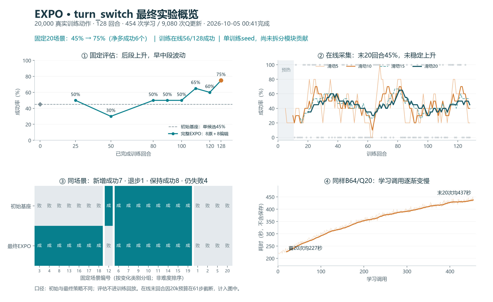
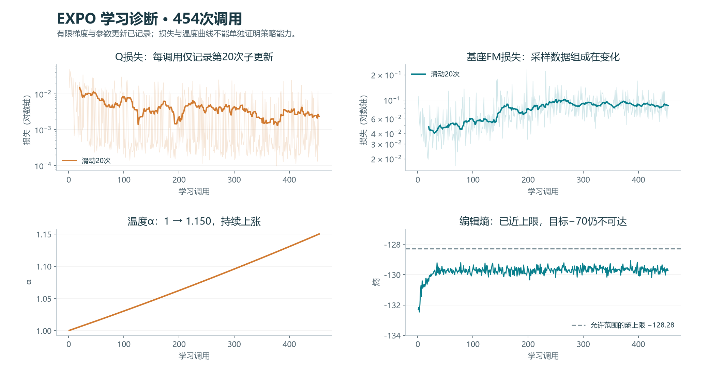

# EXPO turn_switch 最终实验复盘

现场核验：2026-10-05 17:05，北京时间。实验于当天00:41:13结束。本次只读核验产物、聚合曲线和同步轻量文档；没有改训练参数或启动新评估。本文更新10月3–4日仍在训练的结论。

**结论：工程闭环完整跑通，固定评估出现积极增益；效果来源和泛化仍待验证。** 20,000真实训练动作、128回合、454次学习全部完成，最终固定评估15/20，初始为9/20。最终模型、回放、评估记录和资源归还回执齐全。值得继续调试这套baseline，优先补效率诊断和组件评估。

## 1. 成绩怎样理解

| 已完成训练回合 | 0 | 25 | 50 | 80 | 90 | 100 | 110 | 120 | 128最终 |
|---|---:|---:|---:|---:|---:|---:|---:|---:|---:|
| 固定评估成功数/20 | 9 | 10 | 6 | 10 | 10 | 10 | 13 | 12 | 15 |
| 成功率 | 45% | 50% | 30% | 50% | 50% | 50% | 65% | 60% | **75%** |
| 已完成学习调用 | 0 | 51 | 149 | 263 | 305 | 349 | 392 | 427 | 454 |

初评用原始基座单候选，后续用完整EXPO的8个原候选＋8个编辑候选＋Q选优。**45%→75%是整体系统提升30个百分点，不能全归因于基座微调或编辑器。** 初评复用修复前已完成的同协议记录，未重复计作本轮采集。

同样20个场景逐一配对：7个失败转成功、1个成功转失败、8个保持成功、4个仍失败，净增6个。128个训练场景种子均不同，与20个评估种子无重叠。但这些评估种子被反复观察，且只有1个训练随机种子；尚无独立留出集、多训练种子或组件消融。作为样本量示意，15/20的二项Wilson 95%区间约53%–89%；配对7胜1负的探索性精确检验p≈0.070，不构成稳定泛化或因果归因证据。

评估指标是200动作内的`success_once`：曾经成功即计成功，不等于最后一帧仍维持成功。每次20场景、N4并行、4000额外动作，不进训练回放，也不占20k预算。全部9批共36,000评估动作，其中初评4000、训练后评估32,000。中途评估间隔从25回合改为10回合，所以没有60/70回合点。

在线训练56/128成功＝43.75%，最后5/10/15/20回合为20%/40%/53.3%/45%。它混合不同时间的策略和不同场景，不能直接与最终固定75%比较；也不能据此声称训练过程已稳定收敛。最后第128回合受20k总预算限制，在61动作截断且未成功，并非跑满200动作失败。

## 2. 这轮到底学了什么

可以理解为三种分工：**基座提方案，编辑器做小修正，Q负责评分挑选。** 执行后的成功奖励用于训练Q；编辑器学习让Q更高并保留一定随机性；基座从演示和在线成功片段继续做流匹配监督学习。因此基座确实在更新，但没有让成功奖励直接反向穿过整个VLA。

一个训练回合的顺序是：重置场景 → 反复生成/编辑/选动作并执行 → 提交真实轨迹 → 消费累计学习额度 → 按节点评估及保存。前10回合预热，共1827动作；之后每40真实动作积一次学习额度，回合结束后集中执行。**不是一条轨迹只学一次，也不是等攒40条轨迹。** 一条200步的后预热轨迹通常新增5次调用，回放会同时抽演示及已收集轨迹。

| 项目 | 本轮生效配置与最终计数 |
|---|---|
| 平台、任务 | 深圳2；RoboTwin clean `turn_switch`；双臂14维关节动作、3路RGB；50条成功演示 |
| 基座 | `pi05_sidney_robotwin`；原生生成H50，每次执行C10，ODE10 |
| 采样与并行 | 采集N1；评估N4；物理GPU4–7分摊模型batch和候选计算，并非同时采4条训练轨迹 |
| 候选与编辑 | 8原＋8编辑，rollout及TD下一动作均Q选优；140维编辑，每维归一化范围±0.2，非±0.2弧度 |
| Q | 联合三相机ResNetV2、GN4；10个Q，目标随机2个取min；每物理动作γ0.99、τ0.005；TD目标不加熵奖励 |
| 每次学习 | 全局B64；20次Q更新＋1次基座FM＋1次editor＋1次α |
| 总更新 | 454调用＝9080次Q、454次FM、454次editor和454次α；pending=0，余13动作不足再积一次额度 |
| 学习率 | Q/editor/α Adam 3e−4；基座AdamW 2.5e−5 |
| 基座可训练部分 | 完整action expert及动作/时间投影；FP32主参数、BF16计算；视觉/语言prefix冻结；不用LoRA |
| 数据与增强 | Q使用演示＋在线；FM使用演示＋在线成功的完整H50窗口；无图像增强/域随机化 |
| 评估与保存 | 后段每10训练回合评估20样本；每回合/学习/评估后保存，latest/last1滚动；保存频率未改 |

主要的“生成—编辑—Q选优—监督更新基座”闭环及B64、Q20、约40环境步一次调用与[EXPO-FT论文v2](https://arxiv.org/html/2605.25477v2)相符。论文采用同步采集/学习，也提供异步接口；异步是两阶段重叠，不自动等于多环境采集。当前是RoboTwin适配基线：平台、动作空间、H50/C10、可训练参数组、无人工在线纠正和关闭增强等均与作者实验有差异，不能直接对照论文成功率或把论文“在线机器人数据时间”与本轮墙钟时间相比。成功片段FM筛选的实现口径以锁定作者代码及本地实现为准，不视为论文明确规定的唯一配置。

## 3. 训练信号告诉了什么

| 信号 | 观察 | 正确解释与下一步 |
|---|---|---|
| 参数是否真学了 | 454次均记录基座采样参数变化非零；冻结prefix均无梯度；记录的学习指标均有限 | 真实更新已发生；不等于每个组件都提高成功率 |
| Q loss | 最后50调用平均0.00260 | 没见数值发散；大量低奖励样本也可使MSE低。现日志只记每调用20次Q更新的最后一次，需补排序/回报校准 |
| FM loss | 初20次均0.0479，末50次均0.0867 | 同时FM的demo占比约89.7%→45.0%，数据变了；不能单凭loss升高判定遗忘 |
| 编辑被选择 | 1246/2026个动作chunk＝61.5%；末100个66% | Q经常选编辑结果；选中率不是成功贡献，需要同候选预算评估 |
| 熵与α | α1→1.150；末50调用熵均−129.70 | 随机编辑压力在增加，未出现温度爆炸；目标尺度问题仍在 |
| 成功数据覆盖 | 在线56条成功中5条长29/45/45/46/48步，无法形成H50，未进入FM | 成功经验并非全被基座使用；较长轨迹提供更多窗口，应检查采样权重和mask语义 |

熵问题的通俗解释：编辑器有140个“小旋钮”，每个只能在±0.2范围内；当前却要求超过这个范围所能容纳的随机程度。连续熵可以为负，负号本身不是问题。

$$
H_{max}=140\ln(0.4)=-128.28 < H_{target}=-70.
$$

因此自动温度会持续增加随机编辑的权重；本轮最终α约增加15%。这个口径继承了[作者代码默认关闭的尺度校正](https://github.com/pd-perry/expo-ft/blob/023cf9cfcb09dab962b6e806fea47d2954b2b9bb/expo_ft/agents/alg/expo_ft.py)。若把未缩放空间的−70换算到当前尺度，得到−70＋140ln(0.2)≈−295.32；这是下一轮可验证的单位一致性对照，不是论文已给出的最佳探索参数。不能据此认定此前30%低点由它造成。

## 4. 时间、显存与内存

修复后的正式scope从10月2日12:37:28到10月5日00:41:13，**总跨度60小时04分**，含两次计划暂停/恢复约1.69小时。最终`complete.json`的28.24小时仅是最后一个进程段，不是整个实验耗时。

| 时间项 | 合计/变化 | 范围 |
|---|---:|---|
| 学习调用 | 44.84小时，约占总跨度75% | 不含随后的checkpoint保存 |
| 采集动作本体 | 2.98小时 | 不含reset及轨迹提交，不能当全部环境开销 |
| 初评之后8次评估 | 4.10小时 | 初评另0.47小时，发生在较早scope |
| 学习逐渐变慢 | 首20次平均227秒→末20次437秒，1.93倍 | 同样B64/Q20；说明必须量出内部耗时 |
| 保存 | 591条checkpoint提交事件；末段每次约36.8秒 | 频率高但没有等量历史快照；多数被滚动覆盖 |

训练期间已有采样：GPU4约52.2GiB、GPU5–7各37.5GiB，主进程RSS约46–47GiB；10月4日17:26时该PID历史峰值50.9GiB、swap0。它们是历史采样，不是全程精确峰值。四卡显存常驻说明模型/优化器/缓存和副本占着卡，不表示四卡一直在高利用率计算。

当前回放内存缓存`_cache_limit=1`只缓存一条**完整episode**；磁盘回放实际保留全部128条。随机取B64窗口时可能反复整条读入、反序列化、解码和校验，缓存只是减少重复工作的加速层，**不是只让模型学最后一条轨迹**。旧只读采样见读取调用量大但物理读盘增量为0，不能说已证实硬盘慢。

首先分段计时read/反序列化/校验/解码/H2D、VLA前缀/ODE、Q/FM/editor、多卡复制/同步。若数据准备占大头，再加按字节限额的缓存及预取，保持抽样ID、顺序、随机数和更新次数。候选共享冻结prefix、常驻多卡副本按profile结果排期。学习占主要时间，只增加采集并行目前未必显著加速。

## 5. 产物清单：保存了什么，能做什么

服务器根路径`R=/data/chenyiteng/projects/expo-ft-sz2-20261001`；`T=R/formal-turn-switch-repair-20261002`。此处GB用十进制，显存/RAM使用GiB。

| 产物 | 路径/大小 | 可用性与核验 |
|---|---|---|
| 最终完整训练checkpoint | `T/run/checkpoint-latest.pt`，8,787,024,772字节，约8.79GB | 最终评估后保存，128回合/20k/454调用；metadata finite=true |
| 滚动上一份checkpoint | `T/run/checkpoint-last1.pt`，8,787,023,492字节 | 00:09:55保存；两份ZIP目录各2045成员、读前后稳定 |
| 在线回放 | `T/replay`，128条轨迹＋128份manifest＋index，约13.94GB | 20,000帧；128份manifest SHA及payload存在/大小核对通过 |
| 日志与评估 | `T/run/events.jsonl`约2.10MB；9批评估记录及相应回执 | 已聚合全部回合/调用及180个评估episode；逐场景结果可查 |
| 运行目录合计 | `T/run`约17.58GB；加回放共约31.52GB | 不含原始基座、50条演示、迁移备份和其他smoke/旧任务 |
| 配置与源码 | inputs、resolved、source pins、17份锁定运行源码 | 17/17逐SHA匹配代码提交`568fd5a017597998f0c8ebe265d6f20b3e39b699` |
| 本次轻量分析 | 下方JSON、CSV、PNG/SVG及本文 | 不加载GPU模型即可查看、重绘和核对统计 |

本次验证了结构、大小、manifest、完成回执与代码身份；没有重新加载checkpoint张量，也没有重读13.94GB回放逐payload复算SHA。因此不把结构核验说成一次新的完整恢复测试。此前计划恢复有六类状态摘要一致的验收记录。

checkpoint保存基座的**可训练参数及优化器**、Q/editor/α、回放状态/随机数/调度/进度；冻结视觉语言权重仍依赖原Sidney基座，完整续训还依赖norm、演示、回放及同版源码。它不是单独拿一个`.pt`就能部署的完整独立模型，也未导出轻量推理包。相关实现见[backend state_dict](https://github.com/Yutenji-Nyamu/rlinf_fastwam/blob/568fd5a017597998f0c8ebe265d6f20b3e39b699/rlinf/algorithms/expo_ft/backend.py#L594)。

当前正式run没有MP4等视频，不能凭数值判断具体是抖动、过冲还是接触失败。回放有RGB数据，可在后续明确诊断范围时重建训练片段。没有各评估时间点的独立checkpoint；迁移备份和旧smoke/旧瓶子任务checkpoint另有保留，不能当成第25/50/110回合的可用模型。未执行清理或删除。

轻量产物：

- [汇总统计与核验范围](final_20261005/summary.json)
- [128回合及454次学习曲线数据](final_20261005/curves.json)
- [9次评估及逐场景配对](final_20261005/evaluations.json)、[配对CSV](final_20261005/paired-seeds.csv)
- [服务器产物清单与归还回执](final_20261005/artifact-manifest.json)
- [总览SVG](final_20261005/training-overview.svg)、[诊断SVG](final_20261005/learning-diagnostics.svg)

## 6. 已完成的资源交接

00:41最终评估与保存完成 → EXPO进程退出/释放4–7 → 原RLT恢复且首轮通过 → 约00:52 nextsix继续下一任务。`eval10-continuation-20261003/final.json`确认`formal_passed/gpu_released/rlt_first_rounds_verified`均为true、error为空。

17:05现场：4/5卡`place_object_stand`的clean/combo，6/7卡`move_playingcard_away`的clean/combo，均TRAINING；队列owner57232/57246和心跳正常，00:58–00:59首轮回执齐全。EXPO原owner2071616、driver2174124均已退出。

GPU0现有4个本人RLT EnvWorker图形上下文，共535MiB，无EXPO进程；GPU1–3无C/G进程。这说明RLT接续路径仍有图形绑定问题，应在其正常切换时另行修复；本次复盘未中断健康任务，也不把GPU0称为完全空闲。

## 7. 下一轮最值得做的三件事

1. **先量出并改善学习效率。** 相同B64/Q20调用已慢1.93倍，先profile和缓存/预取；方法、抽样、预算保持，验证同工作量耗时、RAM及数值差异。不要先同时增加B或采集环境数。
2. **用最终checkpoint拆效果。** 同场景测训练后基座单候选、基座＋Q、完整EXPO；解释editor贡献时补16原候选＋Q对照8原＋8编辑，并报告推理成本。再用独立场景确认是否泛化。仅比8候选和16候选不能隔离编辑收益。
3. **再做独立熵尺度实验。** 从相同起点、相同动作预算只改熵口径；记录α、编辑幅度、Q/熵梯度和成功率。动作幅度、学习率、Q20等暂不联动修改。结合失败视频及短成功采样覆盖，再决定C10、β、FM均衡或图像增强。

这些是建议，尚未执行新训练或消融。当前成果足以保留为一个可追溯的RoboTwin EXPO baseline；还不足以宣布稳定超过原始基座或复现论文水平。

## 证据及发布范围

全部计数来自终态事件/评估回执，曲线不是从截图估读。源快照SHA256：`expo-final-artifacts-20261005-1707.out`为`e391cd92afd16a96a759f5e10142c703d0602bd076492ea594041005c188383a`；`expo-final-aux-20261005-1711.out`为`4506a1cfc64b912043eb8a93402a985601240dab2ae71e57e2fb8669d10845a9`。文件名时刻仅标签，统计现场时间以payload的17:05为准。

云端发布仅包含本报告、轻量统计、图表与讨论；checkpoint、replay、原始完整日志、基座和演示留服务器。运行源码仍为`568fd5a0`，新增报告提交不改变运行源码；沿既有分支`codex/expo-gpu4567-20261003`发布，main未合入。
