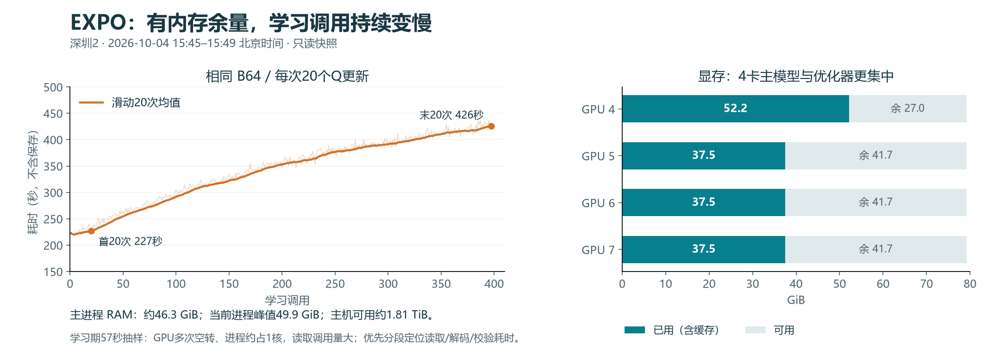

# EXPO：实现、资源与下一组实验讨论

2026-10-05发布说明：本文保留10月4日讨论，当前终态见[最终复盘](FINAL_REVIEW_20261005.md)。云端现场链接为轻量摘录与原始SHA索引；原始探针完整输出留本地。

更新：2026-10-04。现场证据为北京时间15:45–15:49；本文是只读审计和实验建议，没有改变训练配置、启停进程或执行新评估。当前健康运行接近20k预算，建议先完成本轮对照。

## 17:25刷新与基线调试优先级

17:25:48只读刷新：115回合、18282/20000真实动作（91.41%）、409次学习已保存，410执行中；在线50/115，近5/10/15/20为40%/40%/46.7%/45%。最近固定评估仍110回合13/20，120回合尚未发生。owner2071616及driver2174124身份核同、心跳4.4秒、无新failure；4–7显存仍52.17/37.52/37.52/37.52GiB，0–3无C/G进程。17:26主进程RSS46.9GiB、该PID峰值50.9GiB、swap0，主机可用约1.81TiB，根盘余39.6GiB。两条nextsix队列继续WAITING_BORROW_RETURN，尚无归还回执。

最近20次学习均430.0秒、保存36.8秒；到总预算约剩45次学习调用。按近20回合长度、一次120回合评估及一次最终评估估算，约还需7–8小时，即10月5日00:30–01:30附近；reset、学习继续变慢、成功轨迹长度都会改变该估计。

本次讨论建议的顺序：

1. **先让基线可测且数据准备有效率**：分段计时、每阶段显存/RSS、cache命中率；增加按字节限额的缓存/预取。保持原抽样ID、顺序、随机数推进和更新次数，以完整调用时间和结果一致性验收。
2. **补齐评估贡献与公平比较**：原始VLA单候选、训练后VLA单候选、训练后VLA+Q、完整EXPO。8原候选+Q与8原+8编辑的差值也含候选数量变化；若要解释editor贡献，应补16原候选+Q作为候选数控制，并分别报告VLA调用量和推理耗时（候选数相同不等于计算量相同）。同原候选加8个随机编辑可进一步区分学得编辑与随机扰动，列为有需要时的后续项。
3. **熵尺度另立一个配方对照**：保留原默认基线；新实验仅将目标改为`−D/2+D ln β`，当前D140、β0.2时为−295.32。官方配置默认关闭校正，论文没有明确指定该目标；不能将它称作已验证的最佳参数，或与工程优化一起混成一个不可解释的改进。
4. **先诊断再动FM与动作尺度**：记录成功轨迹覆盖、demo/online与episode长度分布；记录解码后各关节及夹爪编辑幅度、饱和及阈值翻转。覆盖不足才试episode均衡；物理修正过大才试β0.1。短轨迹仍不得伪造尾动作。
5. **候选共享prefix与常驻副本按profile排期**：若VLA前缀或复制占大头，再独立优化；N4采集、异步、B128、减少Q更新等改变调度/统计的项目后排。

先保持20k/200步、H50/C10/ODE10、B64、40动作/调用与Q20、8+8与Q10/min2、学习率、γ/τ、无增强、每10回合20样本及保存恢复机制。现阶段已有Q/base非零更新和完整保存证据，重点不是再重做已通过的启动验收，而是测准瓶颈和效果来源。本轮未执行新实验、改源码或服务器配置。

新快照：[17:25现场](discussion_20261004/evidence-summary.json)、[17:26内存](discussion_20261004/evidence-summary.json)。以下数字保留15:45审计时间，不混成同一快照。

## 当前结论

优先顺序：**定位学习内部的数据准备开销 → 拆开测量基座、Q筛选和编辑的贡献 → 单因素验证熵目标和编辑幅度**。现有证据不支持先同时调大学习率、batch和环境数。

- 深圳2 `turn_switch`：112回合、17916/20000真实动作、397次完整学习调用已保存，398执行中；在线48/112成功。最近5/10/15/20回合分别40%/30%/33.3%/40%。
- 固定20种子：初始单候选基座45%；完整EXPO在25/50/80/90/100/110回合为50%/30%/50%/50%/50%/65%。最新13/20是积极信号，尚不能证明稳定增益；初始与后续候选配置也不同。
- 训练owner2071616/start383438060、driver2174124/start383445252身份存活，心跳正常、无failure，17份运行源码逐SHA核同。计算和图形都在4–7；0–3无C/G进程，各1MiB底层读数。nextsix两队列仍按原资源周期等待，未触发RLT归还。
- 正式源码为 `codex/expo-gpu4567-20261003@568fd5a017597998f0c8ebe265d6f20b3e39b699`。当前控制路由仍由 `formal-turn-switch-repair-20261002/active-continuation.json` 指向 `eval10-continuation-20261003` 和 `gpu4567-fix-20261003`；不重放旧owner。

## 显存、内存与时间

| 项目 | 实测 | 判断边界 |
|---|---:|---|
| 物理GPU4 | 用52.17GiB、余27.01GiB | 主模型、优化器及汇总更集中，另有渲染 |
| 物理GPU5/6/7 | 各用37.52GiB、余41.67GiB | 四卡持有副本；不是四个采集环境 |
| EXPO主进程实际RAM | RSS约46.3GiB；该PID历史峰值49.9GiB | 12点一分钟内46.263–46.321GiB；不能外推长期无泄漏 |
| 主机内存 | MemAvailable约1.81TiB | 当前容量充足，不能将共享主机剩余量全部预算给EXPO |
| EXPO swap | 0 | 整机swap接近满与该进程不是同一件事 |
| 虚拟地址空间 | 约1.02TiB | VmSize不是实际RAM，勿当作EXPO已吃掉1TB |
| 单次学习耗时 | 首20次均227.06秒；末20次426.03秒 | 相同B64/Q20，变为1.88倍；不含保存 |
| 单次学习后的保存 | 最近20次约36.8秒 | 相对稳定；保持用户既定保存频率 |

call398中57.16秒、12次间隔约5秒的采样：4/5/6/7 GPU利用率点均值16.6%/17.3%/16.6%/11.9%，但峰值99–100%。这些是稀疏点均值，不能当作整段精确利用率或全程均值。CPU时间相当于约0.993个核；进程`rchar`增长13.55GiB、`read_bytes`增长0，说明读取调用量大，可能由页缓存、反序列化和校验消耗时间，**没有证明物理磁盘堵塞**。

第100回合评估结束到第110回合评估结束共6.367小时：学习78.74%、采集动作本体4.03%、固定评估8.08%、保存/reset等9.16%。只加速采集动作本体的收益上限约4%；reset另计，不能把这4%当所有环境开销。

`nvidia-smi`占用包含CUDA缓存及非张量上下文。后续应分采集/学习/评估/保存记录`memory_allocated`、`memory_reserved`、`max_memory_allocated`和RSS，再判断峰值或泄漏；不建议靠频繁`empty_cache()`解决当前问题。依据：[PyTorch 2.11内存说明](https://docs.pytorch.org/docs/2.11/notes/cuda.html#memory-management)。

## 当前参数与建议

| 类别 | 当前生效值 | 机制与建议 |
|---|---|---|
| 任务与预算 | clean turn_switch，14维双臂关节，三相机；20k真实动作，单回合最多200 | 保留原任务、seed和总预算；更大并发不等于各环境另给20k |
| VLA动作 | 原生H50，执行前C10，ODE10 | H50继承现有基座；C8可单独测试更频繁反馈，不能直接把模型H裁成10 |
| 候选 | 8原动作+8编辑动作，rollout和TD下一动作都Q选优 | 首先评估其独立贡献；候选4+4属于效果/成本消融 |
| 编辑幅度 | 每维归一化±0.2，10×14=140维 | 不是±0.2弧度；记录解码后每关节/夹爪改变量与饱和率，再试±0.1 |
| 温度 | 初始α1，最新1.12959；目标熵−70 | 目标在当前尺度下不可达；下轮单因素验证尺度调整 |
| Q结构 | 联合三相机ResNetV2/GN4；10个Q、目标随机2个取min；MLP256×3 | 与作者主要结构相符；不要为省算力直接10→2 |
| Q目标 | 每真实动作γ0.99，Q target τ0.005，无TD熵奖励 | 当前先保留；γ改变会改远期成功价值，需Q校准证据 |
| 优化器 | Q/editor/α各Adam 3e−4 | 当前未见发散，不优先调学习率 |
| 基座训练 | 完整action expert及动作/时间投影；视觉语言prefix冻结；FP32主参数/BF16计算 | 用户既定选择，不是LoRA；仅有遗忘证据时再比较LoRA或更小LR |
| 基座优化器 | AdamW 2.5e−5，β=(0.9,0.95)，eps1e−8，wd1e−10，clip1 | 作者OpenPI示例同LR；不能将小网络3e−4直接搬给大模型 |
| batch | Q/editor/FM全局B64；当前相关microbatch64，候选8 | 先减少GPU等数据时间；B128改变统计与成本，非首选 |
| 学习节奏 | 10回合warmup；此后每40真实动作积1额度，回合末消费；每调用20Q+1FM+1editor+1α | 不是每轨迹只学一次；200步回合通常新增5调用，即100次Q更新 |
| Q回放 | 50演示+全部在线，按合格真实物理起点均匀抽C10；无固定source比例/容量淘汰 | 记录来源、年龄、终止正奖励比例；不要凭低loss判定Q已学好 |
| FM回放 | 演示+在线成功，按完整真实H50窗口抽取 | 长成功贡献更多窗口；短于50步的成功不进入FM，见下文 |
| 图像增强/随机化 | 关闭 | 这是既定对照；轻量Q图像增强可作为后续单因素实验 |
| 并行 | 训练采集N1，评估N4；四卡分batch/候选 | 学习占绝大部分时间，先优化learner，再考虑并行采集 |
| 评估与保存 | 每10训练回合、20固定样本；额外4000动作；每回合/学习/评估后保存latest/last1 | 评估不进replay、不占20k。频率及保存不变；最终确认可另议独立种子 |

配置辨析：`inputs.model.num_steps=4`及`smoke.batch_size=4`是外层残留/历史smoke字段；当前原生后端硬合同为ODE10、formal B64，不能按这些字段误读训练。

## 学习信号：哪些已确定，哪些仍是假设

**熵目标存在确定的尺度不匹配。** 想象“每个编辑旋钮只能在−0.2到0.2间转”，要求的随机程度却超过这个盒子允许的上限。连续分布的熵可以为负；这里负数不代表坏。

$$
H_{max}=140\ln(0.4)=-128.28 < H_{target}=-70.
$$

近50调用平均熵−129.654已接近上限，α从1升到1.12959。这会持续鼓励更随机的编辑，但目前只涨约13%，没有证据证明它造成此前30%或当前波动。机制来源：[SAC自动温度论文](https://arxiv.org/abs/1812.05905)；作者代码也默认`adjust_target_entropy=False`，因此是继承的默认口径。

若−70原指未乘0.2的单位编辑空间，换到当前坐标，等价目标应为：

$$
H_{target,scaled}=-70+140\ln(0.2)=-295.32.
$$

这是单位一致性选项，不是已验证的最佳探索强度。可以与原配置做受控对照；不要同时改α、目标熵、幅度。近50编辑L2均1.393，与均匀盒噪声的RMS范数1.366接近，只支持“编辑较分散”，不能证明纯随机。`editor_loss≈146`也不能直接和Q≈0.1比大小断言熵梯度压倒Q，log-density尺度常数不贡献editor梯度；应比较两项梯度范数/夹角。

**Q未数值发散，但是否挑对动作尚未测清。** 最近50调用记录的critic loss均0.00231，Q均0.09897；日志实际只保留20次子更新的最后一次。稀疏奖励和逐物理步γ0.99下，100步后的成功折扣约0.366、200步约0.134，Q不是成功概率。之前111回合在线合格C10起点16654、带即时成功正奖励48，约0.288%；这不含demo，不能当全池正样本率。小MSE可能主要说明拟合大量低目标样本，需要验证排序和成功价值传播。

应记录每批正奖励/terminal/source比例、20次Q loss均值/最大值、冻结验证集Q与实际折扣回报、ensemble分歧、同一冻结Q下的配对`Q(a+δ)-Q(a)`。现有`q_mean`来自更新前原动作，`edit_q`来自更新后编辑动作，两者不能直接相减当编辑收益。编辑在1120/1813个chunk被选中（61.78%，最近100为56%），只是Q偏好，不是成功贡献。

**FM loss的上升伴随明显数据分布变化。** 初20平均约0.0479，最近50约0.08839；demo占比从最初20次89.69%降到最近50次46.94%（全程64.12%）。模型开始更多拟合自己采来的成功，不应直接诊断过拟合。最近更新/梯度非零，冻结prefix无梯度。

48条在线成功里，5条长29/45/45/46/48步，因没有完整H50窗口完全未进入FM。更长轨迹贡献`T−49`个窗口，容易给较慢成功更多权重。每轨迹末49个起点无法组成完整窗口，**不等于末49个动作全部没被训练**，它们仍可出现在较早窗口中。可试按episode均衡FM；要利用短成功必须验证原生FM的动作mask语义，不能伪造尾动作。

timeout仅剔除无法正确构建的末端C10窗口，其余失败数据仍可训练。终止与截断、完整窗口与补齐必须分清；公开[官方issue #1](https://github.com/pd-perry/expo-ft/issues/1)尚未给最终结论，不能回退当前保留真实终止奖励的逻辑来“对齐”。

## 效率：先改哪里更有依据

1. **CPU回放缓存。** 当前`formal_replay.py:220`只缓存1条episode；miss会整条`torch.load`、逐帧核SHA；演示图像还需解码。B64随机窗口×20Q让跨batch复用差。学习随数据池增大持续变慢与此吻合，但仍需分段计时证明占比。建议先试4–8GiB字节上限缓存、保持原抽样顺序的预取、复用已解码结果；首次内容校验及文件身份变更检测保持。缓存大小按实际峰值调整，不占满共享RAM。
2. **同一观测的候选共享VLA prefix。** 当前先重复观测8次，再分别编码图像/语言；每次TD批次64×8=512候选，每调用20次。ODE10内部已有KV缓存，缺的是候选之间共享冻结prefix。共享后8候选的动作expert计算仍保留，不能宣称全流程快8倍；Q视觉网络会更新，不能跨Q更新直接复用其旧特征。
3. **常驻多卡副本。** 当前functional DataParallel逐forward复制，主优化器在4。可评估常驻副本/DDP，保留全局B、每次Q optimizer.step、精度、随机数推进和恢复语义。[PyTorch 2.11官方说明](https://docs.pytorch.org/docs/2.11/generated/torch.nn.DataParallel.html)明确每次forward复制。不能把20次必要更新合并成一次而称等价加速。
4. **再比较环境并行、候选数、ODE、UTD。** 后三者均改变方法或行为；当前只提高采集并发预计收益有限。官方async主要是采集与学习重叠，不自动等于N环境，也不保证比同步快。

下一次正常实验切换可做短profile，分`read/deserialize/hash/decode/H2D`、`prefix/ODE`、`Q backward/FM/editor`、多卡复制/同步、保存计时，并记allocator峰值与cache命中率。CUDA异步段用event或明确同步边界；不把长Profiler挂在正式训练上。参考[Profiler官方教程](https://docs.pytorch.org/tutorials/recipes/recipes/profiler_recipe.html)。

## 与论文、官方和相邻研究的关系

[EXPO-FT论文v2](https://arxiv.org/html/2605.25477v2)与[官方代码](https://github.com/pd-perry/expo-ft/tree/023cf9cfcb09dab962b6e806fea47d2954b2b9bb)支持当前主要闭环：候选生成、受限编辑、Q挑选、监督更新基座，以及B64、Q10/min2、每调用Q20等选择。成功轨迹筛选以锁定发布实现为依据，论文未明确该开关。论文方法表的40环境步/调用与当前一致；README另建议约20–30步/调用，属于不同推荐口径，不能机械互换。

关键平台差异包括双臂14关节/三相机与作者DROID接口，原生H50/C10与论文部分设置H16/C4或8，当前完整action expert与作者LoRA相关配置，关闭增强与作者训练增强，以及任务演示、人类纠正与种子/评估数量的差异。向论文靠拢应分别测试这些因素，不能直接套末端动作掩码到14维关节。

两处容易误判的源码细节：

- 官方配置使用Gemma LoRA变体，base LR同为2.5e−5；但冻结过滤器没有匹配SigLIP图像参数，不能简化成“官方只训练LoRA”。当前参数组不同，所以相同LR不代表相同更新强度；也不构成必须立即降LR的证据。
- 官方维护`actor_tau=.001`的base EMA，但锁定版本实际rollout和TD下一动作都调用live actor参数，没有发现EMA参与此路径。当前没有维护这份EMA，不能据此认定遗漏了已生效的target-VLA机制；接入EMA属于新行为实验。

当前Q骨干已经是联合相机ResNetV2：官方两视角拼6通道，当前三视角拼9通道；保留GN4、空间flatten等主要结构。不是各相机一套独立ResNet，无需重复提出“改联合编码”。

相邻研究提供的是可测假设：

- [原EXPO](https://arxiv.org/html/2507.07986v3)：较强先验下可考虑更小编辑幅度，支持0.2→0.1的单因素实验。
- [REDQ](https://arxiv.org/abs/2101.05982)及[官方仓库](https://github.com/watchernyu/REDQ)：多Q、随机子集min、高更新率相互配合，降低Q数量/更新率需一起审视偏差与成本。
- [RLPD](https://arxiv.org/abs/2302.02948)及[代码](https://github.com/ikostrikov/rlpd)：离线/在线平衡混合可作数据组成对照；50:50不是EXPO必须遵循的官方默认。
- [DrQ](https://arxiv.org/abs/2004.13649)及[代码](https://github.com/denisyarats/drq)：支持研究像素Q的轻量增强；当前开关目标小，应先确认裁剪/平移不丢失关键目标。
- [官方async入口](https://github.com/pd-perry/expo-ft)：适合评估采集学习重叠成本；本任务不因存在async就需要立刻改写调度。

## 建议的少量实验与判据（未执行）

| 顺序 | 具体问题 | 对照与判据 |
|---|---|---|
| 0 | 完成当前基线 | 原配置结束；保护最终完整CP和固定评估，保留现有RLT归还链 |
| 1 | 是基座、Q还是editor有用 | 同一最终CP/固定种子测训练后base单候选、base8+Q、完整8+8；再用原始base配同一冻结Q/editor做诊断，明确分布混合限制。重复/独立种子确认需另列额外评估预算 |
| 2 | 等数据是否主要瓶颈 | 缓存/预取只改工程因素；同抽样引用、noise、更新顺序比较短段输出及参数变化，测wall time/RSS/峰值显存 |
| 3 | 熵尺度是否损害探索利用 | 共同起点、种子、动作预算：原目标 vs 尺度一致目标，其他参数固定；记录α/熵、实际编辑、Q/熵梯度和成功率 |
| 4 | 编辑是否过大 | 在选定同一熵口径下只比较β0.2与0.1；同步定义与β一致的目标坐标，避免把单位变化混成效果 |
| 5 | 需更快反馈或更强泛化吗 | 分开比较C10→8、轻量Q图像增强；先看失败视频是迟滞/越过目标、视觉偏差还是错误排序 |
| 6 | 是否值得少学/多学 | Q20→10测试每小时收益与每动作收益；40动作/调用→20则增加学习量，是不同实验。不要同时改两者 |

对每个方法实验同时报告固定协议成功率、真实动作数、墙钟时间和GPU小时；初筛后再用多个训练seed（例如3个）确认。20固定种子适合追踪，反复用它选参数会产生调参偏差；最终独立50–100场景可作为后续预算讨论，不能当作本轮已授权执行。

行为判断仍缺视频证据：训练和评估主video保存开关为false，没有在本轮凭画面确认卡住、抖动或过冲。下一次诊断应选同seed成功/失败对，联合查看关节编辑幅度、饱和、Q排序及目标接触过程，再决定控制频率和幅度。

## 本地证据

- [只读现场快照](discussion_20261004/evidence-summary.json)，SHA256 `dd64fd4159f9916361a71ce6ae356001464ea252804034ed0d81c4b17fb5158c`。
- [内存明细](discussion_20261004/evidence-summary.json)，SHA256 `84742b0c6ae918d28b05454c0d4aa085025560b666a83446ac7ed2a9d2e532fb`。
- [聚合JSON](discussion_20261004/analysis.json)与[SVG图](discussion_20261004/efficiency-memory.svg)。
- 当前实现：[formal_replay.py](https://github.com/Yutenji-Nyamu/rlinf_fastwam/blob/568fd5a017597998f0c8ebe265d6f20b3e39b699/rlinf/algorithms/expo_ft/formal_replay.py)、[core.py](https://github.com/Yutenji-Nyamu/rlinf_fastwam/blob/568fd5a017597998f0c8ebe265d6f20b3e39b699/rlinf/algorithms/expo_ft/core.py)、[backend.py](https://github.com/Yutenji-Nyamu/rlinf_fastwam/blob/568fd5a017597998f0c8ebe265d6f20b3e39b699/rlinf/algorithms/expo_ft/backend.py)。

10月4日讨论时未修改服务器；本文和图表随10月5日最终复盘发布。运行源码仍为568fd5a0。
