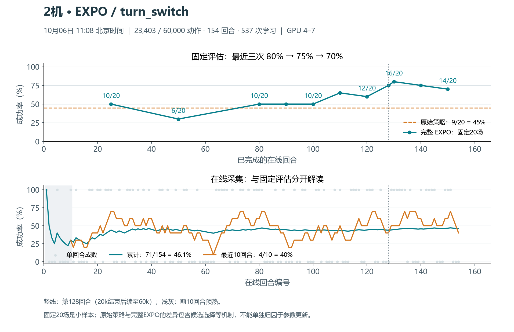

# EXPO最近尝试与云端同步核对 · 2026-10-06

2026-10-06 11:25发布核对：20k复盘和60k续训已在云端；补充今天曲线、学习日志摘录及CPU准备/回放修复/RLT暂停回执。现场23472/60000动作、155回合、539次学习已保存，固定130/140/150回合为16/20、15/20、14/20；原owner及4–7绑定保持，RLT候补。17份运行源码核同，本次仅补文档和轻量证据。[发布核对与产物](SYNC_20261006.md)。

| 内容 | 核对结果 |
| --- | --- |
| 早期smoke、正式运行、原生关闭修复、eval25→10、GPU4–7绑定 | 相关源码、方法解释和轻量证据已在EXPO分支历史中 |
| 20k完整结果及优化讨论 | 已推`5ba2f611`，包含128回合、20,000动作、454次学习和最终15/20 |
| 本次20k→60k续训 | 已推`c835e62e`，含预算迁移、回放ctime修复代码、候补RLT控制和启动验收 |
| 10月6日训练进展、曲线、连续学习记录 | 本次补入，见下方文件 |
| CPU准备中止与修复、双checkpoint迁移、RLT暂停原始小回执 | 本次补入，补全之前只有概要的过程证据 |

## 当前现场

- 2026-10-06 11:25：155回合、23472/60,000真实训练动作、539次学习已提交；checkpoint `finite=true`，owner/driver存活，采样时心跳6.7秒。
- 固定同20种子评估：130回合16/20、140回合15/20、150回合14/20。原始raw-base9/20与完整EXPO含候选选择等差别，不能把差距全归因于参数学习。
- 物理4–7运行，0–3无计算/图形进程；RLT继续低优先级候补。当前控制仍为`continue-60k-20261005`，本次没有启停任务、修改源码或调整训练参数。
- 今天图表的截点为11:08（154回合、23,403动作、537次学习）；现场JSON的截点为2026-10-06 11:25。两者明确分开，不把不同时间拼成一个快照。

## 补入的轻量产物

- [完整SVG](figures/20261006/expo-training.svg)、[在线回合CSV](evidence/20261006/online-1108.csv)、[固定评估CSV](evidence/20261006/fixed-eval-1108.csv)、[图表统计与原始快照SHA](evidence/20261006/chart-summary-1108.json)。
- [当前状态、17份源码校验和远端分支](evidence/20261006/live-status.json)、[全部固定评估逐场结果](evidence/20261006/evaluations.json)。
- [本次续训事件原文摘录](evidence/20261006/continuation-events.jsonl)：143条，保留恢复、真实回合、学习指标和固定评估；去掉重复的回放文件清单。学习调用455–539连续，共85次；另有[学习指标CSV](evidence/20261006/learner-metrics.csv)。
- [准备与修复原始小回执](evidence/20261006/preparation-receipts.json)：7项CPU检查、20k→60k双checkpoint迁移、256个文件内容校验与128个ctime字段修复、借卡前主动中止记录、四路RLT暂停证明。该中止发生在GPU借用前，不是EXPO训练崩溃。
- [本次发布清单与SHA](evidence/20261006/artifact-manifest.json)。

## 核对边界

本地部分旧专题与云端文本不同，主要是云端已经修正相对链接、补全执行回执及标注历史时点；保持云端完整版本，未用旧本地短说明覆盖。60k运行17份锁定源码全部匹配，源码没有需要补推的变化。本次同一分支追加文档和证据；`main`仍未合入EXPO。

服务器完整事件日志约2.39MiB、driver日志约446KiB，保留原路径，云端发布可检索的相关事件摘录。checkpoint、模型、回放及原始大产物不上传GitHub。本次SSH/Git凭据、运行environment均未打包。
