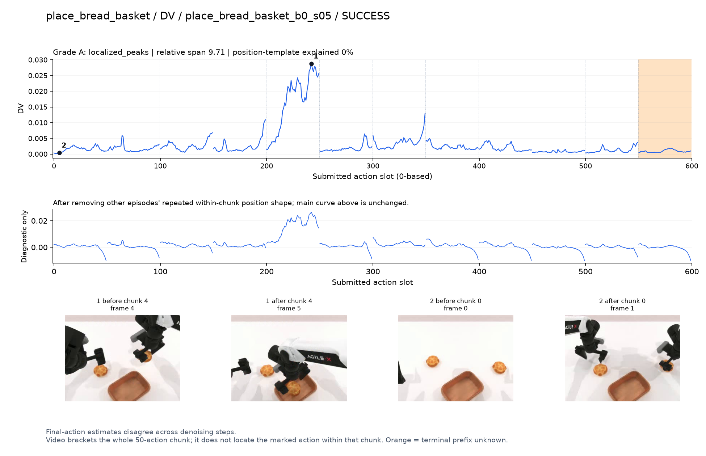
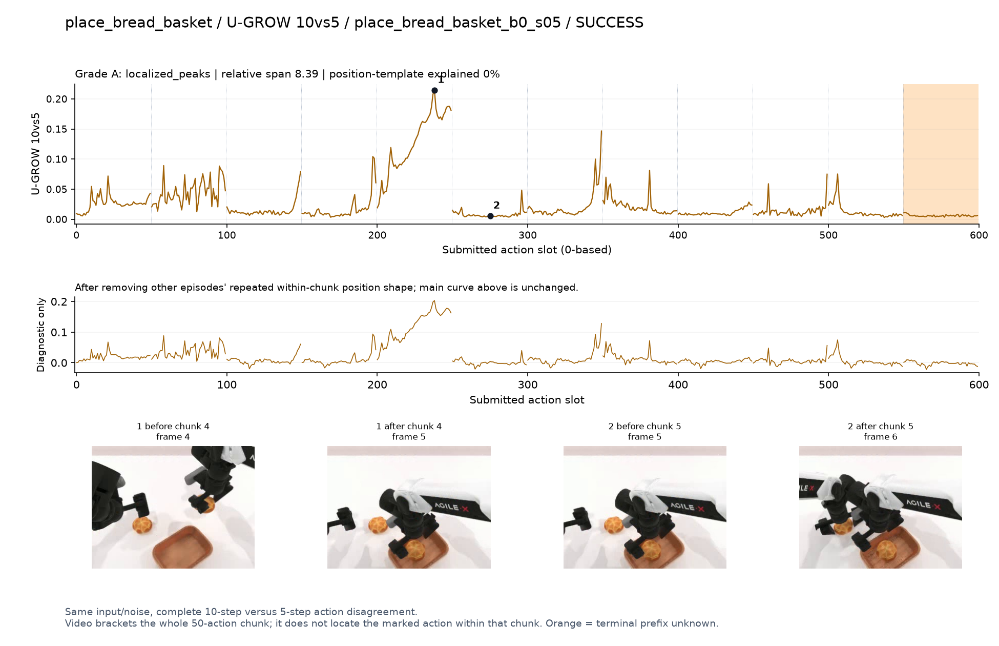
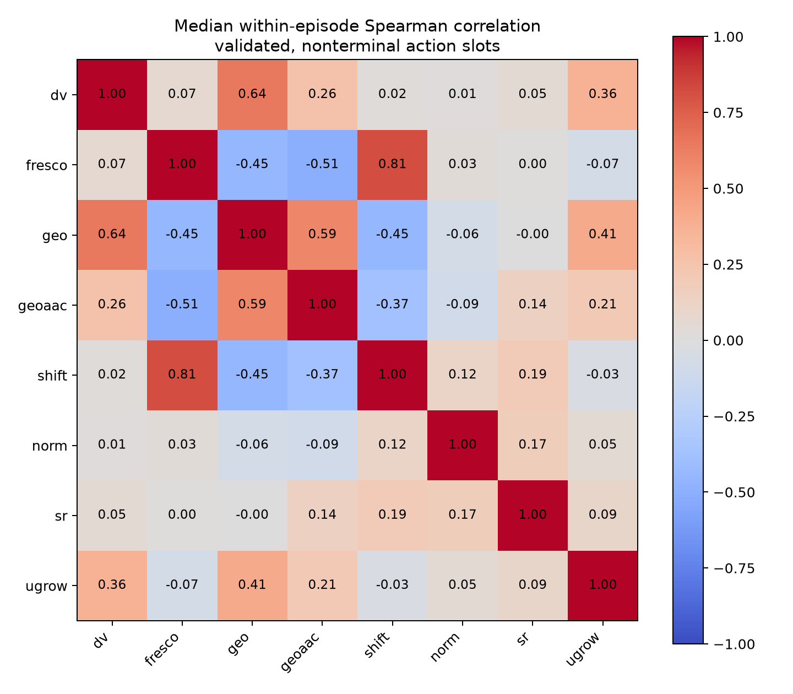
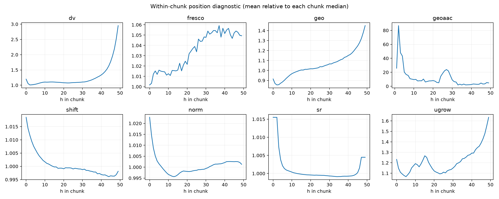

# 七信号＋DV：完整可视化图册

2026-10-04。直接在GitHub查看，不依赖本地SSH隧道。50任务×8信号共400项，其中46任务有368组曲线与帧；其余32项明确缺数据。

**先看下方八个代表例子，再按任务或信号展开。** 允许局部峰、宽高区和阶段转换；可解释候选不代表统计显著或训练收益。

主图保留逐动作原始值；细虚线为chunk边界，橙色为终止段实际执行长度不明，未用于筛选。帧只对应chunk前后，不能精确定位某个h的接触瞬间。A/B/C是形态筛选等级，优先读人工备注。

[计算定义与限制](METHOD.md) · [全部逐项看图备注](REVIEW.md) · [400项筛选表](selection_reviewed.csv) · [文件校验清单](VISUAL_MANIFEST.json) · [原离线HTML入口](START.html)

HTML保留原图册，可在服务器或完整取出此目录后使用；GitHub在线浏览优先使用本Markdown目录。NPZ、原视频、模型权重未包含在此发布中。

## 按信号看

[DV](signals/dv.md) · [Fresco-tail5](signals/fresco.md) · [GEO-full](signals/geo.md) · [GeoAAC-growth](signals/geoaac.md) · [SHIFT](signals/shift.md) · [Tell-Tale Norm](signals/norm.md) · [SR-window5](signals/sr.md) · [U-GROW 10vs5](signals/ugrow.md)

## 代表例子

### DV · place_bread_basket

**可解释候选**：优先候选：q4持面包移入篮子时单个主高区，同轨迹GEO/U-GROW也响应。

[任务八信号对照](tasks/place_bread_basket.md) · [PNG](../visualizations/figures/place_bread_basket/dv.png) · [SVG](../visualizations/figures/place_bread_basket/dv.svg)

### Fresco-tail5 · place_object_basket

**受其他因素影响**：阶段候选但混杂强：q2/q3存在清楚宽峰，和物体入篮同时发生，仍主要测路径长度。

[任务八信号对照](tasks/place_object_basket.md) · [PNG](../visualizations/figures/place_object_basket/fresco.png) · [SVG](../visualizations/figures/place_object_basket/fresco.svg)

### GEO-full · handover_mic

**可解释候选**：候选：q2两手相遇段出现主峰，q1搬运段较低。

[任务八信号对照](tasks/handover_mic.md) · [PNG](../visualizations/figures/handover_mic/geo.png) · [SVG](../visualizations/figures/handover_mic/geo.svg)

### GeoAAC-growth · handover_mic

**可解释候选**：阶段候选：q2交接动作前缀增长较大，需保留前缀含义。

[任务八信号对照](tasks/handover_mic.md) · [PNG](../visualizations/figures/handover_mic/geoaac.png) · [SVG](../visualizations/figures/handover_mic/geoaac.svg)

### SHIFT · place_object_basket

**受其他因素影响**：阶段候选但混杂强：与Fresco同轨迹入篮时宽高区，不足以证明是语义难度。

[任务八信号对照](tasks/place_object_basket.md) · [PNG](../visualizations/figures/place_object_basket/shift.png) · [SVG](../visualizations/figures/place_object_basket/shift.svg)

### Tell-Tale Norm · place_object_basket

**可解释候选**：优先阶段候选：q2/q3持物越过篮口并放入时宽高区，之后回落。

[任务八信号对照](tasks/place_object_basket.md) · [PNG](../visualizations/figures/place_object_basket/norm.png) · [SVG](../visualizations/figures/place_object_basket/norm.svg)

### SR-window5 · pick_dual_bottles

**可解释候选**：候选：q1中间提瓶附近局部峰，较少依赖边界。

[任务八信号对照](tasks/pick_dual_bottles.md) · [PNG](../visualizations/figures/pick_dual_bottles/sr.png) · [SVG](../visualizations/figures/pick_dual_bottles/sr.svg)

### U-GROW 10vs5 · place_bread_basket

**可解释候选**：优先候选：与DV同轨迹q4移入篮子高区。

[任务八信号对照](tasks/place_bread_basket.md) · [PNG](../visualizations/figures/place_bread_basket/ugrow.png) · [SVG](../visualizations/figures/place_bread_basket/ugrow.svg)

## 全部任务

正式验收1424条、751成功。shake_bottle为重复实际种子的补充数据；move_stapler_pad与place_dual_shoes只有失败例。缺数据项不补造图片。

| 任务 | 可用信号 | 数据情况 |
|---|---:|---|
| [adjust_bottle](tasks/adjust_bottle.md) | 8/8 | 成功候选 |
| [beat_block_hammer](tasks/beat_block_hammer.md) | 8/8 | 成功候选 |
| [blocks_ranking_rgb](tasks/blocks_ranking_rgb.md) | 8/8 | 成功候选 |
| [blocks_ranking_size](tasks/blocks_ranking_size.md) | 8/8 | 成功候选 |
| [click_alarmclock](tasks/click_alarmclock.md) | 8/8 | 成功候选 |
| [click_bell](tasks/click_bell.md) | 8/8 | 成功候选 |
| [dump_bin_bigbin](tasks/dump_bin_bigbin.md) | 8/8 | 成功候选 |
| [grab_roller](tasks/grab_roller.md) | 8/8 | 成功候选 |
| [handover_block](tasks/handover_block.md) | 8/8 | 成功候选 |
| [handover_mic](tasks/handover_mic.md) | 8/8 | 成功候选 |
| [hanging_mug](tasks/hanging_mug.md) | 8/8 | 成功候选 |
| [lift_pot](tasks/lift_pot.md) | 8/8 | 成功候选 |
| [move_can_pot](tasks/move_can_pot.md) | 8/8 | 成功候选 |
| [move_pillbottle_pad](tasks/move_pillbottle_pad.md) | 8/8 | 成功候选 |
| [move_playingcard_away](tasks/move_playingcard_away.md) | 8/8 | 成功候选 |
| [move_stapler_pad](tasks/move_stapler_pad.md) | 8/8 | 失败候选 |
| [open_laptop](tasks/open_laptop.md) | 0/8 | 缺完整数据 |
| [open_microwave](tasks/open_microwave.md) | 8/8 | 成功候选 |
| [pick_diverse_bottles](tasks/pick_diverse_bottles.md) | 8/8 | 成功候选 |
| [pick_dual_bottles](tasks/pick_dual_bottles.md) | 8/8 | 成功候选 |
| [place_a2b_left](tasks/place_a2b_left.md) | 8/8 | 成功候选 |
| [place_a2b_right](tasks/place_a2b_right.md) | 8/8 | 成功候选 |
| [place_bread_basket](tasks/place_bread_basket.md) | 8/8 | 成功候选 |
| [place_bread_skillet](tasks/place_bread_skillet.md) | 8/8 | 成功候选 |
| [place_burger_fries](tasks/place_burger_fries.md) | 8/8 | 成功候选 |
| [place_can_basket](tasks/place_can_basket.md) | 8/8 | 成功候选 |
| [place_cans_plasticbox](tasks/place_cans_plasticbox.md) | 8/8 | 成功候选 |
| [place_container_plate](tasks/place_container_plate.md) | 8/8 | 成功候选 |
| [place_dual_shoes](tasks/place_dual_shoes.md) | 8/8 | 失败候选 |
| [place_empty_cup](tasks/place_empty_cup.md) | 8/8 | 成功候选 |
| [place_fan](tasks/place_fan.md) | 0/8 | 缺完整数据 |
| [place_mouse_pad](tasks/place_mouse_pad.md) | 8/8 | 成功候选 |
| [place_object_basket](tasks/place_object_basket.md) | 8/8 | 成功候选 |
| [place_object_scale](tasks/place_object_scale.md) | 0/8 | 缺完整数据 |
| [place_object_stand](tasks/place_object_stand.md) | 8/8 | 成功候选 |
| [place_phone_stand](tasks/place_phone_stand.md) | 8/8 | 成功候选 |
| [place_shoe](tasks/place_shoe.md) | 8/8 | 成功候选 |
| [press_stapler](tasks/press_stapler.md) | 8/8 | 成功候选 |
| [put_bottles_dustbin](tasks/put_bottles_dustbin.md) | 8/8 | 成功候选 |
| [put_object_cabinet](tasks/put_object_cabinet.md) | 0/8 | 缺完整数据 |
| [rotate_qrcode](tasks/rotate_qrcode.md) | 8/8 | 成功候选 |
| [scan_object](tasks/scan_object.md) | 8/8 | 成功候选 |
| [shake_bottle](tasks/shake_bottle.md) | 8/8 | 补充：重复实际种子 |
| [shake_bottle_horizontally](tasks/shake_bottle_horizontally.md) | 8/8 | 成功候选 |
| [stack_blocks_three](tasks/stack_blocks_three.md) | 8/8 | 成功候选 |
| [stack_blocks_two](tasks/stack_blocks_two.md) | 8/8 | 成功候选 |
| [stack_bowls_three](tasks/stack_bowls_three.md) | 8/8 | 成功候选 |
| [stack_bowls_two](tasks/stack_bowls_two.md) | 8/8 | 成功候选 |
| [stamp_seal](tasks/stamp_seal.md) | 8/8 | 成功候选 |
| [turn_switch](tasks/turn_switch.md) | 8/8 | 成功候选 |

## 全量诊断

以下相关图使用正式轨迹非终止部分的轨迹内相关中位数；位置图则含所有提交槽位。详细范围见METHOD。

