# DV：全部任务

[返回总目录](../README.md)

主图保留逐动作原始值；细虚线为chunk边界，橙色为终止段实际执行长度不明，未用于筛选。帧只对应chunk前后，不能精确定位某个h的接触瞬间。A/B/C是形态筛选等级，优先读人工备注。

| 任务 | 原始曲线缩略图 | 复核 |
|---|---|---|
| [adjust_bottle](../tasks/adjust_bottle.md) | [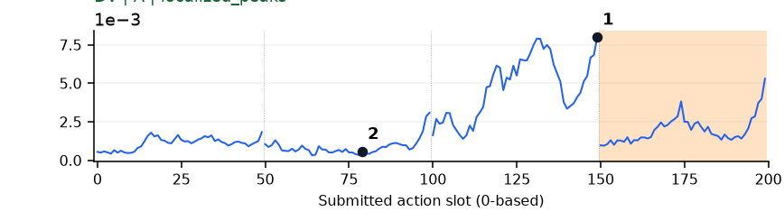](../figures/adjust_bottle/dv.png) | 可解释候选：候选：q2瓶身由横向转为竖直；峰在该chunk后段。 |
| [beat_block_hammer](../tasks/beat_block_hammer.md) | [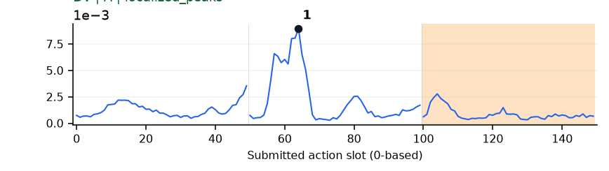](../figures/beat_block_hammer/dv.png) | 可解释候选：候选：q1由抓住锤柄到举锤/朝方块移动，局部峰清楚。 |
| [blocks_ranking_rgb](../tasks/blocks_ranking_rgb.md) | [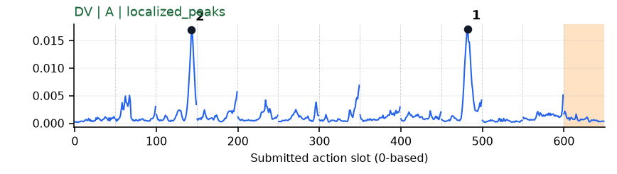](../figures/blocks_ranking_rgb/dv.png) | 可解释候选：候选：q2/q9抓取或移动不同颜色方块，各有清楚峰。 |
| [blocks_ranking_size](../tasks/blocks_ranking_size.md) | [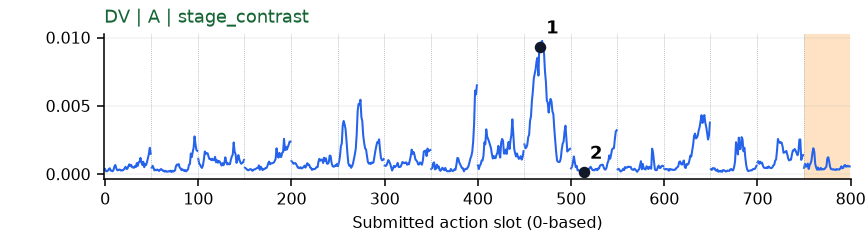](../figures/blocks_ranking_size/dv.png) | 可解释候选：候选：q9操作小方块时有主要峰，另有多次小峰。 |
| [click_alarmclock](../tasks/click_alarmclock.md) | [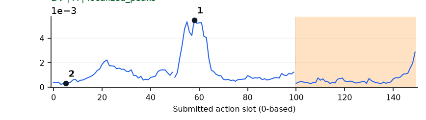](../figures/click_alarmclock/dv.png) | 可解释候选：候选：q1手指靠近闹钟上部时局部峰；画面不能证实按下瞬间。 |
| [click_bell](../tasks/click_bell.md) | [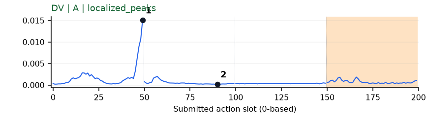](../figures/click_bell/dv.png) | 可解释候选：候选：q0手从远处到铃上方，末段集中峰。 |
| [dump_bin_bigbin](../tasks/dump_bin_bigbin.md) | [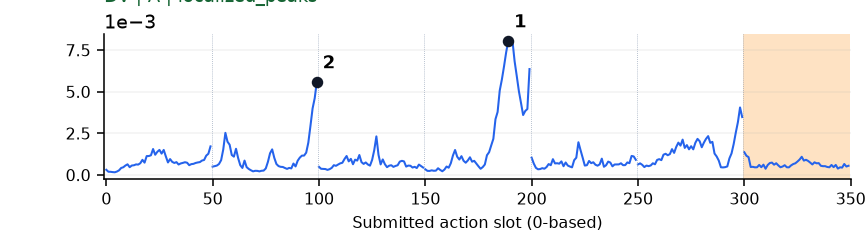](../figures/dump_bin_bigbin/dv.png) | 可解释候选：候选：q1/q3抬起或放回小容器阶段出现两个峰；大垃圾桶部分出画。 |
| [grab_roller](../tasks/grab_roller.md) | [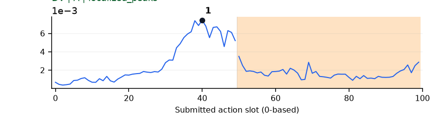](../figures/grab_roller/dv.png) | 可解释候选：候选：q0双手接近滚筒的后半段升高。 |
| [handover_block](../tasks/handover_block.md) | [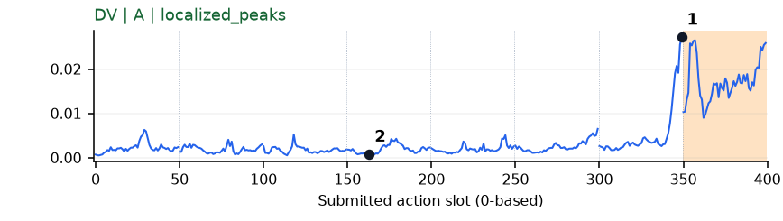](../figures/handover_block/dv.png) | 可解释候选：候选：q6两只夹爪在持块区域相遇前升高；终止后高值单独标橙。 |
| [handover_mic](../tasks/handover_mic.md) | [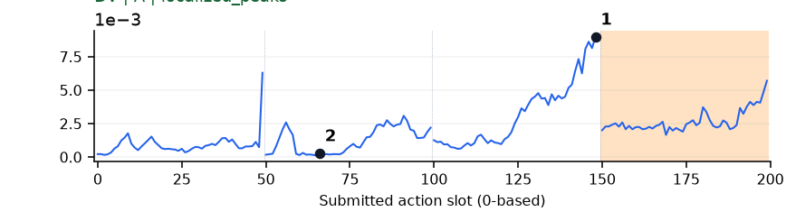](../figures/handover_mic/dv.png) | 可解释候选：候选：q2两手接近并交接麦克风时升高。 |
| [hanging_mug](../tasks/hanging_mug.md) | [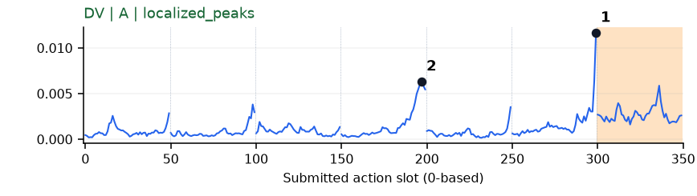](../figures/hanging_mug/dv.png) | 可解释候选：候选：q3/q5持杯旋转、向挂架移动段升高；峰贴近chunk末端。 |
| [lift_pot](../tasks/lift_pot.md) | [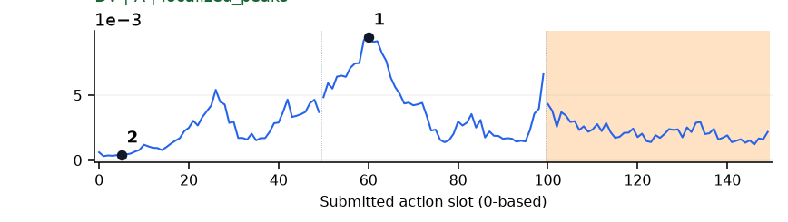](../figures/lift_pot/dv.png) | 可解释候选：候选：q1双手对准锅两侧手柄时峰清楚。 |
| [move_can_pot](../tasks/move_can_pot.md) | [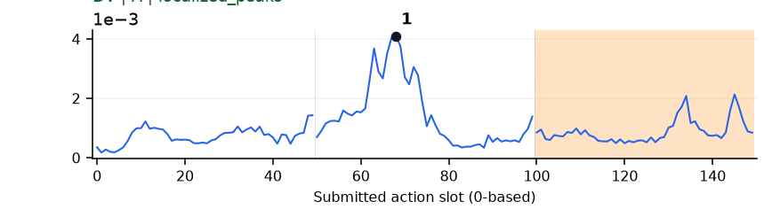](../figures/move_can_pot/dv.png) | 受其他因素影响：谨慎：q1峰清楚，但罐和手在画面右缘，语义证据不足。 |
| [move_pillbottle_pad](../tasks/move_pillbottle_pad.md) | [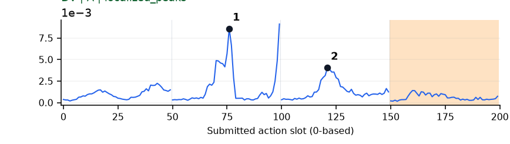](../figures/move_pillbottle_pad/dv.png) | 可解释候选：候选：q1提瓶、q2移向垫子有两个局部高区。 |
| [move_playingcard_away](../tasks/move_playingcard_away.md) | [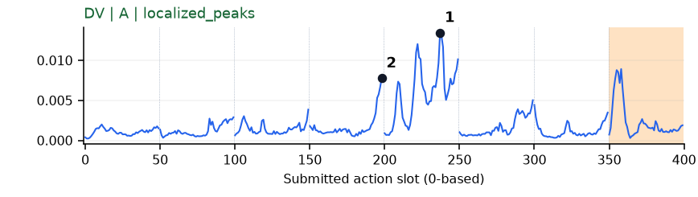](../figures/move_playingcard_away/dv.png) | 较弱：形态清楚但语义弱：q3/q4画面里的纸牌几乎不变，手在边缘。 |
| [move_stapler_pad](../tasks/move_stapler_pad.md) | [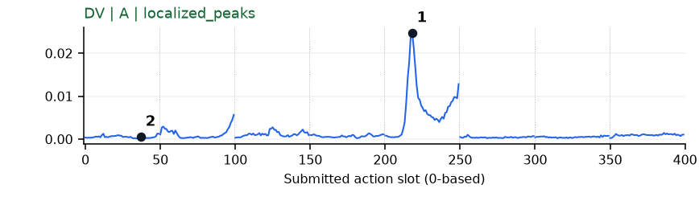](../figures/move_stapler_pad/dv.png) | 【失败例】可解释候选：失败例候选：q4手持订书机在垫子附近操作时孤立强峰。 |
| [open_laptop](../tasks/open_laptop.md) | 无完整数据 | 缺数据：该任务未取得完整可复算批次。 |
| [open_microwave](../tasks/open_microwave.md) | [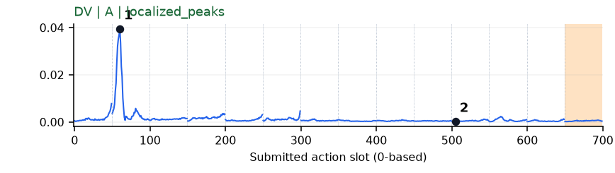](../figures/open_microwave/dv.png) | 可解释候选：候选：q1抓住门侧并拉动时孤立强峰。 |
| [pick_diverse_bottles](../tasks/pick_diverse_bottles.md) | [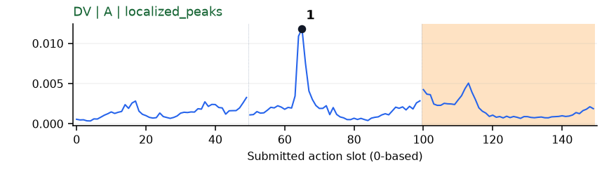](../figures/pick_diverse_bottles/dv.png) | 可解释候选：候选：q1瓶子从被夹住到抬离桌面时孤立峰。 |
| [pick_dual_bottles](../tasks/pick_dual_bottles.md) | [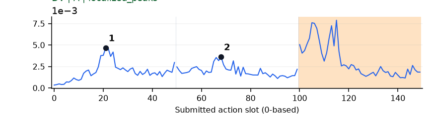](../figures/pick_dual_bottles/dv.png) | 可解释候选：候选：q0接近与q1提瓶两个小峰；橙色终止段更大峰不用于筛选。 |
| [place_a2b_left](../tasks/place_a2b_left.md) | [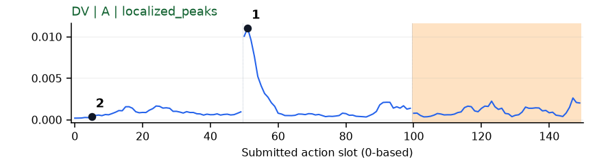](../figures/place_a2b_left/dv.png) | 可解释候选：候选：q1开始提起方盒时局部强峰；靠近chunk前缘。 |
| [place_a2b_right](../tasks/place_a2b_right.md) | [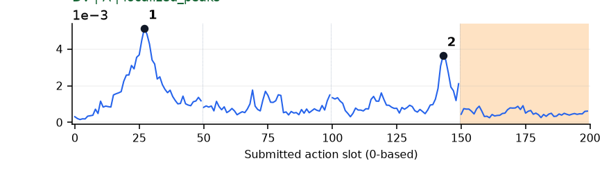](../figures/place_a2b_right/dv.png) | 可解释候选：候选：q0接近物体和q2移至目标两处峰。 |
| [place_bread_basket](../tasks/place_bread_basket.md) | [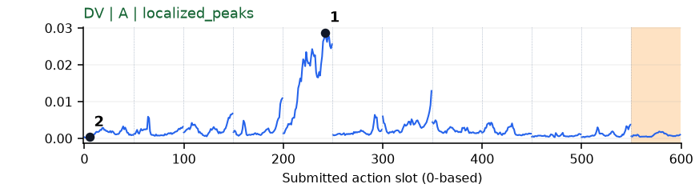](../figures/place_bread_basket/dv.png) | 可解释候选：优先候选：q4持面包移入篮子时单个主高区，同轨迹GEO/U-GROW也响应。 |
| [place_bread_skillet](../tasks/place_bread_skillet.md) | [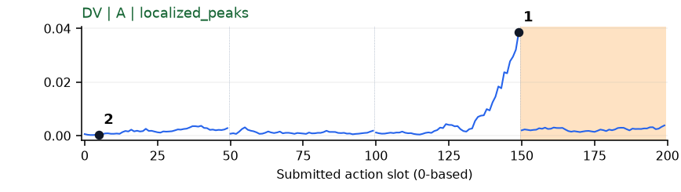](../figures/place_bread_skillet/dv.png) | 可解释候选：候选：q2双手分别持面包/平底锅并靠近时强升高。 |
| [place_burger_fries](../tasks/place_burger_fries.md) | [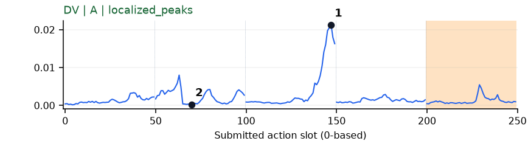](../figures/place_burger_fries/dv.png) | 可解释候选：候选：q2汉堡从托盘外移到盘内时孤立主峰。 |
| [place_can_basket](../tasks/place_can_basket.md) | [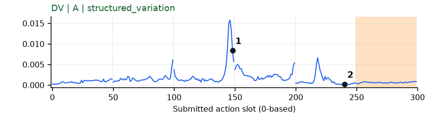](../figures/place_can_basket/dv.png) | 可解释候选：候选：q2持罐越过篮口附近有主要峰。 |
| [place_cans_plasticbox](../tasks/place_cans_plasticbox.md) | [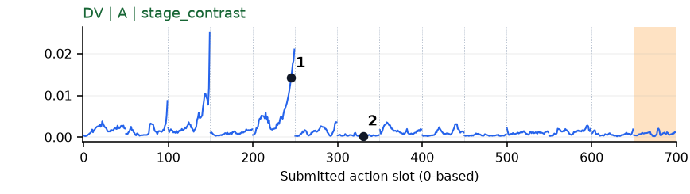](../figures/place_cans_plasticbox/dv.png) | 可解释候选：候选：q4手在箱内罐子附近调整时高；同轨迹更早还有一次峰。 |
| [place_container_plate](../tasks/place_container_plate.md) | [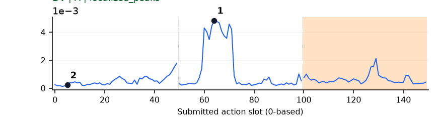](../figures/place_container_plate/dv.png) | 可解释候选：候选：q1容器由桌面抬起时局部峰；画面在右缘。 |
| [place_dual_shoes](../tasks/place_dual_shoes.md) | [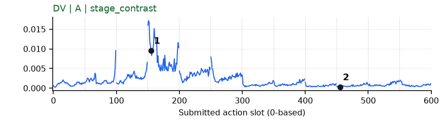](../figures/place_dual_shoes/dv.png) | 【失败例】可解释候选：失败例候选：q3鞋从箱内/箱边提起并调整时高，后面低。 |
| [place_empty_cup](../tasks/place_empty_cup.md) | [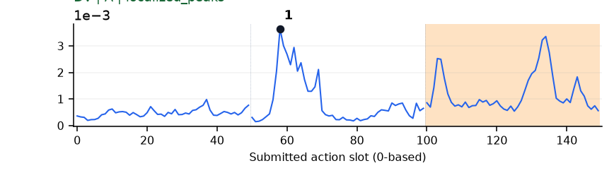](../figures/place_empty_cup/dv.png) | 可解释候选：候选：q1抬杯时局部峰；终止段不用于解释。 |
| [place_fan](../tasks/place_fan.md) | 无完整数据 | 缺数据：该任务未取得完整可复算批次。 |
| [place_mouse_pad](../tasks/place_mouse_pad.md) | [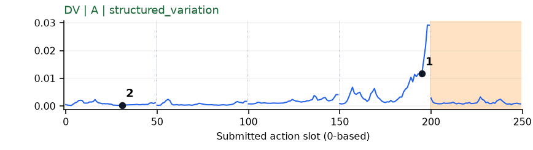](../figures/place_mouse_pad/dv.png) | 可解释候选：候选：q3鼠标贴近垫子调整时末段强升高。 |
| [place_object_basket](../tasks/place_object_basket.md) | [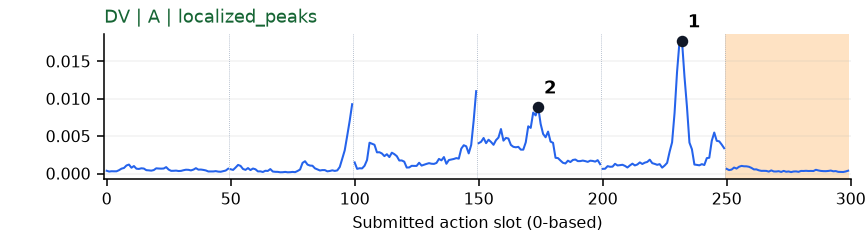](../figures/place_object_basket/dv.png) | 可解释候选：候选：q3入篮和q4篮内调整有高区。 |
| [place_object_scale](../tasks/place_object_scale.md) | 无完整数据 | 缺数据：该任务未取得完整可复算批次。 |
| [place_object_stand](../tasks/place_object_stand.md) | [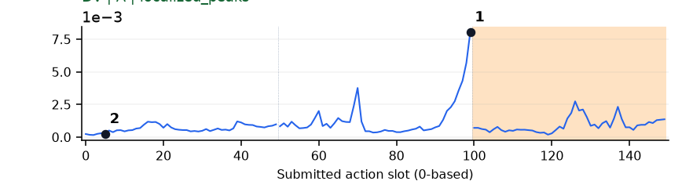](../figures/place_object_stand/dv.png) | 可解释候选：候选：q1提起并移向台子时末段升高；只有一批数据。 |
| [place_phone_stand](../tasks/place_phone_stand.md) | [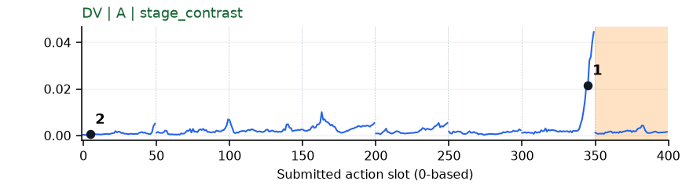](../figures/place_phone_stand/dv.png) | 受其他因素影响：谨慎：q6握着手机/支架附近末段升高，遮挡大，接触不可辨。 |
| [place_shoe](../tasks/place_shoe.md) | [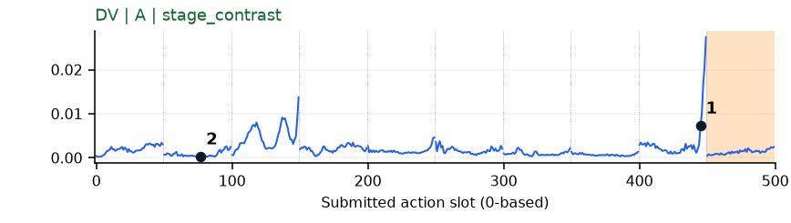](../figures/place_shoe/dv.png) | 受其他因素影响：谨慎：q8鞋在垫子上调整时末端升高；画面变化小，另有早期峰。 |
| [press_stapler](../tasks/press_stapler.md) | [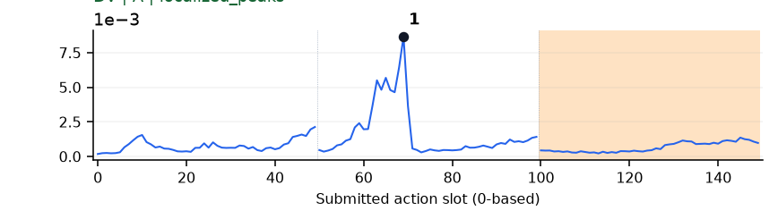](../figures/press_stapler/dv.png) | 可解释候选：候选：q1手在订书机上方对准/下压附近局部峰；按下瞬间不可辨。 |
| [put_bottles_dustbin](../tasks/put_bottles_dustbin.md) | [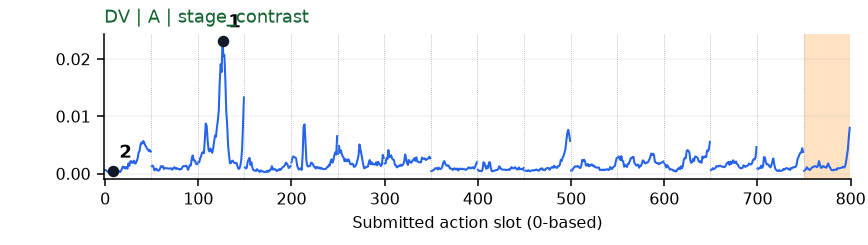](../figures/put_bottles_dustbin/dv.png) | 受其他因素影响：谨慎：q2有强峰，但夹爪/桶位于画面边缘，无法确认入桶动作。 |
| [put_object_cabinet](../tasks/put_object_cabinet.md) | 无完整数据 | 缺数据：该任务未取得完整可复算批次。 |
| [rotate_qrcode](../tasks/rotate_qrcode.md) | [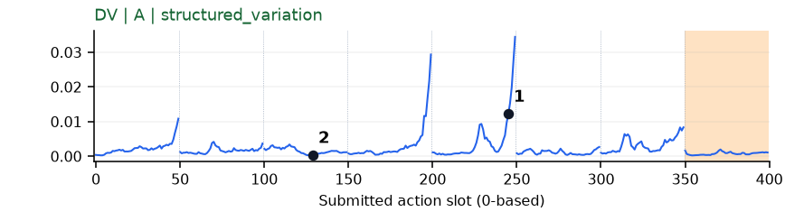](../figures/rotate_qrcode/dv.png) | 较弱：形态清楚但语义弱：标记片段手和二维码牌大部分出画。 |
| [scan_object](../tasks/scan_object.md) | [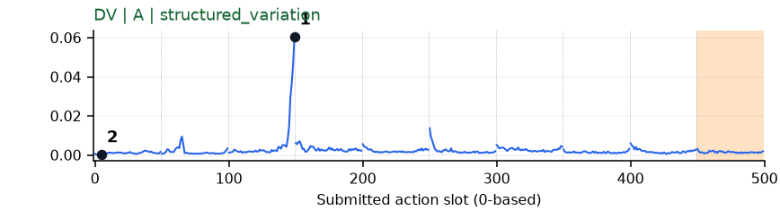](../figures/scan_object/dv.png) | 可解释候选：候选：q2扫描器在夹爪内转动、另一手持物时末段孤立峰。 |
| [shake_bottle](../tasks/shake_bottle.md) | [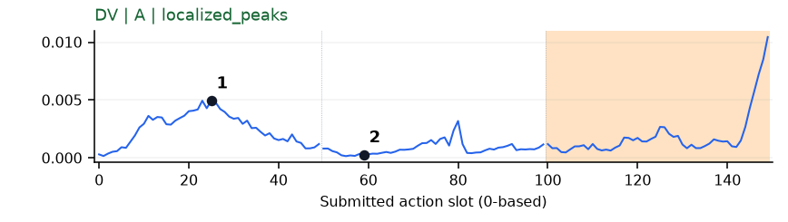](../figures/shake_bottle/dv.png) | 【补充数据】可解释候选：补充数据候选：q0接近瓶子有宽峰；该任务有重复种子，不计正式验收。 |
| [shake_bottle_horizontally](../tasks/shake_bottle_horizontally.md) | [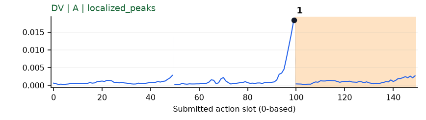](../figures/shake_bottle_horizontally/dv.png) | 可解释候选：候选：q1夹住并抬起瓶子时末段高峰，未定位摇动。 |
| [stack_blocks_three](../tasks/stack_blocks_three.md) | [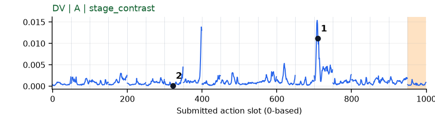](../figures/stack_blocks_three/dv.png) | 可解释候选：候选：q14第三个方块接近已有堆叠时主峰；另有早期强峰。 |
| [stack_blocks_two](../tasks/stack_blocks_two.md) | [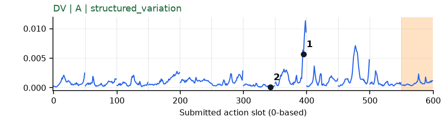](../figures/stack_blocks_two/dv.png) | 可解释候选：候选：q7在两块积木上方反复调整时高，另有后续峰。 |
| [stack_bowls_three](../tasks/stack_bowls_three.md) | [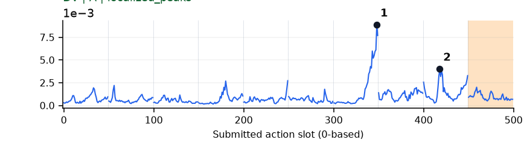](../figures/stack_bowls_three/dv.png) | 可解释候选：候选：q6手从已叠碗边缘移开时主峰，q8再抓碗有次峰。 |
| [stack_bowls_two](../tasks/stack_bowls_two.md) | [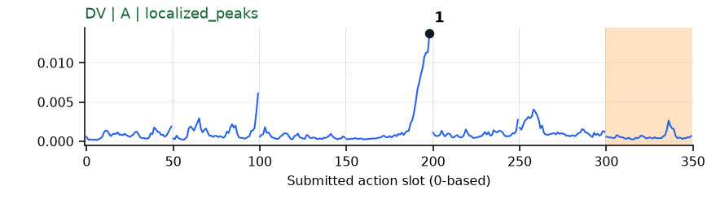](../figures/stack_bowls_two/dv.png) | 可解释候选：候选：q3夹爪从碗边抬起/再次调整时强峰。 |
| [stamp_seal](../tasks/stamp_seal.md) | [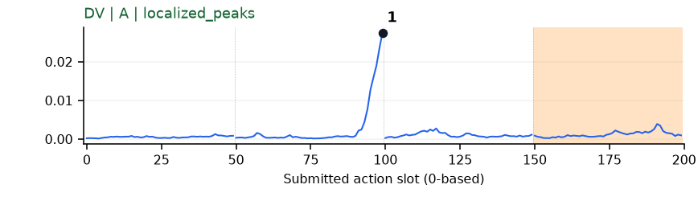](../figures/stamp_seal/dv.png) | 较弱：形态清楚但语义弱：q1强峰片段手和印章出画较多。 |
| [turn_switch](../tasks/turn_switch.md) | [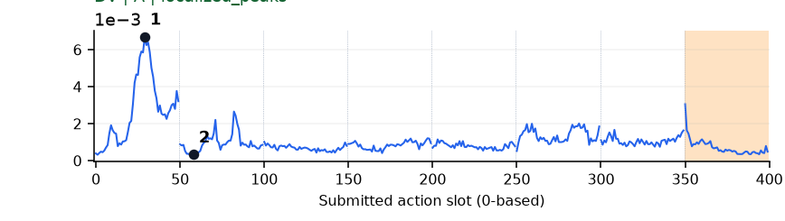](../figures/turn_switch/dv.png) | 可解释候选：候选：q0夹爪从远处伸到开关处时集中峰；不是后期拨动的唯一高点。 |
