# Fresco-tail5：全部任务

[返回总目录](../README.md)

主图保留逐动作原始值；细虚线为chunk边界，橙色为终止段实际执行长度不明，未用于筛选。帧只对应chunk前后，不能精确定位某个h的接触瞬间。A/B/C是形态筛选等级，优先读人工备注。

| 任务 | 原始曲线缩略图 | 复核 |
|---|---|---|
| [adjust_bottle](../tasks/adjust_bottle.md) | [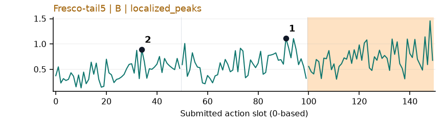](../figures/adjust_bottle/fresco.png) | 较弱：弱：逐动作抖动较密，未见可靠独立事件对应；全数据与噪声到最终动作距离高度相关。 |
| [beat_block_hammer](../tasks/beat_block_hammer.md) | [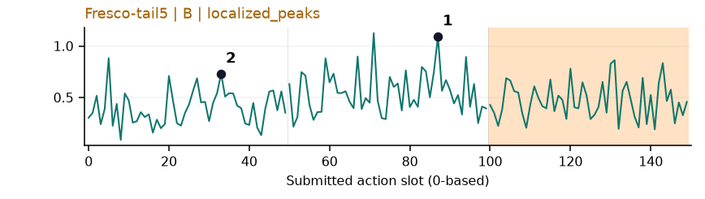](../figures/beat_block_hammer/fresco.png) | 较弱：弱：逐动作抖动较密，未见可靠独立事件对应；全数据与噪声到最终动作距离高度相关。 |
| [blocks_ranking_rgb](../tasks/blocks_ranking_rgb.md) | [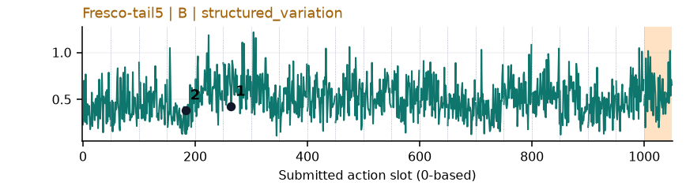](../figures/blocks_ranking_rgb/fresco.png) | 较弱：弱：逐动作抖动较密，未见可靠独立事件对应；全数据与噪声到最终动作距离高度相关。 |
| [blocks_ranking_size](../tasks/blocks_ranking_size.md) | [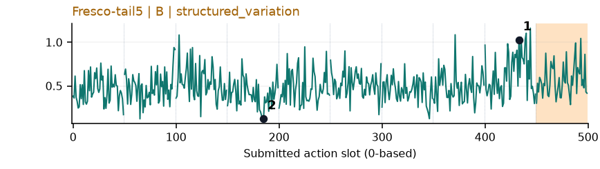](../figures/blocks_ranking_size/fresco.png) | 较弱：弱：逐动作抖动较密，未见可靠独立事件对应；全数据与噪声到最终动作距离高度相关。 |
| [click_alarmclock](../tasks/click_alarmclock.md) | [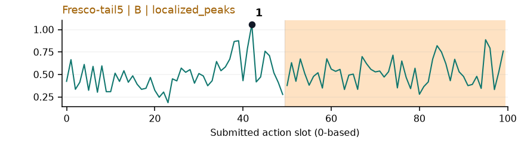](../figures/click_alarmclock/fresco.png) | 较弱：弱：逐动作抖动较密，未见可靠独立事件对应；全数据与噪声到最终动作距离高度相关。 |
| [click_bell](../tasks/click_bell.md) | [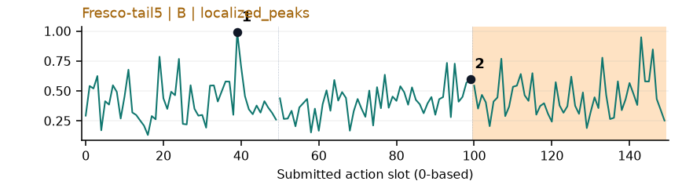](../figures/click_bell/fresco.png) | 较弱：弱：逐动作抖动较密，未见可靠独立事件对应；全数据与噪声到最终动作距离高度相关。 |
| [dump_bin_bigbin](../tasks/dump_bin_bigbin.md) | [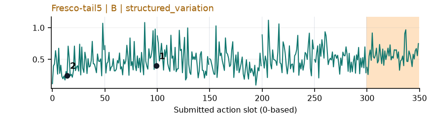](../figures/dump_bin_bigbin/fresco.png) | 较弱：弱：逐动作抖动较密，未见可靠独立事件对应；全数据与噪声到最终动作距离高度相关。 |
| [grab_roller](../tasks/grab_roller.md) | [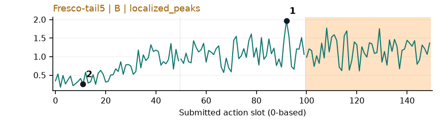](../figures/grab_roller/fresco.png) | 较弱：弱阶段趋势：接近后幅度上升但抖动密集，生成路径长度混杂强。 |
| [handover_block](../tasks/handover_block.md) | [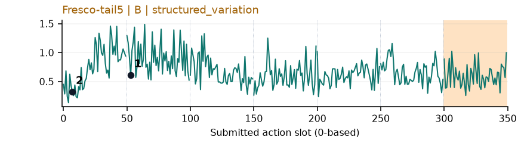](../figures/handover_block/fresco.png) | 较弱：弱：逐动作抖动较密，未见可靠独立事件对应；全数据与噪声到最终动作距离高度相关。 |
| [handover_mic](../tasks/handover_mic.md) | [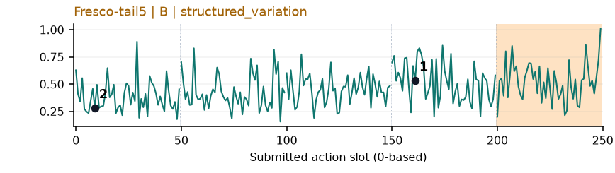](../figures/handover_mic/fresco.png) | 较弱：弱：逐动作抖动较密，未见可靠独立事件对应；全数据与噪声到最终动作距离高度相关。 |
| [hanging_mug](../tasks/hanging_mug.md) | [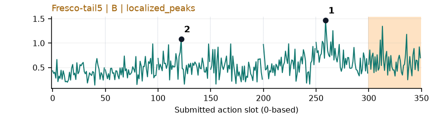](../figures/hanging_mug/fresco.png) | 较弱：弱：逐动作抖动较密，未见可靠独立事件对应；全数据与噪声到最终动作距离高度相关。 |
| [lift_pot](../tasks/lift_pot.md) | [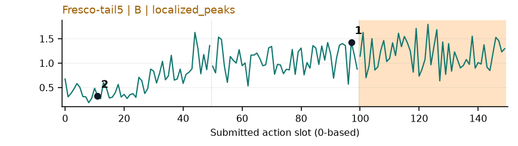](../figures/lift_pot/fresco.png) | 较弱：弱阶段趋势：接近后整体抬高，逐动作抖动仍密集。 |
| [move_can_pot](../tasks/move_can_pot.md) | [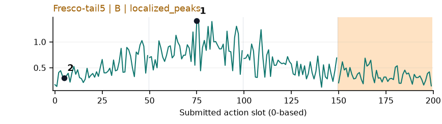](../figures/move_can_pot/fresco.png) | 较弱：弱：逐动作抖动较密，未见可靠独立事件对应；全数据与噪声到最终动作距离高度相关。 |
| [move_pillbottle_pad](../tasks/move_pillbottle_pad.md) | [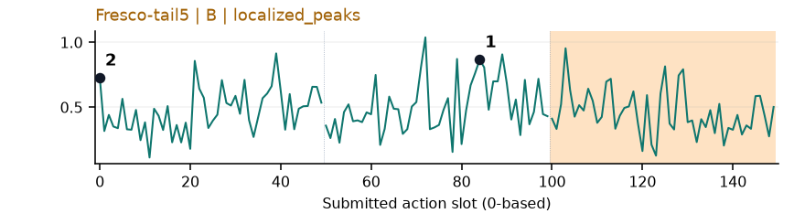](../figures/move_pillbottle_pad/fresco.png) | 较弱：弱：逐动作抖动较密，未见可靠独立事件对应；全数据与噪声到最终动作距离高度相关。 |
| [move_playingcard_away](../tasks/move_playingcard_away.md) | [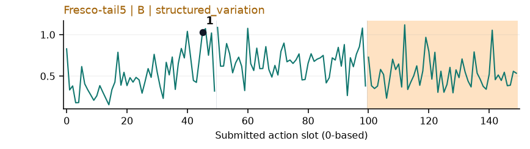](../figures/move_playingcard_away/fresco.png) | 较弱：弱：逐动作抖动较密，未见可靠独立事件对应；全数据与噪声到最终动作距离高度相关。 |
| [move_stapler_pad](../tasks/move_stapler_pad.md) | [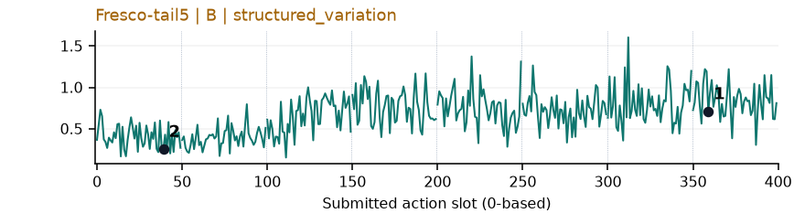](../figures/move_stapler_pad/fresco.png) | 【失败例】较弱：弱：逐动作抖动较密，未见可靠独立事件对应；全数据与噪声到最终动作距离高度相关。 |
| [open_laptop](../tasks/open_laptop.md) | 无完整数据 | 缺数据：该任务未取得完整可复算批次。 |
| [open_microwave](../tasks/open_microwave.md) | [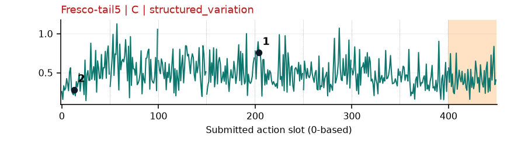](../figures/open_microwave/fresco.png) | 较弱：弱：逐动作抖动较密，未见可靠独立事件对应；全数据与噪声到最终动作距离高度相关。 |
| [pick_diverse_bottles](../tasks/pick_diverse_bottles.md) | [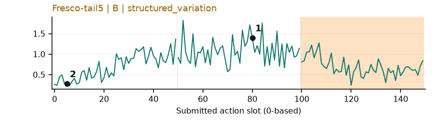](../figures/pick_diverse_bottles/fresco.png) | 较弱：弱：逐动作抖动较密，未见可靠独立事件对应；全数据与噪声到最终动作距离高度相关。 |
| [pick_dual_bottles](../tasks/pick_dual_bottles.md) | [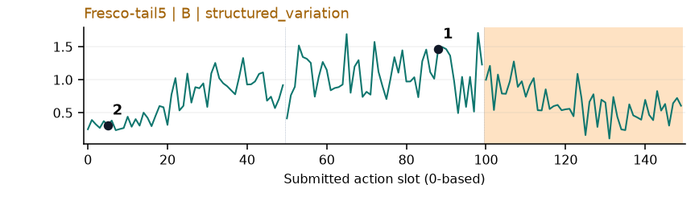](../figures/pick_dual_bottles/fresco.png) | 较弱：弱阶段趋势：接近/提瓶期间宽高区，但路径长度混杂。 |
| [place_a2b_left](../tasks/place_a2b_left.md) | [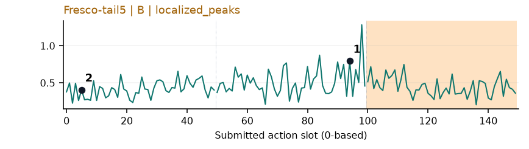](../figures/place_a2b_left/fresco.png) | 较弱：弱：逐动作抖动较密，未见可靠独立事件对应；全数据与噪声到最终动作距离高度相关。 |
| [place_a2b_right](../tasks/place_a2b_right.md) | [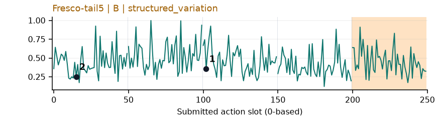](../figures/place_a2b_right/fresco.png) | 较弱：弱：逐动作抖动较密，未见可靠独立事件对应；全数据与噪声到最终动作距离高度相关。 |
| [place_bread_basket](../tasks/place_bread_basket.md) | [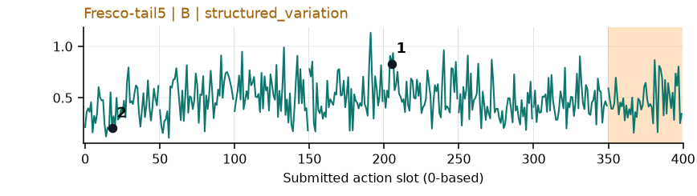](../figures/place_bread_basket/fresco.png) | 较弱：弱：逐动作抖动较密，未见可靠独立事件对应；全数据与噪声到最终动作距离高度相关。 |
| [place_bread_skillet](../tasks/place_bread_skillet.md) | [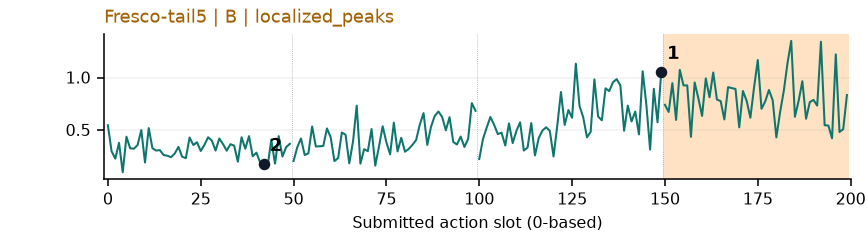](../figures/place_bread_skillet/fresco.png) | 较弱：弱：逐动作抖动较密，未见可靠独立事件对应；全数据与噪声到最终动作距离高度相关。 |
| [place_burger_fries](../tasks/place_burger_fries.md) | [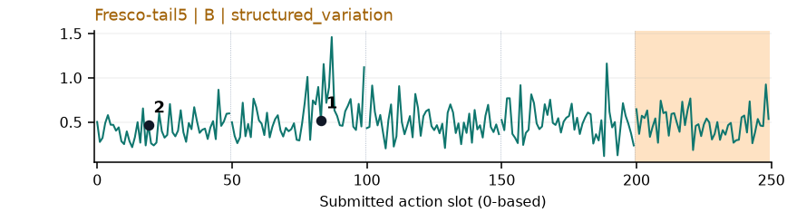](../figures/place_burger_fries/fresco.png) | 较弱：弱：逐动作抖动较密，未见可靠独立事件对应；全数据与噪声到最终动作距离高度相关。 |
| [place_can_basket](../tasks/place_can_basket.md) | [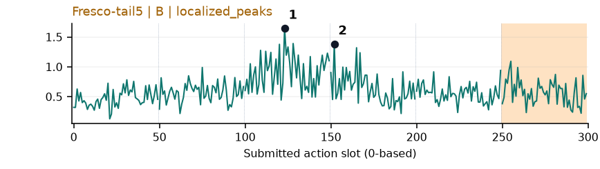](../figures/place_can_basket/fresco.png) | 较弱：弱：逐动作抖动较密，未见可靠独立事件对应；全数据与噪声到最终动作距离高度相关。 |
| [place_cans_plasticbox](../tasks/place_cans_plasticbox.md) | [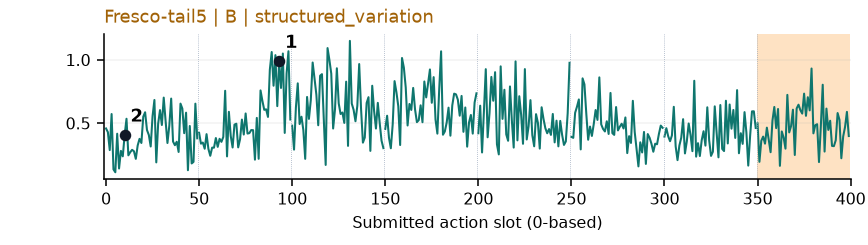](../figures/place_cans_plasticbox/fresco.png) | 较弱：弱：逐动作抖动较密，未见可靠独立事件对应；全数据与噪声到最终动作距离高度相关。 |
| [place_container_plate](../tasks/place_container_plate.md) | [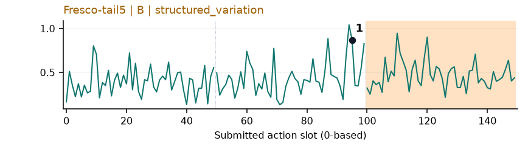](../figures/place_container_plate/fresco.png) | 较弱：弱：逐动作抖动较密，未见可靠独立事件对应；全数据与噪声到最终动作距离高度相关。 |
| [place_dual_shoes](../tasks/place_dual_shoes.md) | [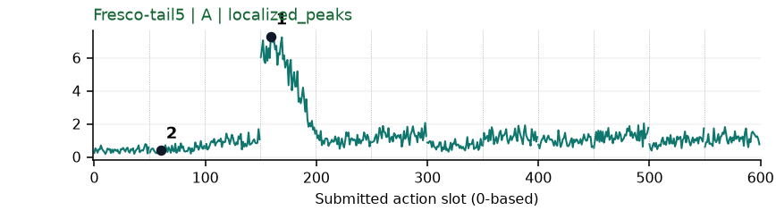](../figures/place_dual_shoes/fresco.png) | 【失败例】可解释候选：失败例阶段候选：q3有强宽峰，画面见鞋抬起；但仍高度受生成路径长度影响。 |
| [place_empty_cup](../tasks/place_empty_cup.md) | [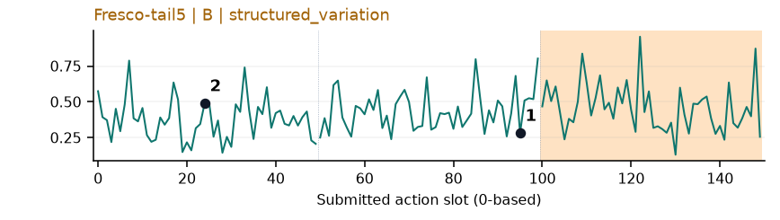](../figures/place_empty_cup/fresco.png) | 较弱：弱：逐动作抖动较密，未见可靠独立事件对应；全数据与噪声到最终动作距离高度相关。 |
| [place_fan](../tasks/place_fan.md) | 无完整数据 | 缺数据：该任务未取得完整可复算批次。 |
| [place_mouse_pad](../tasks/place_mouse_pad.md) | [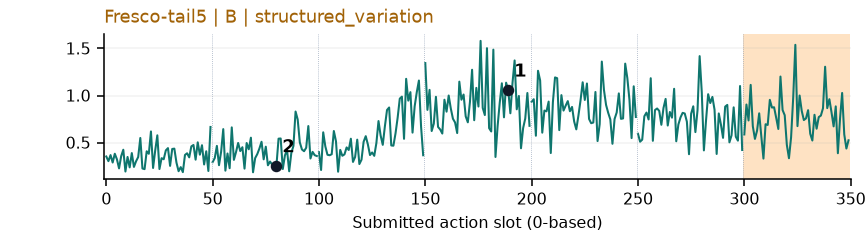](../figures/place_mouse_pad/fresco.png) | 较弱：弱：逐动作抖动较密，未见可靠独立事件对应；全数据与噪声到最终动作距离高度相关。 |
| [place_object_basket](../tasks/place_object_basket.md) | [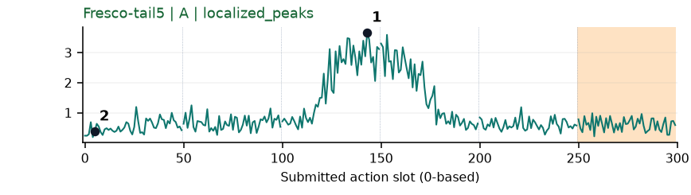](../figures/place_object_basket/fresco.png) | 受其他因素影响：阶段候选但混杂强：q2/q3存在清楚宽峰，和物体入篮同时发生，仍主要测路径长度。 |
| [place_object_scale](../tasks/place_object_scale.md) | 无完整数据 | 缺数据：该任务未取得完整可复算批次。 |
| [place_object_stand](../tasks/place_object_stand.md) | [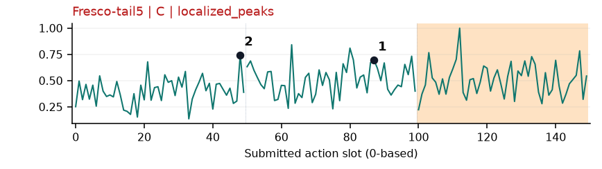](../figures/place_object_stand/fresco.png) | 较弱：弱：逐动作抖动较密，未见可靠独立事件对应；全数据与噪声到最终动作距离高度相关。 |
| [place_phone_stand](../tasks/place_phone_stand.md) | [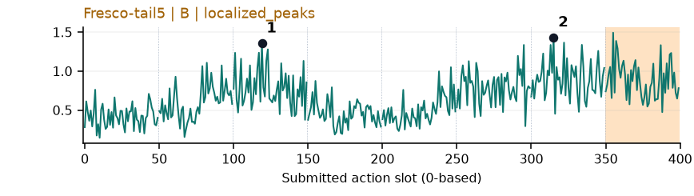](../figures/place_phone_stand/fresco.png) | 较弱：弱：逐动作抖动较密，未见可靠独立事件对应；全数据与噪声到最终动作距离高度相关。 |
| [place_shoe](../tasks/place_shoe.md) | [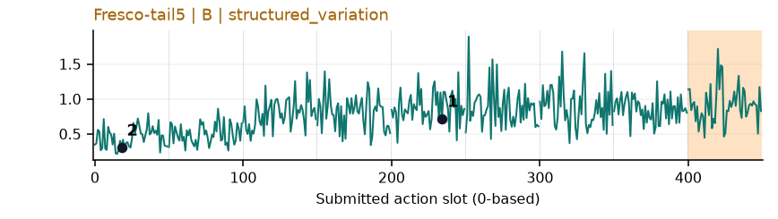](../figures/place_shoe/fresco.png) | 较弱：弱：逐动作抖动较密，未见可靠独立事件对应；全数据与噪声到最终动作距离高度相关。 |
| [press_stapler](../tasks/press_stapler.md) | [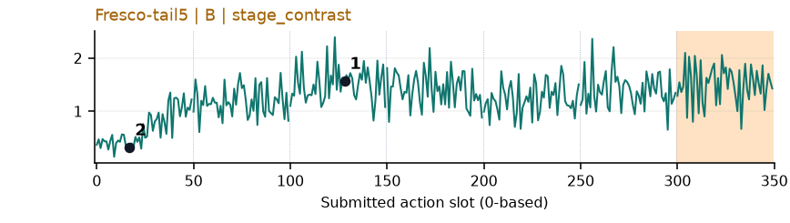](../figures/press_stapler/fresco.png) | 较弱：弱：逐动作抖动较密，未见可靠独立事件对应；全数据与噪声到最终动作距离高度相关。 |
| [put_bottles_dustbin](../tasks/put_bottles_dustbin.md) | [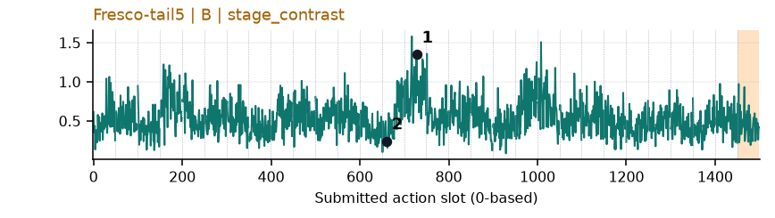](../figures/put_bottles_dustbin/fresco.png) | 较弱：弱：逐动作抖动较密，未见可靠独立事件对应；全数据与噪声到最终动作距离高度相关。 |
| [put_object_cabinet](../tasks/put_object_cabinet.md) | 无完整数据 | 缺数据：该任务未取得完整可复算批次。 |
| [rotate_qrcode](../tasks/rotate_qrcode.md) | [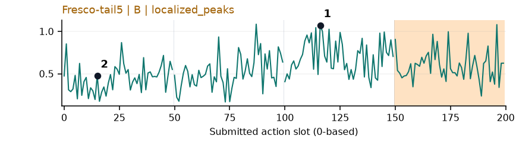](../figures/rotate_qrcode/fresco.png) | 较弱：弱：逐动作抖动较密，未见可靠独立事件对应；全数据与噪声到最终动作距离高度相关。 |
| [scan_object](../tasks/scan_object.md) | [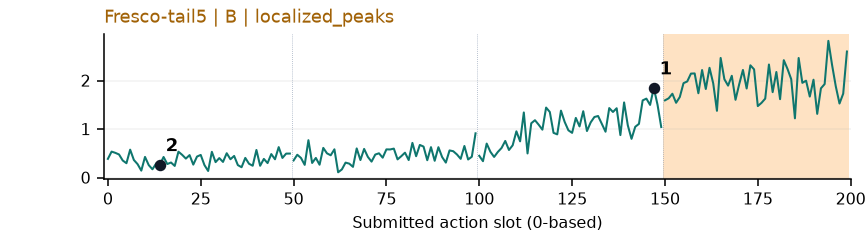](../figures/scan_object/fresco.png) | 较弱：弱阶段趋势：扫描器改变姿态后升高，路径长度混杂。 |
| [shake_bottle](../tasks/shake_bottle.md) | [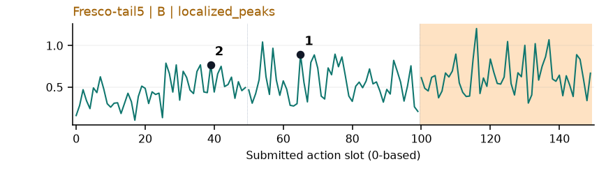](../figures/shake_bottle/fresco.png) | 【补充数据】较弱：弱：逐动作抖动较密，未见可靠独立事件对应；全数据与噪声到最终动作距离高度相关。 |
| [shake_bottle_horizontally](../tasks/shake_bottle_horizontally.md) | [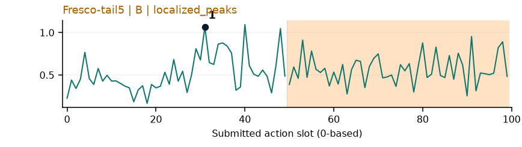](../figures/shake_bottle_horizontally/fresco.png) | 较弱：弱：逐动作抖动较密，未见可靠独立事件对应；全数据与噪声到最终动作距离高度相关。 |
| [stack_blocks_three](../tasks/stack_blocks_three.md) | [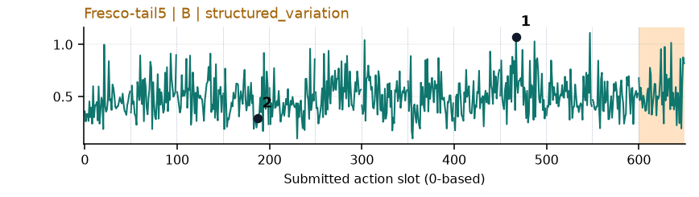](../figures/stack_blocks_three/fresco.png) | 较弱：弱：逐动作抖动较密，未见可靠独立事件对应；全数据与噪声到最终动作距离高度相关。 |
| [stack_blocks_two](../tasks/stack_blocks_two.md) | [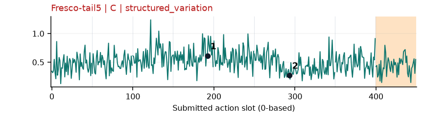](../figures/stack_blocks_two/fresco.png) | 较弱：弱：逐动作抖动较密，未见可靠独立事件对应；全数据与噪声到最终动作距离高度相关。 |
| [stack_bowls_three](../tasks/stack_bowls_three.md) | [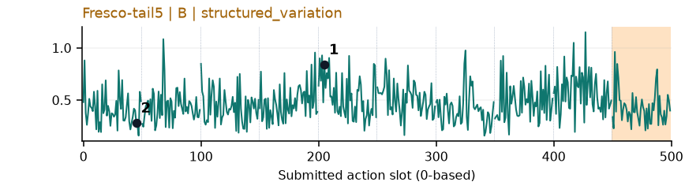](../figures/stack_bowls_three/fresco.png) | 较弱：弱：逐动作抖动较密，未见可靠独立事件对应；全数据与噪声到最终动作距离高度相关。 |
| [stack_bowls_two](../tasks/stack_bowls_two.md) | [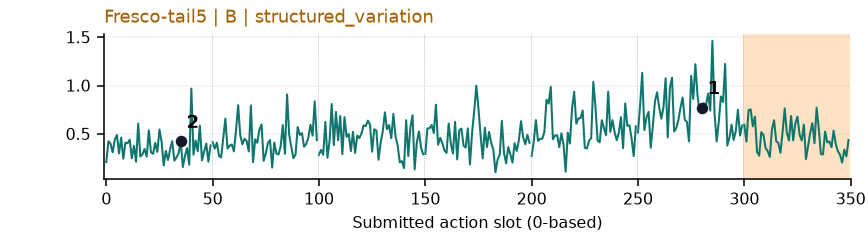](../figures/stack_bowls_two/fresco.png) | 较弱：弱：逐动作抖动较密，未见可靠独立事件对应；全数据与噪声到最终动作距离高度相关。 |
| [stamp_seal](../tasks/stamp_seal.md) | [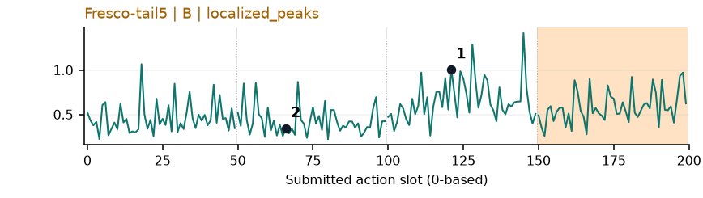](../figures/stamp_seal/fresco.png) | 较弱：弱：逐动作抖动较密，未见可靠独立事件对应；全数据与噪声到最终动作距离高度相关。 |
| [turn_switch](../tasks/turn_switch.md) | [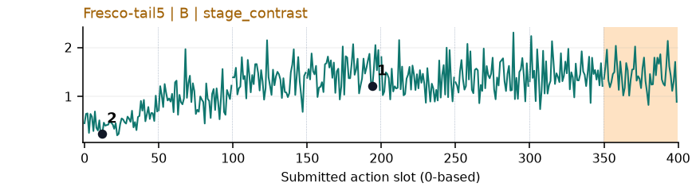](../figures/turn_switch/fresco.png) | 较弱：弱阶段趋势：靠近开关后基线升高但抖动密集，生成路径长度混杂强。 |
