# GEO-full：全部任务

[返回总目录](../README.md)

主图保留逐动作原始值；细虚线为chunk边界，橙色为终止段实际执行长度不明，未用于筛选。帧只对应chunk前后，不能精确定位某个h的接触瞬间。A/B/C是形态筛选等级，优先读人工备注。

| 任务 | 原始曲线缩略图 | 复核 |
|---|---|---|
| [adjust_bottle](../tasks/adjust_bottle.md) | [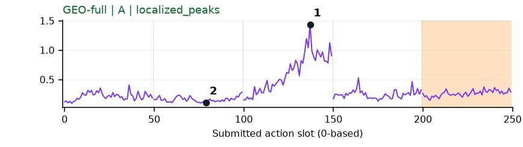](../figures/adjust_bottle/geo.png) | 可解释候选：候选：q2持瓶调整段有宽峰，精确接触不可定位。 |
| [beat_block_hammer](../tasks/beat_block_hammer.md) | [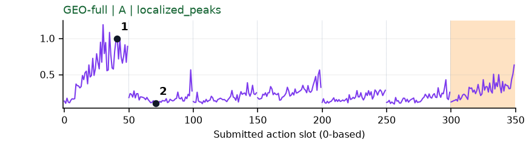](../figures/beat_block_hammer/geo.png) | 可解释候选：候选：q0接近并抓取锤柄段高，不能称已经击打。 |
| [blocks_ranking_rgb](../tasks/blocks_ranking_rgb.md) | [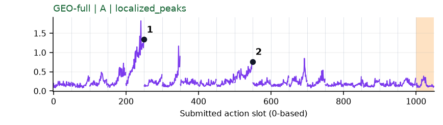](../figures/blocks_ranking_rgb/geo.png) | 可解释候选：候选：q4/q10手离开原位置并转向方块，阶段变化清楚。 |
| [blocks_ranking_size](../tasks/blocks_ranking_size.md) | [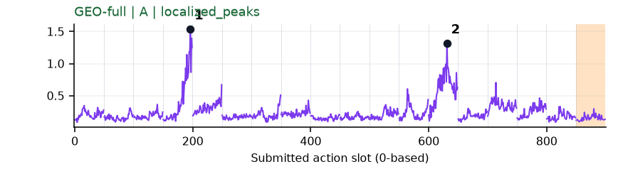](../figures/blocks_ranking_size/geo.png) | 可解释候选：候选：q3/q12抓取/移开不同尺寸方块，两个主要高区。 |
| [click_alarmclock](../tasks/click_alarmclock.md) | [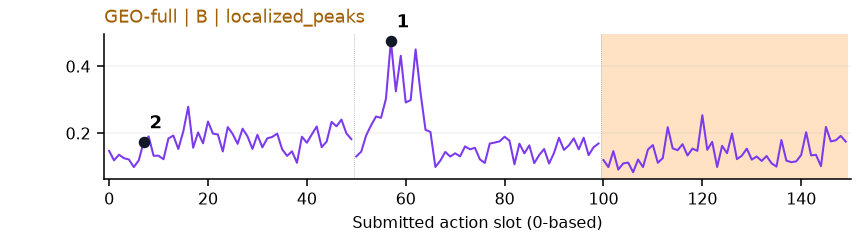](../figures/click_alarmclock/geo.png) | 可解释候选：候选：与DV同一轨迹q1峰，接近闹钟阶段。 |
| [click_bell](../tasks/click_bell.md) | [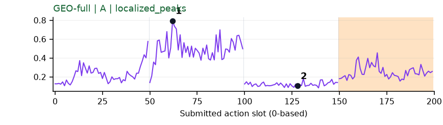](../figures/click_bell/geo.png) | 可解释候选：阶段候选：q1在铃上方调整时持续较高，非独立窄峰。 |
| [dump_bin_bigbin](../tasks/dump_bin_bigbin.md) | [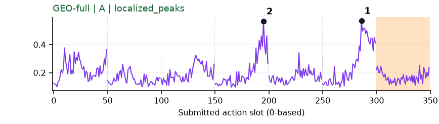](../figures/dump_bin_bigbin/geo.png) | 可解释候选：阶段候选：q3/q5手离开/回到容器附近，画面不足以精确确认倾倒。 |
| [grab_roller](../tasks/grab_roller.md) | [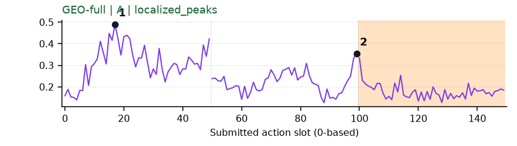](../figures/grab_roller/geo.png) | 可解释候选：候选：q0双手展开并接近滚筒时较高，后续下降。 |
| [handover_block](../tasks/handover_block.md) | [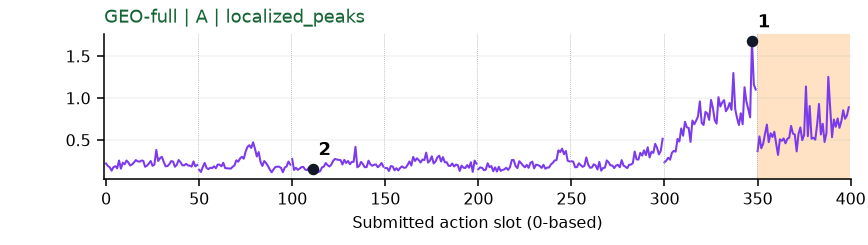](../figures/handover_block/geo.png) | 可解释候选：候选：同轨迹q6交接接近段升高。 |
| [handover_mic](../tasks/handover_mic.md) | [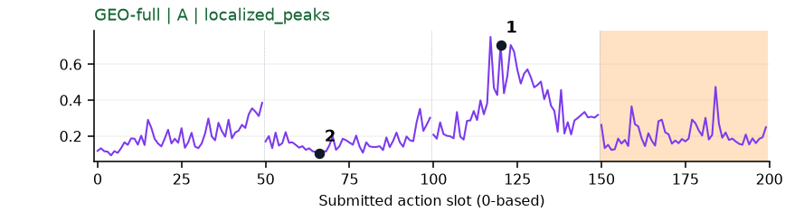](../figures/handover_mic/geo.png) | 可解释候选：候选：q2两手相遇段出现主峰，q1搬运段较低。 |
| [hanging_mug](../tasks/hanging_mug.md) | [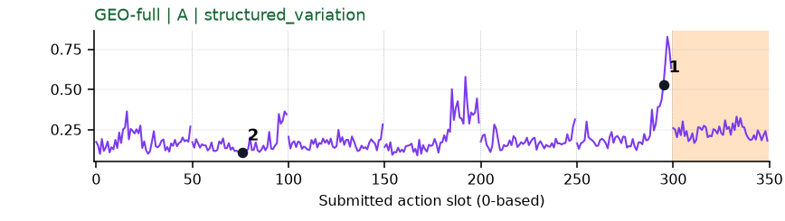](../figures/hanging_mug/geo.png) | 可解释候选：候选：q5向挂架移动段升高；还未能确认挂上瞬间。 |
| [lift_pot](../tasks/lift_pot.md) | [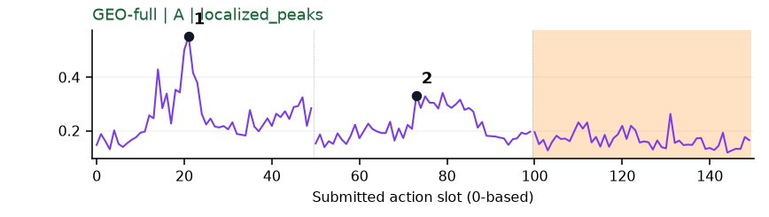](../figures/lift_pot/geo.png) | 可解释候选：候选：q0接近锅和q1握持准备两段高区。 |
| [move_can_pot](../tasks/move_can_pot.md) | [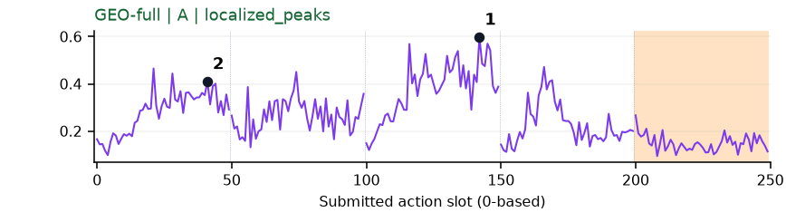](../figures/move_can_pot/geo.png) | 可解释候选：候选：q2把罐向锅边移动时宽峰。 |
| [move_pillbottle_pad](../tasks/move_pillbottle_pad.md) | [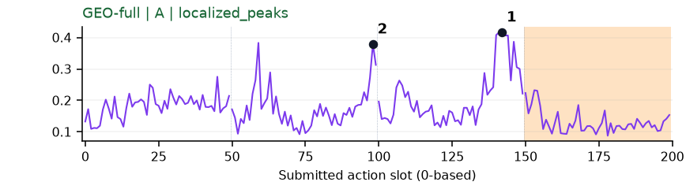](../figures/move_pillbottle_pad/geo.png) | 可解释候选：候选：q1提瓶与q2放到垫子附近升高。 |
| [move_playingcard_away](../tasks/move_playingcard_away.md) | [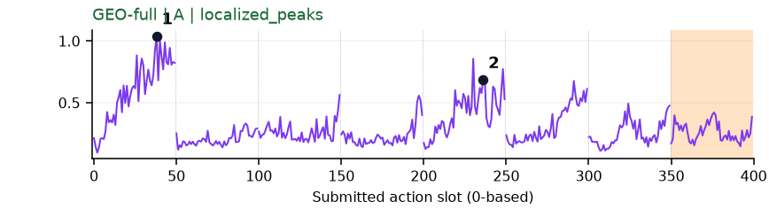](../figures/move_playingcard_away/geo.png) | 可解释候选：候选：q0手接近纸牌有明显高区；q4高区画面解释弱。 |
| [move_stapler_pad](../tasks/move_stapler_pad.md) | [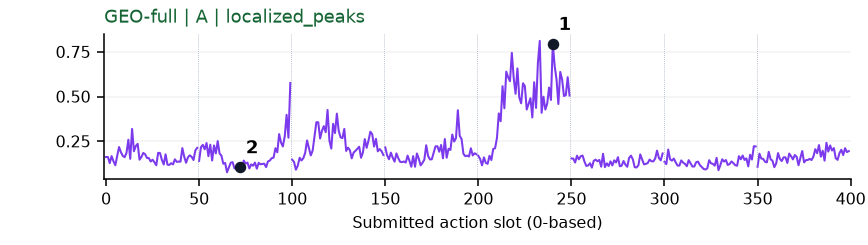](../figures/move_stapler_pad/geo.png) | 【失败例】可解释候选：失败例候选：同轨迹q4明显宽峰。 |
| [open_laptop](../tasks/open_laptop.md) | 无完整数据 | 缺数据：该任务未取得完整可复算批次。 |
| [open_microwave](../tasks/open_microwave.md) | [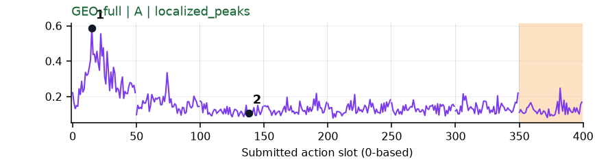](../figures/open_microwave/geo.png) | 可解释候选：候选：q0接近微波炉门/把手时高，后续较低。 |
| [pick_diverse_bottles](../tasks/pick_diverse_bottles.md) | [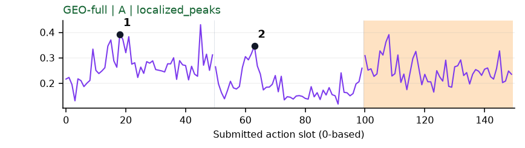](../figures/pick_diverse_bottles/geo.png) | 可解释候选：阶段候选：q0接近、q1提瓶各有高区。 |
| [pick_dual_bottles](../tasks/pick_dual_bottles.md) | [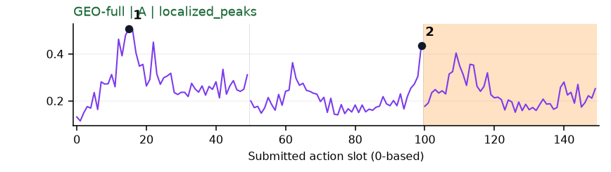](../figures/pick_dual_bottles/geo.png) | 可解释候选：候选：q0双手接近瓶子为主要高区。 |
| [place_a2b_left](../tasks/place_a2b_left.md) | [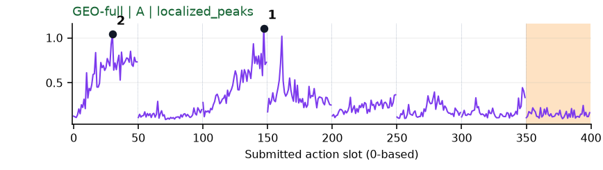](../figures/place_a2b_left/geo.png) | 可解释候选：候选：q0抓取、q2移向目标附近两个高区。 |
| [place_a2b_right](../tasks/place_a2b_right.md) | [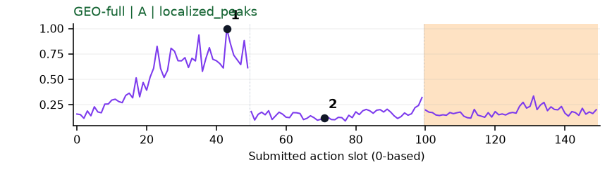](../figures/place_a2b_right/geo.png) | 可解释候选：候选：q0接近并夹取物体时宽高区。 |
| [place_bread_basket](../tasks/place_bread_basket.md) | [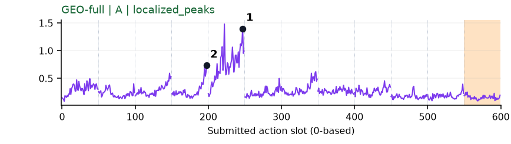](../figures/place_bread_basket/geo.png) | 可解释候选：优先候选：同一q4面包移入篮子阶段明显升高。 |
| [place_bread_skillet](../tasks/place_bread_skillet.md) | [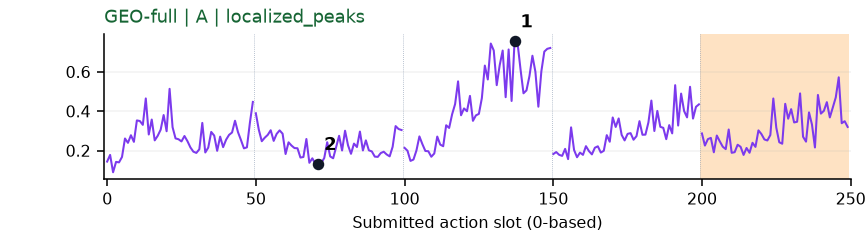](../figures/place_bread_skillet/geo.png) | 可解释候选：阶段候选：q2开始移动面包/锅时高，具体接触被视角限制。 |
| [place_burger_fries](../tasks/place_burger_fries.md) | [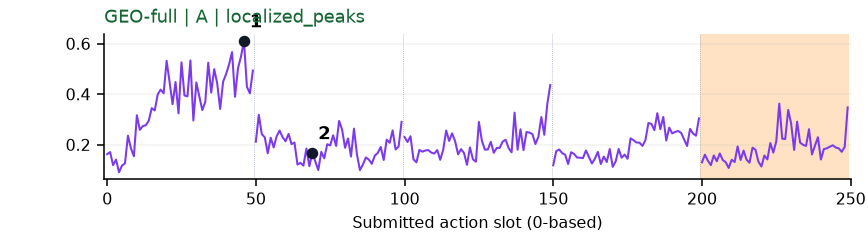](../figures/place_burger_fries/geo.png) | 可解释候选：候选：q0双手靠近食物时高，后续较低。 |
| [place_can_basket](../tasks/place_can_basket.md) | [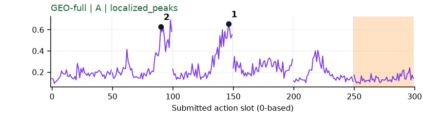](../figures/place_can_basket/geo.png) | 可解释候选：候选：q1抬罐和q2移向篮口出现主要高区。 |
| [place_cans_plasticbox](../tasks/place_cans_plasticbox.md) | [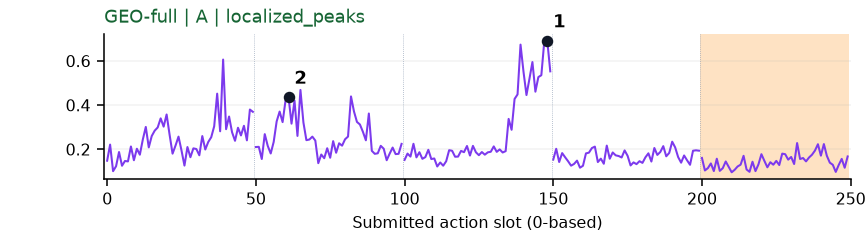](../figures/place_cans_plasticbox/geo.png) | 可解释候选：候选：q2持罐移到箱内时宽高区。 |
| [place_container_plate](../tasks/place_container_plate.md) | [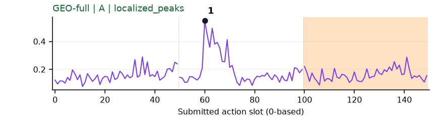](../figures/place_container_plate/geo.png) | 可解释候选：候选：同一轨迹q1抬容器时峰清楚。 |
| [place_dual_shoes](../tasks/place_dual_shoes.md) | [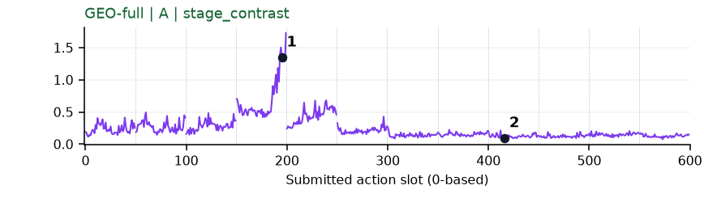](../figures/place_dual_shoes/geo.png) | 【失败例】可解释候选：失败例候选：同轨迹q3鞋的调整段高，低段仍未成功。 |
| [place_empty_cup](../tasks/place_empty_cup.md) | [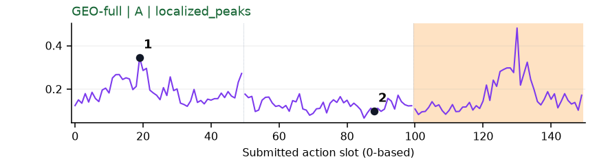](../figures/place_empty_cup/geo.png) | 可解释候选：候选：q0夹爪接近杯口时高，之后降低。 |
| [place_fan](../tasks/place_fan.md) | 无完整数据 | 缺数据：该任务未取得完整可复算批次。 |
| [place_mouse_pad](../tasks/place_mouse_pad.md) | [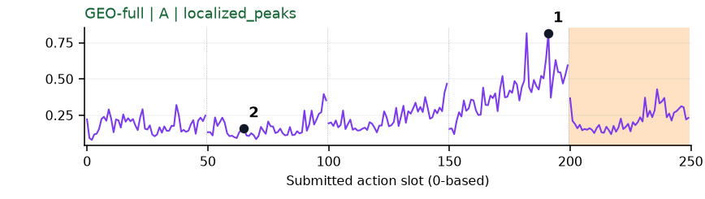](../figures/place_mouse_pad/geo.png) | 可解释候选：候选：同轨迹q3垫子上操作时高。 |
| [place_object_basket](../tasks/place_object_basket.md) | [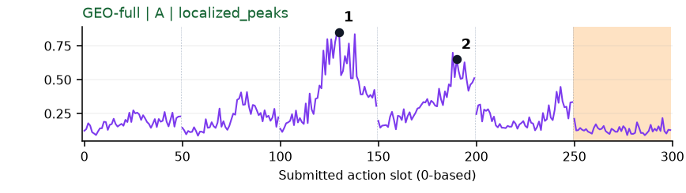](../figures/place_object_basket/geo.png) | 可解释候选：候选：q2持物到篮口、q3放入篮内各有峰。 |
| [place_object_scale](../tasks/place_object_scale.md) | 无完整数据 | 缺数据：该任务未取得完整可复算批次。 |
| [place_object_stand](../tasks/place_object_stand.md) | [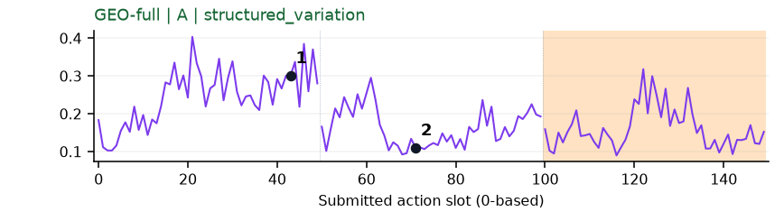](../figures/place_object_stand/geo.png) | 可解释候选：候选：q0接近物体时高，q1移动较低。 |
| [place_phone_stand](../tasks/place_phone_stand.md) | [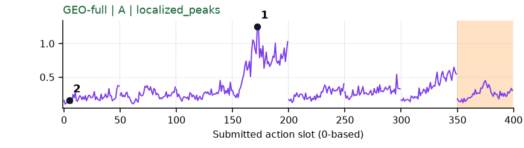](../figures/place_phone_stand/geo.png) | 可解释候选：候选：q3手机竖直姿态调整时宽峰。 |
| [place_shoe](../tasks/place_shoe.md) | [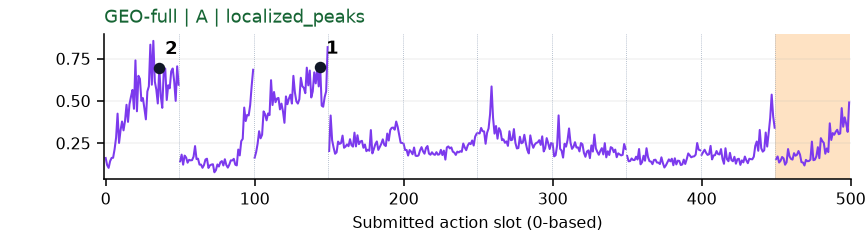](../figures/place_shoe/geo.png) | 可解释候选：候选：q0抓鞋、q2移向垫子两段高区。 |
| [press_stapler](../tasks/press_stapler.md) | [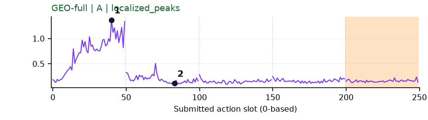](../figures/press_stapler/geo.png) | 可解释候选：候选：q0手接近订书机时持续高区，后续低。 |
| [put_bottles_dustbin](../tasks/put_bottles_dustbin.md) | [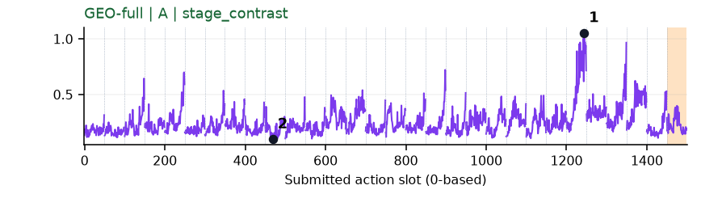](../figures/put_bottles_dustbin/geo.png) | 可解释候选：候选：q24手重新接近倒下的瓶子时高区，长轨迹仍有多峰。 |
| [put_object_cabinet](../tasks/put_object_cabinet.md) | 无完整数据 | 缺数据：该任务未取得完整可复算批次。 |
| [rotate_qrcode](../tasks/rotate_qrcode.md) | [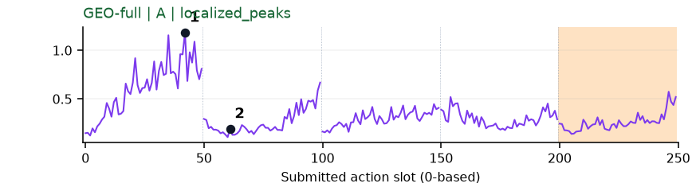](../figures/rotate_qrcode/geo.png) | 可解释候选：候选：q0夹爪靠近并夹住牌架时高区，物体在画面右缘。 |
| [scan_object](../tasks/scan_object.md) | [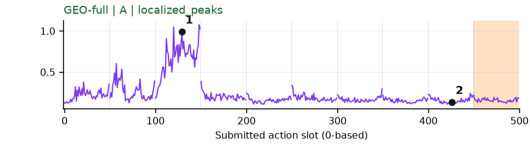](../figures/scan_object/geo.png) | 可解释候选：候选：同轨迹q2扫描器转向物体时宽高区。 |
| [shake_bottle](../tasks/shake_bottle.md) | [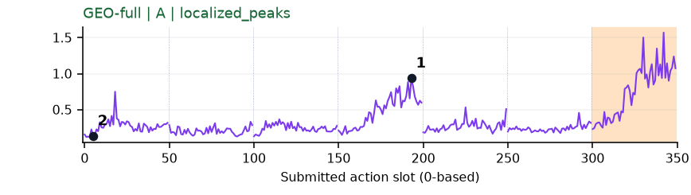](../figures/shake_bottle/geo.png) | 【补充数据】可解释候选：补充数据候选：q3重新接近横卧瓶子时高，并非摇动瞬间。 |
| [shake_bottle_horizontally](../tasks/shake_bottle_horizontally.md) | [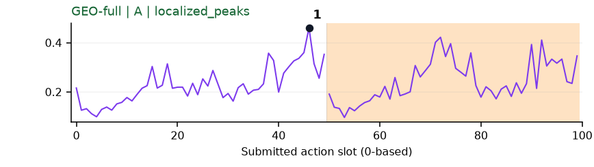](../figures/shake_bottle_horizontally/geo.png) | 受其他因素影响：谨慎：q0接近并夹住瓶子时高，位置模板效应较强。 |
| [stack_blocks_three](../tasks/stack_blocks_three.md) | [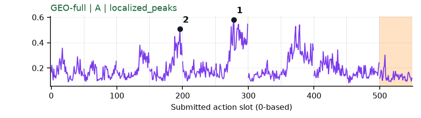](../figures/stack_blocks_three/geo.png) | 可解释候选：阶段候选：q3/q5拿起、搬运方块形成高区，仍有其他峰。 |
| [stack_blocks_two](../tasks/stack_blocks_two.md) | [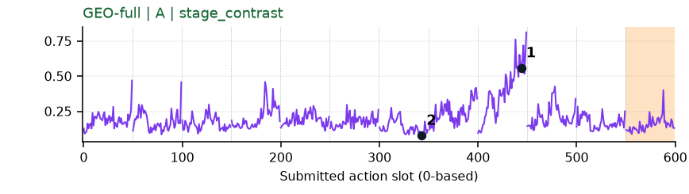](../figures/stack_blocks_two/geo.png) | 可解释候选：候选：q8夹持方块调整姿态时宽高区。 |
| [stack_bowls_three](../tasks/stack_bowls_three.md) | [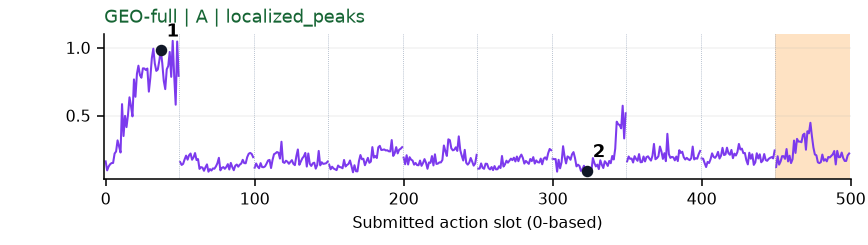](../figures/stack_bowls_three/geo.png) | 可解释候选：候选：q0最初接近碗时高，后续大部分低。 |
| [stack_bowls_two](../tasks/stack_bowls_two.md) | [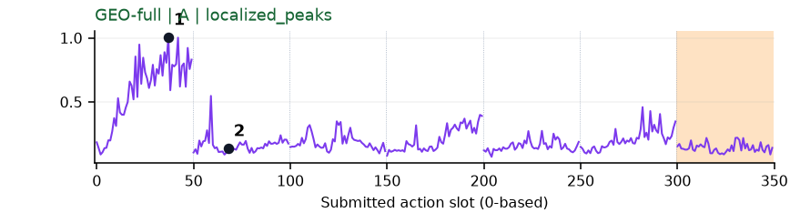](../figures/stack_bowls_two/geo.png) | 可解释候选：候选：q0最初接近碗时宽高区。 |
| [stamp_seal](../tasks/stamp_seal.md) | [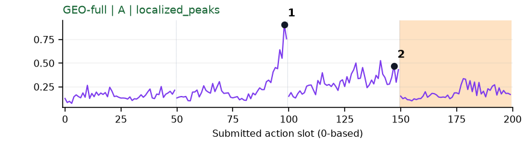](../figures/stamp_seal/geo.png) | 较弱：形态清楚但语义弱：与DV同片段峰，无法可靠看清盖章动作。 |
| [turn_switch](../tasks/turn_switch.md) | [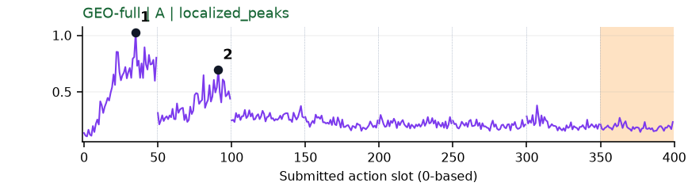](../figures/turn_switch/geo.png) | 可解释候选：候选：q0接近、q1开关附近调整两个高区。 |
