# GeoAAC-growth：全部任务

[返回总目录](../README.md)

主图保留逐动作原始值；细虚线为chunk边界，橙色为终止段实际执行长度不明，未用于筛选。帧只对应chunk前后，不能精确定位某个h的接触瞬间。A/B/C是形态筛选等级，优先读人工备注。

| 任务 | 原始曲线缩略图 | 复核 |
|---|---|---|
| [adjust_bottle](../tasks/adjust_bottle.md) | [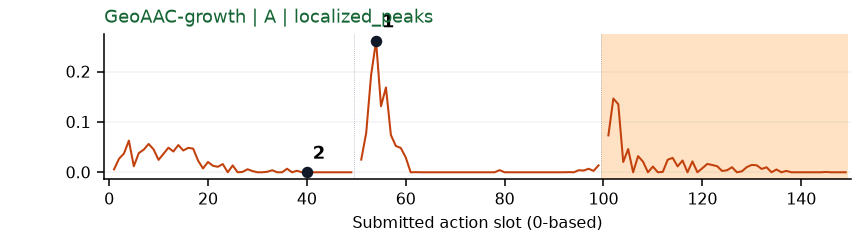](../figures/adjust_bottle/geoaac.png) | 受其他因素影响：谨慎：q1起始突峰，提瓶画面可见，但前缀位置效应明显。 |
| [beat_block_hammer](../tasks/beat_block_hammer.md) | [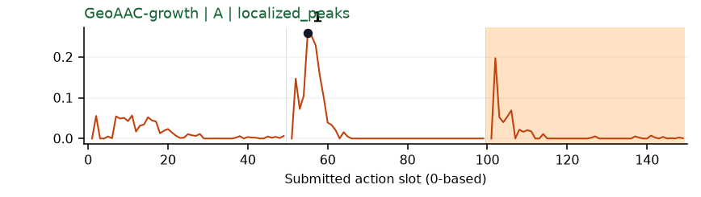](../figures/beat_block_hammer/geoaac.png) | 受其他因素影响：谨慎：q1举锤段窄峰与chunk前段重合。 |
| [blocks_ranking_rgb](../tasks/blocks_ranking_rgb.md) | [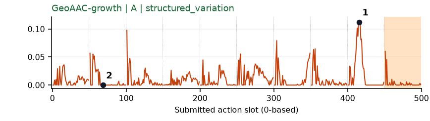](../figures/blocks_ranking_rgb/geoaac.png) | 受其他因素影响：谨慎：多次前缀尖峰；q8夹向蓝块，不能归结为唯一事件。 |
| [blocks_ranking_size](../tasks/blocks_ranking_size.md) | [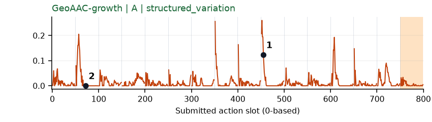](../figures/blocks_ranking_size/geoaac.png) | 较弱：弱：几乎每隔一个或几个chunk就有前缀峰，事件特异性不清。 |
| [click_alarmclock](../tasks/click_alarmclock.md) | [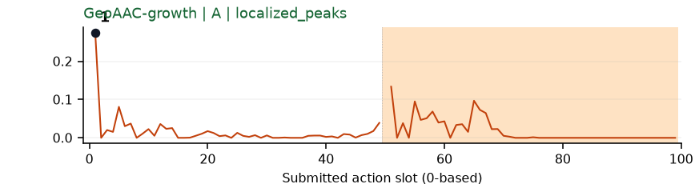](../figures/click_alarmclock/geoaac.png) | 较弱：弱：q0最前几个动作的前缀峰，不足以定位按键事件。 |
| [click_bell](../tasks/click_bell.md) | [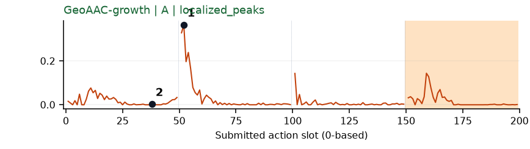](../figures/click_bell/geoaac.png) | 受其他因素影响：谨慎：q1开始突峰与前缀边界重合。 |
| [dump_bin_bigbin](../tasks/dump_bin_bigbin.md) | [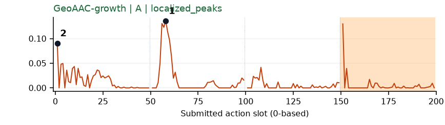](../figures/dump_bin_bigbin/geoaac.png) | 受其他因素影响：谨慎：q1提起容器时增长峰，前缀开头也偏高。 |
| [grab_roller](../tasks/grab_roller.md) | [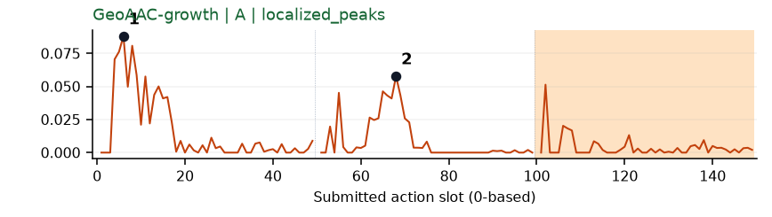](../figures/grab_roller/geoaac.png) | 受其他因素影响：谨慎：接近和夹取各有增长区，但chunk位置效应强。 |
| [handover_block](../tasks/handover_block.md) | [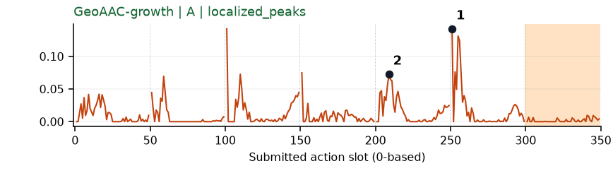](../figures/handover_block/geoaac.png) | 受其他因素影响：谨慎：q4/q5交接准备有增长峰，但夹杂多次chunk前段尖峰。 |
| [handover_mic](../tasks/handover_mic.md) | [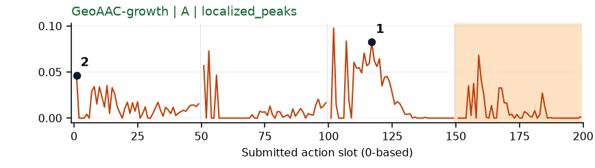](../figures/handover_mic/geoaac.png) | 可解释候选：阶段候选：q2交接动作前缀增长较大，需保留前缀含义。 |
| [hanging_mug](../tasks/hanging_mug.md) | [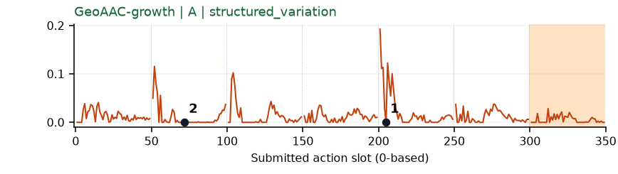](../figures/hanging_mug/geoaac.png) | 较弱：弱：每chunk前段反复出现尖峰，挂杯事件特异性不清。 |
| [lift_pot](../tasks/lift_pot.md) | [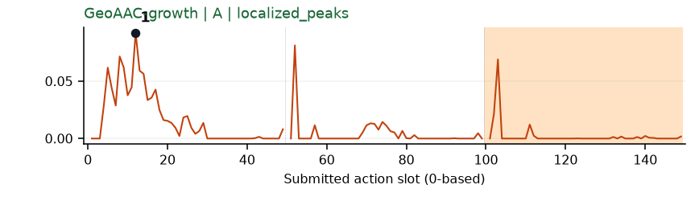](../figures/lift_pot/geoaac.png) | 受其他因素影响：谨慎：q0接近阶段较高，同时各chunk开头有窄尖峰。 |
| [move_can_pot](../tasks/move_can_pot.md) | [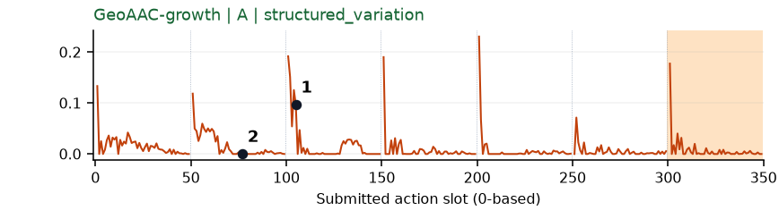](../figures/move_can_pot/geoaac.png) | 较弱：弱：多数chunk起始尖峰，搬运阶段与前缀效应难分。 |
| [move_pillbottle_pad](../tasks/move_pillbottle_pad.md) | [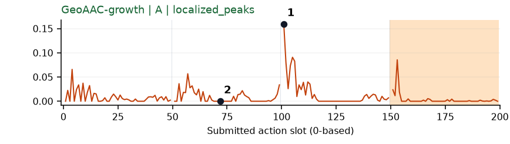](../figures/move_pillbottle_pad/geoaac.png) | 受其他因素影响：谨慎：q2移到垫子阶段增长峰位于前缀开头。 |
| [move_playingcard_away](../tasks/move_playingcard_away.md) | [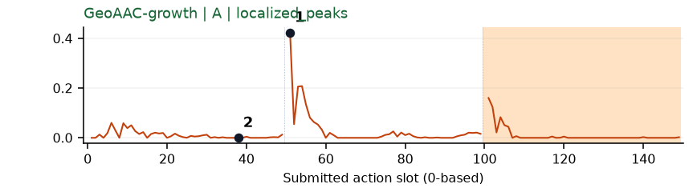](../figures/move_playingcard_away/geoaac.png) | 受其他因素影响：谨慎：q1抬起/移动纸牌时峰在chunk开头，前缀效应不可忽略。 |
| [move_stapler_pad](../tasks/move_stapler_pad.md) | [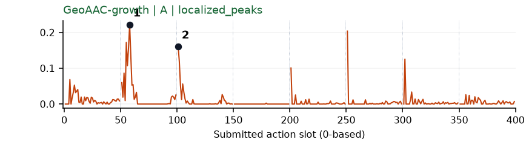](../figures/move_stapler_pad/geoaac.png) | 【失败例】受其他因素影响：谨慎：q1/q2搬运订书机时峰靠近chunk开头。 |
| [open_laptop](../tasks/open_laptop.md) | 无完整数据 | 缺数据：该任务未取得完整可复算批次。 |
| [open_microwave](../tasks/open_microwave.md) | [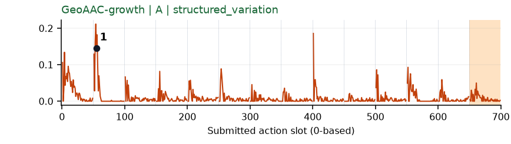](../figures/open_microwave/geoaac.png) | 较弱：弱：贯穿整条轨迹的chunk前段尖峰，不能当作多次开门事件。 |
| [pick_diverse_bottles](../tasks/pick_diverse_bottles.md) | [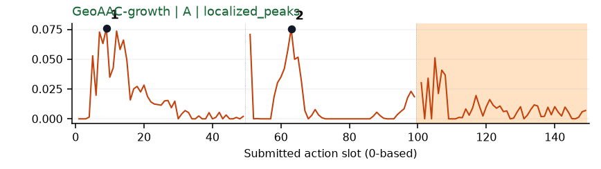](../figures/pick_diverse_bottles/geoaac.png) | 受其他因素影响：谨慎：接近/提瓶两段较高，但每段前部天然偏高。 |
| [pick_dual_bottles](../tasks/pick_dual_bottles.md) | [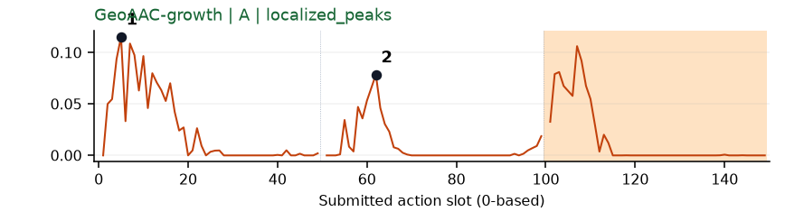](../figures/pick_dual_bottles/geoaac.png) | 受其他因素影响：谨慎：q0/q1前部出现双峰，与前缀位置相关。 |
| [place_a2b_left](../tasks/place_a2b_left.md) | [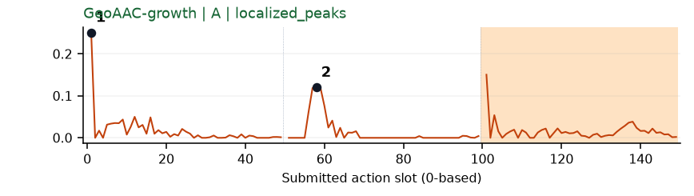](../figures/place_a2b_left/geoaac.png) | 较弱：弱：每chunk前几个动作尖峰，不能独立解释为搬运难度。 |
| [place_a2b_right](../tasks/place_a2b_right.md) | [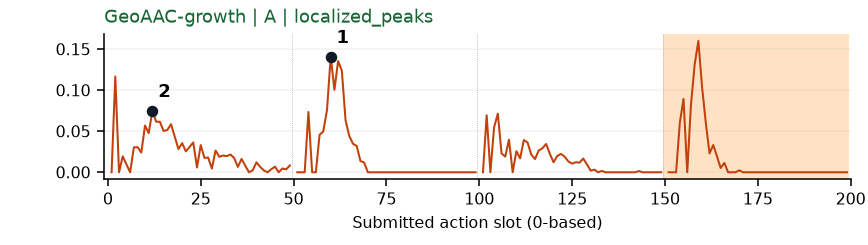](../figures/place_a2b_right/geoaac.png) | 受其他因素影响：谨慎：q1举起物体时前缀峰，chunk效应明显。 |
| [place_bread_basket](../tasks/place_bread_basket.md) | [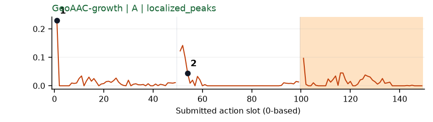](../figures/place_bread_basket/geoaac.png) | 较弱：弱：主要响应集中在初始前缀/各chunk前部。 |
| [place_bread_skillet](../tasks/place_bread_skillet.md) | [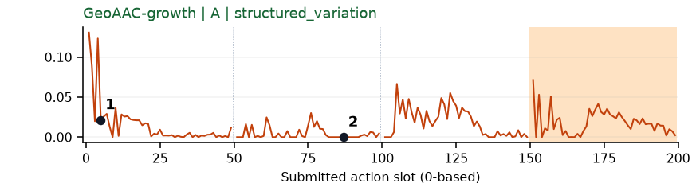](../figures/place_bread_skillet/geoaac.png) | 较弱：弱：前缀开头尖峰加多个小波动。 |
| [place_burger_fries](../tasks/place_burger_fries.md) | [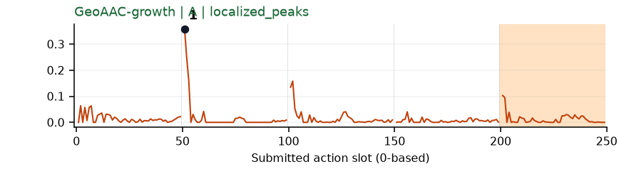](../figures/place_burger_fries/geoaac.png) | 受其他因素影响：谨慎：q1提起汉堡时首部峰，前缀效应混杂。 |
| [place_can_basket](../tasks/place_can_basket.md) | [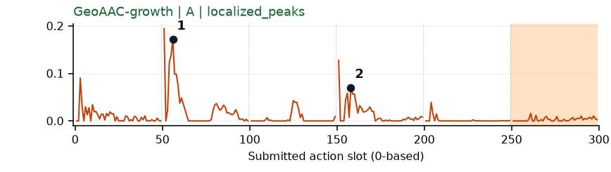](../figures/place_can_basket/geoaac.png) | 受其他因素影响：谨慎：提罐/入篮段增长峰仍贴近chunk首部。 |
| [place_cans_plasticbox](../tasks/place_cans_plasticbox.md) | [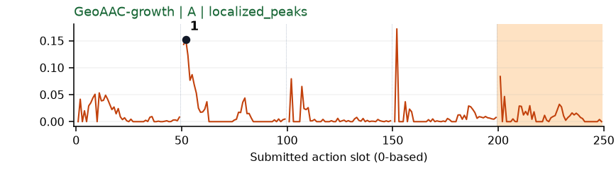](../figures/place_cans_plasticbox/geoaac.png) | 受其他因素影响：谨慎：q1抬罐的前缀开头峰，后续chunk也有类似尖峰。 |
| [place_container_plate](../tasks/place_container_plate.md) | [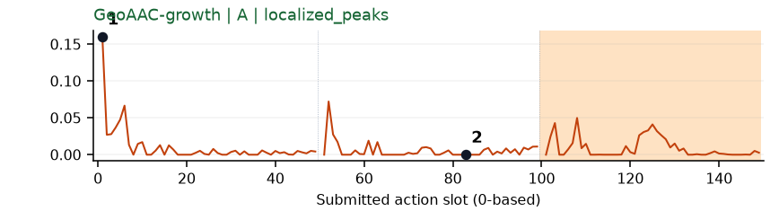](../figures/place_container_plate/geoaac.png) | 较弱：弱：q0前几个动作峰，不能解释为放到盘子的时刻。 |
| [place_dual_shoes](../tasks/place_dual_shoes.md) | [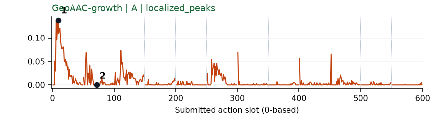](../figures/place_dual_shoes/geoaac.png) | 【失败例】受其他因素影响：失败例谨慎：初始接近较高，夹杂前缀开头尖峰。 |
| [place_empty_cup](../tasks/place_empty_cup.md) | [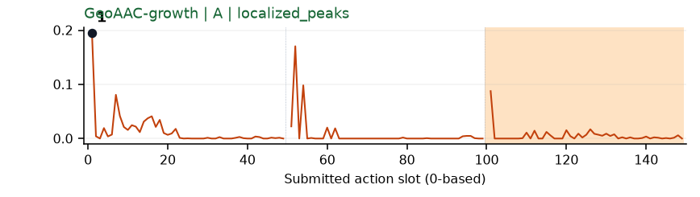](../figures/place_empty_cup/geoaac.png) | 较弱：弱：q0/q1最前位置尖峰，前缀结构主导。 |
| [place_fan](../tasks/place_fan.md) | 无完整数据 | 缺数据：该任务未取得完整可复算批次。 |
| [place_mouse_pad](../tasks/place_mouse_pad.md) | [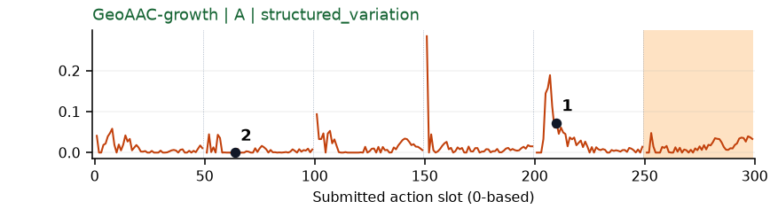](../figures/place_mouse_pad/geoaac.png) | 较弱：弱：多chunk开始尖峰，画面不足以区分具体放置事件。 |
| [place_object_basket](../tasks/place_object_basket.md) | [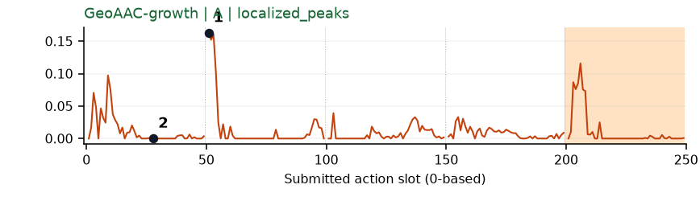](../figures/place_object_basket/geoaac.png) | 受其他因素影响：谨慎：q1提物的前缀开头孤立峰，未直接指向入篮。 |
| [place_object_scale](../tasks/place_object_scale.md) | 无完整数据 | 缺数据：该任务未取得完整可复算批次。 |
| [place_object_stand](../tasks/place_object_stand.md) | [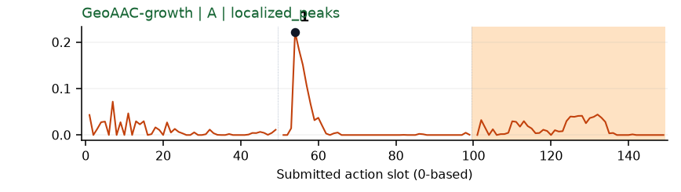](../figures/place_object_stand/geoaac.png) | 受其他因素影响：谨慎：q1物体移上台子的前缀开头峰。 |
| [place_phone_stand](../tasks/place_phone_stand.md) | [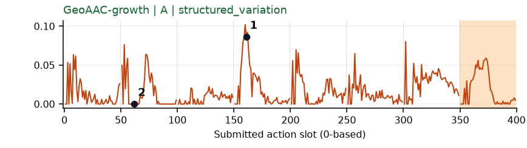](../figures/place_phone_stand/geoaac.png) | 可解释候选：阶段候选：同q3姿态调整前缀增长较高，另有多处尖峰。 |
| [place_shoe](../tasks/place_shoe.md) | [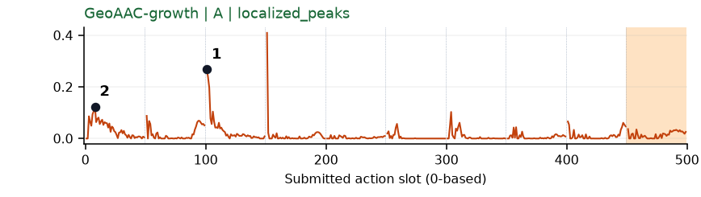](../figures/place_shoe/geoaac.png) | 受其他因素影响：谨慎：q2向垫子移动增长峰，但正位于chunk开头。 |
| [press_stapler](../tasks/press_stapler.md) | [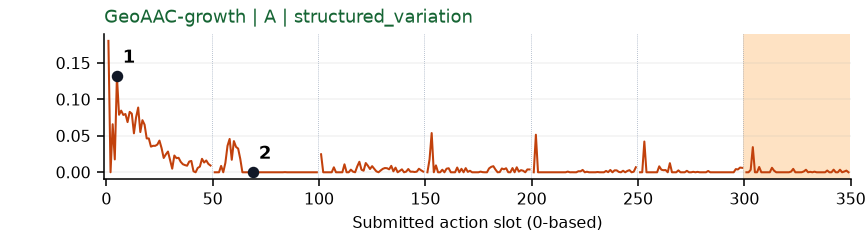](../figures/press_stapler/geoaac.png) | 较弱：弱：初始前缀为最高，后面每chunk开始仍有窄峰。 |
| [put_bottles_dustbin](../tasks/put_bottles_dustbin.md) | [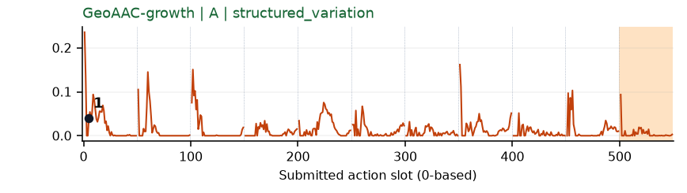](../figures/put_bottles_dustbin/geoaac.png) | 较弱：弱：初始前缀及其他chunk重复尖峰，事件特异性弱。 |
| [put_object_cabinet](../tasks/put_object_cabinet.md) | 无完整数据 | 缺数据：该任务未取得完整可复算批次。 |
| [rotate_qrcode](../tasks/rotate_qrcode.md) | [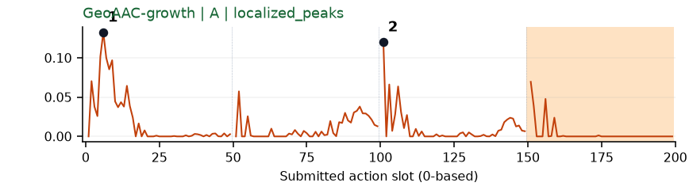](../figures/rotate_qrcode/geoaac.png) | 受其他因素影响：谨慎：q0/q2首部峰，夹起/转动牌架画面可见但前缀混杂。 |
| [scan_object](../tasks/scan_object.md) | [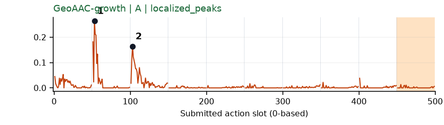](../figures/scan_object/geoaac.png) | 受其他因素影响：谨慎：q1/q2抓取与调整段增长峰位于前缀开头。 |
| [shake_bottle](../tasks/shake_bottle.md) | [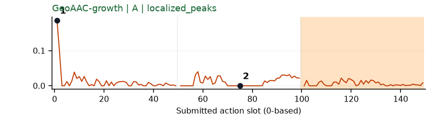](../figures/shake_bottle/geoaac.png) | 【补充数据】较弱：弱：初始前缀强峰；种子重复的补充数据。 |
| [shake_bottle_horizontally](../tasks/shake_bottle_horizontally.md) | [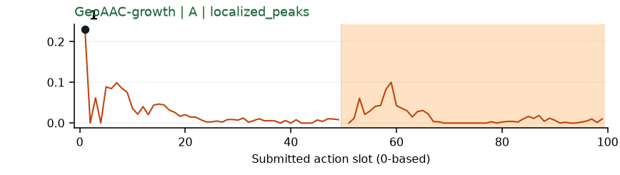](../figures/shake_bottle_horizontally/geoaac.png) | 较弱：弱：q0最前几个动作尖峰。 |
| [stack_blocks_three](../tasks/stack_blocks_three.md) | [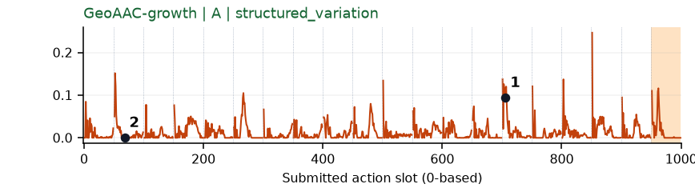](../figures/stack_blocks_three/geoaac.png) | 较弱：弱：几乎全程反复chunk前缀峰，难指认唯一堆叠事件。 |
| [stack_blocks_two](../tasks/stack_blocks_two.md) | [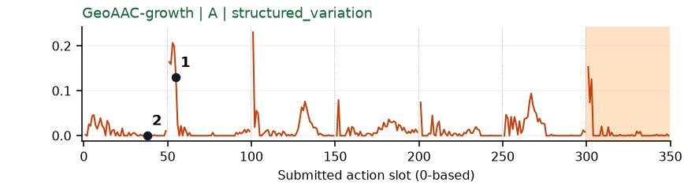](../figures/stack_blocks_two/geoaac.png) | 较弱：弱：多chunk开头重复尖峰，难分辨堆叠事件。 |
| [stack_bowls_three](../tasks/stack_bowls_three.md) | [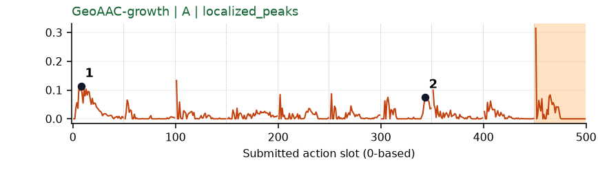](../figures/stack_bowls_three/geoaac.png) | 受其他因素影响：谨慎：初始前缀及q6有增长，另有多处边界尖峰。 |
| [stack_bowls_two](../tasks/stack_bowls_two.md) | [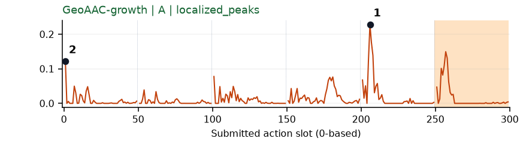](../figures/stack_bowls_two/geoaac.png) | 受其他因素影响：谨慎：q4提碗时增长峰贴近chunk前缘。 |
| [stamp_seal](../tasks/stamp_seal.md) | [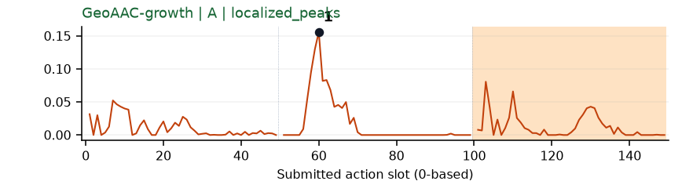](../figures/stamp_seal/geoaac.png) | 可解释候选：候选：q1拿起并向印面移动时局部增长区，仍要区分前缀效应。 |
| [turn_switch](../tasks/turn_switch.md) | [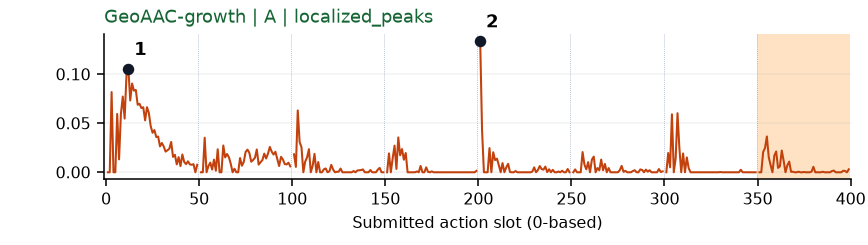](../figures/turn_switch/geoaac.png) | 受其他因素影响：谨慎：q0接近有宽区，q4窄峰在chunk首部，后者不宜解释为新接触。 |
