# Tell-Tale Norm：全部任务

[返回总目录](../README.md)

主图保留逐动作原始值；细虚线为chunk边界，橙色为终止段实际执行长度不明，未用于筛选。帧只对应chunk前后，不能精确定位某个h的接触瞬间。A/B/C是形态筛选等级，优先读人工备注。

| 任务 | 原始曲线缩略图 | 复核 |
|---|---|---|
| [adjust_bottle](../tasks/adjust_bottle.md) | [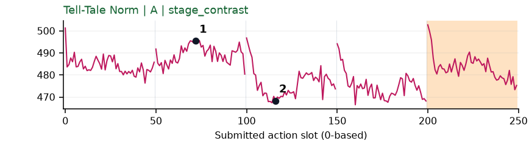](../figures/adjust_bottle/norm.png) | 阶段变化：阶段差异：持瓶调整前后幅度变化，叠加chunk首部尖峰。 |
| [beat_block_hammer](../tasks/beat_block_hammer.md) | [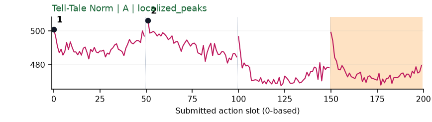](../figures/beat_block_hammer/norm.png) | 阶段变化：阶段差异存在，标记峰含chunk首部，不能直接解释为重要性。 |
| [blocks_ranking_rgb](../tasks/blocks_ranking_rgb.md) | [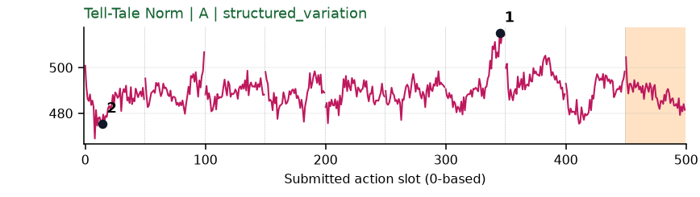](../figures/blocks_ranking_rgb/norm.png) | 可解释候选：阶段候选：q6手抬起/离开方块附近时幅度高；中间也有其他波动。 |
| [blocks_ranking_size](../tasks/blocks_ranking_size.md) | [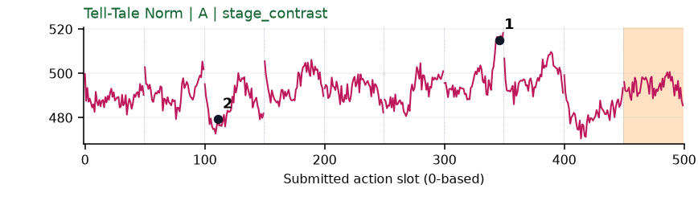](../figures/blocks_ranking_size/norm.png) | 可解释候选：阶段候选：q6抬起方块附近升高，相对变化不大。 |
| [click_alarmclock](../tasks/click_alarmclock.md) | [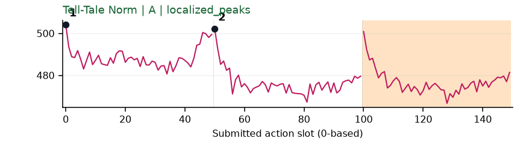](../figures/click_alarmclock/norm.png) | 较弱：弱：chunk开头反复抬高，画面变化很小。 |
| [click_bell](../tasks/click_bell.md) | [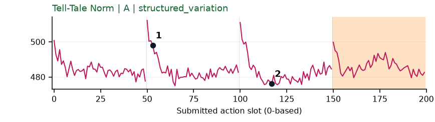](../figures/click_bell/norm.png) | 较弱：弱：每chunk开始重复高幅度，不能解释成每次都按铃。 |
| [dump_bin_bigbin](../tasks/dump_bin_bigbin.md) | [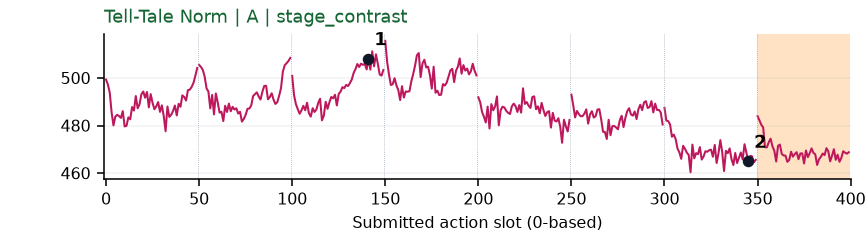](../figures/dump_bin_bigbin/norm.png) | 阶段变化：阶段差异：操作容器时较高，手离开视野后较低。 |
| [grab_roller](../tasks/grab_roller.md) | [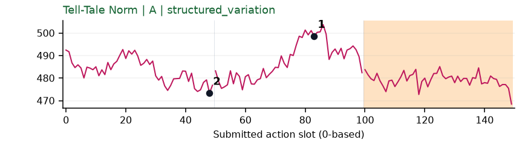](../figures/grab_roller/norm.png) | 可解释候选：阶段候选：q1双手贴近/夹取附近幅度变化；画面边缘遮挡。 |
| [handover_block](../tasks/handover_block.md) | [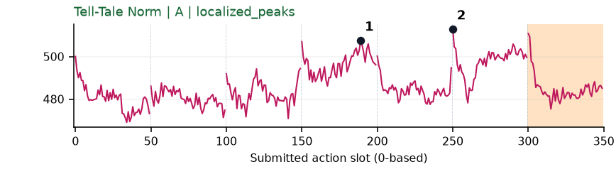](../figures/handover_block/norm.png) | 可解释候选：阶段候选：q3靠近接物位置和q5两手接近均形成高区。 |
| [handover_mic](../tasks/handover_mic.md) | [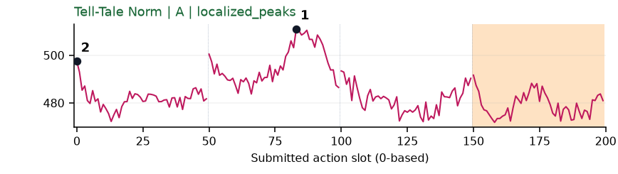](../figures/handover_mic/norm.png) | 可解释候选：阶段候选：q1抓起后搬运时形成宽峰，q2交接并非最高。 |
| [hanging_mug](../tasks/hanging_mug.md) | [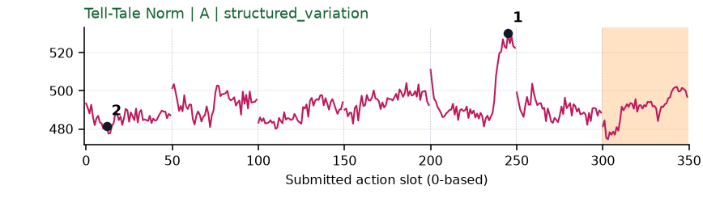](../figures/hanging_mug/norm.png) | 可解释候选：阶段候选：q4拿起/转动杯体时幅度明显增大。 |
| [lift_pot](../tasks/lift_pot.md) | [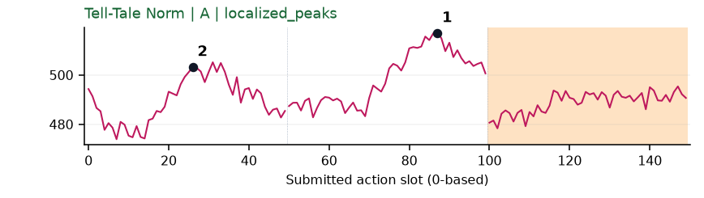](../figures/lift_pot/norm.png) | 可解释候选：阶段候选：双手靠近、握持锅的两段宽峰；位置效应也较大。 |
| [move_can_pot](../tasks/move_can_pot.md) | [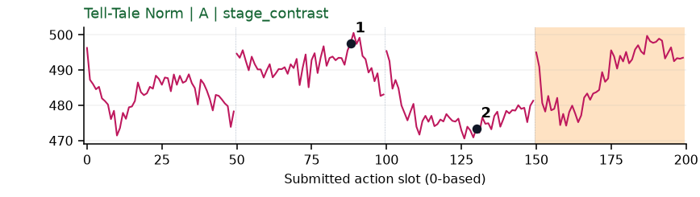](../figures/move_can_pot/norm.png) | 阶段变化：阶段差异存在，选中片段在画面右缘，不能精确解释。 |
| [move_pillbottle_pad](../tasks/move_pillbottle_pad.md) | [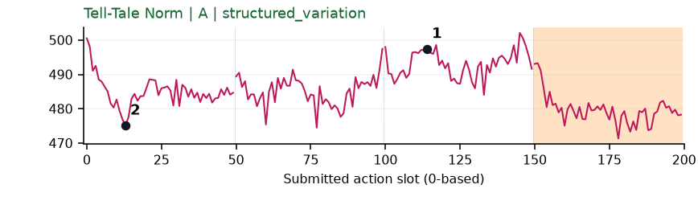](../figures/move_pillbottle_pad/norm.png) | 可解释候选：阶段候选：q2持瓶到垫子上方比初始接近阶段幅度高。 |
| [move_playingcard_away](../tasks/move_playingcard_away.md) | [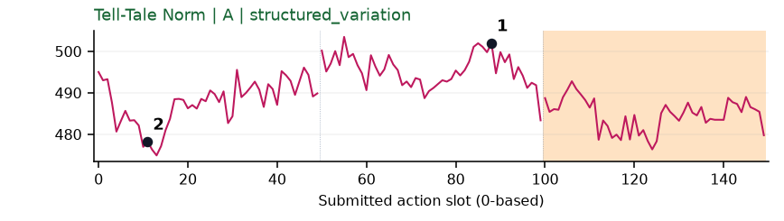](../figures/move_playingcard_away/norm.png) | 可解释候选：阶段候选：q1夹住纸牌移动时幅度高于初始阶段。 |
| [move_stapler_pad](../tasks/move_stapler_pad.md) | [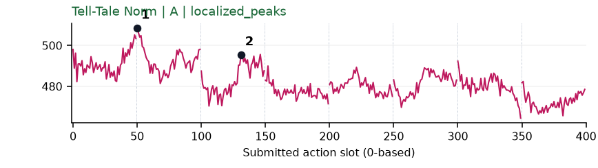](../figures/move_stapler_pad/norm.png) | 【失败例】阶段变化：失败例阶段差异：搬运订书机的q1/q2幅度较高。 |
| [open_laptop](../tasks/open_laptop.md) | 无完整数据 | 缺数据：该任务未取得完整可复算批次。 |
| [open_microwave](../tasks/open_microwave.md) | [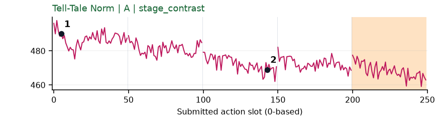](../figures/open_microwave/norm.png) | 阶段变化：阶段差异：初始靠近时高，持续操作后整体较低。 |
| [pick_diverse_bottles](../tasks/pick_diverse_bottles.md) | [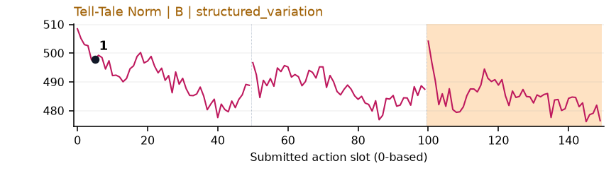](../figures/pick_diverse_bottles/norm.png) | 较弱：弱：缓慢幅度变化叠加chunk开头高值，事件分辨较弱。 |
| [pick_dual_bottles](../tasks/pick_dual_bottles.md) | [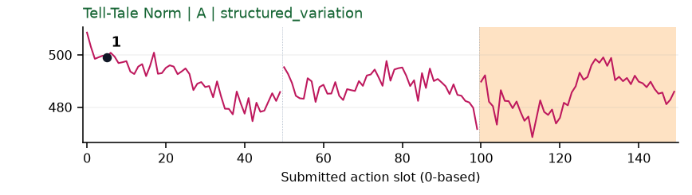](../figures/pick_dual_bottles/norm.png) | 较弱：弱：初段幅度较高但事件区分不明确。 |
| [place_a2b_left](../tasks/place_a2b_left.md) | [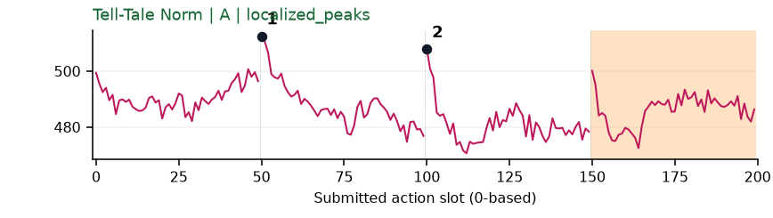](../figures/place_a2b_left/norm.png) | 较弱：弱：各chunk开头重复抬高，幅度变化含边界模式。 |
| [place_a2b_right](../tasks/place_a2b_right.md) | [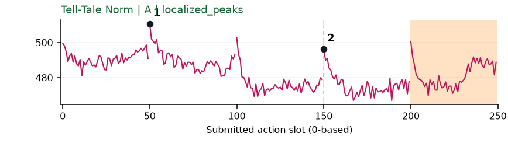](../figures/place_a2b_right/norm.png) | 较弱：弱：主要峰与chunk开头重合。 |
| [place_bread_basket](../tasks/place_bread_basket.md) | [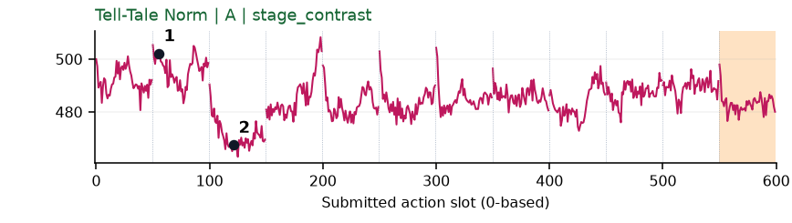](../figures/place_bread_basket/norm.png) | 阶段变化：阶段差异：抓面包和移入篮子幅度不同，但并非DV主峰位置。 |
| [place_bread_skillet](../tasks/place_bread_skillet.md) | [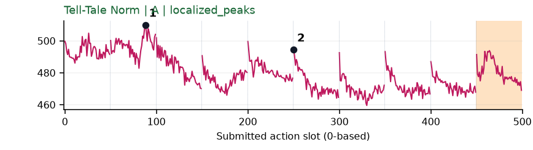](../figures/place_bread_skillet/norm.png) | 阶段变化：阶段差异：q1持面包时高，之后较低；chunk首部尖峰重复。 |
| [place_burger_fries](../tasks/place_burger_fries.md) | [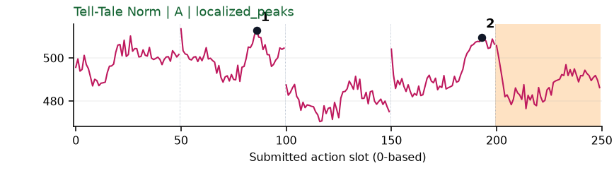](../figures/place_burger_fries/norm.png) | 可解释候选：阶段候选：q1提起食物和q3放下后另一只手靠近时较高。 |
| [place_can_basket](../tasks/place_can_basket.md) | [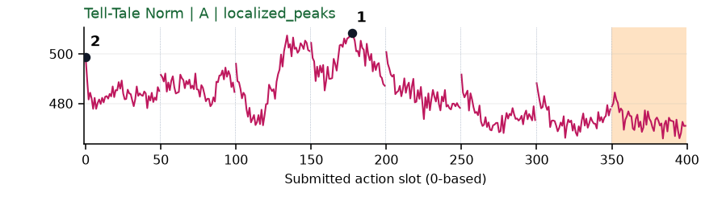](../figures/place_can_basket/norm.png) | 可解释候选：候选：q2/q3篮口对准并向内放置时宽高区。 |
| [place_cans_plasticbox](../tasks/place_cans_plasticbox.md) | [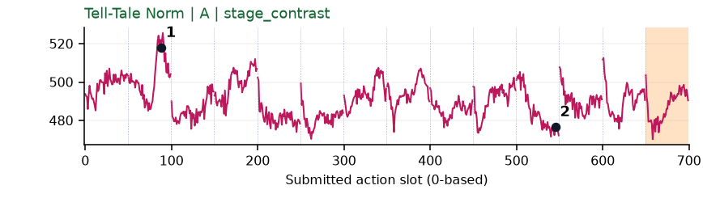](../figures/place_cans_plasticbox/norm.png) | 可解释候选：阶段候选：q1双手握罐抬起时幅度高，放好后较低。 |
| [place_container_plate](../tasks/place_container_plate.md) | [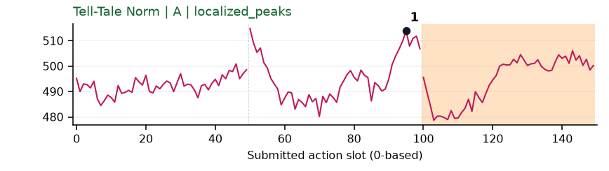](../figures/place_container_plate/norm.png) | 可解释候选：阶段候选：q1持容器靠近盘子时幅度高，但末端也有固定上升。 |
| [place_dual_shoes](../tasks/place_dual_shoes.md) | [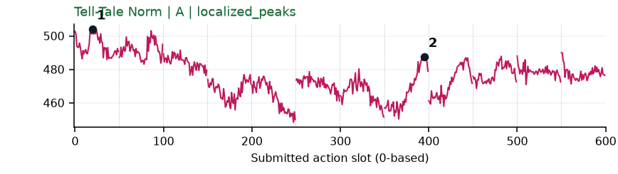](../figures/place_dual_shoes/norm.png) | 【失败例】阶段变化：失败例阶段差异：早期拿鞋幅度高，后续低；不能解释为成功程度。 |
| [place_empty_cup](../tasks/place_empty_cup.md) | [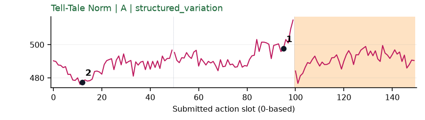](../figures/place_empty_cup/norm.png) | 受其他因素影响：谨慎：q1末端幅度上升，位置效应显著。 |
| [place_fan](../tasks/place_fan.md) | 无完整数据 | 缺数据：该任务未取得完整可复算批次。 |
| [place_mouse_pad](../tasks/place_mouse_pad.md) | [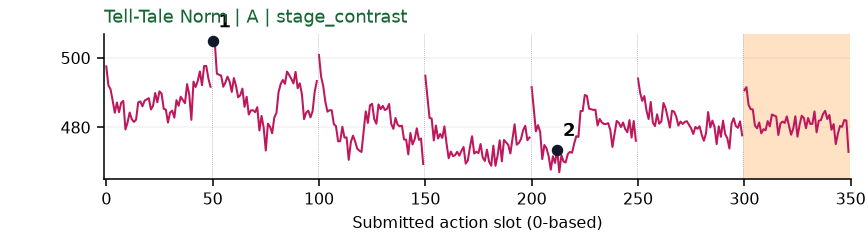](../figures/place_mouse_pad/norm.png) | 较弱：弱阶段差异：q1拿鼠标较高、之后较低，重复边界尖峰不少。 |
| [place_object_basket](../tasks/place_object_basket.md) | [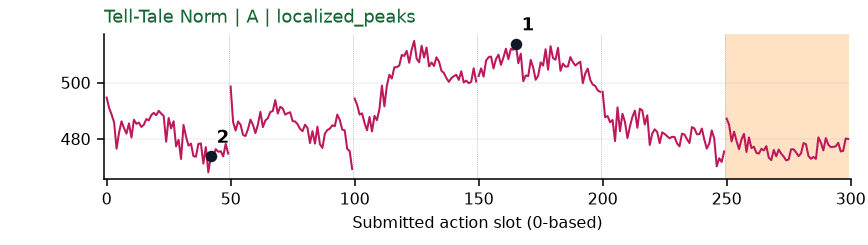](../figures/place_object_basket/norm.png) | 可解释候选：优先阶段候选：q2/q3持物越过篮口并放入时宽高区，之后回落。 |
| [place_object_scale](../tasks/place_object_scale.md) | 无完整数据 | 缺数据：该任务未取得完整可复算批次。 |
| [place_object_stand](../tasks/place_object_stand.md) | [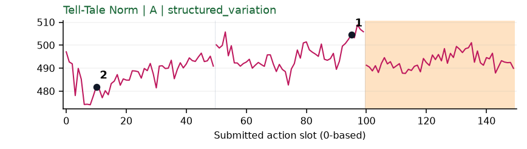](../figures/place_object_stand/norm.png) | 可解释候选：阶段候选：q1拿物体靠近台面时较高，边界影响不可忽略。 |
| [place_phone_stand](../tasks/place_phone_stand.md) | [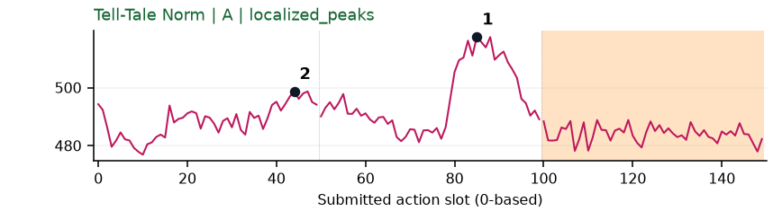](../figures/place_phone_stand/norm.png) | 可解释候选：候选：较短成功轨迹q1手机向支架移动时宽峰。 |
| [place_shoe](../tasks/place_shoe.md) | [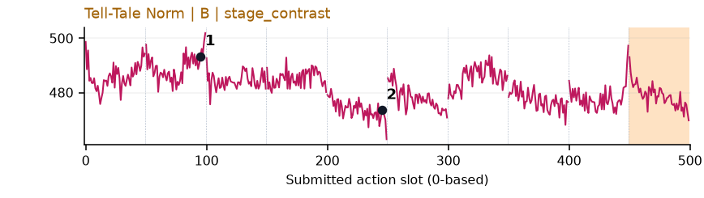](../figures/place_shoe/norm.png) | 阶段变化：阶段差异较弱：提鞋前后幅度不同，不能单独定位重要事件。 |
| [press_stapler](../tasks/press_stapler.md) | [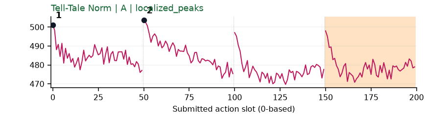](../figures/press_stapler/norm.png) | 较弱：弱：chunk起点反复高值。 |
| [put_bottles_dustbin](../tasks/put_bottles_dustbin.md) | [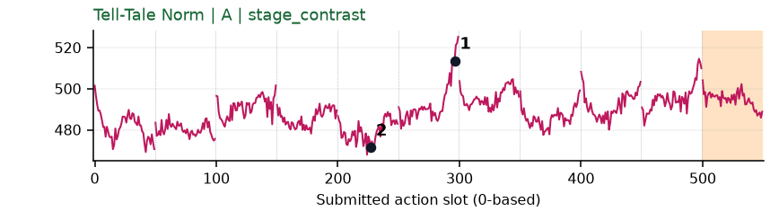](../figures/put_bottles_dustbin/norm.png) | 受其他因素影响：谨慎：q5高峰画面主要在边缘，语义证据不够。 |
| [put_object_cabinet](../tasks/put_object_cabinet.md) | 无完整数据 | 缺数据：该任务未取得完整可复算批次。 |
| [rotate_qrcode](../tasks/rotate_qrcode.md) | [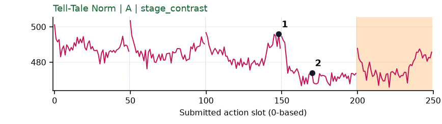](../figures/rotate_qrcode/norm.png) | 可解释候选：阶段候选：q2牌面被转到镜头前时幅度高，q3保持时低。 |
| [scan_object](../tasks/scan_object.md) | [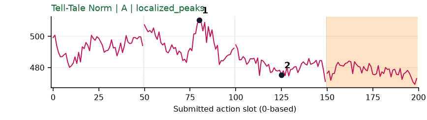](../figures/scan_object/norm.png) | 可解释候选：阶段候选：q1持扫描器准备转向时幅度高，q2转向后较低。 |
| [shake_bottle](../tasks/shake_bottle.md) | [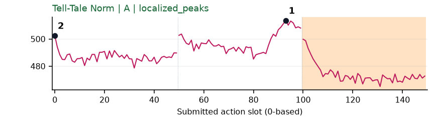](../figures/shake_bottle/norm.png) | 【补充数据】可解释候选：补充数据阶段候选：q1提起瓶子时幅度高。 |
| [shake_bottle_horizontally](../tasks/shake_bottle_horizontally.md) | [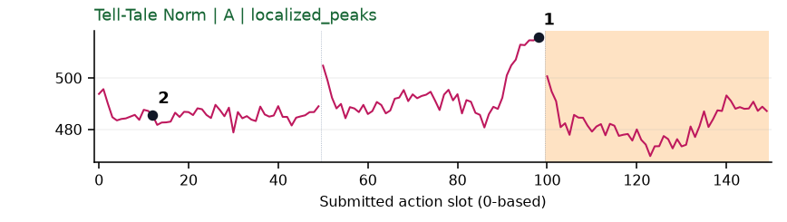](../figures/shake_bottle_horizontally/norm.png) | 可解释候选：候选：q1抬起瓶子附近宽峰清楚，尚不能对应摇动周期。 |
| [stack_blocks_three](../tasks/stack_blocks_three.md) | [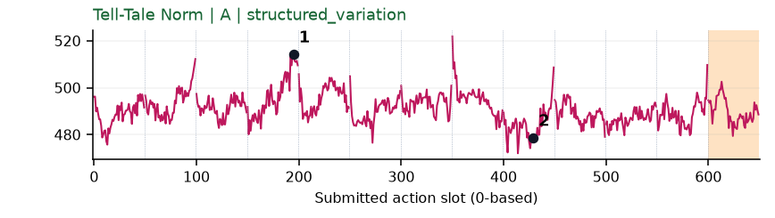](../figures/stack_blocks_three/norm.png) | 可解释候选：阶段候选：q3拿起方块时幅度高，q8移开后低。 |
| [stack_blocks_two](../tasks/stack_blocks_two.md) | [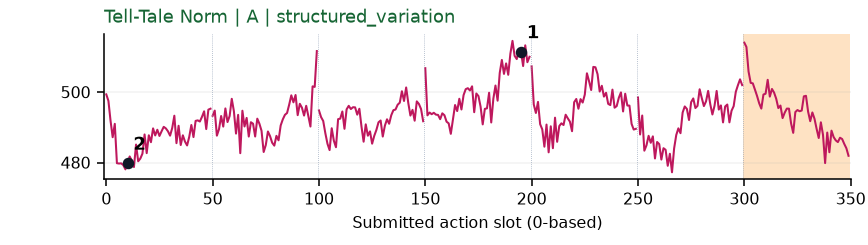](../figures/stack_blocks_two/norm.png) | 可解释候选：阶段候选：q3从原位置提起方块时宽峰。 |
| [stack_bowls_three](../tasks/stack_bowls_three.md) | [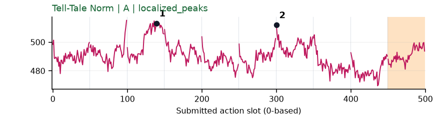](../figures/stack_bowls_three/norm.png) | 可解释候选：阶段候选：q2搬碗、q6堆叠附近有两个较宽高区。 |
| [stack_bowls_two](../tasks/stack_bowls_two.md) | [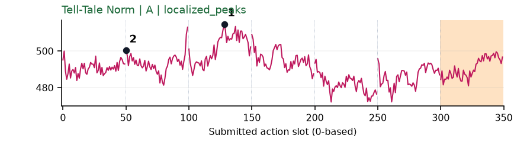](../figures/stack_bowls_two/norm.png) | 可解释候选：候选：q2搬碗时宽高区，幅度变化可见但不是重要性的证明。 |
| [stamp_seal](../tasks/stamp_seal.md) | [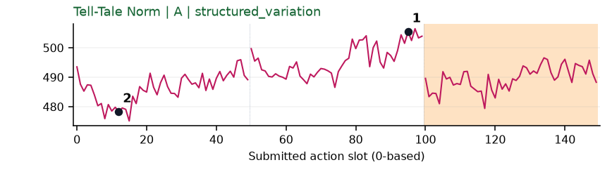](../figures/stamp_seal/norm.png) | 可解释候选：候选：q1印章移向印面时逐渐升高。 |
| [turn_switch](../tasks/turn_switch.md) | [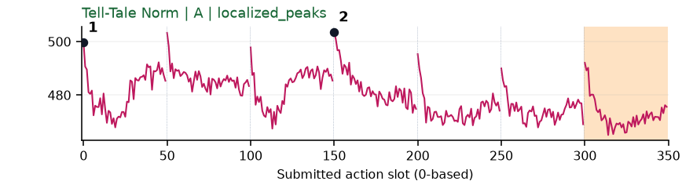](../figures/turn_switch/norm.png) | 较弱：弱：每chunk开头反复高，难解释为每次都发生关键事件。 |
