# SHIFT：全部任务

[返回总目录](../README.md)

主图保留逐动作原始值；细虚线为chunk边界，橙色为终止段实际执行长度不明，未用于筛选。帧只对应chunk前后，不能精确定位某个h的接触瞬间。A/B/C是形态筛选等级，优先读人工备注。

| 任务 | 原始曲线缩略图 | 复核 |
|---|---|---|
| [adjust_bottle](../tasks/adjust_bottle.md) | [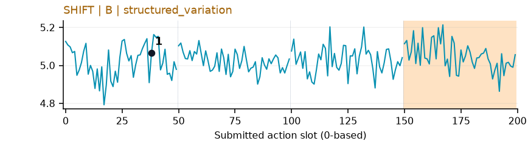](../figures/adjust_bottle/shift.png) | 较弱：弱：小幅抖动/阶段基线变化，未见可靠独立事件对应；路径长度混杂强。 |
| [beat_block_hammer](../tasks/beat_block_hammer.md) | [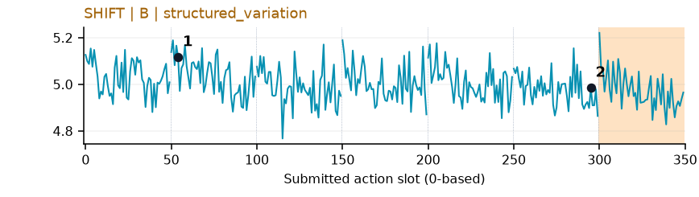](../figures/beat_block_hammer/shift.png) | 较弱：弱：小幅抖动/阶段基线变化，未见可靠独立事件对应；路径长度混杂强。 |
| [blocks_ranking_rgb](../tasks/blocks_ranking_rgb.md) | [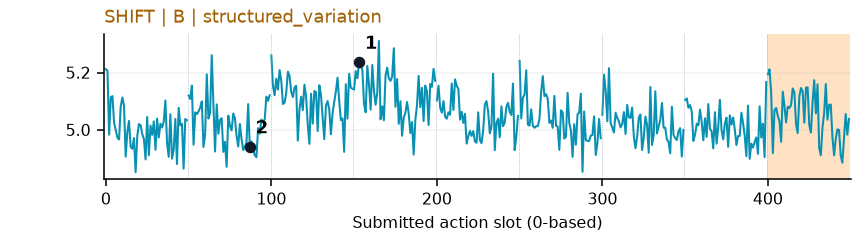](../figures/blocks_ranking_rgb/shift.png) | 较弱：弱：小幅抖动/阶段基线变化，未见可靠独立事件对应；路径长度混杂强。 |
| [blocks_ranking_size](../tasks/blocks_ranking_size.md) | [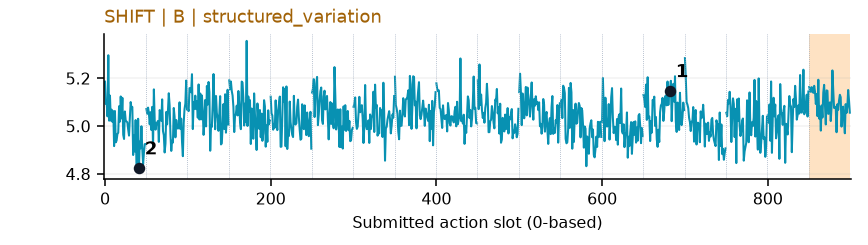](../figures/blocks_ranking_size/shift.png) | 较弱：弱：小幅抖动/阶段基线变化，未见可靠独立事件对应；路径长度混杂强。 |
| [click_alarmclock](../tasks/click_alarmclock.md) | [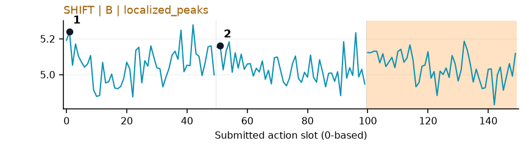](../figures/click_alarmclock/shift.png) | 较弱：弱：小幅抖动/阶段基线变化，未见可靠独立事件对应；路径长度混杂强。 |
| [click_bell](../tasks/click_bell.md) | [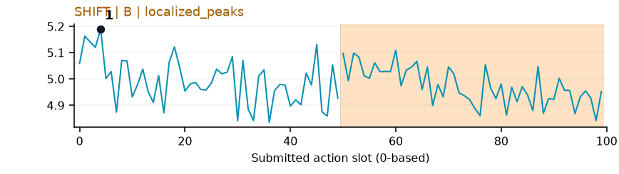](../figures/click_bell/shift.png) | 较弱：弱：小幅抖动/阶段基线变化，未见可靠独立事件对应；路径长度混杂强。 |
| [dump_bin_bigbin](../tasks/dump_bin_bigbin.md) | [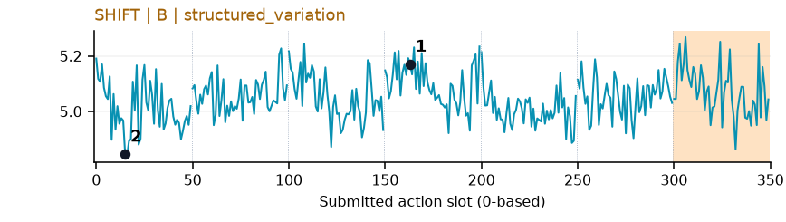](../figures/dump_bin_bigbin/shift.png) | 较弱：弱：小幅抖动/阶段基线变化，未见可靠独立事件对应；路径长度混杂强。 |
| [grab_roller](../tasks/grab_roller.md) | [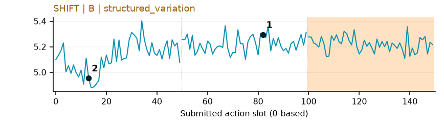](../figures/grab_roller/shift.png) | 较弱：弱阶段趋势：接近后略抬高但抖动密集，路径长度混杂强。 |
| [handover_block](../tasks/handover_block.md) | [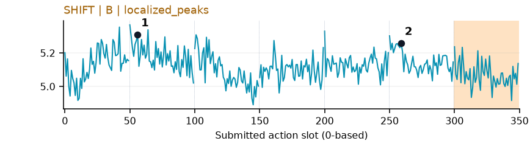](../figures/handover_block/shift.png) | 较弱：弱：小幅抖动/阶段基线变化，未见可靠独立事件对应；路径长度混杂强。 |
| [handover_mic](../tasks/handover_mic.md) | [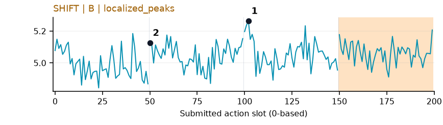](../figures/handover_mic/shift.png) | 较弱：弱：小幅抖动/阶段基线变化，未见可靠独立事件对应；路径长度混杂强。 |
| [hanging_mug](../tasks/hanging_mug.md) | [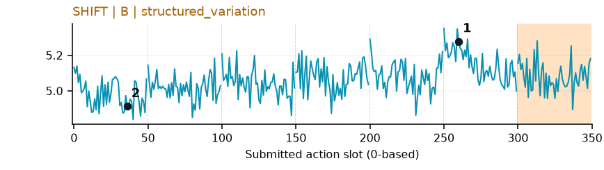](../figures/hanging_mug/shift.png) | 较弱：弱：小幅抖动/阶段基线变化，未见可靠独立事件对应；路径长度混杂强。 |
| [lift_pot](../tasks/lift_pot.md) | [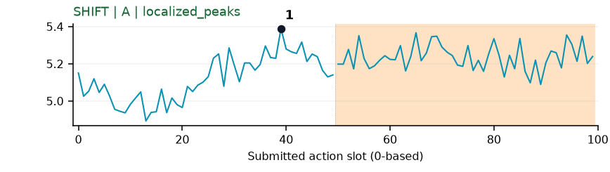](../figures/lift_pot/shift.png) | 较弱：弱阶段候选：接近锅时先低后高，但位置模板与路径长度混杂强。 |
| [move_can_pot](../tasks/move_can_pot.md) | [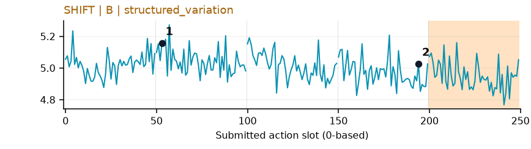](../figures/move_can_pot/shift.png) | 较弱：弱：小幅抖动/阶段基线变化，未见可靠独立事件对应；路径长度混杂强。 |
| [move_pillbottle_pad](../tasks/move_pillbottle_pad.md) | [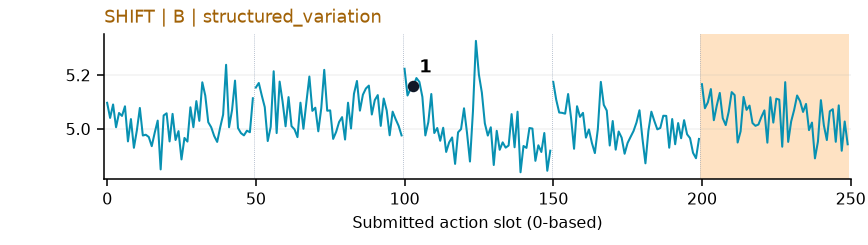](../figures/move_pillbottle_pad/shift.png) | 较弱：弱：小幅抖动/阶段基线变化，未见可靠独立事件对应；路径长度混杂强。 |
| [move_playingcard_away](../tasks/move_playingcard_away.md) | [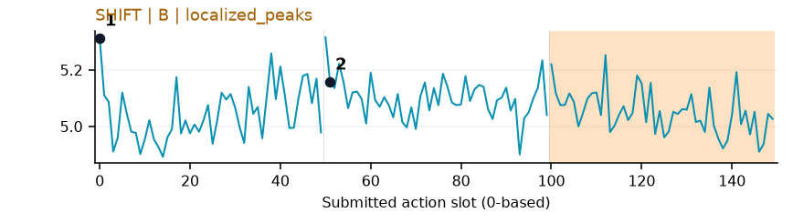](../figures/move_playingcard_away/shift.png) | 较弱：弱：小幅抖动/阶段基线变化，未见可靠独立事件对应；路径长度混杂强。 |
| [move_stapler_pad](../tasks/move_stapler_pad.md) | [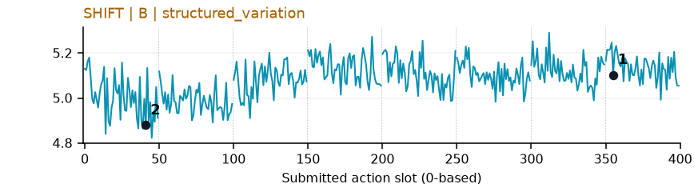](../figures/move_stapler_pad/shift.png) | 【失败例】较弱：弱：小幅抖动/阶段基线变化，未见可靠独立事件对应；路径长度混杂强。 |
| [open_laptop](../tasks/open_laptop.md) | 无完整数据 | 缺数据：该任务未取得完整可复算批次。 |
| [open_microwave](../tasks/open_microwave.md) | [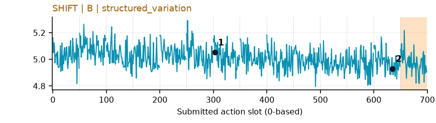](../figures/open_microwave/shift.png) | 较弱：弱：小幅抖动/阶段基线变化，未见可靠独立事件对应；路径长度混杂强。 |
| [pick_diverse_bottles](../tasks/pick_diverse_bottles.md) | [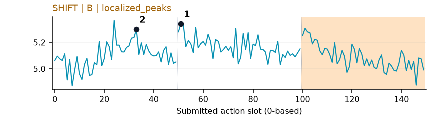](../figures/pick_diverse_bottles/shift.png) | 较弱：弱：小幅抖动/阶段基线变化，未见可靠独立事件对应；路径长度混杂强。 |
| [pick_dual_bottles](../tasks/pick_dual_bottles.md) | [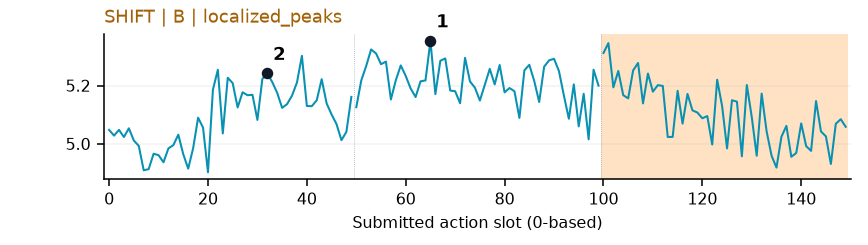](../figures/pick_dual_bottles/shift.png) | 较弱：弱阶段趋势：接近/提瓶期间宽高区，抖动与路径长度混杂。 |
| [place_a2b_left](../tasks/place_a2b_left.md) | [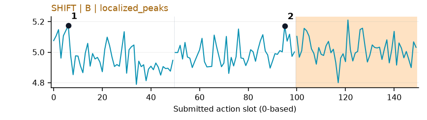](../figures/place_a2b_left/shift.png) | 较弱：弱：小幅抖动/阶段基线变化，未见可靠独立事件对应；路径长度混杂强。 |
| [place_a2b_right](../tasks/place_a2b_right.md) | [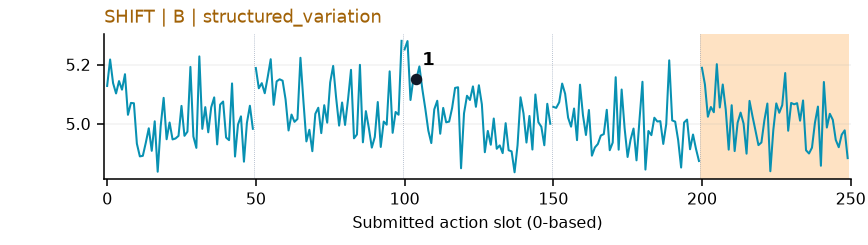](../figures/place_a2b_right/shift.png) | 较弱：弱：小幅抖动/阶段基线变化，未见可靠独立事件对应；路径长度混杂强。 |
| [place_bread_basket](../tasks/place_bread_basket.md) | [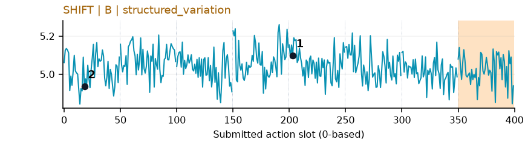](../figures/place_bread_basket/shift.png) | 较弱：弱：小幅抖动/阶段基线变化，未见可靠独立事件对应；路径长度混杂强。 |
| [place_bread_skillet](../tasks/place_bread_skillet.md) | [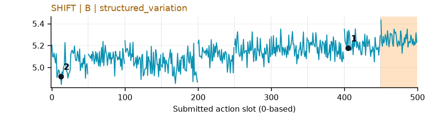](../figures/place_bread_skillet/shift.png) | 较弱：弱：小幅抖动/阶段基线变化，未见可靠独立事件对应；路径长度混杂强。 |
| [place_burger_fries](../tasks/place_burger_fries.md) | [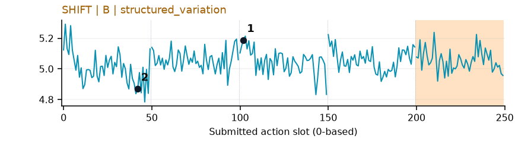](../figures/place_burger_fries/shift.png) | 较弱：弱：小幅抖动/阶段基线变化，未见可靠独立事件对应；路径长度混杂强。 |
| [place_can_basket](../tasks/place_can_basket.md) | [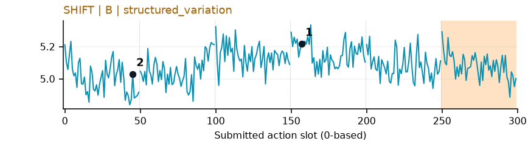](../figures/place_can_basket/shift.png) | 较弱：弱：小幅抖动/阶段基线变化，未见可靠独立事件对应；路径长度混杂强。 |
| [place_cans_plasticbox](../tasks/place_cans_plasticbox.md) | [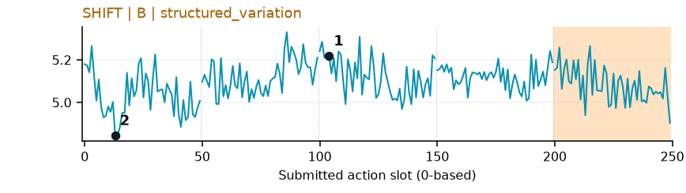](../figures/place_cans_plasticbox/shift.png) | 较弱：弱：小幅抖动/阶段基线变化，未见可靠独立事件对应；路径长度混杂强。 |
| [place_container_plate](../tasks/place_container_plate.md) | [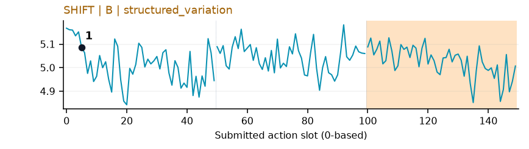](../figures/place_container_plate/shift.png) | 较弱：弱：小幅抖动/阶段基线变化，未见可靠独立事件对应；路径长度混杂强。 |
| [place_dual_shoes](../tasks/place_dual_shoes.md) | [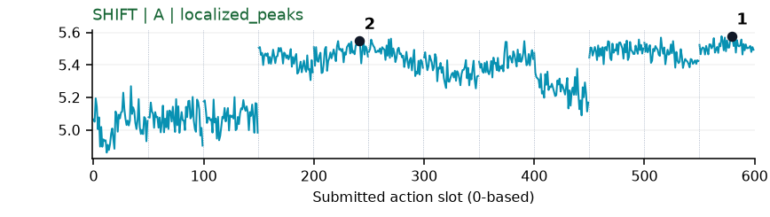](../figures/place_dual_shoes/shift.png) | 【失败例】可解释候选：失败例阶段候选：q3后多个chunk整体抬高，不是少量事件峰；路径长度混杂明显。 |
| [place_empty_cup](../tasks/place_empty_cup.md) | [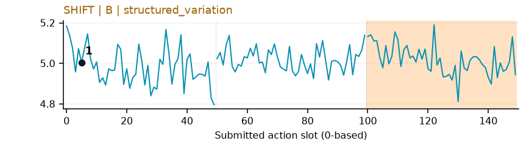](../figures/place_empty_cup/shift.png) | 较弱：弱：小幅抖动/阶段基线变化，未见可靠独立事件对应；路径长度混杂强。 |
| [place_fan](../tasks/place_fan.md) | 无完整数据 | 缺数据：该任务未取得完整可复算批次。 |
| [place_mouse_pad](../tasks/place_mouse_pad.md) | [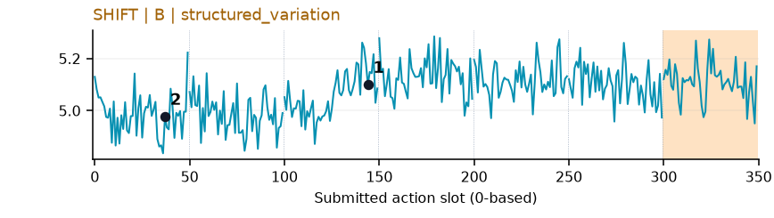](../figures/place_mouse_pad/shift.png) | 较弱：弱：小幅抖动/阶段基线变化，未见可靠独立事件对应；路径长度混杂强。 |
| [place_object_basket](../tasks/place_object_basket.md) | [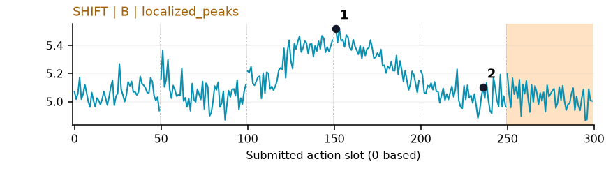](../figures/place_object_basket/shift.png) | 受其他因素影响：阶段候选但混杂强：与Fresco同轨迹入篮时宽高区，不足以证明是语义难度。 |
| [place_object_scale](../tasks/place_object_scale.md) | 无完整数据 | 缺数据：该任务未取得完整可复算批次。 |
| [place_object_stand](../tasks/place_object_stand.md) | [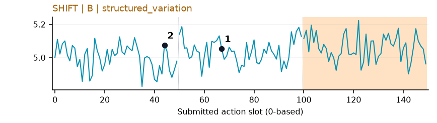](../figures/place_object_stand/shift.png) | 较弱：弱：小幅抖动/阶段基线变化，未见可靠独立事件对应；路径长度混杂强。 |
| [place_phone_stand](../tasks/place_phone_stand.md) | [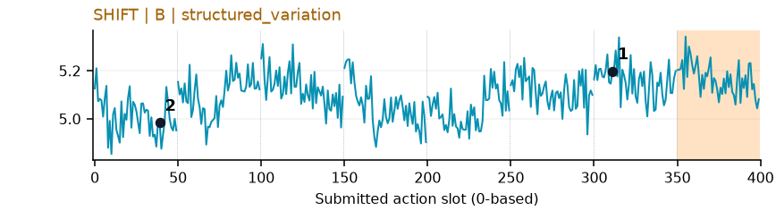](../figures/place_phone_stand/shift.png) | 较弱：弱：小幅抖动/阶段基线变化，未见可靠独立事件对应；路径长度混杂强。 |
| [place_shoe](../tasks/place_shoe.md) | [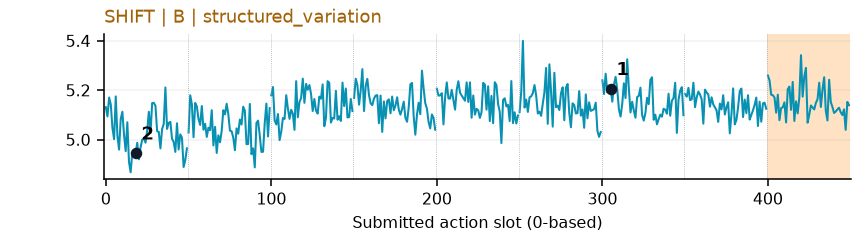](../figures/place_shoe/shift.png) | 较弱：弱：小幅抖动/阶段基线变化，未见可靠独立事件对应；路径长度混杂强。 |
| [press_stapler](../tasks/press_stapler.md) | [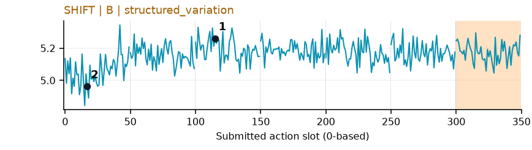](../figures/press_stapler/shift.png) | 较弱：弱：小幅抖动/阶段基线变化，未见可靠独立事件对应；路径长度混杂强。 |
| [put_bottles_dustbin](../tasks/put_bottles_dustbin.md) | [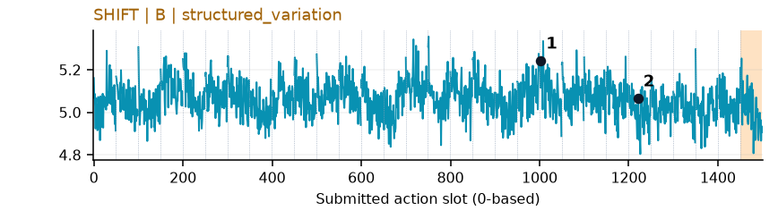](../figures/put_bottles_dustbin/shift.png) | 较弱：弱：小幅抖动/阶段基线变化，未见可靠独立事件对应；路径长度混杂强。 |
| [put_object_cabinet](../tasks/put_object_cabinet.md) | 无完整数据 | 缺数据：该任务未取得完整可复算批次。 |
| [rotate_qrcode](../tasks/rotate_qrcode.md) | [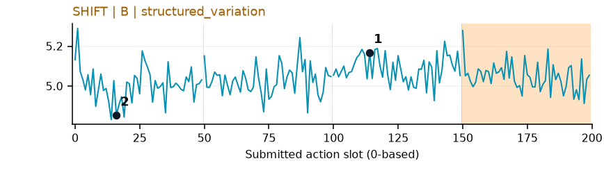](../figures/rotate_qrcode/shift.png) | 较弱：弱：小幅抖动/阶段基线变化，未见可靠独立事件对应；路径长度混杂强。 |
| [scan_object](../tasks/scan_object.md) | [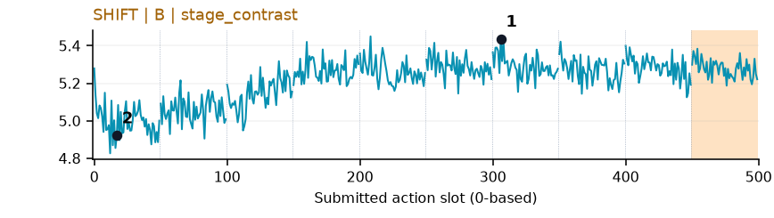](../figures/scan_object/shift.png) | 较弱：弱阶段趋势：拿起扫描器后基线升高，不能解释为扫描成功。 |
| [shake_bottle](../tasks/shake_bottle.md) | [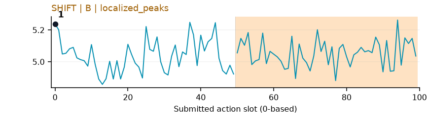](../figures/shake_bottle/shift.png) | 【补充数据】较弱：弱：小幅抖动/阶段基线变化，未见可靠独立事件对应；路径长度混杂强。 |
| [shake_bottle_horizontally](../tasks/shake_bottle_horizontally.md) | [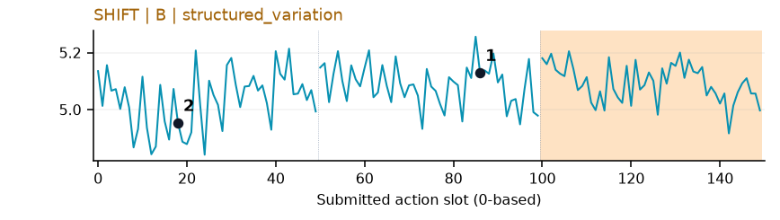](../figures/shake_bottle_horizontally/shift.png) | 较弱：弱：小幅抖动/阶段基线变化，未见可靠独立事件对应；路径长度混杂强。 |
| [stack_blocks_three](../tasks/stack_blocks_three.md) | [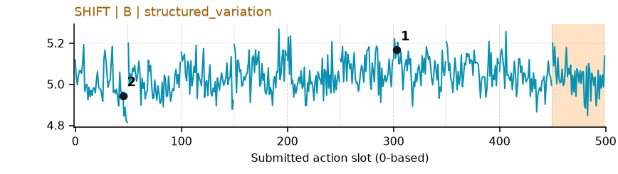](../figures/stack_blocks_three/shift.png) | 较弱：弱：小幅抖动/阶段基线变化，未见可靠独立事件对应；路径长度混杂强。 |
| [stack_blocks_two](../tasks/stack_blocks_two.md) | [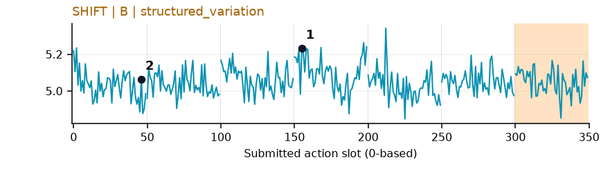](../figures/stack_blocks_two/shift.png) | 较弱：弱：小幅抖动/阶段基线变化，未见可靠独立事件对应；路径长度混杂强。 |
| [stack_bowls_three](../tasks/stack_bowls_three.md) | [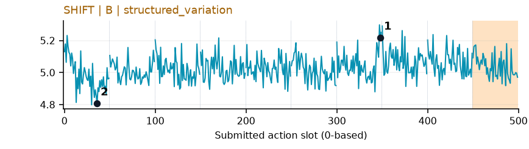](../figures/stack_bowls_three/shift.png) | 较弱：弱：小幅抖动/阶段基线变化，未见可靠独立事件对应；路径长度混杂强。 |
| [stack_bowls_two](../tasks/stack_bowls_two.md) | [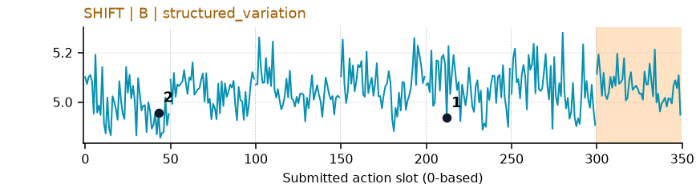](../figures/stack_bowls_two/shift.png) | 较弱：弱：小幅抖动/阶段基线变化，未见可靠独立事件对应；路径长度混杂强。 |
| [stamp_seal](../tasks/stamp_seal.md) | [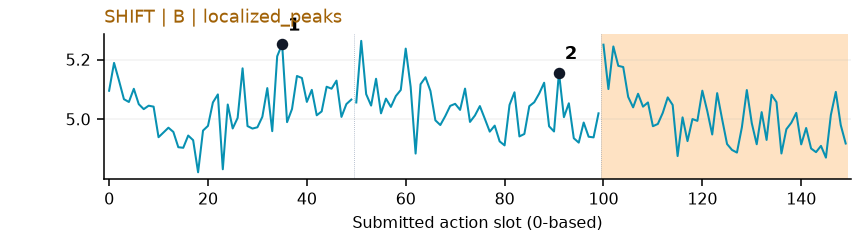](../figures/stamp_seal/shift.png) | 较弱：弱：小幅抖动/阶段基线变化，未见可靠独立事件对应；路径长度混杂强。 |
| [turn_switch](../tasks/turn_switch.md) | [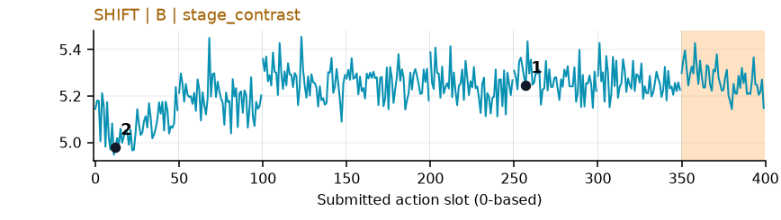](../figures/turn_switch/shift.png) | 较弱：弱阶段趋势：靠近开关后基线略抬高，抖动与路径长度混杂强。 |
