# SR-window5：全部任务

[返回总目录](../README.md)

主图保留逐动作原始值；细虚线为chunk边界，橙色为终止段实际执行长度不明，未用于筛选。帧只对应chunk前后，不能精确定位某个h的接触瞬间。A/B/C是形态筛选等级，优先读人工备注。

| 任务 | 原始曲线缩略图 | 复核 |
|---|---|---|
| [adjust_bottle](../tasks/adjust_bottle.md) | [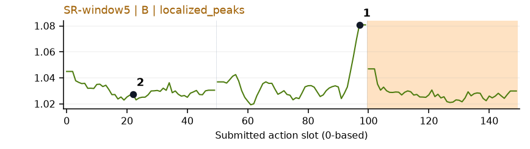](../figures/adjust_bottle/sr.png) | 受其他因素影响：谨慎：抬瓶段末端升高，接近chunk边界。 |
| [beat_block_hammer](../tasks/beat_block_hammer.md) | [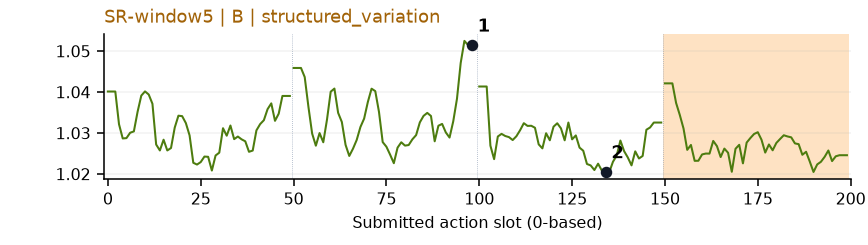](../figures/beat_block_hammer/sr.png) | 受其他因素影响：谨慎：q1结束附近升高，动作邻域/边界影响。 |
| [blocks_ranking_rgb](../tasks/blocks_ranking_rgb.md) | [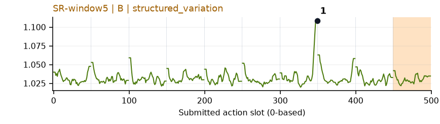](../figures/blocks_ranking_rgb/sr.png) | 受其他因素影响：谨慎：q6结束附近高峰突出，但正处chunk边界。 |
| [blocks_ranking_size](../tasks/blocks_ranking_size.md) | [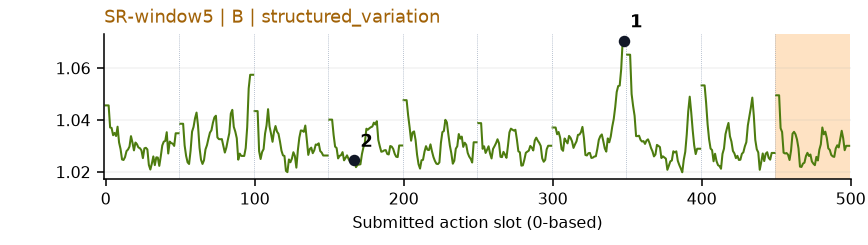](../figures/blocks_ranking_size/sr.png) | 受其他因素影响：谨慎：q6末端峰主要受边界影响。 |
| [click_alarmclock](../tasks/click_alarmclock.md) | [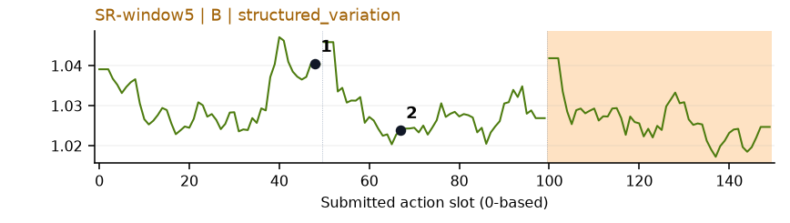](../figures/click_alarmclock/sr.png) | 较弱：弱：chunk末端/开头重复抬高。 |
| [click_bell](../tasks/click_bell.md) | [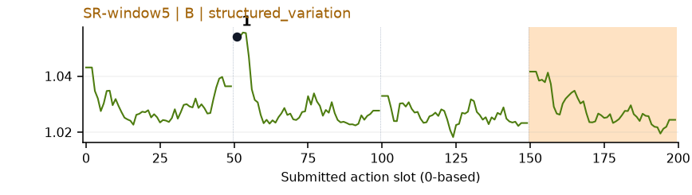](../figures/click_bell/sr.png) | 较弱：弱：q0/q1交界高峰，位置模板影响。 |
| [dump_bin_bigbin](../tasks/dump_bin_bigbin.md) | [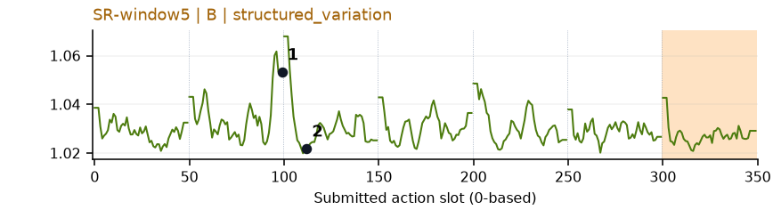](../figures/dump_bin_bigbin/sr.png) | 较弱：弱：多chunk边缘升高。 |
| [grab_roller](../tasks/grab_roller.md) | [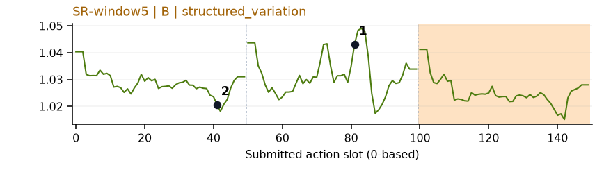](../figures/grab_roller/sr.png) | 较弱：弱：小幅多峰，chunk位置模板较强。 |
| [handover_block](../tasks/handover_block.md) | [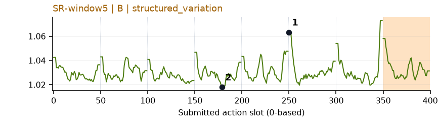](../figures/handover_block/sr.png) | 较弱：弱：多chunk边界重复上升。 |
| [handover_mic](../tasks/handover_mic.md) | [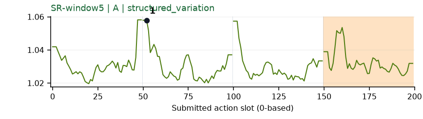](../figures/handover_mic/sr.png) | 较弱：弱：每chunk端点反复升高，58%位置模板效应。 |
| [hanging_mug](../tasks/hanging_mug.md) | [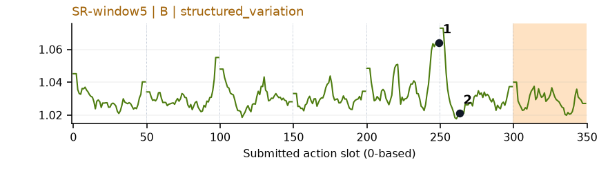](../figures/hanging_mug/sr.png) | 受其他因素影响：谨慎：q4末端主要峰接近边界。 |
| [lift_pot](../tasks/lift_pot.md) | [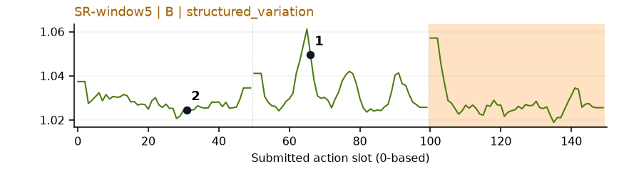](../figures/lift_pot/sr.png) | 可解释候选：候选：q1提锅附近内部局部峰，但仍有边缘效应。 |
| [move_can_pot](../tasks/move_can_pot.md) | [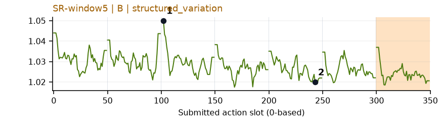](../figures/move_can_pot/sr.png) | 较弱：弱：chunk边界反复变化。 |
| [move_pillbottle_pad](../tasks/move_pillbottle_pad.md) | [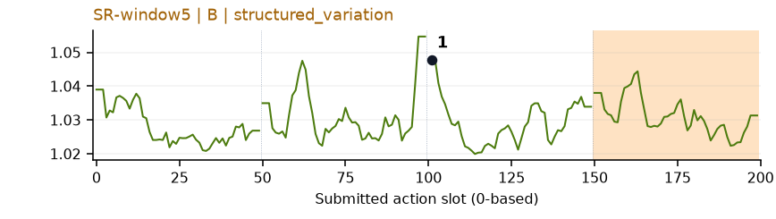](../figures/move_pillbottle_pad/sr.png) | 受其他因素影响：谨慎：q2起始突升，可能主要是chunk边界。 |
| [move_playingcard_away](../tasks/move_playingcard_away.md) | [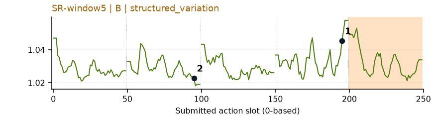](../figures/move_playingcard_away/sr.png) | 较弱：弱：边界与多处小峰混杂。 |
| [move_stapler_pad](../tasks/move_stapler_pad.md) | [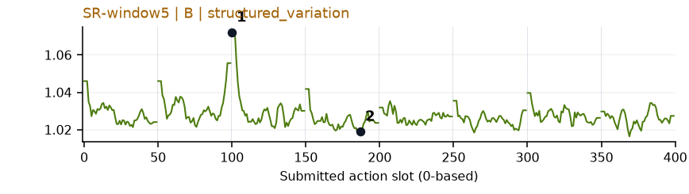](../figures/move_stapler_pad/sr.png) | 【失败例】较弱：弱：q2首部峰突出，但边界效应强。 |
| [open_laptop](../tasks/open_laptop.md) | 无完整数据 | 缺数据：该任务未取得完整可复算批次。 |
| [open_microwave](../tasks/open_microwave.md) | [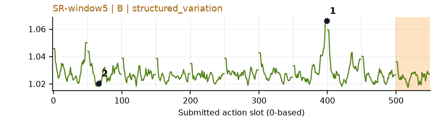](../figures/open_microwave/sr.png) | 较弱：弱：周期性边界峰，最高点不能单独解释为开门。 |
| [pick_diverse_bottles](../tasks/pick_diverse_bottles.md) | [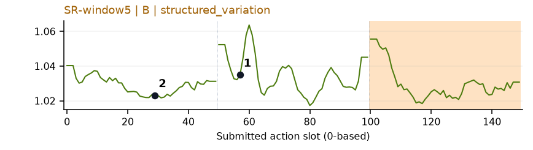](../figures/pick_diverse_bottles/sr.png) | 受其他因素影响：谨慎：q1内部提瓶附近有峰，同时存在固定边缘变化。 |
| [pick_dual_bottles](../tasks/pick_dual_bottles.md) | [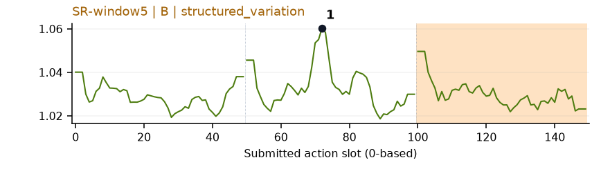](../figures/pick_dual_bottles/sr.png) | 可解释候选：候选：q1中间提瓶附近局部峰，较少依赖边界。 |
| [place_a2b_left](../tasks/place_a2b_left.md) | [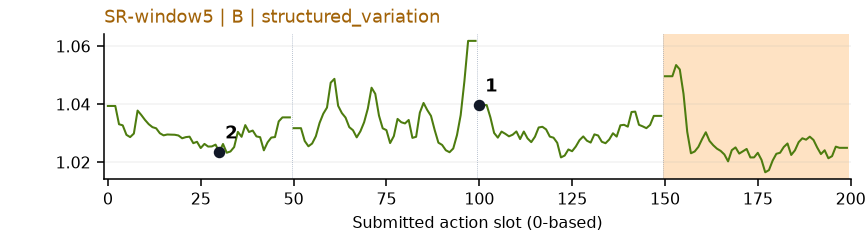](../figures/place_a2b_left/sr.png) | 受其他因素影响：谨慎：q1/q2交界升高，动作窗口语义不独立。 |
| [place_a2b_right](../tasks/place_a2b_right.md) | [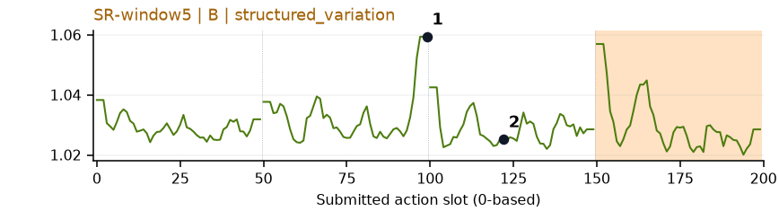](../figures/place_a2b_right/sr.png) | 受其他因素影响：谨慎：q1末端突出，但位于chunk边界。 |
| [place_bread_basket](../tasks/place_bread_basket.md) | [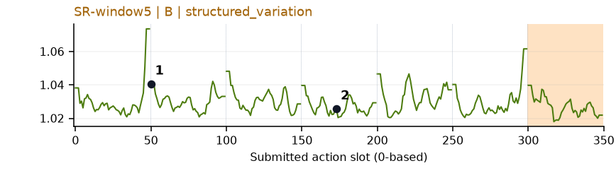](../figures/place_bread_basket/sr.png) | 较弱：弱：多chunk边缘峰，不能直接解释为多个重要事件。 |
| [place_bread_skillet](../tasks/place_bread_skillet.md) | [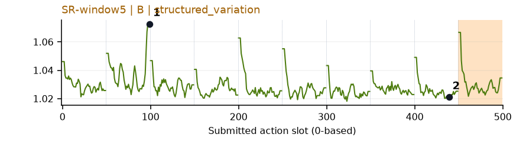](../figures/place_bread_skillet/sr.png) | 较弱：弱：多chunk末端高值，位置模板较强。 |
| [place_burger_fries](../tasks/place_burger_fries.md) | [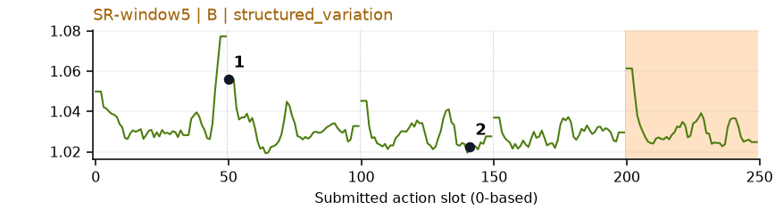](../figures/place_burger_fries/sr.png) | 较弱：弱：chunk开头峰，后续小幅波动。 |
| [place_can_basket](../tasks/place_can_basket.md) | [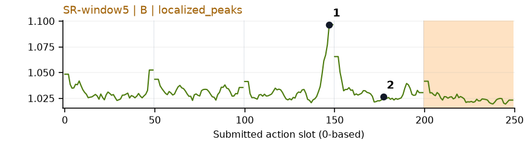](../figures/place_can_basket/sr.png) | 受其他因素影响：谨慎：q2放入篮子段末尾峰清楚，但接近边界。 |
| [place_cans_plasticbox](../tasks/place_cans_plasticbox.md) | [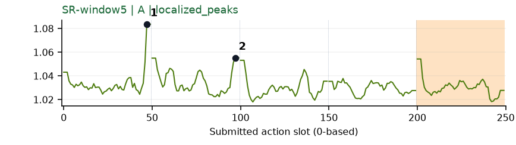](../figures/place_cans_plasticbox/sr.png) | 受其他因素影响：谨慎：两个主要峰靠近q0/q1末端，位置效应仍在。 |
| [place_container_plate](../tasks/place_container_plate.md) | [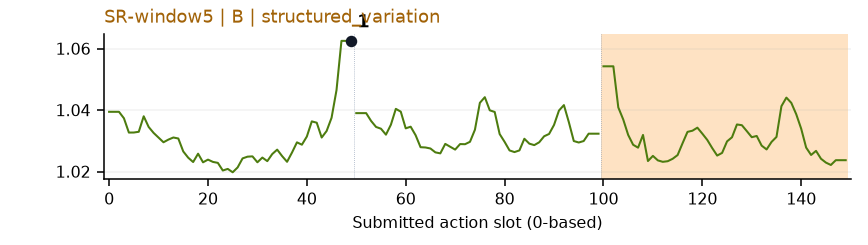](../figures/place_container_plate/sr.png) | 较弱：弱：chunk末端升高，无法独立对应放置。 |
| [place_dual_shoes](../tasks/place_dual_shoes.md) | [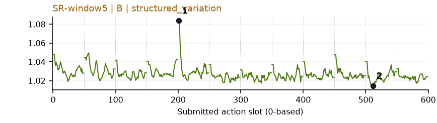](../figures/place_dual_shoes/sr.png) | 【失败例】受其他因素影响：失败例谨慎：q4开始附近强峰与chunk边界重合。 |
| [place_empty_cup](../tasks/place_empty_cup.md) | [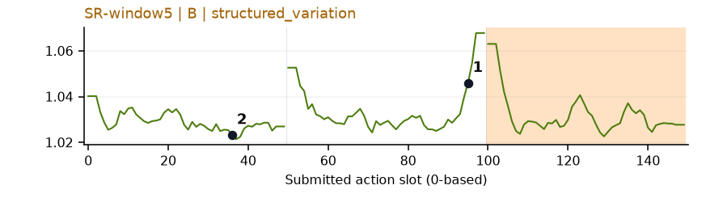](../figures/place_empty_cup/sr.png) | 较弱：弱：chunk末端系统性上升。 |
| [place_fan](../tasks/place_fan.md) | 无完整数据 | 缺数据：该任务未取得完整可复算批次。 |
| [place_mouse_pad](../tasks/place_mouse_pad.md) | [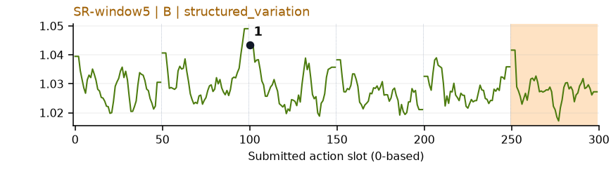](../figures/place_mouse_pad/sr.png) | 较弱：弱：小幅多峰，主要标记在chunk边界。 |
| [place_object_basket](../tasks/place_object_basket.md) | [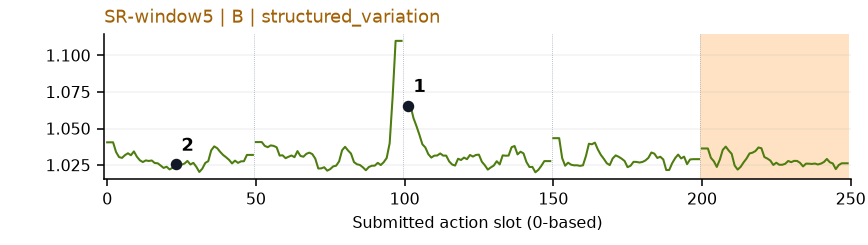](../figures/place_object_basket/sr.png) | 受其他因素影响：谨慎：q2接近篮口的高值主要在chunk开头。 |
| [place_object_scale](../tasks/place_object_scale.md) | 无完整数据 | 缺数据：该任务未取得完整可复算批次。 |
| [place_object_stand](../tasks/place_object_stand.md) | [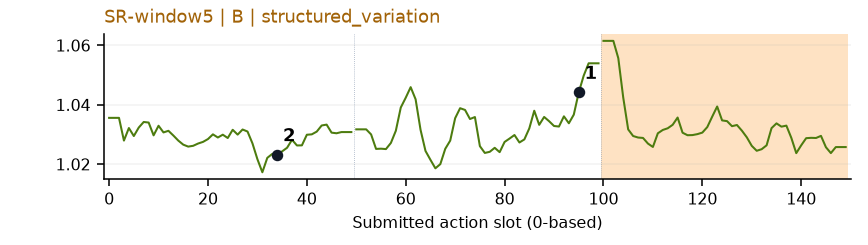](../figures/place_object_stand/sr.png) | 较弱：弱：q1末端固定抬高。 |
| [place_phone_stand](../tasks/place_phone_stand.md) | [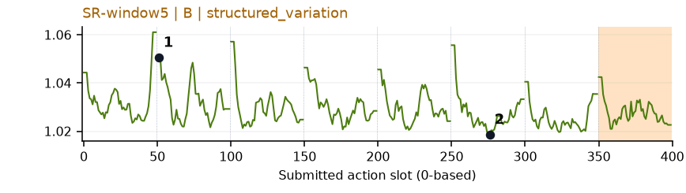](../figures/place_phone_stand/sr.png) | 较弱：弱：每chunk开头重复上升。 |
| [place_shoe](../tasks/place_shoe.md) | [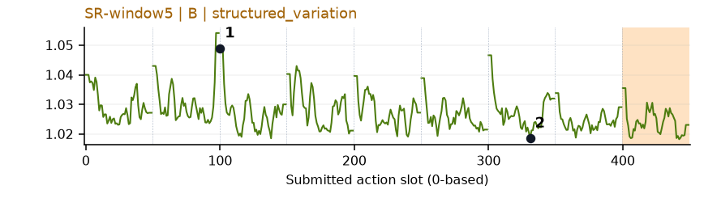](../figures/place_shoe/sr.png) | 较弱：弱：多处重复边界峰。 |
| [press_stapler](../tasks/press_stapler.md) | [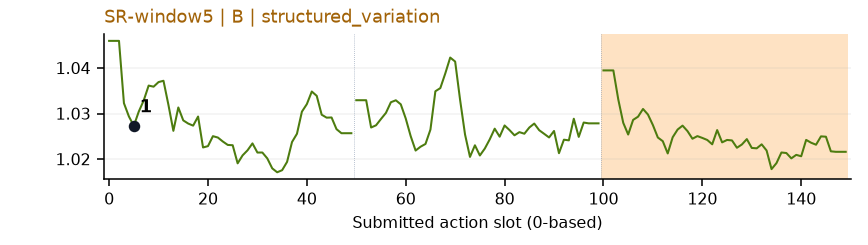](../figures/press_stapler/sr.png) | 较弱：弱：小幅多波动，缺少清楚事件对应。 |
| [put_bottles_dustbin](../tasks/put_bottles_dustbin.md) | [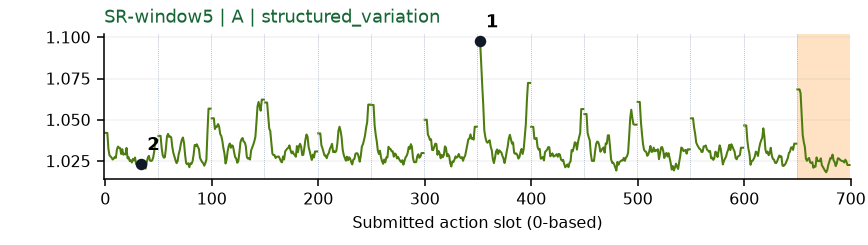](../figures/put_bottles_dustbin/sr.png) | 较弱：弱：边界高峰反复出现。 |
| [put_object_cabinet](../tasks/put_object_cabinet.md) | 无完整数据 | 缺数据：该任务未取得完整可复算批次。 |
| [rotate_qrcode](../tasks/rotate_qrcode.md) | [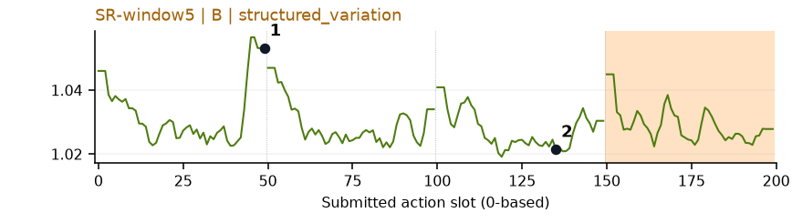](../figures/rotate_qrcode/sr.png) | 较弱：弱：每chunk边缘重复高值。 |
| [scan_object](../tasks/scan_object.md) | [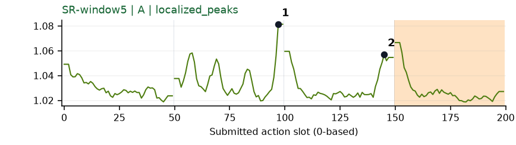](../figures/scan_object/sr.png) | 受其他因素影响：谨慎：q1/q2交界高峰，边界效应仍需区分。 |
| [shake_bottle](../tasks/shake_bottle.md) | [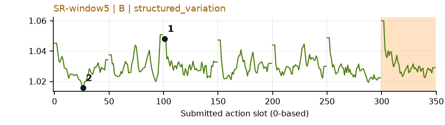](../figures/shake_bottle/sr.png) | 【补充数据】较弱：弱：chunk边界反复上升；补充数据。 |
| [shake_bottle_horizontally](../tasks/shake_bottle_horizontally.md) | [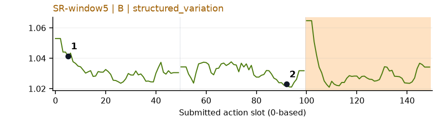](../figures/shake_bottle_horizontally/sr.png) | 较弱：弱：初段与chunk边缘高，不足以解释摇动。 |
| [stack_blocks_three](../tasks/stack_blocks_three.md) | [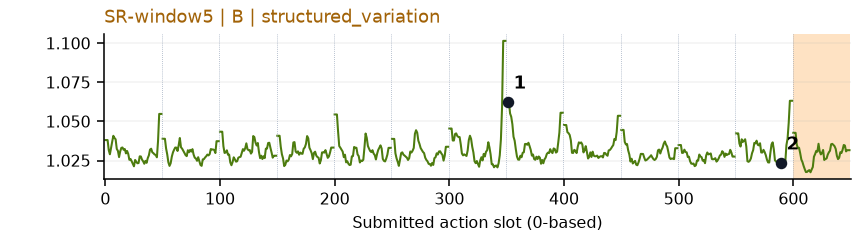](../figures/stack_blocks_three/sr.png) | 较弱：弱：标记高区在chunk边缘，峰多。 |
| [stack_blocks_two](../tasks/stack_blocks_two.md) | [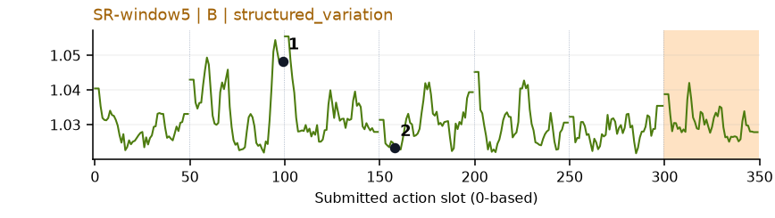](../figures/stack_blocks_two/sr.png) | 较弱：弱：多峰且主要高点位于chunk边界。 |
| [stack_bowls_three](../tasks/stack_bowls_three.md) | [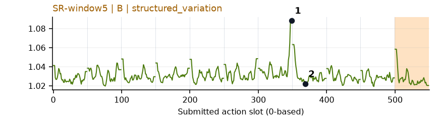](../figures/stack_bowls_three/sr.png) | 受其他因素影响：谨慎：q6放下/离开碗附近有局部峰，但临近边界。 |
| [stack_bowls_two](../tasks/stack_bowls_two.md) | [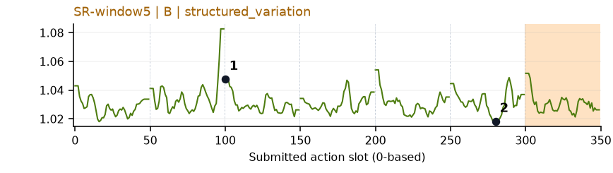](../figures/stack_bowls_two/sr.png) | 较弱：弱：q1/q2边界高峰，后续多处重复。 |
| [stamp_seal](../tasks/stamp_seal.md) | [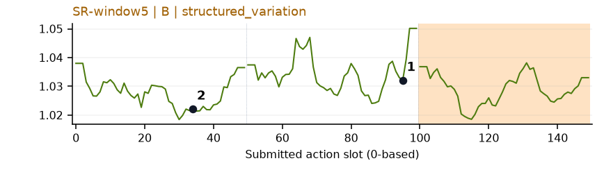](../figures/stamp_seal/sr.png) | 较弱：弱：宽小波动夹杂末端升高，无法单独定位盖章。 |
| [turn_switch](../tasks/turn_switch.md) | [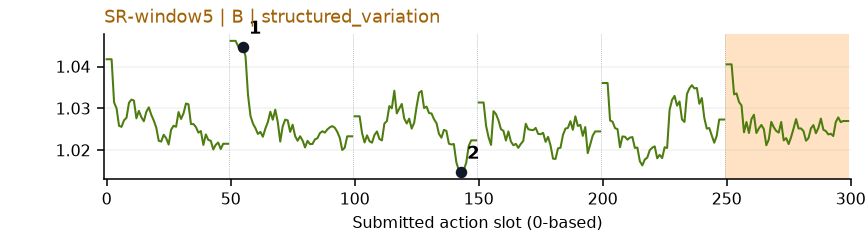](../figures/turn_switch/sr.png) | 较弱：弱：chunk边界重复高、小幅多波动。 |
