# U-GROW 10vs5：全部任务

[返回总目录](../README.md)

主图保留逐动作原始值；细虚线为chunk边界，橙色为终止段实际执行长度不明，未用于筛选。帧只对应chunk前后，不能精确定位某个h的接触瞬间。A/B/C是形态筛选等级，优先读人工备注。

| 任务 | 原始曲线缩略图 | 复核 |
|---|---|---|
| [adjust_bottle](../tasks/adjust_bottle.md) | [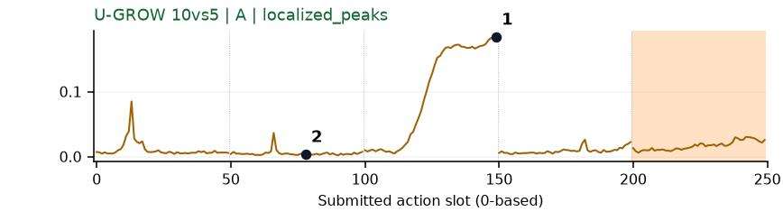](../figures/adjust_bottle/ugrow.png) | 可解释候选：候选：q2持瓶调整段集中升高。 |
| [beat_block_hammer](../tasks/beat_block_hammer.md) | [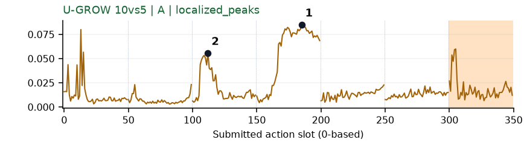](../figures/beat_block_hammer/ugrow.png) | 可解释候选：候选：持锤在方块附近移动的q2/q3有局部高区；敲击瞬间不明。 |
| [blocks_ranking_rgb](../tasks/blocks_ranking_rgb.md) | [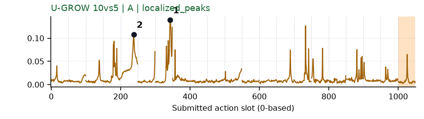](../figures/blocks_ranking_rgb/ugrow.png) | 可解释候选：候选：q4/q6转移方块阶段升高，同时存在其他尖峰。 |
| [blocks_ranking_size](../tasks/blocks_ranking_size.md) | [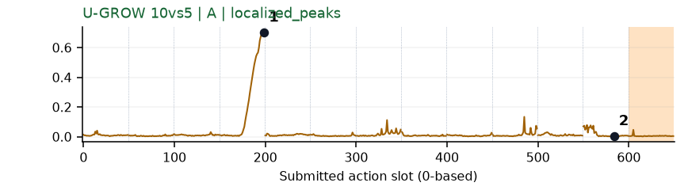](../figures/blocks_ranking_size/ugrow.png) | 可解释候选：候选：q3夹取并抬起方块段强升高。 |
| [click_alarmclock](../tasks/click_alarmclock.md) | [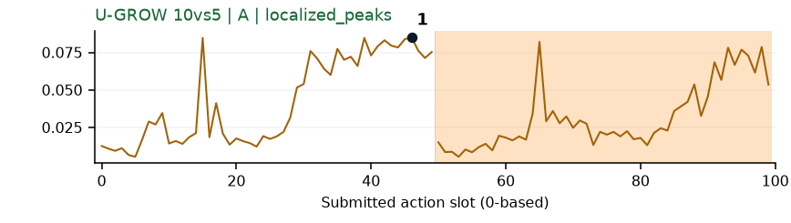](../figures/click_alarmclock/ugrow.png) | 可解释候选：阶段候选：q0靠近闹钟时持续升高，未定位接触。 |
| [click_bell](../tasks/click_bell.md) | [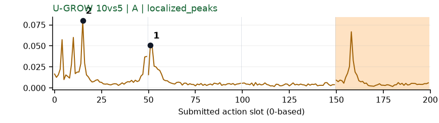](../figures/click_bell/ugrow.png) | 可解释候选：候选：q0接近和q1局部调整都有峰，画面仅确认靠近。 |
| [dump_bin_bigbin](../tasks/dump_bin_bigbin.md) | [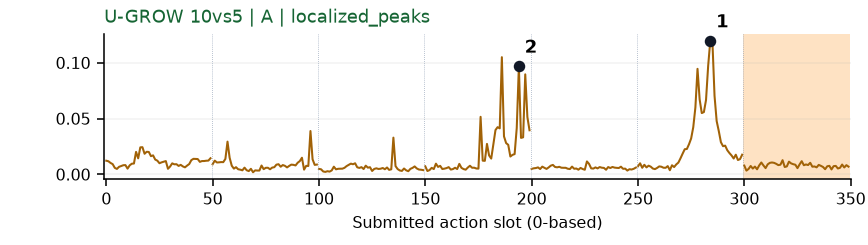](../figures/dump_bin_bigbin/ugrow.png) | 可解释候选：候选：q3/q5容器操作附近两个局部高区。 |
| [grab_roller](../tasks/grab_roller.md) | [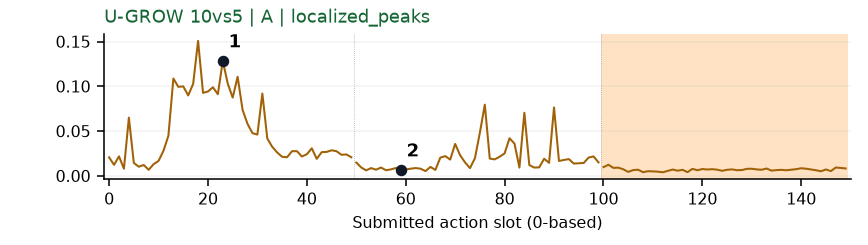](../figures/grab_roller/ugrow.png) | 可解释候选：候选：q0双手接近滚筒时集中高区。 |
| [handover_block](../tasks/handover_block.md) | [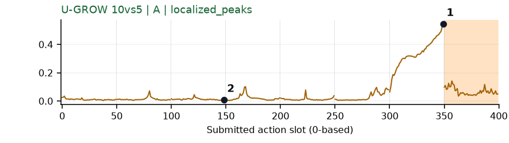](../figures/handover_block/ugrow.png) | 可解释候选：候选：同轨迹q6两手交接接近段持续强升高。 |
| [handover_mic](../tasks/handover_mic.md) | [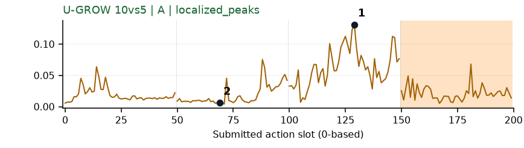](../figures/handover_mic/ugrow.png) | 可解释候选：候选：q2两手接近时持续高区，q1较低。 |
| [hanging_mug](../tasks/hanging_mug.md) | [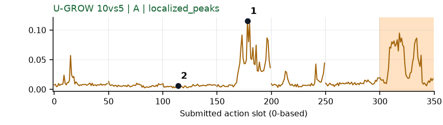](../figures/hanging_mug/ugrow.png) | 可解释候选：候选：q3杯柄抓取/调整姿态附近局部高区。 |
| [lift_pot](../tasks/lift_pot.md) | [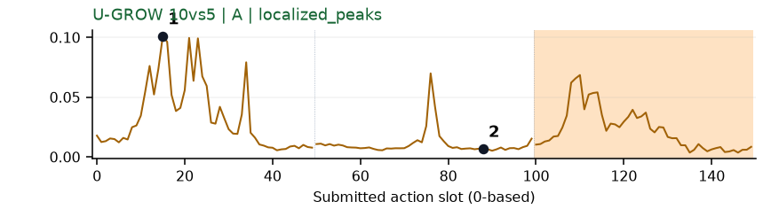](../figures/lift_pot/ugrow.png) | 可解释候选：候选：q0双手伸向锅柄时集中高区。 |
| [move_can_pot](../tasks/move_can_pot.md) | [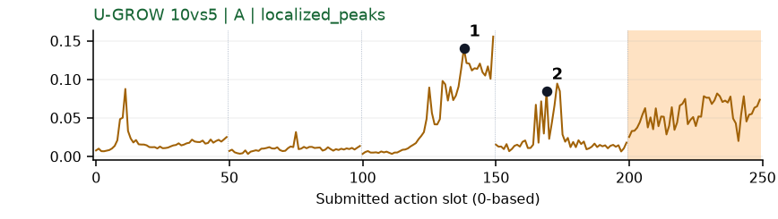](../figures/move_can_pot/ugrow.png) | 可解释候选：候选：q2移动至锅边、q3接近放置各有高区。 |
| [move_pillbottle_pad](../tasks/move_pillbottle_pad.md) | [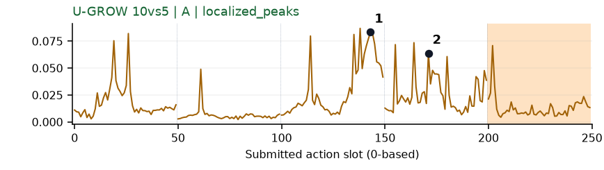](../figures/move_pillbottle_pad/ugrow.png) | 可解释候选：候选：q2移向垫子、q3放置附近集中变化。 |
| [move_playingcard_away](../tasks/move_playingcard_away.md) | [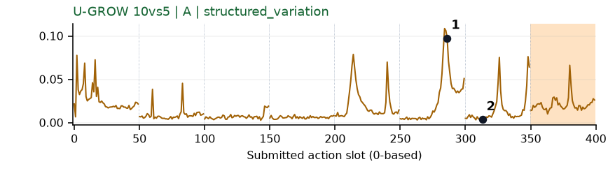](../figures/move_playingcard_away/ugrow.png) | 可解释候选：候选：q5手重新接近纸牌有高峰，其他峰较多。 |
| [move_stapler_pad](../tasks/move_stapler_pad.md) | [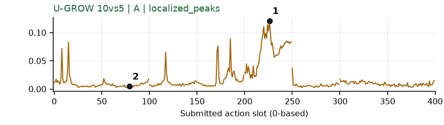](../figures/move_stapler_pad/ugrow.png) | 【失败例】可解释候选：失败例候选：同DV轨迹q4集中升高。 |
| [open_laptop](../tasks/open_laptop.md) | 无完整数据 | 缺数据：该任务未取得完整可复算批次。 |
| [open_microwave](../tasks/open_microwave.md) | [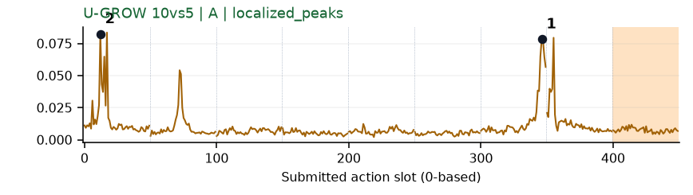](../figures/open_microwave/ugrow.png) | 可解释候选：候选：q0接近及q6门侧调整都有峰，开门瞬间无法定位。 |
| [pick_diverse_bottles](../tasks/pick_diverse_bottles.md) | [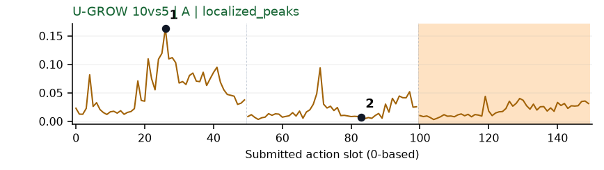](../figures/pick_diverse_bottles/ugrow.png) | 可解释候选：候选：q0双手接近瓶子时集中高区。 |
| [pick_dual_bottles](../tasks/pick_dual_bottles.md) | [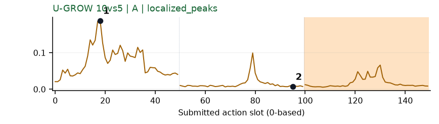](../figures/pick_dual_bottles/ugrow.png) | 可解释候选：候选：q0接近两个瓶子时集中升高。 |
| [place_a2b_left](../tasks/place_a2b_left.md) | [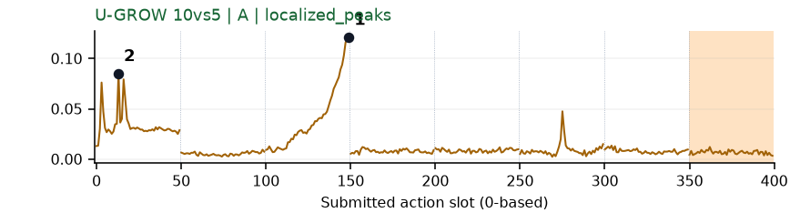](../figures/place_a2b_left/ugrow.png) | 可解释候选：候选：q2物体移向目标区域时持续升高。 |
| [place_a2b_right](../tasks/place_a2b_right.md) | [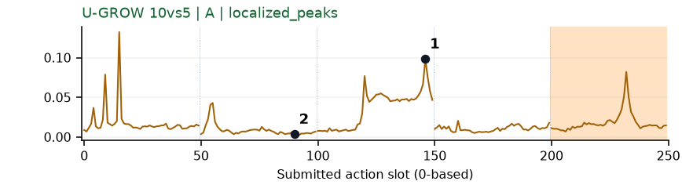](../figures/place_a2b_right/ugrow.png) | 可解释候选：阶段候选：q2搬运物体高区；该例部分动作出画。 |
| [place_bread_basket](../tasks/place_bread_basket.md) | [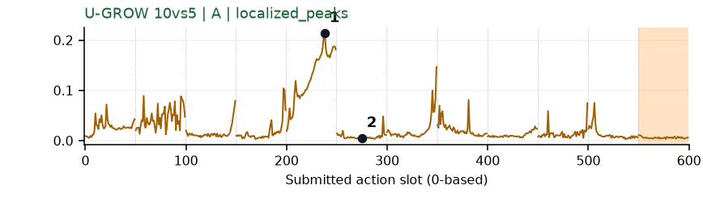](../figures/place_bread_basket/ugrow.png) | 可解释候选：优先候选：与DV同轨迹q4移入篮子高区。 |
| [place_bread_skillet](../tasks/place_bread_skillet.md) | [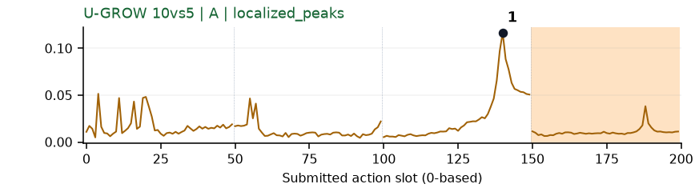](../figures/place_bread_skillet/ugrow.png) | 可解释候选：候选：q2锅与面包靠近阶段局部高峰。 |
| [place_burger_fries](../tasks/place_burger_fries.md) | [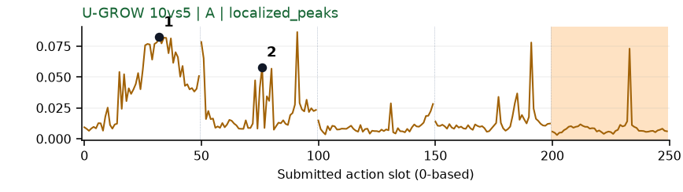](../figures/place_burger_fries/ugrow.png) | 可解释候选：候选：q0接近、q1拿起食物时高区。 |
| [place_can_basket](../tasks/place_can_basket.md) | [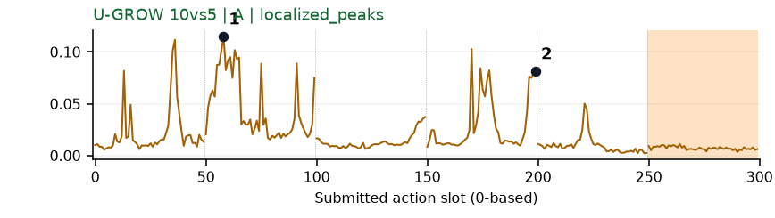](../figures/place_can_basket/ugrow.png) | 可解释候选：候选：q1抬罐及q3篮内操作有高区，伴随其他尖峰。 |
| [place_cans_plasticbox](../tasks/place_cans_plasticbox.md) | [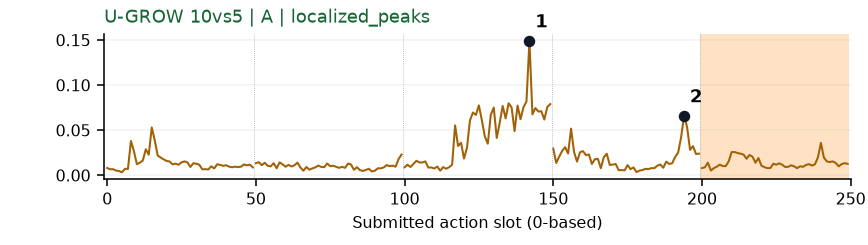](../figures/place_cans_plasticbox/ugrow.png) | 可解释候选：候选：q2入箱和q3第二只手跟进时局部高区。 |
| [place_container_plate](../tasks/place_container_plate.md) | [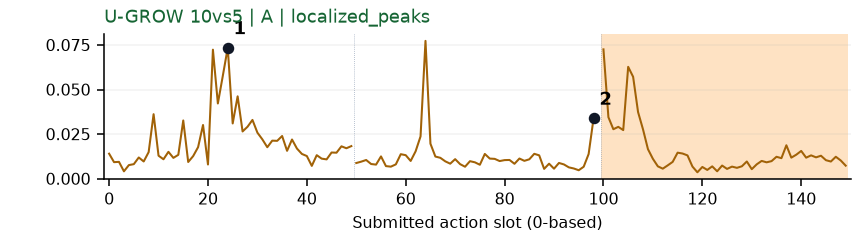](../figures/place_container_plate/ugrow.png) | 受其他因素影响：谨慎：q0接近容器有峰，部分动作靠近画面右缘。 |
| [place_dual_shoes](../tasks/place_dual_shoes.md) | [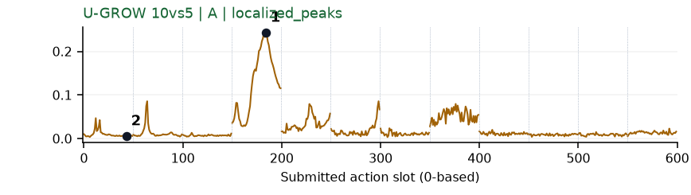](../figures/place_dual_shoes/ugrow.png) | 【失败例】可解释候选：失败例候选：q3鞋在箱边旋转/调整时明显峰。 |
| [place_empty_cup](../tasks/place_empty_cup.md) | [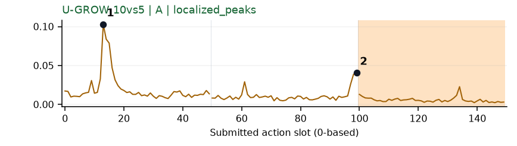](../figures/place_empty_cup/ugrow.png) | 可解释候选：候选：q0接近杯子阶段孤立主峰。 |
| [place_fan](../tasks/place_fan.md) | 无完整数据 | 缺数据：该任务未取得完整可复算批次。 |
| [place_mouse_pad](../tasks/place_mouse_pad.md) | [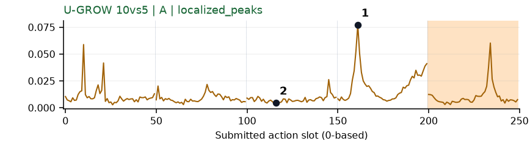](../figures/place_mouse_pad/ugrow.png) | 可解释候选：候选：同轨迹q3垫子上调整时窄峰。 |
| [place_object_basket](../tasks/place_object_basket.md) | [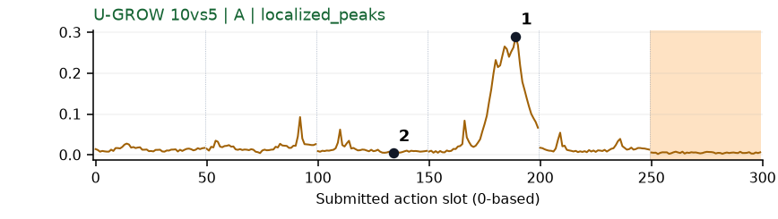](../figures/place_object_basket/ugrow.png) | 可解释候选：候选：q3物体由篮口上方落入篮内时明显高区。 |
| [place_object_scale](../tasks/place_object_scale.md) | 无完整数据 | 缺数据：该任务未取得完整可复算批次。 |
| [place_object_stand](../tasks/place_object_stand.md) | [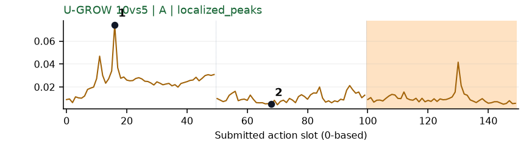](../figures/place_object_stand/ugrow.png) | 可解释候选：候选：q0接近物体时有单个主要峰。 |
| [place_phone_stand](../tasks/place_phone_stand.md) | [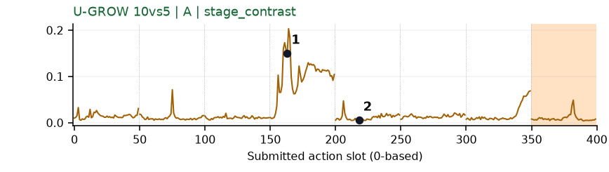](../figures/place_phone_stand/ugrow.png) | 可解释候选：候选：q3手机姿态调整时形成主要高区。 |
| [place_shoe](../tasks/place_shoe.md) | [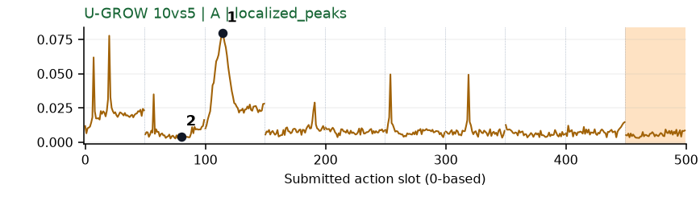](../figures/place_shoe/ugrow.png) | 可解释候选：候选：q2持鞋移到垫子附近有局部主峰。 |
| [press_stapler](../tasks/press_stapler.md) | [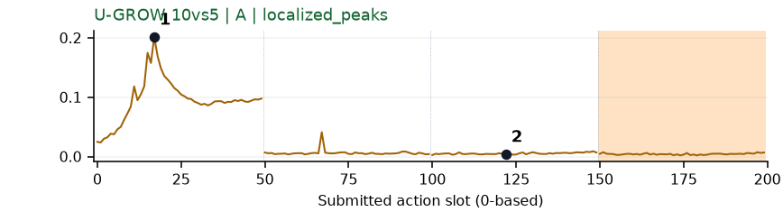](../figures/press_stapler/ugrow.png) | 可解释候选：候选：q0接近订书机时强宽峰，后续大部分低。 |
| [put_bottles_dustbin](../tasks/put_bottles_dustbin.md) | [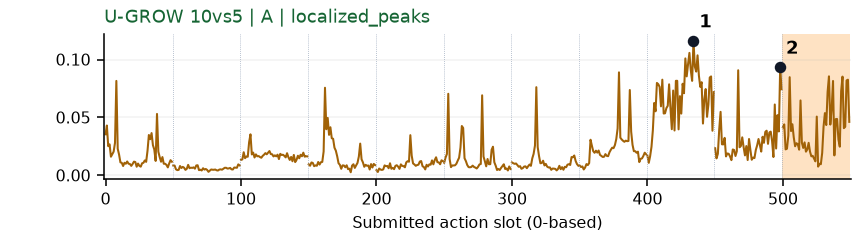](../figures/put_bottles_dustbin/ugrow.png) | 可解释候选：阶段候选：q8/q9持瓶操作时高，但入桶目标出画，不标成入桶瞬间。 |
| [put_object_cabinet](../tasks/put_object_cabinet.md) | 无完整数据 | 缺数据：该任务未取得完整可复算批次。 |
| [rotate_qrcode](../tasks/rotate_qrcode.md) | [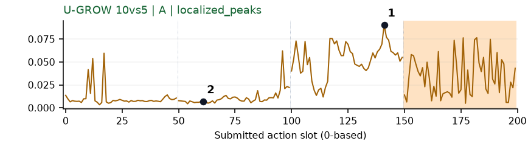](../figures/rotate_qrcode/ugrow.png) | 可解释候选：候选：q2转动二维码牌到可见方向时持续高区。 |
| [scan_object](../tasks/scan_object.md) | [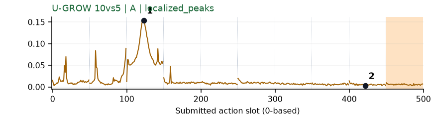](../figures/scan_object/ugrow.png) | 可解释候选：候选：同DV轨迹q2扫描器朝目标转向时峰明显。 |
| [shake_bottle](../tasks/shake_bottle.md) | [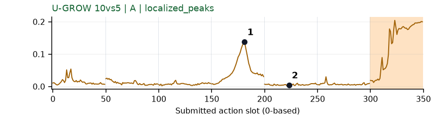](../figures/shake_bottle/ugrow.png) | 【补充数据】可解释候选：补充数据候选：q3重新接近瓶子时局部峰，终止段另有高值但不用。 |
| [shake_bottle_horizontally](../tasks/shake_bottle_horizontally.md) | [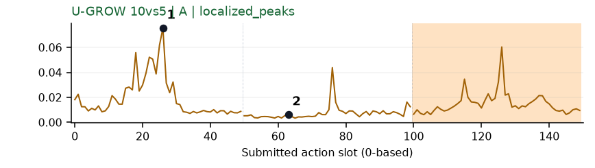](../figures/shake_bottle_horizontally/ugrow.png) | 可解释候选：候选：q0接近并抓瓶时主要峰，后续较低。 |
| [stack_blocks_three](../tasks/stack_blocks_three.md) | [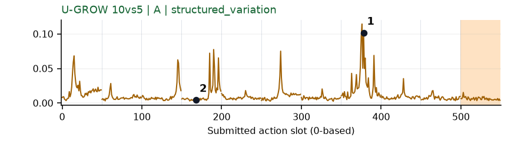](../figures/stack_blocks_three/ugrow.png) | 可解释候选：候选：q7堆叠/释放附近有局部主峰，q3等也有其他峰。 |
| [stack_blocks_two](../tasks/stack_blocks_two.md) | [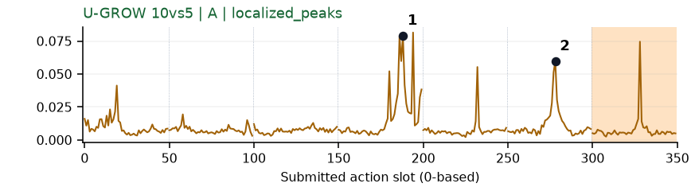](../figures/stack_blocks_two/ugrow.png) | 可解释候选：候选：q3提起方块和q5移到另一方块上方两个局部高区。 |
| [stack_bowls_three](../tasks/stack_bowls_three.md) | [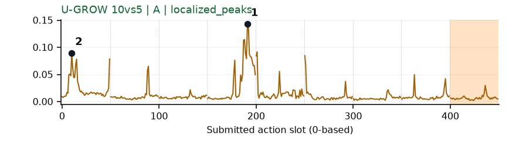](../figures/stack_bowls_three/ugrow.png) | 可解释候选：候选：q3夹爪把碗移向另一碗时局部高区。 |
| [stack_bowls_two](../tasks/stack_bowls_two.md) | [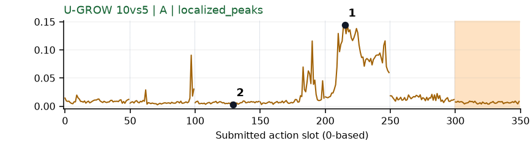](../figures/stack_bowls_two/ugrow.png) | 可解释候选：候选：q4抓取/抬起第二只碗时集中宽高区。 |
| [stamp_seal](../tasks/stamp_seal.md) | [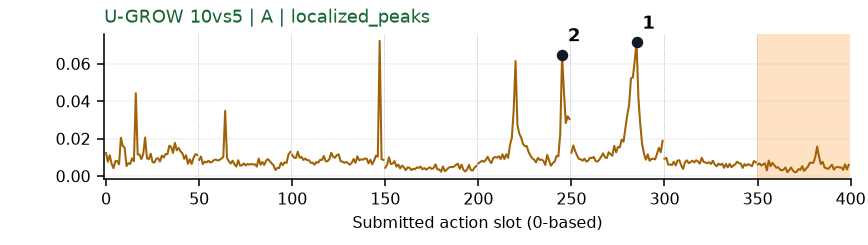](../figures/stamp_seal/ugrow.png) | 可解释候选：候选：q4/q5印章在印面附近调整的两个峰；接触瞬间不可定位。 |
| [turn_switch](../tasks/turn_switch.md) | [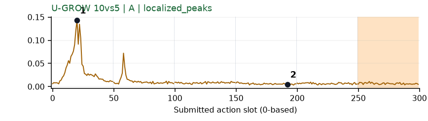](../figures/turn_switch/ugrow.png) | 可解释候选：候选：q0接近开关时孤立主峰，其余较低。 |
