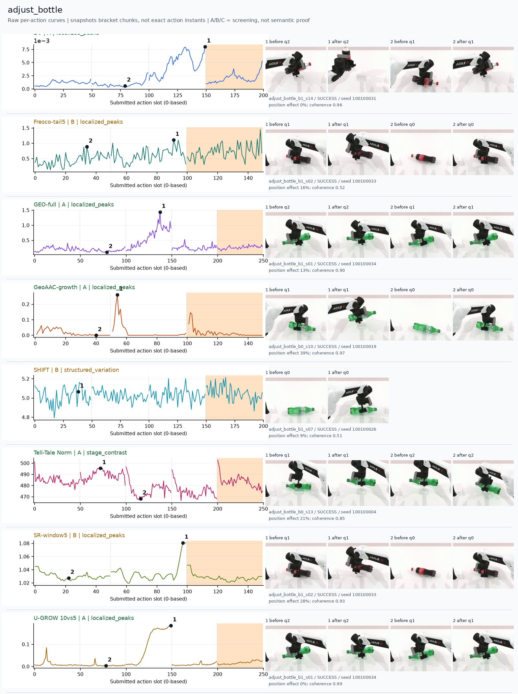
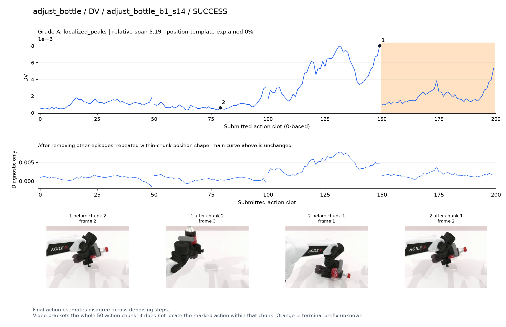
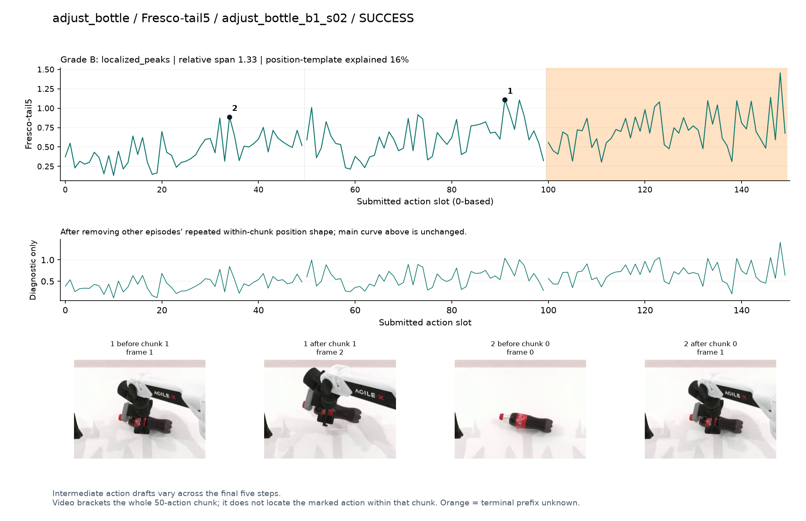
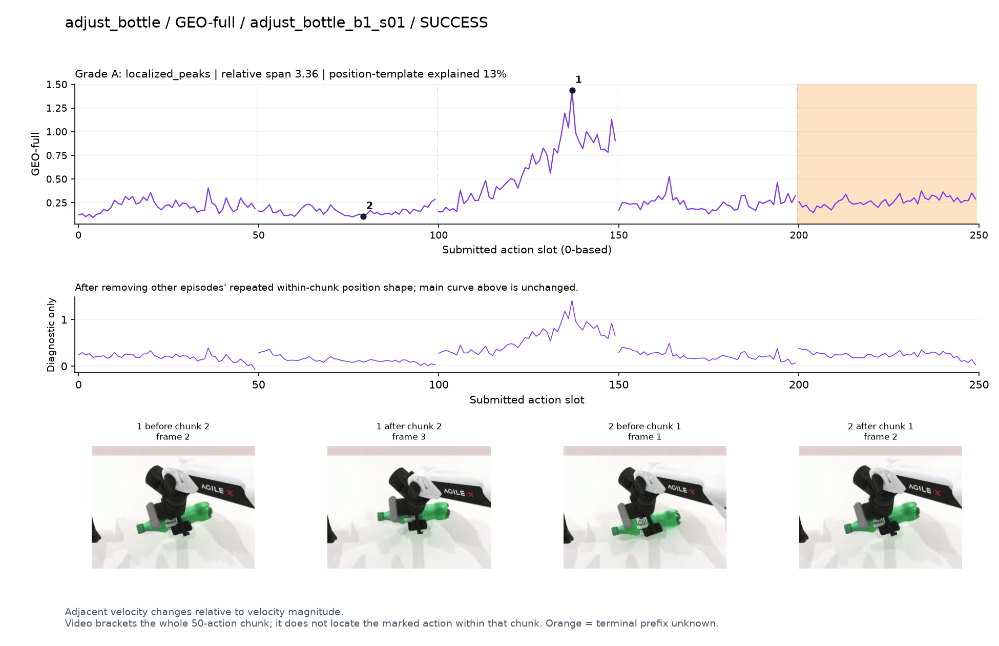
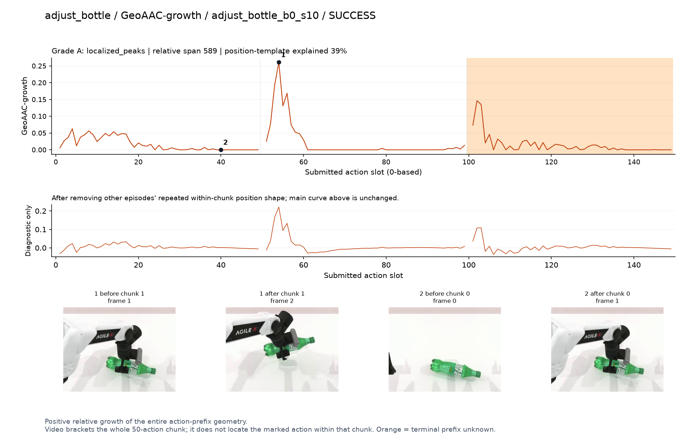
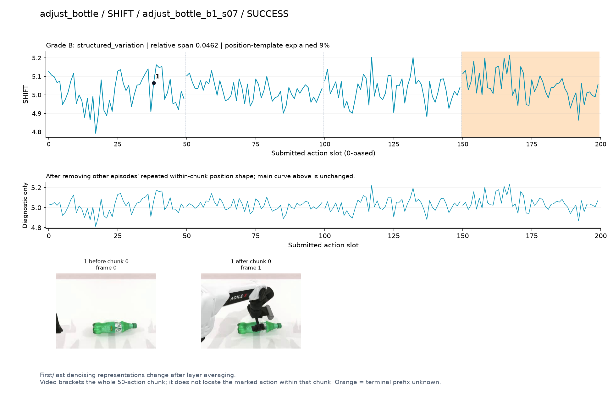
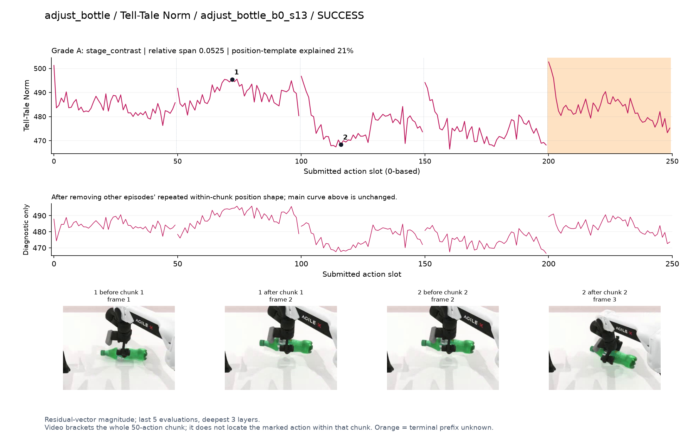
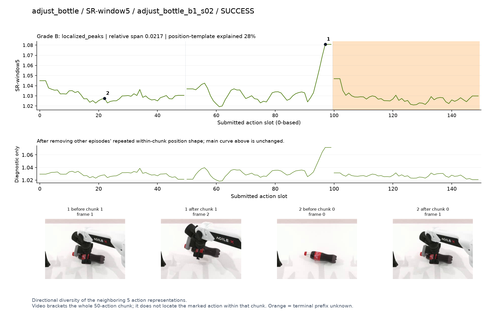
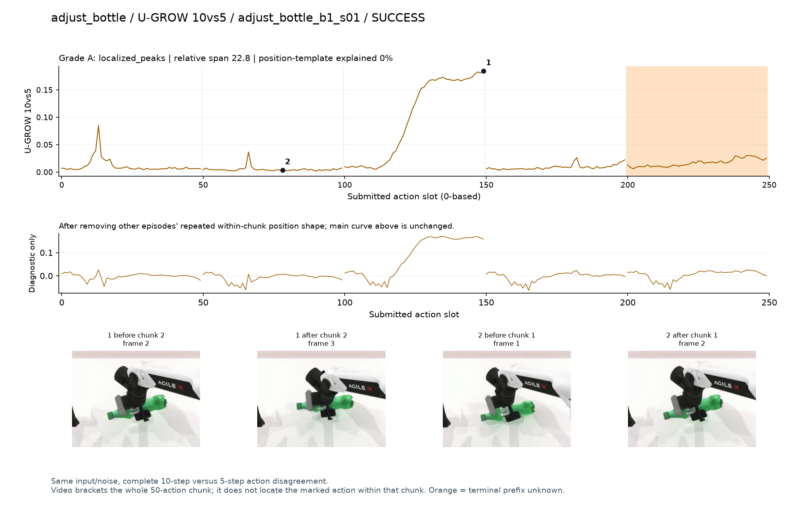

# adjust_bottle

[全部任务](../README.md#全部任务) · [按信号看](../README.md#按信号看)

主图保留逐动作原始值；细虚线为chunk边界，橙色为终止段实际执行长度不明，未用于筛选。帧只对应chunk前后，不能精确定位某个h的接触瞬间。A/B/C是形态筛选等级，优先读人工备注。

## DV

**可解释候选**：候选：q2瓶身由横向转为竖直；峰在该chunk后段。

轨迹 `adjust_bottle_b1_s14`；成功；种子 `100100031`；正式验收。

[PNG原图](../figures/adjust_bottle/dv.png) · [SVG矢量图](../figures/adjust_bottle/dv.svg) · [完整元数据](../entries/adjust_bottle/dv.json)

对应帧：[1 before q2](../frames/adjust_bottle/adjust_bottle_b1_s14/f002.jpg) · [1 after q2](../frames/adjust_bottle/adjust_bottle_b1_s14/f003.jpg) · [2 before q1](../frames/adjust_bottle/adjust_bottle_b1_s14/f001.jpg) · [2 after q1](../frames/adjust_bottle/adjust_bottle_b1_s14/f002.jpg)

## Fresco-tail5

**较弱**：弱：逐动作抖动较密，未见可靠独立事件对应；全数据与噪声到最终动作距离高度相关。

轨迹 `adjust_bottle_b1_s02`；成功；种子 `100100033`；正式验收。

[PNG原图](../figures/adjust_bottle/fresco.png) · [SVG矢量图](../figures/adjust_bottle/fresco.svg) · [完整元数据](../entries/adjust_bottle/fresco.json)

对应帧：[1 before q1](../frames/adjust_bottle/adjust_bottle_b1_s02/f001.jpg) · [1 after q1](../frames/adjust_bottle/adjust_bottle_b1_s02/f002.jpg) · [2 before q0](../frames/adjust_bottle/adjust_bottle_b1_s02/f000.jpg) · [2 after q0](../frames/adjust_bottle/adjust_bottle_b1_s02/f001.jpg)

## GEO-full

**可解释候选**：候选：q2持瓶调整段有宽峰，精确接触不可定位。

轨迹 `adjust_bottle_b1_s01`；成功；种子 `100100034`；正式验收。

[PNG原图](../figures/adjust_bottle/geo.png) · [SVG矢量图](../figures/adjust_bottle/geo.svg) · [完整元数据](../entries/adjust_bottle/geo.json)

对应帧：[1 before q2](../frames/adjust_bottle/adjust_bottle_b1_s01/f002.jpg) · [1 after q2](../frames/adjust_bottle/adjust_bottle_b1_s01/f003.jpg) · [2 before q1](../frames/adjust_bottle/adjust_bottle_b1_s01/f001.jpg) · [2 after q1](../frames/adjust_bottle/adjust_bottle_b1_s01/f002.jpg)

## GeoAAC-growth

**受其他因素影响**：谨慎：q1起始突峰，提瓶画面可见，但前缀位置效应明显。

轨迹 `adjust_bottle_b0_s10`；成功；种子 `100100019`；正式验收。

[PNG原图](../figures/adjust_bottle/geoaac.png) · [SVG矢量图](../figures/adjust_bottle/geoaac.svg) · [完整元数据](../entries/adjust_bottle/geoaac.json)

对应帧：[1 before q1](../frames/adjust_bottle/adjust_bottle_b0_s10/f001.jpg) · [1 after q1](../frames/adjust_bottle/adjust_bottle_b0_s10/f002.jpg) · [2 before q0](../frames/adjust_bottle/adjust_bottle_b0_s10/f000.jpg) · [2 after q0](../frames/adjust_bottle/adjust_bottle_b0_s10/f001.jpg)

## SHIFT

**较弱**：弱：小幅抖动/阶段基线变化，未见可靠独立事件对应；路径长度混杂强。

轨迹 `adjust_bottle_b1_s07`；成功；种子 `100100026`；正式验收。

[PNG原图](../figures/adjust_bottle/shift.png) · [SVG矢量图](../figures/adjust_bottle/shift.svg) · [完整元数据](../entries/adjust_bottle/shift.json)

对应帧：[1 before q0](../frames/adjust_bottle/adjust_bottle_b1_s07/f000.jpg) · [1 after q0](../frames/adjust_bottle/adjust_bottle_b1_s07/f001.jpg)

## Tell-Tale Norm

**阶段变化**：阶段差异：持瓶调整前后幅度变化，叠加chunk首部尖峰。

轨迹 `adjust_bottle_b0_s13`；成功；种子 `100100004`；正式验收。

[PNG原图](../figures/adjust_bottle/norm.png) · [SVG矢量图](../figures/adjust_bottle/norm.svg) · [完整元数据](../entries/adjust_bottle/norm.json)

对应帧：[1 before q1](../frames/adjust_bottle/adjust_bottle_b0_s13/f001.jpg) · [1 after q1](../frames/adjust_bottle/adjust_bottle_b0_s13/f002.jpg) · [2 before q2](../frames/adjust_bottle/adjust_bottle_b0_s13/f002.jpg) · [2 after q2](../frames/adjust_bottle/adjust_bottle_b0_s13/f003.jpg)

## SR-window5

**受其他因素影响**：谨慎：抬瓶段末端升高，接近chunk边界。

轨迹 `adjust_bottle_b1_s02`；成功；种子 `100100033`；正式验收。

[PNG原图](../figures/adjust_bottle/sr.png) · [SVG矢量图](../figures/adjust_bottle/sr.svg) · [完整元数据](../entries/adjust_bottle/sr.json)

对应帧：[1 before q1](../frames/adjust_bottle/adjust_bottle_b1_s02/f001.jpg) · [1 after q1](../frames/adjust_bottle/adjust_bottle_b1_s02/f002.jpg) · [2 before q0](../frames/adjust_bottle/adjust_bottle_b1_s02/f000.jpg) · [2 after q0](../frames/adjust_bottle/adjust_bottle_b1_s02/f001.jpg)

## U-GROW 10vs5

**可解释候选**：候选：q2持瓶调整段集中升高。

轨迹 `adjust_bottle_b1_s01`；成功；种子 `100100034`；正式验收。

[PNG原图](../figures/adjust_bottle/ugrow.png) · [SVG矢量图](../figures/adjust_bottle/ugrow.svg) · [完整元数据](../entries/adjust_bottle/ugrow.json)

对应帧：[1 before q2](../frames/adjust_bottle/adjust_bottle_b1_s01/f002.jpg) · [1 after q2](../frames/adjust_bottle/adjust_bottle_b1_s01/f003.jpg) · [2 before q1](../frames/adjust_bottle/adjust_bottle_b1_s01/f001.jpg) · [2 after q1](../frames/adjust_bottle/adjust_bottle_b1_s01/f002.jpg)
