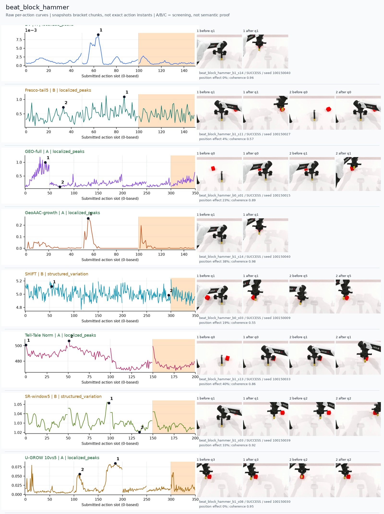
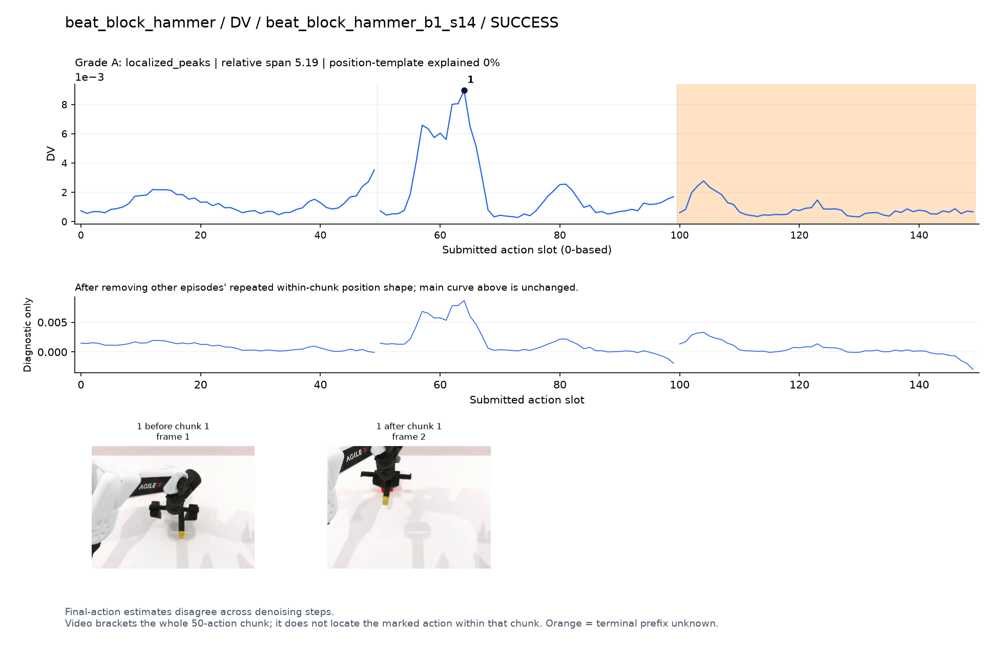
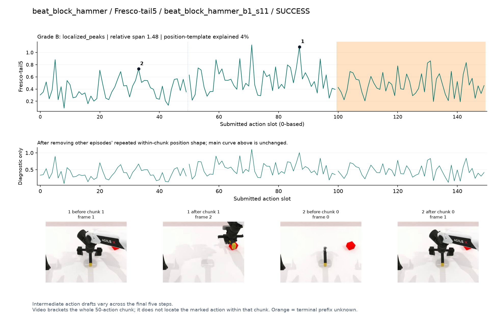
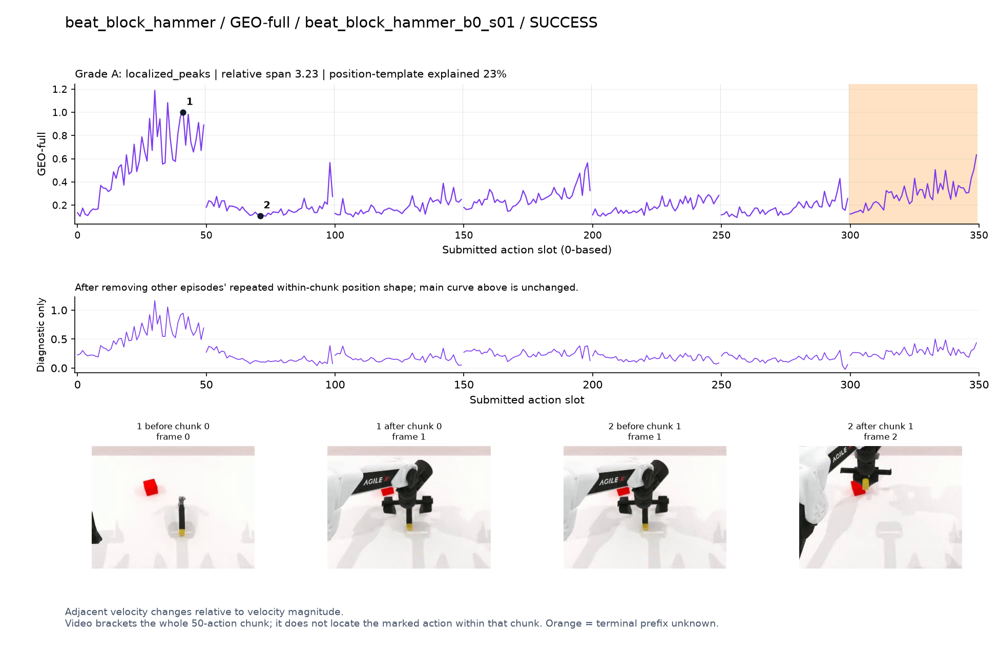
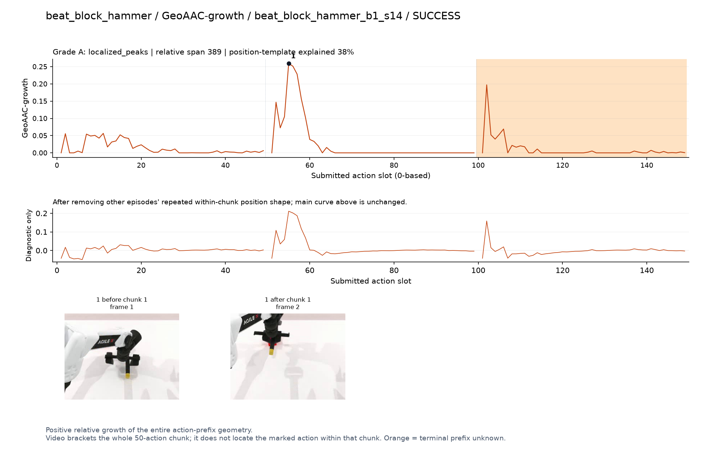
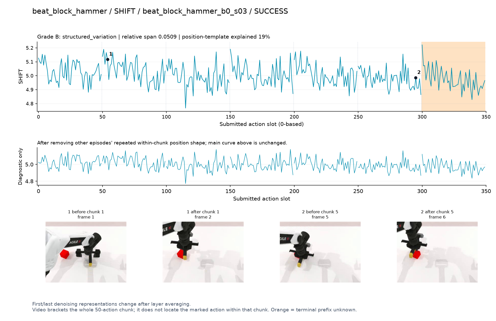
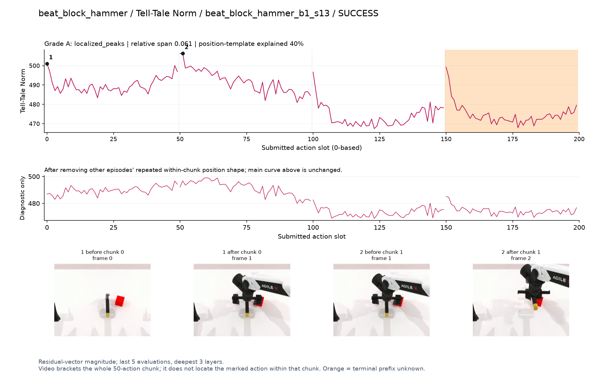
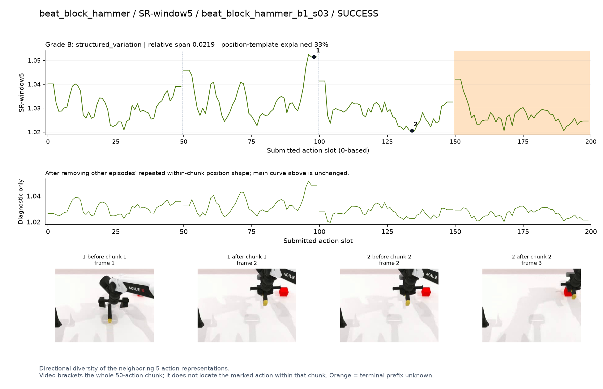
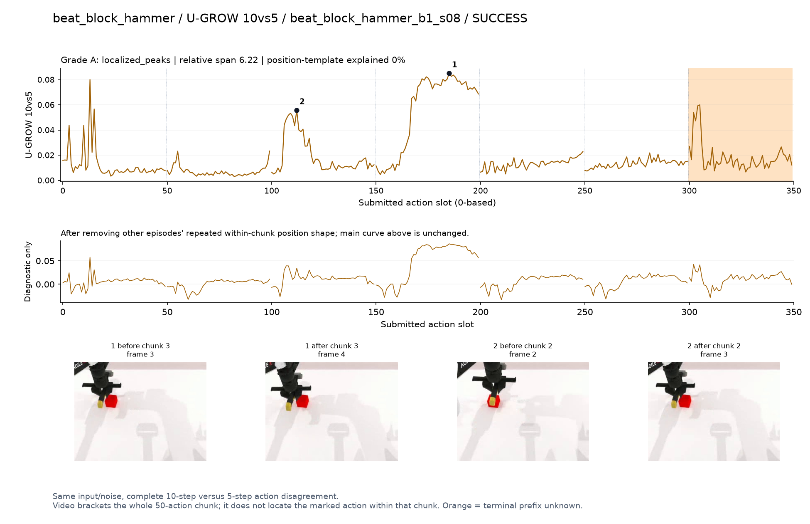

# beat_block_hammer

[全部任务](../README.md#全部任务) · [按信号看](../README.md#按信号看)

主图保留逐动作原始值；细虚线为chunk边界，橙色为终止段实际执行长度不明，未用于筛选。帧只对应chunk前后，不能精确定位某个h的接触瞬间。A/B/C是形态筛选等级，优先读人工备注。

## DV

**可解释候选**：候选：q1由抓住锤柄到举锤/朝方块移动，局部峰清楚。

轨迹 `beat_block_hammer_b1_s14`；成功；种子 `100150040`；正式验收。

[PNG原图](../figures/beat_block_hammer/dv.png) · [SVG矢量图](../figures/beat_block_hammer/dv.svg) · [完整元数据](../entries/beat_block_hammer/dv.json)

对应帧：[1 before q1](../frames/beat_block_hammer/beat_block_hammer_b1_s14/f001.jpg) · [1 after q1](../frames/beat_block_hammer/beat_block_hammer_b1_s14/f002.jpg)

## Fresco-tail5

**较弱**：弱：逐动作抖动较密，未见可靠独立事件对应；全数据与噪声到最终动作距离高度相关。

轨迹 `beat_block_hammer_b1_s11`；成功；种子 `100150027`；正式验收。

[PNG原图](../figures/beat_block_hammer/fresco.png) · [SVG矢量图](../figures/beat_block_hammer/fresco.svg) · [完整元数据](../entries/beat_block_hammer/fresco.json)

对应帧：[1 before q1](../frames/beat_block_hammer/beat_block_hammer_b1_s11/f001.jpg) · [1 after q1](../frames/beat_block_hammer/beat_block_hammer_b1_s11/f002.jpg) · [2 before q0](../frames/beat_block_hammer/beat_block_hammer_b1_s11/f000.jpg) · [2 after q0](../frames/beat_block_hammer/beat_block_hammer_b1_s11/f001.jpg)

## GEO-full

**可解释候选**：候选：q0接近并抓取锤柄段高，不能称已经击打。

轨迹 `beat_block_hammer_b0_s01`；成功；种子 `100150015`；正式验收。

[PNG原图](../figures/beat_block_hammer/geo.png) · [SVG矢量图](../figures/beat_block_hammer/geo.svg) · [完整元数据](../entries/beat_block_hammer/geo.json)

对应帧：[1 before q0](../frames/beat_block_hammer/beat_block_hammer_b0_s01/f000.jpg) · [1 after q0](../frames/beat_block_hammer/beat_block_hammer_b0_s01/f001.jpg) · [2 before q1](../frames/beat_block_hammer/beat_block_hammer_b0_s01/f001.jpg) · [2 after q1](../frames/beat_block_hammer/beat_block_hammer_b0_s01/f002.jpg)

## GeoAAC-growth

**受其他因素影响**：谨慎：q1举锤段窄峰与chunk前段重合。

轨迹 `beat_block_hammer_b1_s14`；成功；种子 `100150040`；正式验收。

[PNG原图](../figures/beat_block_hammer/geoaac.png) · [SVG矢量图](../figures/beat_block_hammer/geoaac.svg) · [完整元数据](../entries/beat_block_hammer/geoaac.json)

对应帧：[1 before q1](../frames/beat_block_hammer/beat_block_hammer_b1_s14/f001.jpg) · [1 after q1](../frames/beat_block_hammer/beat_block_hammer_b1_s14/f002.jpg)

## SHIFT

**较弱**：弱：小幅抖动/阶段基线变化，未见可靠独立事件对应；路径长度混杂强。

轨迹 `beat_block_hammer_b0_s03`；成功；种子 `100150009`；正式验收。

[PNG原图](../figures/beat_block_hammer/shift.png) · [SVG矢量图](../figures/beat_block_hammer/shift.svg) · [完整元数据](../entries/beat_block_hammer/shift.json)

对应帧：[1 before q1](../frames/beat_block_hammer/beat_block_hammer_b0_s03/f001.jpg) · [1 after q1](../frames/beat_block_hammer/beat_block_hammer_b0_s03/f002.jpg) · [2 before q5](../frames/beat_block_hammer/beat_block_hammer_b0_s03/f005.jpg) · [2 after q5](../frames/beat_block_hammer/beat_block_hammer_b0_s03/f006.jpg)

## Tell-Tale Norm

**阶段变化**：阶段差异存在，标记峰含chunk首部，不能直接解释为重要性。

轨迹 `beat_block_hammer_b1_s13`；成功；种子 `100150033`；正式验收。

[PNG原图](../figures/beat_block_hammer/norm.png) · [SVG矢量图](../figures/beat_block_hammer/norm.svg) · [完整元数据](../entries/beat_block_hammer/norm.json)

对应帧：[1 before q0](../frames/beat_block_hammer/beat_block_hammer_b1_s13/f000.jpg) · [1 after q0](../frames/beat_block_hammer/beat_block_hammer_b1_s13/f001.jpg) · [2 before q1](../frames/beat_block_hammer/beat_block_hammer_b1_s13/f001.jpg) · [2 after q1](../frames/beat_block_hammer/beat_block_hammer_b1_s13/f002.jpg)

## SR-window5

**受其他因素影响**：谨慎：q1结束附近升高，动作邻域/边界影响。

轨迹 `beat_block_hammer_b1_s03`；成功；种子 `100150039`；正式验收。

[PNG原图](../figures/beat_block_hammer/sr.png) · [SVG矢量图](../figures/beat_block_hammer/sr.svg) · [完整元数据](../entries/beat_block_hammer/sr.json)

对应帧：[1 before q1](../frames/beat_block_hammer/beat_block_hammer_b1_s03/f001.jpg) · [1 after q1](../frames/beat_block_hammer/beat_block_hammer_b1_s03/f002.jpg) · [2 before q2](../frames/beat_block_hammer/beat_block_hammer_b1_s03/f002.jpg) · [2 after q2](../frames/beat_block_hammer/beat_block_hammer_b1_s03/f003.jpg)

## U-GROW 10vs5

**可解释候选**：候选：持锤在方块附近移动的q2/q3有局部高区；敲击瞬间不明。

轨迹 `beat_block_hammer_b1_s08`；成功；种子 `100150030`；正式验收。

[PNG原图](../figures/beat_block_hammer/ugrow.png) · [SVG矢量图](../figures/beat_block_hammer/ugrow.svg) · [完整元数据](../entries/beat_block_hammer/ugrow.json)

对应帧：[1 before q3](../frames/beat_block_hammer/beat_block_hammer_b1_s08/f003.jpg) · [1 after q3](../frames/beat_block_hammer/beat_block_hammer_b1_s08/f004.jpg) · [2 before q2](../frames/beat_block_hammer/beat_block_hammer_b1_s08/f002.jpg) · [2 after q2](../frames/beat_block_hammer/beat_block_hammer_b1_s08/f003.jpg)
