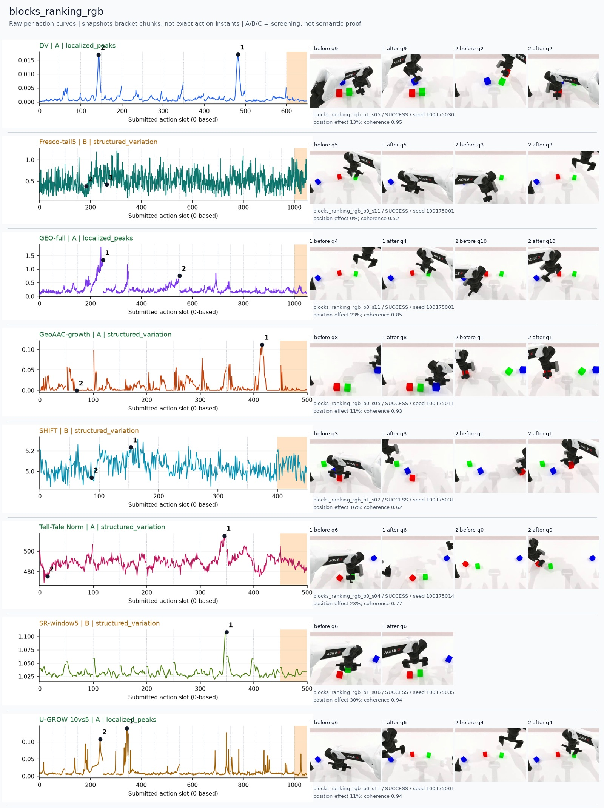
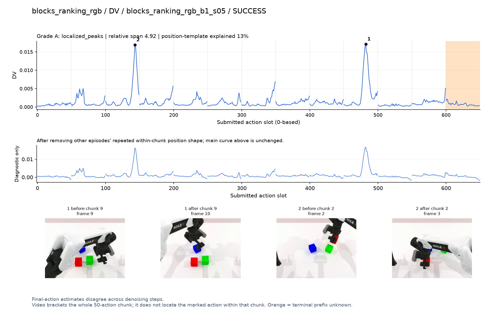
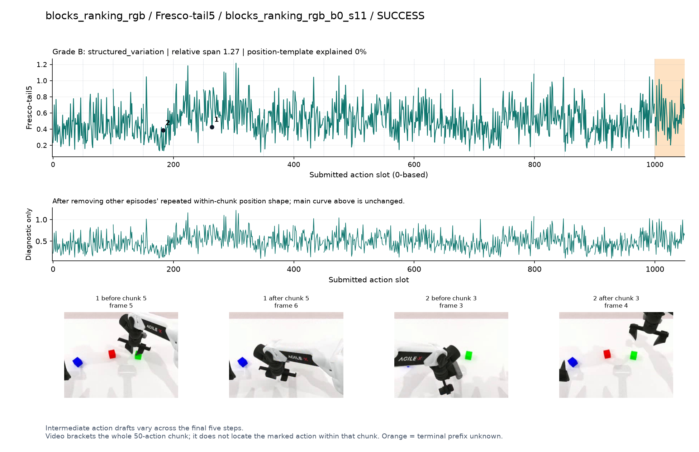
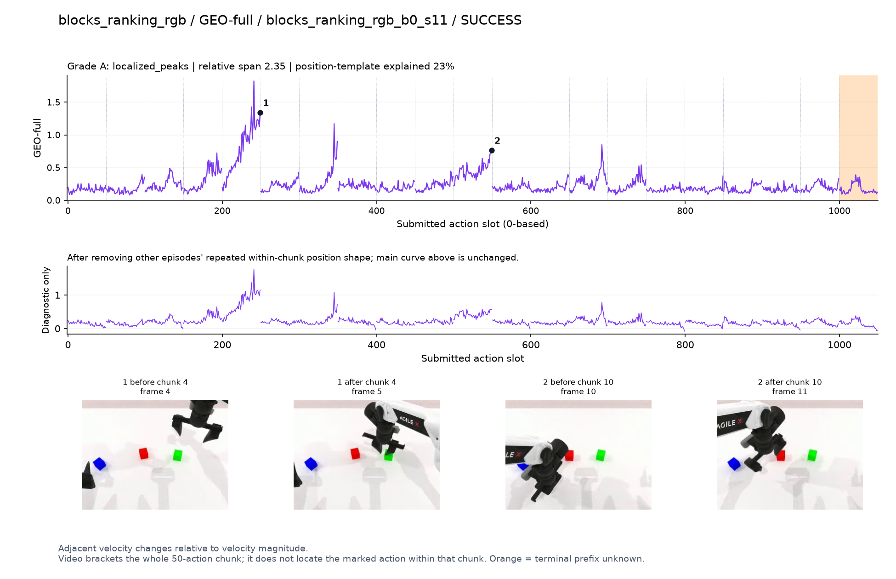
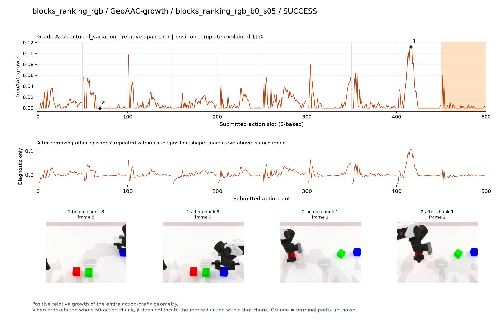
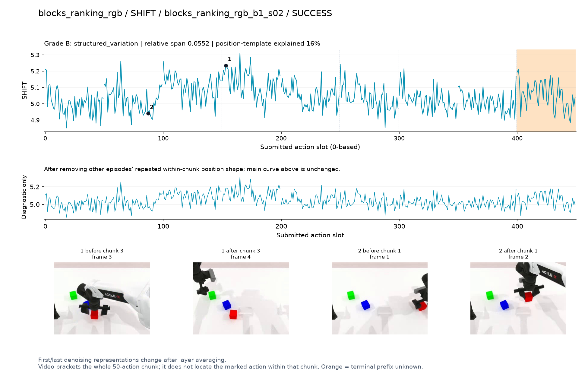
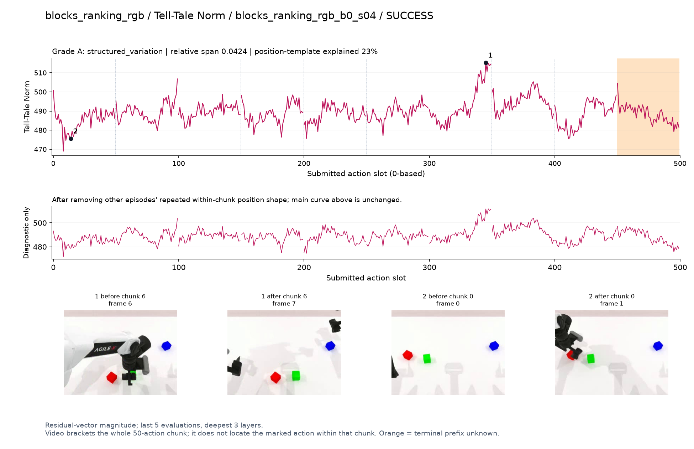
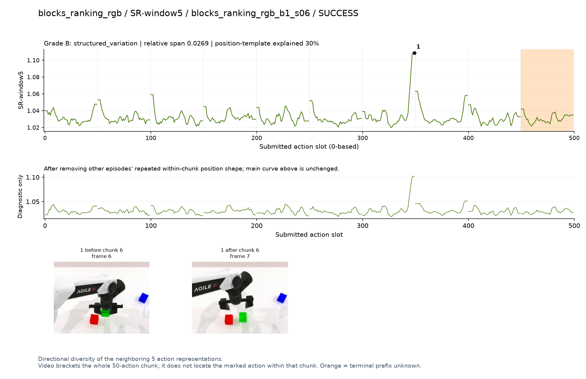
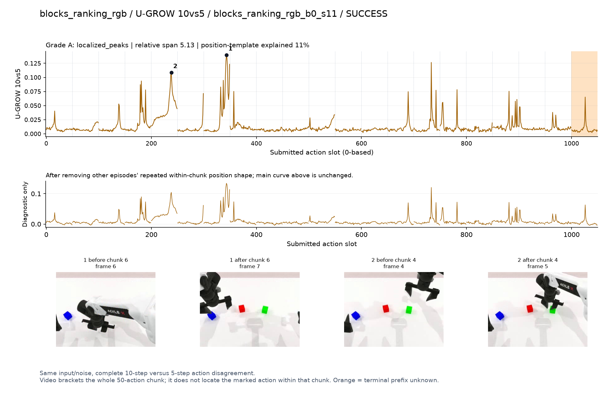

# blocks_ranking_rgb

[全部任务](../README.md#全部任务) · [按信号看](../README.md#按信号看)

主图保留逐动作原始值；细虚线为chunk边界，橙色为终止段实际执行长度不明，未用于筛选。帧只对应chunk前后，不能精确定位某个h的接触瞬间。A/B/C是形态筛选等级，优先读人工备注。

## DV

**可解释候选**：候选：q2/q9抓取或移动不同颜色方块，各有清楚峰。

轨迹 `blocks_ranking_rgb_b1_s05`；成功；种子 `100175030`；正式验收。

[PNG原图](../figures/blocks_ranking_rgb/dv.png) · [SVG矢量图](../figures/blocks_ranking_rgb/dv.svg) · [完整元数据](../entries/blocks_ranking_rgb/dv.json)

对应帧：[1 before q9](../frames/blocks_ranking_rgb/blocks_ranking_rgb_b1_s05/f009.jpg) · [1 after q9](../frames/blocks_ranking_rgb/blocks_ranking_rgb_b1_s05/f010.jpg) · [2 before q2](../frames/blocks_ranking_rgb/blocks_ranking_rgb_b1_s05/f002.jpg) · [2 after q2](../frames/blocks_ranking_rgb/blocks_ranking_rgb_b1_s05/f003.jpg)

## Fresco-tail5

**较弱**：弱：逐动作抖动较密，未见可靠独立事件对应；全数据与噪声到最终动作距离高度相关。

轨迹 `blocks_ranking_rgb_b0_s11`；成功；种子 `100175001`；正式验收。

[PNG原图](../figures/blocks_ranking_rgb/fresco.png) · [SVG矢量图](../figures/blocks_ranking_rgb/fresco.svg) · [完整元数据](../entries/blocks_ranking_rgb/fresco.json)

对应帧：[1 before q5](../frames/blocks_ranking_rgb/blocks_ranking_rgb_b0_s11/f005.jpg) · [1 after q5](../frames/blocks_ranking_rgb/blocks_ranking_rgb_b0_s11/f006.jpg) · [2 before q3](../frames/blocks_ranking_rgb/blocks_ranking_rgb_b0_s11/f003.jpg) · [2 after q3](../frames/blocks_ranking_rgb/blocks_ranking_rgb_b0_s11/f004.jpg)

## GEO-full

**可解释候选**：候选：q4/q10手离开原位置并转向方块，阶段变化清楚。

轨迹 `blocks_ranking_rgb_b0_s11`；成功；种子 `100175001`；正式验收。

[PNG原图](../figures/blocks_ranking_rgb/geo.png) · [SVG矢量图](../figures/blocks_ranking_rgb/geo.svg) · [完整元数据](../entries/blocks_ranking_rgb/geo.json)

对应帧：[1 before q4](../frames/blocks_ranking_rgb/blocks_ranking_rgb_b0_s11/f004.jpg) · [1 after q4](../frames/blocks_ranking_rgb/blocks_ranking_rgb_b0_s11/f005.jpg) · [2 before q10](../frames/blocks_ranking_rgb/blocks_ranking_rgb_b0_s11/f010.jpg) · [2 after q10](../frames/blocks_ranking_rgb/blocks_ranking_rgb_b0_s11/f011.jpg)

## GeoAAC-growth

**受其他因素影响**：谨慎：多次前缀尖峰；q8夹向蓝块，不能归结为唯一事件。

轨迹 `blocks_ranking_rgb_b0_s05`；成功；种子 `100175011`；正式验收。

[PNG原图](../figures/blocks_ranking_rgb/geoaac.png) · [SVG矢量图](../figures/blocks_ranking_rgb/geoaac.svg) · [完整元数据](../entries/blocks_ranking_rgb/geoaac.json)

对应帧：[1 before q8](../frames/blocks_ranking_rgb/blocks_ranking_rgb_b0_s05/f008.jpg) · [1 after q8](../frames/blocks_ranking_rgb/blocks_ranking_rgb_b0_s05/f009.jpg) · [2 before q1](../frames/blocks_ranking_rgb/blocks_ranking_rgb_b0_s05/f001.jpg) · [2 after q1](../frames/blocks_ranking_rgb/blocks_ranking_rgb_b0_s05/f002.jpg)

## SHIFT

**较弱**：弱：小幅抖动/阶段基线变化，未见可靠独立事件对应；路径长度混杂强。

轨迹 `blocks_ranking_rgb_b1_s02`；成功；种子 `100175031`；正式验收。

[PNG原图](../figures/blocks_ranking_rgb/shift.png) · [SVG矢量图](../figures/blocks_ranking_rgb/shift.svg) · [完整元数据](../entries/blocks_ranking_rgb/shift.json)

对应帧：[1 before q3](../frames/blocks_ranking_rgb/blocks_ranking_rgb_b1_s02/f003.jpg) · [1 after q3](../frames/blocks_ranking_rgb/blocks_ranking_rgb_b1_s02/f004.jpg) · [2 before q1](../frames/blocks_ranking_rgb/blocks_ranking_rgb_b1_s02/f001.jpg) · [2 after q1](../frames/blocks_ranking_rgb/blocks_ranking_rgb_b1_s02/f002.jpg)

## Tell-Tale Norm

**可解释候选**：阶段候选：q6手抬起/离开方块附近时幅度高；中间也有其他波动。

轨迹 `blocks_ranking_rgb_b0_s04`；成功；种子 `100175014`；正式验收。

[PNG原图](../figures/blocks_ranking_rgb/norm.png) · [SVG矢量图](../figures/blocks_ranking_rgb/norm.svg) · [完整元数据](../entries/blocks_ranking_rgb/norm.json)

对应帧：[1 before q6](../frames/blocks_ranking_rgb/blocks_ranking_rgb_b0_s04/f006.jpg) · [1 after q6](../frames/blocks_ranking_rgb/blocks_ranking_rgb_b0_s04/f007.jpg) · [2 before q0](../frames/blocks_ranking_rgb/blocks_ranking_rgb_b0_s04/f000.jpg) · [2 after q0](../frames/blocks_ranking_rgb/blocks_ranking_rgb_b0_s04/f001.jpg)

## SR-window5

**受其他因素影响**：谨慎：q6结束附近高峰突出，但正处chunk边界。

轨迹 `blocks_ranking_rgb_b1_s06`；成功；种子 `100175035`；正式验收。

[PNG原图](../figures/blocks_ranking_rgb/sr.png) · [SVG矢量图](../figures/blocks_ranking_rgb/sr.svg) · [完整元数据](../entries/blocks_ranking_rgb/sr.json)

对应帧：[1 before q6](../frames/blocks_ranking_rgb/blocks_ranking_rgb_b1_s06/f006.jpg) · [1 after q6](../frames/blocks_ranking_rgb/blocks_ranking_rgb_b1_s06/f007.jpg)

## U-GROW 10vs5

**可解释候选**：候选：q4/q6转移方块阶段升高，同时存在其他尖峰。

轨迹 `blocks_ranking_rgb_b0_s11`；成功；种子 `100175001`；正式验收。

[PNG原图](../figures/blocks_ranking_rgb/ugrow.png) · [SVG矢量图](../figures/blocks_ranking_rgb/ugrow.svg) · [完整元数据](../entries/blocks_ranking_rgb/ugrow.json)

对应帧：[1 before q6](../frames/blocks_ranking_rgb/blocks_ranking_rgb_b0_s11/f006.jpg) · [1 after q6](../frames/blocks_ranking_rgb/blocks_ranking_rgb_b0_s11/f007.jpg) · [2 before q4](../frames/blocks_ranking_rgb/blocks_ranking_rgb_b0_s11/f004.jpg) · [2 after q4](../frames/blocks_ranking_rgb/blocks_ranking_rgb_b0_s11/f005.jpg)
