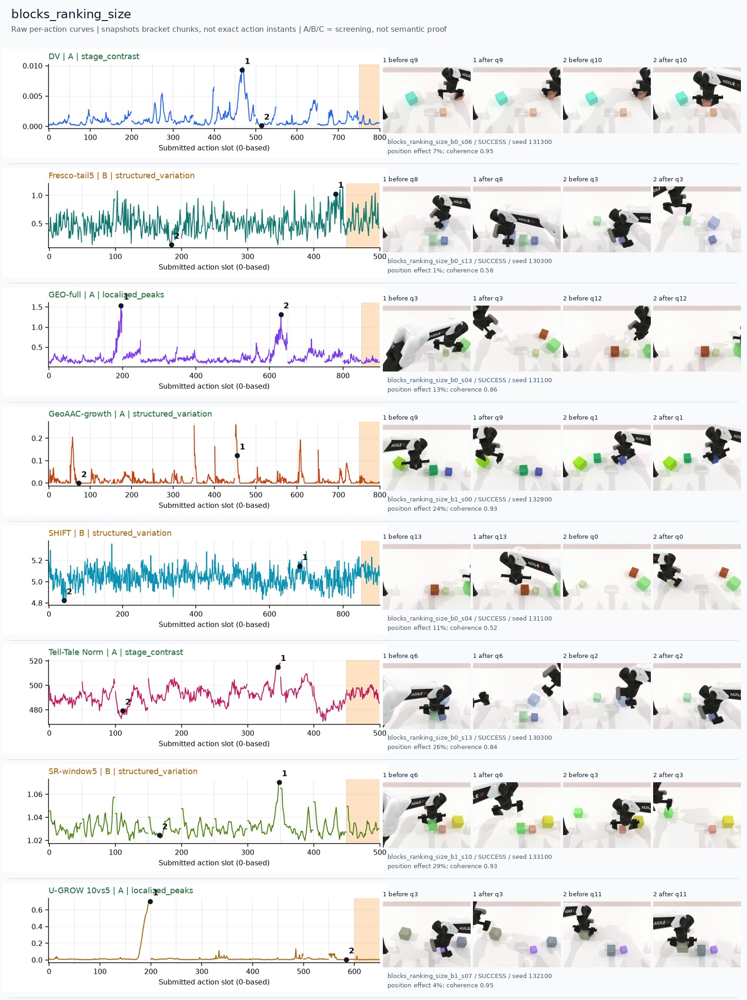
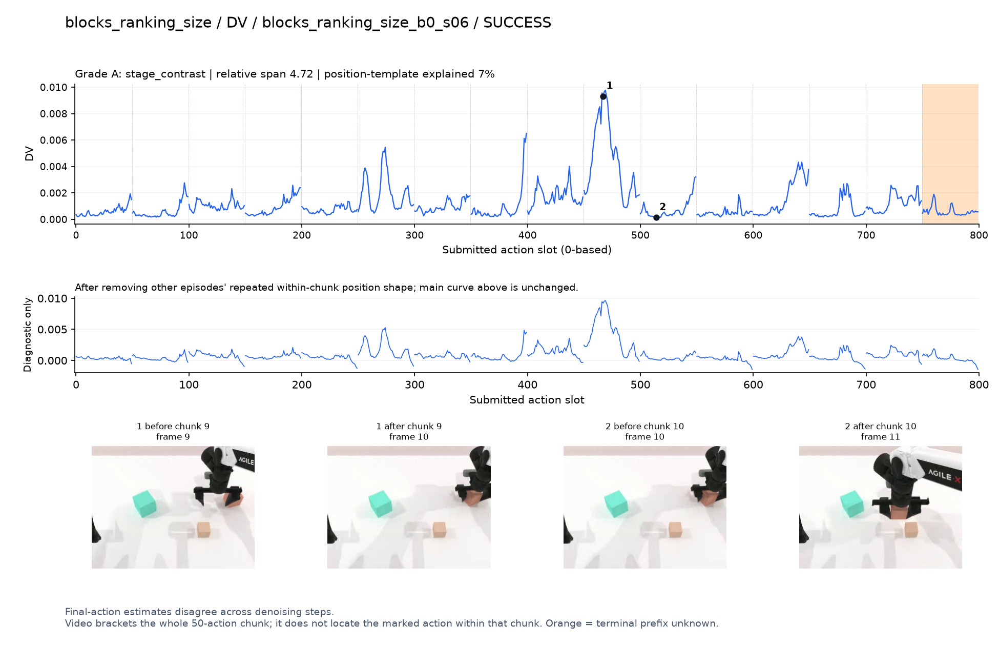
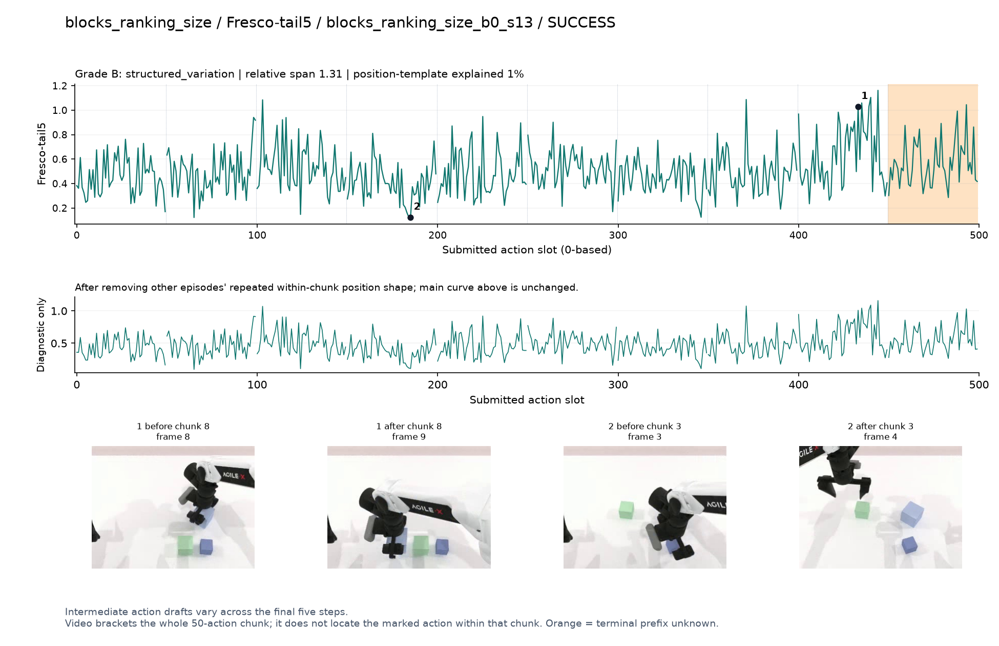
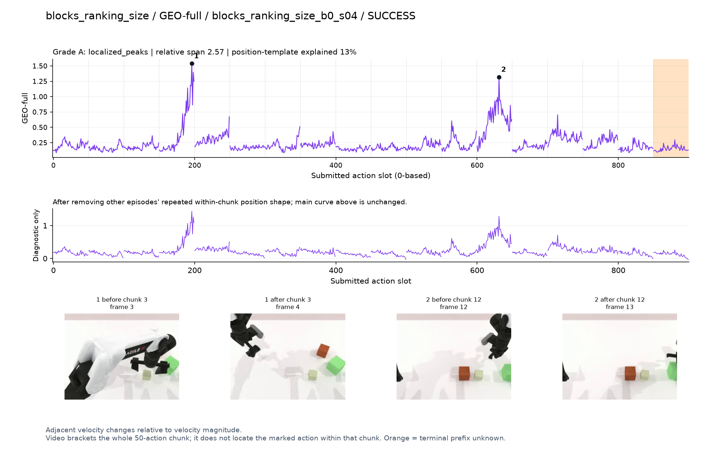
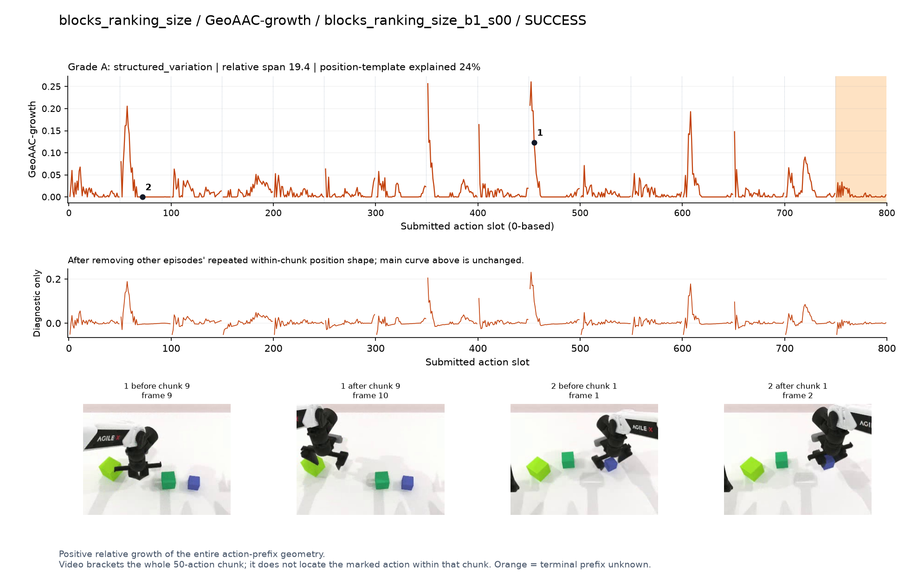
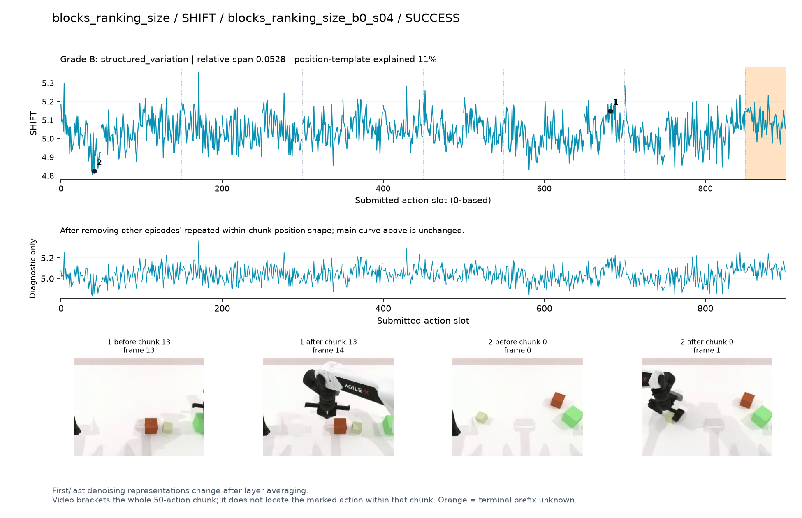
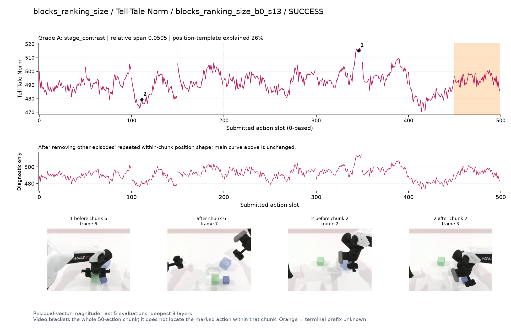
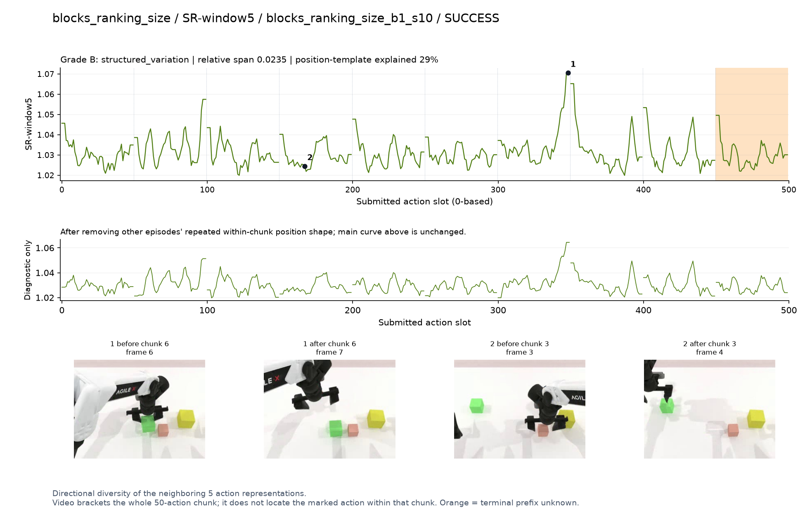
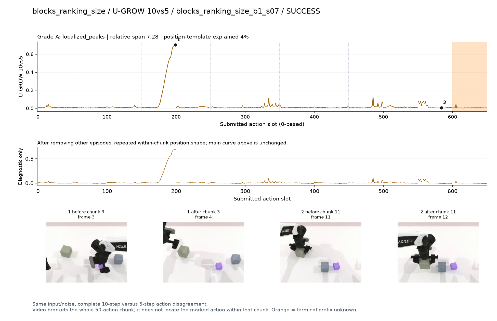

# blocks_ranking_size

[全部任务](../README.md#全部任务) · [按信号看](../README.md#按信号看)

主图保留逐动作原始值；细虚线为chunk边界，橙色为终止段实际执行长度不明，未用于筛选。帧只对应chunk前后，不能精确定位某个h的接触瞬间。A/B/C是形态筛选等级，优先读人工备注。

## DV

**可解释候选**：候选：q9操作小方块时有主要峰，另有多次小峰。

轨迹 `blocks_ranking_size_b0_s06`；成功；种子 `131300`；正式验收。

[PNG原图](../figures/blocks_ranking_size/dv.png) · [SVG矢量图](../figures/blocks_ranking_size/dv.svg) · [完整元数据](../entries/blocks_ranking_size/dv.json)

对应帧：[1 before q9](../frames/blocks_ranking_size/blocks_ranking_size_b0_s06/f009.jpg) · [1 after q9](../frames/blocks_ranking_size/blocks_ranking_size_b0_s06/f010.jpg) · [2 before q10](../frames/blocks_ranking_size/blocks_ranking_size_b0_s06/f010.jpg) · [2 after q10](../frames/blocks_ranking_size/blocks_ranking_size_b0_s06/f011.jpg)

## Fresco-tail5

**较弱**：弱：逐动作抖动较密，未见可靠独立事件对应；全数据与噪声到最终动作距离高度相关。

轨迹 `blocks_ranking_size_b0_s13`；成功；种子 `130300`；正式验收。

[PNG原图](../figures/blocks_ranking_size/fresco.png) · [SVG矢量图](../figures/blocks_ranking_size/fresco.svg) · [完整元数据](../entries/blocks_ranking_size/fresco.json)

对应帧：[1 before q8](../frames/blocks_ranking_size/blocks_ranking_size_b0_s13/f008.jpg) · [1 after q8](../frames/blocks_ranking_size/blocks_ranking_size_b0_s13/f009.jpg) · [2 before q3](../frames/blocks_ranking_size/blocks_ranking_size_b0_s13/f003.jpg) · [2 after q3](../frames/blocks_ranking_size/blocks_ranking_size_b0_s13/f004.jpg)

## GEO-full

**可解释候选**：候选：q3/q12抓取/移开不同尺寸方块，两个主要高区。

轨迹 `blocks_ranking_size_b0_s04`；成功；种子 `131100`；正式验收。

[PNG原图](../figures/blocks_ranking_size/geo.png) · [SVG矢量图](../figures/blocks_ranking_size/geo.svg) · [完整元数据](../entries/blocks_ranking_size/geo.json)

对应帧：[1 before q3](../frames/blocks_ranking_size/blocks_ranking_size_b0_s04/f003.jpg) · [1 after q3](../frames/blocks_ranking_size/blocks_ranking_size_b0_s04/f004.jpg) · [2 before q12](../frames/blocks_ranking_size/blocks_ranking_size_b0_s04/f012.jpg) · [2 after q12](../frames/blocks_ranking_size/blocks_ranking_size_b0_s04/f013.jpg)

## GeoAAC-growth

**较弱**：弱：几乎每隔一个或几个chunk就有前缀峰，事件特异性不清。

轨迹 `blocks_ranking_size_b1_s00`；成功；种子 `132800`；正式验收。

[PNG原图](../figures/blocks_ranking_size/geoaac.png) · [SVG矢量图](../figures/blocks_ranking_size/geoaac.svg) · [完整元数据](../entries/blocks_ranking_size/geoaac.json)

对应帧：[1 before q9](../frames/blocks_ranking_size/blocks_ranking_size_b1_s00/f009.jpg) · [1 after q9](../frames/blocks_ranking_size/blocks_ranking_size_b1_s00/f010.jpg) · [2 before q1](../frames/blocks_ranking_size/blocks_ranking_size_b1_s00/f001.jpg) · [2 after q1](../frames/blocks_ranking_size/blocks_ranking_size_b1_s00/f002.jpg)

## SHIFT

**较弱**：弱：小幅抖动/阶段基线变化，未见可靠独立事件对应；路径长度混杂强。

轨迹 `blocks_ranking_size_b0_s04`；成功；种子 `131100`；正式验收。

[PNG原图](../figures/blocks_ranking_size/shift.png) · [SVG矢量图](../figures/blocks_ranking_size/shift.svg) · [完整元数据](../entries/blocks_ranking_size/shift.json)

对应帧：[1 before q13](../frames/blocks_ranking_size/blocks_ranking_size_b0_s04/f013.jpg) · [1 after q13](../frames/blocks_ranking_size/blocks_ranking_size_b0_s04/f014.jpg) · [2 before q0](../frames/blocks_ranking_size/blocks_ranking_size_b0_s04/f000.jpg) · [2 after q0](../frames/blocks_ranking_size/blocks_ranking_size_b0_s04/f001.jpg)

## Tell-Tale Norm

**可解释候选**：阶段候选：q6抬起方块附近升高，相对变化不大。

轨迹 `blocks_ranking_size_b0_s13`；成功；种子 `130300`；正式验收。

[PNG原图](../figures/blocks_ranking_size/norm.png) · [SVG矢量图](../figures/blocks_ranking_size/norm.svg) · [完整元数据](../entries/blocks_ranking_size/norm.json)

对应帧：[1 before q6](../frames/blocks_ranking_size/blocks_ranking_size_b0_s13/f006.jpg) · [1 after q6](../frames/blocks_ranking_size/blocks_ranking_size_b0_s13/f007.jpg) · [2 before q2](../frames/blocks_ranking_size/blocks_ranking_size_b0_s13/f002.jpg) · [2 after q2](../frames/blocks_ranking_size/blocks_ranking_size_b0_s13/f003.jpg)

## SR-window5

**受其他因素影响**：谨慎：q6末端峰主要受边界影响。

轨迹 `blocks_ranking_size_b1_s10`；成功；种子 `133100`；正式验收。

[PNG原图](../figures/blocks_ranking_size/sr.png) · [SVG矢量图](../figures/blocks_ranking_size/sr.svg) · [完整元数据](../entries/blocks_ranking_size/sr.json)

对应帧：[1 before q6](../frames/blocks_ranking_size/blocks_ranking_size_b1_s10/f006.jpg) · [1 after q6](../frames/blocks_ranking_size/blocks_ranking_size_b1_s10/f007.jpg) · [2 before q3](../frames/blocks_ranking_size/blocks_ranking_size_b1_s10/f003.jpg) · [2 after q3](../frames/blocks_ranking_size/blocks_ranking_size_b1_s10/f004.jpg)

## U-GROW 10vs5

**可解释候选**：候选：q3夹取并抬起方块段强升高。

轨迹 `blocks_ranking_size_b1_s07`；成功；种子 `132100`；正式验收。

[PNG原图](../figures/blocks_ranking_size/ugrow.png) · [SVG矢量图](../figures/blocks_ranking_size/ugrow.svg) · [完整元数据](../entries/blocks_ranking_size/ugrow.json)

对应帧：[1 before q3](../frames/blocks_ranking_size/blocks_ranking_size_b1_s07/f003.jpg) · [1 after q3](../frames/blocks_ranking_size/blocks_ranking_size_b1_s07/f004.jpg) · [2 before q11](../frames/blocks_ranking_size/blocks_ranking_size_b1_s07/f011.jpg) · [2 after q11](../frames/blocks_ranking_size/blocks_ranking_size_b1_s07/f012.jpg)
