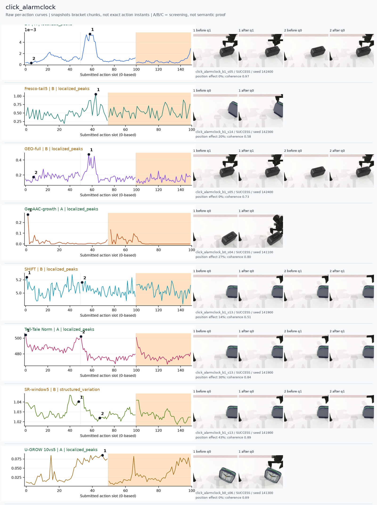
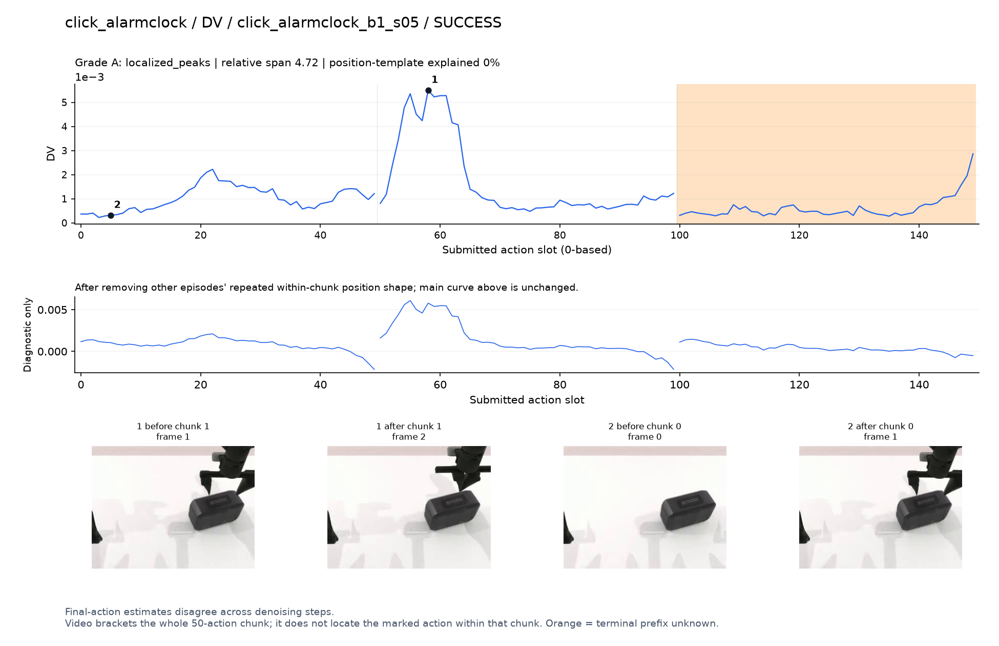
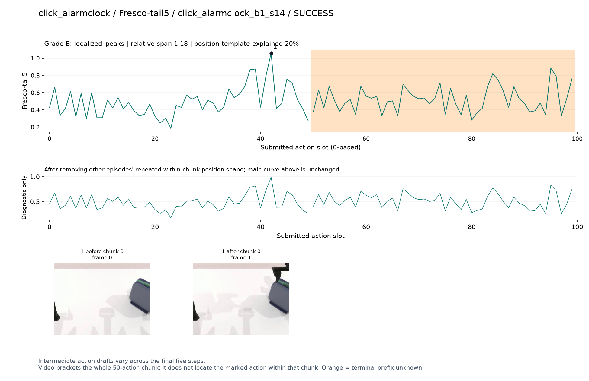
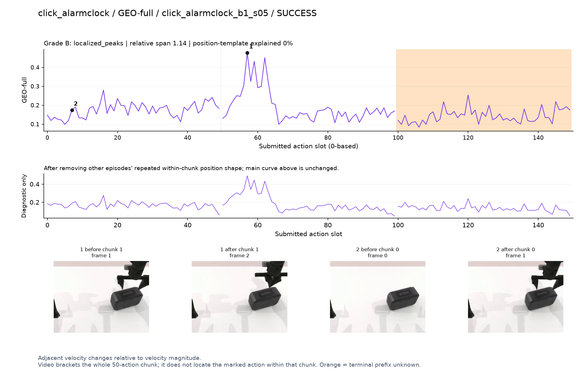
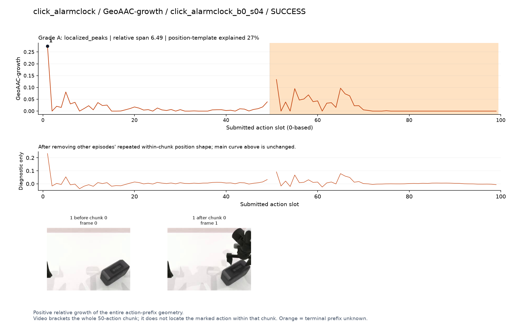
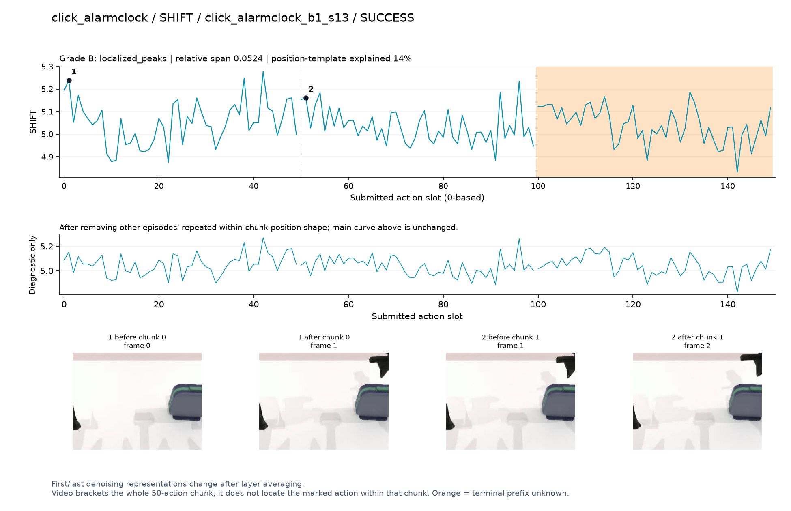
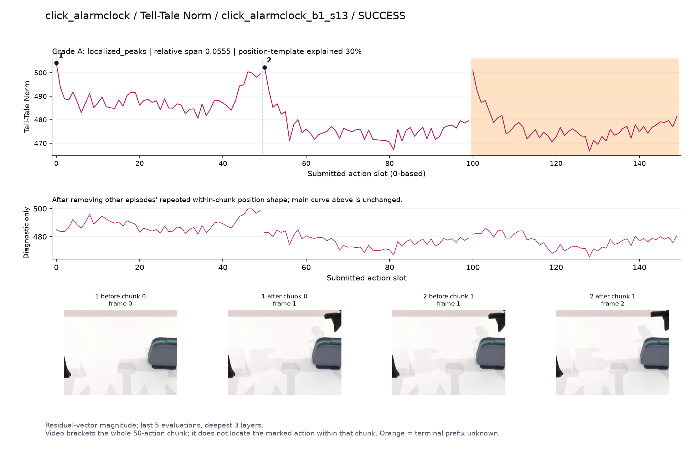
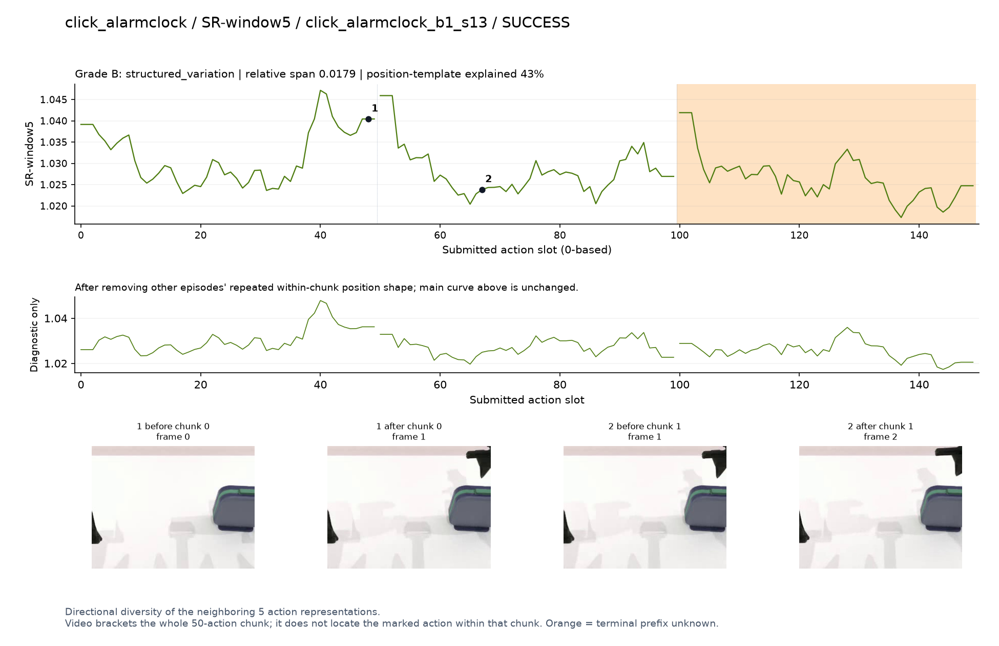
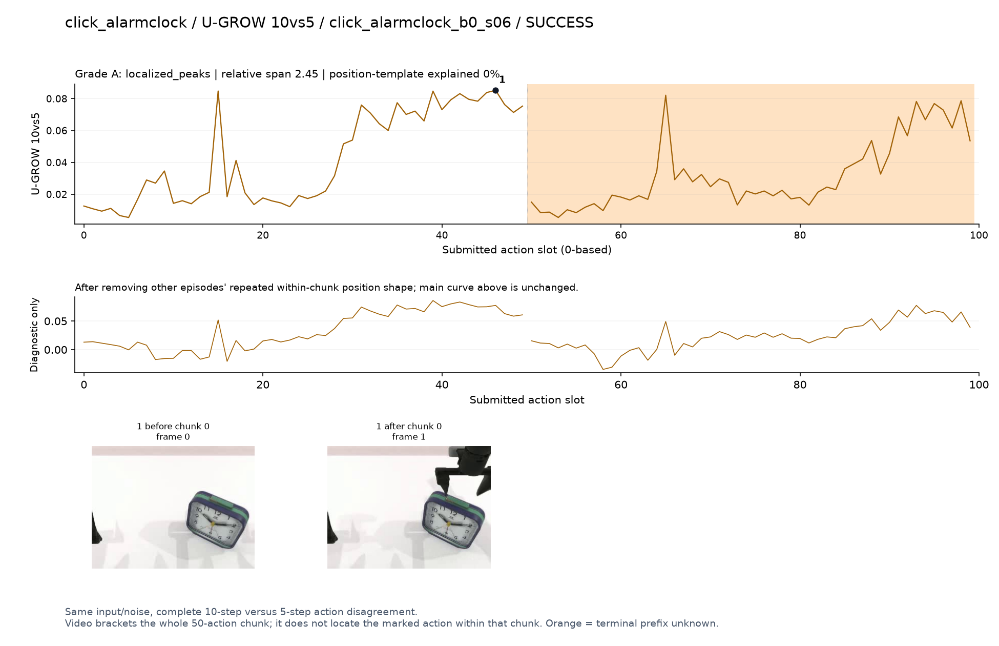

# click_alarmclock

[全部任务](../README.md#全部任务) · [按信号看](../README.md#按信号看)

主图保留逐动作原始值；细虚线为chunk边界，橙色为终止段实际执行长度不明，未用于筛选。帧只对应chunk前后，不能精确定位某个h的接触瞬间。A/B/C是形态筛选等级，优先读人工备注。

## DV

**可解释候选**：候选：q1手指靠近闹钟上部时局部峰；画面不能证实按下瞬间。

轨迹 `click_alarmclock_b1_s05`；成功；种子 `142400`；正式验收。

[PNG原图](../figures/click_alarmclock/dv.png) · [SVG矢量图](../figures/click_alarmclock/dv.svg) · [完整元数据](../entries/click_alarmclock/dv.json)

对应帧：[1 before q1](../frames/click_alarmclock/click_alarmclock_b1_s05/f001.jpg) · [1 after q1](../frames/click_alarmclock/click_alarmclock_b1_s05/f002.jpg) · [2 before q0](../frames/click_alarmclock/click_alarmclock_b1_s05/f000.jpg) · [2 after q0](../frames/click_alarmclock/click_alarmclock_b1_s05/f001.jpg)

## Fresco-tail5

**较弱**：弱：逐动作抖动较密，未见可靠独立事件对应；全数据与噪声到最终动作距离高度相关。

轨迹 `click_alarmclock_b1_s14`；成功；种子 `142300`；正式验收。

[PNG原图](../figures/click_alarmclock/fresco.png) · [SVG矢量图](../figures/click_alarmclock/fresco.svg) · [完整元数据](../entries/click_alarmclock/fresco.json)

对应帧：[1 before q0](../frames/click_alarmclock/click_alarmclock_b1_s14/f000.jpg) · [1 after q0](../frames/click_alarmclock/click_alarmclock_b1_s14/f001.jpg)

## GEO-full

**可解释候选**：候选：与DV同一轨迹q1峰，接近闹钟阶段。

轨迹 `click_alarmclock_b1_s05`；成功；种子 `142400`；正式验收。

[PNG原图](../figures/click_alarmclock/geo.png) · [SVG矢量图](../figures/click_alarmclock/geo.svg) · [完整元数据](../entries/click_alarmclock/geo.json)

对应帧：[1 before q1](../frames/click_alarmclock/click_alarmclock_b1_s05/f001.jpg) · [1 after q1](../frames/click_alarmclock/click_alarmclock_b1_s05/f002.jpg) · [2 before q0](../frames/click_alarmclock/click_alarmclock_b1_s05/f000.jpg) · [2 after q0](../frames/click_alarmclock/click_alarmclock_b1_s05/f001.jpg)

## GeoAAC-growth

**较弱**：弱：q0最前几个动作的前缀峰，不足以定位按键事件。

轨迹 `click_alarmclock_b0_s04`；成功；种子 `141100`；正式验收。

[PNG原图](../figures/click_alarmclock/geoaac.png) · [SVG矢量图](../figures/click_alarmclock/geoaac.svg) · [完整元数据](../entries/click_alarmclock/geoaac.json)

对应帧：[1 before q0](../frames/click_alarmclock/click_alarmclock_b0_s04/f000.jpg) · [1 after q0](../frames/click_alarmclock/click_alarmclock_b0_s04/f001.jpg)

## SHIFT

**较弱**：弱：小幅抖动/阶段基线变化，未见可靠独立事件对应；路径长度混杂强。

轨迹 `click_alarmclock_b1_s13`；成功；种子 `141900`；正式验收。

[PNG原图](../figures/click_alarmclock/shift.png) · [SVG矢量图](../figures/click_alarmclock/shift.svg) · [完整元数据](../entries/click_alarmclock/shift.json)

对应帧：[1 before q0](../frames/click_alarmclock/click_alarmclock_b1_s13/f000.jpg) · [1 after q0](../frames/click_alarmclock/click_alarmclock_b1_s13/f001.jpg) · [2 before q1](../frames/click_alarmclock/click_alarmclock_b1_s13/f001.jpg) · [2 after q1](../frames/click_alarmclock/click_alarmclock_b1_s13/f002.jpg)

## Tell-Tale Norm

**较弱**：弱：chunk开头反复抬高，画面变化很小。

轨迹 `click_alarmclock_b1_s13`；成功；种子 `141900`；正式验收。

[PNG原图](../figures/click_alarmclock/norm.png) · [SVG矢量图](../figures/click_alarmclock/norm.svg) · [完整元数据](../entries/click_alarmclock/norm.json)

对应帧：[1 before q0](../frames/click_alarmclock/click_alarmclock_b1_s13/f000.jpg) · [1 after q0](../frames/click_alarmclock/click_alarmclock_b1_s13/f001.jpg) · [2 before q1](../frames/click_alarmclock/click_alarmclock_b1_s13/f001.jpg) · [2 after q1](../frames/click_alarmclock/click_alarmclock_b1_s13/f002.jpg)

## SR-window5

**较弱**：弱：chunk末端/开头重复抬高。

轨迹 `click_alarmclock_b1_s13`；成功；种子 `141900`；正式验收。

[PNG原图](../figures/click_alarmclock/sr.png) · [SVG矢量图](../figures/click_alarmclock/sr.svg) · [完整元数据](../entries/click_alarmclock/sr.json)

对应帧：[1 before q0](../frames/click_alarmclock/click_alarmclock_b1_s13/f000.jpg) · [1 after q0](../frames/click_alarmclock/click_alarmclock_b1_s13/f001.jpg) · [2 before q1](../frames/click_alarmclock/click_alarmclock_b1_s13/f001.jpg) · [2 after q1](../frames/click_alarmclock/click_alarmclock_b1_s13/f002.jpg)

## U-GROW 10vs5

**可解释候选**：阶段候选：q0靠近闹钟时持续升高，未定位接触。

轨迹 `click_alarmclock_b0_s06`；成功；种子 `141300`；正式验收。

[PNG原图](../figures/click_alarmclock/ugrow.png) · [SVG矢量图](../figures/click_alarmclock/ugrow.svg) · [完整元数据](../entries/click_alarmclock/ugrow.json)

对应帧：[1 before q0](../frames/click_alarmclock/click_alarmclock_b0_s06/f000.jpg) · [1 after q0](../frames/click_alarmclock/click_alarmclock_b0_s06/f001.jpg)
