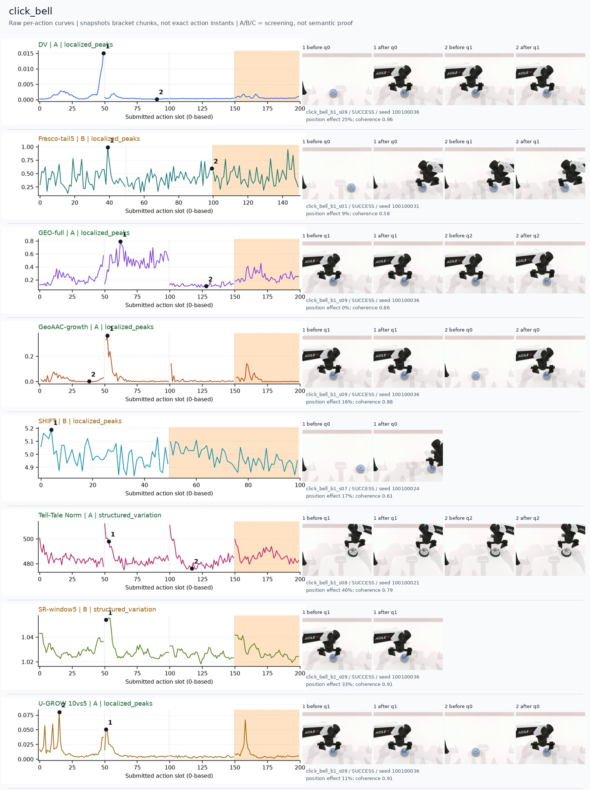
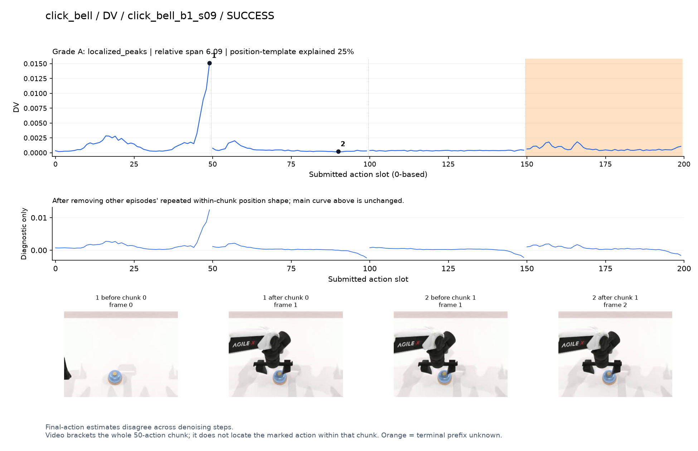
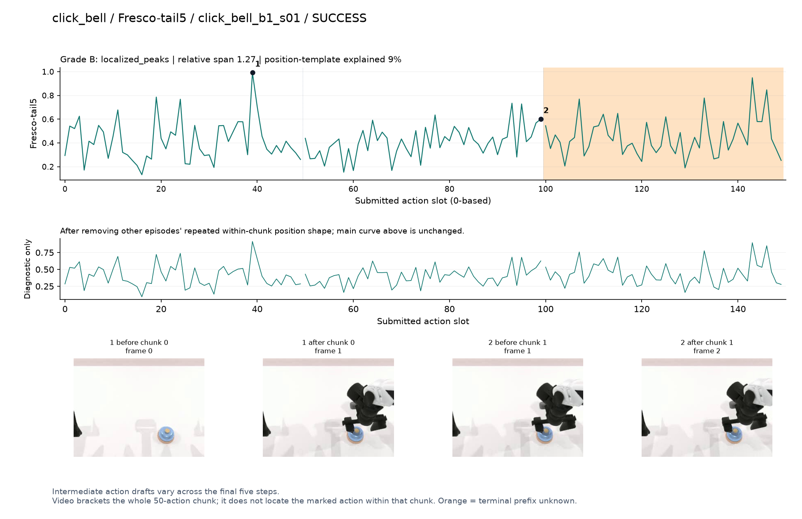
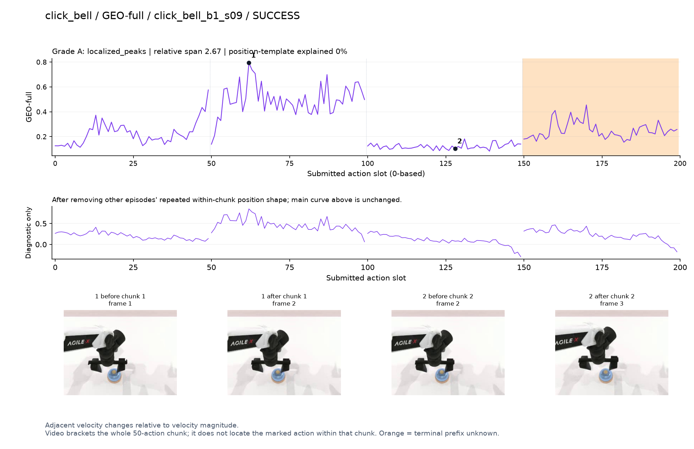
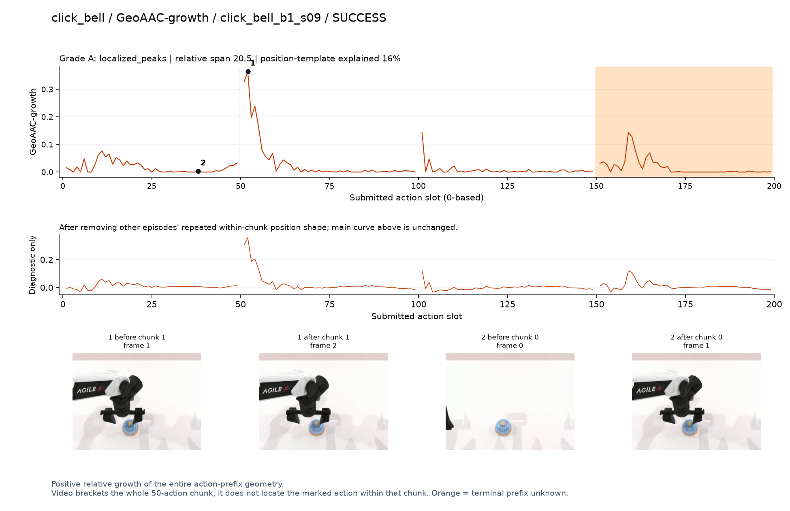
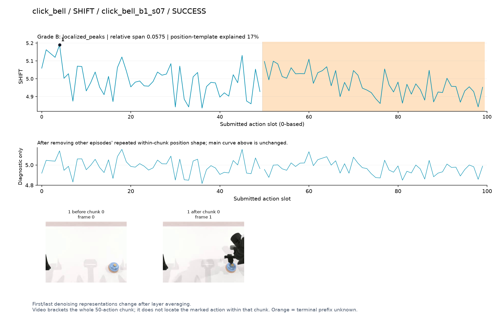
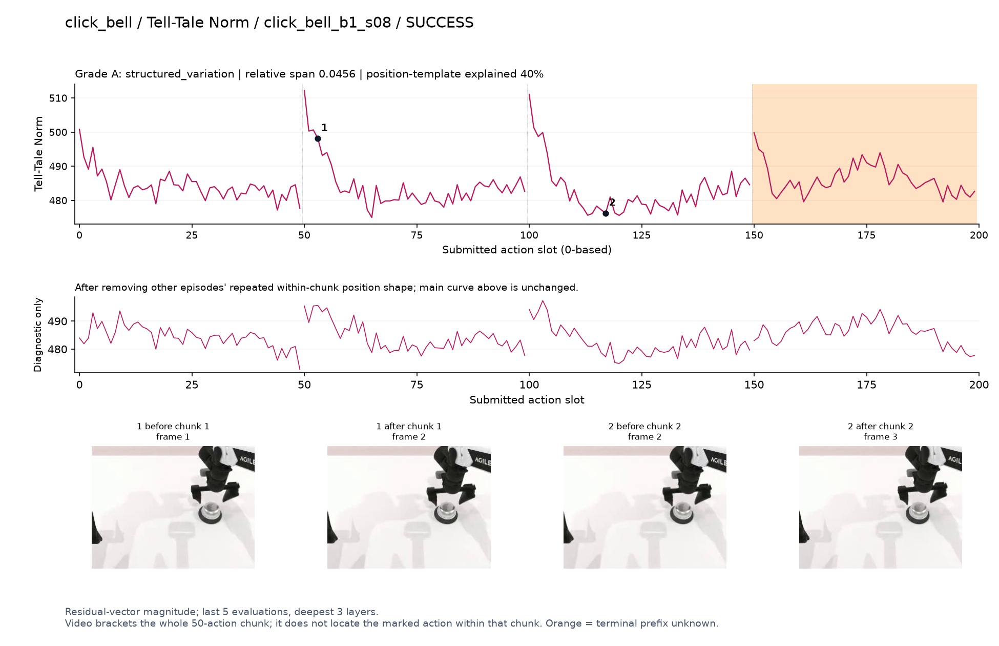
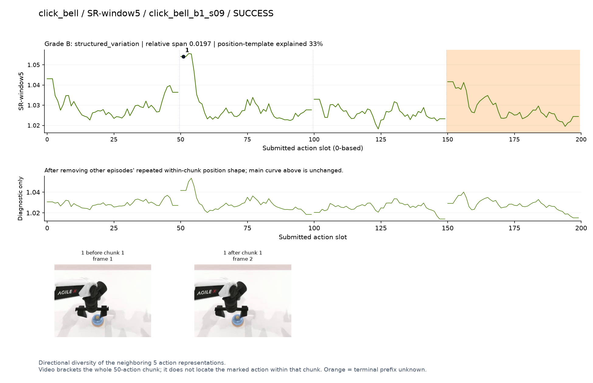
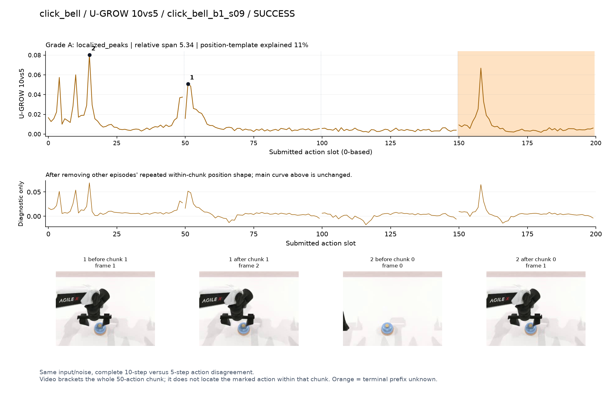

# click_bell

[全部任务](../README.md#全部任务) · [按信号看](../README.md#按信号看)

主图保留逐动作原始值；细虚线为chunk边界，橙色为终止段实际执行长度不明，未用于筛选。帧只对应chunk前后，不能精确定位某个h的接触瞬间。A/B/C是形态筛选等级，优先读人工备注。

## DV

**可解释候选**：候选：q0手从远处到铃上方，末段集中峰。

轨迹 `click_bell_b1_s09`；成功；种子 `100100036`；正式验收。

[PNG原图](../figures/click_bell/dv.png) · [SVG矢量图](../figures/click_bell/dv.svg) · [完整元数据](../entries/click_bell/dv.json)

对应帧：[1 before q0](../frames/click_bell/click_bell_b1_s09/f000.jpg) · [1 after q0](../frames/click_bell/click_bell_b1_s09/f001.jpg) · [2 before q1](../frames/click_bell/click_bell_b1_s09/f001.jpg) · [2 after q1](../frames/click_bell/click_bell_b1_s09/f002.jpg)

## Fresco-tail5

**较弱**：弱：逐动作抖动较密，未见可靠独立事件对应；全数据与噪声到最终动作距离高度相关。

轨迹 `click_bell_b1_s01`；成功；种子 `100100031`；正式验收。

[PNG原图](../figures/click_bell/fresco.png) · [SVG矢量图](../figures/click_bell/fresco.svg) · [完整元数据](../entries/click_bell/fresco.json)

对应帧：[1 before q0](../frames/click_bell/click_bell_b1_s01/f000.jpg) · [1 after q0](../frames/click_bell/click_bell_b1_s01/f001.jpg) · [2 before q1](../frames/click_bell/click_bell_b1_s01/f001.jpg) · [2 after q1](../frames/click_bell/click_bell_b1_s01/f002.jpg)

## GEO-full

**可解释候选**：阶段候选：q1在铃上方调整时持续较高，非独立窄峰。

轨迹 `click_bell_b1_s09`；成功；种子 `100100036`；正式验收。

[PNG原图](../figures/click_bell/geo.png) · [SVG矢量图](../figures/click_bell/geo.svg) · [完整元数据](../entries/click_bell/geo.json)

对应帧：[1 before q1](../frames/click_bell/click_bell_b1_s09/f001.jpg) · [1 after q1](../frames/click_bell/click_bell_b1_s09/f002.jpg) · [2 before q2](../frames/click_bell/click_bell_b1_s09/f002.jpg) · [2 after q2](../frames/click_bell/click_bell_b1_s09/f003.jpg)

## GeoAAC-growth

**受其他因素影响**：谨慎：q1开始突峰与前缀边界重合。

轨迹 `click_bell_b1_s09`；成功；种子 `100100036`；正式验收。

[PNG原图](../figures/click_bell/geoaac.png) · [SVG矢量图](../figures/click_bell/geoaac.svg) · [完整元数据](../entries/click_bell/geoaac.json)

对应帧：[1 before q1](../frames/click_bell/click_bell_b1_s09/f001.jpg) · [1 after q1](../frames/click_bell/click_bell_b1_s09/f002.jpg) · [2 before q0](../frames/click_bell/click_bell_b1_s09/f000.jpg) · [2 after q0](../frames/click_bell/click_bell_b1_s09/f001.jpg)

## SHIFT

**较弱**：弱：小幅抖动/阶段基线变化，未见可靠独立事件对应；路径长度混杂强。

轨迹 `click_bell_b1_s07`；成功；种子 `100100024`；正式验收。

[PNG原图](../figures/click_bell/shift.png) · [SVG矢量图](../figures/click_bell/shift.svg) · [完整元数据](../entries/click_bell/shift.json)

对应帧：[1 before q0](../frames/click_bell/click_bell_b1_s07/f000.jpg) · [1 after q0](../frames/click_bell/click_bell_b1_s07/f001.jpg)

## Tell-Tale Norm

**较弱**：弱：每chunk开始重复高幅度，不能解释成每次都按铃。

轨迹 `click_bell_b1_s08`；成功；种子 `100100021`；正式验收。

[PNG原图](../figures/click_bell/norm.png) · [SVG矢量图](../figures/click_bell/norm.svg) · [完整元数据](../entries/click_bell/norm.json)

对应帧：[1 before q1](../frames/click_bell/click_bell_b1_s08/f001.jpg) · [1 after q1](../frames/click_bell/click_bell_b1_s08/f002.jpg) · [2 before q2](../frames/click_bell/click_bell_b1_s08/f002.jpg) · [2 after q2](../frames/click_bell/click_bell_b1_s08/f003.jpg)

## SR-window5

**较弱**：弱：q0/q1交界高峰，位置模板影响。

轨迹 `click_bell_b1_s09`；成功；种子 `100100036`；正式验收。

[PNG原图](../figures/click_bell/sr.png) · [SVG矢量图](../figures/click_bell/sr.svg) · [完整元数据](../entries/click_bell/sr.json)

对应帧：[1 before q1](../frames/click_bell/click_bell_b1_s09/f001.jpg) · [1 after q1](../frames/click_bell/click_bell_b1_s09/f002.jpg)

## U-GROW 10vs5

**可解释候选**：候选：q0接近和q1局部调整都有峰，画面仅确认靠近。

轨迹 `click_bell_b1_s09`；成功；种子 `100100036`；正式验收。

[PNG原图](../figures/click_bell/ugrow.png) · [SVG矢量图](../figures/click_bell/ugrow.svg) · [完整元数据](../entries/click_bell/ugrow.json)

对应帧：[1 before q1](../frames/click_bell/click_bell_b1_s09/f001.jpg) · [1 after q1](../frames/click_bell/click_bell_b1_s09/f002.jpg) · [2 before q0](../frames/click_bell/click_bell_b1_s09/f000.jpg) · [2 after q0](../frames/click_bell/click_bell_b1_s09/f001.jpg)
