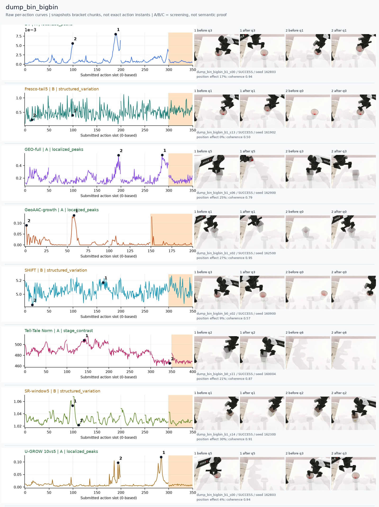
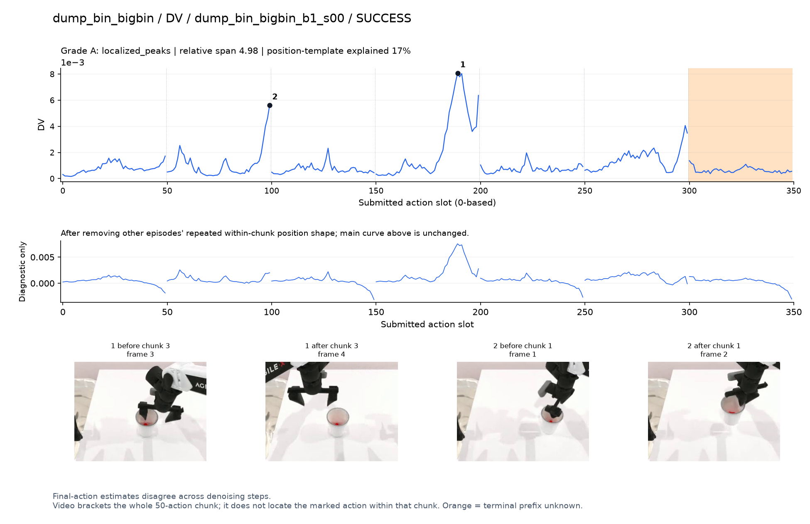
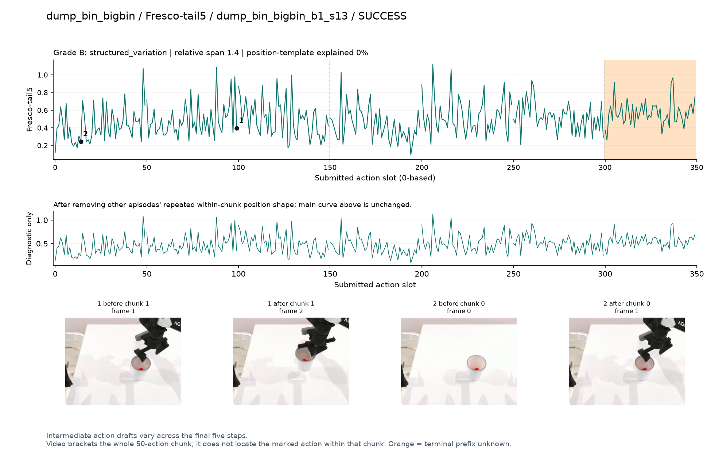
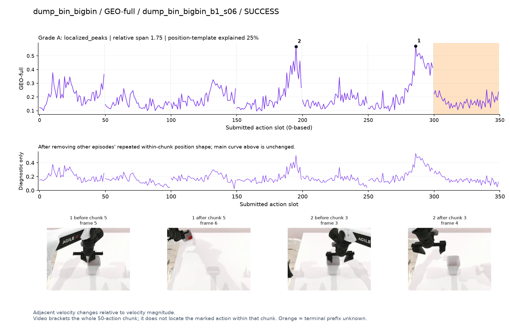
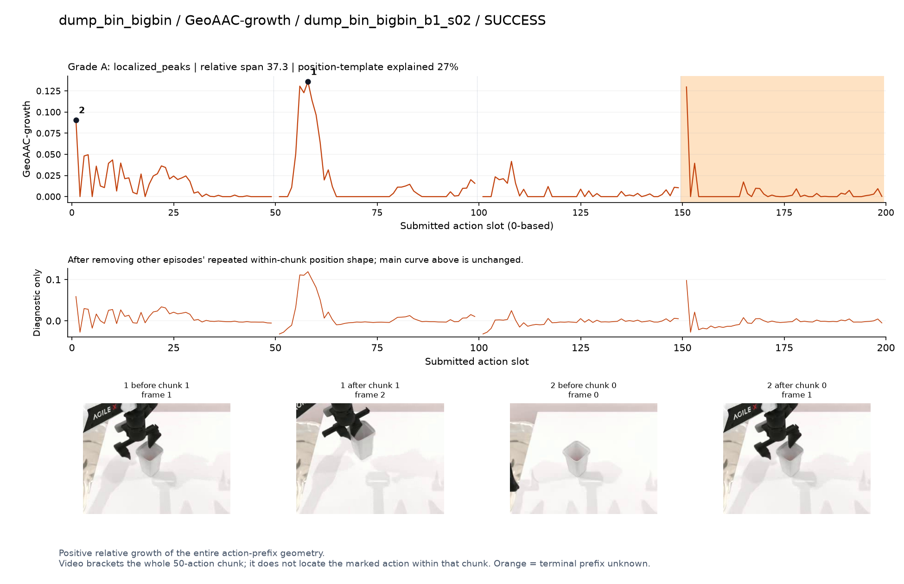
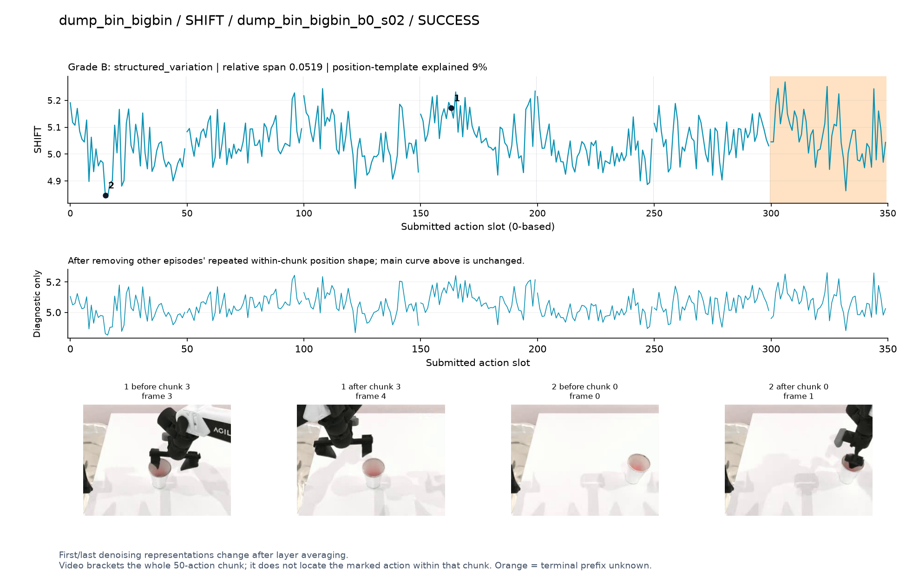
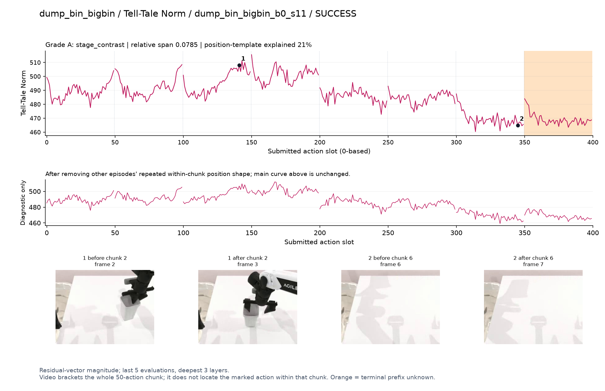
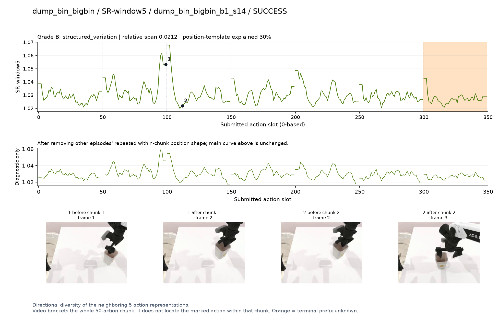
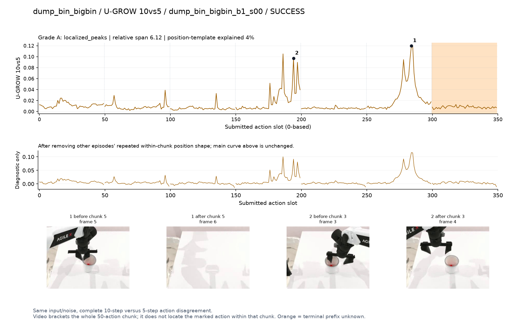

# dump_bin_bigbin

[全部任务](../README.md#全部任务) · [按信号看](../README.md#按信号看)

主图保留逐动作原始值；细虚线为chunk边界，橙色为终止段实际执行长度不明，未用于筛选。帧只对应chunk前后，不能精确定位某个h的接触瞬间。A/B/C是形态筛选等级，优先读人工备注。

## DV

**可解释候选**：候选：q1/q3抬起或放回小容器阶段出现两个峰；大垃圾桶部分出画。

轨迹 `dump_bin_bigbin_b1_s00`；成功；种子 `162803`；正式验收。

[PNG原图](../figures/dump_bin_bigbin/dv.png) · [SVG矢量图](../figures/dump_bin_bigbin/dv.svg) · [完整元数据](../entries/dump_bin_bigbin/dv.json)

对应帧：[1 before q3](../frames/dump_bin_bigbin/dump_bin_bigbin_b1_s00/f003.jpg) · [1 after q3](../frames/dump_bin_bigbin/dump_bin_bigbin_b1_s00/f004.jpg) · [2 before q1](../frames/dump_bin_bigbin/dump_bin_bigbin_b1_s00/f001.jpg) · [2 after q1](../frames/dump_bin_bigbin/dump_bin_bigbin_b1_s00/f002.jpg)

## Fresco-tail5

**较弱**：弱：逐动作抖动较密，未见可靠独立事件对应；全数据与噪声到最终动作距离高度相关。

轨迹 `dump_bin_bigbin_b1_s13`；成功；种子 `161902`；正式验收。

[PNG原图](../figures/dump_bin_bigbin/fresco.png) · [SVG矢量图](../figures/dump_bin_bigbin/fresco.svg) · [完整元数据](../entries/dump_bin_bigbin/fresco.json)

对应帧：[1 before q1](../frames/dump_bin_bigbin/dump_bin_bigbin_b1_s13/f001.jpg) · [1 after q1](../frames/dump_bin_bigbin/dump_bin_bigbin_b1_s13/f002.jpg) · [2 before q0](../frames/dump_bin_bigbin/dump_bin_bigbin_b1_s13/f000.jpg) · [2 after q0](../frames/dump_bin_bigbin/dump_bin_bigbin_b1_s13/f001.jpg)

## GEO-full

**可解释候选**：阶段候选：q3/q5手离开/回到容器附近，画面不足以精确确认倾倒。

轨迹 `dump_bin_bigbin_b1_s06`；成功；种子 `162900`；正式验收。

[PNG原图](../figures/dump_bin_bigbin/geo.png) · [SVG矢量图](../figures/dump_bin_bigbin/geo.svg) · [完整元数据](../entries/dump_bin_bigbin/geo.json)

对应帧：[1 before q5](../frames/dump_bin_bigbin/dump_bin_bigbin_b1_s06/f005.jpg) · [1 after q5](../frames/dump_bin_bigbin/dump_bin_bigbin_b1_s06/f006.jpg) · [2 before q3](../frames/dump_bin_bigbin/dump_bin_bigbin_b1_s06/f003.jpg) · [2 after q3](../frames/dump_bin_bigbin/dump_bin_bigbin_b1_s06/f004.jpg)

## GeoAAC-growth

**受其他因素影响**：谨慎：q1提起容器时增长峰，前缀开头也偏高。

轨迹 `dump_bin_bigbin_b1_s02`；成功；种子 `162500`；正式验收。

[PNG原图](../figures/dump_bin_bigbin/geoaac.png) · [SVG矢量图](../figures/dump_bin_bigbin/geoaac.svg) · [完整元数据](../entries/dump_bin_bigbin/geoaac.json)

对应帧：[1 before q1](../frames/dump_bin_bigbin/dump_bin_bigbin_b1_s02/f001.jpg) · [1 after q1](../frames/dump_bin_bigbin/dump_bin_bigbin_b1_s02/f002.jpg) · [2 before q0](../frames/dump_bin_bigbin/dump_bin_bigbin_b1_s02/f000.jpg) · [2 after q0](../frames/dump_bin_bigbin/dump_bin_bigbin_b1_s02/f001.jpg)

## SHIFT

**较弱**：弱：小幅抖动/阶段基线变化，未见可靠独立事件对应；路径长度混杂强。

轨迹 `dump_bin_bigbin_b0_s02`；成功；种子 `160900`；正式验收。

[PNG原图](../figures/dump_bin_bigbin/shift.png) · [SVG矢量图](../figures/dump_bin_bigbin/shift.svg) · [完整元数据](../entries/dump_bin_bigbin/shift.json)

对应帧：[1 before q3](../frames/dump_bin_bigbin/dump_bin_bigbin_b0_s02/f003.jpg) · [1 after q3](../frames/dump_bin_bigbin/dump_bin_bigbin_b0_s02/f004.jpg) · [2 before q0](../frames/dump_bin_bigbin/dump_bin_bigbin_b0_s02/f000.jpg) · [2 after q0](../frames/dump_bin_bigbin/dump_bin_bigbin_b0_s02/f001.jpg)

## Tell-Tale Norm

**阶段变化**：阶段差异：操作容器时较高，手离开视野后较低。

轨迹 `dump_bin_bigbin_b0_s11`；成功；种子 `160004`；正式验收。

[PNG原图](../figures/dump_bin_bigbin/norm.png) · [SVG矢量图](../figures/dump_bin_bigbin/norm.svg) · [完整元数据](../entries/dump_bin_bigbin/norm.json)

对应帧：[1 before q2](../frames/dump_bin_bigbin/dump_bin_bigbin_b0_s11/f002.jpg) · [1 after q2](../frames/dump_bin_bigbin/dump_bin_bigbin_b0_s11/f003.jpg) · [2 before q6](../frames/dump_bin_bigbin/dump_bin_bigbin_b0_s11/f006.jpg) · [2 after q6](../frames/dump_bin_bigbin/dump_bin_bigbin_b0_s11/f007.jpg)

## SR-window5

**较弱**：弱：多chunk边缘升高。

轨迹 `dump_bin_bigbin_b1_s14`；成功；种子 `162300`；正式验收。

[PNG原图](../figures/dump_bin_bigbin/sr.png) · [SVG矢量图](../figures/dump_bin_bigbin/sr.svg) · [完整元数据](../entries/dump_bin_bigbin/sr.json)

对应帧：[1 before q1](../frames/dump_bin_bigbin/dump_bin_bigbin_b1_s14/f001.jpg) · [1 after q1](../frames/dump_bin_bigbin/dump_bin_bigbin_b1_s14/f002.jpg) · [2 before q2](../frames/dump_bin_bigbin/dump_bin_bigbin_b1_s14/f002.jpg) · [2 after q2](../frames/dump_bin_bigbin/dump_bin_bigbin_b1_s14/f003.jpg)

## U-GROW 10vs5

**可解释候选**：候选：q3/q5容器操作附近两个局部高区。

轨迹 `dump_bin_bigbin_b1_s00`；成功；种子 `162803`；正式验收。

[PNG原图](../figures/dump_bin_bigbin/ugrow.png) · [SVG矢量图](../figures/dump_bin_bigbin/ugrow.svg) · [完整元数据](../entries/dump_bin_bigbin/ugrow.json)

对应帧：[1 before q5](../frames/dump_bin_bigbin/dump_bin_bigbin_b1_s00/f005.jpg) · [1 after q5](../frames/dump_bin_bigbin/dump_bin_bigbin_b1_s00/f006.jpg) · [2 before q3](../frames/dump_bin_bigbin/dump_bin_bigbin_b1_s00/f003.jpg) · [2 after q3](../frames/dump_bin_bigbin/dump_bin_bigbin_b1_s00/f004.jpg)
