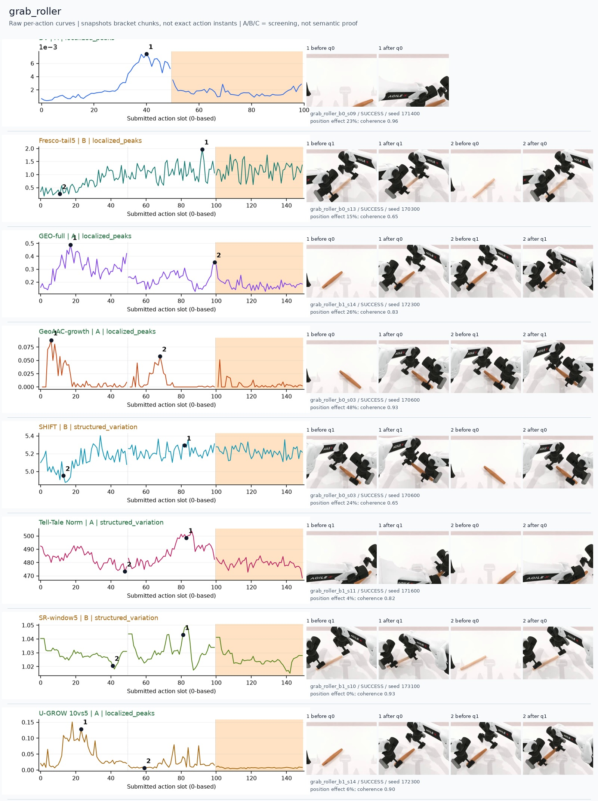
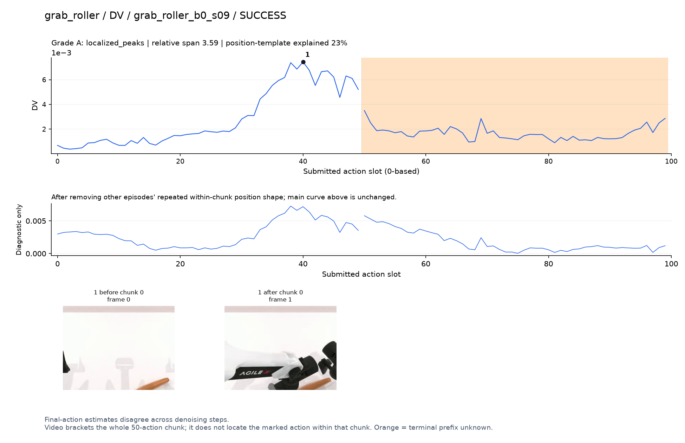
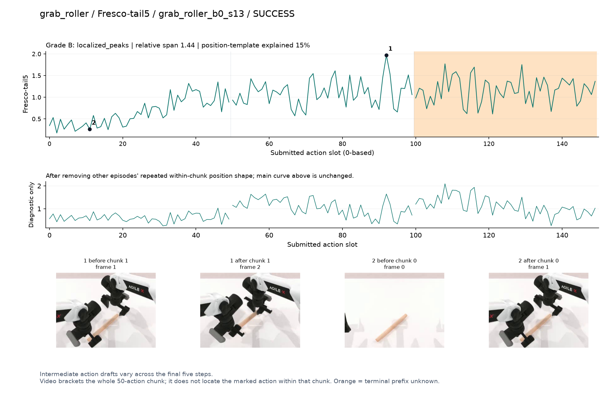
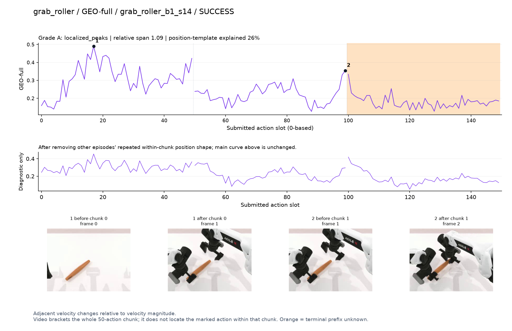
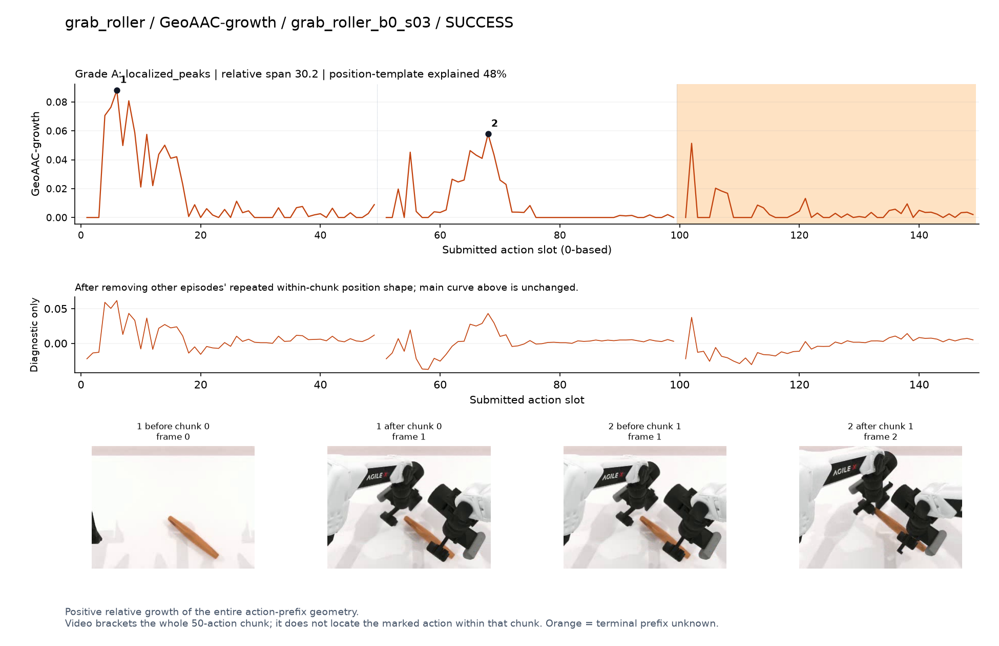
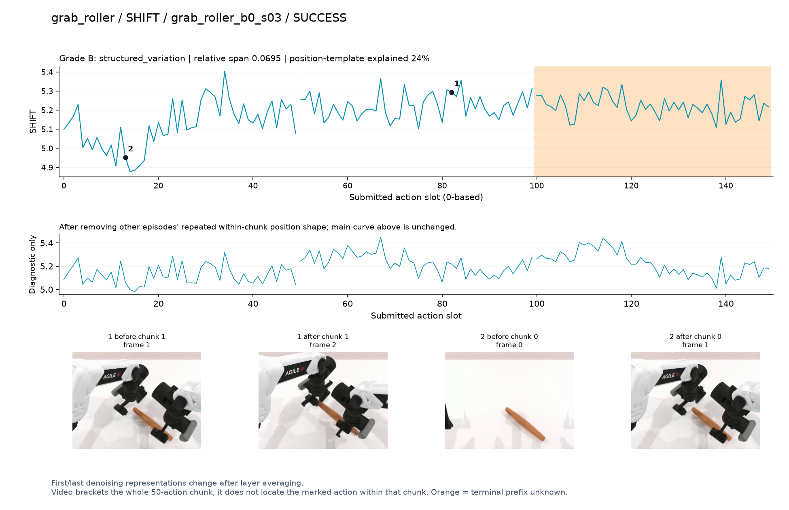
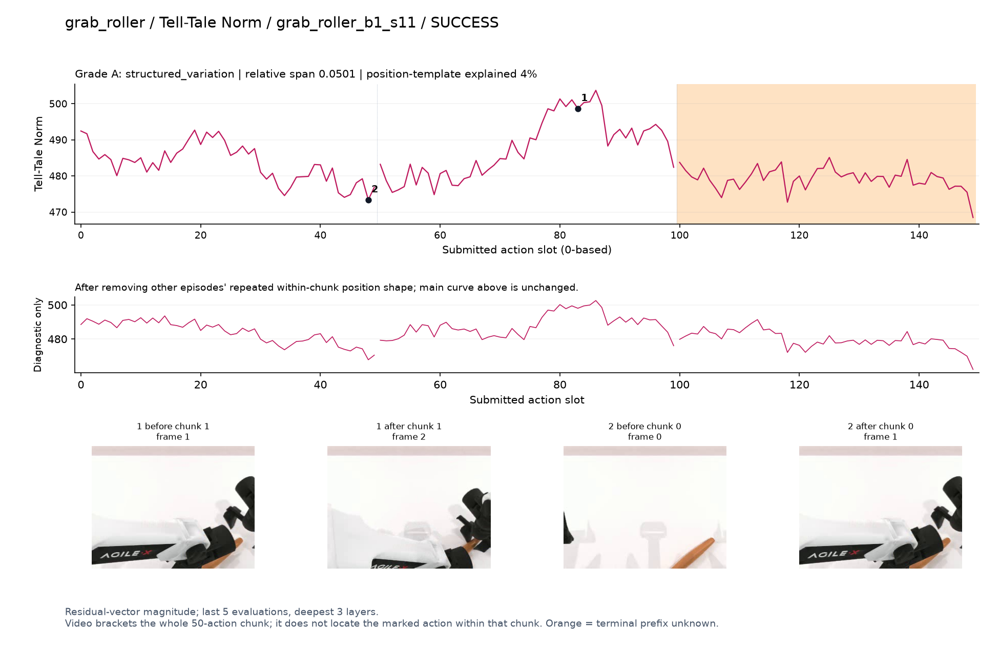
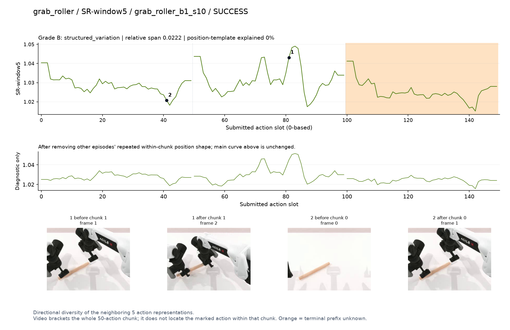
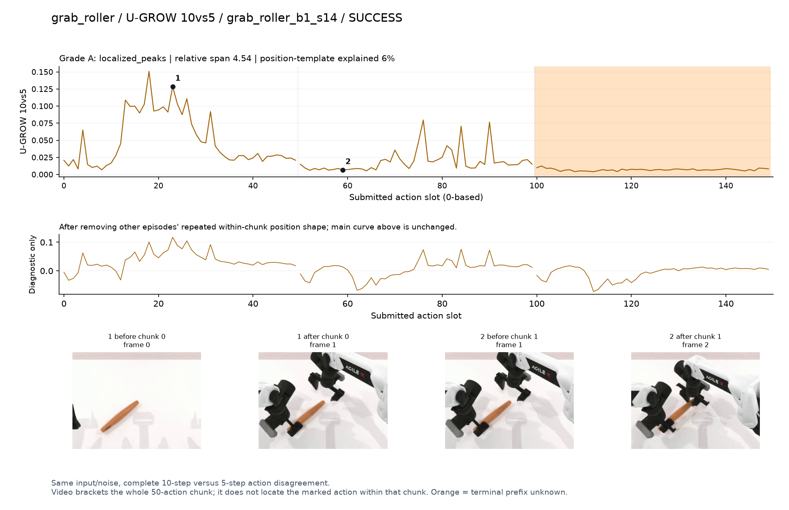

# grab_roller

[全部任务](../README.md#全部任务) · [按信号看](../README.md#按信号看)

主图保留逐动作原始值；细虚线为chunk边界，橙色为终止段实际执行长度不明，未用于筛选。帧只对应chunk前后，不能精确定位某个h的接触瞬间。A/B/C是形态筛选等级，优先读人工备注。

## DV

**可解释候选**：候选：q0双手接近滚筒的后半段升高。

轨迹 `grab_roller_b0_s09`；成功；种子 `171400`；正式验收。

[PNG原图](../figures/grab_roller/dv.png) · [SVG矢量图](../figures/grab_roller/dv.svg) · [完整元数据](../entries/grab_roller/dv.json)

对应帧：[1 before q0](../frames/grab_roller/grab_roller_b0_s09/f000.jpg) · [1 after q0](../frames/grab_roller/grab_roller_b0_s09/f001.jpg)

## Fresco-tail5

**较弱**：弱阶段趋势：接近后幅度上升但抖动密集，生成路径长度混杂强。

轨迹 `grab_roller_b0_s13`；成功；种子 `170300`；正式验收。

[PNG原图](../figures/grab_roller/fresco.png) · [SVG矢量图](../figures/grab_roller/fresco.svg) · [完整元数据](../entries/grab_roller/fresco.json)

对应帧：[1 before q1](../frames/grab_roller/grab_roller_b0_s13/f001.jpg) · [1 after q1](../frames/grab_roller/grab_roller_b0_s13/f002.jpg) · [2 before q0](../frames/grab_roller/grab_roller_b0_s13/f000.jpg) · [2 after q0](../frames/grab_roller/grab_roller_b0_s13/f001.jpg)

## GEO-full

**可解释候选**：候选：q0双手展开并接近滚筒时较高，后续下降。

轨迹 `grab_roller_b1_s14`；成功；种子 `172300`；正式验收。

[PNG原图](../figures/grab_roller/geo.png) · [SVG矢量图](../figures/grab_roller/geo.svg) · [完整元数据](../entries/grab_roller/geo.json)

对应帧：[1 before q0](../frames/grab_roller/grab_roller_b1_s14/f000.jpg) · [1 after q0](../frames/grab_roller/grab_roller_b1_s14/f001.jpg) · [2 before q1](../frames/grab_roller/grab_roller_b1_s14/f001.jpg) · [2 after q1](../frames/grab_roller/grab_roller_b1_s14/f002.jpg)

## GeoAAC-growth

**受其他因素影响**：谨慎：接近和夹取各有增长区，但chunk位置效应强。

轨迹 `grab_roller_b0_s03`；成功；种子 `170600`；正式验收。

[PNG原图](../figures/grab_roller/geoaac.png) · [SVG矢量图](../figures/grab_roller/geoaac.svg) · [完整元数据](../entries/grab_roller/geoaac.json)

对应帧：[1 before q0](../frames/grab_roller/grab_roller_b0_s03/f000.jpg) · [1 after q0](../frames/grab_roller/grab_roller_b0_s03/f001.jpg) · [2 before q1](../frames/grab_roller/grab_roller_b0_s03/f001.jpg) · [2 after q1](../frames/grab_roller/grab_roller_b0_s03/f002.jpg)

## SHIFT

**较弱**：弱阶段趋势：接近后略抬高但抖动密集，路径长度混杂强。

轨迹 `grab_roller_b0_s03`；成功；种子 `170600`；正式验收。

[PNG原图](../figures/grab_roller/shift.png) · [SVG矢量图](../figures/grab_roller/shift.svg) · [完整元数据](../entries/grab_roller/shift.json)

对应帧：[1 before q1](../frames/grab_roller/grab_roller_b0_s03/f001.jpg) · [1 after q1](../frames/grab_roller/grab_roller_b0_s03/f002.jpg) · [2 before q0](../frames/grab_roller/grab_roller_b0_s03/f000.jpg) · [2 after q0](../frames/grab_roller/grab_roller_b0_s03/f001.jpg)

## Tell-Tale Norm

**可解释候选**：阶段候选：q1双手贴近/夹取附近幅度变化；画面边缘遮挡。

轨迹 `grab_roller_b1_s11`；成功；种子 `171600`；正式验收。

[PNG原图](../figures/grab_roller/norm.png) · [SVG矢量图](../figures/grab_roller/norm.svg) · [完整元数据](../entries/grab_roller/norm.json)

对应帧：[1 before q1](../frames/grab_roller/grab_roller_b1_s11/f001.jpg) · [1 after q1](../frames/grab_roller/grab_roller_b1_s11/f002.jpg) · [2 before q0](../frames/grab_roller/grab_roller_b1_s11/f000.jpg) · [2 after q0](../frames/grab_roller/grab_roller_b1_s11/f001.jpg)

## SR-window5

**较弱**：弱：小幅多峰，chunk位置模板较强。

轨迹 `grab_roller_b1_s10`；成功；种子 `173100`；正式验收。

[PNG原图](../figures/grab_roller/sr.png) · [SVG矢量图](../figures/grab_roller/sr.svg) · [完整元数据](../entries/grab_roller/sr.json)

对应帧：[1 before q1](../frames/grab_roller/grab_roller_b1_s10/f001.jpg) · [1 after q1](../frames/grab_roller/grab_roller_b1_s10/f002.jpg) · [2 before q0](../frames/grab_roller/grab_roller_b1_s10/f000.jpg) · [2 after q0](../frames/grab_roller/grab_roller_b1_s10/f001.jpg)

## U-GROW 10vs5

**可解释候选**：候选：q0双手接近滚筒时集中高区。

轨迹 `grab_roller_b1_s14`；成功；种子 `172300`；正式验收。

[PNG原图](../figures/grab_roller/ugrow.png) · [SVG矢量图](../figures/grab_roller/ugrow.svg) · [完整元数据](../entries/grab_roller/ugrow.json)

对应帧：[1 before q0](../frames/grab_roller/grab_roller_b1_s14/f000.jpg) · [1 after q0](../frames/grab_roller/grab_roller_b1_s14/f001.jpg) · [2 before q1](../frames/grab_roller/grab_roller_b1_s14/f001.jpg) · [2 after q1](../frames/grab_roller/grab_roller_b1_s14/f002.jpg)
