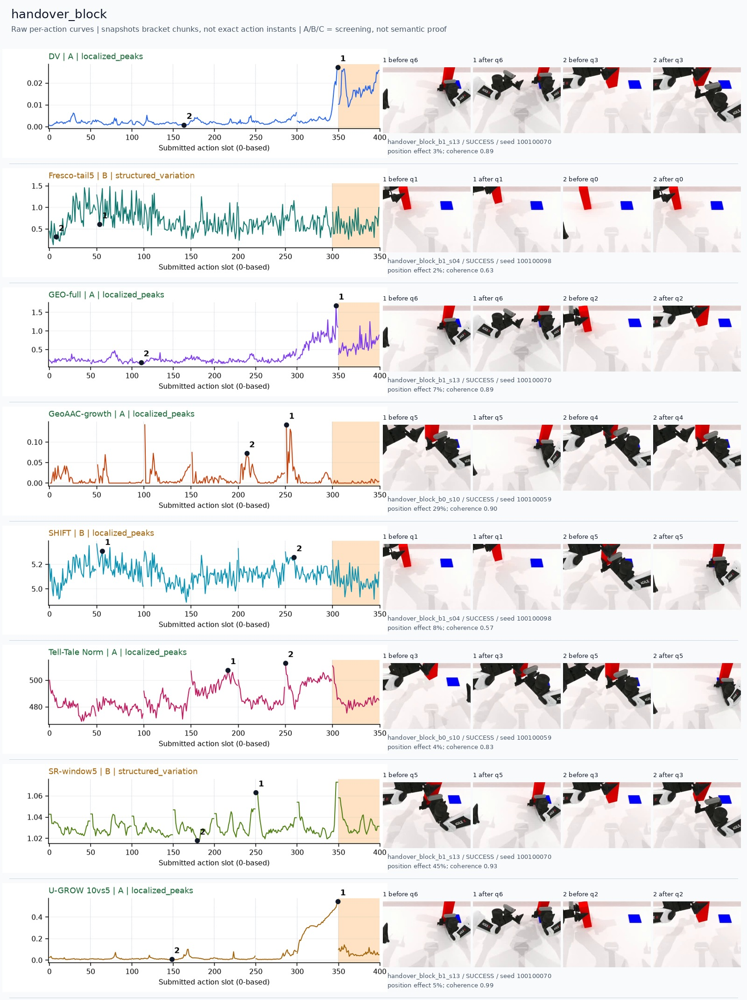
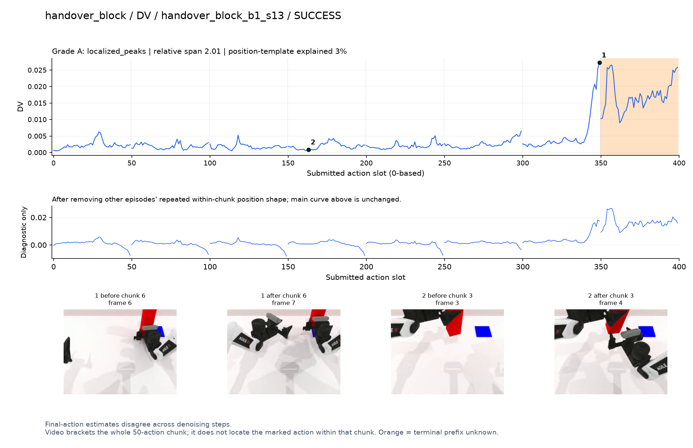
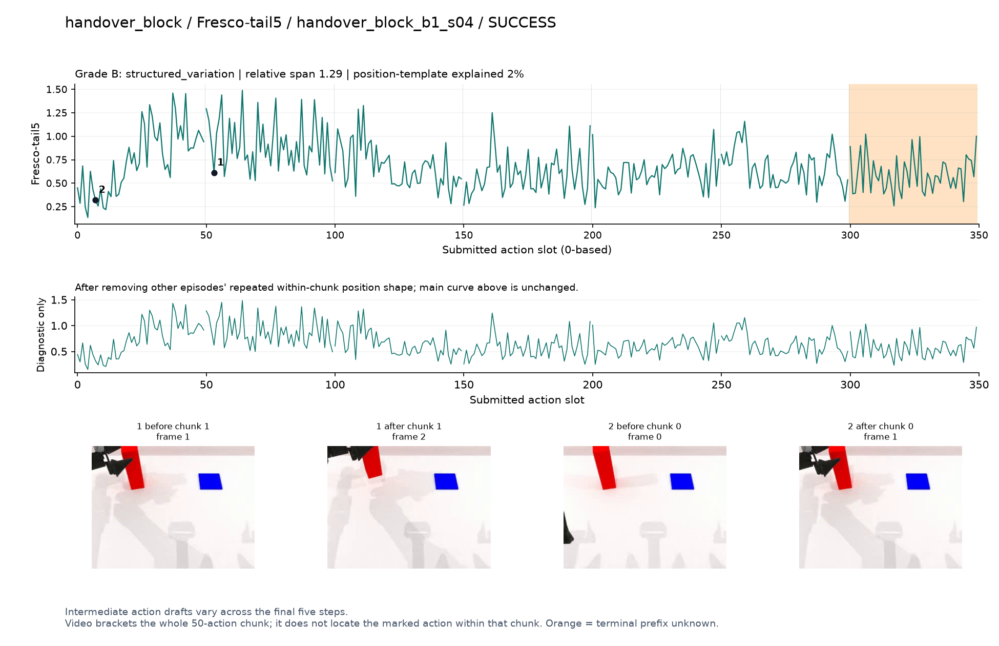
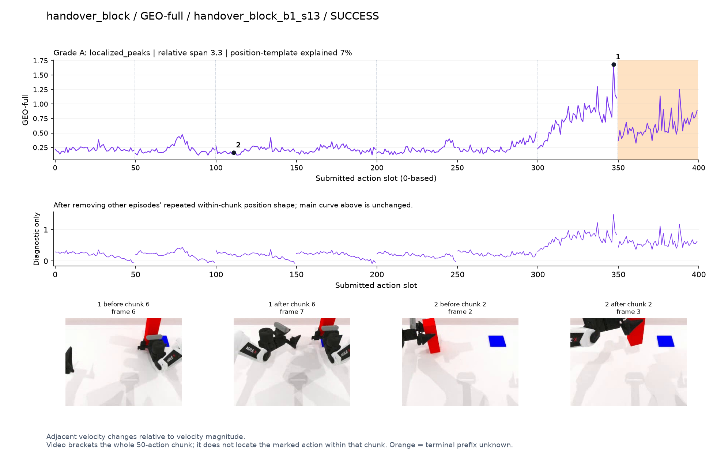
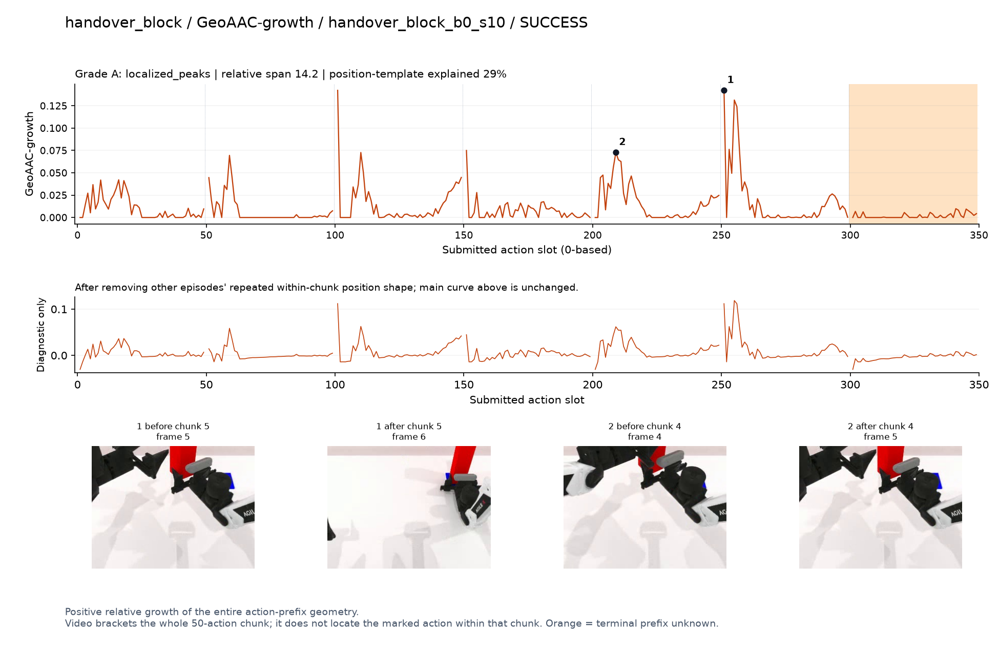
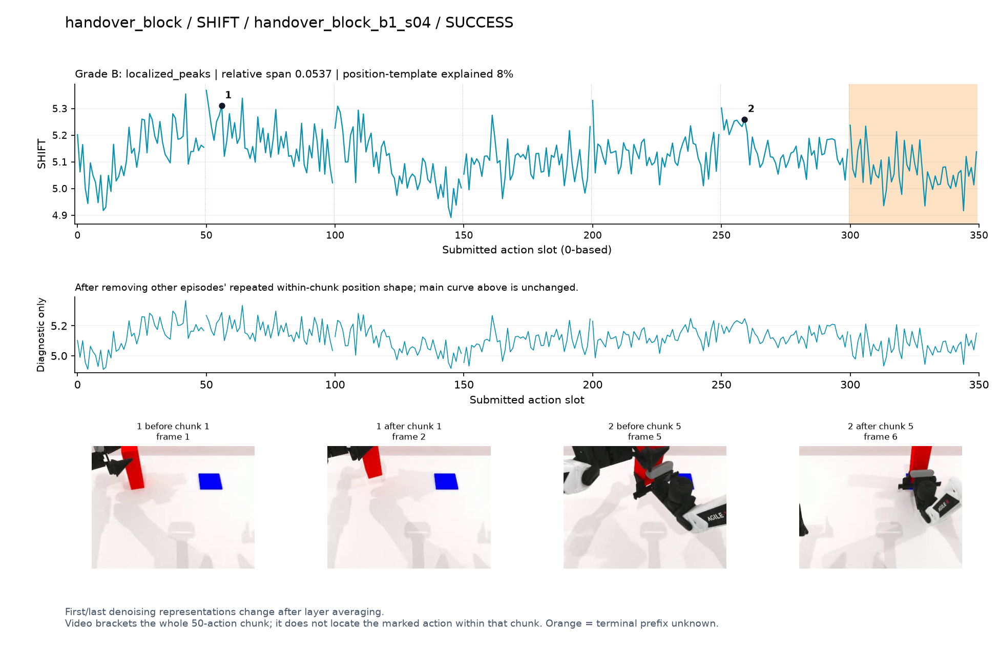
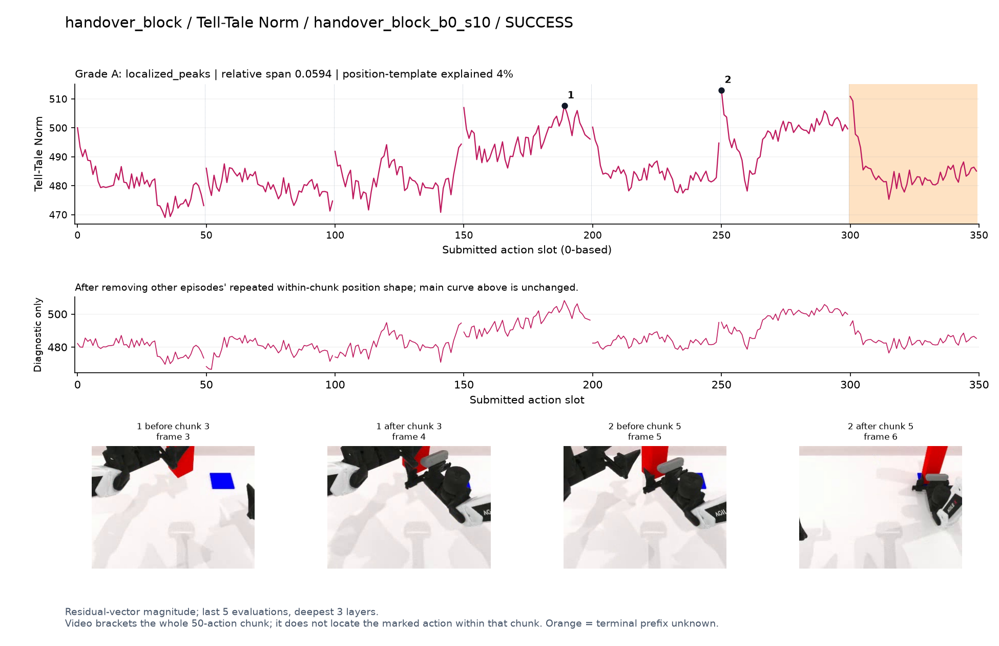
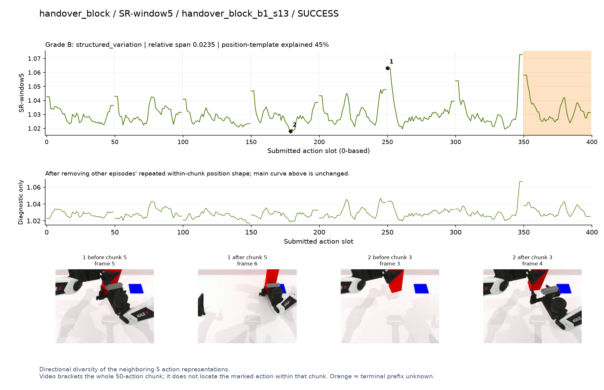
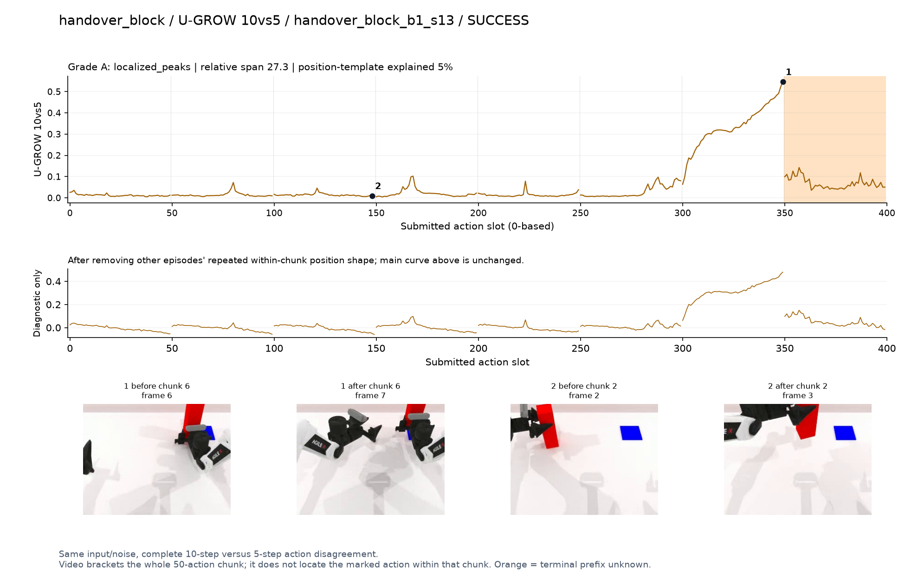

# handover_block

[全部任务](../README.md#全部任务) · [按信号看](../README.md#按信号看)

主图保留逐动作原始值；细虚线为chunk边界，橙色为终止段实际执行长度不明，未用于筛选。帧只对应chunk前后，不能精确定位某个h的接触瞬间。A/B/C是形态筛选等级，优先读人工备注。

## DV

**可解释候选**：候选：q6两只夹爪在持块区域相遇前升高；终止后高值单独标橙。

轨迹 `handover_block_b1_s13`；成功；种子 `100100070`；正式验收。

[PNG原图](../figures/handover_block/dv.png) · [SVG矢量图](../figures/handover_block/dv.svg) · [完整元数据](../entries/handover_block/dv.json)

对应帧：[1 before q6](../frames/handover_block/handover_block_b1_s13/f006.jpg) · [1 after q6](../frames/handover_block/handover_block_b1_s13/f007.jpg) · [2 before q3](../frames/handover_block/handover_block_b1_s13/f003.jpg) · [2 after q3](../frames/handover_block/handover_block_b1_s13/f004.jpg)

## Fresco-tail5

**较弱**：弱：逐动作抖动较密，未见可靠独立事件对应；全数据与噪声到最终动作距离高度相关。

轨迹 `handover_block_b1_s04`；成功；种子 `100100098`；正式验收。

[PNG原图](../figures/handover_block/fresco.png) · [SVG矢量图](../figures/handover_block/fresco.svg) · [完整元数据](../entries/handover_block/fresco.json)

对应帧：[1 before q1](../frames/handover_block/handover_block_b1_s04/f001.jpg) · [1 after q1](../frames/handover_block/handover_block_b1_s04/f002.jpg) · [2 before q0](../frames/handover_block/handover_block_b1_s04/f000.jpg) · [2 after q0](../frames/handover_block/handover_block_b1_s04/f001.jpg)

## GEO-full

**可解释候选**：候选：同轨迹q6交接接近段升高。

轨迹 `handover_block_b1_s13`；成功；种子 `100100070`；正式验收。

[PNG原图](../figures/handover_block/geo.png) · [SVG矢量图](../figures/handover_block/geo.svg) · [完整元数据](../entries/handover_block/geo.json)

对应帧：[1 before q6](../frames/handover_block/handover_block_b1_s13/f006.jpg) · [1 after q6](../frames/handover_block/handover_block_b1_s13/f007.jpg) · [2 before q2](../frames/handover_block/handover_block_b1_s13/f002.jpg) · [2 after q2](../frames/handover_block/handover_block_b1_s13/f003.jpg)

## GeoAAC-growth

**受其他因素影响**：谨慎：q4/q5交接准备有增长峰，但夹杂多次chunk前段尖峰。

轨迹 `handover_block_b0_s10`；成功；种子 `100100059`；正式验收。

[PNG原图](../figures/handover_block/geoaac.png) · [SVG矢量图](../figures/handover_block/geoaac.svg) · [完整元数据](../entries/handover_block/geoaac.json)

对应帧：[1 before q5](../frames/handover_block/handover_block_b0_s10/f005.jpg) · [1 after q5](../frames/handover_block/handover_block_b0_s10/f006.jpg) · [2 before q4](../frames/handover_block/handover_block_b0_s10/f004.jpg) · [2 after q4](../frames/handover_block/handover_block_b0_s10/f005.jpg)

## SHIFT

**较弱**：弱：小幅抖动/阶段基线变化，未见可靠独立事件对应；路径长度混杂强。

轨迹 `handover_block_b1_s04`；成功；种子 `100100098`；正式验收。

[PNG原图](../figures/handover_block/shift.png) · [SVG矢量图](../figures/handover_block/shift.svg) · [完整元数据](../entries/handover_block/shift.json)

对应帧：[1 before q1](../frames/handover_block/handover_block_b1_s04/f001.jpg) · [1 after q1](../frames/handover_block/handover_block_b1_s04/f002.jpg) · [2 before q5](../frames/handover_block/handover_block_b1_s04/f005.jpg) · [2 after q5](../frames/handover_block/handover_block_b1_s04/f006.jpg)

## Tell-Tale Norm

**可解释候选**：阶段候选：q3靠近接物位置和q5两手接近均形成高区。

轨迹 `handover_block_b0_s10`；成功；种子 `100100059`；正式验收。

[PNG原图](../figures/handover_block/norm.png) · [SVG矢量图](../figures/handover_block/norm.svg) · [完整元数据](../entries/handover_block/norm.json)

对应帧：[1 before q3](../frames/handover_block/handover_block_b0_s10/f003.jpg) · [1 after q3](../frames/handover_block/handover_block_b0_s10/f004.jpg) · [2 before q5](../frames/handover_block/handover_block_b0_s10/f005.jpg) · [2 after q5](../frames/handover_block/handover_block_b0_s10/f006.jpg)

## SR-window5

**较弱**：弱：多chunk边界重复上升。

轨迹 `handover_block_b1_s13`；成功；种子 `100100070`；正式验收。

[PNG原图](../figures/handover_block/sr.png) · [SVG矢量图](../figures/handover_block/sr.svg) · [完整元数据](../entries/handover_block/sr.json)

对应帧：[1 before q5](../frames/handover_block/handover_block_b1_s13/f005.jpg) · [1 after q5](../frames/handover_block/handover_block_b1_s13/f006.jpg) · [2 before q3](../frames/handover_block/handover_block_b1_s13/f003.jpg) · [2 after q3](../frames/handover_block/handover_block_b1_s13/f004.jpg)

## U-GROW 10vs5

**可解释候选**：候选：同轨迹q6两手交接接近段持续强升高。

轨迹 `handover_block_b1_s13`；成功；种子 `100100070`；正式验收。

[PNG原图](../figures/handover_block/ugrow.png) · [SVG矢量图](../figures/handover_block/ugrow.svg) · [完整元数据](../entries/handover_block/ugrow.json)

对应帧：[1 before q6](../frames/handover_block/handover_block_b1_s13/f006.jpg) · [1 after q6](../frames/handover_block/handover_block_b1_s13/f007.jpg) · [2 before q2](../frames/handover_block/handover_block_b1_s13/f002.jpg) · [2 after q2](../frames/handover_block/handover_block_b1_s13/f003.jpg)
