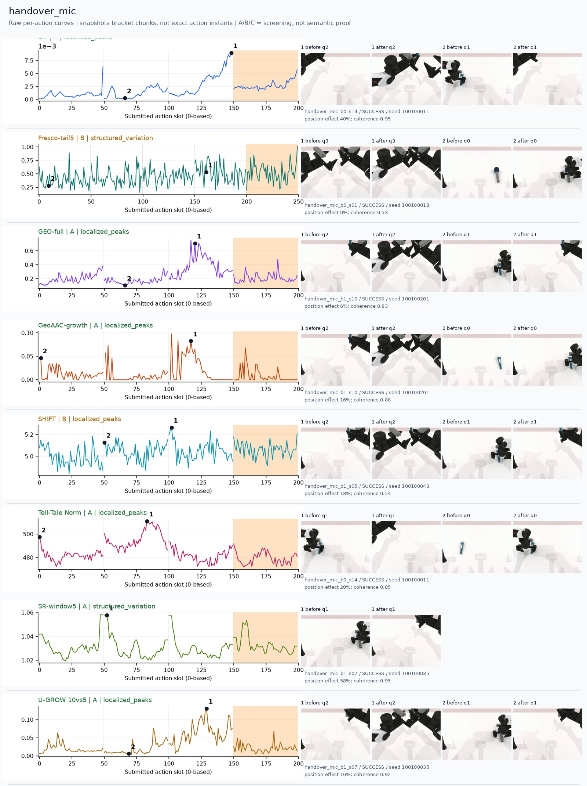
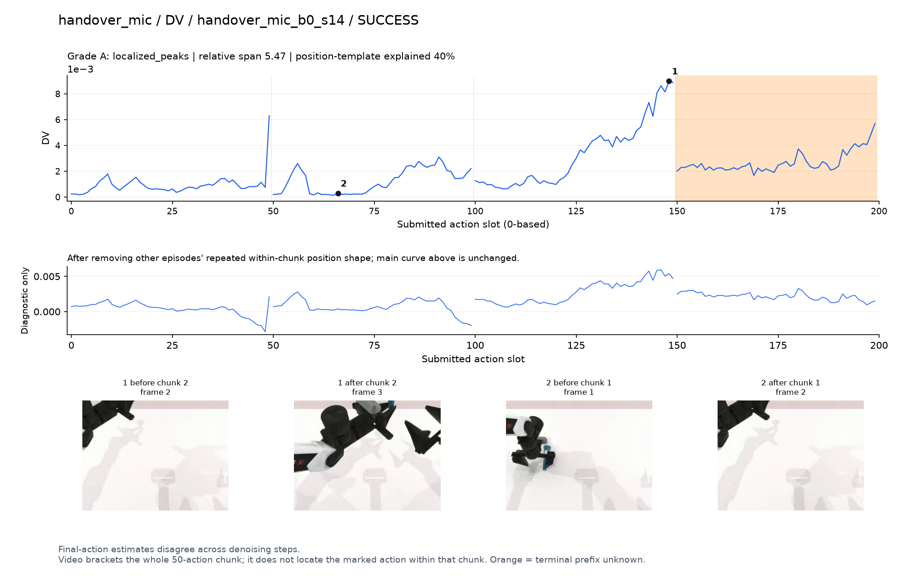
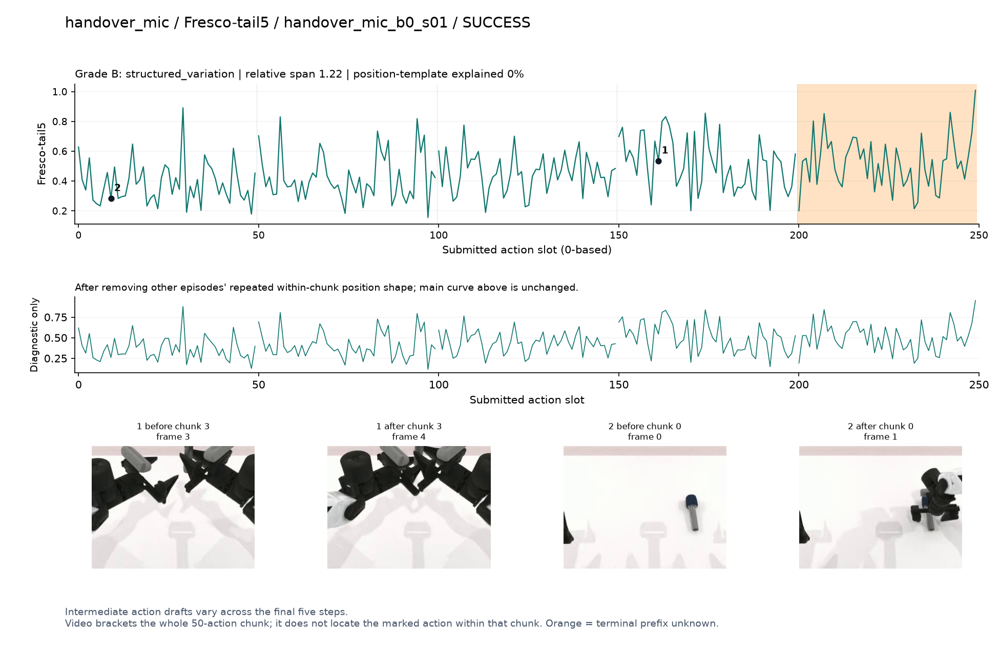
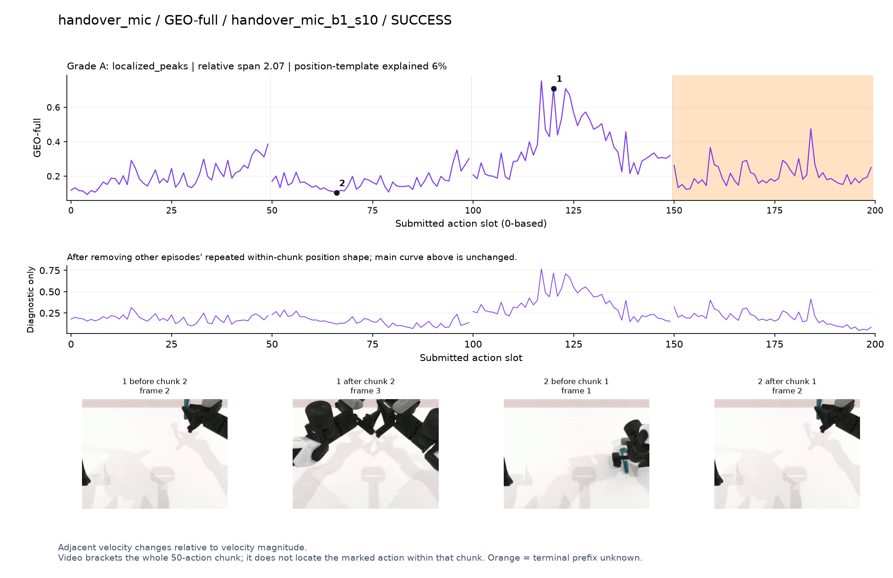
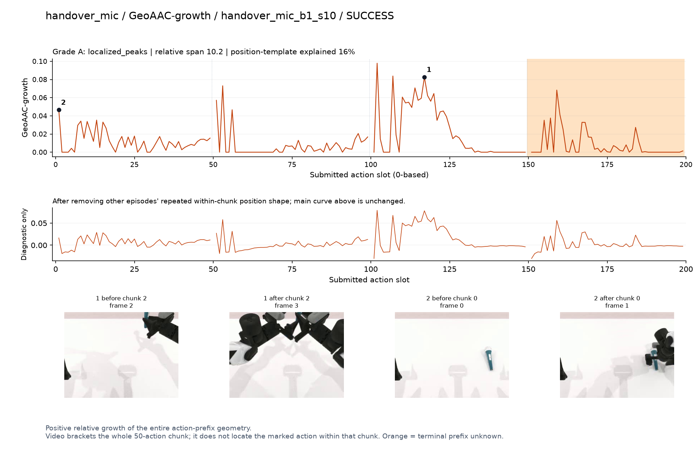
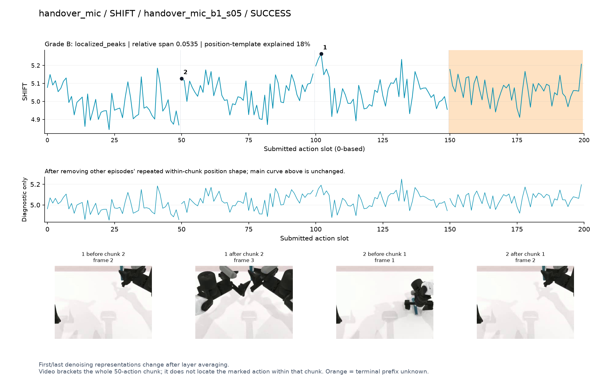
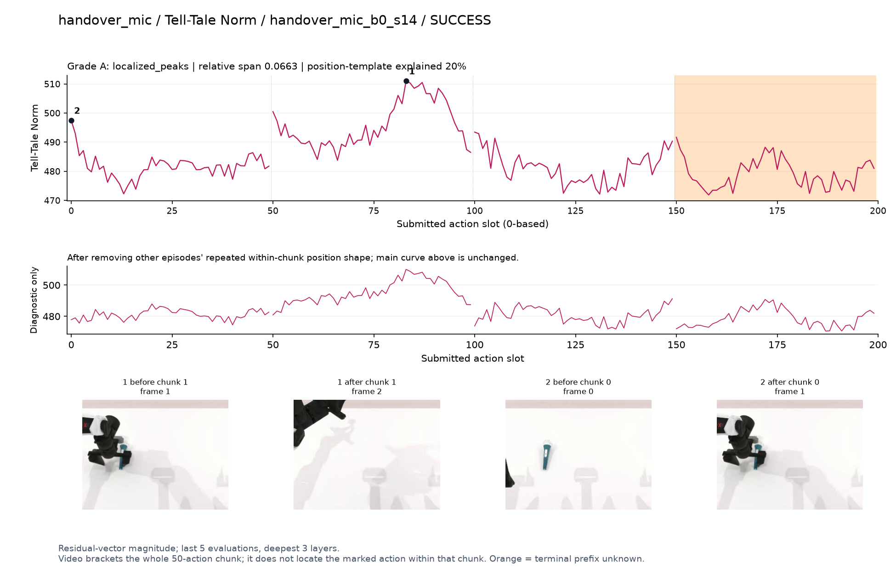
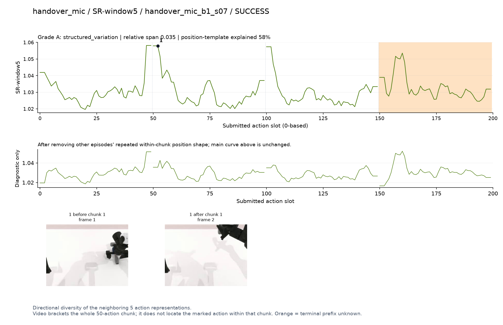
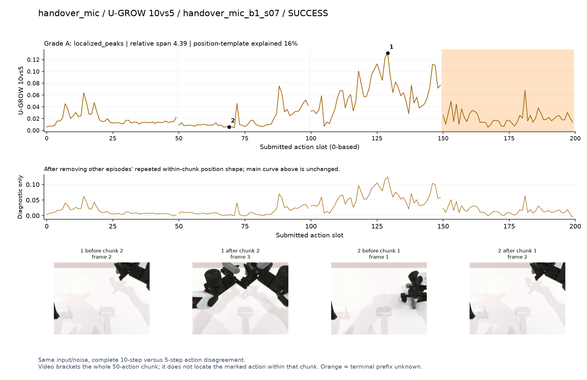

# handover_mic

[全部任务](../README.md#全部任务) · [按信号看](../README.md#按信号看)

主图保留逐动作原始值；细虚线为chunk边界，橙色为终止段实际执行长度不明，未用于筛选。帧只对应chunk前后，不能精确定位某个h的接触瞬间。A/B/C是形态筛选等级，优先读人工备注。

## DV

**可解释候选**：候选：q2两手接近并交接麦克风时升高。

轨迹 `handover_mic_b0_s14`；成功；种子 `100100011`；正式验收。

[PNG原图](../figures/handover_mic/dv.png) · [SVG矢量图](../figures/handover_mic/dv.svg) · [完整元数据](../entries/handover_mic/dv.json)

对应帧：[1 before q2](../frames/handover_mic/handover_mic_b0_s14/f002.jpg) · [1 after q2](../frames/handover_mic/handover_mic_b0_s14/f003.jpg) · [2 before q1](../frames/handover_mic/handover_mic_b0_s14/f001.jpg) · [2 after q1](../frames/handover_mic/handover_mic_b0_s14/f002.jpg)

## Fresco-tail5

**较弱**：弱：逐动作抖动较密，未见可靠独立事件对应；全数据与噪声到最终动作距离高度相关。

轨迹 `handover_mic_b0_s01`；成功；种子 `100100018`；正式验收。

[PNG原图](../figures/handover_mic/fresco.png) · [SVG矢量图](../figures/handover_mic/fresco.svg) · [完整元数据](../entries/handover_mic/fresco.json)

对应帧：[1 before q3](../frames/handover_mic/handover_mic_b0_s01/f003.jpg) · [1 after q3](../frames/handover_mic/handover_mic_b0_s01/f004.jpg) · [2 before q0](../frames/handover_mic/handover_mic_b0_s01/f000.jpg) · [2 after q0](../frames/handover_mic/handover_mic_b0_s01/f001.jpg)

## GEO-full

**可解释候选**：候选：q2两手相遇段出现主峰，q1搬运段较低。

轨迹 `handover_mic_b1_s10`；成功；种子 `100100201`；正式验收。

[PNG原图](../figures/handover_mic/geo.png) · [SVG矢量图](../figures/handover_mic/geo.svg) · [完整元数据](../entries/handover_mic/geo.json)

对应帧：[1 before q2](../frames/handover_mic/handover_mic_b1_s10/f002.jpg) · [1 after q2](../frames/handover_mic/handover_mic_b1_s10/f003.jpg) · [2 before q1](../frames/handover_mic/handover_mic_b1_s10/f001.jpg) · [2 after q1](../frames/handover_mic/handover_mic_b1_s10/f002.jpg)

## GeoAAC-growth

**可解释候选**：阶段候选：q2交接动作前缀增长较大，需保留前缀含义。

轨迹 `handover_mic_b1_s10`；成功；种子 `100100201`；正式验收。

[PNG原图](../figures/handover_mic/geoaac.png) · [SVG矢量图](../figures/handover_mic/geoaac.svg) · [完整元数据](../entries/handover_mic/geoaac.json)

对应帧：[1 before q2](../frames/handover_mic/handover_mic_b1_s10/f002.jpg) · [1 after q2](../frames/handover_mic/handover_mic_b1_s10/f003.jpg) · [2 before q0](../frames/handover_mic/handover_mic_b1_s10/f000.jpg) · [2 after q0](../frames/handover_mic/handover_mic_b1_s10/f001.jpg)

## SHIFT

**较弱**：弱：小幅抖动/阶段基线变化，未见可靠独立事件对应；路径长度混杂强。

轨迹 `handover_mic_b1_s05`；成功；种子 `100100043`；正式验收。

[PNG原图](../figures/handover_mic/shift.png) · [SVG矢量图](../figures/handover_mic/shift.svg) · [完整元数据](../entries/handover_mic/shift.json)

对应帧：[1 before q2](../frames/handover_mic/handover_mic_b1_s05/f002.jpg) · [1 after q2](../frames/handover_mic/handover_mic_b1_s05/f003.jpg) · [2 before q1](../frames/handover_mic/handover_mic_b1_s05/f001.jpg) · [2 after q1](../frames/handover_mic/handover_mic_b1_s05/f002.jpg)

## Tell-Tale Norm

**可解释候选**：阶段候选：q1抓起后搬运时形成宽峰，q2交接并非最高。

轨迹 `handover_mic_b0_s14`；成功；种子 `100100011`；正式验收。

[PNG原图](../figures/handover_mic/norm.png) · [SVG矢量图](../figures/handover_mic/norm.svg) · [完整元数据](../entries/handover_mic/norm.json)

对应帧：[1 before q1](../frames/handover_mic/handover_mic_b0_s14/f001.jpg) · [1 after q1](../frames/handover_mic/handover_mic_b0_s14/f002.jpg) · [2 before q0](../frames/handover_mic/handover_mic_b0_s14/f000.jpg) · [2 after q0](../frames/handover_mic/handover_mic_b0_s14/f001.jpg)

## SR-window5

**较弱**：弱：每chunk端点反复升高，58%位置模板效应。

轨迹 `handover_mic_b1_s07`；成功；种子 `100100035`；正式验收。

[PNG原图](../figures/handover_mic/sr.png) · [SVG矢量图](../figures/handover_mic/sr.svg) · [完整元数据](../entries/handover_mic/sr.json)

对应帧：[1 before q1](../frames/handover_mic/handover_mic_b1_s07/f001.jpg) · [1 after q1](../frames/handover_mic/handover_mic_b1_s07/f002.jpg)

## U-GROW 10vs5

**可解释候选**：候选：q2两手接近时持续高区，q1较低。

轨迹 `handover_mic_b1_s07`；成功；种子 `100100035`；正式验收。

[PNG原图](../figures/handover_mic/ugrow.png) · [SVG矢量图](../figures/handover_mic/ugrow.svg) · [完整元数据](../entries/handover_mic/ugrow.json)

对应帧：[1 before q2](../frames/handover_mic/handover_mic_b1_s07/f002.jpg) · [1 after q2](../frames/handover_mic/handover_mic_b1_s07/f003.jpg) · [2 before q1](../frames/handover_mic/handover_mic_b1_s07/f001.jpg) · [2 after q1](../frames/handover_mic/handover_mic_b1_s07/f002.jpg)
