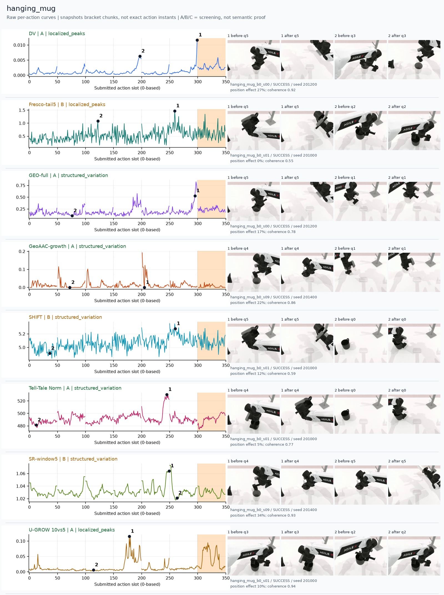
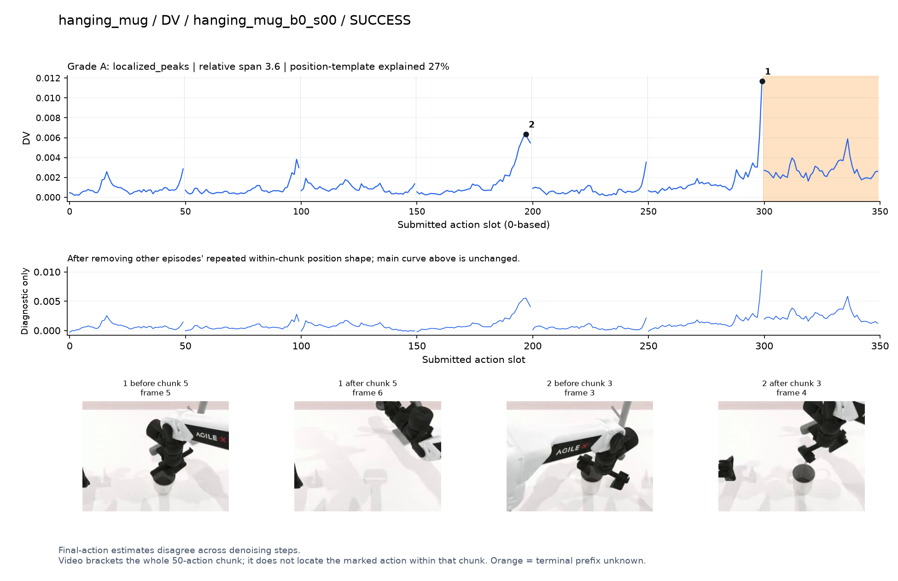
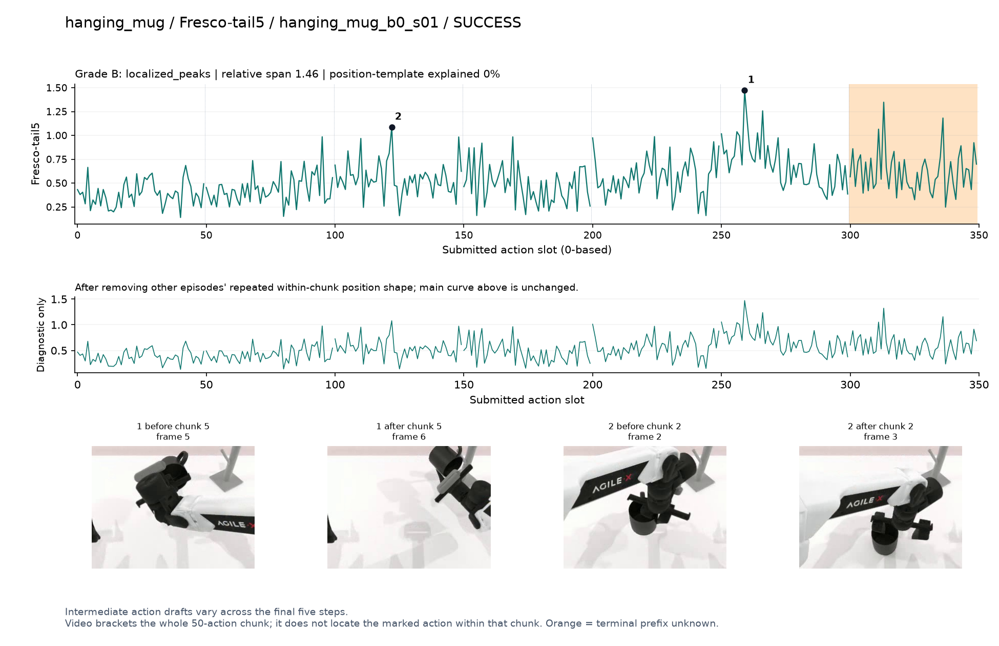
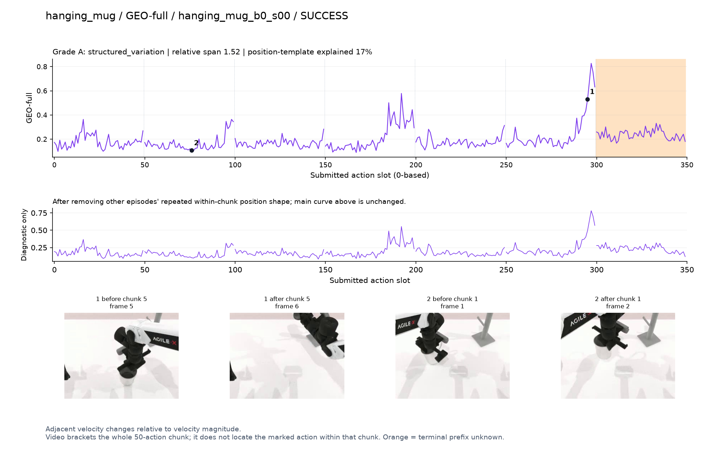
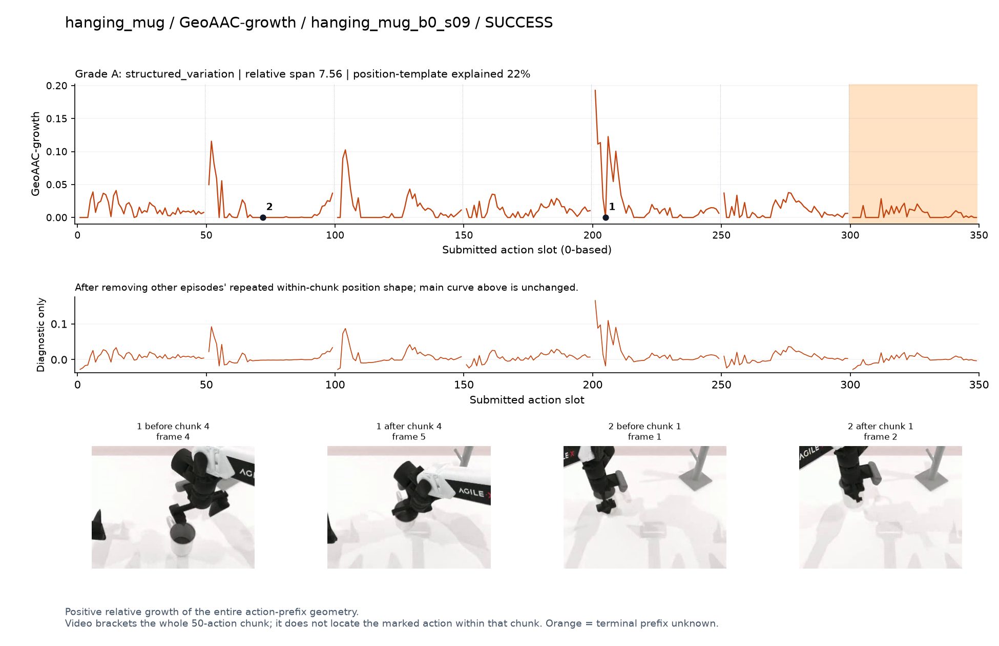
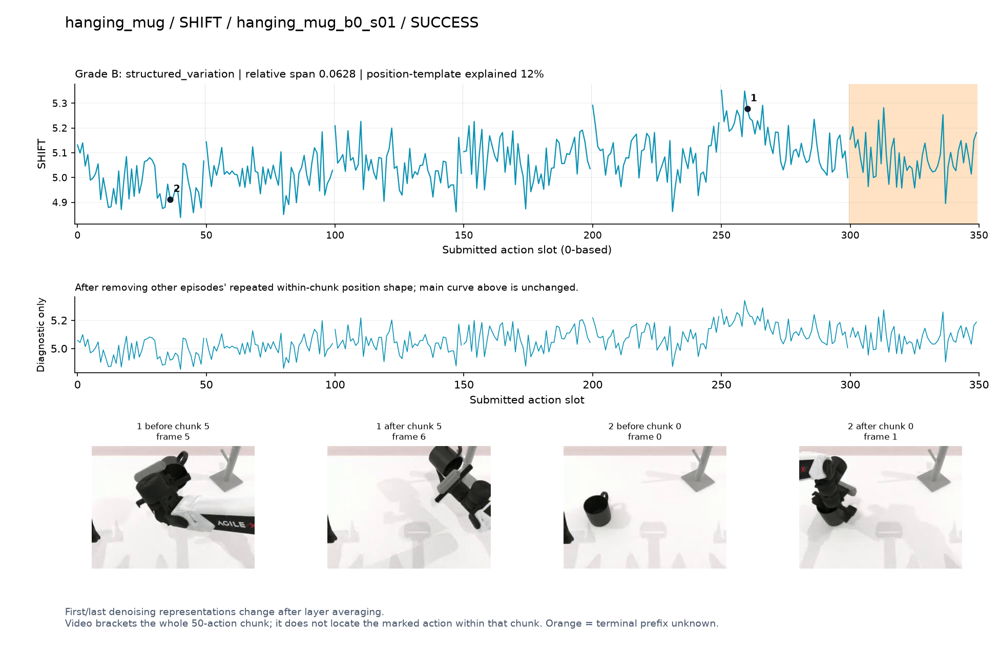
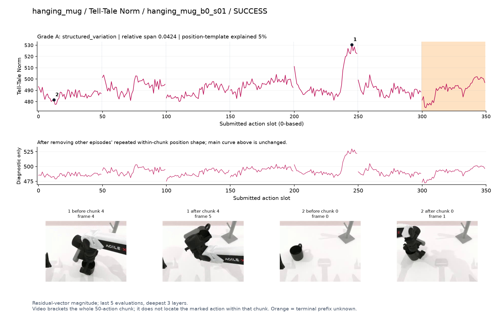
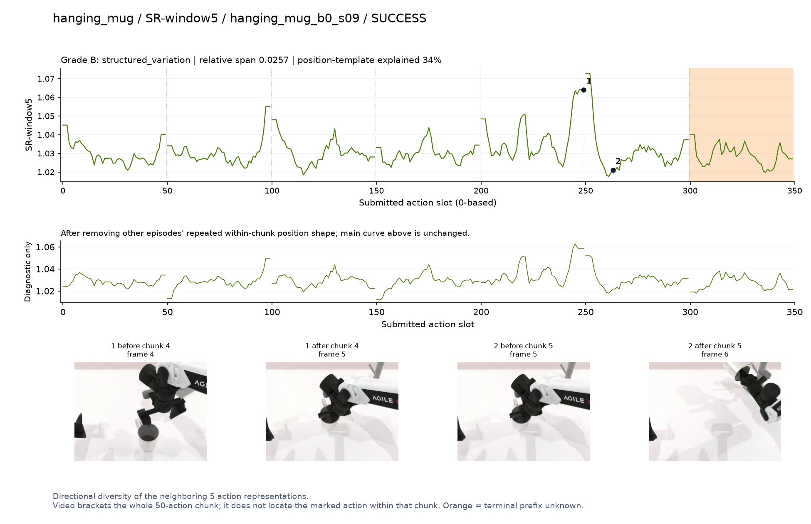
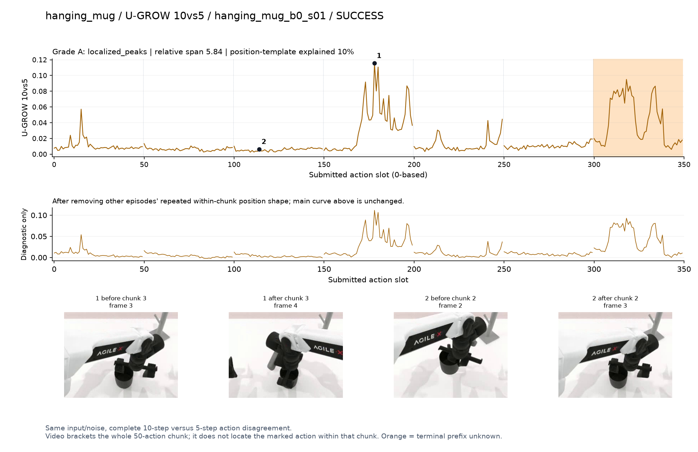

# hanging_mug

[全部任务](../README.md#全部任务) · [按信号看](../README.md#按信号看)

主图保留逐动作原始值；细虚线为chunk边界，橙色为终止段实际执行长度不明，未用于筛选。帧只对应chunk前后，不能精确定位某个h的接触瞬间。A/B/C是形态筛选等级，优先读人工备注。

## DV

**可解释候选**：候选：q3/q5持杯旋转、向挂架移动段升高；峰贴近chunk末端。

轨迹 `hanging_mug_b0_s00`；成功；种子 `201200`；正式验收。

[PNG原图](../figures/hanging_mug/dv.png) · [SVG矢量图](../figures/hanging_mug/dv.svg) · [完整元数据](../entries/hanging_mug/dv.json)

对应帧：[1 before q5](../frames/hanging_mug/hanging_mug_b0_s00/f005.jpg) · [1 after q5](../frames/hanging_mug/hanging_mug_b0_s00/f006.jpg) · [2 before q3](../frames/hanging_mug/hanging_mug_b0_s00/f003.jpg) · [2 after q3](../frames/hanging_mug/hanging_mug_b0_s00/f004.jpg)

## Fresco-tail5

**较弱**：弱：逐动作抖动较密，未见可靠独立事件对应；全数据与噪声到最终动作距离高度相关。

轨迹 `hanging_mug_b0_s01`；成功；种子 `201000`；正式验收。

[PNG原图](../figures/hanging_mug/fresco.png) · [SVG矢量图](../figures/hanging_mug/fresco.svg) · [完整元数据](../entries/hanging_mug/fresco.json)

对应帧：[1 before q5](../frames/hanging_mug/hanging_mug_b0_s01/f005.jpg) · [1 after q5](../frames/hanging_mug/hanging_mug_b0_s01/f006.jpg) · [2 before q2](../frames/hanging_mug/hanging_mug_b0_s01/f002.jpg) · [2 after q2](../frames/hanging_mug/hanging_mug_b0_s01/f003.jpg)

## GEO-full

**可解释候选**：候选：q5向挂架移动段升高；还未能确认挂上瞬间。

轨迹 `hanging_mug_b0_s00`；成功；种子 `201200`；正式验收。

[PNG原图](../figures/hanging_mug/geo.png) · [SVG矢量图](../figures/hanging_mug/geo.svg) · [完整元数据](../entries/hanging_mug/geo.json)

对应帧：[1 before q5](../frames/hanging_mug/hanging_mug_b0_s00/f005.jpg) · [1 after q5](../frames/hanging_mug/hanging_mug_b0_s00/f006.jpg) · [2 before q1](../frames/hanging_mug/hanging_mug_b0_s00/f001.jpg) · [2 after q1](../frames/hanging_mug/hanging_mug_b0_s00/f002.jpg)

## GeoAAC-growth

**较弱**：弱：每chunk前段反复出现尖峰，挂杯事件特异性不清。

轨迹 `hanging_mug_b0_s09`；成功；种子 `201400`；正式验收。

[PNG原图](../figures/hanging_mug/geoaac.png) · [SVG矢量图](../figures/hanging_mug/geoaac.svg) · [完整元数据](../entries/hanging_mug/geoaac.json)

对应帧：[1 before q4](../frames/hanging_mug/hanging_mug_b0_s09/f004.jpg) · [1 after q4](../frames/hanging_mug/hanging_mug_b0_s09/f005.jpg) · [2 before q1](../frames/hanging_mug/hanging_mug_b0_s09/f001.jpg) · [2 after q1](../frames/hanging_mug/hanging_mug_b0_s09/f002.jpg)

## SHIFT

**较弱**：弱：小幅抖动/阶段基线变化，未见可靠独立事件对应；路径长度混杂强。

轨迹 `hanging_mug_b0_s01`；成功；种子 `201000`；正式验收。

[PNG原图](../figures/hanging_mug/shift.png) · [SVG矢量图](../figures/hanging_mug/shift.svg) · [完整元数据](../entries/hanging_mug/shift.json)

对应帧：[1 before q5](../frames/hanging_mug/hanging_mug_b0_s01/f005.jpg) · [1 after q5](../frames/hanging_mug/hanging_mug_b0_s01/f006.jpg) · [2 before q0](../frames/hanging_mug/hanging_mug_b0_s01/f000.jpg) · [2 after q0](../frames/hanging_mug/hanging_mug_b0_s01/f001.jpg)

## Tell-Tale Norm

**可解释候选**：阶段候选：q4拿起/转动杯体时幅度明显增大。

轨迹 `hanging_mug_b0_s01`；成功；种子 `201000`；正式验收。

[PNG原图](../figures/hanging_mug/norm.png) · [SVG矢量图](../figures/hanging_mug/norm.svg) · [完整元数据](../entries/hanging_mug/norm.json)

对应帧：[1 before q4](../frames/hanging_mug/hanging_mug_b0_s01/f004.jpg) · [1 after q4](../frames/hanging_mug/hanging_mug_b0_s01/f005.jpg) · [2 before q0](../frames/hanging_mug/hanging_mug_b0_s01/f000.jpg) · [2 after q0](../frames/hanging_mug/hanging_mug_b0_s01/f001.jpg)

## SR-window5

**受其他因素影响**：谨慎：q4末端主要峰接近边界。

轨迹 `hanging_mug_b0_s09`；成功；种子 `201400`；正式验收。

[PNG原图](../figures/hanging_mug/sr.png) · [SVG矢量图](../figures/hanging_mug/sr.svg) · [完整元数据](../entries/hanging_mug/sr.json)

对应帧：[1 before q4](../frames/hanging_mug/hanging_mug_b0_s09/f004.jpg) · [1 after q4](../frames/hanging_mug/hanging_mug_b0_s09/f005.jpg) · [2 before q5](../frames/hanging_mug/hanging_mug_b0_s09/f005.jpg) · [2 after q5](../frames/hanging_mug/hanging_mug_b0_s09/f006.jpg)

## U-GROW 10vs5

**可解释候选**：候选：q3杯柄抓取/调整姿态附近局部高区。

轨迹 `hanging_mug_b0_s01`；成功；种子 `201000`；正式验收。

[PNG原图](../figures/hanging_mug/ugrow.png) · [SVG矢量图](../figures/hanging_mug/ugrow.svg) · [完整元数据](../entries/hanging_mug/ugrow.json)

对应帧：[1 before q3](../frames/hanging_mug/hanging_mug_b0_s01/f003.jpg) · [1 after q3](../frames/hanging_mug/hanging_mug_b0_s01/f004.jpg) · [2 before q2](../frames/hanging_mug/hanging_mug_b0_s01/f002.jpg) · [2 after q2](../frames/hanging_mug/hanging_mug_b0_s01/f003.jpg)
