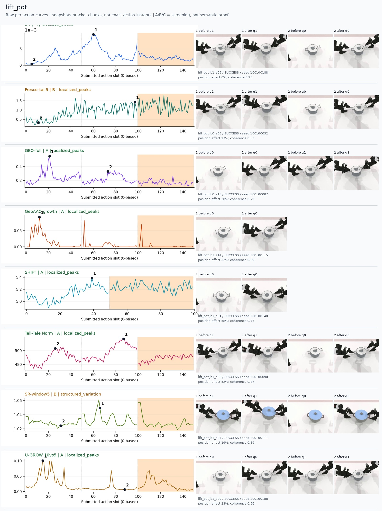
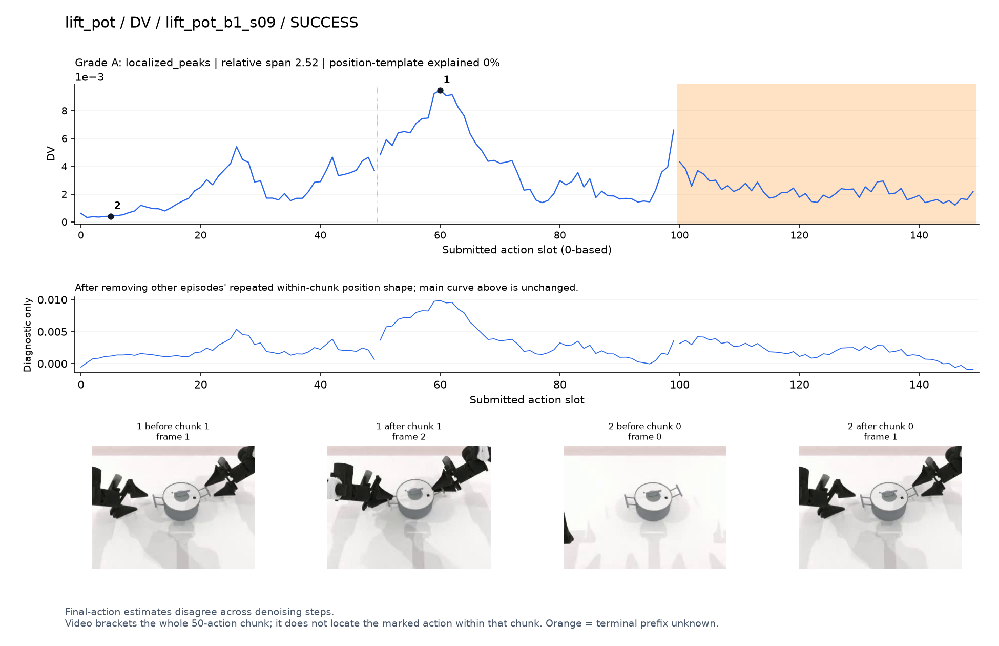
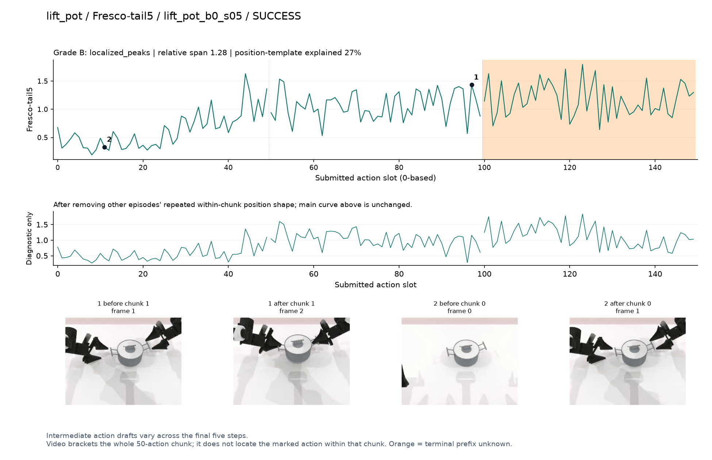
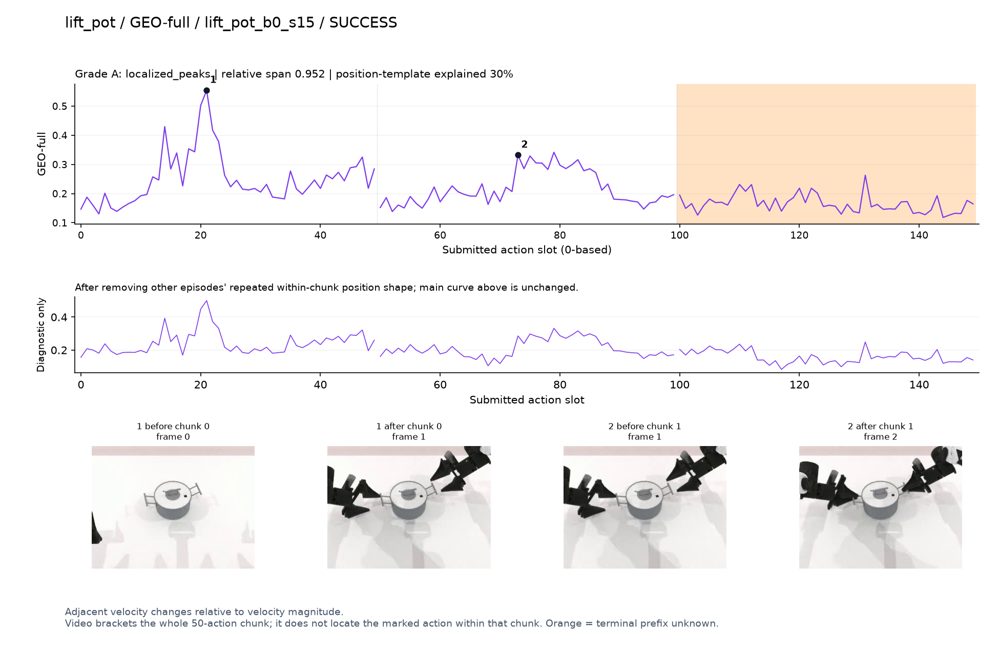
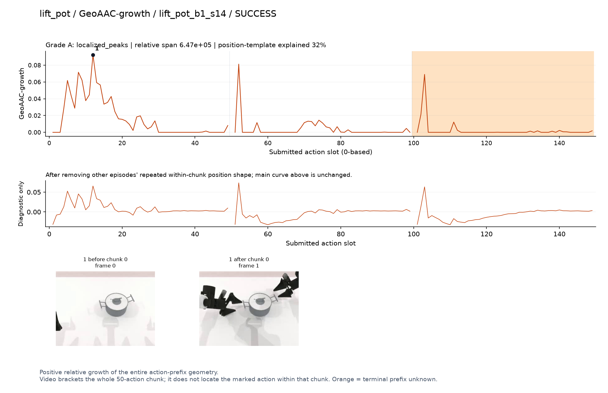
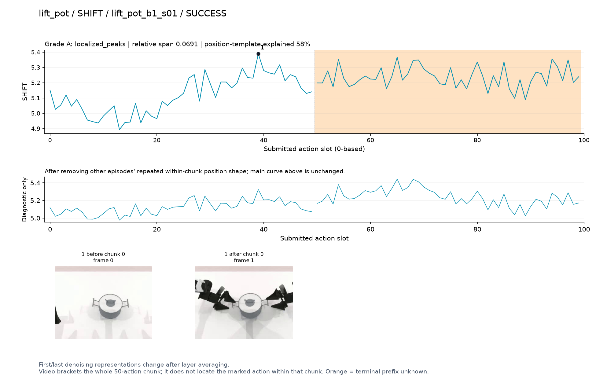
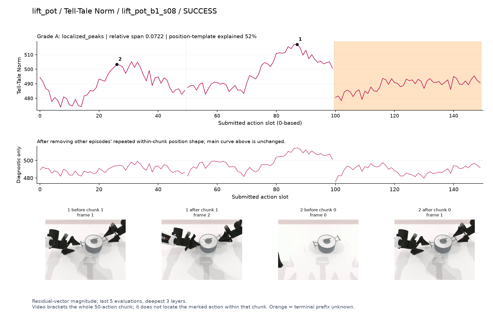
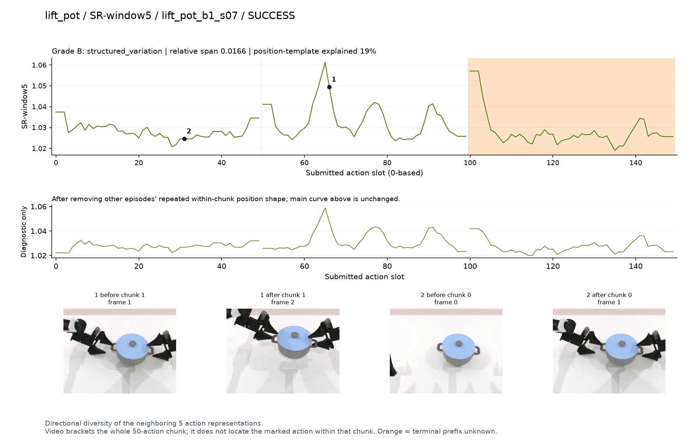
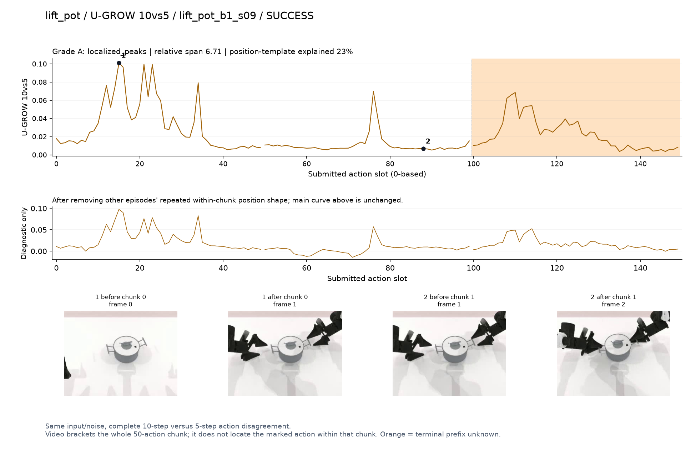

# lift_pot

[全部任务](../README.md#全部任务) · [按信号看](../README.md#按信号看)

主图保留逐动作原始值；细虚线为chunk边界，橙色为终止段实际执行长度不明，未用于筛选。帧只对应chunk前后，不能精确定位某个h的接触瞬间。A/B/C是形态筛选等级，优先读人工备注。

## DV

**可解释候选**：候选：q1双手对准锅两侧手柄时峰清楚。

轨迹 `lift_pot_b1_s09`；成功；种子 `100100188`；正式验收。

[PNG原图](../figures/lift_pot/dv.png) · [SVG矢量图](../figures/lift_pot/dv.svg) · [完整元数据](../entries/lift_pot/dv.json)

对应帧：[1 before q1](../frames/lift_pot/lift_pot_b1_s09/f001.jpg) · [1 after q1](../frames/lift_pot/lift_pot_b1_s09/f002.jpg) · [2 before q0](../frames/lift_pot/lift_pot_b1_s09/f000.jpg) · [2 after q0](../frames/lift_pot/lift_pot_b1_s09/f001.jpg)

## Fresco-tail5

**较弱**：弱阶段趋势：接近后整体抬高，逐动作抖动仍密集。

轨迹 `lift_pot_b0_s05`；成功；种子 `100100032`；正式验收。

[PNG原图](../figures/lift_pot/fresco.png) · [SVG矢量图](../figures/lift_pot/fresco.svg) · [完整元数据](../entries/lift_pot/fresco.json)

对应帧：[1 before q1](../frames/lift_pot/lift_pot_b0_s05/f001.jpg) · [1 after q1](../frames/lift_pot/lift_pot_b0_s05/f002.jpg) · [2 before q0](../frames/lift_pot/lift_pot_b0_s05/f000.jpg) · [2 after q0](../frames/lift_pot/lift_pot_b0_s05/f001.jpg)

## GEO-full

**可解释候选**：候选：q0接近锅和q1握持准备两段高区。

轨迹 `lift_pot_b0_s15`；成功；种子 `100100007`；正式验收。

[PNG原图](../figures/lift_pot/geo.png) · [SVG矢量图](../figures/lift_pot/geo.svg) · [完整元数据](../entries/lift_pot/geo.json)

对应帧：[1 before q0](../frames/lift_pot/lift_pot_b0_s15/f000.jpg) · [1 after q0](../frames/lift_pot/lift_pot_b0_s15/f001.jpg) · [2 before q1](../frames/lift_pot/lift_pot_b0_s15/f001.jpg) · [2 after q1](../frames/lift_pot/lift_pot_b0_s15/f002.jpg)

## GeoAAC-growth

**受其他因素影响**：谨慎：q0接近阶段较高，同时各chunk开头有窄尖峰。

轨迹 `lift_pot_b1_s14`；成功；种子 `100100115`；正式验收。

[PNG原图](../figures/lift_pot/geoaac.png) · [SVG矢量图](../figures/lift_pot/geoaac.svg) · [完整元数据](../entries/lift_pot/geoaac.json)

对应帧：[1 before q0](../frames/lift_pot/lift_pot_b1_s14/f000.jpg) · [1 after q0](../frames/lift_pot/lift_pot_b1_s14/f001.jpg)

## SHIFT

**较弱**：弱阶段候选：接近锅时先低后高，但位置模板与路径长度混杂强。

轨迹 `lift_pot_b1_s01`；成功；种子 `100100140`；正式验收。

[PNG原图](../figures/lift_pot/shift.png) · [SVG矢量图](../figures/lift_pot/shift.svg) · [完整元数据](../entries/lift_pot/shift.json)

对应帧：[1 before q0](../frames/lift_pot/lift_pot_b1_s01/f000.jpg) · [1 after q0](../frames/lift_pot/lift_pot_b1_s01/f001.jpg)

## Tell-Tale Norm

**可解释候选**：阶段候选：双手靠近、握持锅的两段宽峰；位置效应也较大。

轨迹 `lift_pot_b1_s08`；成功；种子 `100100090`；正式验收。

[PNG原图](../figures/lift_pot/norm.png) · [SVG矢量图](../figures/lift_pot/norm.svg) · [完整元数据](../entries/lift_pot/norm.json)

对应帧：[1 before q1](../frames/lift_pot/lift_pot_b1_s08/f001.jpg) · [1 after q1](../frames/lift_pot/lift_pot_b1_s08/f002.jpg) · [2 before q0](../frames/lift_pot/lift_pot_b1_s08/f000.jpg) · [2 after q0](../frames/lift_pot/lift_pot_b1_s08/f001.jpg)

## SR-window5

**可解释候选**：候选：q1提锅附近内部局部峰，但仍有边缘效应。

轨迹 `lift_pot_b1_s07`；成功；种子 `100100111`；正式验收。

[PNG原图](../figures/lift_pot/sr.png) · [SVG矢量图](../figures/lift_pot/sr.svg) · [完整元数据](../entries/lift_pot/sr.json)

对应帧：[1 before q1](../frames/lift_pot/lift_pot_b1_s07/f001.jpg) · [1 after q1](../frames/lift_pot/lift_pot_b1_s07/f002.jpg) · [2 before q0](../frames/lift_pot/lift_pot_b1_s07/f000.jpg) · [2 after q0](../frames/lift_pot/lift_pot_b1_s07/f001.jpg)

## U-GROW 10vs5

**可解释候选**：候选：q0双手伸向锅柄时集中高区。

轨迹 `lift_pot_b1_s09`；成功；种子 `100100188`；正式验收。

[PNG原图](../figures/lift_pot/ugrow.png) · [SVG矢量图](../figures/lift_pot/ugrow.svg) · [完整元数据](../entries/lift_pot/ugrow.json)

对应帧：[1 before q0](../frames/lift_pot/lift_pot_b1_s09/f000.jpg) · [1 after q0](../frames/lift_pot/lift_pot_b1_s09/f001.jpg) · [2 before q1](../frames/lift_pot/lift_pot_b1_s09/f001.jpg) · [2 after q1](../frames/lift_pot/lift_pot_b1_s09/f002.jpg)
