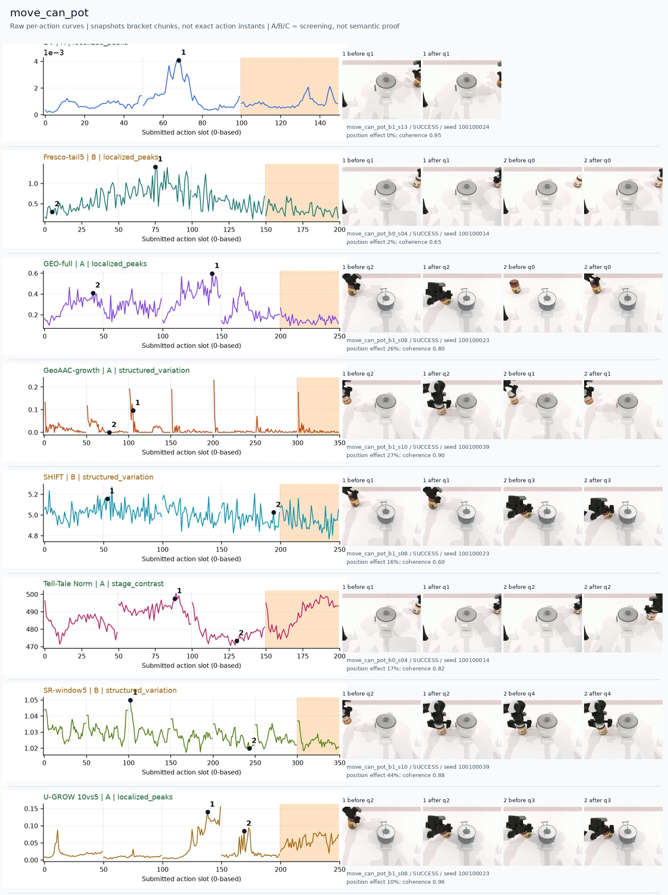
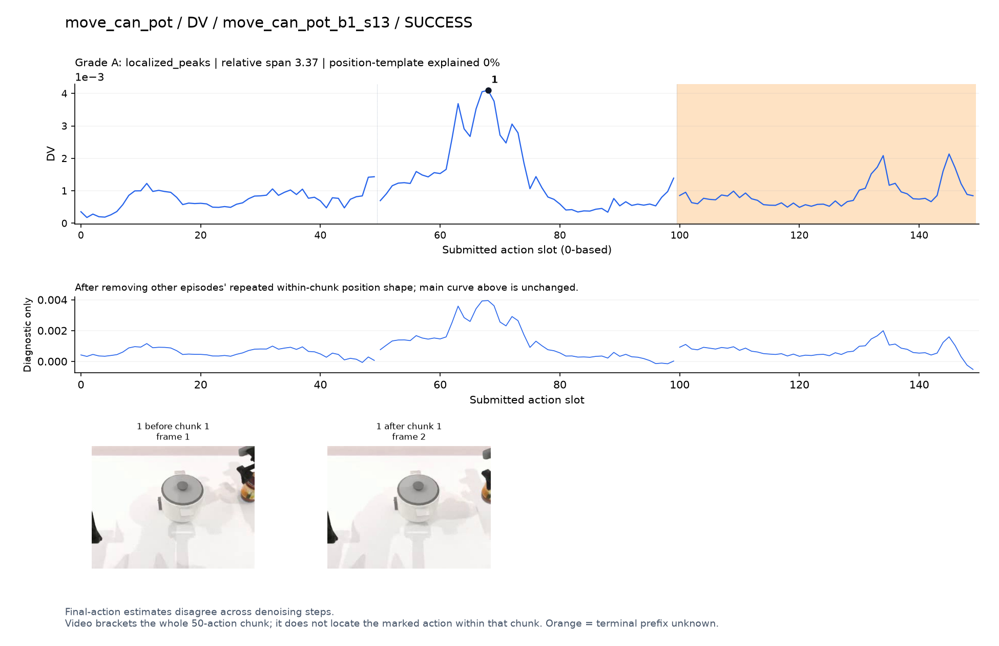
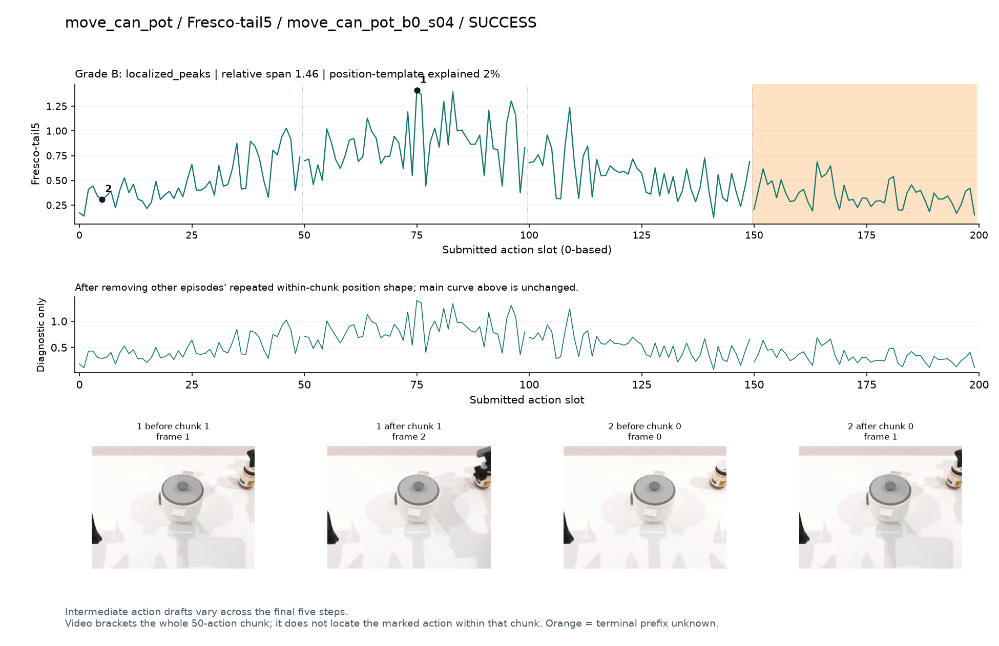
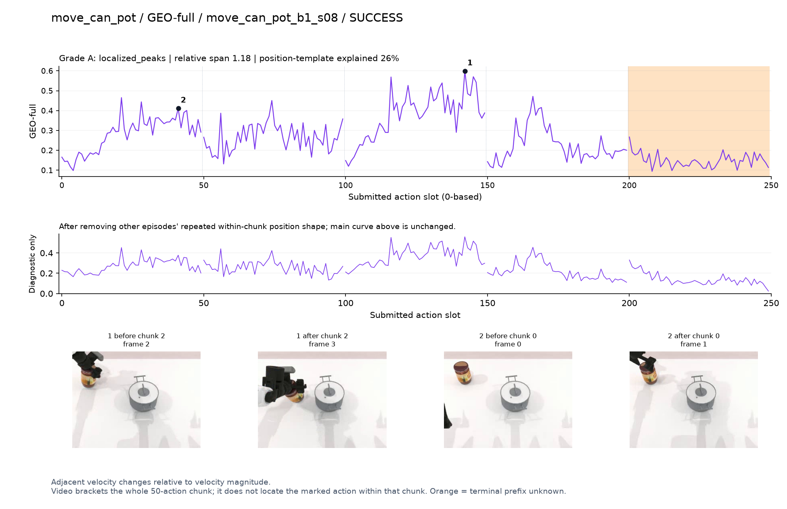
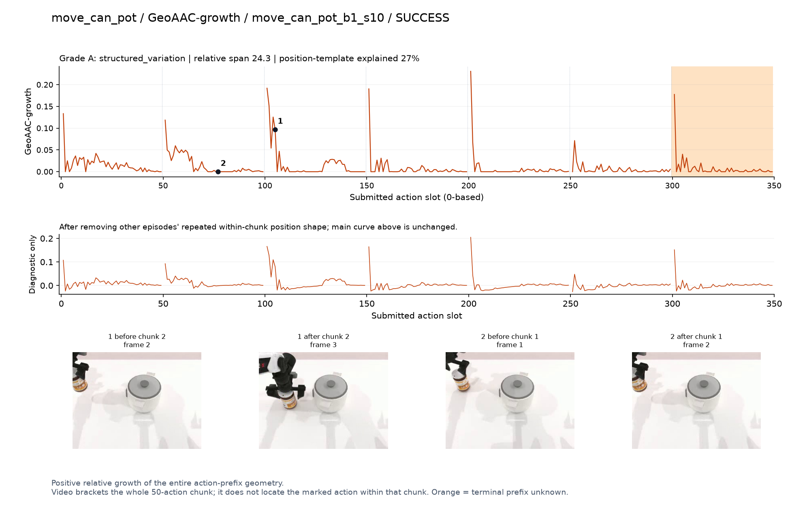
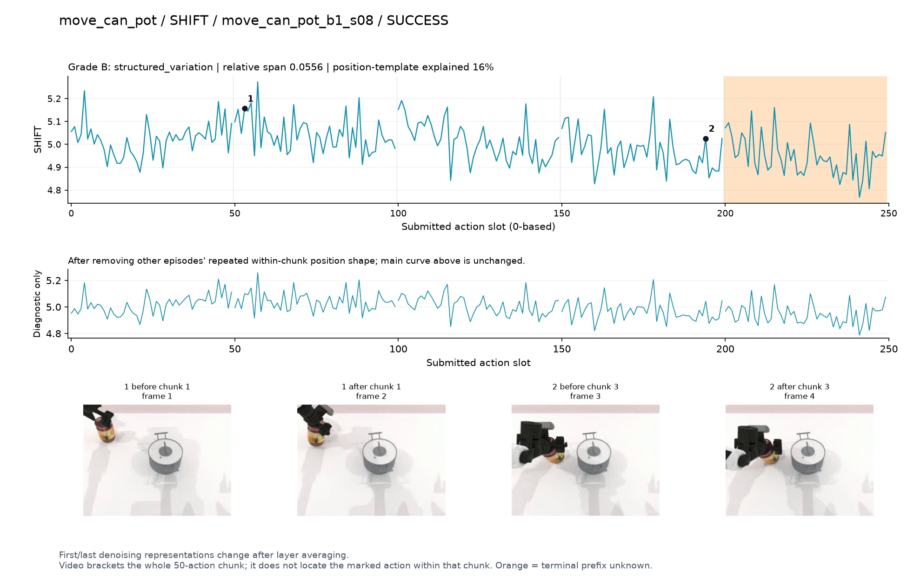
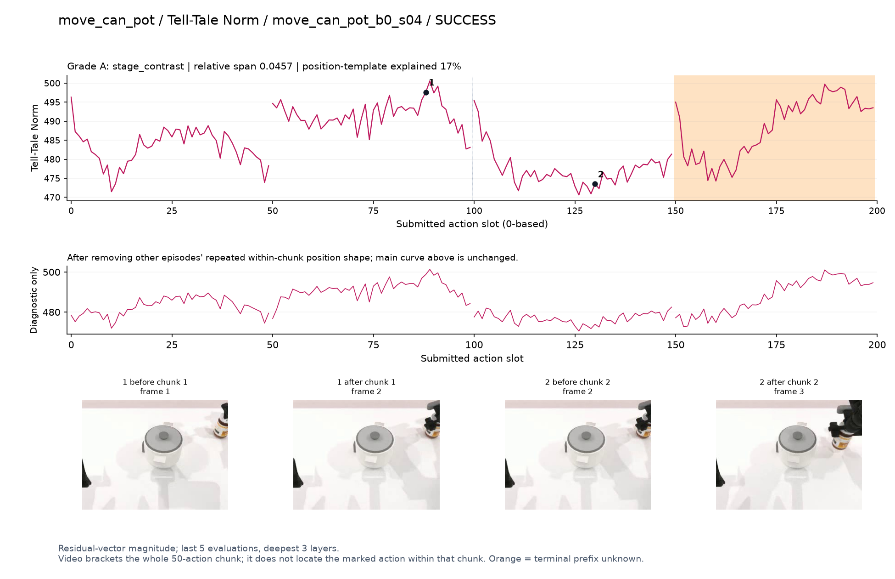
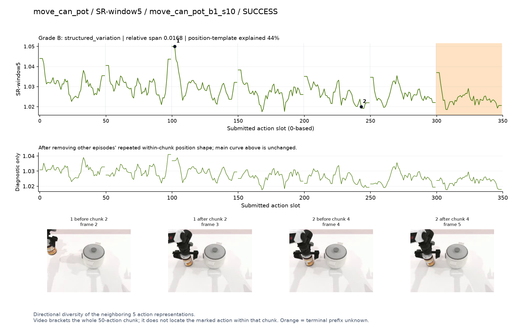
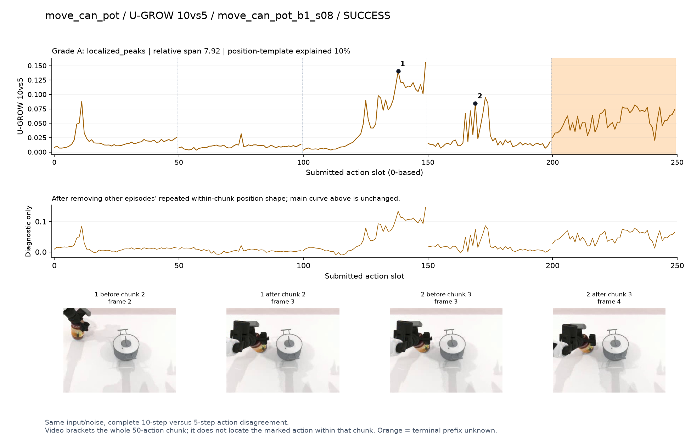

# move_can_pot

[全部任务](../README.md#全部任务) · [按信号看](../README.md#按信号看)

主图保留逐动作原始值；细虚线为chunk边界，橙色为终止段实际执行长度不明，未用于筛选。帧只对应chunk前后，不能精确定位某个h的接触瞬间。A/B/C是形态筛选等级，优先读人工备注。

## DV

**受其他因素影响**：谨慎：q1峰清楚，但罐和手在画面右缘，语义证据不足。

轨迹 `move_can_pot_b1_s13`；成功；种子 `100100024`；正式验收。

[PNG原图](../figures/move_can_pot/dv.png) · [SVG矢量图](../figures/move_can_pot/dv.svg) · [完整元数据](../entries/move_can_pot/dv.json)

对应帧：[1 before q1](../frames/move_can_pot/move_can_pot_b1_s13/f001.jpg) · [1 after q1](../frames/move_can_pot/move_can_pot_b1_s13/f002.jpg)

## Fresco-tail5

**较弱**：弱：逐动作抖动较密，未见可靠独立事件对应；全数据与噪声到最终动作距离高度相关。

轨迹 `move_can_pot_b0_s04`；成功；种子 `100100014`；正式验收。

[PNG原图](../figures/move_can_pot/fresco.png) · [SVG矢量图](../figures/move_can_pot/fresco.svg) · [完整元数据](../entries/move_can_pot/fresco.json)

对应帧：[1 before q1](../frames/move_can_pot/move_can_pot_b0_s04/f001.jpg) · [1 after q1](../frames/move_can_pot/move_can_pot_b0_s04/f002.jpg) · [2 before q0](../frames/move_can_pot/move_can_pot_b0_s04/f000.jpg) · [2 after q0](../frames/move_can_pot/move_can_pot_b0_s04/f001.jpg)

## GEO-full

**可解释候选**：候选：q2把罐向锅边移动时宽峰。

轨迹 `move_can_pot_b1_s08`；成功；种子 `100100023`；正式验收。

[PNG原图](../figures/move_can_pot/geo.png) · [SVG矢量图](../figures/move_can_pot/geo.svg) · [完整元数据](../entries/move_can_pot/geo.json)

对应帧：[1 before q2](../frames/move_can_pot/move_can_pot_b1_s08/f002.jpg) · [1 after q2](../frames/move_can_pot/move_can_pot_b1_s08/f003.jpg) · [2 before q0](../frames/move_can_pot/move_can_pot_b1_s08/f000.jpg) · [2 after q0](../frames/move_can_pot/move_can_pot_b1_s08/f001.jpg)

## GeoAAC-growth

**较弱**：弱：多数chunk起始尖峰，搬运阶段与前缀效应难分。

轨迹 `move_can_pot_b1_s10`；成功；种子 `100100039`；正式验收。

[PNG原图](../figures/move_can_pot/geoaac.png) · [SVG矢量图](../figures/move_can_pot/geoaac.svg) · [完整元数据](../entries/move_can_pot/geoaac.json)

对应帧：[1 before q2](../frames/move_can_pot/move_can_pot_b1_s10/f002.jpg) · [1 after q2](../frames/move_can_pot/move_can_pot_b1_s10/f003.jpg) · [2 before q1](../frames/move_can_pot/move_can_pot_b1_s10/f001.jpg) · [2 after q1](../frames/move_can_pot/move_can_pot_b1_s10/f002.jpg)

## SHIFT

**较弱**：弱：小幅抖动/阶段基线变化，未见可靠独立事件对应；路径长度混杂强。

轨迹 `move_can_pot_b1_s08`；成功；种子 `100100023`；正式验收。

[PNG原图](../figures/move_can_pot/shift.png) · [SVG矢量图](../figures/move_can_pot/shift.svg) · [完整元数据](../entries/move_can_pot/shift.json)

对应帧：[1 before q1](../frames/move_can_pot/move_can_pot_b1_s08/f001.jpg) · [1 after q1](../frames/move_can_pot/move_can_pot_b1_s08/f002.jpg) · [2 before q3](../frames/move_can_pot/move_can_pot_b1_s08/f003.jpg) · [2 after q3](../frames/move_can_pot/move_can_pot_b1_s08/f004.jpg)

## Tell-Tale Norm

**阶段变化**：阶段差异存在，选中片段在画面右缘，不能精确解释。

轨迹 `move_can_pot_b0_s04`；成功；种子 `100100014`；正式验收。

[PNG原图](../figures/move_can_pot/norm.png) · [SVG矢量图](../figures/move_can_pot/norm.svg) · [完整元数据](../entries/move_can_pot/norm.json)

对应帧：[1 before q1](../frames/move_can_pot/move_can_pot_b0_s04/f001.jpg) · [1 after q1](../frames/move_can_pot/move_can_pot_b0_s04/f002.jpg) · [2 before q2](../frames/move_can_pot/move_can_pot_b0_s04/f002.jpg) · [2 after q2](../frames/move_can_pot/move_can_pot_b0_s04/f003.jpg)

## SR-window5

**较弱**：弱：chunk边界反复变化。

轨迹 `move_can_pot_b1_s10`；成功；种子 `100100039`；正式验收。

[PNG原图](../figures/move_can_pot/sr.png) · [SVG矢量图](../figures/move_can_pot/sr.svg) · [完整元数据](../entries/move_can_pot/sr.json)

对应帧：[1 before q2](../frames/move_can_pot/move_can_pot_b1_s10/f002.jpg) · [1 after q2](../frames/move_can_pot/move_can_pot_b1_s10/f003.jpg) · [2 before q4](../frames/move_can_pot/move_can_pot_b1_s10/f004.jpg) · [2 after q4](../frames/move_can_pot/move_can_pot_b1_s10/f005.jpg)

## U-GROW 10vs5

**可解释候选**：候选：q2移动至锅边、q3接近放置各有高区。

轨迹 `move_can_pot_b1_s08`；成功；种子 `100100023`；正式验收。

[PNG原图](../figures/move_can_pot/ugrow.png) · [SVG矢量图](../figures/move_can_pot/ugrow.svg) · [完整元数据](../entries/move_can_pot/ugrow.json)

对应帧：[1 before q2](../frames/move_can_pot/move_can_pot_b1_s08/f002.jpg) · [1 after q2](../frames/move_can_pot/move_can_pot_b1_s08/f003.jpg) · [2 before q3](../frames/move_can_pot/move_can_pot_b1_s08/f003.jpg) · [2 after q3](../frames/move_can_pot/move_can_pot_b1_s08/f004.jpg)
