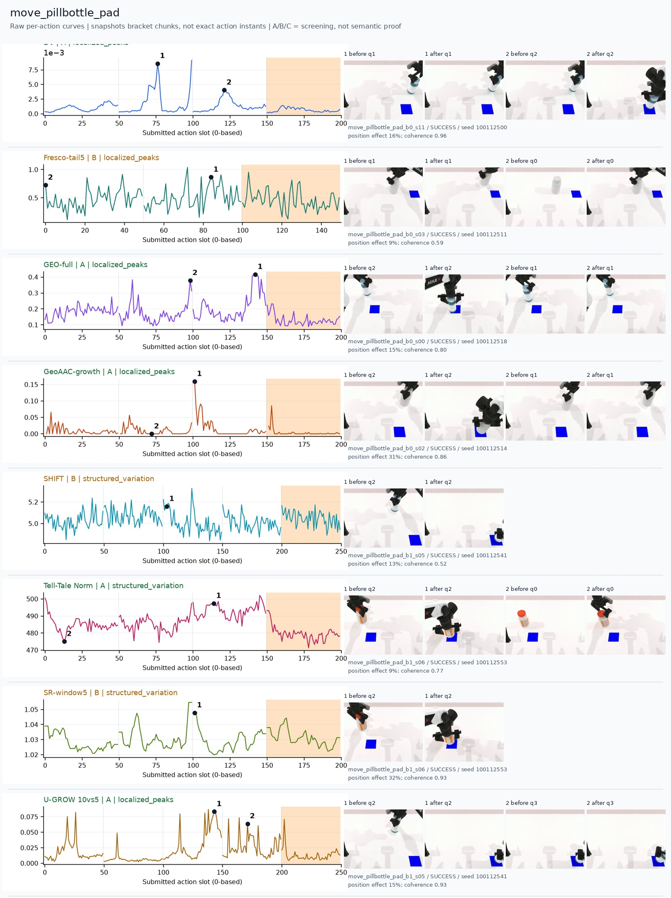
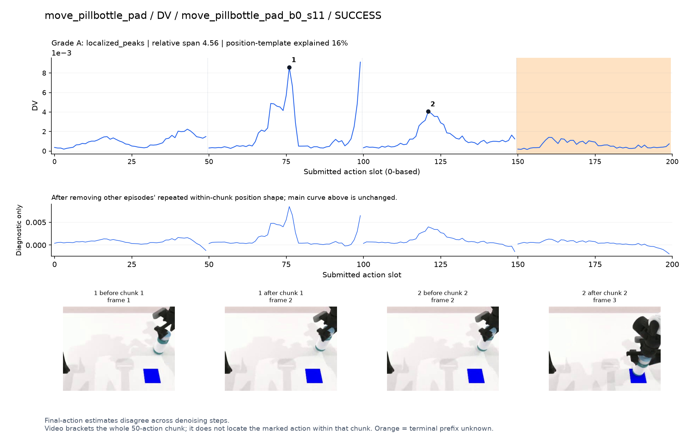
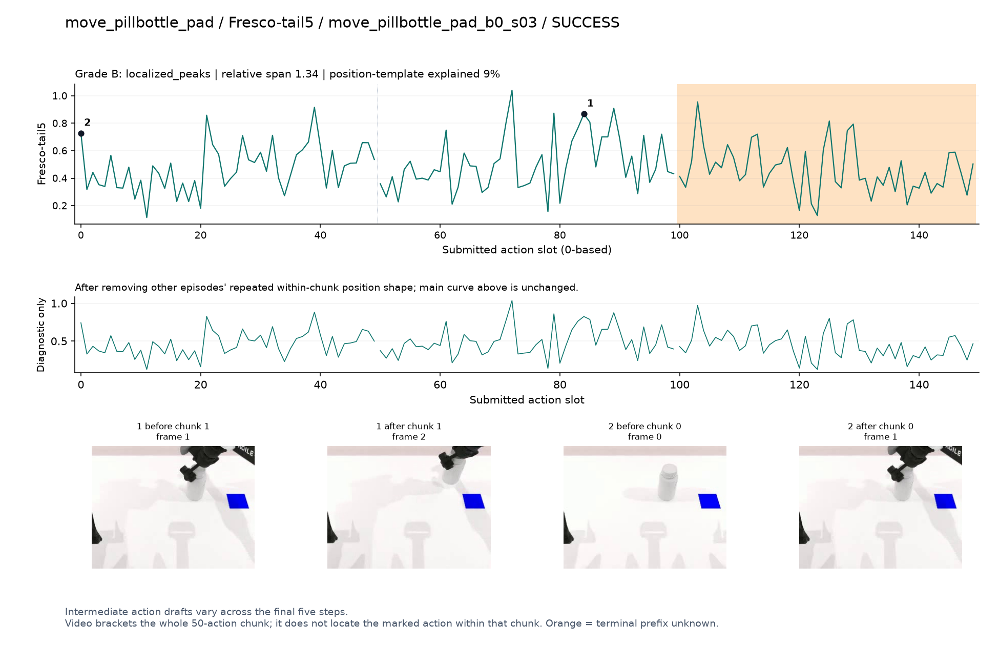
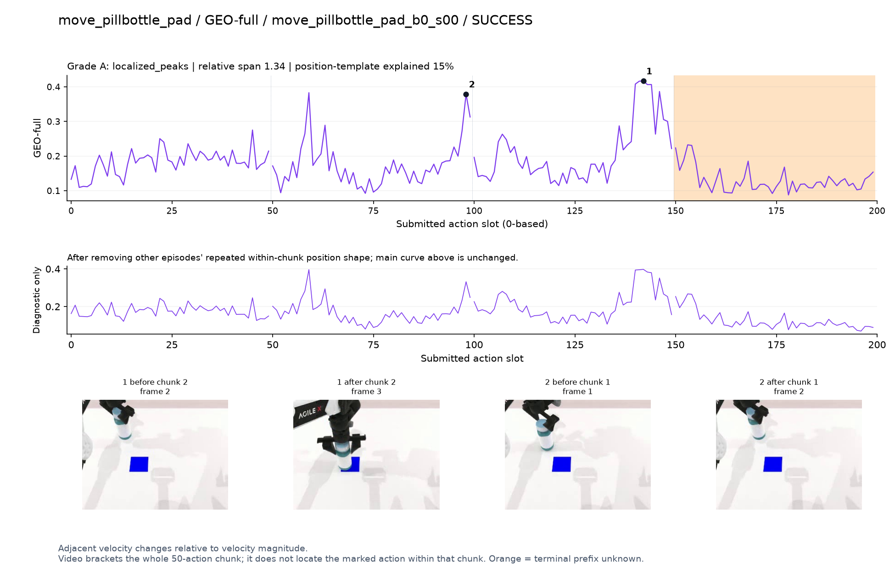
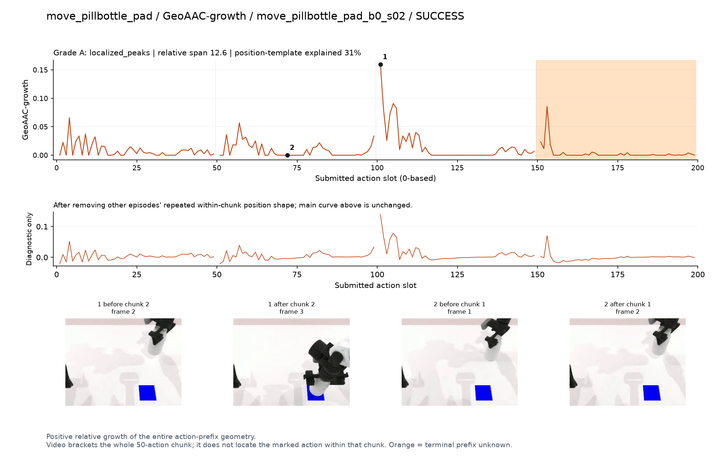
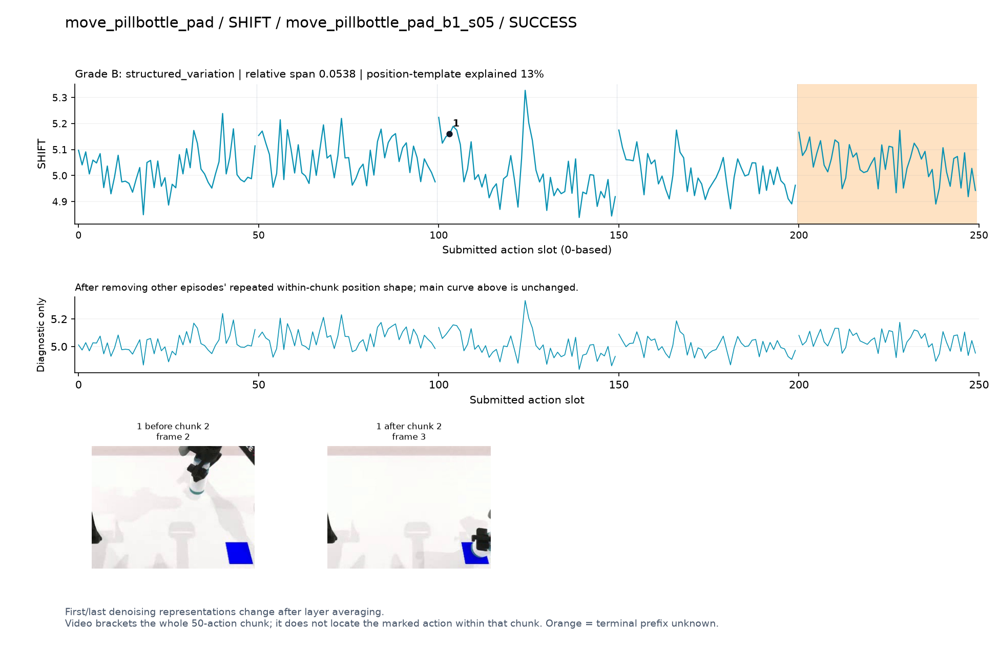
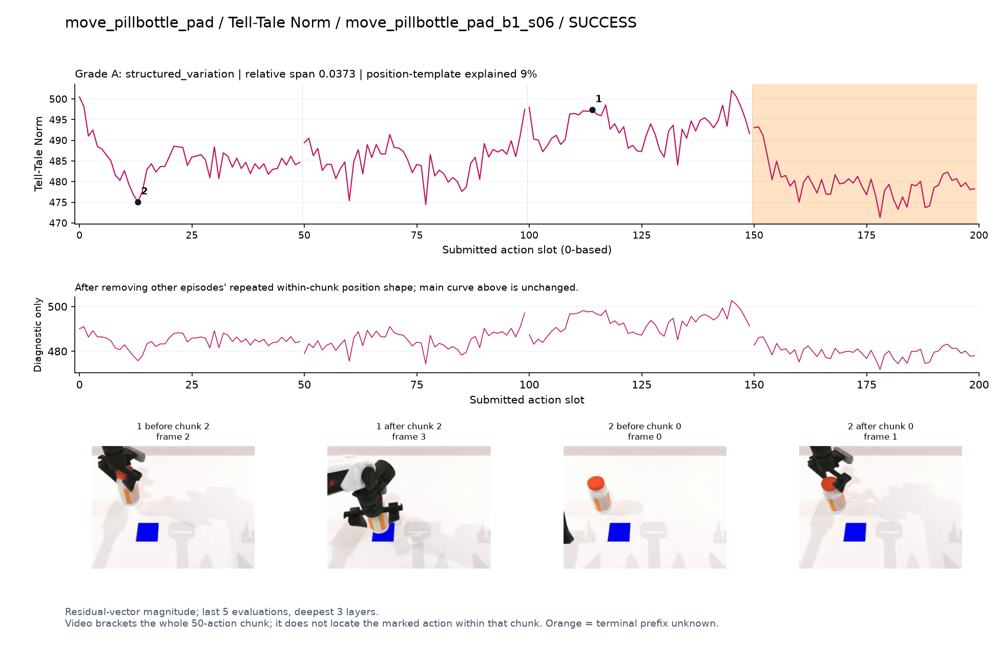
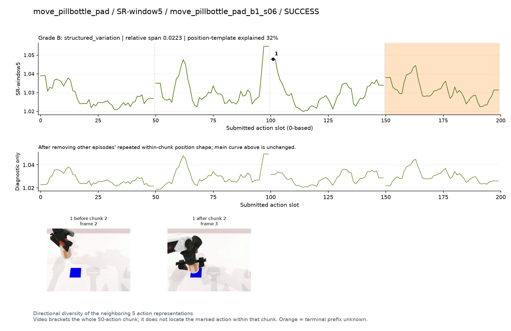
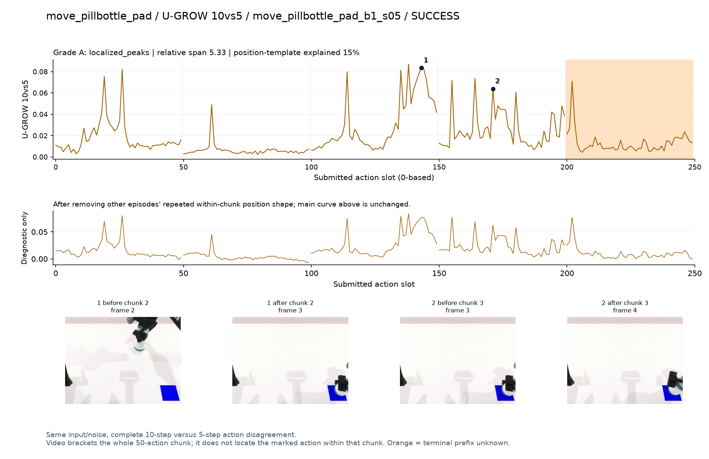

# move_pillbottle_pad

[全部任务](../README.md#全部任务) · [按信号看](../README.md#按信号看)

主图保留逐动作原始值；细虚线为chunk边界，橙色为终止段实际执行长度不明，未用于筛选。帧只对应chunk前后，不能精确定位某个h的接触瞬间。A/B/C是形态筛选等级，优先读人工备注。

## DV

**可解释候选**：候选：q1提瓶、q2移向垫子有两个局部高区。

轨迹 `move_pillbottle_pad_b0_s11`；成功；种子 `100112500`；正式验收。

[PNG原图](../figures/move_pillbottle_pad/dv.png) · [SVG矢量图](../figures/move_pillbottle_pad/dv.svg) · [完整元数据](../entries/move_pillbottle_pad/dv.json)

对应帧：[1 before q1](../frames/move_pillbottle_pad/move_pillbottle_pad_b0_s11/f001.jpg) · [1 after q1](../frames/move_pillbottle_pad/move_pillbottle_pad_b0_s11/f002.jpg) · [2 before q2](../frames/move_pillbottle_pad/move_pillbottle_pad_b0_s11/f002.jpg) · [2 after q2](../frames/move_pillbottle_pad/move_pillbottle_pad_b0_s11/f003.jpg)

## Fresco-tail5

**较弱**：弱：逐动作抖动较密，未见可靠独立事件对应；全数据与噪声到最终动作距离高度相关。

轨迹 `move_pillbottle_pad_b0_s03`；成功；种子 `100112511`；正式验收。

[PNG原图](../figures/move_pillbottle_pad/fresco.png) · [SVG矢量图](../figures/move_pillbottle_pad/fresco.svg) · [完整元数据](../entries/move_pillbottle_pad/fresco.json)

对应帧：[1 before q1](../frames/move_pillbottle_pad/move_pillbottle_pad_b0_s03/f001.jpg) · [1 after q1](../frames/move_pillbottle_pad/move_pillbottle_pad_b0_s03/f002.jpg) · [2 before q0](../frames/move_pillbottle_pad/move_pillbottle_pad_b0_s03/f000.jpg) · [2 after q0](../frames/move_pillbottle_pad/move_pillbottle_pad_b0_s03/f001.jpg)

## GEO-full

**可解释候选**：候选：q1提瓶与q2放到垫子附近升高。

轨迹 `move_pillbottle_pad_b0_s00`；成功；种子 `100112518`；正式验收。

[PNG原图](../figures/move_pillbottle_pad/geo.png) · [SVG矢量图](../figures/move_pillbottle_pad/geo.svg) · [完整元数据](../entries/move_pillbottle_pad/geo.json)

对应帧：[1 before q2](../frames/move_pillbottle_pad/move_pillbottle_pad_b0_s00/f002.jpg) · [1 after q2](../frames/move_pillbottle_pad/move_pillbottle_pad_b0_s00/f003.jpg) · [2 before q1](../frames/move_pillbottle_pad/move_pillbottle_pad_b0_s00/f001.jpg) · [2 after q1](../frames/move_pillbottle_pad/move_pillbottle_pad_b0_s00/f002.jpg)

## GeoAAC-growth

**受其他因素影响**：谨慎：q2移到垫子阶段增长峰位于前缀开头。

轨迹 `move_pillbottle_pad_b0_s02`；成功；种子 `100112514`；正式验收。

[PNG原图](../figures/move_pillbottle_pad/geoaac.png) · [SVG矢量图](../figures/move_pillbottle_pad/geoaac.svg) · [完整元数据](../entries/move_pillbottle_pad/geoaac.json)

对应帧：[1 before q2](../frames/move_pillbottle_pad/move_pillbottle_pad_b0_s02/f002.jpg) · [1 after q2](../frames/move_pillbottle_pad/move_pillbottle_pad_b0_s02/f003.jpg) · [2 before q1](../frames/move_pillbottle_pad/move_pillbottle_pad_b0_s02/f001.jpg) · [2 after q1](../frames/move_pillbottle_pad/move_pillbottle_pad_b0_s02/f002.jpg)

## SHIFT

**较弱**：弱：小幅抖动/阶段基线变化，未见可靠独立事件对应；路径长度混杂强。

轨迹 `move_pillbottle_pad_b1_s05`；成功；种子 `100112541`；正式验收。

[PNG原图](../figures/move_pillbottle_pad/shift.png) · [SVG矢量图](../figures/move_pillbottle_pad/shift.svg) · [完整元数据](../entries/move_pillbottle_pad/shift.json)

对应帧：[1 before q2](../frames/move_pillbottle_pad/move_pillbottle_pad_b1_s05/f002.jpg) · [1 after q2](../frames/move_pillbottle_pad/move_pillbottle_pad_b1_s05/f003.jpg)

## Tell-Tale Norm

**可解释候选**：阶段候选：q2持瓶到垫子上方比初始接近阶段幅度高。

轨迹 `move_pillbottle_pad_b1_s06`；成功；种子 `100112553`；正式验收。

[PNG原图](../figures/move_pillbottle_pad/norm.png) · [SVG矢量图](../figures/move_pillbottle_pad/norm.svg) · [完整元数据](../entries/move_pillbottle_pad/norm.json)

对应帧：[1 before q2](../frames/move_pillbottle_pad/move_pillbottle_pad_b1_s06/f002.jpg) · [1 after q2](../frames/move_pillbottle_pad/move_pillbottle_pad_b1_s06/f003.jpg) · [2 before q0](../frames/move_pillbottle_pad/move_pillbottle_pad_b1_s06/f000.jpg) · [2 after q0](../frames/move_pillbottle_pad/move_pillbottle_pad_b1_s06/f001.jpg)

## SR-window5

**受其他因素影响**：谨慎：q2起始突升，可能主要是chunk边界。

轨迹 `move_pillbottle_pad_b1_s06`；成功；种子 `100112553`；正式验收。

[PNG原图](../figures/move_pillbottle_pad/sr.png) · [SVG矢量图](../figures/move_pillbottle_pad/sr.svg) · [完整元数据](../entries/move_pillbottle_pad/sr.json)

对应帧：[1 before q2](../frames/move_pillbottle_pad/move_pillbottle_pad_b1_s06/f002.jpg) · [1 after q2](../frames/move_pillbottle_pad/move_pillbottle_pad_b1_s06/f003.jpg)

## U-GROW 10vs5

**可解释候选**：候选：q2移向垫子、q3放置附近集中变化。

轨迹 `move_pillbottle_pad_b1_s05`；成功；种子 `100112541`；正式验收。

[PNG原图](../figures/move_pillbottle_pad/ugrow.png) · [SVG矢量图](../figures/move_pillbottle_pad/ugrow.svg) · [完整元数据](../entries/move_pillbottle_pad/ugrow.json)

对应帧：[1 before q2](../frames/move_pillbottle_pad/move_pillbottle_pad_b1_s05/f002.jpg) · [1 after q2](../frames/move_pillbottle_pad/move_pillbottle_pad_b1_s05/f003.jpg) · [2 before q3](../frames/move_pillbottle_pad/move_pillbottle_pad_b1_s05/f003.jpg) · [2 after q3](../frames/move_pillbottle_pad/move_pillbottle_pad_b1_s05/f004.jpg)
