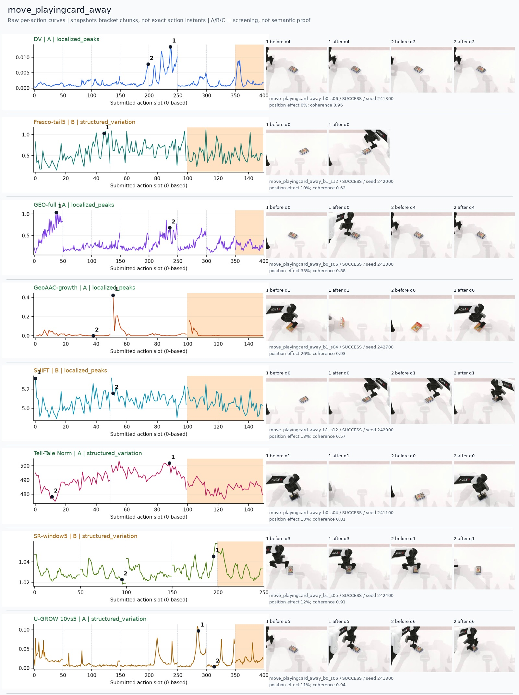
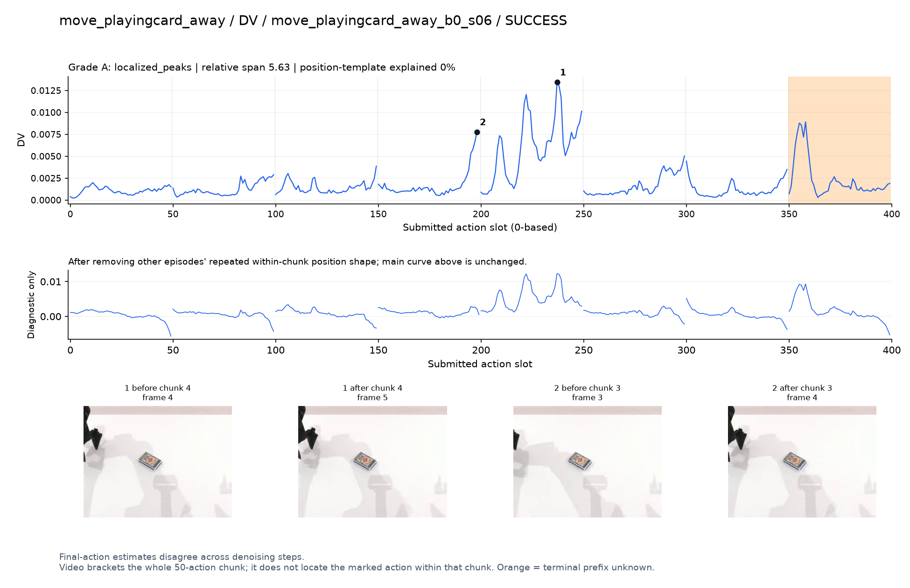
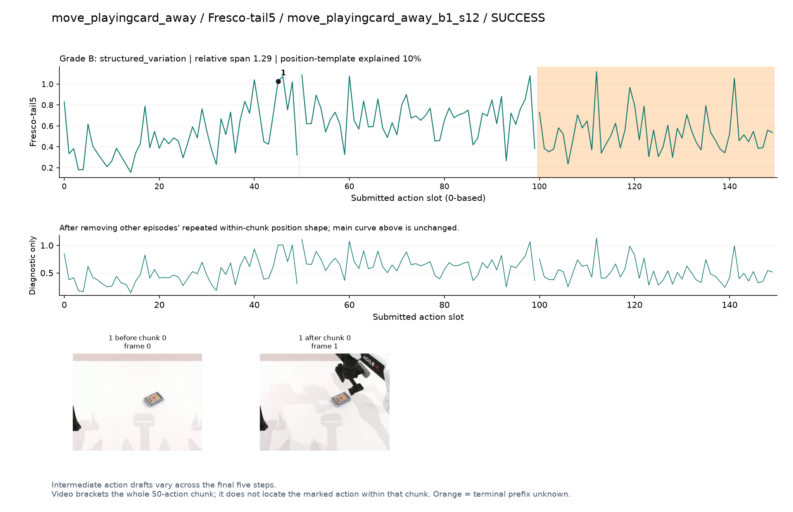
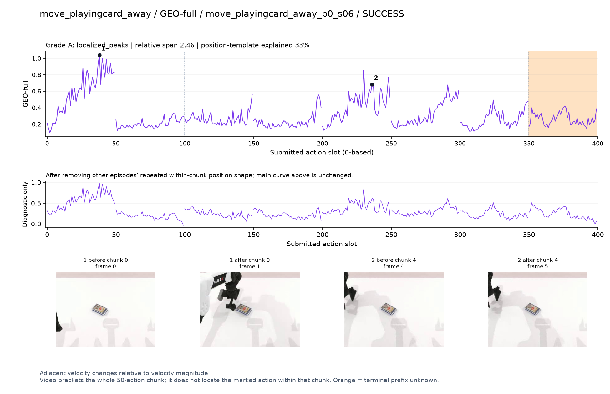
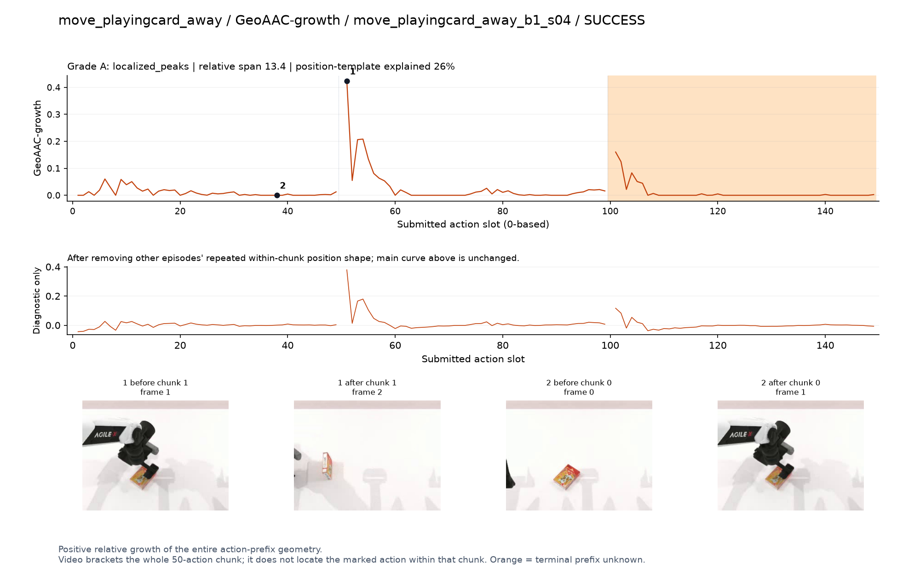
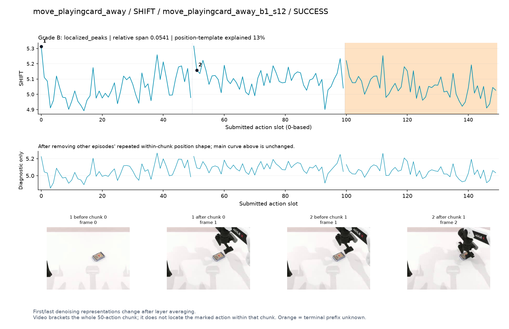
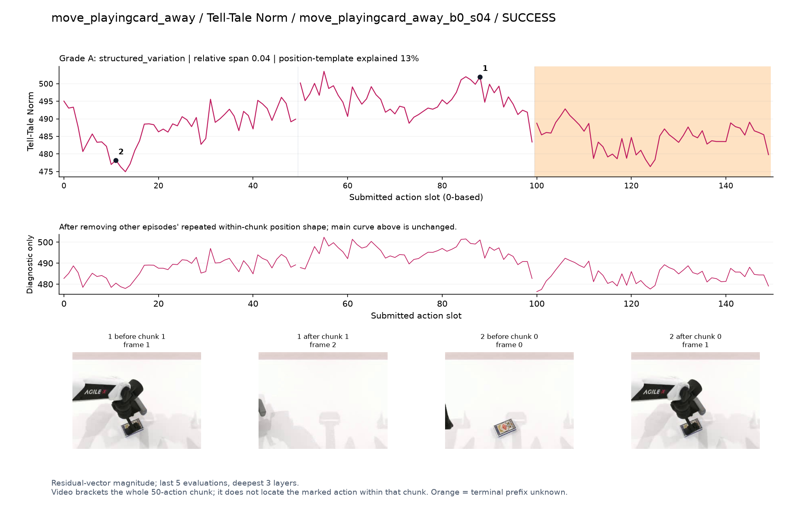
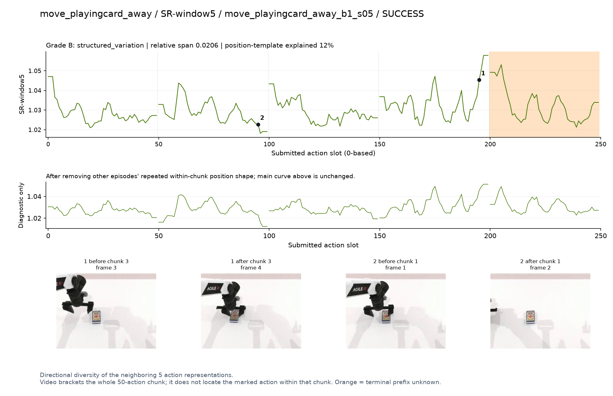
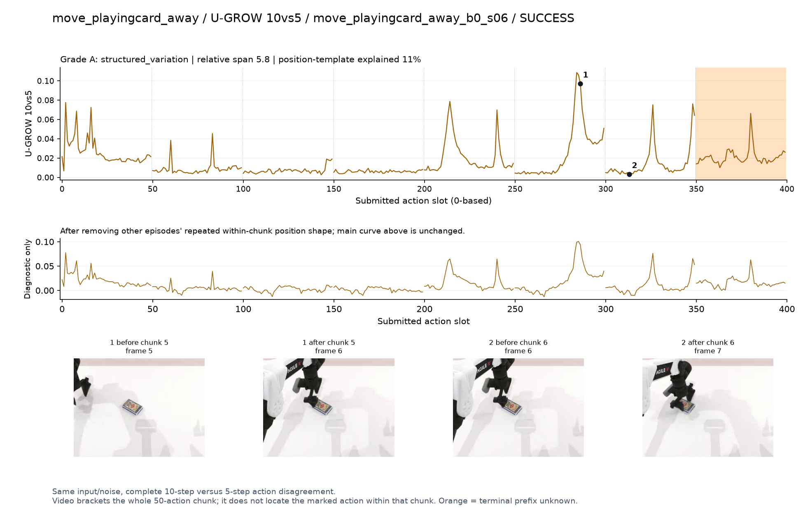

# move_playingcard_away

[全部任务](../README.md#全部任务) · [按信号看](../README.md#按信号看)

主图保留逐动作原始值；细虚线为chunk边界，橙色为终止段实际执行长度不明，未用于筛选。帧只对应chunk前后，不能精确定位某个h的接触瞬间。A/B/C是形态筛选等级，优先读人工备注。

## DV

**较弱**：形态清楚但语义弱：q3/q4画面里的纸牌几乎不变，手在边缘。

轨迹 `move_playingcard_away_b0_s06`；成功；种子 `241300`；正式验收。

[PNG原图](../figures/move_playingcard_away/dv.png) · [SVG矢量图](../figures/move_playingcard_away/dv.svg) · [完整元数据](../entries/move_playingcard_away/dv.json)

对应帧：[1 before q4](../frames/move_playingcard_away/move_playingcard_away_b0_s06/f004.jpg) · [1 after q4](../frames/move_playingcard_away/move_playingcard_away_b0_s06/f005.jpg) · [2 before q3](../frames/move_playingcard_away/move_playingcard_away_b0_s06/f003.jpg) · [2 after q3](../frames/move_playingcard_away/move_playingcard_away_b0_s06/f004.jpg)

## Fresco-tail5

**较弱**：弱：逐动作抖动较密，未见可靠独立事件对应；全数据与噪声到最终动作距离高度相关。

轨迹 `move_playingcard_away_b1_s12`；成功；种子 `242000`；正式验收。

[PNG原图](../figures/move_playingcard_away/fresco.png) · [SVG矢量图](../figures/move_playingcard_away/fresco.svg) · [完整元数据](../entries/move_playingcard_away/fresco.json)

对应帧：[1 before q0](../frames/move_playingcard_away/move_playingcard_away_b1_s12/f000.jpg) · [1 after q0](../frames/move_playingcard_away/move_playingcard_away_b1_s12/f001.jpg)

## GEO-full

**可解释候选**：候选：q0手接近纸牌有明显高区；q4高区画面解释弱。

轨迹 `move_playingcard_away_b0_s06`；成功；种子 `241300`；正式验收。

[PNG原图](../figures/move_playingcard_away/geo.png) · [SVG矢量图](../figures/move_playingcard_away/geo.svg) · [完整元数据](../entries/move_playingcard_away/geo.json)

对应帧：[1 before q0](../frames/move_playingcard_away/move_playingcard_away_b0_s06/f000.jpg) · [1 after q0](../frames/move_playingcard_away/move_playingcard_away_b0_s06/f001.jpg) · [2 before q4](../frames/move_playingcard_away/move_playingcard_away_b0_s06/f004.jpg) · [2 after q4](../frames/move_playingcard_away/move_playingcard_away_b0_s06/f005.jpg)

## GeoAAC-growth

**受其他因素影响**：谨慎：q1抬起/移动纸牌时峰在chunk开头，前缀效应不可忽略。

轨迹 `move_playingcard_away_b1_s04`；成功；种子 `242700`；正式验收。

[PNG原图](../figures/move_playingcard_away/geoaac.png) · [SVG矢量图](../figures/move_playingcard_away/geoaac.svg) · [完整元数据](../entries/move_playingcard_away/geoaac.json)

对应帧：[1 before q1](../frames/move_playingcard_away/move_playingcard_away_b1_s04/f001.jpg) · [1 after q1](../frames/move_playingcard_away/move_playingcard_away_b1_s04/f002.jpg) · [2 before q0](../frames/move_playingcard_away/move_playingcard_away_b1_s04/f000.jpg) · [2 after q0](../frames/move_playingcard_away/move_playingcard_away_b1_s04/f001.jpg)

## SHIFT

**较弱**：弱：小幅抖动/阶段基线变化，未见可靠独立事件对应；路径长度混杂强。

轨迹 `move_playingcard_away_b1_s12`；成功；种子 `242000`；正式验收。

[PNG原图](../figures/move_playingcard_away/shift.png) · [SVG矢量图](../figures/move_playingcard_away/shift.svg) · [完整元数据](../entries/move_playingcard_away/shift.json)

对应帧：[1 before q0](../frames/move_playingcard_away/move_playingcard_away_b1_s12/f000.jpg) · [1 after q0](../frames/move_playingcard_away/move_playingcard_away_b1_s12/f001.jpg) · [2 before q1](../frames/move_playingcard_away/move_playingcard_away_b1_s12/f001.jpg) · [2 after q1](../frames/move_playingcard_away/move_playingcard_away_b1_s12/f002.jpg)

## Tell-Tale Norm

**可解释候选**：阶段候选：q1夹住纸牌移动时幅度高于初始阶段。

轨迹 `move_playingcard_away_b0_s04`；成功；种子 `241100`；正式验收。

[PNG原图](../figures/move_playingcard_away/norm.png) · [SVG矢量图](../figures/move_playingcard_away/norm.svg) · [完整元数据](../entries/move_playingcard_away/norm.json)

对应帧：[1 before q1](../frames/move_playingcard_away/move_playingcard_away_b0_s04/f001.jpg) · [1 after q1](../frames/move_playingcard_away/move_playingcard_away_b0_s04/f002.jpg) · [2 before q0](../frames/move_playingcard_away/move_playingcard_away_b0_s04/f000.jpg) · [2 after q0](../frames/move_playingcard_away/move_playingcard_away_b0_s04/f001.jpg)

## SR-window5

**较弱**：弱：边界与多处小峰混杂。

轨迹 `move_playingcard_away_b1_s05`；成功；种子 `242400`；正式验收。

[PNG原图](../figures/move_playingcard_away/sr.png) · [SVG矢量图](../figures/move_playingcard_away/sr.svg) · [完整元数据](../entries/move_playingcard_away/sr.json)

对应帧：[1 before q3](../frames/move_playingcard_away/move_playingcard_away_b1_s05/f003.jpg) · [1 after q3](../frames/move_playingcard_away/move_playingcard_away_b1_s05/f004.jpg) · [2 before q1](../frames/move_playingcard_away/move_playingcard_away_b1_s05/f001.jpg) · [2 after q1](../frames/move_playingcard_away/move_playingcard_away_b1_s05/f002.jpg)

## U-GROW 10vs5

**可解释候选**：候选：q5手重新接近纸牌有高峰，其他峰较多。

轨迹 `move_playingcard_away_b0_s06`；成功；种子 `241300`；正式验收。

[PNG原图](../figures/move_playingcard_away/ugrow.png) · [SVG矢量图](../figures/move_playingcard_away/ugrow.svg) · [完整元数据](../entries/move_playingcard_away/ugrow.json)

对应帧：[1 before q5](../frames/move_playingcard_away/move_playingcard_away_b0_s06/f005.jpg) · [1 after q5](../frames/move_playingcard_away/move_playingcard_away_b0_s06/f006.jpg) · [2 before q6](../frames/move_playingcard_away/move_playingcard_away_b0_s06/f006.jpg) · [2 after q6](../frames/move_playingcard_away/move_playingcard_away_b0_s06/f007.jpg)
