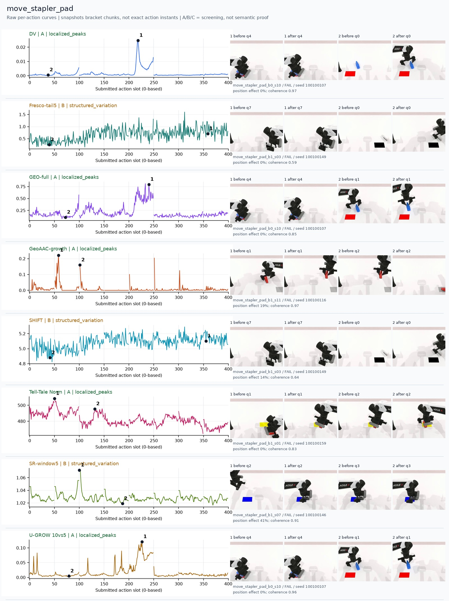
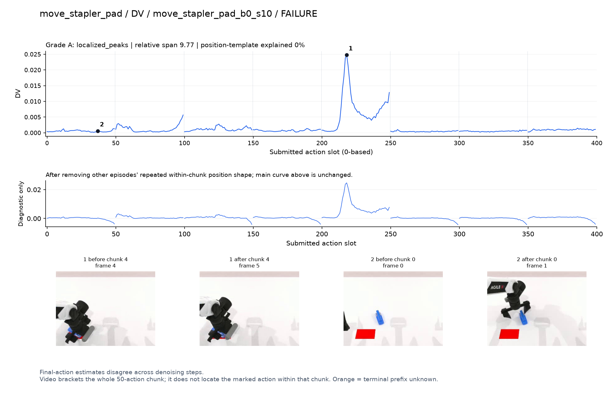
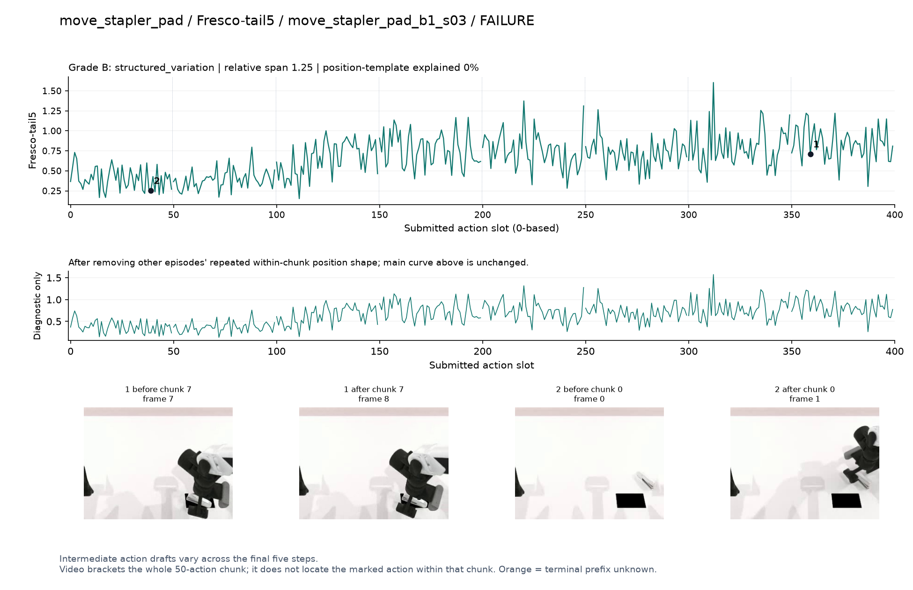
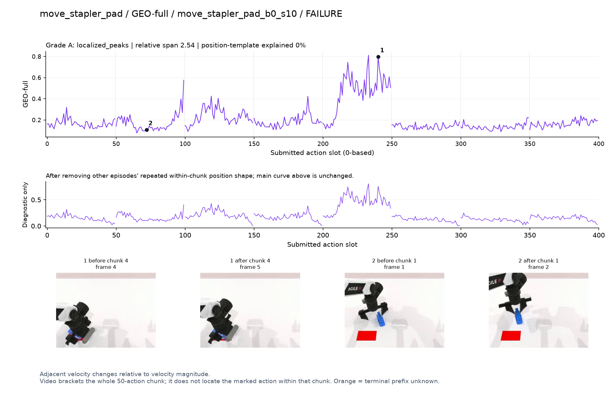
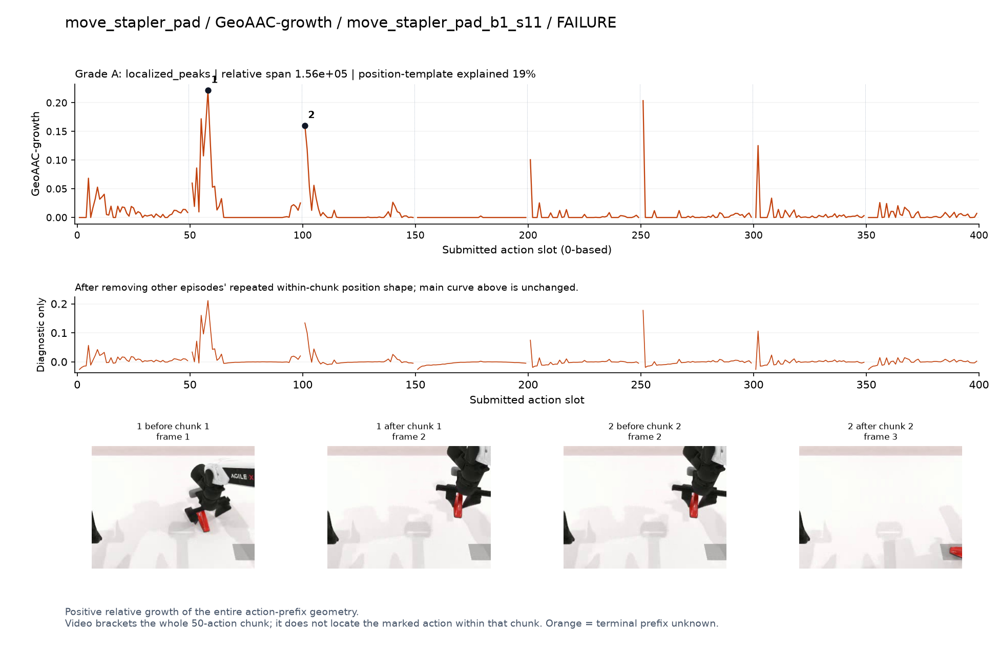
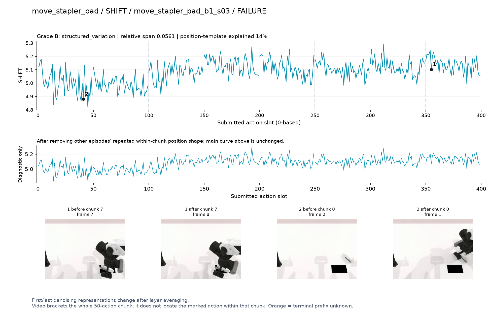
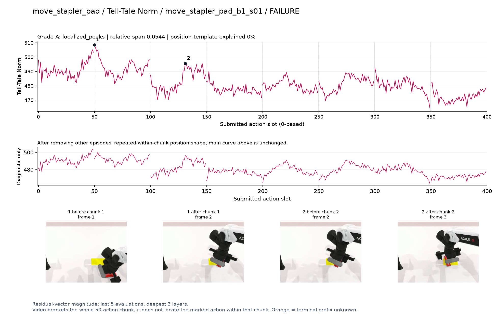
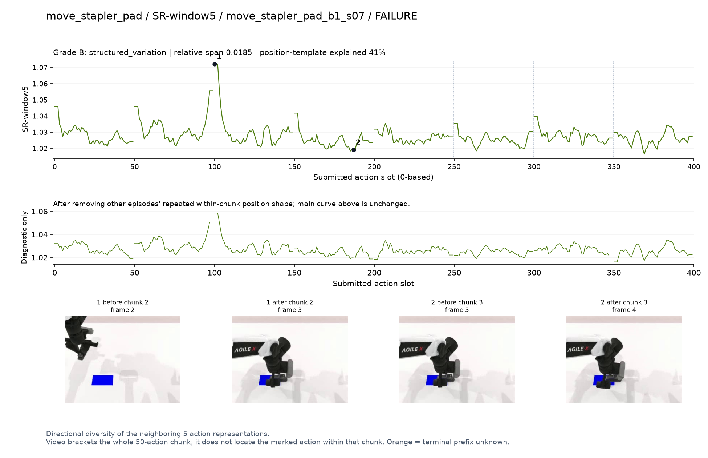
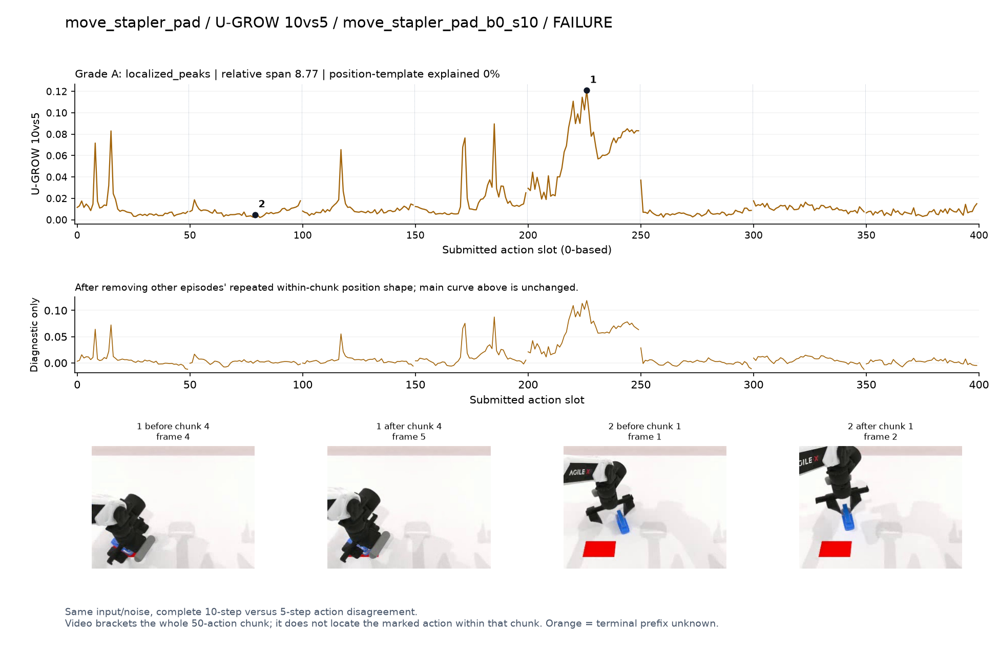

# move_stapler_pad

[全部任务](../README.md#全部任务) · [按信号看](../README.md#按信号看)

主图保留逐动作原始值；细虚线为chunk边界，橙色为终止段实际执行长度不明，未用于筛选。帧只对应chunk前后，不能精确定位某个h的接触瞬间。A/B/C是形态筛选等级，优先读人工备注。

## DV

**可解释候选**：失败例候选：q4手持订书机在垫子附近操作时孤立强峰。

轨迹 `move_stapler_pad_b0_s10`；失败例：该任务没有成功轨迹；种子 `100100107`；正式验收。

[PNG原图](../figures/move_stapler_pad/dv.png) · [SVG矢量图](../figures/move_stapler_pad/dv.svg) · [完整元数据](../entries/move_stapler_pad/dv.json)

对应帧：[1 before q4](../frames/move_stapler_pad/move_stapler_pad_b0_s10/f004.jpg) · [1 after q4](../frames/move_stapler_pad/move_stapler_pad_b0_s10/f005.jpg) · [2 before q0](../frames/move_stapler_pad/move_stapler_pad_b0_s10/f000.jpg) · [2 after q0](../frames/move_stapler_pad/move_stapler_pad_b0_s10/f001.jpg)

## Fresco-tail5

**较弱**：弱：逐动作抖动较密，未见可靠独立事件对应；全数据与噪声到最终动作距离高度相关。

轨迹 `move_stapler_pad_b1_s03`；失败例：该任务没有成功轨迹；种子 `100100149`；正式验收。

[PNG原图](../figures/move_stapler_pad/fresco.png) · [SVG矢量图](../figures/move_stapler_pad/fresco.svg) · [完整元数据](../entries/move_stapler_pad/fresco.json)

对应帧：[1 before q7](../frames/move_stapler_pad/move_stapler_pad_b1_s03/f007.jpg) · [1 after q7](../frames/move_stapler_pad/move_stapler_pad_b1_s03/f008.jpg) · [2 before q0](../frames/move_stapler_pad/move_stapler_pad_b1_s03/f000.jpg) · [2 after q0](../frames/move_stapler_pad/move_stapler_pad_b1_s03/f001.jpg)

## GEO-full

**可解释候选**：失败例候选：同轨迹q4明显宽峰。

轨迹 `move_stapler_pad_b0_s10`；失败例：该任务没有成功轨迹；种子 `100100107`；正式验收。

[PNG原图](../figures/move_stapler_pad/geo.png) · [SVG矢量图](../figures/move_stapler_pad/geo.svg) · [完整元数据](../entries/move_stapler_pad/geo.json)

对应帧：[1 before q4](../frames/move_stapler_pad/move_stapler_pad_b0_s10/f004.jpg) · [1 after q4](../frames/move_stapler_pad/move_stapler_pad_b0_s10/f005.jpg) · [2 before q1](../frames/move_stapler_pad/move_stapler_pad_b0_s10/f001.jpg) · [2 after q1](../frames/move_stapler_pad/move_stapler_pad_b0_s10/f002.jpg)

## GeoAAC-growth

**受其他因素影响**：谨慎：q1/q2搬运订书机时峰靠近chunk开头。

轨迹 `move_stapler_pad_b1_s11`；失败例：该任务没有成功轨迹；种子 `100100116`；正式验收。

[PNG原图](../figures/move_stapler_pad/geoaac.png) · [SVG矢量图](../figures/move_stapler_pad/geoaac.svg) · [完整元数据](../entries/move_stapler_pad/geoaac.json)

对应帧：[1 before q1](../frames/move_stapler_pad/move_stapler_pad_b1_s11/f001.jpg) · [1 after q1](../frames/move_stapler_pad/move_stapler_pad_b1_s11/f002.jpg) · [2 before q2](../frames/move_stapler_pad/move_stapler_pad_b1_s11/f002.jpg) · [2 after q2](../frames/move_stapler_pad/move_stapler_pad_b1_s11/f003.jpg)

## SHIFT

**较弱**：弱：小幅抖动/阶段基线变化，未见可靠独立事件对应；路径长度混杂强。

轨迹 `move_stapler_pad_b1_s03`；失败例：该任务没有成功轨迹；种子 `100100149`；正式验收。

[PNG原图](../figures/move_stapler_pad/shift.png) · [SVG矢量图](../figures/move_stapler_pad/shift.svg) · [完整元数据](../entries/move_stapler_pad/shift.json)

对应帧：[1 before q7](../frames/move_stapler_pad/move_stapler_pad_b1_s03/f007.jpg) · [1 after q7](../frames/move_stapler_pad/move_stapler_pad_b1_s03/f008.jpg) · [2 before q0](../frames/move_stapler_pad/move_stapler_pad_b1_s03/f000.jpg) · [2 after q0](../frames/move_stapler_pad/move_stapler_pad_b1_s03/f001.jpg)

## Tell-Tale Norm

**阶段变化**：失败例阶段差异：搬运订书机的q1/q2幅度较高。

轨迹 `move_stapler_pad_b1_s01`；失败例：该任务没有成功轨迹；种子 `100100159`；正式验收。

[PNG原图](../figures/move_stapler_pad/norm.png) · [SVG矢量图](../figures/move_stapler_pad/norm.svg) · [完整元数据](../entries/move_stapler_pad/norm.json)

对应帧：[1 before q1](../frames/move_stapler_pad/move_stapler_pad_b1_s01/f001.jpg) · [1 after q1](../frames/move_stapler_pad/move_stapler_pad_b1_s01/f002.jpg) · [2 before q2](../frames/move_stapler_pad/move_stapler_pad_b1_s01/f002.jpg) · [2 after q2](../frames/move_stapler_pad/move_stapler_pad_b1_s01/f003.jpg)

## SR-window5

**较弱**：弱：q2首部峰突出，但边界效应强。

轨迹 `move_stapler_pad_b1_s07`；失败例：该任务没有成功轨迹；种子 `100100146`；正式验收。

[PNG原图](../figures/move_stapler_pad/sr.png) · [SVG矢量图](../figures/move_stapler_pad/sr.svg) · [完整元数据](../entries/move_stapler_pad/sr.json)

对应帧：[1 before q2](../frames/move_stapler_pad/move_stapler_pad_b1_s07/f002.jpg) · [1 after q2](../frames/move_stapler_pad/move_stapler_pad_b1_s07/f003.jpg) · [2 before q3](../frames/move_stapler_pad/move_stapler_pad_b1_s07/f003.jpg) · [2 after q3](../frames/move_stapler_pad/move_stapler_pad_b1_s07/f004.jpg)

## U-GROW 10vs5

**可解释候选**：失败例候选：同DV轨迹q4集中升高。

轨迹 `move_stapler_pad_b0_s10`；失败例：该任务没有成功轨迹；种子 `100100107`；正式验收。

[PNG原图](../figures/move_stapler_pad/ugrow.png) · [SVG矢量图](../figures/move_stapler_pad/ugrow.svg) · [完整元数据](../entries/move_stapler_pad/ugrow.json)

对应帧：[1 before q4](../frames/move_stapler_pad/move_stapler_pad_b0_s10/f004.jpg) · [1 after q4](../frames/move_stapler_pad/move_stapler_pad_b0_s10/f005.jpg) · [2 before q1](../frames/move_stapler_pad/move_stapler_pad_b0_s10/f001.jpg) · [2 after q1](../frames/move_stapler_pad/move_stapler_pad_b0_s10/f002.jpg)
