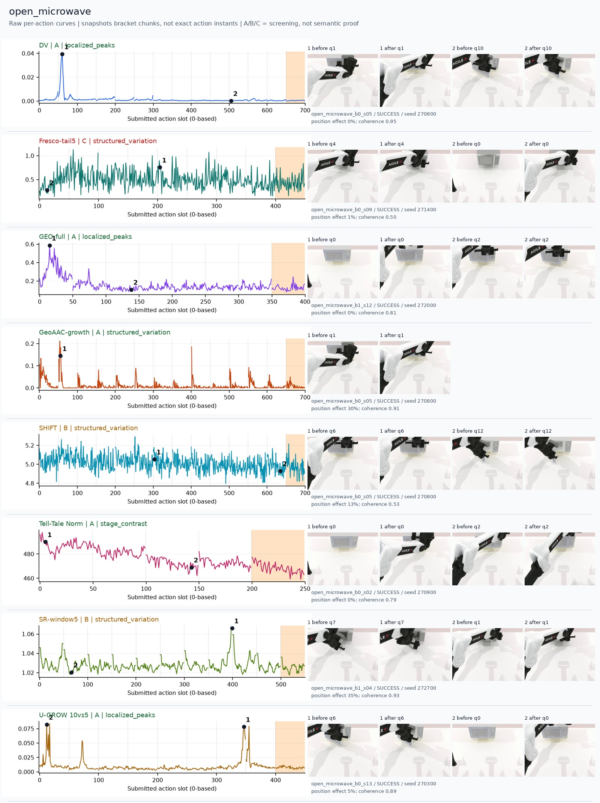
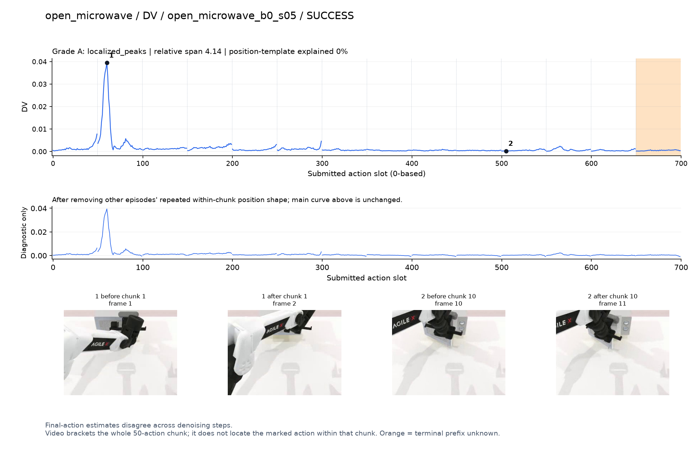
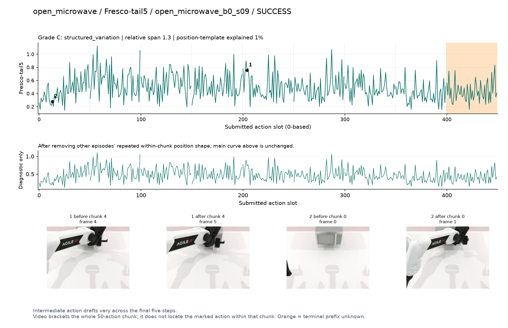
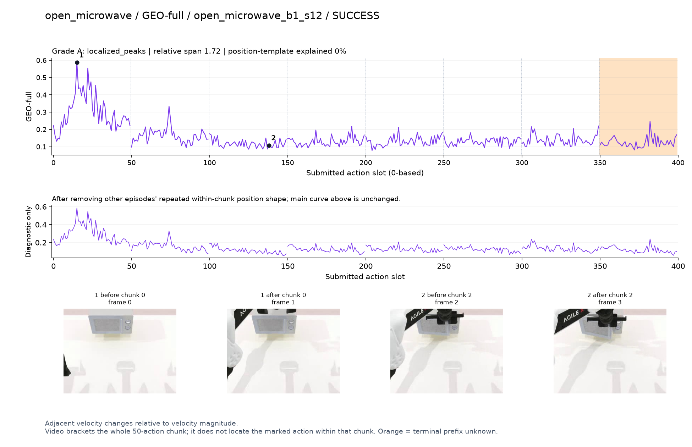
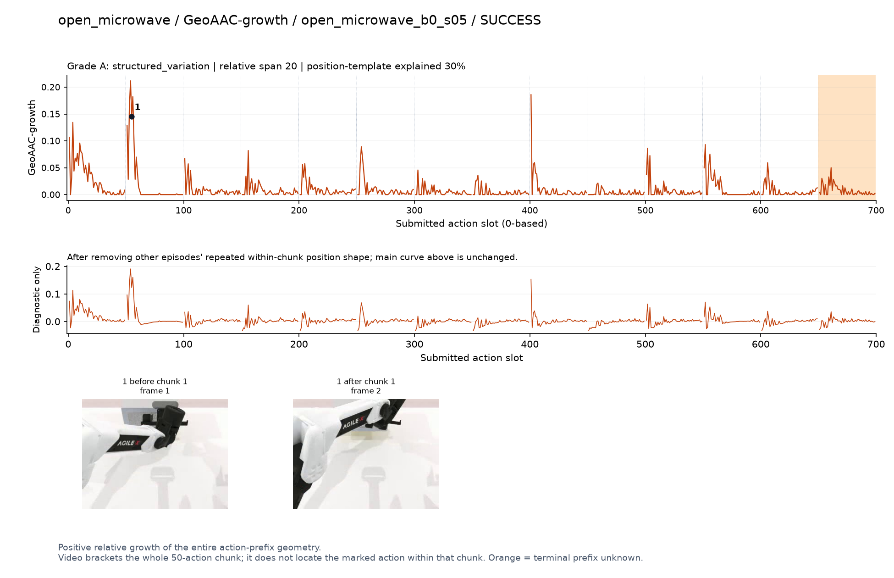
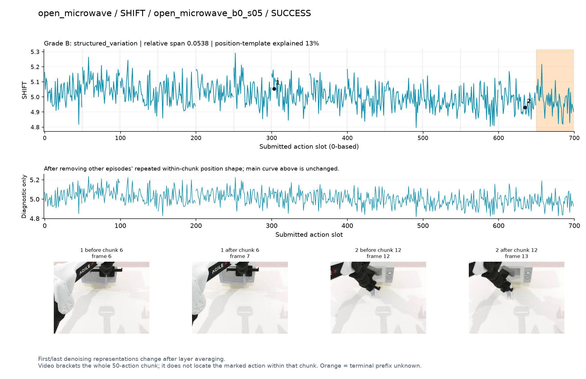
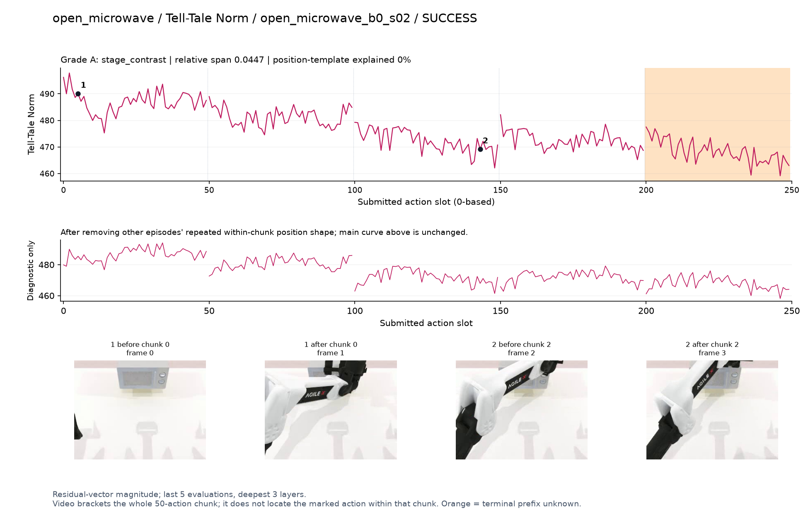
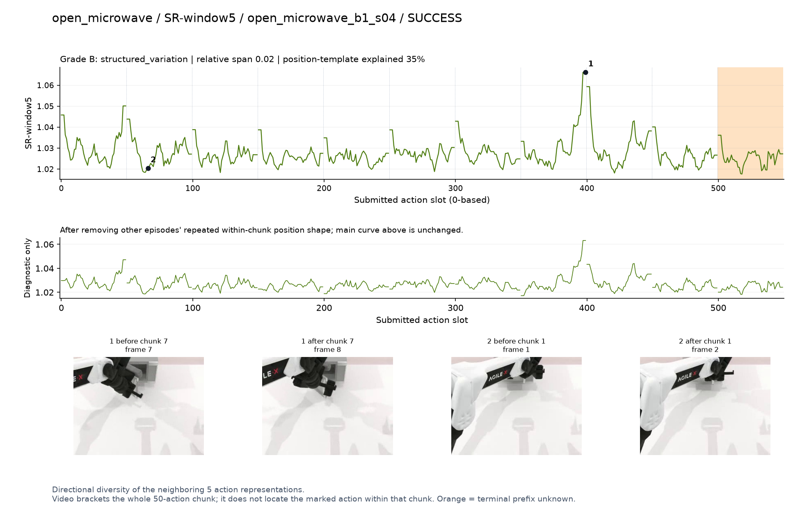
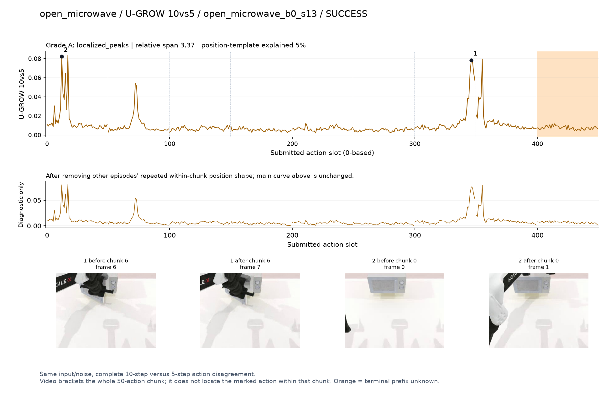

# open_microwave

[全部任务](../README.md#全部任务) · [按信号看](../README.md#按信号看)

主图保留逐动作原始值；细虚线为chunk边界，橙色为终止段实际执行长度不明，未用于筛选。帧只对应chunk前后，不能精确定位某个h的接触瞬间。A/B/C是形态筛选等级，优先读人工备注。

## DV

**可解释候选**：候选：q1抓住门侧并拉动时孤立强峰。

轨迹 `open_microwave_b0_s05`；成功；种子 `270800`；正式验收。

[PNG原图](../figures/open_microwave/dv.png) · [SVG矢量图](../figures/open_microwave/dv.svg) · [完整元数据](../entries/open_microwave/dv.json)

对应帧：[1 before q1](../frames/open_microwave/open_microwave_b0_s05/f001.jpg) · [1 after q1](../frames/open_microwave/open_microwave_b0_s05/f002.jpg) · [2 before q10](../frames/open_microwave/open_microwave_b0_s05/f010.jpg) · [2 after q10](../frames/open_microwave/open_microwave_b0_s05/f011.jpg)

## Fresco-tail5

**较弱**：弱：逐动作抖动较密，未见可靠独立事件对应；全数据与噪声到最终动作距离高度相关。

轨迹 `open_microwave_b0_s09`；成功；种子 `271400`；正式验收。

[PNG原图](../figures/open_microwave/fresco.png) · [SVG矢量图](../figures/open_microwave/fresco.svg) · [完整元数据](../entries/open_microwave/fresco.json)

对应帧：[1 before q4](../frames/open_microwave/open_microwave_b0_s09/f004.jpg) · [1 after q4](../frames/open_microwave/open_microwave_b0_s09/f005.jpg) · [2 before q0](../frames/open_microwave/open_microwave_b0_s09/f000.jpg) · [2 after q0](../frames/open_microwave/open_microwave_b0_s09/f001.jpg)

## GEO-full

**可解释候选**：候选：q0接近微波炉门/把手时高，后续较低。

轨迹 `open_microwave_b1_s12`；成功；种子 `272000`；正式验收。

[PNG原图](../figures/open_microwave/geo.png) · [SVG矢量图](../figures/open_microwave/geo.svg) · [完整元数据](../entries/open_microwave/geo.json)

对应帧：[1 before q0](../frames/open_microwave/open_microwave_b1_s12/f000.jpg) · [1 after q0](../frames/open_microwave/open_microwave_b1_s12/f001.jpg) · [2 before q2](../frames/open_microwave/open_microwave_b1_s12/f002.jpg) · [2 after q2](../frames/open_microwave/open_microwave_b1_s12/f003.jpg)

## GeoAAC-growth

**较弱**：弱：贯穿整条轨迹的chunk前段尖峰，不能当作多次开门事件。

轨迹 `open_microwave_b0_s05`；成功；种子 `270800`；正式验收。

[PNG原图](../figures/open_microwave/geoaac.png) · [SVG矢量图](../figures/open_microwave/geoaac.svg) · [完整元数据](../entries/open_microwave/geoaac.json)

对应帧：[1 before q1](../frames/open_microwave/open_microwave_b0_s05/f001.jpg) · [1 after q1](../frames/open_microwave/open_microwave_b0_s05/f002.jpg)

## SHIFT

**较弱**：弱：小幅抖动/阶段基线变化，未见可靠独立事件对应；路径长度混杂强。

轨迹 `open_microwave_b0_s05`；成功；种子 `270800`；正式验收。

[PNG原图](../figures/open_microwave/shift.png) · [SVG矢量图](../figures/open_microwave/shift.svg) · [完整元数据](../entries/open_microwave/shift.json)

对应帧：[1 before q6](../frames/open_microwave/open_microwave_b0_s05/f006.jpg) · [1 after q6](../frames/open_microwave/open_microwave_b0_s05/f007.jpg) · [2 before q12](../frames/open_microwave/open_microwave_b0_s05/f012.jpg) · [2 after q12](../frames/open_microwave/open_microwave_b0_s05/f013.jpg)

## Tell-Tale Norm

**阶段变化**：阶段差异：初始靠近时高，持续操作后整体较低。

轨迹 `open_microwave_b0_s02`；成功；种子 `270900`；正式验收。

[PNG原图](../figures/open_microwave/norm.png) · [SVG矢量图](../figures/open_microwave/norm.svg) · [完整元数据](../entries/open_microwave/norm.json)

对应帧：[1 before q0](../frames/open_microwave/open_microwave_b0_s02/f000.jpg) · [1 after q0](../frames/open_microwave/open_microwave_b0_s02/f001.jpg) · [2 before q2](../frames/open_microwave/open_microwave_b0_s02/f002.jpg) · [2 after q2](../frames/open_microwave/open_microwave_b0_s02/f003.jpg)

## SR-window5

**较弱**：弱：周期性边界峰，最高点不能单独解释为开门。

轨迹 `open_microwave_b1_s04`；成功；种子 `272700`；正式验收。

[PNG原图](../figures/open_microwave/sr.png) · [SVG矢量图](../figures/open_microwave/sr.svg) · [完整元数据](../entries/open_microwave/sr.json)

对应帧：[1 before q7](../frames/open_microwave/open_microwave_b1_s04/f007.jpg) · [1 after q7](../frames/open_microwave/open_microwave_b1_s04/f008.jpg) · [2 before q1](../frames/open_microwave/open_microwave_b1_s04/f001.jpg) · [2 after q1](../frames/open_microwave/open_microwave_b1_s04/f002.jpg)

## U-GROW 10vs5

**可解释候选**：候选：q0接近及q6门侧调整都有峰，开门瞬间无法定位。

轨迹 `open_microwave_b0_s13`；成功；种子 `270300`；正式验收。

[PNG原图](../figures/open_microwave/ugrow.png) · [SVG矢量图](../figures/open_microwave/ugrow.svg) · [完整元数据](../entries/open_microwave/ugrow.json)

对应帧：[1 before q6](../frames/open_microwave/open_microwave_b0_s13/f006.jpg) · [1 after q6](../frames/open_microwave/open_microwave_b0_s13/f007.jpg) · [2 before q0](../frames/open_microwave/open_microwave_b0_s13/f000.jpg) · [2 after q0](../frames/open_microwave/open_microwave_b0_s13/f001.jpg)
