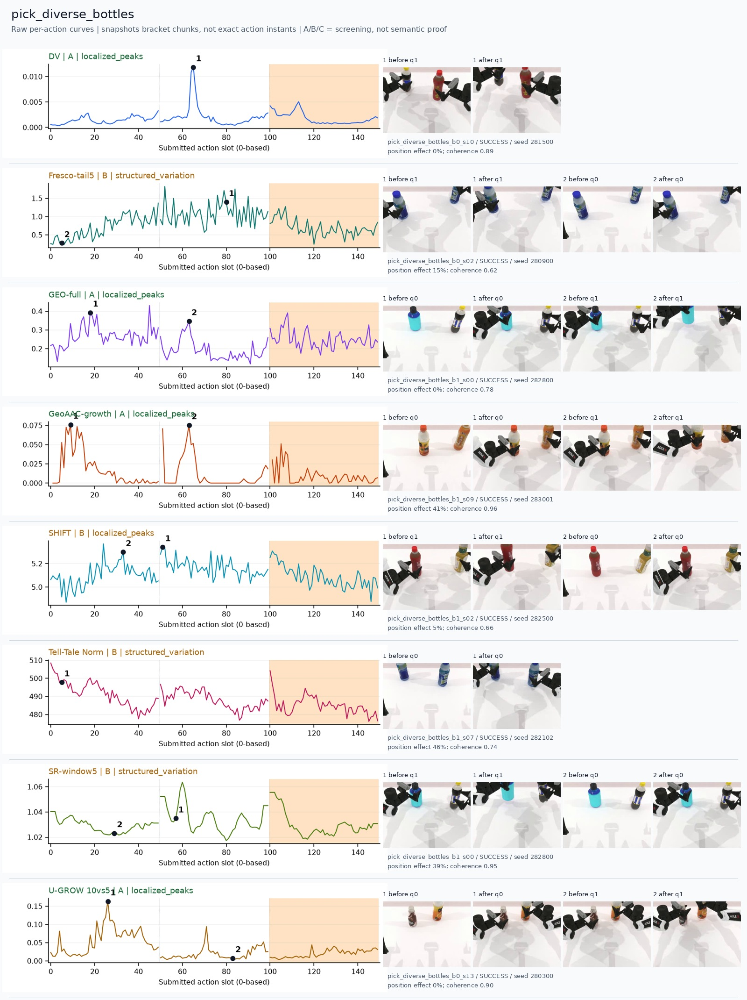
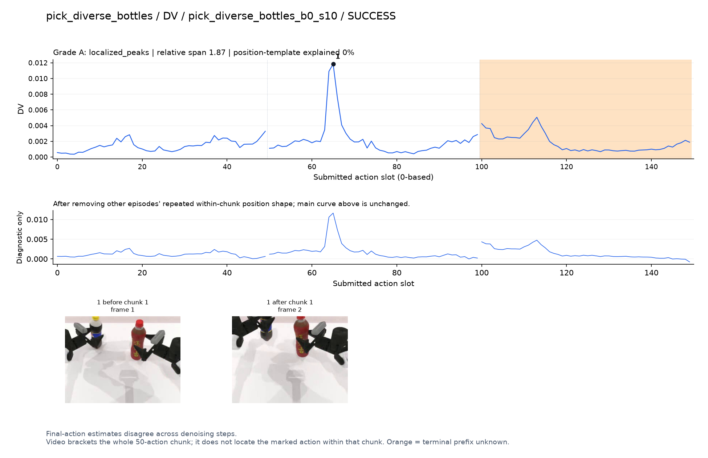
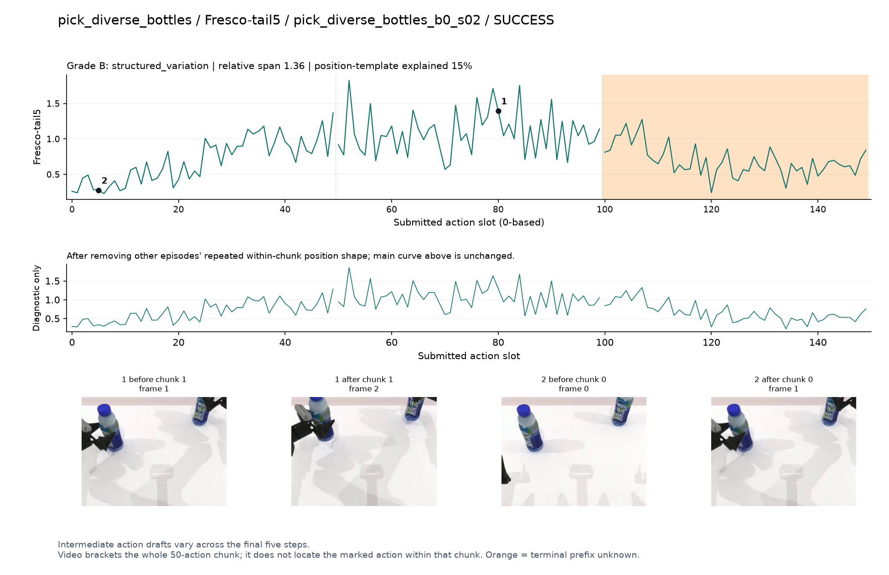
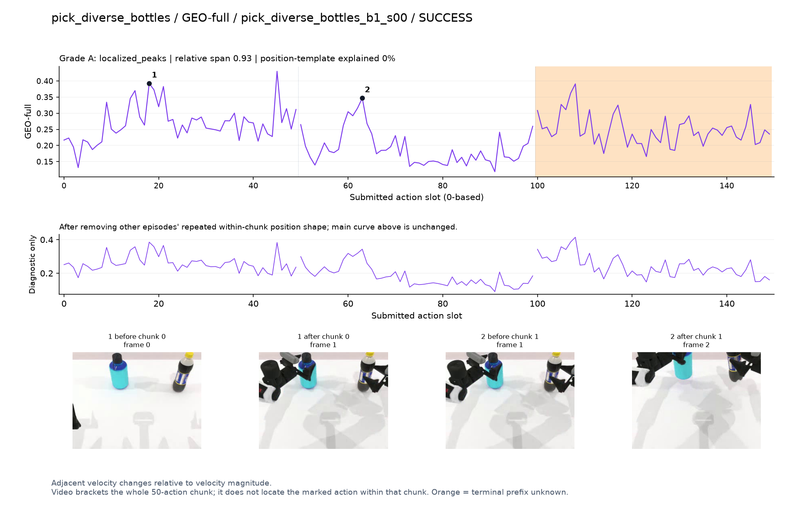
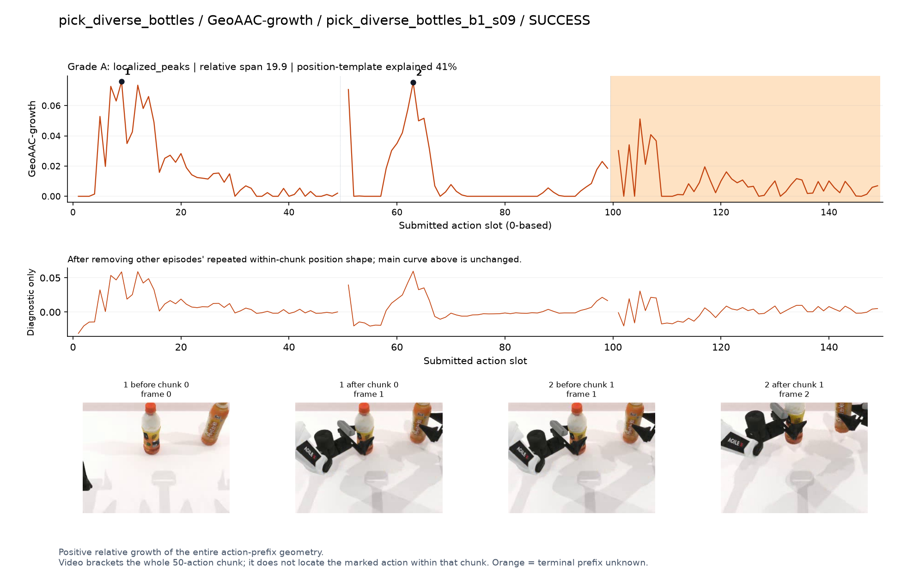
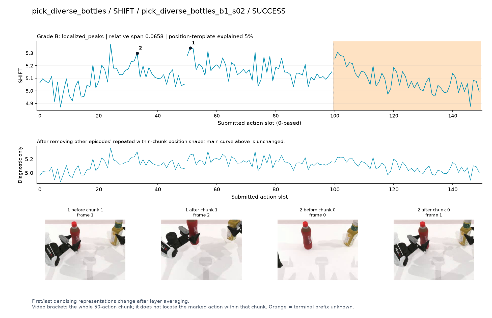
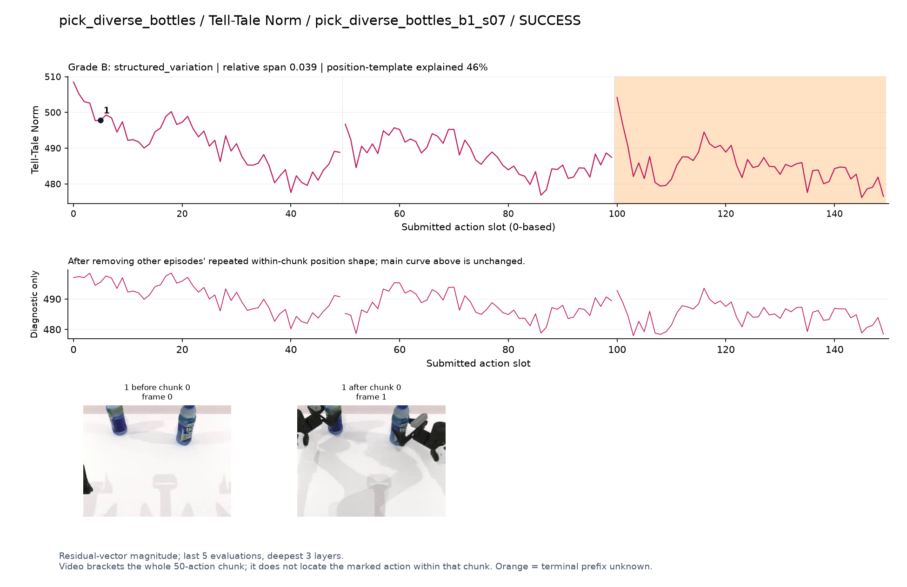
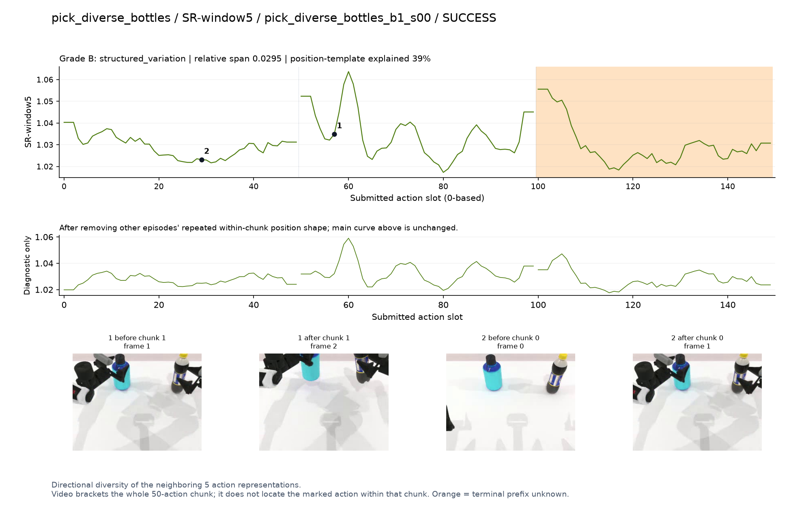
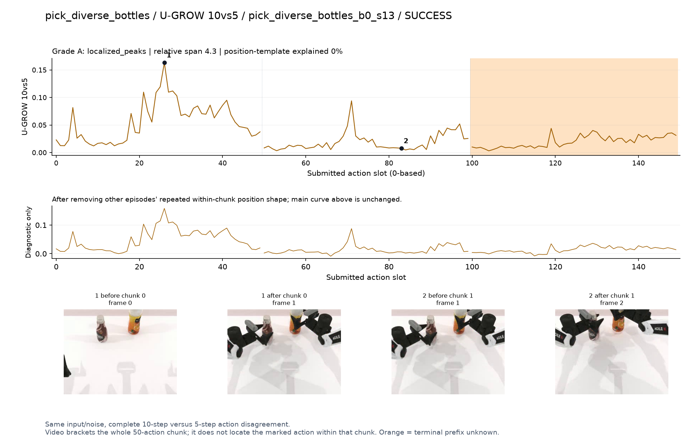

# pick_diverse_bottles

[全部任务](../README.md#全部任务) · [按信号看](../README.md#按信号看)

主图保留逐动作原始值；细虚线为chunk边界，橙色为终止段实际执行长度不明，未用于筛选。帧只对应chunk前后，不能精确定位某个h的接触瞬间。A/B/C是形态筛选等级，优先读人工备注。

## DV

**可解释候选**：候选：q1瓶子从被夹住到抬离桌面时孤立峰。

轨迹 `pick_diverse_bottles_b0_s10`；成功；种子 `281500`；正式验收。

[PNG原图](../figures/pick_diverse_bottles/dv.png) · [SVG矢量图](../figures/pick_diverse_bottles/dv.svg) · [完整元数据](../entries/pick_diverse_bottles/dv.json)

对应帧：[1 before q1](../frames/pick_diverse_bottles/pick_diverse_bottles_b0_s10/f001.jpg) · [1 after q1](../frames/pick_diverse_bottles/pick_diverse_bottles_b0_s10/f002.jpg)

## Fresco-tail5

**较弱**：弱：逐动作抖动较密，未见可靠独立事件对应；全数据与噪声到最终动作距离高度相关。

轨迹 `pick_diverse_bottles_b0_s02`；成功；种子 `280900`；正式验收。

[PNG原图](../figures/pick_diverse_bottles/fresco.png) · [SVG矢量图](../figures/pick_diverse_bottles/fresco.svg) · [完整元数据](../entries/pick_diverse_bottles/fresco.json)

对应帧：[1 before q1](../frames/pick_diverse_bottles/pick_diverse_bottles_b0_s02/f001.jpg) · [1 after q1](../frames/pick_diverse_bottles/pick_diverse_bottles_b0_s02/f002.jpg) · [2 before q0](../frames/pick_diverse_bottles/pick_diverse_bottles_b0_s02/f000.jpg) · [2 after q0](../frames/pick_diverse_bottles/pick_diverse_bottles_b0_s02/f001.jpg)

## GEO-full

**可解释候选**：阶段候选：q0接近、q1提瓶各有高区。

轨迹 `pick_diverse_bottles_b1_s00`；成功；种子 `282800`；正式验收。

[PNG原图](../figures/pick_diverse_bottles/geo.png) · [SVG矢量图](../figures/pick_diverse_bottles/geo.svg) · [完整元数据](../entries/pick_diverse_bottles/geo.json)

对应帧：[1 before q0](../frames/pick_diverse_bottles/pick_diverse_bottles_b1_s00/f000.jpg) · [1 after q0](../frames/pick_diverse_bottles/pick_diverse_bottles_b1_s00/f001.jpg) · [2 before q1](../frames/pick_diverse_bottles/pick_diverse_bottles_b1_s00/f001.jpg) · [2 after q1](../frames/pick_diverse_bottles/pick_diverse_bottles_b1_s00/f002.jpg)

## GeoAAC-growth

**受其他因素影响**：谨慎：接近/提瓶两段较高，但每段前部天然偏高。

轨迹 `pick_diverse_bottles_b1_s09`；成功；种子 `283001`；正式验收。

[PNG原图](../figures/pick_diverse_bottles/geoaac.png) · [SVG矢量图](../figures/pick_diverse_bottles/geoaac.svg) · [完整元数据](../entries/pick_diverse_bottles/geoaac.json)

对应帧：[1 before q0](../frames/pick_diverse_bottles/pick_diverse_bottles_b1_s09/f000.jpg) · [1 after q0](../frames/pick_diverse_bottles/pick_diverse_bottles_b1_s09/f001.jpg) · [2 before q1](../frames/pick_diverse_bottles/pick_diverse_bottles_b1_s09/f001.jpg) · [2 after q1](../frames/pick_diverse_bottles/pick_diverse_bottles_b1_s09/f002.jpg)

## SHIFT

**较弱**：弱：小幅抖动/阶段基线变化，未见可靠独立事件对应；路径长度混杂强。

轨迹 `pick_diverse_bottles_b1_s02`；成功；种子 `282500`；正式验收。

[PNG原图](../figures/pick_diverse_bottles/shift.png) · [SVG矢量图](../figures/pick_diverse_bottles/shift.svg) · [完整元数据](../entries/pick_diverse_bottles/shift.json)

对应帧：[1 before q1](../frames/pick_diverse_bottles/pick_diverse_bottles_b1_s02/f001.jpg) · [1 after q1](../frames/pick_diverse_bottles/pick_diverse_bottles_b1_s02/f002.jpg) · [2 before q0](../frames/pick_diverse_bottles/pick_diverse_bottles_b1_s02/f000.jpg) · [2 after q0](../frames/pick_diverse_bottles/pick_diverse_bottles_b1_s02/f001.jpg)

## Tell-Tale Norm

**较弱**：弱：缓慢幅度变化叠加chunk开头高值，事件分辨较弱。

轨迹 `pick_diverse_bottles_b1_s07`；成功；种子 `282102`；正式验收。

[PNG原图](../figures/pick_diverse_bottles/norm.png) · [SVG矢量图](../figures/pick_diverse_bottles/norm.svg) · [完整元数据](../entries/pick_diverse_bottles/norm.json)

对应帧：[1 before q0](../frames/pick_diverse_bottles/pick_diverse_bottles_b1_s07/f000.jpg) · [1 after q0](../frames/pick_diverse_bottles/pick_diverse_bottles_b1_s07/f001.jpg)

## SR-window5

**受其他因素影响**：谨慎：q1内部提瓶附近有峰，同时存在固定边缘变化。

轨迹 `pick_diverse_bottles_b1_s00`；成功；种子 `282800`；正式验收。

[PNG原图](../figures/pick_diverse_bottles/sr.png) · [SVG矢量图](../figures/pick_diverse_bottles/sr.svg) · [完整元数据](../entries/pick_diverse_bottles/sr.json)

对应帧：[1 before q1](../frames/pick_diverse_bottles/pick_diverse_bottles_b1_s00/f001.jpg) · [1 after q1](../frames/pick_diverse_bottles/pick_diverse_bottles_b1_s00/f002.jpg) · [2 before q0](../frames/pick_diverse_bottles/pick_diverse_bottles_b1_s00/f000.jpg) · [2 after q0](../frames/pick_diverse_bottles/pick_diverse_bottles_b1_s00/f001.jpg)

## U-GROW 10vs5

**可解释候选**：候选：q0双手接近瓶子时集中高区。

轨迹 `pick_diverse_bottles_b0_s13`；成功；种子 `280300`；正式验收。

[PNG原图](../figures/pick_diverse_bottles/ugrow.png) · [SVG矢量图](../figures/pick_diverse_bottles/ugrow.svg) · [完整元数据](../entries/pick_diverse_bottles/ugrow.json)

对应帧：[1 before q0](../frames/pick_diverse_bottles/pick_diverse_bottles_b0_s13/f000.jpg) · [1 after q0](../frames/pick_diverse_bottles/pick_diverse_bottles_b0_s13/f001.jpg) · [2 before q1](../frames/pick_diverse_bottles/pick_diverse_bottles_b0_s13/f001.jpg) · [2 after q1](../frames/pick_diverse_bottles/pick_diverse_bottles_b0_s13/f002.jpg)
