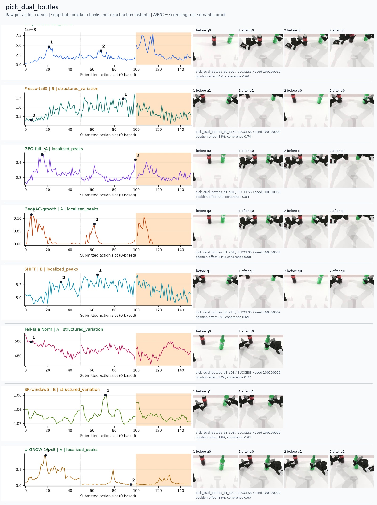
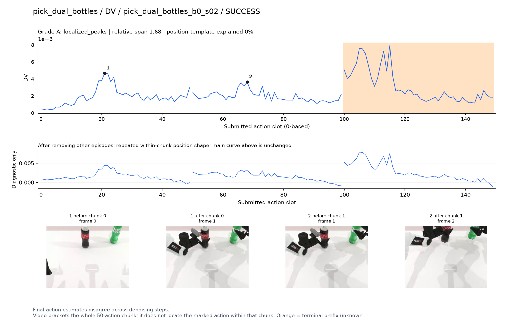
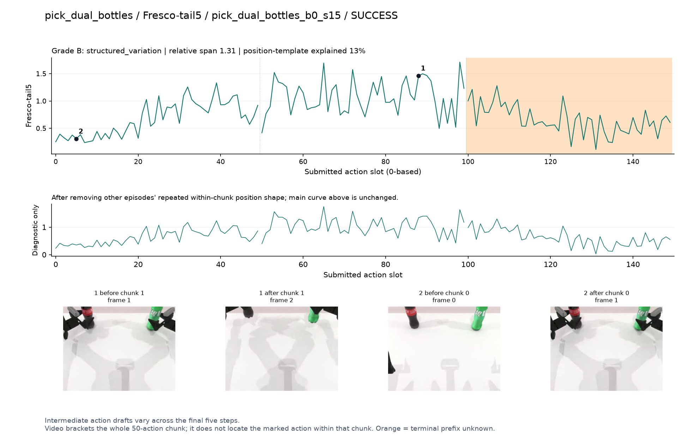
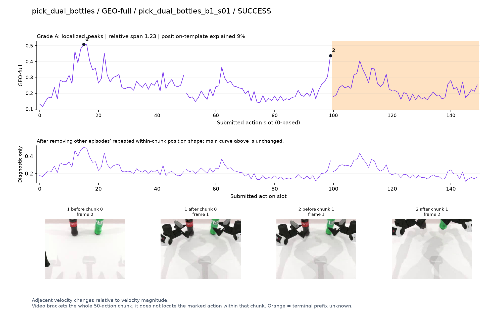
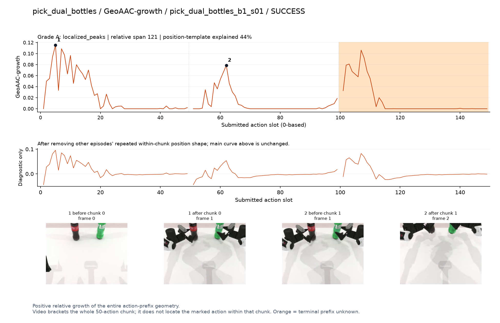
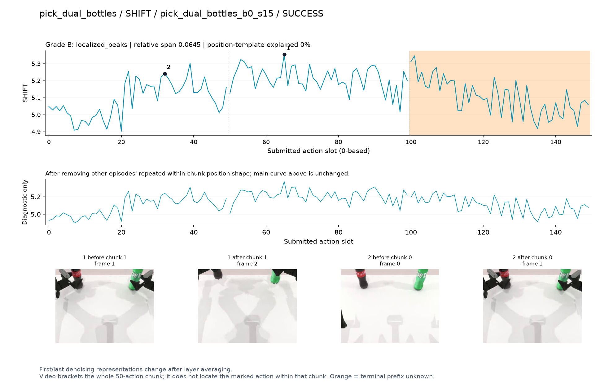
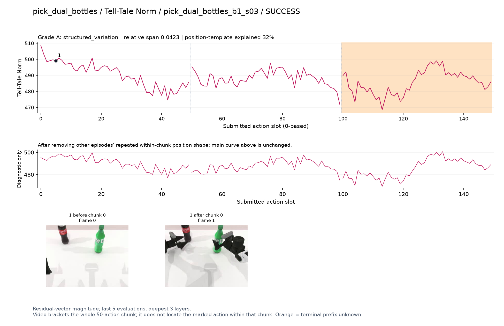
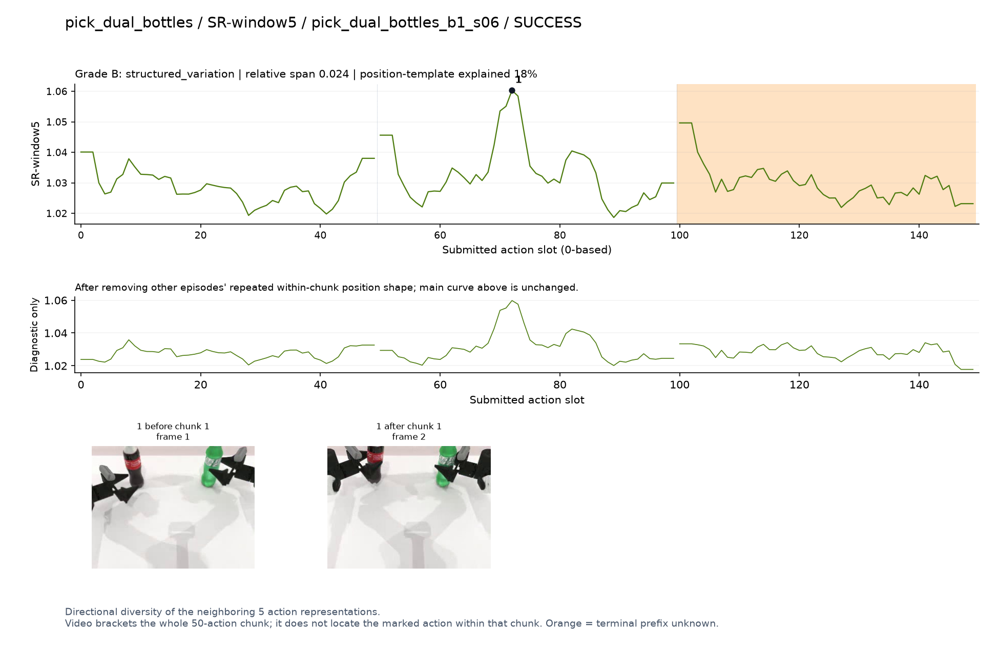
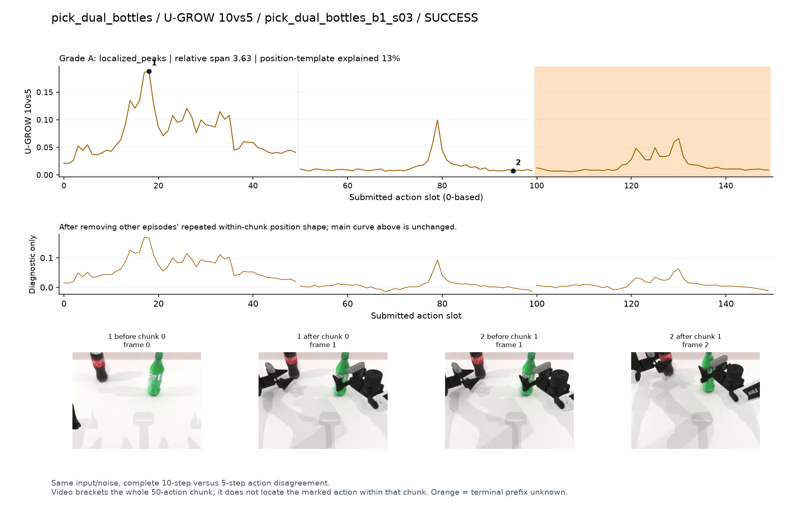

# pick_dual_bottles

[全部任务](../README.md#全部任务) · [按信号看](../README.md#按信号看)

主图保留逐动作原始值；细虚线为chunk边界，橙色为终止段实际执行长度不明，未用于筛选。帧只对应chunk前后，不能精确定位某个h的接触瞬间。A/B/C是形态筛选等级，优先读人工备注。

## DV

**可解释候选**：候选：q0接近与q1提瓶两个小峰；橙色终止段更大峰不用于筛选。

轨迹 `pick_dual_bottles_b0_s02`；成功；种子 `100100010`；正式验收。

[PNG原图](../figures/pick_dual_bottles/dv.png) · [SVG矢量图](../figures/pick_dual_bottles/dv.svg) · [完整元数据](../entries/pick_dual_bottles/dv.json)

对应帧：[1 before q0](../frames/pick_dual_bottles/pick_dual_bottles_b0_s02/f000.jpg) · [1 after q0](../frames/pick_dual_bottles/pick_dual_bottles_b0_s02/f001.jpg) · [2 before q1](../frames/pick_dual_bottles/pick_dual_bottles_b0_s02/f001.jpg) · [2 after q1](../frames/pick_dual_bottles/pick_dual_bottles_b0_s02/f002.jpg)

## Fresco-tail5

**较弱**：弱阶段趋势：接近/提瓶期间宽高区，但路径长度混杂。

轨迹 `pick_dual_bottles_b0_s15`；成功；种子 `100100002`；正式验收。

[PNG原图](../figures/pick_dual_bottles/fresco.png) · [SVG矢量图](../figures/pick_dual_bottles/fresco.svg) · [完整元数据](../entries/pick_dual_bottles/fresco.json)

对应帧：[1 before q1](../frames/pick_dual_bottles/pick_dual_bottles_b0_s15/f001.jpg) · [1 after q1](../frames/pick_dual_bottles/pick_dual_bottles_b0_s15/f002.jpg) · [2 before q0](../frames/pick_dual_bottles/pick_dual_bottles_b0_s15/f000.jpg) · [2 after q0](../frames/pick_dual_bottles/pick_dual_bottles_b0_s15/f001.jpg)

## GEO-full

**可解释候选**：候选：q0双手接近瓶子为主要高区。

轨迹 `pick_dual_bottles_b1_s01`；成功；种子 `100100033`；正式验收。

[PNG原图](../figures/pick_dual_bottles/geo.png) · [SVG矢量图](../figures/pick_dual_bottles/geo.svg) · [完整元数据](../entries/pick_dual_bottles/geo.json)

对应帧：[1 before q0](../frames/pick_dual_bottles/pick_dual_bottles_b1_s01/f000.jpg) · [1 after q0](../frames/pick_dual_bottles/pick_dual_bottles_b1_s01/f001.jpg) · [2 before q1](../frames/pick_dual_bottles/pick_dual_bottles_b1_s01/f001.jpg) · [2 after q1](../frames/pick_dual_bottles/pick_dual_bottles_b1_s01/f002.jpg)

## GeoAAC-growth

**受其他因素影响**：谨慎：q0/q1前部出现双峰，与前缀位置相关。

轨迹 `pick_dual_bottles_b1_s01`；成功；种子 `100100033`；正式验收。

[PNG原图](../figures/pick_dual_bottles/geoaac.png) · [SVG矢量图](../figures/pick_dual_bottles/geoaac.svg) · [完整元数据](../entries/pick_dual_bottles/geoaac.json)

对应帧：[1 before q0](../frames/pick_dual_bottles/pick_dual_bottles_b1_s01/f000.jpg) · [1 after q0](../frames/pick_dual_bottles/pick_dual_bottles_b1_s01/f001.jpg) · [2 before q1](../frames/pick_dual_bottles/pick_dual_bottles_b1_s01/f001.jpg) · [2 after q1](../frames/pick_dual_bottles/pick_dual_bottles_b1_s01/f002.jpg)

## SHIFT

**较弱**：弱阶段趋势：接近/提瓶期间宽高区，抖动与路径长度混杂。

轨迹 `pick_dual_bottles_b0_s15`；成功；种子 `100100002`；正式验收。

[PNG原图](../figures/pick_dual_bottles/shift.png) · [SVG矢量图](../figures/pick_dual_bottles/shift.svg) · [完整元数据](../entries/pick_dual_bottles/shift.json)

对应帧：[1 before q1](../frames/pick_dual_bottles/pick_dual_bottles_b0_s15/f001.jpg) · [1 after q1](../frames/pick_dual_bottles/pick_dual_bottles_b0_s15/f002.jpg) · [2 before q0](../frames/pick_dual_bottles/pick_dual_bottles_b0_s15/f000.jpg) · [2 after q0](../frames/pick_dual_bottles/pick_dual_bottles_b0_s15/f001.jpg)

## Tell-Tale Norm

**较弱**：弱：初段幅度较高但事件区分不明确。

轨迹 `pick_dual_bottles_b1_s03`；成功；种子 `100100029`；正式验收。

[PNG原图](../figures/pick_dual_bottles/norm.png) · [SVG矢量图](../figures/pick_dual_bottles/norm.svg) · [完整元数据](../entries/pick_dual_bottles/norm.json)

对应帧：[1 before q0](../frames/pick_dual_bottles/pick_dual_bottles_b1_s03/f000.jpg) · [1 after q0](../frames/pick_dual_bottles/pick_dual_bottles_b1_s03/f001.jpg)

## SR-window5

**可解释候选**：候选：q1中间提瓶附近局部峰，较少依赖边界。

轨迹 `pick_dual_bottles_b1_s06`；成功；种子 `100100038`；正式验收。

[PNG原图](../figures/pick_dual_bottles/sr.png) · [SVG矢量图](../figures/pick_dual_bottles/sr.svg) · [完整元数据](../entries/pick_dual_bottles/sr.json)

对应帧：[1 before q1](../frames/pick_dual_bottles/pick_dual_bottles_b1_s06/f001.jpg) · [1 after q1](../frames/pick_dual_bottles/pick_dual_bottles_b1_s06/f002.jpg)

## U-GROW 10vs5

**可解释候选**：候选：q0接近两个瓶子时集中升高。

轨迹 `pick_dual_bottles_b1_s03`；成功；种子 `100100029`；正式验收。

[PNG原图](../figures/pick_dual_bottles/ugrow.png) · [SVG矢量图](../figures/pick_dual_bottles/ugrow.svg) · [完整元数据](../entries/pick_dual_bottles/ugrow.json)

对应帧：[1 before q0](../frames/pick_dual_bottles/pick_dual_bottles_b1_s03/f000.jpg) · [1 after q0](../frames/pick_dual_bottles/pick_dual_bottles_b1_s03/f001.jpg) · [2 before q1](../frames/pick_dual_bottles/pick_dual_bottles_b1_s03/f001.jpg) · [2 after q1](../frames/pick_dual_bottles/pick_dual_bottles_b1_s03/f002.jpg)
