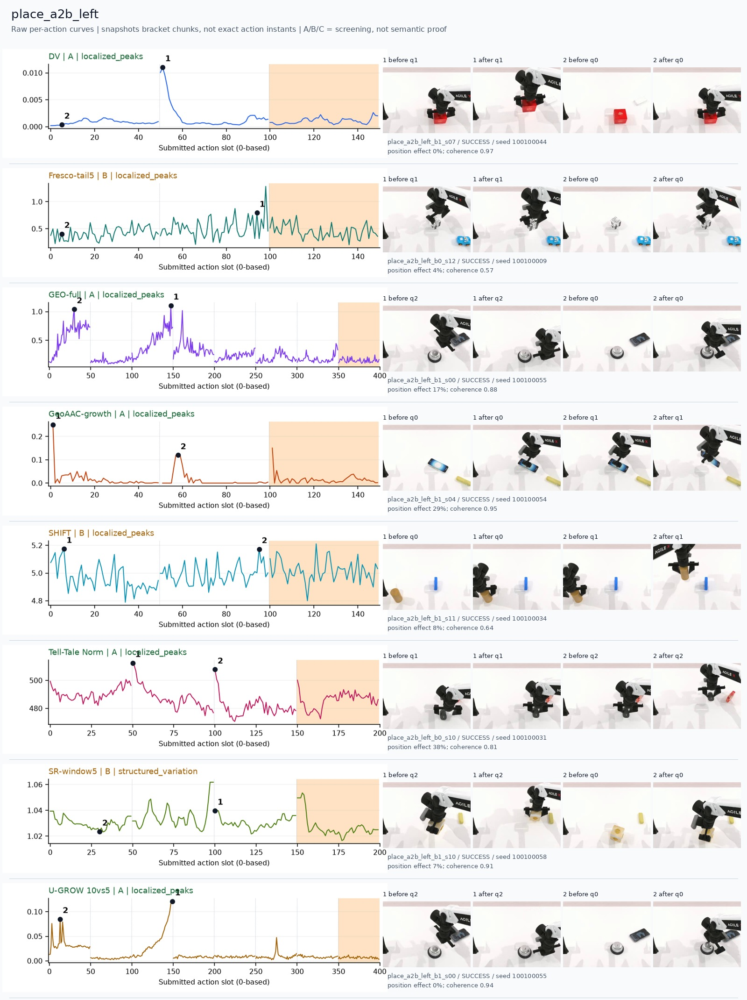
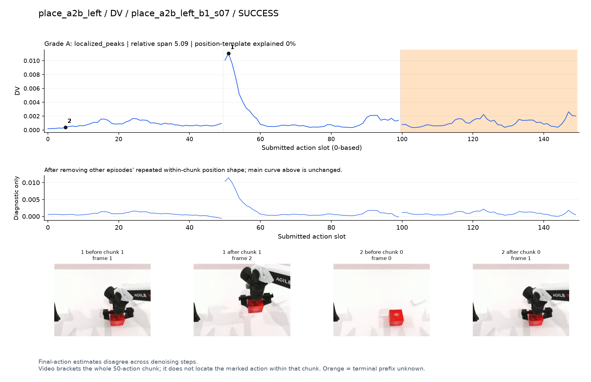
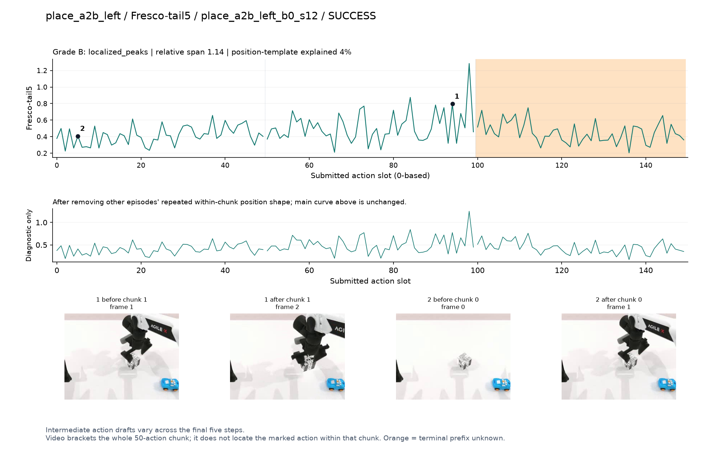
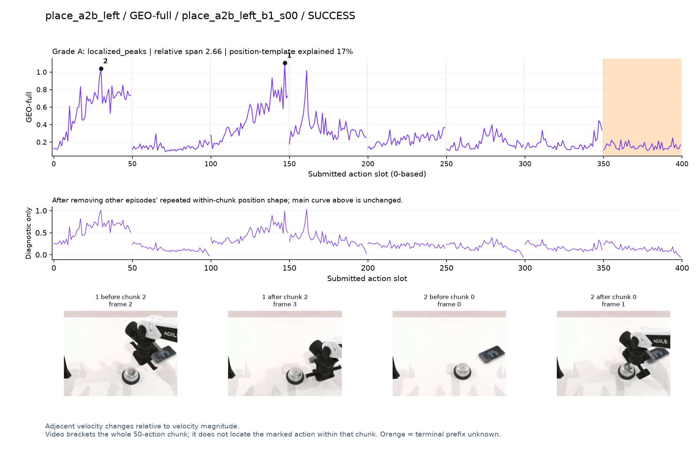
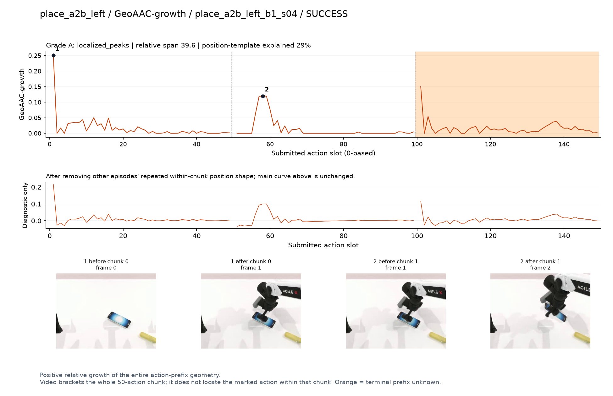
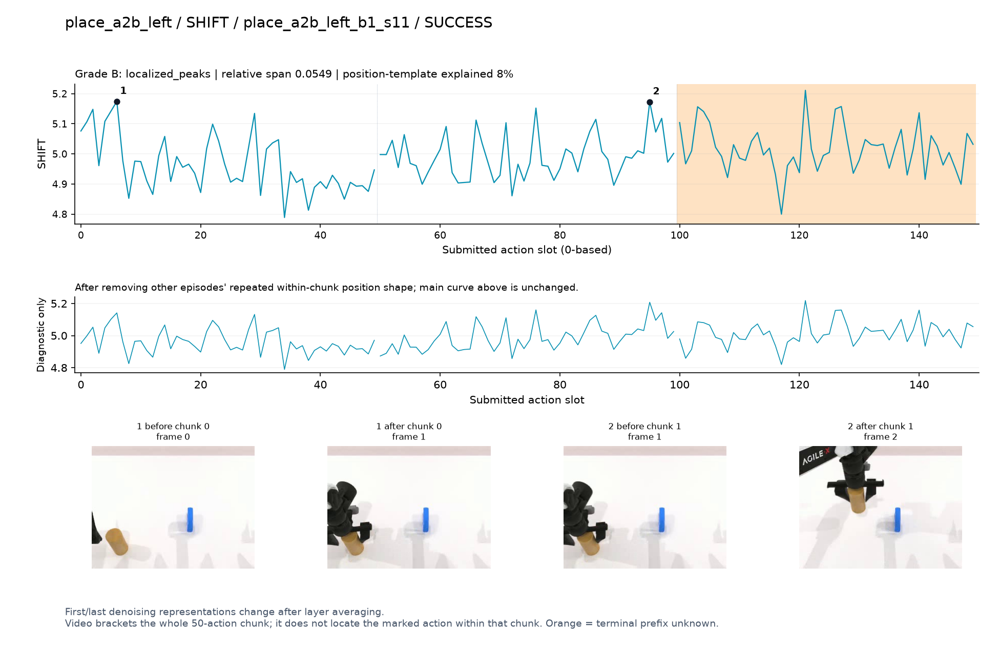
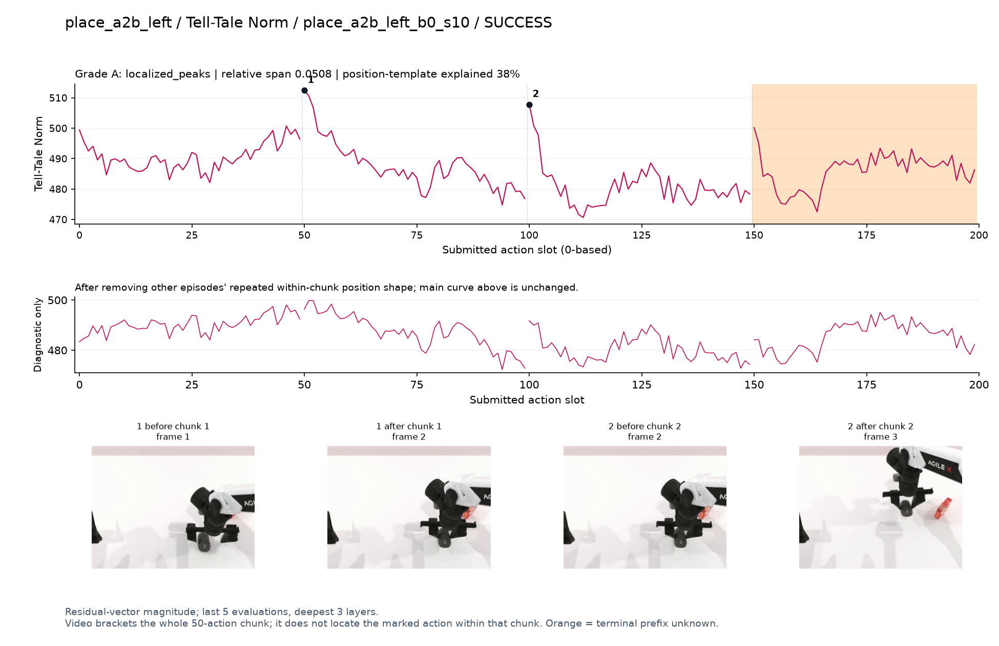
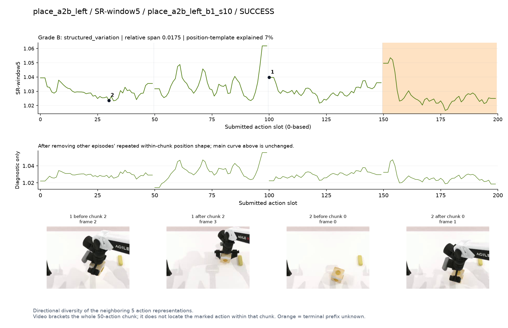
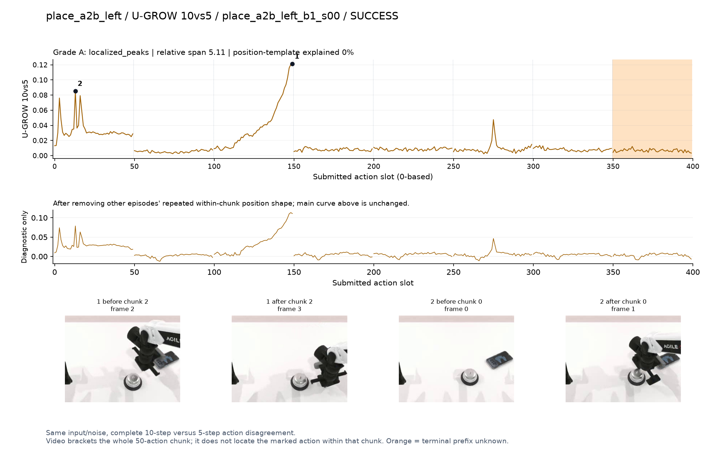

# place_a2b_left

[全部任务](../README.md#全部任务) · [按信号看](../README.md#按信号看)

主图保留逐动作原始值；细虚线为chunk边界，橙色为终止段实际执行长度不明，未用于筛选。帧只对应chunk前后，不能精确定位某个h的接触瞬间。A/B/C是形态筛选等级，优先读人工备注。

## DV

**可解释候选**：候选：q1开始提起方盒时局部强峰；靠近chunk前缘。

轨迹 `place_a2b_left_b1_s07`；成功；种子 `100100044`；正式验收。

[PNG原图](../figures/place_a2b_left/dv.png) · [SVG矢量图](../figures/place_a2b_left/dv.svg) · [完整元数据](../entries/place_a2b_left/dv.json)

对应帧：[1 before q1](../frames/place_a2b_left/place_a2b_left_b1_s07/f001.jpg) · [1 after q1](../frames/place_a2b_left/place_a2b_left_b1_s07/f002.jpg) · [2 before q0](../frames/place_a2b_left/place_a2b_left_b1_s07/f000.jpg) · [2 after q0](../frames/place_a2b_left/place_a2b_left_b1_s07/f001.jpg)

## Fresco-tail5

**较弱**：弱：逐动作抖动较密，未见可靠独立事件对应；全数据与噪声到最终动作距离高度相关。

轨迹 `place_a2b_left_b0_s12`；成功；种子 `100100009`；正式验收。

[PNG原图](../figures/place_a2b_left/fresco.png) · [SVG矢量图](../figures/place_a2b_left/fresco.svg) · [完整元数据](../entries/place_a2b_left/fresco.json)

对应帧：[1 before q1](../frames/place_a2b_left/place_a2b_left_b0_s12/f001.jpg) · [1 after q1](../frames/place_a2b_left/place_a2b_left_b0_s12/f002.jpg) · [2 before q0](../frames/place_a2b_left/place_a2b_left_b0_s12/f000.jpg) · [2 after q0](../frames/place_a2b_left/place_a2b_left_b0_s12/f001.jpg)

## GEO-full

**可解释候选**：候选：q0抓取、q2移向目标附近两个高区。

轨迹 `place_a2b_left_b1_s00`；成功；种子 `100100055`；正式验收。

[PNG原图](../figures/place_a2b_left/geo.png) · [SVG矢量图](../figures/place_a2b_left/geo.svg) · [完整元数据](../entries/place_a2b_left/geo.json)

对应帧：[1 before q2](../frames/place_a2b_left/place_a2b_left_b1_s00/f002.jpg) · [1 after q2](../frames/place_a2b_left/place_a2b_left_b1_s00/f003.jpg) · [2 before q0](../frames/place_a2b_left/place_a2b_left_b1_s00/f000.jpg) · [2 after q0](../frames/place_a2b_left/place_a2b_left_b1_s00/f001.jpg)

## GeoAAC-growth

**较弱**：弱：每chunk前几个动作尖峰，不能独立解释为搬运难度。

轨迹 `place_a2b_left_b1_s04`；成功；种子 `100100054`；正式验收。

[PNG原图](../figures/place_a2b_left/geoaac.png) · [SVG矢量图](../figures/place_a2b_left/geoaac.svg) · [完整元数据](../entries/place_a2b_left/geoaac.json)

对应帧：[1 before q0](../frames/place_a2b_left/place_a2b_left_b1_s04/f000.jpg) · [1 after q0](../frames/place_a2b_left/place_a2b_left_b1_s04/f001.jpg) · [2 before q1](../frames/place_a2b_left/place_a2b_left_b1_s04/f001.jpg) · [2 after q1](../frames/place_a2b_left/place_a2b_left_b1_s04/f002.jpg)

## SHIFT

**较弱**：弱：小幅抖动/阶段基线变化，未见可靠独立事件对应；路径长度混杂强。

轨迹 `place_a2b_left_b1_s11`；成功；种子 `100100034`；正式验收。

[PNG原图](../figures/place_a2b_left/shift.png) · [SVG矢量图](../figures/place_a2b_left/shift.svg) · [完整元数据](../entries/place_a2b_left/shift.json)

对应帧：[1 before q0](../frames/place_a2b_left/place_a2b_left_b1_s11/f000.jpg) · [1 after q0](../frames/place_a2b_left/place_a2b_left_b1_s11/f001.jpg) · [2 before q1](../frames/place_a2b_left/place_a2b_left_b1_s11/f001.jpg) · [2 after q1](../frames/place_a2b_left/place_a2b_left_b1_s11/f002.jpg)

## Tell-Tale Norm

**较弱**：弱：各chunk开头重复抬高，幅度变化含边界模式。

轨迹 `place_a2b_left_b0_s10`；成功；种子 `100100031`；正式验收。

[PNG原图](../figures/place_a2b_left/norm.png) · [SVG矢量图](../figures/place_a2b_left/norm.svg) · [完整元数据](../entries/place_a2b_left/norm.json)

对应帧：[1 before q1](../frames/place_a2b_left/place_a2b_left_b0_s10/f001.jpg) · [1 after q1](../frames/place_a2b_left/place_a2b_left_b0_s10/f002.jpg) · [2 before q2](../frames/place_a2b_left/place_a2b_left_b0_s10/f002.jpg) · [2 after q2](../frames/place_a2b_left/place_a2b_left_b0_s10/f003.jpg)

## SR-window5

**受其他因素影响**：谨慎：q1/q2交界升高，动作窗口语义不独立。

轨迹 `place_a2b_left_b1_s10`；成功；种子 `100100058`；正式验收。

[PNG原图](../figures/place_a2b_left/sr.png) · [SVG矢量图](../figures/place_a2b_left/sr.svg) · [完整元数据](../entries/place_a2b_left/sr.json)

对应帧：[1 before q2](../frames/place_a2b_left/place_a2b_left_b1_s10/f002.jpg) · [1 after q2](../frames/place_a2b_left/place_a2b_left_b1_s10/f003.jpg) · [2 before q0](../frames/place_a2b_left/place_a2b_left_b1_s10/f000.jpg) · [2 after q0](../frames/place_a2b_left/place_a2b_left_b1_s10/f001.jpg)

## U-GROW 10vs5

**可解释候选**：候选：q2物体移向目标区域时持续升高。

轨迹 `place_a2b_left_b1_s00`；成功；种子 `100100055`；正式验收。

[PNG原图](../figures/place_a2b_left/ugrow.png) · [SVG矢量图](../figures/place_a2b_left/ugrow.svg) · [完整元数据](../entries/place_a2b_left/ugrow.json)

对应帧：[1 before q2](../frames/place_a2b_left/place_a2b_left_b1_s00/f002.jpg) · [1 after q2](../frames/place_a2b_left/place_a2b_left_b1_s00/f003.jpg) · [2 before q0](../frames/place_a2b_left/place_a2b_left_b1_s00/f000.jpg) · [2 after q0](../frames/place_a2b_left/place_a2b_left_b1_s00/f001.jpg)
