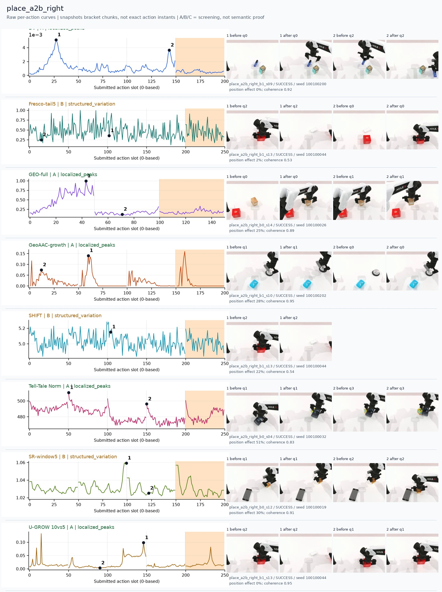
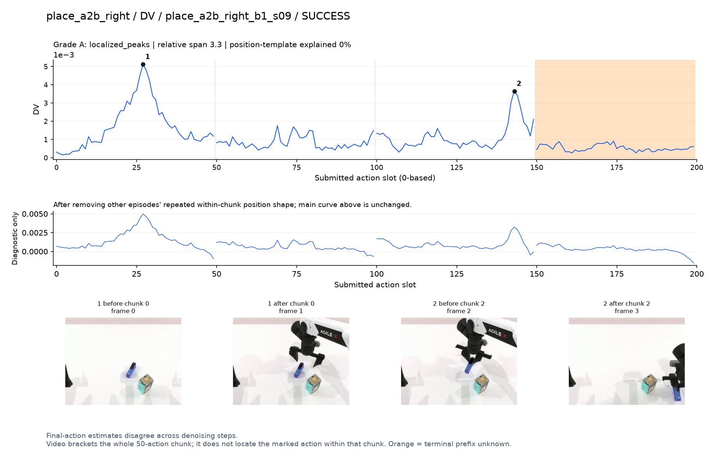
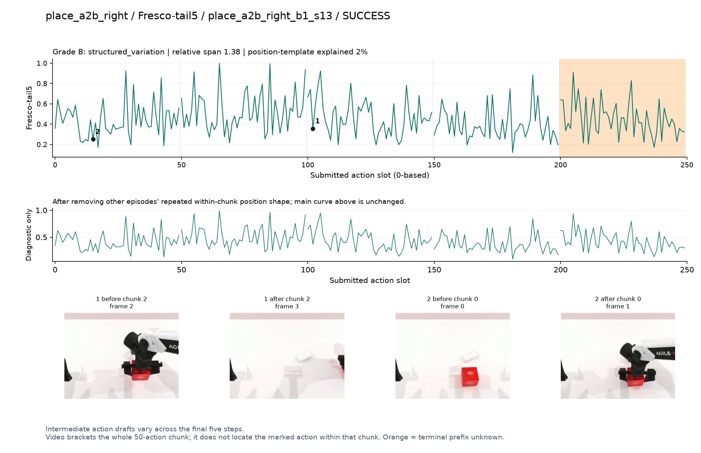
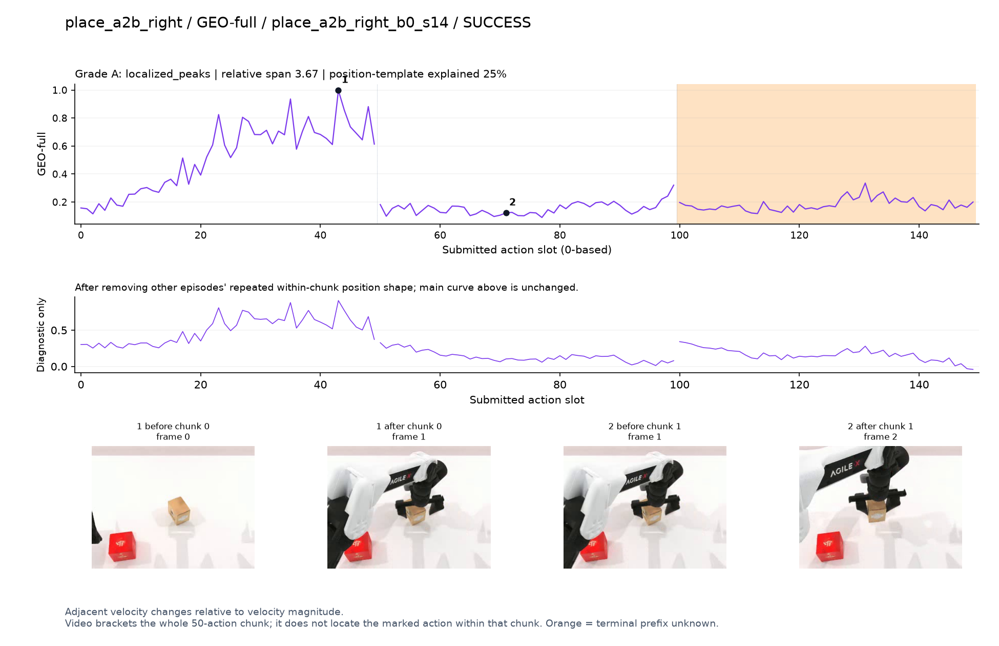
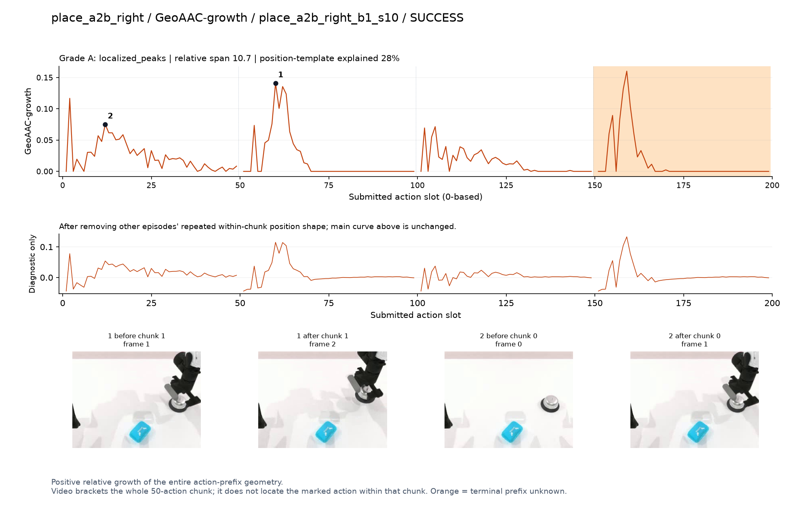
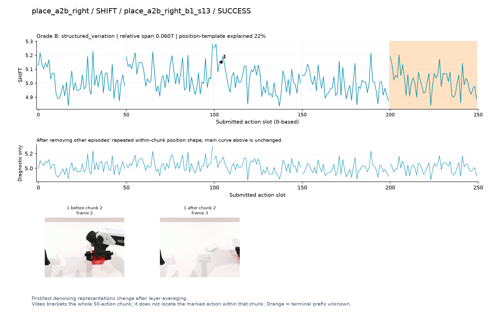
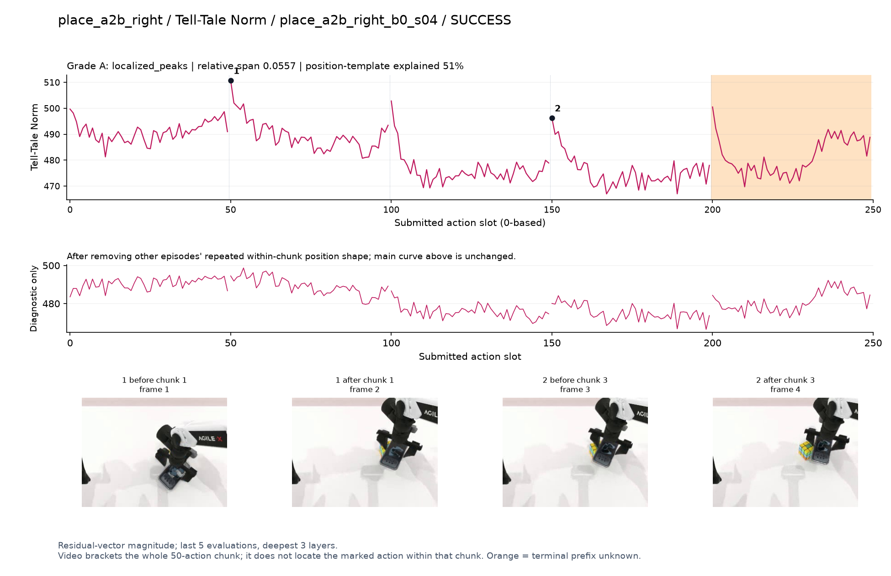
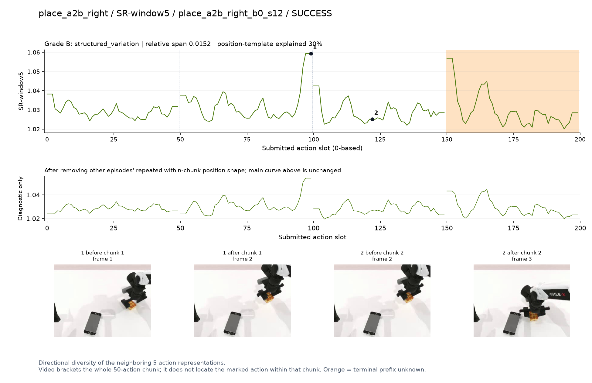
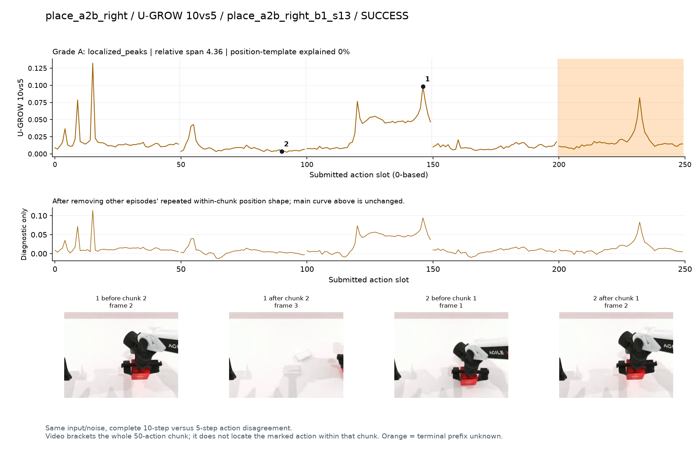

# place_a2b_right

[全部任务](../README.md#全部任务) · [按信号看](../README.md#按信号看)

主图保留逐动作原始值；细虚线为chunk边界，橙色为终止段实际执行长度不明，未用于筛选。帧只对应chunk前后，不能精确定位某个h的接触瞬间。A/B/C是形态筛选等级，优先读人工备注。

## DV

**可解释候选**：候选：q0接近物体和q2移至目标两处峰。

轨迹 `place_a2b_right_b1_s09`；成功；种子 `100100200`；正式验收。

[PNG原图](../figures/place_a2b_right/dv.png) · [SVG矢量图](../figures/place_a2b_right/dv.svg) · [完整元数据](../entries/place_a2b_right/dv.json)

对应帧：[1 before q0](../frames/place_a2b_right/place_a2b_right_b1_s09/f000.jpg) · [1 after q0](../frames/place_a2b_right/place_a2b_right_b1_s09/f001.jpg) · [2 before q2](../frames/place_a2b_right/place_a2b_right_b1_s09/f002.jpg) · [2 after q2](../frames/place_a2b_right/place_a2b_right_b1_s09/f003.jpg)

## Fresco-tail5

**较弱**：弱：逐动作抖动较密，未见可靠独立事件对应；全数据与噪声到最终动作距离高度相关。

轨迹 `place_a2b_right_b1_s13`；成功；种子 `100100044`；正式验收。

[PNG原图](../figures/place_a2b_right/fresco.png) · [SVG矢量图](../figures/place_a2b_right/fresco.svg) · [完整元数据](../entries/place_a2b_right/fresco.json)

对应帧：[1 before q2](../frames/place_a2b_right/place_a2b_right_b1_s13/f002.jpg) · [1 after q2](../frames/place_a2b_right/place_a2b_right_b1_s13/f003.jpg) · [2 before q0](../frames/place_a2b_right/place_a2b_right_b1_s13/f000.jpg) · [2 after q0](../frames/place_a2b_right/place_a2b_right_b1_s13/f001.jpg)

## GEO-full

**可解释候选**：候选：q0接近并夹取物体时宽高区。

轨迹 `place_a2b_right_b0_s14`；成功；种子 `100100026`；正式验收。

[PNG原图](../figures/place_a2b_right/geo.png) · [SVG矢量图](../figures/place_a2b_right/geo.svg) · [完整元数据](../entries/place_a2b_right/geo.json)

对应帧：[1 before q0](../frames/place_a2b_right/place_a2b_right_b0_s14/f000.jpg) · [1 after q0](../frames/place_a2b_right/place_a2b_right_b0_s14/f001.jpg) · [2 before q1](../frames/place_a2b_right/place_a2b_right_b0_s14/f001.jpg) · [2 after q1](../frames/place_a2b_right/place_a2b_right_b0_s14/f002.jpg)

## GeoAAC-growth

**受其他因素影响**：谨慎：q1举起物体时前缀峰，chunk效应明显。

轨迹 `place_a2b_right_b1_s10`；成功；种子 `100100202`；正式验收。

[PNG原图](../figures/place_a2b_right/geoaac.png) · [SVG矢量图](../figures/place_a2b_right/geoaac.svg) · [完整元数据](../entries/place_a2b_right/geoaac.json)

对应帧：[1 before q1](../frames/place_a2b_right/place_a2b_right_b1_s10/f001.jpg) · [1 after q1](../frames/place_a2b_right/place_a2b_right_b1_s10/f002.jpg) · [2 before q0](../frames/place_a2b_right/place_a2b_right_b1_s10/f000.jpg) · [2 after q0](../frames/place_a2b_right/place_a2b_right_b1_s10/f001.jpg)

## SHIFT

**较弱**：弱：小幅抖动/阶段基线变化，未见可靠独立事件对应；路径长度混杂强。

轨迹 `place_a2b_right_b1_s13`；成功；种子 `100100044`；正式验收。

[PNG原图](../figures/place_a2b_right/shift.png) · [SVG矢量图](../figures/place_a2b_right/shift.svg) · [完整元数据](../entries/place_a2b_right/shift.json)

对应帧：[1 before q2](../frames/place_a2b_right/place_a2b_right_b1_s13/f002.jpg) · [1 after q2](../frames/place_a2b_right/place_a2b_right_b1_s13/f003.jpg)

## Tell-Tale Norm

**较弱**：弱：主要峰与chunk开头重合。

轨迹 `place_a2b_right_b0_s04`；成功；种子 `100100032`；正式验收。

[PNG原图](../figures/place_a2b_right/norm.png) · [SVG矢量图](../figures/place_a2b_right/norm.svg) · [完整元数据](../entries/place_a2b_right/norm.json)

对应帧：[1 before q1](../frames/place_a2b_right/place_a2b_right_b0_s04/f001.jpg) · [1 after q1](../frames/place_a2b_right/place_a2b_right_b0_s04/f002.jpg) · [2 before q3](../frames/place_a2b_right/place_a2b_right_b0_s04/f003.jpg) · [2 after q3](../frames/place_a2b_right/place_a2b_right_b0_s04/f004.jpg)

## SR-window5

**受其他因素影响**：谨慎：q1末端突出，但位于chunk边界。

轨迹 `place_a2b_right_b0_s12`；成功；种子 `100100019`；正式验收。

[PNG原图](../figures/place_a2b_right/sr.png) · [SVG矢量图](../figures/place_a2b_right/sr.svg) · [完整元数据](../entries/place_a2b_right/sr.json)

对应帧：[1 before q1](../frames/place_a2b_right/place_a2b_right_b0_s12/f001.jpg) · [1 after q1](../frames/place_a2b_right/place_a2b_right_b0_s12/f002.jpg) · [2 before q2](../frames/place_a2b_right/place_a2b_right_b0_s12/f002.jpg) · [2 after q2](../frames/place_a2b_right/place_a2b_right_b0_s12/f003.jpg)

## U-GROW 10vs5

**可解释候选**：阶段候选：q2搬运物体高区；该例部分动作出画。

轨迹 `place_a2b_right_b1_s13`；成功；种子 `100100044`；正式验收。

[PNG原图](../figures/place_a2b_right/ugrow.png) · [SVG矢量图](../figures/place_a2b_right/ugrow.svg) · [完整元数据](../entries/place_a2b_right/ugrow.json)

对应帧：[1 before q2](../frames/place_a2b_right/place_a2b_right_b1_s13/f002.jpg) · [1 after q2](../frames/place_a2b_right/place_a2b_right_b1_s13/f003.jpg) · [2 before q1](../frames/place_a2b_right/place_a2b_right_b1_s13/f001.jpg) · [2 after q1](../frames/place_a2b_right/place_a2b_right_b1_s13/f002.jpg)
