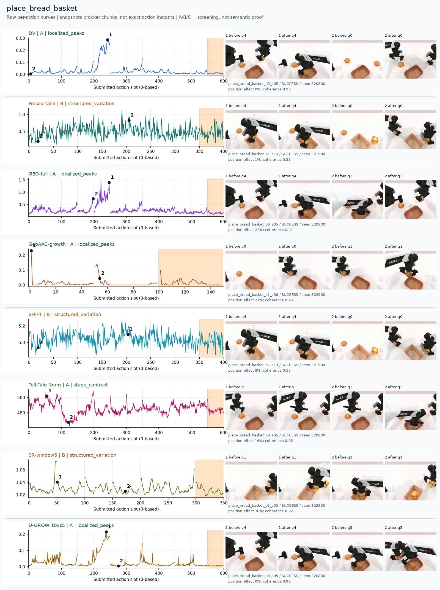
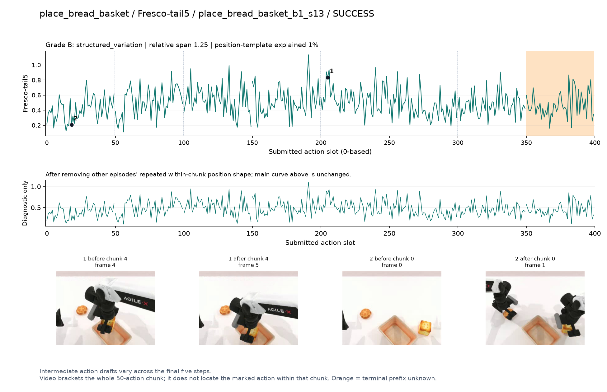
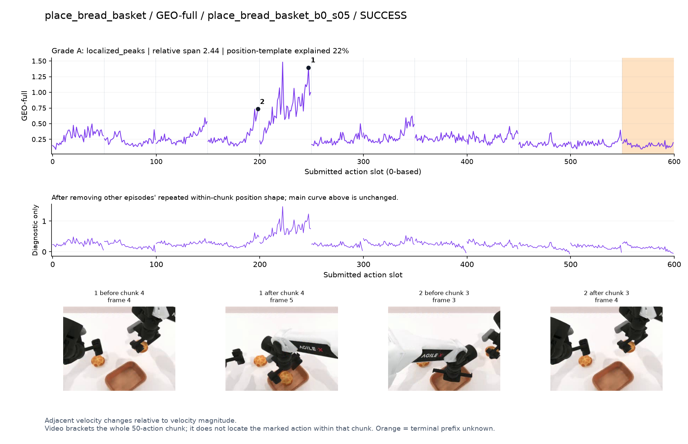
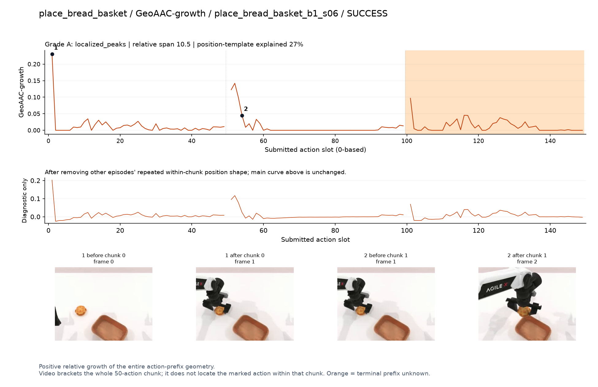
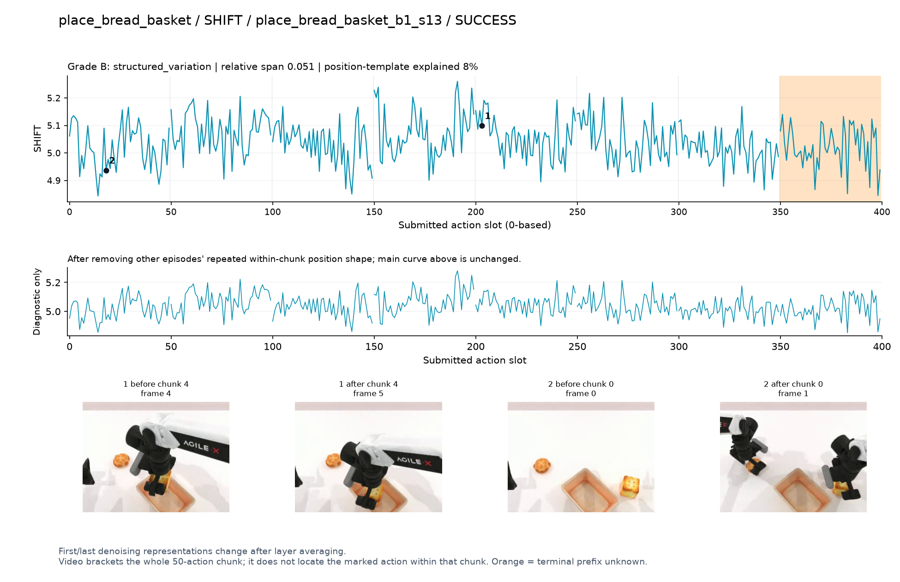
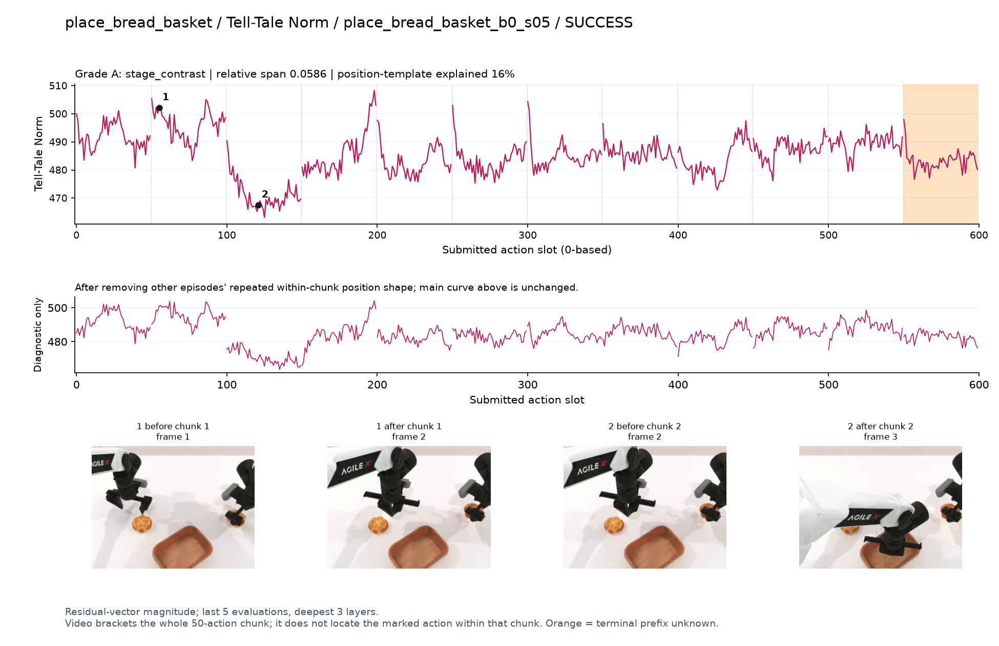
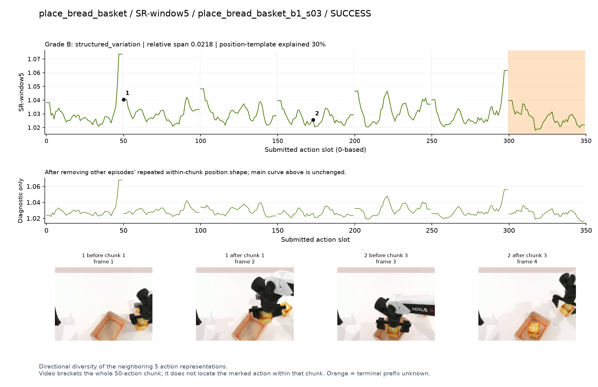

# place_bread_basket

[全部任务](../README.md#全部任务) · [按信号看](../README.md#按信号看)

主图保留逐动作原始值；细虚线为chunk边界，橙色为终止段实际执行长度不明，未用于筛选。帧只对应chunk前后，不能精确定位某个h的接触瞬间。A/B/C是形态筛选等级，优先读人工备注。

## DV

**可解释候选**：优先候选：q4持面包移入篮子时单个主高区，同轨迹GEO/U-GROW也响应。

轨迹 `place_bread_basket_b0_s05`；成功；种子 `320800`；正式验收。

[PNG原图](../figures/place_bread_basket/dv.png) · [SVG矢量图](../figures/place_bread_basket/dv.svg) · [完整元数据](../entries/place_bread_basket/dv.json)

对应帧：[1 before q4](../frames/place_bread_basket/place_bread_basket_b0_s05/f004.jpg) · [1 after q4](../frames/place_bread_basket/place_bread_basket_b0_s05/f005.jpg) · [2 before q0](../frames/place_bread_basket/place_bread_basket_b0_s05/f000.jpg) · [2 after q0](../frames/place_bread_basket/place_bread_basket_b0_s05/f001.jpg)

## Fresco-tail5

**较弱**：弱：逐动作抖动较密，未见可靠独立事件对应；全数据与噪声到最终动作距离高度相关。

轨迹 `place_bread_basket_b1_s13`；成功；种子 `321900`；正式验收。

[PNG原图](../figures/place_bread_basket/fresco.png) · [SVG矢量图](../figures/place_bread_basket/fresco.svg) · [完整元数据](../entries/place_bread_basket/fresco.json)

对应帧：[1 before q4](../frames/place_bread_basket/place_bread_basket_b1_s13/f004.jpg) · [1 after q4](../frames/place_bread_basket/place_bread_basket_b1_s13/f005.jpg) · [2 before q0](../frames/place_bread_basket/place_bread_basket_b1_s13/f000.jpg) · [2 after q0](../frames/place_bread_basket/place_bread_basket_b1_s13/f001.jpg)

## GEO-full

**可解释候选**：优先候选：同一q4面包移入篮子阶段明显升高。

轨迹 `place_bread_basket_b0_s05`；成功；种子 `320800`；正式验收。

[PNG原图](../figures/place_bread_basket/geo.png) · [SVG矢量图](../figures/place_bread_basket/geo.svg) · [完整元数据](../entries/place_bread_basket/geo.json)

对应帧：[1 before q4](../frames/place_bread_basket/place_bread_basket_b0_s05/f004.jpg) · [1 after q4](../frames/place_bread_basket/place_bread_basket_b0_s05/f005.jpg) · [2 before q3](../frames/place_bread_basket/place_bread_basket_b0_s05/f003.jpg) · [2 after q3](../frames/place_bread_basket/place_bread_basket_b0_s05/f004.jpg)

## GeoAAC-growth

**较弱**：弱：主要响应集中在初始前缀/各chunk前部。

轨迹 `place_bread_basket_b1_s06`；成功；种子 `322900`；正式验收。

[PNG原图](../figures/place_bread_basket/geoaac.png) · [SVG矢量图](../figures/place_bread_basket/geoaac.svg) · [完整元数据](../entries/place_bread_basket/geoaac.json)

对应帧：[1 before q0](../frames/place_bread_basket/place_bread_basket_b1_s06/f000.jpg) · [1 after q0](../frames/place_bread_basket/place_bread_basket_b1_s06/f001.jpg) · [2 before q1](../frames/place_bread_basket/place_bread_basket_b1_s06/f001.jpg) · [2 after q1](../frames/place_bread_basket/place_bread_basket_b1_s06/f002.jpg)

## SHIFT

**较弱**：弱：小幅抖动/阶段基线变化，未见可靠独立事件对应；路径长度混杂强。

轨迹 `place_bread_basket_b1_s13`；成功；种子 `321900`；正式验收。

[PNG原图](../figures/place_bread_basket/shift.png) · [SVG矢量图](../figures/place_bread_basket/shift.svg) · [完整元数据](../entries/place_bread_basket/shift.json)

对应帧：[1 before q4](../frames/place_bread_basket/place_bread_basket_b1_s13/f004.jpg) · [1 after q4](../frames/place_bread_basket/place_bread_basket_b1_s13/f005.jpg) · [2 before q0](../frames/place_bread_basket/place_bread_basket_b1_s13/f000.jpg) · [2 after q0](../frames/place_bread_basket/place_bread_basket_b1_s13/f001.jpg)

## Tell-Tale Norm

**阶段变化**：阶段差异：抓面包和移入篮子幅度不同，但并非DV主峰位置。

轨迹 `place_bread_basket_b0_s05`；成功；种子 `320800`；正式验收。

[PNG原图](../figures/place_bread_basket/norm.png) · [SVG矢量图](../figures/place_bread_basket/norm.svg) · [完整元数据](../entries/place_bread_basket/norm.json)

对应帧：[1 before q1](../frames/place_bread_basket/place_bread_basket_b0_s05/f001.jpg) · [1 after q1](../frames/place_bread_basket/place_bread_basket_b0_s05/f002.jpg) · [2 before q2](../frames/place_bread_basket/place_bread_basket_b0_s05/f002.jpg) · [2 after q2](../frames/place_bread_basket/place_bread_basket_b0_s05/f003.jpg)

## SR-window5

**较弱**：弱：多chunk边缘峰，不能直接解释为多个重要事件。

轨迹 `place_bread_basket_b1_s03`；成功；种子 `322200`；正式验收。

[PNG原图](../figures/place_bread_basket/sr.png) · [SVG矢量图](../figures/place_bread_basket/sr.svg) · [完整元数据](../entries/place_bread_basket/sr.json)

对应帧：[1 before q1](../frames/place_bread_basket/place_bread_basket_b1_s03/f001.jpg) · [1 after q1](../frames/place_bread_basket/place_bread_basket_b1_s03/f002.jpg) · [2 before q3](../frames/place_bread_basket/place_bread_basket_b1_s03/f003.jpg) · [2 after q3](../frames/place_bread_basket/place_bread_basket_b1_s03/f004.jpg)

## U-GROW 10vs5

**可解释候选**：优先候选：与DV同轨迹q4移入篮子高区。

轨迹 `place_bread_basket_b0_s05`；成功；种子 `320800`；正式验收。

[PNG原图](../figures/place_bread_basket/ugrow.png) · [SVG矢量图](../figures/place_bread_basket/ugrow.svg) · [完整元数据](../entries/place_bread_basket/ugrow.json)

对应帧：[1 before q4](../frames/place_bread_basket/place_bread_basket_b0_s05/f004.jpg) · [1 after q4](../frames/place_bread_basket/place_bread_basket_b0_s05/f005.jpg) · [2 before q5](../frames/place_bread_basket/place_bread_basket_b0_s05/f005.jpg) · [2 after q5](../frames/place_bread_basket/place_bread_basket_b0_s05/f006.jpg)
