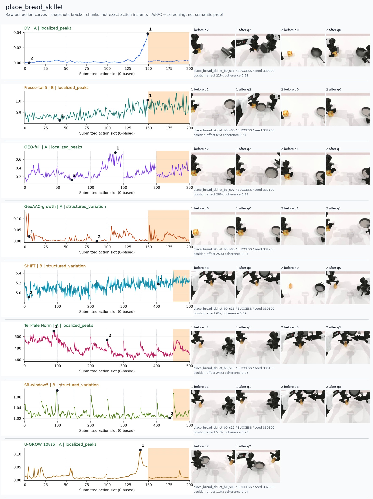
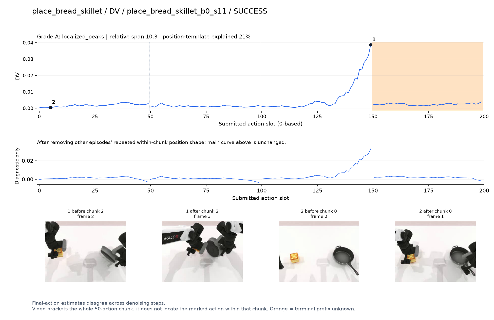
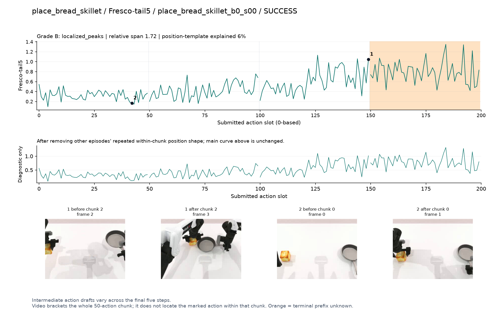
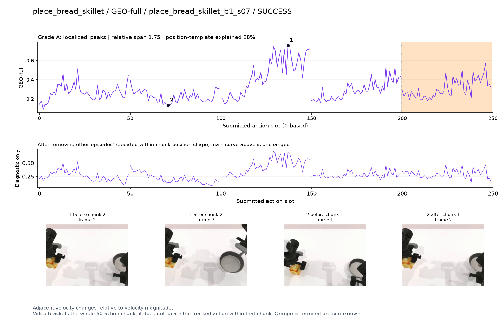
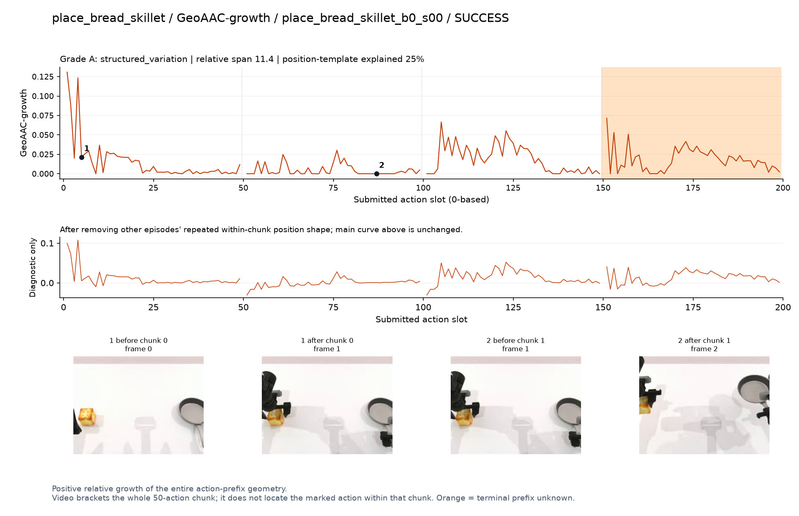
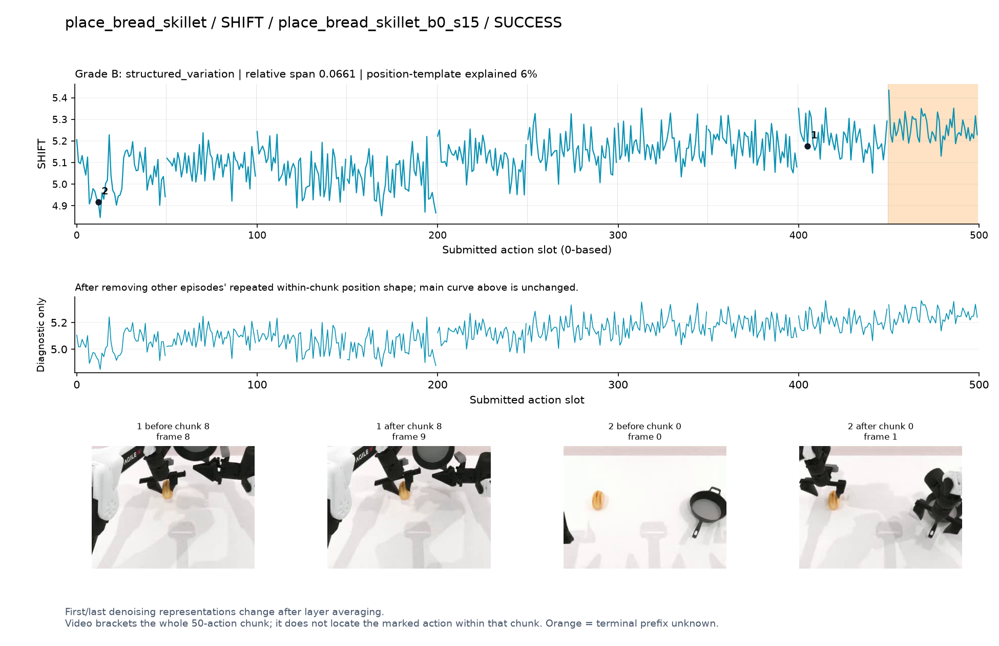
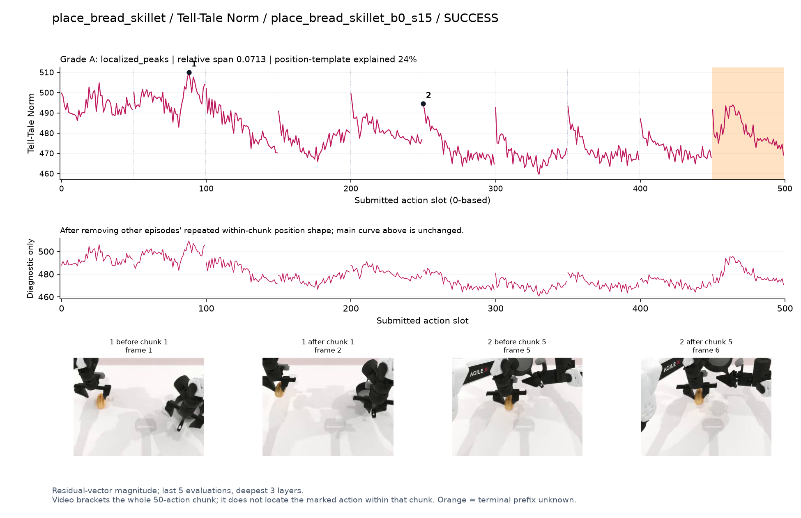
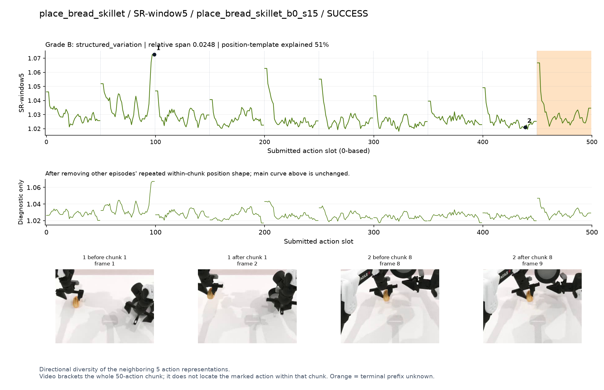
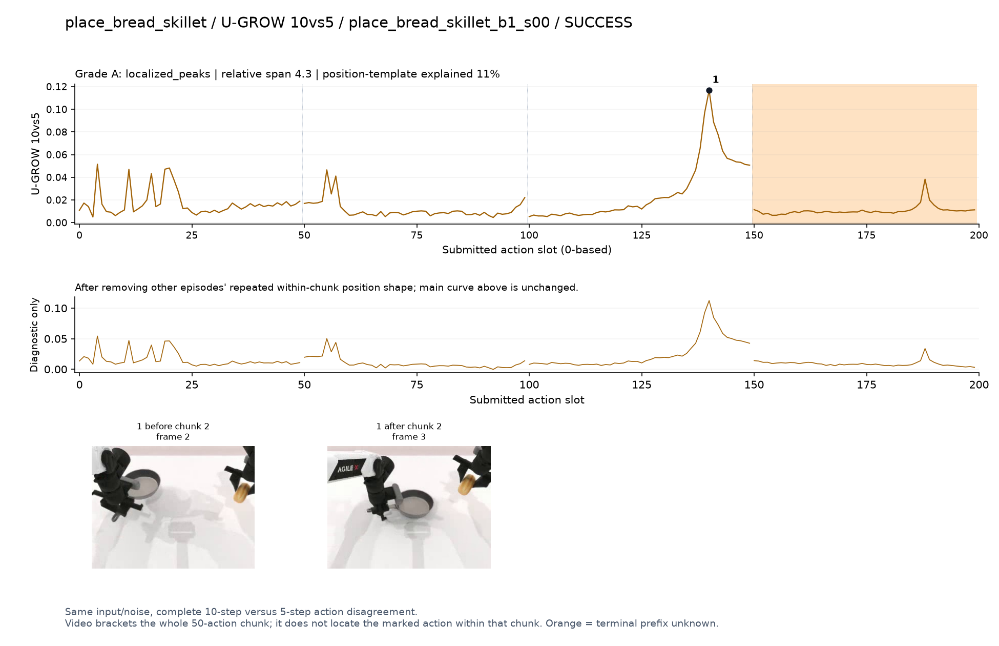

# place_bread_skillet

[全部任务](../README.md#全部任务) · [按信号看](../README.md#按信号看)

主图保留逐动作原始值；细虚线为chunk边界，橙色为终止段实际执行长度不明，未用于筛选。帧只对应chunk前后，不能精确定位某个h的接触瞬间。A/B/C是形态筛选等级，优先读人工备注。

## DV

**可解释候选**：候选：q2双手分别持面包/平底锅并靠近时强升高。

轨迹 `place_bread_skillet_b0_s11`；成功；种子 `330000`；正式验收。

[PNG原图](../figures/place_bread_skillet/dv.png) · [SVG矢量图](../figures/place_bread_skillet/dv.svg) · [完整元数据](../entries/place_bread_skillet/dv.json)

对应帧：[1 before q2](../frames/place_bread_skillet/place_bread_skillet_b0_s11/f002.jpg) · [1 after q2](../frames/place_bread_skillet/place_bread_skillet_b0_s11/f003.jpg) · [2 before q0](../frames/place_bread_skillet/place_bread_skillet_b0_s11/f000.jpg) · [2 after q0](../frames/place_bread_skillet/place_bread_skillet_b0_s11/f001.jpg)

## Fresco-tail5

**较弱**：弱：逐动作抖动较密，未见可靠独立事件对应；全数据与噪声到最终动作距离高度相关。

轨迹 `place_bread_skillet_b0_s00`；成功；种子 `331200`；正式验收。

[PNG原图](../figures/place_bread_skillet/fresco.png) · [SVG矢量图](../figures/place_bread_skillet/fresco.svg) · [完整元数据](../entries/place_bread_skillet/fresco.json)

对应帧：[1 before q2](../frames/place_bread_skillet/place_bread_skillet_b0_s00/f002.jpg) · [1 after q2](../frames/place_bread_skillet/place_bread_skillet_b0_s00/f003.jpg) · [2 before q0](../frames/place_bread_skillet/place_bread_skillet_b0_s00/f000.jpg) · [2 after q0](../frames/place_bread_skillet/place_bread_skillet_b0_s00/f001.jpg)

## GEO-full

**可解释候选**：阶段候选：q2开始移动面包/锅时高，具体接触被视角限制。

轨迹 `place_bread_skillet_b1_s07`；成功；种子 `332100`；正式验收。

[PNG原图](../figures/place_bread_skillet/geo.png) · [SVG矢量图](../figures/place_bread_skillet/geo.svg) · [完整元数据](../entries/place_bread_skillet/geo.json)

对应帧：[1 before q2](../frames/place_bread_skillet/place_bread_skillet_b1_s07/f002.jpg) · [1 after q2](../frames/place_bread_skillet/place_bread_skillet_b1_s07/f003.jpg) · [2 before q1](../frames/place_bread_skillet/place_bread_skillet_b1_s07/f001.jpg) · [2 after q1](../frames/place_bread_skillet/place_bread_skillet_b1_s07/f002.jpg)

## GeoAAC-growth

**较弱**：弱：前缀开头尖峰加多个小波动。

轨迹 `place_bread_skillet_b0_s00`；成功；种子 `331200`；正式验收。

[PNG原图](../figures/place_bread_skillet/geoaac.png) · [SVG矢量图](../figures/place_bread_skillet/geoaac.svg) · [完整元数据](../entries/place_bread_skillet/geoaac.json)

对应帧：[1 before q0](../frames/place_bread_skillet/place_bread_skillet_b0_s00/f000.jpg) · [1 after q0](../frames/place_bread_skillet/place_bread_skillet_b0_s00/f001.jpg) · [2 before q1](../frames/place_bread_skillet/place_bread_skillet_b0_s00/f001.jpg) · [2 after q1](../frames/place_bread_skillet/place_bread_skillet_b0_s00/f002.jpg)

## SHIFT

**较弱**：弱：小幅抖动/阶段基线变化，未见可靠独立事件对应；路径长度混杂强。

轨迹 `place_bread_skillet_b0_s15`；成功；种子 `330100`；正式验收。

[PNG原图](../figures/place_bread_skillet/shift.png) · [SVG矢量图](../figures/place_bread_skillet/shift.svg) · [完整元数据](../entries/place_bread_skillet/shift.json)

对应帧：[1 before q8](../frames/place_bread_skillet/place_bread_skillet_b0_s15/f008.jpg) · [1 after q8](../frames/place_bread_skillet/place_bread_skillet_b0_s15/f009.jpg) · [2 before q0](../frames/place_bread_skillet/place_bread_skillet_b0_s15/f000.jpg) · [2 after q0](../frames/place_bread_skillet/place_bread_skillet_b0_s15/f001.jpg)

## Tell-Tale Norm

**阶段变化**：阶段差异：q1持面包时高，之后较低；chunk首部尖峰重复。

轨迹 `place_bread_skillet_b0_s15`；成功；种子 `330100`；正式验收。

[PNG原图](../figures/place_bread_skillet/norm.png) · [SVG矢量图](../figures/place_bread_skillet/norm.svg) · [完整元数据](../entries/place_bread_skillet/norm.json)

对应帧：[1 before q1](../frames/place_bread_skillet/place_bread_skillet_b0_s15/f001.jpg) · [1 after q1](../frames/place_bread_skillet/place_bread_skillet_b0_s15/f002.jpg) · [2 before q5](../frames/place_bread_skillet/place_bread_skillet_b0_s15/f005.jpg) · [2 after q5](../frames/place_bread_skillet/place_bread_skillet_b0_s15/f006.jpg)

## SR-window5

**较弱**：弱：多chunk末端高值，位置模板较强。

轨迹 `place_bread_skillet_b0_s15`；成功；种子 `330100`；正式验收。

[PNG原图](../figures/place_bread_skillet/sr.png) · [SVG矢量图](../figures/place_bread_skillet/sr.svg) · [完整元数据](../entries/place_bread_skillet/sr.json)

对应帧：[1 before q1](../frames/place_bread_skillet/place_bread_skillet_b0_s15/f001.jpg) · [1 after q1](../frames/place_bread_skillet/place_bread_skillet_b0_s15/f002.jpg) · [2 before q8](../frames/place_bread_skillet/place_bread_skillet_b0_s15/f008.jpg) · [2 after q8](../frames/place_bread_skillet/place_bread_skillet_b0_s15/f009.jpg)

## U-GROW 10vs5

**可解释候选**：候选：q2锅与面包靠近阶段局部高峰。

轨迹 `place_bread_skillet_b1_s00`；成功；种子 `332800`；正式验收。

[PNG原图](../figures/place_bread_skillet/ugrow.png) · [SVG矢量图](../figures/place_bread_skillet/ugrow.svg) · [完整元数据](../entries/place_bread_skillet/ugrow.json)

对应帧：[1 before q2](../frames/place_bread_skillet/place_bread_skillet_b1_s00/f002.jpg) · [1 after q2](../frames/place_bread_skillet/place_bread_skillet_b1_s00/f003.jpg)
