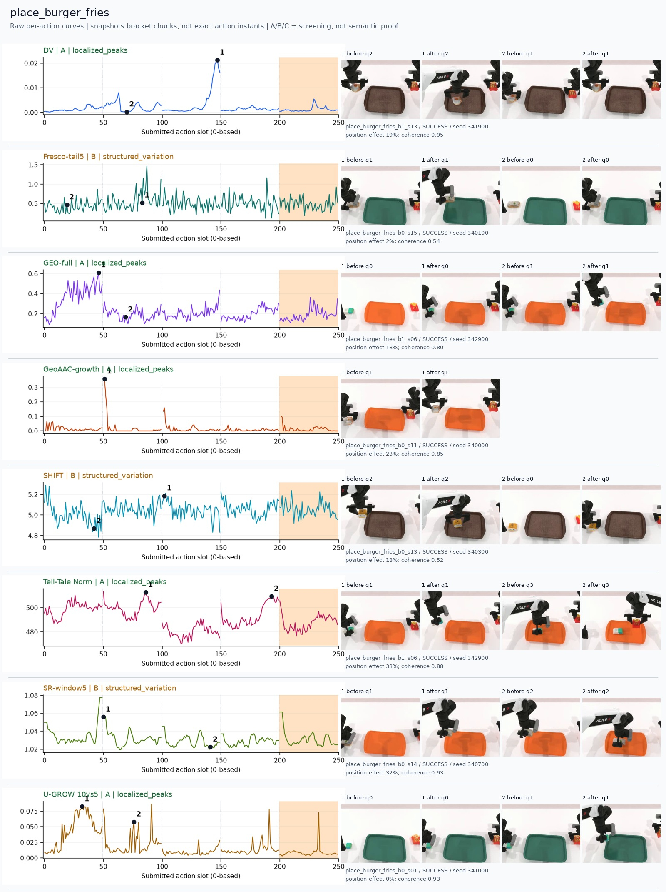
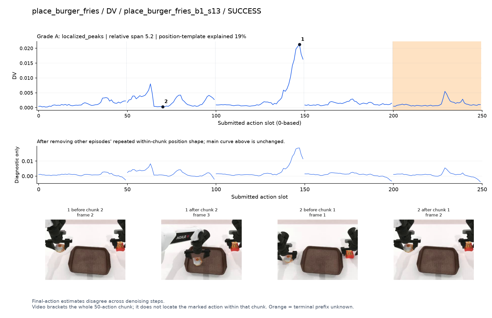
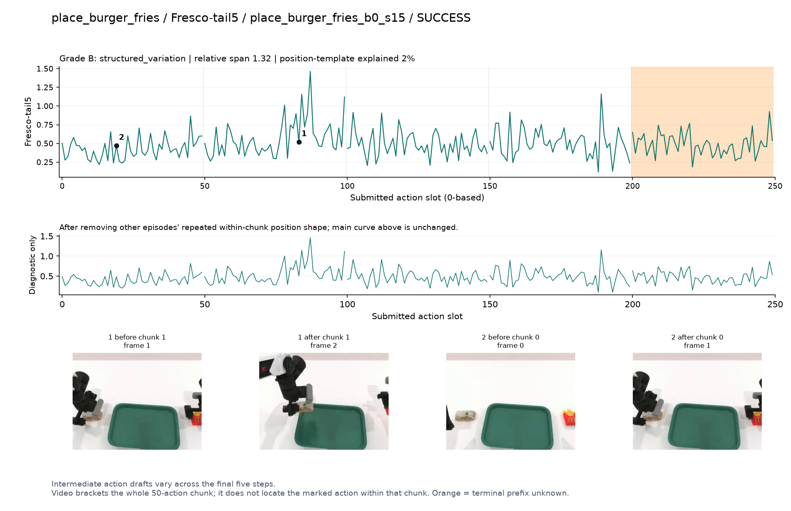
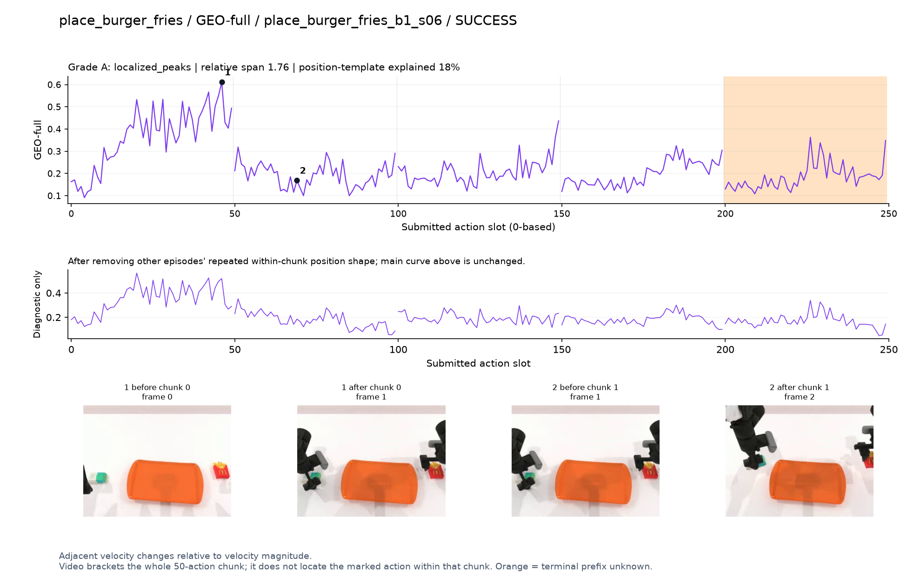
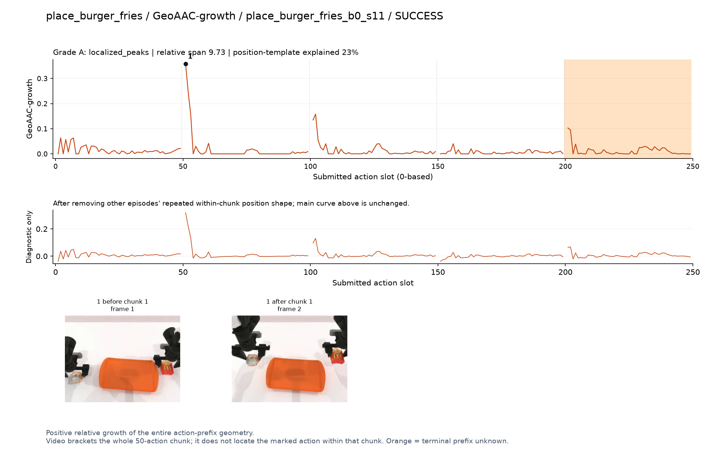
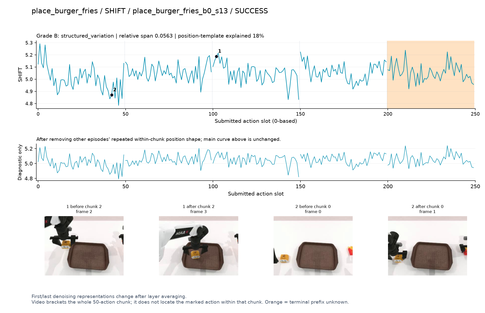
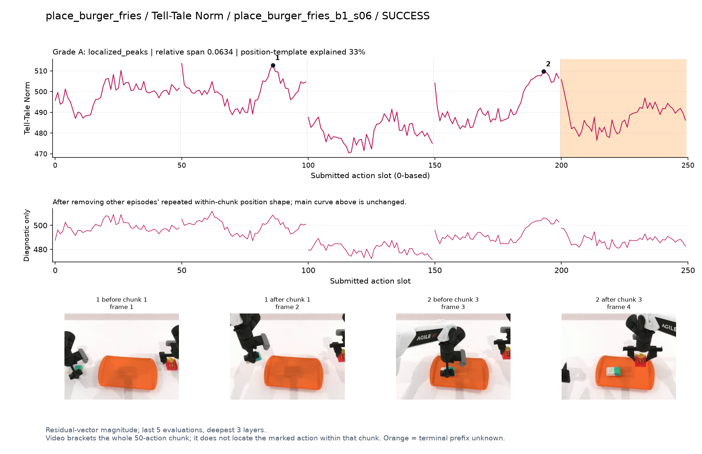
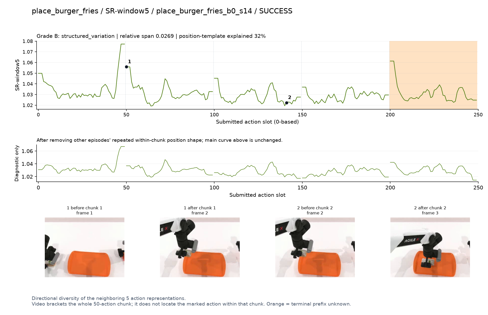
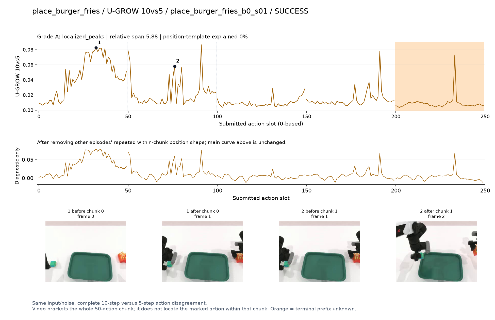

# place_burger_fries

[全部任务](../README.md#全部任务) · [按信号看](../README.md#按信号看)

主图保留逐动作原始值；细虚线为chunk边界，橙色为终止段实际执行长度不明，未用于筛选。帧只对应chunk前后，不能精确定位某个h的接触瞬间。A/B/C是形态筛选等级，优先读人工备注。

## DV

**可解释候选**：候选：q2汉堡从托盘外移到盘内时孤立主峰。

轨迹 `place_burger_fries_b1_s13`；成功；种子 `341900`；正式验收。

[PNG原图](../figures/place_burger_fries/dv.png) · [SVG矢量图](../figures/place_burger_fries/dv.svg) · [完整元数据](../entries/place_burger_fries/dv.json)

对应帧：[1 before q2](../frames/place_burger_fries/place_burger_fries_b1_s13/f002.jpg) · [1 after q2](../frames/place_burger_fries/place_burger_fries_b1_s13/f003.jpg) · [2 before q1](../frames/place_burger_fries/place_burger_fries_b1_s13/f001.jpg) · [2 after q1](../frames/place_burger_fries/place_burger_fries_b1_s13/f002.jpg)

## Fresco-tail5

**较弱**：弱：逐动作抖动较密，未见可靠独立事件对应；全数据与噪声到最终动作距离高度相关。

轨迹 `place_burger_fries_b0_s15`；成功；种子 `340100`；正式验收。

[PNG原图](../figures/place_burger_fries/fresco.png) · [SVG矢量图](../figures/place_burger_fries/fresco.svg) · [完整元数据](../entries/place_burger_fries/fresco.json)

对应帧：[1 before q1](../frames/place_burger_fries/place_burger_fries_b0_s15/f001.jpg) · [1 after q1](../frames/place_burger_fries/place_burger_fries_b0_s15/f002.jpg) · [2 before q0](../frames/place_burger_fries/place_burger_fries_b0_s15/f000.jpg) · [2 after q0](../frames/place_burger_fries/place_burger_fries_b0_s15/f001.jpg)

## GEO-full

**可解释候选**：候选：q0双手靠近食物时高，后续较低。

轨迹 `place_burger_fries_b1_s06`；成功；种子 `342900`；正式验收。

[PNG原图](../figures/place_burger_fries/geo.png) · [SVG矢量图](../figures/place_burger_fries/geo.svg) · [完整元数据](../entries/place_burger_fries/geo.json)

对应帧：[1 before q0](../frames/place_burger_fries/place_burger_fries_b1_s06/f000.jpg) · [1 after q0](../frames/place_burger_fries/place_burger_fries_b1_s06/f001.jpg) · [2 before q1](../frames/place_burger_fries/place_burger_fries_b1_s06/f001.jpg) · [2 after q1](../frames/place_burger_fries/place_burger_fries_b1_s06/f002.jpg)

## GeoAAC-growth

**受其他因素影响**：谨慎：q1提起汉堡时首部峰，前缀效应混杂。

轨迹 `place_burger_fries_b0_s11`；成功；种子 `340000`；正式验收。

[PNG原图](../figures/place_burger_fries/geoaac.png) · [SVG矢量图](../figures/place_burger_fries/geoaac.svg) · [完整元数据](../entries/place_burger_fries/geoaac.json)

对应帧：[1 before q1](../frames/place_burger_fries/place_burger_fries_b0_s11/f001.jpg) · [1 after q1](../frames/place_burger_fries/place_burger_fries_b0_s11/f002.jpg)

## SHIFT

**较弱**：弱：小幅抖动/阶段基线变化，未见可靠独立事件对应；路径长度混杂强。

轨迹 `place_burger_fries_b0_s13`；成功；种子 `340300`；正式验收。

[PNG原图](../figures/place_burger_fries/shift.png) · [SVG矢量图](../figures/place_burger_fries/shift.svg) · [完整元数据](../entries/place_burger_fries/shift.json)

对应帧：[1 before q2](../frames/place_burger_fries/place_burger_fries_b0_s13/f002.jpg) · [1 after q2](../frames/place_burger_fries/place_burger_fries_b0_s13/f003.jpg) · [2 before q0](../frames/place_burger_fries/place_burger_fries_b0_s13/f000.jpg) · [2 after q0](../frames/place_burger_fries/place_burger_fries_b0_s13/f001.jpg)

## Tell-Tale Norm

**可解释候选**：阶段候选：q1提起食物和q3放下后另一只手靠近时较高。

轨迹 `place_burger_fries_b1_s06`；成功；种子 `342900`；正式验收。

[PNG原图](../figures/place_burger_fries/norm.png) · [SVG矢量图](../figures/place_burger_fries/norm.svg) · [完整元数据](../entries/place_burger_fries/norm.json)

对应帧：[1 before q1](../frames/place_burger_fries/place_burger_fries_b1_s06/f001.jpg) · [1 after q1](../frames/place_burger_fries/place_burger_fries_b1_s06/f002.jpg) · [2 before q3](../frames/place_burger_fries/place_burger_fries_b1_s06/f003.jpg) · [2 after q3](../frames/place_burger_fries/place_burger_fries_b1_s06/f004.jpg)

## SR-window5

**较弱**：弱：chunk开头峰，后续小幅波动。

轨迹 `place_burger_fries_b0_s14`；成功；种子 `340700`；正式验收。

[PNG原图](../figures/place_burger_fries/sr.png) · [SVG矢量图](../figures/place_burger_fries/sr.svg) · [完整元数据](../entries/place_burger_fries/sr.json)

对应帧：[1 before q1](../frames/place_burger_fries/place_burger_fries_b0_s14/f001.jpg) · [1 after q1](../frames/place_burger_fries/place_burger_fries_b0_s14/f002.jpg) · [2 before q2](../frames/place_burger_fries/place_burger_fries_b0_s14/f002.jpg) · [2 after q2](../frames/place_burger_fries/place_burger_fries_b0_s14/f003.jpg)

## U-GROW 10vs5

**可解释候选**：候选：q0接近、q1拿起食物时高区。

轨迹 `place_burger_fries_b0_s01`；成功；种子 `341000`；正式验收。

[PNG原图](../figures/place_burger_fries/ugrow.png) · [SVG矢量图](../figures/place_burger_fries/ugrow.svg) · [完整元数据](../entries/place_burger_fries/ugrow.json)

对应帧：[1 before q0](../frames/place_burger_fries/place_burger_fries_b0_s01/f000.jpg) · [1 after q0](../frames/place_burger_fries/place_burger_fries_b0_s01/f001.jpg) · [2 before q1](../frames/place_burger_fries/place_burger_fries_b0_s01/f001.jpg) · [2 after q1](../frames/place_burger_fries/place_burger_fries_b0_s01/f002.jpg)
