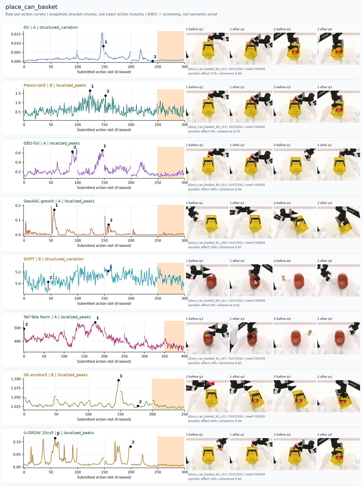
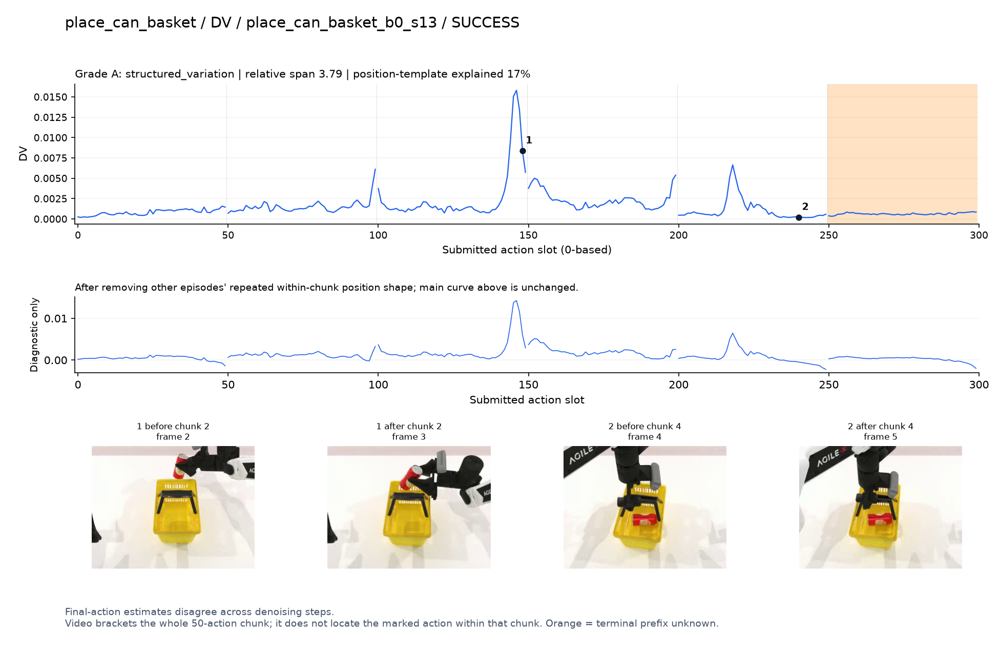
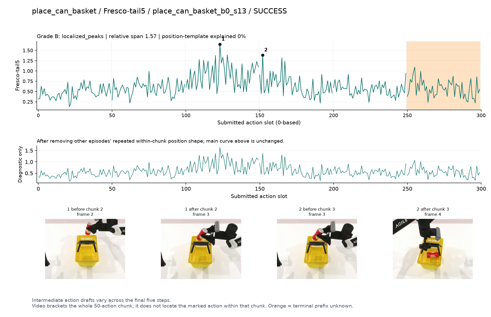
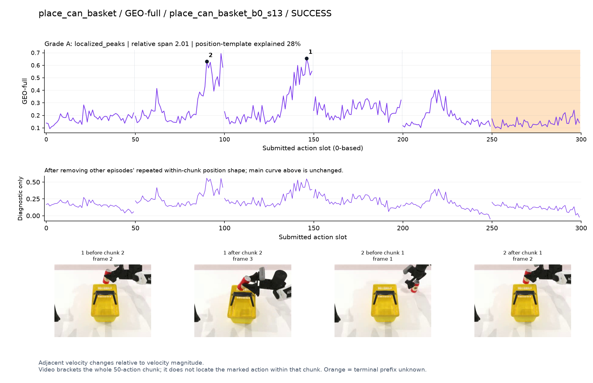
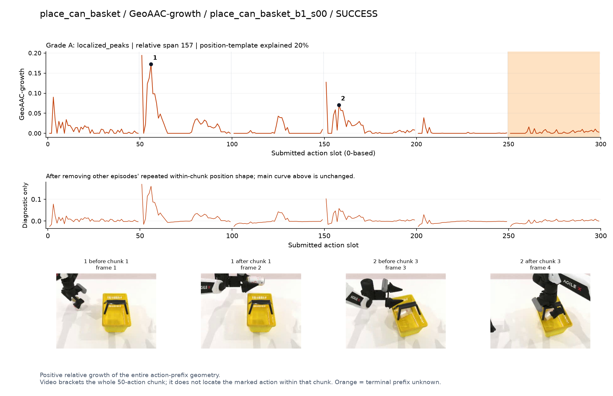
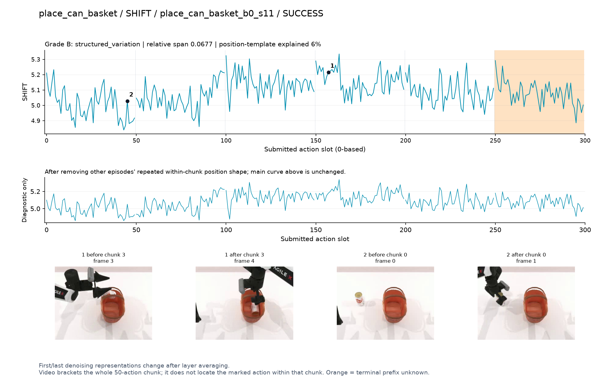
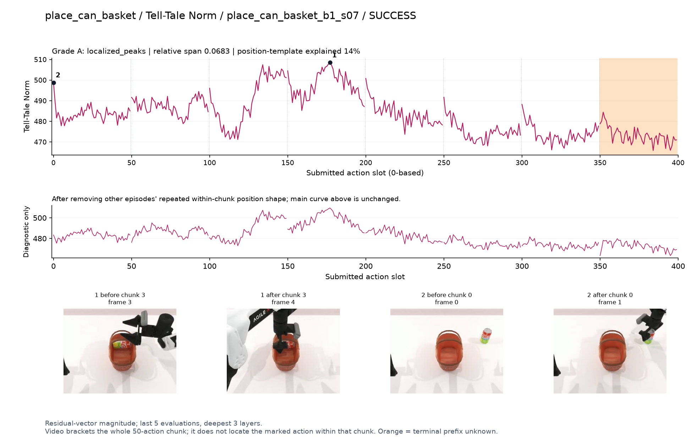
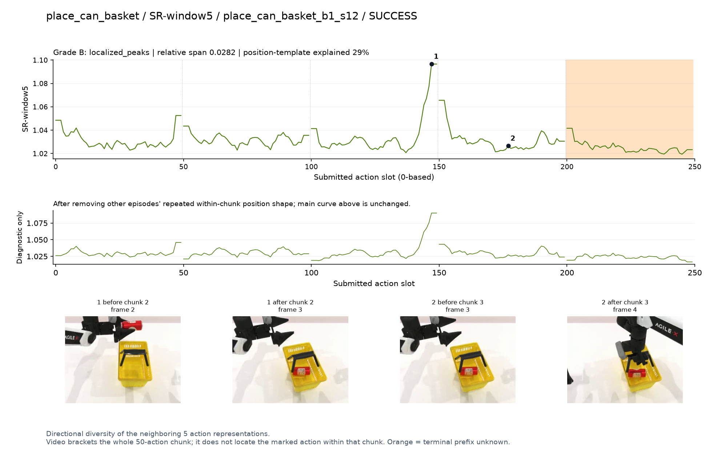
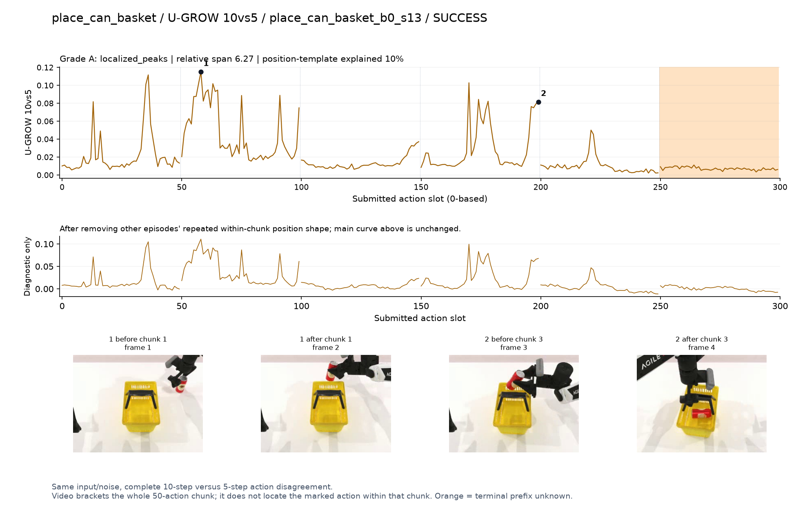

# place_can_basket

[全部任务](../README.md#全部任务) · [按信号看](../README.md#按信号看)

主图保留逐动作原始值；细虚线为chunk边界，橙色为终止段实际执行长度不明，未用于筛选。帧只对应chunk前后，不能精确定位某个h的接触瞬间。A/B/C是形态筛选等级，优先读人工备注。

## DV

**可解释候选**：候选：q2持罐越过篮口附近有主要峰。

轨迹 `place_can_basket_b0_s13`；成功；种子 `350300`；正式验收。

[PNG原图](../figures/place_can_basket/dv.png) · [SVG矢量图](../figures/place_can_basket/dv.svg) · [完整元数据](../entries/place_can_basket/dv.json)

对应帧：[1 before q2](../frames/place_can_basket/place_can_basket_b0_s13/f002.jpg) · [1 after q2](../frames/place_can_basket/place_can_basket_b0_s13/f003.jpg) · [2 before q4](../frames/place_can_basket/place_can_basket_b0_s13/f004.jpg) · [2 after q4](../frames/place_can_basket/place_can_basket_b0_s13/f005.jpg)

## Fresco-tail5

**较弱**：弱：逐动作抖动较密，未见可靠独立事件对应；全数据与噪声到最终动作距离高度相关。

轨迹 `place_can_basket_b0_s13`；成功；种子 `350300`；正式验收。

[PNG原图](../figures/place_can_basket/fresco.png) · [SVG矢量图](../figures/place_can_basket/fresco.svg) · [完整元数据](../entries/place_can_basket/fresco.json)

对应帧：[1 before q2](../frames/place_can_basket/place_can_basket_b0_s13/f002.jpg) · [1 after q2](../frames/place_can_basket/place_can_basket_b0_s13/f003.jpg) · [2 before q3](../frames/place_can_basket/place_can_basket_b0_s13/f003.jpg) · [2 after q3](../frames/place_can_basket/place_can_basket_b0_s13/f004.jpg)

## GEO-full

**可解释候选**：候选：q1抬罐和q2移向篮口出现主要高区。

轨迹 `place_can_basket_b0_s13`；成功；种子 `350300`；正式验收。

[PNG原图](../figures/place_can_basket/geo.png) · [SVG矢量图](../figures/place_can_basket/geo.svg) · [完整元数据](../entries/place_can_basket/geo.json)

对应帧：[1 before q2](../frames/place_can_basket/place_can_basket_b0_s13/f002.jpg) · [1 after q2](../frames/place_can_basket/place_can_basket_b0_s13/f003.jpg) · [2 before q1](../frames/place_can_basket/place_can_basket_b0_s13/f001.jpg) · [2 after q1](../frames/place_can_basket/place_can_basket_b0_s13/f002.jpg)

## GeoAAC-growth

**受其他因素影响**：谨慎：提罐/入篮段增长峰仍贴近chunk首部。

轨迹 `place_can_basket_b1_s00`；成功；种子 `352800`；正式验收。

[PNG原图](../figures/place_can_basket/geoaac.png) · [SVG矢量图](../figures/place_can_basket/geoaac.svg) · [完整元数据](../entries/place_can_basket/geoaac.json)

对应帧：[1 before q1](../frames/place_can_basket/place_can_basket_b1_s00/f001.jpg) · [1 after q1](../frames/place_can_basket/place_can_basket_b1_s00/f002.jpg) · [2 before q3](../frames/place_can_basket/place_can_basket_b1_s00/f003.jpg) · [2 after q3](../frames/place_can_basket/place_can_basket_b1_s00/f004.jpg)

## SHIFT

**较弱**：弱：小幅抖动/阶段基线变化，未见可靠独立事件对应；路径长度混杂强。

轨迹 `place_can_basket_b0_s11`；成功；种子 `350000`；正式验收。

[PNG原图](../figures/place_can_basket/shift.png) · [SVG矢量图](../figures/place_can_basket/shift.svg) · [完整元数据](../entries/place_can_basket/shift.json)

对应帧：[1 before q3](../frames/place_can_basket/place_can_basket_b0_s11/f003.jpg) · [1 after q3](../frames/place_can_basket/place_can_basket_b0_s11/f004.jpg) · [2 before q0](../frames/place_can_basket/place_can_basket_b0_s11/f000.jpg) · [2 after q0](../frames/place_can_basket/place_can_basket_b0_s11/f001.jpg)

## Tell-Tale Norm

**可解释候选**：候选：q2/q3篮口对准并向内放置时宽高区。

轨迹 `place_can_basket_b1_s07`；成功；种子 `352100`；正式验收。

[PNG原图](../figures/place_can_basket/norm.png) · [SVG矢量图](../figures/place_can_basket/norm.svg) · [完整元数据](../entries/place_can_basket/norm.json)

对应帧：[1 before q3](../frames/place_can_basket/place_can_basket_b1_s07/f003.jpg) · [1 after q3](../frames/place_can_basket/place_can_basket_b1_s07/f004.jpg) · [2 before q0](../frames/place_can_basket/place_can_basket_b1_s07/f000.jpg) · [2 after q0](../frames/place_can_basket/place_can_basket_b1_s07/f001.jpg)

## SR-window5

**受其他因素影响**：谨慎：q2放入篮子段末尾峰清楚，但接近边界。

轨迹 `place_can_basket_b1_s12`；成功；种子 `352000`；正式验收。

[PNG原图](../figures/place_can_basket/sr.png) · [SVG矢量图](../figures/place_can_basket/sr.svg) · [完整元数据](../entries/place_can_basket/sr.json)

对应帧：[1 before q2](../frames/place_can_basket/place_can_basket_b1_s12/f002.jpg) · [1 after q2](../frames/place_can_basket/place_can_basket_b1_s12/f003.jpg) · [2 before q3](../frames/place_can_basket/place_can_basket_b1_s12/f003.jpg) · [2 after q3](../frames/place_can_basket/place_can_basket_b1_s12/f004.jpg)

## U-GROW 10vs5

**可解释候选**：候选：q1抬罐及q3篮内操作有高区，伴随其他尖峰。

轨迹 `place_can_basket_b0_s13`；成功；种子 `350300`；正式验收。

[PNG原图](../figures/place_can_basket/ugrow.png) · [SVG矢量图](../figures/place_can_basket/ugrow.svg) · [完整元数据](../entries/place_can_basket/ugrow.json)

对应帧：[1 before q1](../frames/place_can_basket/place_can_basket_b0_s13/f001.jpg) · [1 after q1](../frames/place_can_basket/place_can_basket_b0_s13/f002.jpg) · [2 before q3](../frames/place_can_basket/place_can_basket_b0_s13/f003.jpg) · [2 after q3](../frames/place_can_basket/place_can_basket_b0_s13/f004.jpg)
