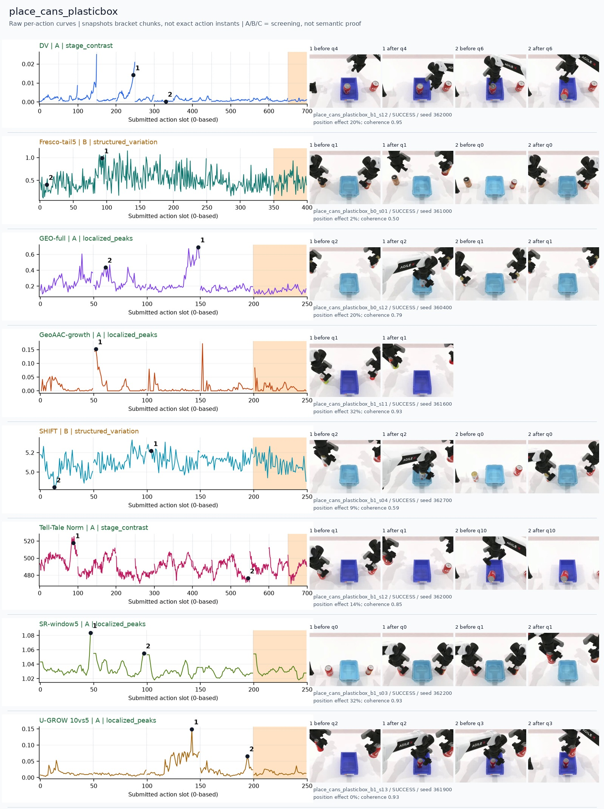
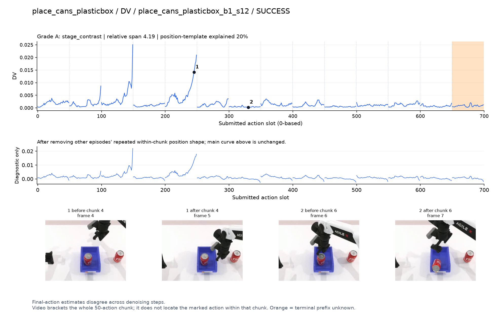
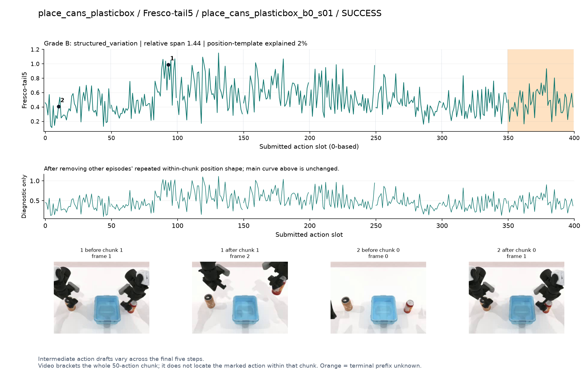
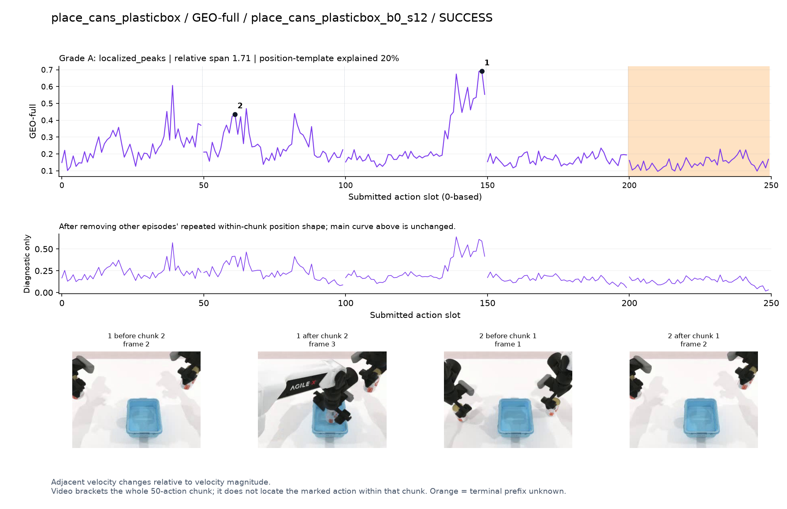
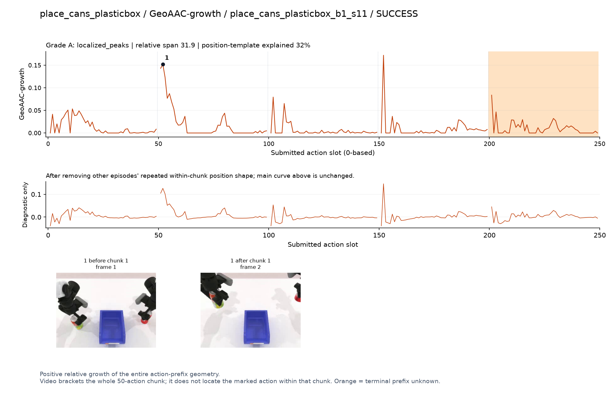
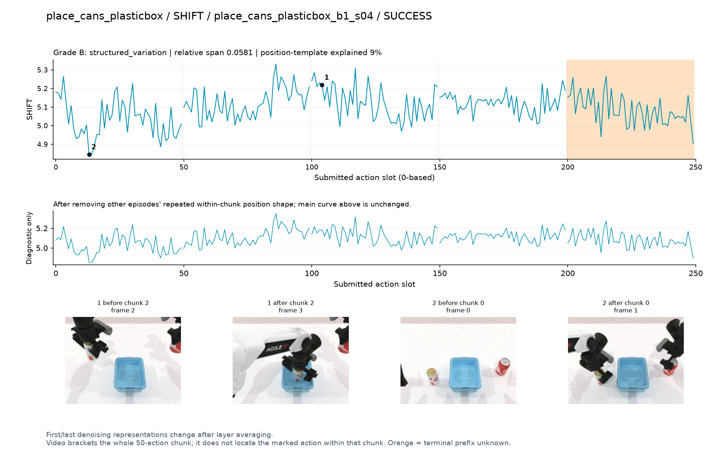
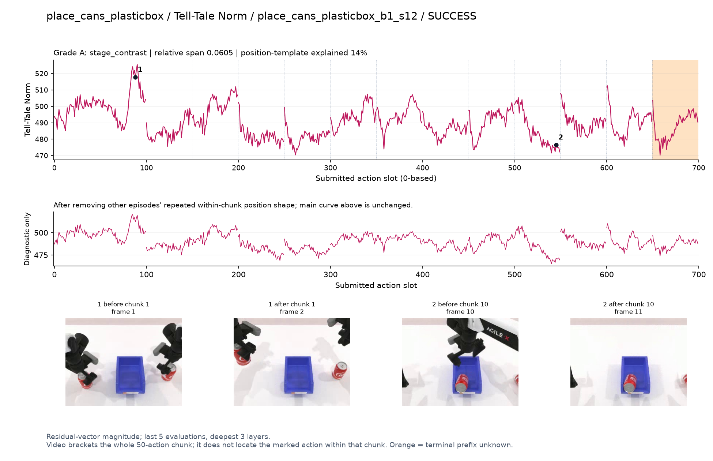
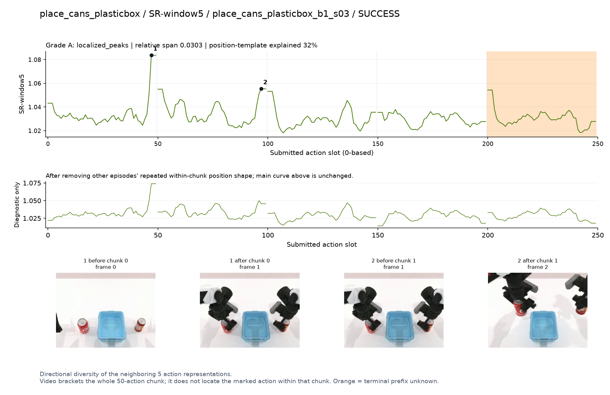
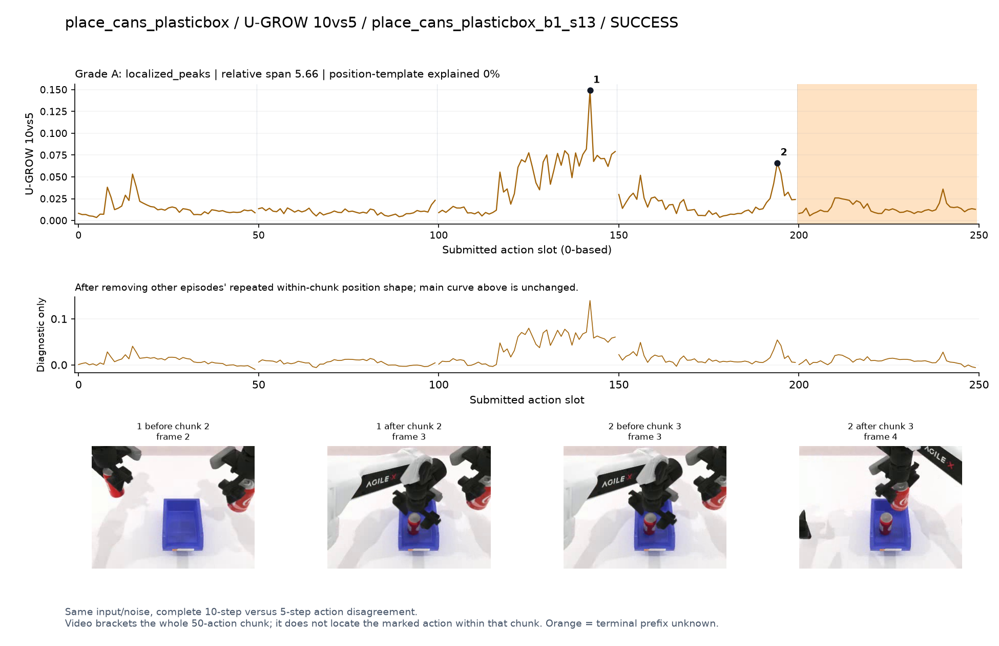

# place_cans_plasticbox

[全部任务](../README.md#全部任务) · [按信号看](../README.md#按信号看)

主图保留逐动作原始值；细虚线为chunk边界，橙色为终止段实际执行长度不明，未用于筛选。帧只对应chunk前后，不能精确定位某个h的接触瞬间。A/B/C是形态筛选等级，优先读人工备注。

## DV

**可解释候选**：候选：q4手在箱内罐子附近调整时高；同轨迹更早还有一次峰。

轨迹 `place_cans_plasticbox_b1_s12`；成功；种子 `362000`；正式验收。

[PNG原图](../figures/place_cans_plasticbox/dv.png) · [SVG矢量图](../figures/place_cans_plasticbox/dv.svg) · [完整元数据](../entries/place_cans_plasticbox/dv.json)

对应帧：[1 before q4](../frames/place_cans_plasticbox/place_cans_plasticbox_b1_s12/f004.jpg) · [1 after q4](../frames/place_cans_plasticbox/place_cans_plasticbox_b1_s12/f005.jpg) · [2 before q6](../frames/place_cans_plasticbox/place_cans_plasticbox_b1_s12/f006.jpg) · [2 after q6](../frames/place_cans_plasticbox/place_cans_plasticbox_b1_s12/f007.jpg)

## Fresco-tail5

**较弱**：弱：逐动作抖动较密，未见可靠独立事件对应；全数据与噪声到最终动作距离高度相关。

轨迹 `place_cans_plasticbox_b0_s01`；成功；种子 `361000`；正式验收。

[PNG原图](../figures/place_cans_plasticbox/fresco.png) · [SVG矢量图](../figures/place_cans_plasticbox/fresco.svg) · [完整元数据](../entries/place_cans_plasticbox/fresco.json)

对应帧：[1 before q1](../frames/place_cans_plasticbox/place_cans_plasticbox_b0_s01/f001.jpg) · [1 after q1](../frames/place_cans_plasticbox/place_cans_plasticbox_b0_s01/f002.jpg) · [2 before q0](../frames/place_cans_plasticbox/place_cans_plasticbox_b0_s01/f000.jpg) · [2 after q0](../frames/place_cans_plasticbox/place_cans_plasticbox_b0_s01/f001.jpg)

## GEO-full

**可解释候选**：候选：q2持罐移到箱内时宽高区。

轨迹 `place_cans_plasticbox_b0_s12`；成功；种子 `360400`；正式验收。

[PNG原图](../figures/place_cans_plasticbox/geo.png) · [SVG矢量图](../figures/place_cans_plasticbox/geo.svg) · [完整元数据](../entries/place_cans_plasticbox/geo.json)

对应帧：[1 before q2](../frames/place_cans_plasticbox/place_cans_plasticbox_b0_s12/f002.jpg) · [1 after q2](../frames/place_cans_plasticbox/place_cans_plasticbox_b0_s12/f003.jpg) · [2 before q1](../frames/place_cans_plasticbox/place_cans_plasticbox_b0_s12/f001.jpg) · [2 after q1](../frames/place_cans_plasticbox/place_cans_plasticbox_b0_s12/f002.jpg)

## GeoAAC-growth

**受其他因素影响**：谨慎：q1抬罐的前缀开头峰，后续chunk也有类似尖峰。

轨迹 `place_cans_plasticbox_b1_s11`；成功；种子 `361600`；正式验收。

[PNG原图](../figures/place_cans_plasticbox/geoaac.png) · [SVG矢量图](../figures/place_cans_plasticbox/geoaac.svg) · [完整元数据](../entries/place_cans_plasticbox/geoaac.json)

对应帧：[1 before q1](../frames/place_cans_plasticbox/place_cans_plasticbox_b1_s11/f001.jpg) · [1 after q1](../frames/place_cans_plasticbox/place_cans_plasticbox_b1_s11/f002.jpg)

## SHIFT

**较弱**：弱：小幅抖动/阶段基线变化，未见可靠独立事件对应；路径长度混杂强。

轨迹 `place_cans_plasticbox_b1_s04`；成功；种子 `362700`；正式验收。

[PNG原图](../figures/place_cans_plasticbox/shift.png) · [SVG矢量图](../figures/place_cans_plasticbox/shift.svg) · [完整元数据](../entries/place_cans_plasticbox/shift.json)

对应帧：[1 before q2](../frames/place_cans_plasticbox/place_cans_plasticbox_b1_s04/f002.jpg) · [1 after q2](../frames/place_cans_plasticbox/place_cans_plasticbox_b1_s04/f003.jpg) · [2 before q0](../frames/place_cans_plasticbox/place_cans_plasticbox_b1_s04/f000.jpg) · [2 after q0](../frames/place_cans_plasticbox/place_cans_plasticbox_b1_s04/f001.jpg)

## Tell-Tale Norm

**可解释候选**：阶段候选：q1双手握罐抬起时幅度高，放好后较低。

轨迹 `place_cans_plasticbox_b1_s12`；成功；种子 `362000`；正式验收。

[PNG原图](../figures/place_cans_plasticbox/norm.png) · [SVG矢量图](../figures/place_cans_plasticbox/norm.svg) · [完整元数据](../entries/place_cans_plasticbox/norm.json)

对应帧：[1 before q1](../frames/place_cans_plasticbox/place_cans_plasticbox_b1_s12/f001.jpg) · [1 after q1](../frames/place_cans_plasticbox/place_cans_plasticbox_b1_s12/f002.jpg) · [2 before q10](../frames/place_cans_plasticbox/place_cans_plasticbox_b1_s12/f010.jpg) · [2 after q10](../frames/place_cans_plasticbox/place_cans_plasticbox_b1_s12/f011.jpg)

## SR-window5

**受其他因素影响**：谨慎：两个主要峰靠近q0/q1末端，位置效应仍在。

轨迹 `place_cans_plasticbox_b1_s03`；成功；种子 `362200`；正式验收。

[PNG原图](../figures/place_cans_plasticbox/sr.png) · [SVG矢量图](../figures/place_cans_plasticbox/sr.svg) · [完整元数据](../entries/place_cans_plasticbox/sr.json)

对应帧：[1 before q0](../frames/place_cans_plasticbox/place_cans_plasticbox_b1_s03/f000.jpg) · [1 after q0](../frames/place_cans_plasticbox/place_cans_plasticbox_b1_s03/f001.jpg) · [2 before q1](../frames/place_cans_plasticbox/place_cans_plasticbox_b1_s03/f001.jpg) · [2 after q1](../frames/place_cans_plasticbox/place_cans_plasticbox_b1_s03/f002.jpg)

## U-GROW 10vs5

**可解释候选**：候选：q2入箱和q3第二只手跟进时局部高区。

轨迹 `place_cans_plasticbox_b1_s13`；成功；种子 `361900`；正式验收。

[PNG原图](../figures/place_cans_plasticbox/ugrow.png) · [SVG矢量图](../figures/place_cans_plasticbox/ugrow.svg) · [完整元数据](../entries/place_cans_plasticbox/ugrow.json)

对应帧：[1 before q2](../frames/place_cans_plasticbox/place_cans_plasticbox_b1_s13/f002.jpg) · [1 after q2](../frames/place_cans_plasticbox/place_cans_plasticbox_b1_s13/f003.jpg) · [2 before q3](../frames/place_cans_plasticbox/place_cans_plasticbox_b1_s13/f003.jpg) · [2 after q3](../frames/place_cans_plasticbox/place_cans_plasticbox_b1_s13/f004.jpg)
