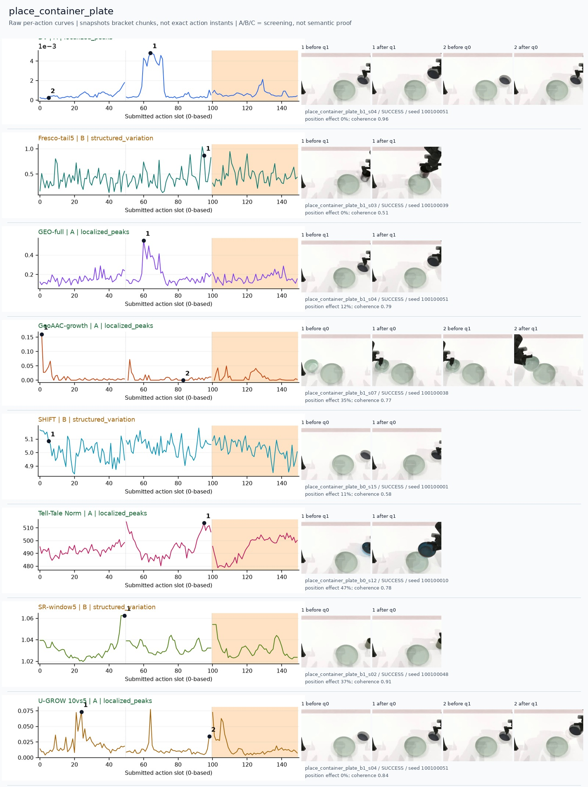
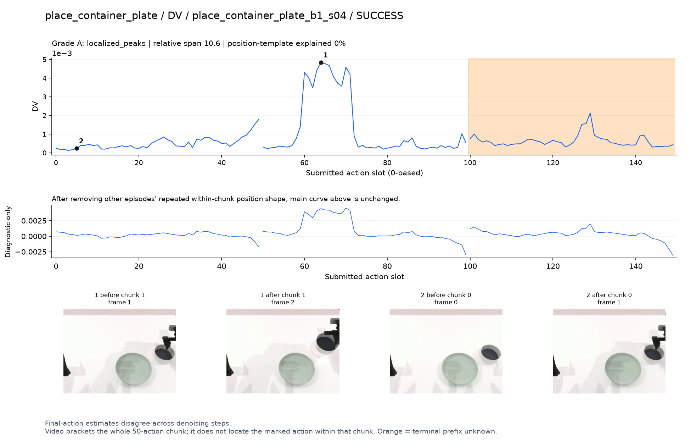
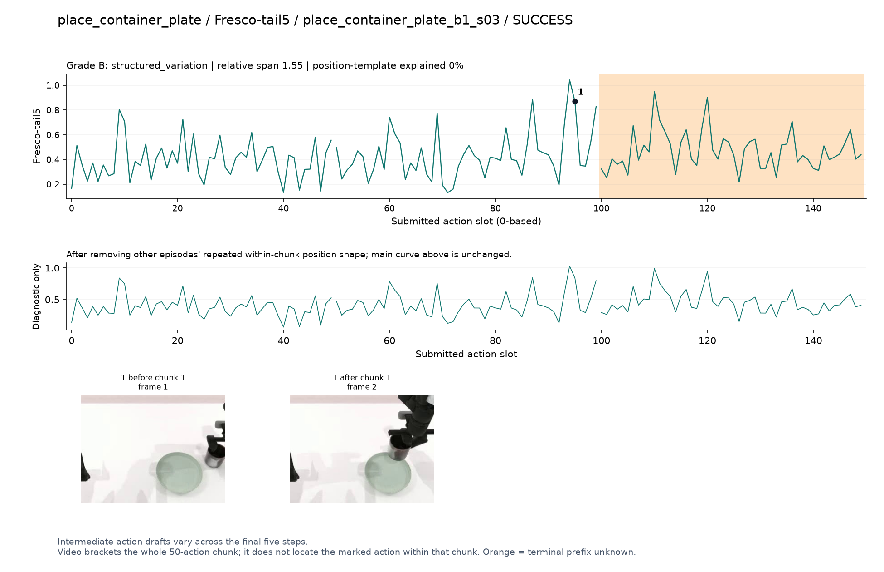
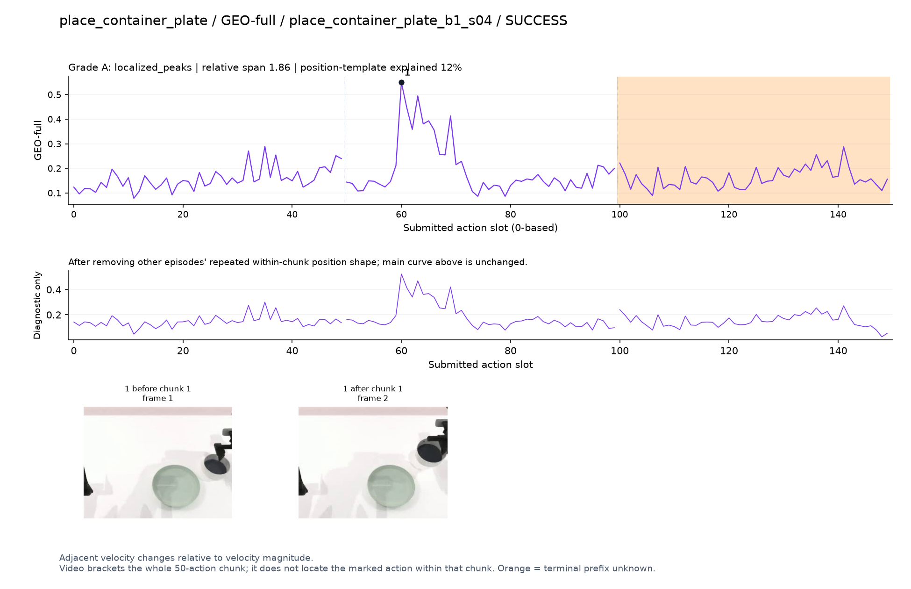
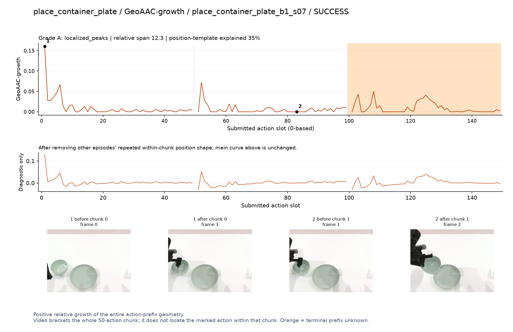
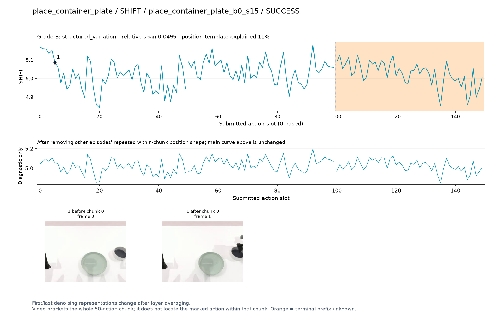
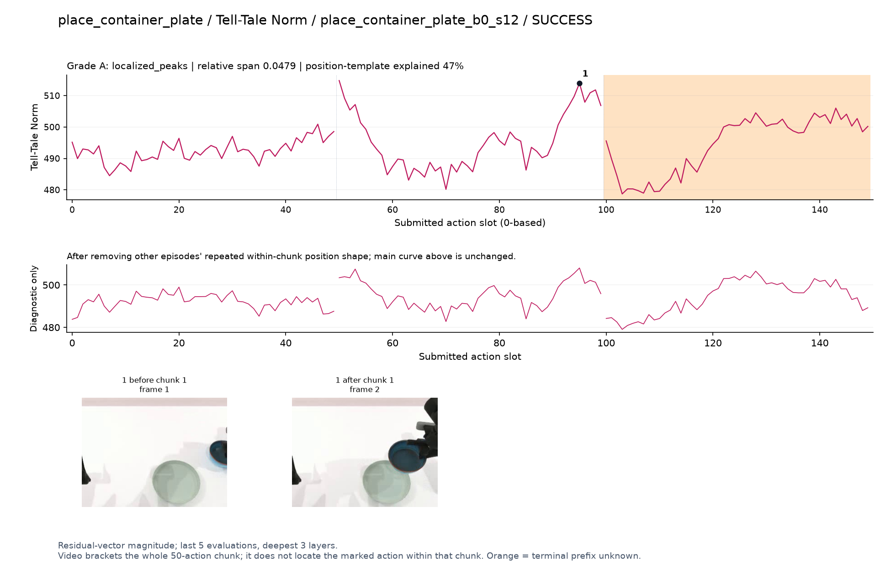
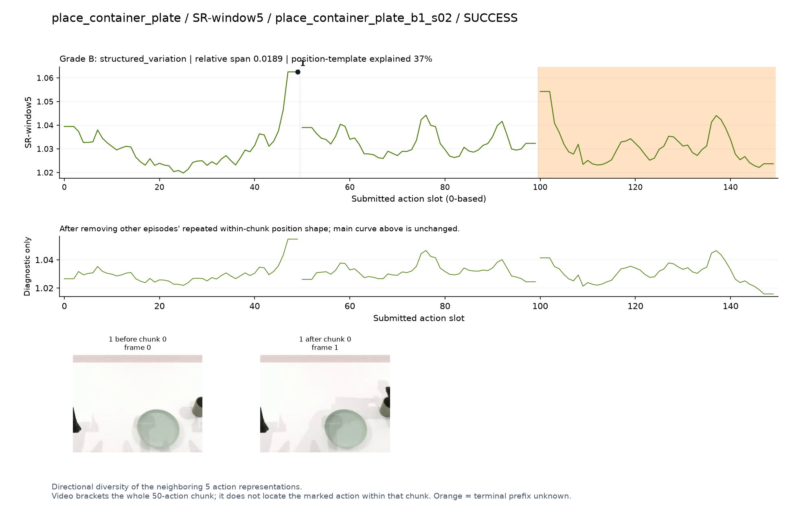
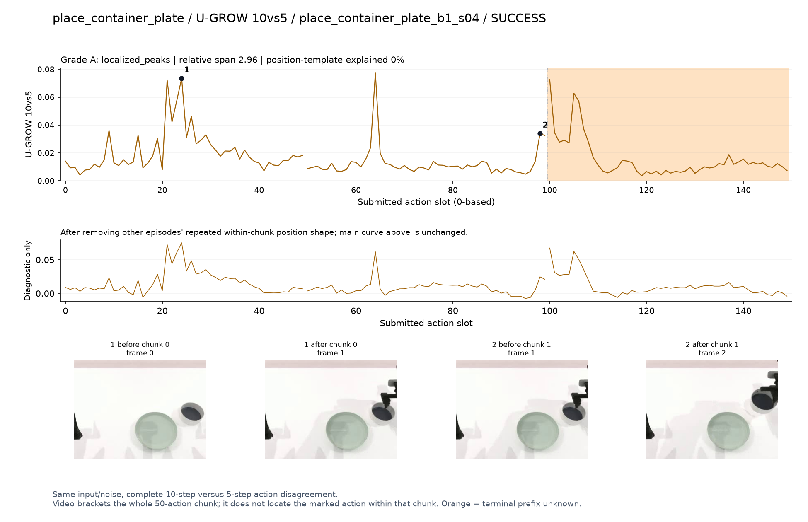

# place_container_plate

[全部任务](../README.md#全部任务) · [按信号看](../README.md#按信号看)

主图保留逐动作原始值；细虚线为chunk边界，橙色为终止段实际执行长度不明，未用于筛选。帧只对应chunk前后，不能精确定位某个h的接触瞬间。A/B/C是形态筛选等级，优先读人工备注。

## DV

**可解释候选**：候选：q1容器由桌面抬起时局部峰；画面在右缘。

轨迹 `place_container_plate_b1_s04`；成功；种子 `100100051`；正式验收。

[PNG原图](../figures/place_container_plate/dv.png) · [SVG矢量图](../figures/place_container_plate/dv.svg) · [完整元数据](../entries/place_container_plate/dv.json)

对应帧：[1 before q1](../frames/place_container_plate/place_container_plate_b1_s04/f001.jpg) · [1 after q1](../frames/place_container_plate/place_container_plate_b1_s04/f002.jpg) · [2 before q0](../frames/place_container_plate/place_container_plate_b1_s04/f000.jpg) · [2 after q0](../frames/place_container_plate/place_container_plate_b1_s04/f001.jpg)

## Fresco-tail5

**较弱**：弱：逐动作抖动较密，未见可靠独立事件对应；全数据与噪声到最终动作距离高度相关。

轨迹 `place_container_plate_b1_s03`；成功；种子 `100100039`；正式验收。

[PNG原图](../figures/place_container_plate/fresco.png) · [SVG矢量图](../figures/place_container_plate/fresco.svg) · [完整元数据](../entries/place_container_plate/fresco.json)

对应帧：[1 before q1](../frames/place_container_plate/place_container_plate_b1_s03/f001.jpg) · [1 after q1](../frames/place_container_plate/place_container_plate_b1_s03/f002.jpg)

## GEO-full

**可解释候选**：候选：同一轨迹q1抬容器时峰清楚。

轨迹 `place_container_plate_b1_s04`；成功；种子 `100100051`；正式验收。

[PNG原图](../figures/place_container_plate/geo.png) · [SVG矢量图](../figures/place_container_plate/geo.svg) · [完整元数据](../entries/place_container_plate/geo.json)

对应帧：[1 before q1](../frames/place_container_plate/place_container_plate_b1_s04/f001.jpg) · [1 after q1](../frames/place_container_plate/place_container_plate_b1_s04/f002.jpg)

## GeoAAC-growth

**较弱**：弱：q0前几个动作峰，不能解释为放到盘子的时刻。

轨迹 `place_container_plate_b1_s07`；成功；种子 `100100038`；正式验收。

[PNG原图](../figures/place_container_plate/geoaac.png) · [SVG矢量图](../figures/place_container_plate/geoaac.svg) · [完整元数据](../entries/place_container_plate/geoaac.json)

对应帧：[1 before q0](../frames/place_container_plate/place_container_plate_b1_s07/f000.jpg) · [1 after q0](../frames/place_container_plate/place_container_plate_b1_s07/f001.jpg) · [2 before q1](../frames/place_container_plate/place_container_plate_b1_s07/f001.jpg) · [2 after q1](../frames/place_container_plate/place_container_plate_b1_s07/f002.jpg)

## SHIFT

**较弱**：弱：小幅抖动/阶段基线变化，未见可靠独立事件对应；路径长度混杂强。

轨迹 `place_container_plate_b0_s15`；成功；种子 `100100001`；正式验收。

[PNG原图](../figures/place_container_plate/shift.png) · [SVG矢量图](../figures/place_container_plate/shift.svg) · [完整元数据](../entries/place_container_plate/shift.json)

对应帧：[1 before q0](../frames/place_container_plate/place_container_plate_b0_s15/f000.jpg) · [1 after q0](../frames/place_container_plate/place_container_plate_b0_s15/f001.jpg)

## Tell-Tale Norm

**可解释候选**：阶段候选：q1持容器靠近盘子时幅度高，但末端也有固定上升。

轨迹 `place_container_plate_b0_s12`；成功；种子 `100100010`；正式验收。

[PNG原图](../figures/place_container_plate/norm.png) · [SVG矢量图](../figures/place_container_plate/norm.svg) · [完整元数据](../entries/place_container_plate/norm.json)

对应帧：[1 before q1](../frames/place_container_plate/place_container_plate_b0_s12/f001.jpg) · [1 after q1](../frames/place_container_plate/place_container_plate_b0_s12/f002.jpg)

## SR-window5

**较弱**：弱：chunk末端升高，无法独立对应放置。

轨迹 `place_container_plate_b1_s02`；成功；种子 `100100048`；正式验收。

[PNG原图](../figures/place_container_plate/sr.png) · [SVG矢量图](../figures/place_container_plate/sr.svg) · [完整元数据](../entries/place_container_plate/sr.json)

对应帧：[1 before q0](../frames/place_container_plate/place_container_plate_b1_s02/f000.jpg) · [1 after q0](../frames/place_container_plate/place_container_plate_b1_s02/f001.jpg)

## U-GROW 10vs5

**受其他因素影响**：谨慎：q0接近容器有峰，部分动作靠近画面右缘。

轨迹 `place_container_plate_b1_s04`；成功；种子 `100100051`；正式验收。

[PNG原图](../figures/place_container_plate/ugrow.png) · [SVG矢量图](../figures/place_container_plate/ugrow.svg) · [完整元数据](../entries/place_container_plate/ugrow.json)

对应帧：[1 before q0](../frames/place_container_plate/place_container_plate_b1_s04/f000.jpg) · [1 after q0](../frames/place_container_plate/place_container_plate_b1_s04/f001.jpg) · [2 before q1](../frames/place_container_plate/place_container_plate_b1_s04/f001.jpg) · [2 after q1](../frames/place_container_plate/place_container_plate_b1_s04/f002.jpg)
