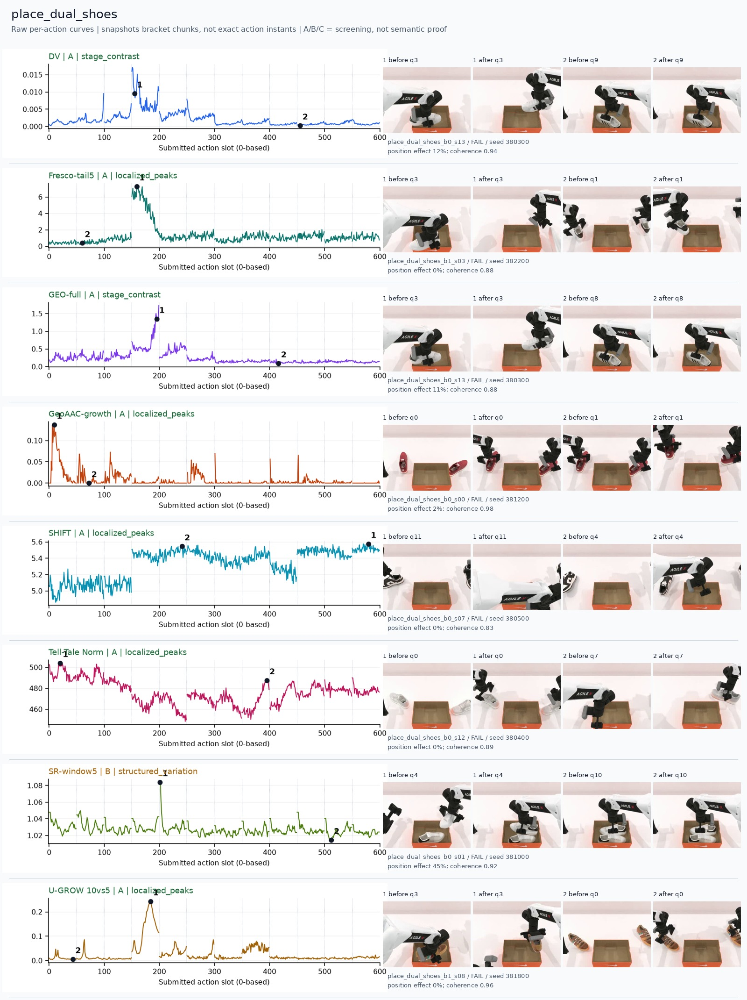
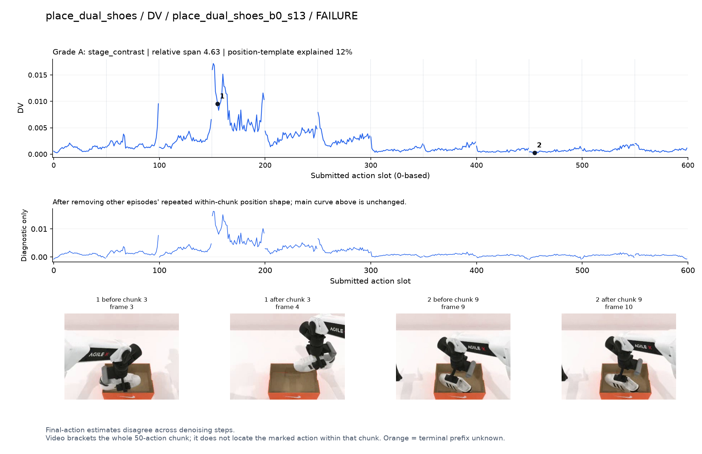
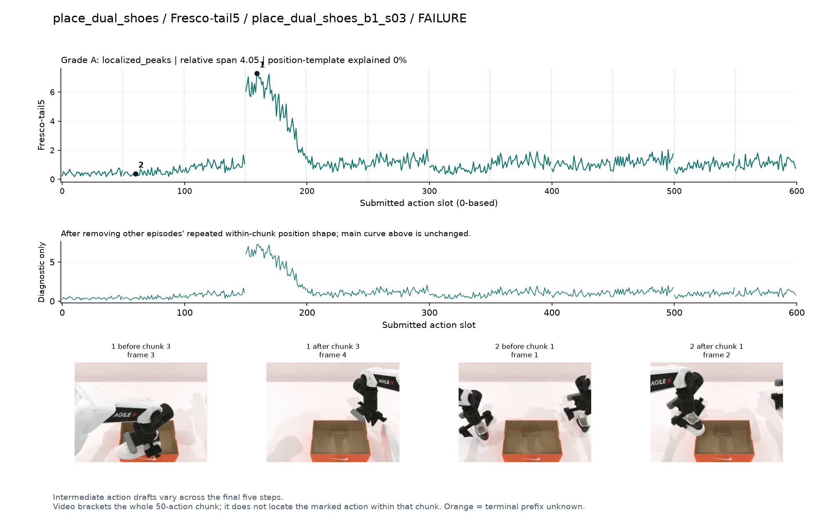
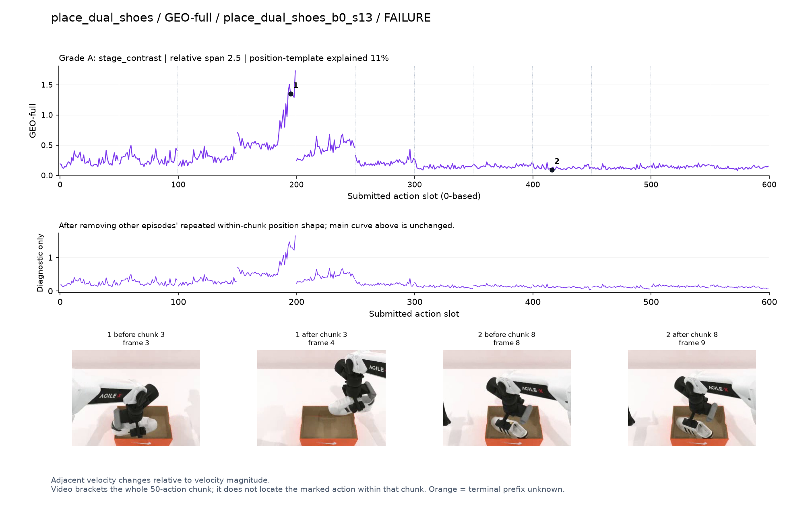
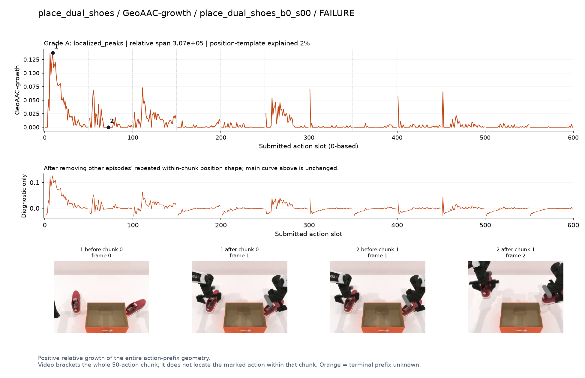
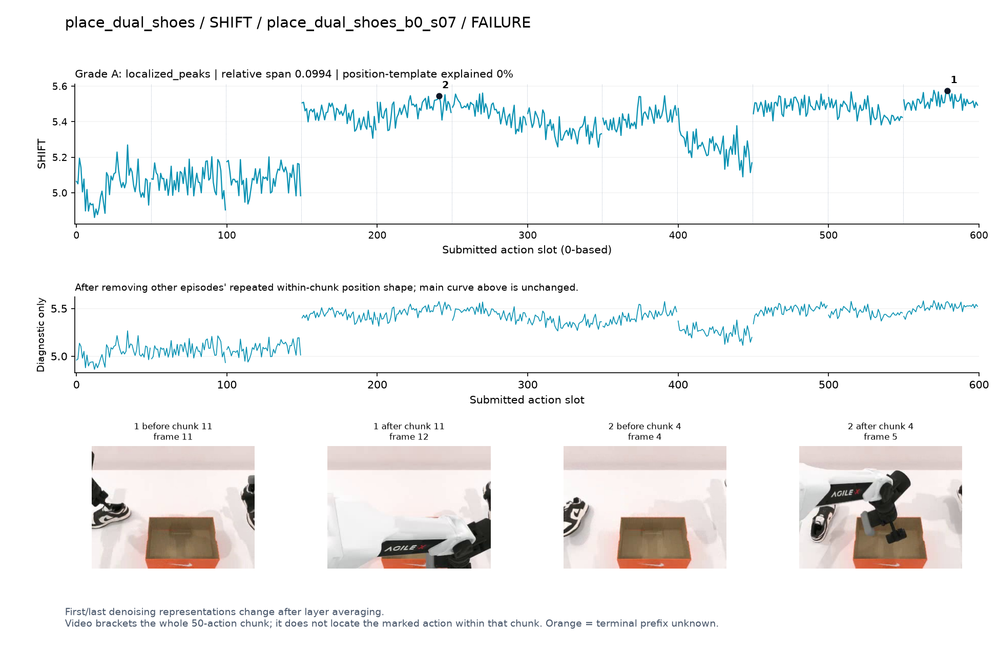
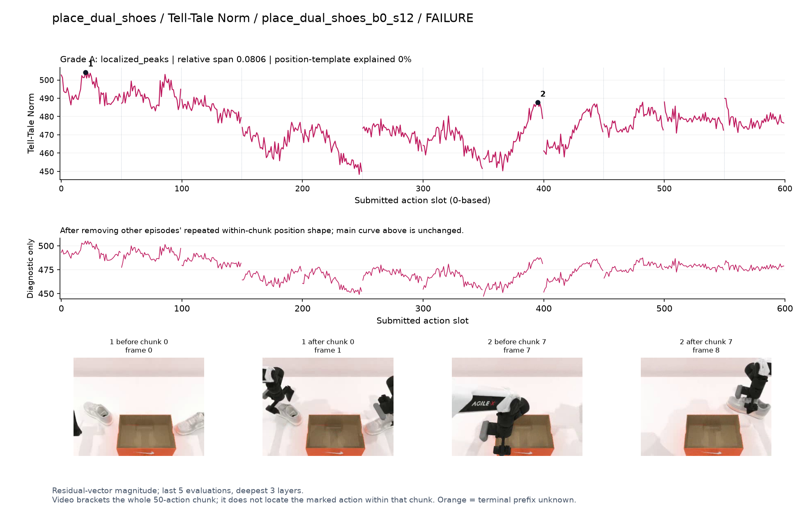
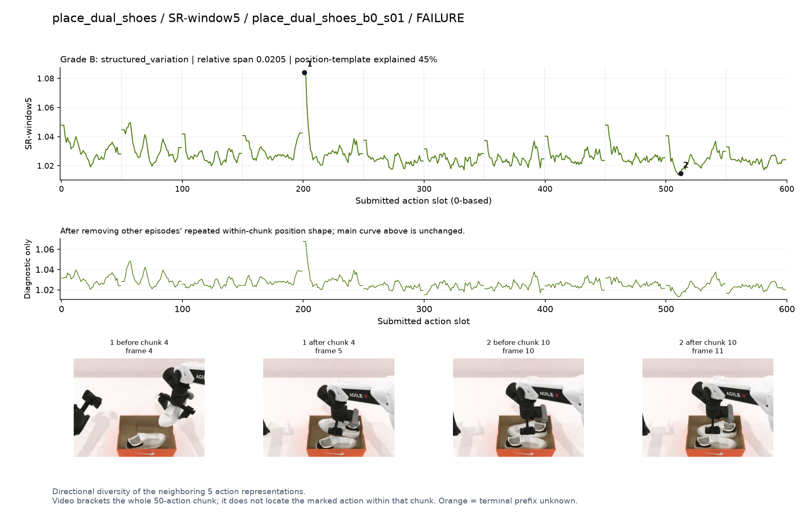
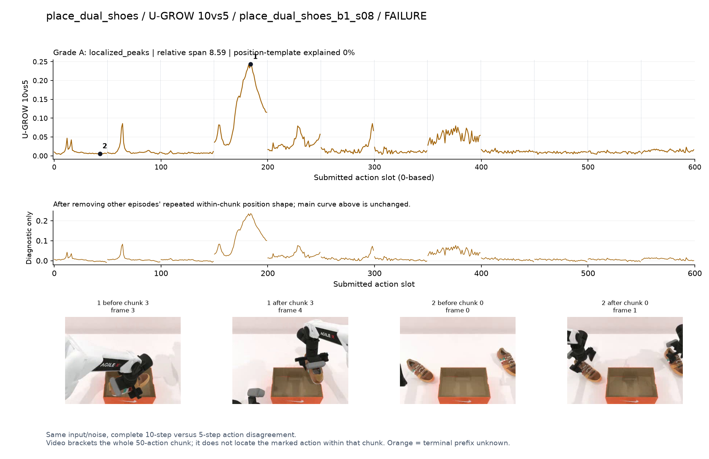

# place_dual_shoes

[全部任务](../README.md#全部任务) · [按信号看](../README.md#按信号看)

主图保留逐动作原始值；细虚线为chunk边界，橙色为终止段实际执行长度不明，未用于筛选。帧只对应chunk前后，不能精确定位某个h的接触瞬间。A/B/C是形态筛选等级，优先读人工备注。

## DV

**可解释候选**：失败例候选：q3鞋从箱内/箱边提起并调整时高，后面低。

轨迹 `place_dual_shoes_b0_s13`；失败例：该任务没有成功轨迹；种子 `380300`；正式验收。

[PNG原图](../figures/place_dual_shoes/dv.png) · [SVG矢量图](../figures/place_dual_shoes/dv.svg) · [完整元数据](../entries/place_dual_shoes/dv.json)

对应帧：[1 before q3](../frames/place_dual_shoes/place_dual_shoes_b0_s13/f003.jpg) · [1 after q3](../frames/place_dual_shoes/place_dual_shoes_b0_s13/f004.jpg) · [2 before q9](../frames/place_dual_shoes/place_dual_shoes_b0_s13/f009.jpg) · [2 after q9](../frames/place_dual_shoes/place_dual_shoes_b0_s13/f010.jpg)

## Fresco-tail5

**可解释候选**：失败例阶段候选：q3有强宽峰，画面见鞋抬起；但仍高度受生成路径长度影响。

轨迹 `place_dual_shoes_b1_s03`；失败例：该任务没有成功轨迹；种子 `382200`；正式验收。

[PNG原图](../figures/place_dual_shoes/fresco.png) · [SVG矢量图](../figures/place_dual_shoes/fresco.svg) · [完整元数据](../entries/place_dual_shoes/fresco.json)

对应帧：[1 before q3](../frames/place_dual_shoes/place_dual_shoes_b1_s03/f003.jpg) · [1 after q3](../frames/place_dual_shoes/place_dual_shoes_b1_s03/f004.jpg) · [2 before q1](../frames/place_dual_shoes/place_dual_shoes_b1_s03/f001.jpg) · [2 after q1](../frames/place_dual_shoes/place_dual_shoes_b1_s03/f002.jpg)

## GEO-full

**可解释候选**：失败例候选：同轨迹q3鞋的调整段高，低段仍未成功。

轨迹 `place_dual_shoes_b0_s13`；失败例：该任务没有成功轨迹；种子 `380300`；正式验收。

[PNG原图](../figures/place_dual_shoes/geo.png) · [SVG矢量图](../figures/place_dual_shoes/geo.svg) · [完整元数据](../entries/place_dual_shoes/geo.json)

对应帧：[1 before q3](../frames/place_dual_shoes/place_dual_shoes_b0_s13/f003.jpg) · [1 after q3](../frames/place_dual_shoes/place_dual_shoes_b0_s13/f004.jpg) · [2 before q8](../frames/place_dual_shoes/place_dual_shoes_b0_s13/f008.jpg) · [2 after q8](../frames/place_dual_shoes/place_dual_shoes_b0_s13/f009.jpg)

## GeoAAC-growth

**受其他因素影响**：失败例谨慎：初始接近较高，夹杂前缀开头尖峰。

轨迹 `place_dual_shoes_b0_s00`；失败例：该任务没有成功轨迹；种子 `381200`；正式验收。

[PNG原图](../figures/place_dual_shoes/geoaac.png) · [SVG矢量图](../figures/place_dual_shoes/geoaac.svg) · [完整元数据](../entries/place_dual_shoes/geoaac.json)

对应帧：[1 before q0](../frames/place_dual_shoes/place_dual_shoes_b0_s00/f000.jpg) · [1 after q0](../frames/place_dual_shoes/place_dual_shoes_b0_s00/f001.jpg) · [2 before q1](../frames/place_dual_shoes/place_dual_shoes_b0_s00/f001.jpg) · [2 after q1](../frames/place_dual_shoes/place_dual_shoes_b0_s00/f002.jpg)

## SHIFT

**可解释候选**：失败例阶段候选：q3后多个chunk整体抬高，不是少量事件峰；路径长度混杂明显。

轨迹 `place_dual_shoes_b0_s07`；失败例：该任务没有成功轨迹；种子 `380500`；正式验收。

[PNG原图](../figures/place_dual_shoes/shift.png) · [SVG矢量图](../figures/place_dual_shoes/shift.svg) · [完整元数据](../entries/place_dual_shoes/shift.json)

对应帧：[1 before q11](../frames/place_dual_shoes/place_dual_shoes_b0_s07/f011.jpg) · [1 after q11](../frames/place_dual_shoes/place_dual_shoes_b0_s07/f012.jpg) · [2 before q4](../frames/place_dual_shoes/place_dual_shoes_b0_s07/f004.jpg) · [2 after q4](../frames/place_dual_shoes/place_dual_shoes_b0_s07/f005.jpg)

## Tell-Tale Norm

**阶段变化**：失败例阶段差异：早期拿鞋幅度高，后续低；不能解释为成功程度。

轨迹 `place_dual_shoes_b0_s12`；失败例：该任务没有成功轨迹；种子 `380400`；正式验收。

[PNG原图](../figures/place_dual_shoes/norm.png) · [SVG矢量图](../figures/place_dual_shoes/norm.svg) · [完整元数据](../entries/place_dual_shoes/norm.json)

对应帧：[1 before q0](../frames/place_dual_shoes/place_dual_shoes_b0_s12/f000.jpg) · [1 after q0](../frames/place_dual_shoes/place_dual_shoes_b0_s12/f001.jpg) · [2 before q7](../frames/place_dual_shoes/place_dual_shoes_b0_s12/f007.jpg) · [2 after q7](../frames/place_dual_shoes/place_dual_shoes_b0_s12/f008.jpg)

## SR-window5

**受其他因素影响**：失败例谨慎：q4开始附近强峰与chunk边界重合。

轨迹 `place_dual_shoes_b0_s01`；失败例：该任务没有成功轨迹；种子 `381000`；正式验收。

[PNG原图](../figures/place_dual_shoes/sr.png) · [SVG矢量图](../figures/place_dual_shoes/sr.svg) · [完整元数据](../entries/place_dual_shoes/sr.json)

对应帧：[1 before q4](../frames/place_dual_shoes/place_dual_shoes_b0_s01/f004.jpg) · [1 after q4](../frames/place_dual_shoes/place_dual_shoes_b0_s01/f005.jpg) · [2 before q10](../frames/place_dual_shoes/place_dual_shoes_b0_s01/f010.jpg) · [2 after q10](../frames/place_dual_shoes/place_dual_shoes_b0_s01/f011.jpg)

## U-GROW 10vs5

**可解释候选**：失败例候选：q3鞋在箱边旋转/调整时明显峰。

轨迹 `place_dual_shoes_b1_s08`；失败例：该任务没有成功轨迹；种子 `381800`；正式验收。

[PNG原图](../figures/place_dual_shoes/ugrow.png) · [SVG矢量图](../figures/place_dual_shoes/ugrow.svg) · [完整元数据](../entries/place_dual_shoes/ugrow.json)

对应帧：[1 before q3](../frames/place_dual_shoes/place_dual_shoes_b1_s08/f003.jpg) · [1 after q3](../frames/place_dual_shoes/place_dual_shoes_b1_s08/f004.jpg) · [2 before q0](../frames/place_dual_shoes/place_dual_shoes_b1_s08/f000.jpg) · [2 after q0](../frames/place_dual_shoes/place_dual_shoes_b1_s08/f001.jpg)
