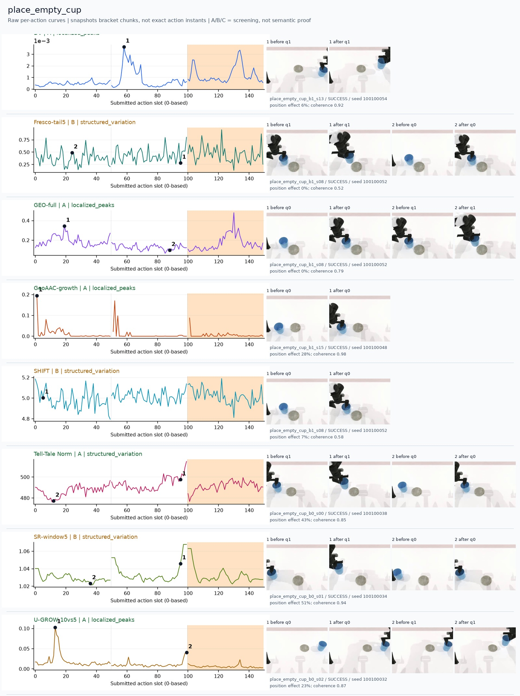
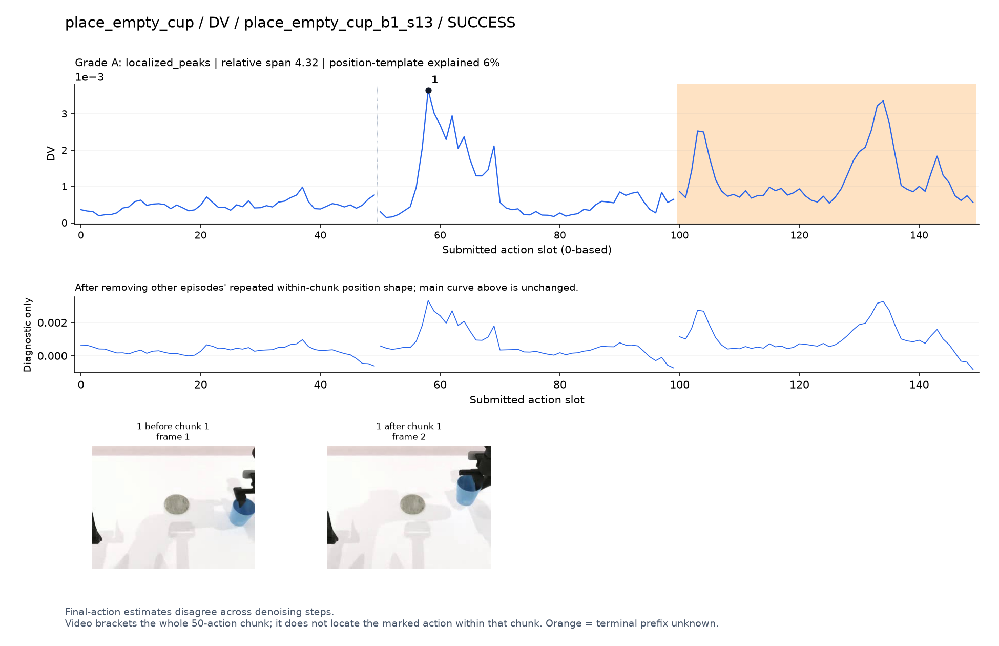
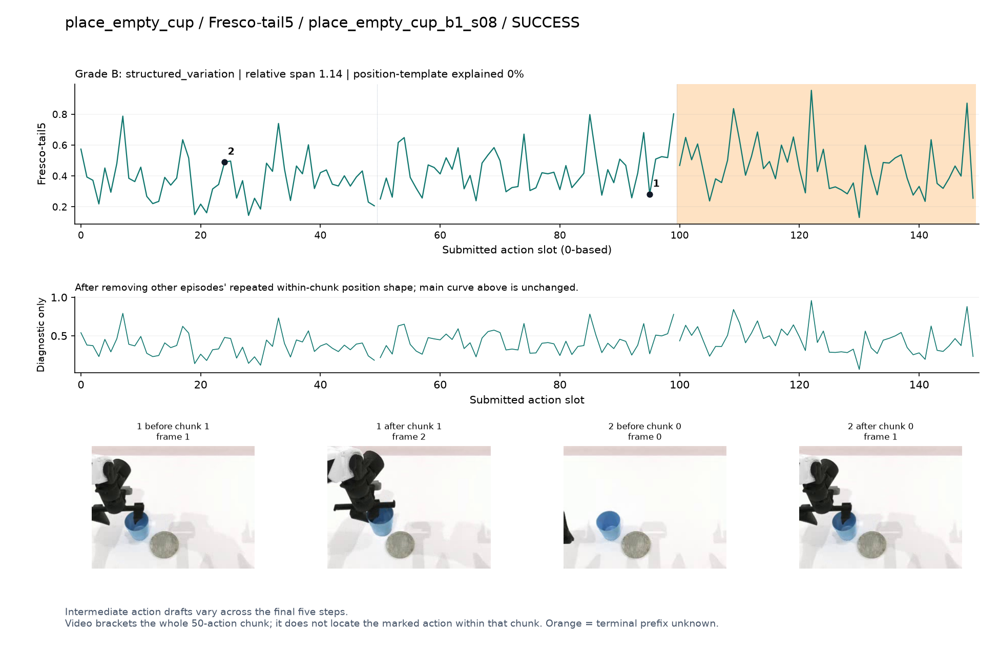
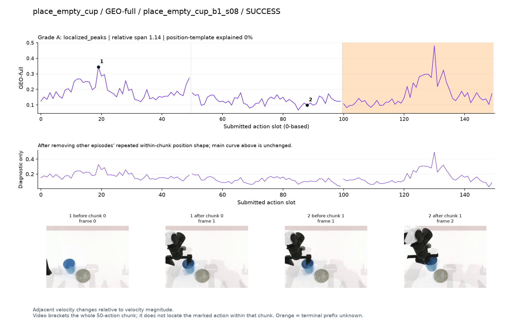
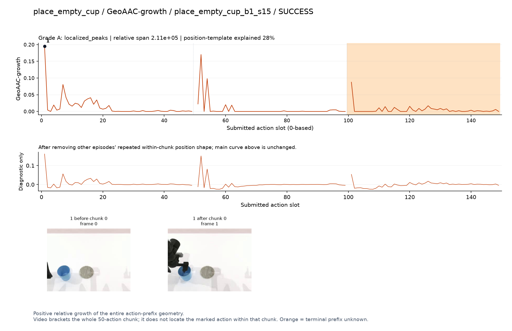
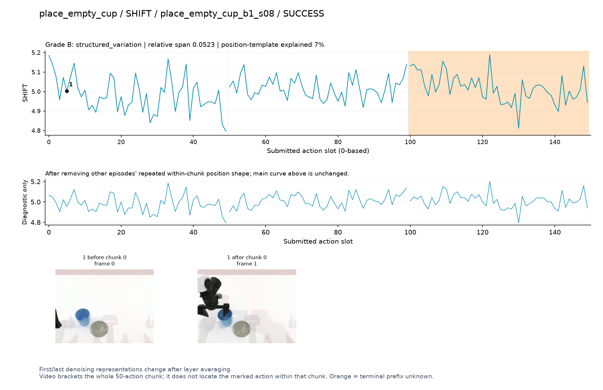
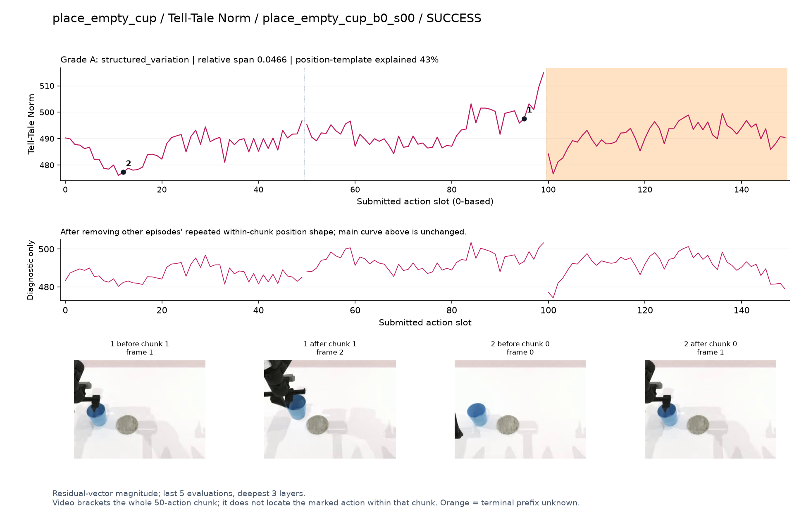
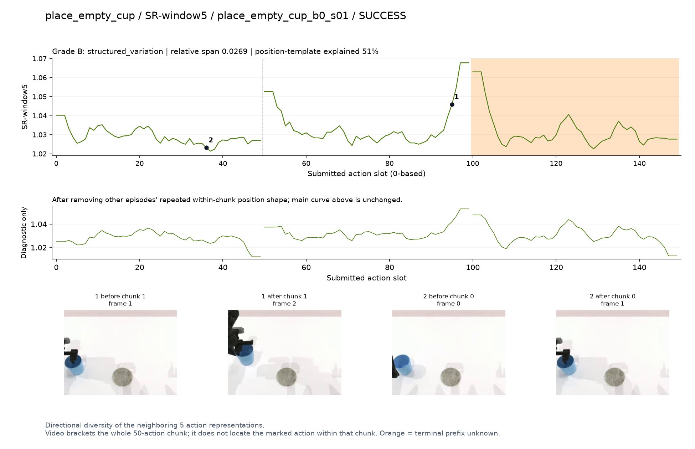
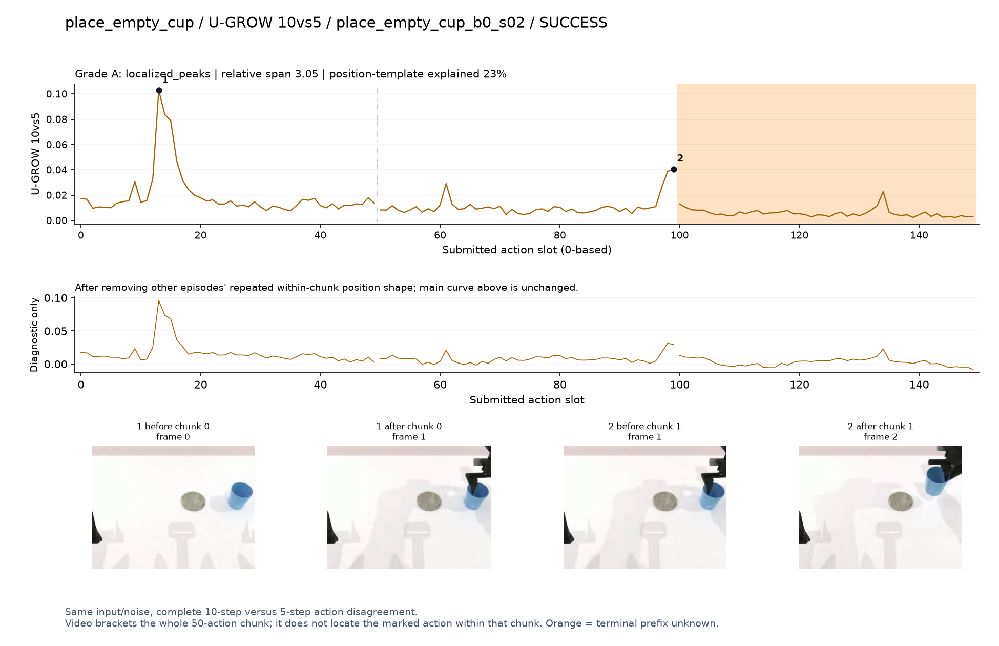

# place_empty_cup

[全部任务](../README.md#全部任务) · [按信号看](../README.md#按信号看)

主图保留逐动作原始值；细虚线为chunk边界，橙色为终止段实际执行长度不明，未用于筛选。帧只对应chunk前后，不能精确定位某个h的接触瞬间。A/B/C是形态筛选等级，优先读人工备注。

## DV

**可解释候选**：候选：q1抬杯时局部峰；终止段不用于解释。

轨迹 `place_empty_cup_b1_s13`；成功；种子 `100100054`；正式验收。

[PNG原图](../figures/place_empty_cup/dv.png) · [SVG矢量图](../figures/place_empty_cup/dv.svg) · [完整元数据](../entries/place_empty_cup/dv.json)

对应帧：[1 before q1](../frames/place_empty_cup/place_empty_cup_b1_s13/f001.jpg) · [1 after q1](../frames/place_empty_cup/place_empty_cup_b1_s13/f002.jpg)

## Fresco-tail5

**较弱**：弱：逐动作抖动较密，未见可靠独立事件对应；全数据与噪声到最终动作距离高度相关。

轨迹 `place_empty_cup_b1_s08`；成功；种子 `100100052`；正式验收。

[PNG原图](../figures/place_empty_cup/fresco.png) · [SVG矢量图](../figures/place_empty_cup/fresco.svg) · [完整元数据](../entries/place_empty_cup/fresco.json)

对应帧：[1 before q1](../frames/place_empty_cup/place_empty_cup_b1_s08/f001.jpg) · [1 after q1](../frames/place_empty_cup/place_empty_cup_b1_s08/f002.jpg) · [2 before q0](../frames/place_empty_cup/place_empty_cup_b1_s08/f000.jpg) · [2 after q0](../frames/place_empty_cup/place_empty_cup_b1_s08/f001.jpg)

## GEO-full

**可解释候选**：候选：q0夹爪接近杯口时高，之后降低。

轨迹 `place_empty_cup_b1_s08`；成功；种子 `100100052`；正式验收。

[PNG原图](../figures/place_empty_cup/geo.png) · [SVG矢量图](../figures/place_empty_cup/geo.svg) · [完整元数据](../entries/place_empty_cup/geo.json)

对应帧：[1 before q0](../frames/place_empty_cup/place_empty_cup_b1_s08/f000.jpg) · [1 after q0](../frames/place_empty_cup/place_empty_cup_b1_s08/f001.jpg) · [2 before q1](../frames/place_empty_cup/place_empty_cup_b1_s08/f001.jpg) · [2 after q1](../frames/place_empty_cup/place_empty_cup_b1_s08/f002.jpg)

## GeoAAC-growth

**较弱**：弱：q0/q1最前位置尖峰，前缀结构主导。

轨迹 `place_empty_cup_b1_s15`；成功；种子 `100100048`；正式验收。

[PNG原图](../figures/place_empty_cup/geoaac.png) · [SVG矢量图](../figures/place_empty_cup/geoaac.svg) · [完整元数据](../entries/place_empty_cup/geoaac.json)

对应帧：[1 before q0](../frames/place_empty_cup/place_empty_cup_b1_s15/f000.jpg) · [1 after q0](../frames/place_empty_cup/place_empty_cup_b1_s15/f001.jpg)

## SHIFT

**较弱**：弱：小幅抖动/阶段基线变化，未见可靠独立事件对应；路径长度混杂强。

轨迹 `place_empty_cup_b1_s08`；成功；种子 `100100052`；正式验收。

[PNG原图](../figures/place_empty_cup/shift.png) · [SVG矢量图](../figures/place_empty_cup/shift.svg) · [完整元数据](../entries/place_empty_cup/shift.json)

对应帧：[1 before q0](../frames/place_empty_cup/place_empty_cup_b1_s08/f000.jpg) · [1 after q0](../frames/place_empty_cup/place_empty_cup_b1_s08/f001.jpg)

## Tell-Tale Norm

**受其他因素影响**：谨慎：q1末端幅度上升，位置效应显著。

轨迹 `place_empty_cup_b0_s00`；成功；种子 `100100038`；正式验收。

[PNG原图](../figures/place_empty_cup/norm.png) · [SVG矢量图](../figures/place_empty_cup/norm.svg) · [完整元数据](../entries/place_empty_cup/norm.json)

对应帧：[1 before q1](../frames/place_empty_cup/place_empty_cup_b0_s00/f001.jpg) · [1 after q1](../frames/place_empty_cup/place_empty_cup_b0_s00/f002.jpg) · [2 before q0](../frames/place_empty_cup/place_empty_cup_b0_s00/f000.jpg) · [2 after q0](../frames/place_empty_cup/place_empty_cup_b0_s00/f001.jpg)

## SR-window5

**较弱**：弱：chunk末端系统性上升。

轨迹 `place_empty_cup_b0_s01`；成功；种子 `100100034`；正式验收。

[PNG原图](../figures/place_empty_cup/sr.png) · [SVG矢量图](../figures/place_empty_cup/sr.svg) · [完整元数据](../entries/place_empty_cup/sr.json)

对应帧：[1 before q1](../frames/place_empty_cup/place_empty_cup_b0_s01/f001.jpg) · [1 after q1](../frames/place_empty_cup/place_empty_cup_b0_s01/f002.jpg) · [2 before q0](../frames/place_empty_cup/place_empty_cup_b0_s01/f000.jpg) · [2 after q0](../frames/place_empty_cup/place_empty_cup_b0_s01/f001.jpg)

## U-GROW 10vs5

**可解释候选**：候选：q0接近杯子阶段孤立主峰。

轨迹 `place_empty_cup_b0_s02`；成功；种子 `100100032`；正式验收。

[PNG原图](../figures/place_empty_cup/ugrow.png) · [SVG矢量图](../figures/place_empty_cup/ugrow.svg) · [完整元数据](../entries/place_empty_cup/ugrow.json)

对应帧：[1 before q0](../frames/place_empty_cup/place_empty_cup_b0_s02/f000.jpg) · [1 after q0](../frames/place_empty_cup/place_empty_cup_b0_s02/f001.jpg) · [2 before q1](../frames/place_empty_cup/place_empty_cup_b0_s02/f001.jpg) · [2 after q1](../frames/place_empty_cup/place_empty_cup_b0_s02/f002.jpg)
