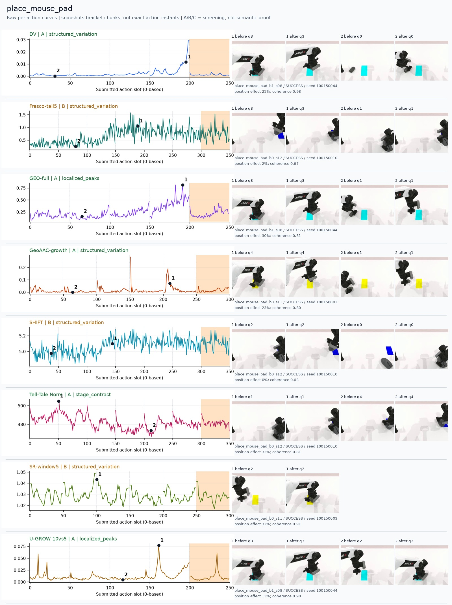
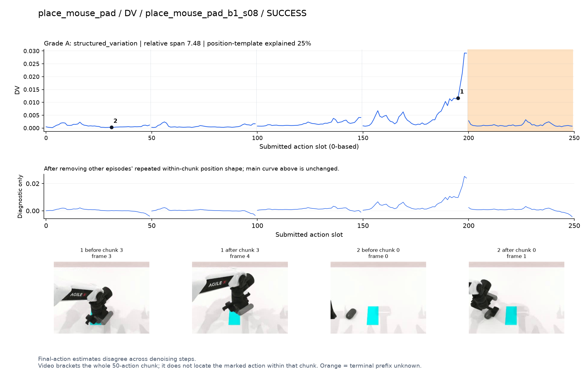
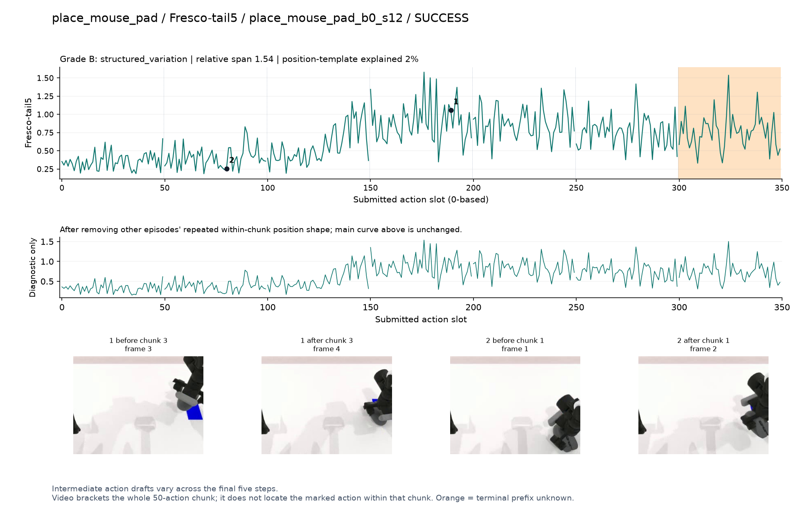
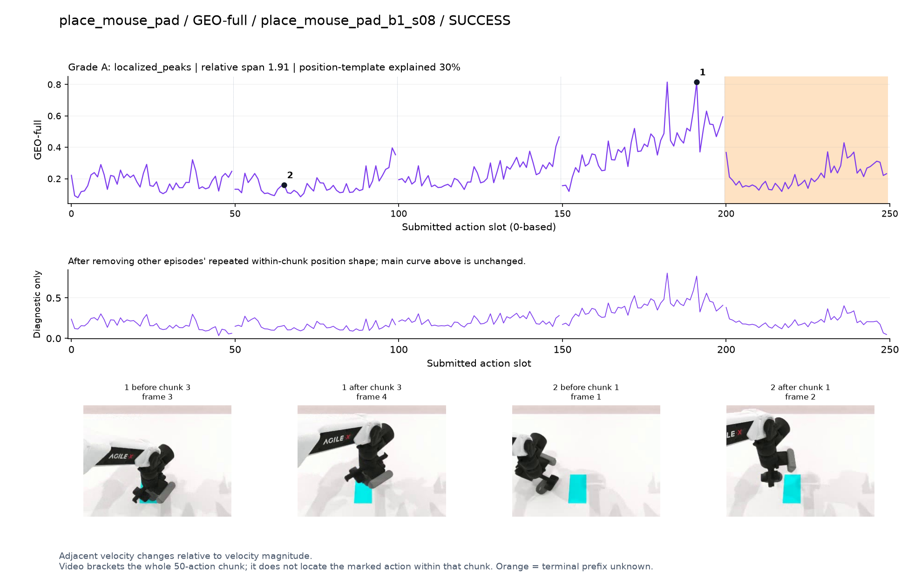
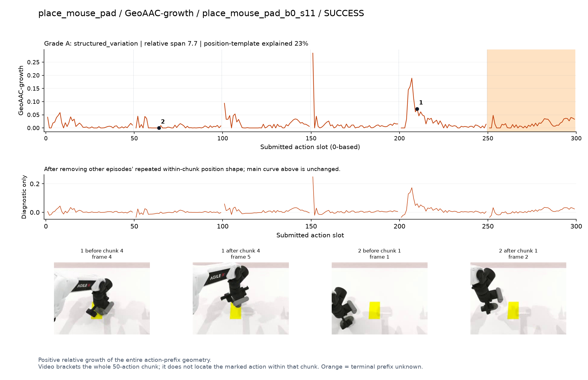
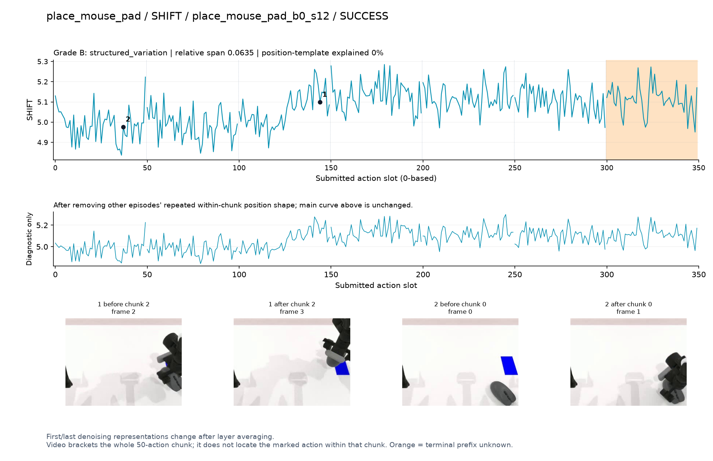
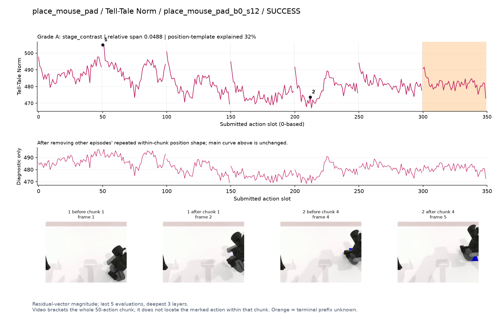
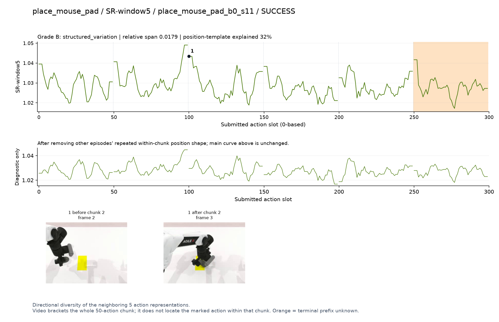
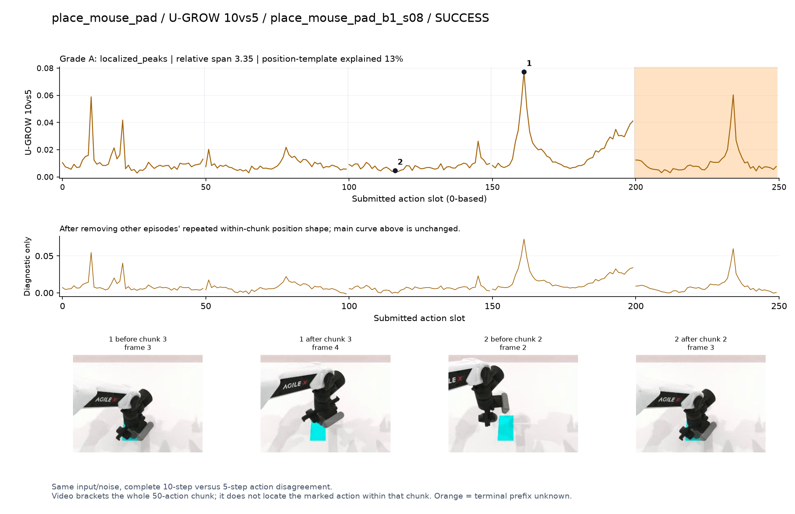

# place_mouse_pad

[全部任务](../README.md#全部任务) · [按信号看](../README.md#按信号看)

主图保留逐动作原始值；细虚线为chunk边界，橙色为终止段实际执行长度不明，未用于筛选。帧只对应chunk前后，不能精确定位某个h的接触瞬间。A/B/C是形态筛选等级，优先读人工备注。

## DV

**可解释候选**：候选：q3鼠标贴近垫子调整时末段强升高。

轨迹 `place_mouse_pad_b1_s08`；成功；种子 `100150044`；正式验收。

[PNG原图](../figures/place_mouse_pad/dv.png) · [SVG矢量图](../figures/place_mouse_pad/dv.svg) · [完整元数据](../entries/place_mouse_pad/dv.json)

对应帧：[1 before q3](../frames/place_mouse_pad/place_mouse_pad_b1_s08/f003.jpg) · [1 after q3](../frames/place_mouse_pad/place_mouse_pad_b1_s08/f004.jpg) · [2 before q0](../frames/place_mouse_pad/place_mouse_pad_b1_s08/f000.jpg) · [2 after q0](../frames/place_mouse_pad/place_mouse_pad_b1_s08/f001.jpg)

## Fresco-tail5

**较弱**：弱：逐动作抖动较密，未见可靠独立事件对应；全数据与噪声到最终动作距离高度相关。

轨迹 `place_mouse_pad_b0_s12`；成功；种子 `100150010`；正式验收。

[PNG原图](../figures/place_mouse_pad/fresco.png) · [SVG矢量图](../figures/place_mouse_pad/fresco.svg) · [完整元数据](../entries/place_mouse_pad/fresco.json)

对应帧：[1 before q3](../frames/place_mouse_pad/place_mouse_pad_b0_s12/f003.jpg) · [1 after q3](../frames/place_mouse_pad/place_mouse_pad_b0_s12/f004.jpg) · [2 before q1](../frames/place_mouse_pad/place_mouse_pad_b0_s12/f001.jpg) · [2 after q1](../frames/place_mouse_pad/place_mouse_pad_b0_s12/f002.jpg)

## GEO-full

**可解释候选**：候选：同轨迹q3垫子上操作时高。

轨迹 `place_mouse_pad_b1_s08`；成功；种子 `100150044`；正式验收。

[PNG原图](../figures/place_mouse_pad/geo.png) · [SVG矢量图](../figures/place_mouse_pad/geo.svg) · [完整元数据](../entries/place_mouse_pad/geo.json)

对应帧：[1 before q3](../frames/place_mouse_pad/place_mouse_pad_b1_s08/f003.jpg) · [1 after q3](../frames/place_mouse_pad/place_mouse_pad_b1_s08/f004.jpg) · [2 before q1](../frames/place_mouse_pad/place_mouse_pad_b1_s08/f001.jpg) · [2 after q1](../frames/place_mouse_pad/place_mouse_pad_b1_s08/f002.jpg)

## GeoAAC-growth

**较弱**：弱：多chunk开始尖峰，画面不足以区分具体放置事件。

轨迹 `place_mouse_pad_b0_s11`；成功；种子 `100150003`；正式验收。

[PNG原图](../figures/place_mouse_pad/geoaac.png) · [SVG矢量图](../figures/place_mouse_pad/geoaac.svg) · [完整元数据](../entries/place_mouse_pad/geoaac.json)

对应帧：[1 before q4](../frames/place_mouse_pad/place_mouse_pad_b0_s11/f004.jpg) · [1 after q4](../frames/place_mouse_pad/place_mouse_pad_b0_s11/f005.jpg) · [2 before q1](../frames/place_mouse_pad/place_mouse_pad_b0_s11/f001.jpg) · [2 after q1](../frames/place_mouse_pad/place_mouse_pad_b0_s11/f002.jpg)

## SHIFT

**较弱**：弱：小幅抖动/阶段基线变化，未见可靠独立事件对应；路径长度混杂强。

轨迹 `place_mouse_pad_b0_s12`；成功；种子 `100150010`；正式验收。

[PNG原图](../figures/place_mouse_pad/shift.png) · [SVG矢量图](../figures/place_mouse_pad/shift.svg) · [完整元数据](../entries/place_mouse_pad/shift.json)

对应帧：[1 before q2](../frames/place_mouse_pad/place_mouse_pad_b0_s12/f002.jpg) · [1 after q2](../frames/place_mouse_pad/place_mouse_pad_b0_s12/f003.jpg) · [2 before q0](../frames/place_mouse_pad/place_mouse_pad_b0_s12/f000.jpg) · [2 after q0](../frames/place_mouse_pad/place_mouse_pad_b0_s12/f001.jpg)

## Tell-Tale Norm

**较弱**：弱阶段差异：q1拿鼠标较高、之后较低，重复边界尖峰不少。

轨迹 `place_mouse_pad_b0_s12`；成功；种子 `100150010`；正式验收。

[PNG原图](../figures/place_mouse_pad/norm.png) · [SVG矢量图](../figures/place_mouse_pad/norm.svg) · [完整元数据](../entries/place_mouse_pad/norm.json)

对应帧：[1 before q1](../frames/place_mouse_pad/place_mouse_pad_b0_s12/f001.jpg) · [1 after q1](../frames/place_mouse_pad/place_mouse_pad_b0_s12/f002.jpg) · [2 before q4](../frames/place_mouse_pad/place_mouse_pad_b0_s12/f004.jpg) · [2 after q4](../frames/place_mouse_pad/place_mouse_pad_b0_s12/f005.jpg)

## SR-window5

**较弱**：弱：小幅多峰，主要标记在chunk边界。

轨迹 `place_mouse_pad_b0_s11`；成功；种子 `100150003`；正式验收。

[PNG原图](../figures/place_mouse_pad/sr.png) · [SVG矢量图](../figures/place_mouse_pad/sr.svg) · [完整元数据](../entries/place_mouse_pad/sr.json)

对应帧：[1 before q2](../frames/place_mouse_pad/place_mouse_pad_b0_s11/f002.jpg) · [1 after q2](../frames/place_mouse_pad/place_mouse_pad_b0_s11/f003.jpg)

## U-GROW 10vs5

**可解释候选**：候选：同轨迹q3垫子上调整时窄峰。

轨迹 `place_mouse_pad_b1_s08`；成功；种子 `100150044`；正式验收。

[PNG原图](../figures/place_mouse_pad/ugrow.png) · [SVG矢量图](../figures/place_mouse_pad/ugrow.svg) · [完整元数据](../entries/place_mouse_pad/ugrow.json)

对应帧：[1 before q3](../frames/place_mouse_pad/place_mouse_pad_b1_s08/f003.jpg) · [1 after q3](../frames/place_mouse_pad/place_mouse_pad_b1_s08/f004.jpg) · [2 before q2](../frames/place_mouse_pad/place_mouse_pad_b1_s08/f002.jpg) · [2 after q2](../frames/place_mouse_pad/place_mouse_pad_b1_s08/f003.jpg)
