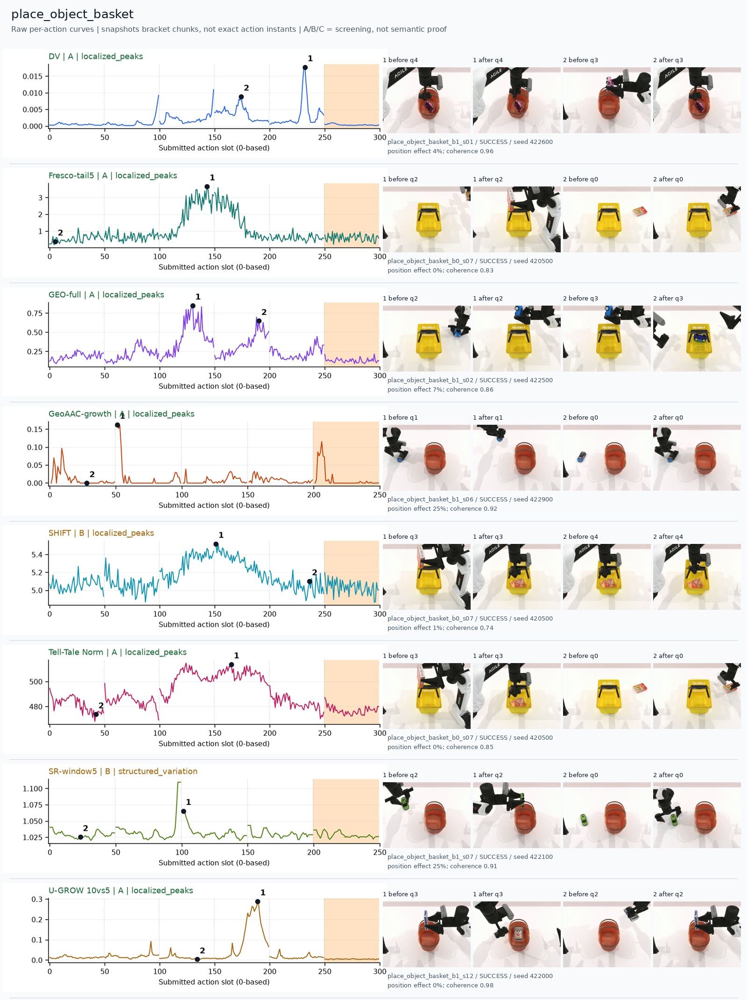
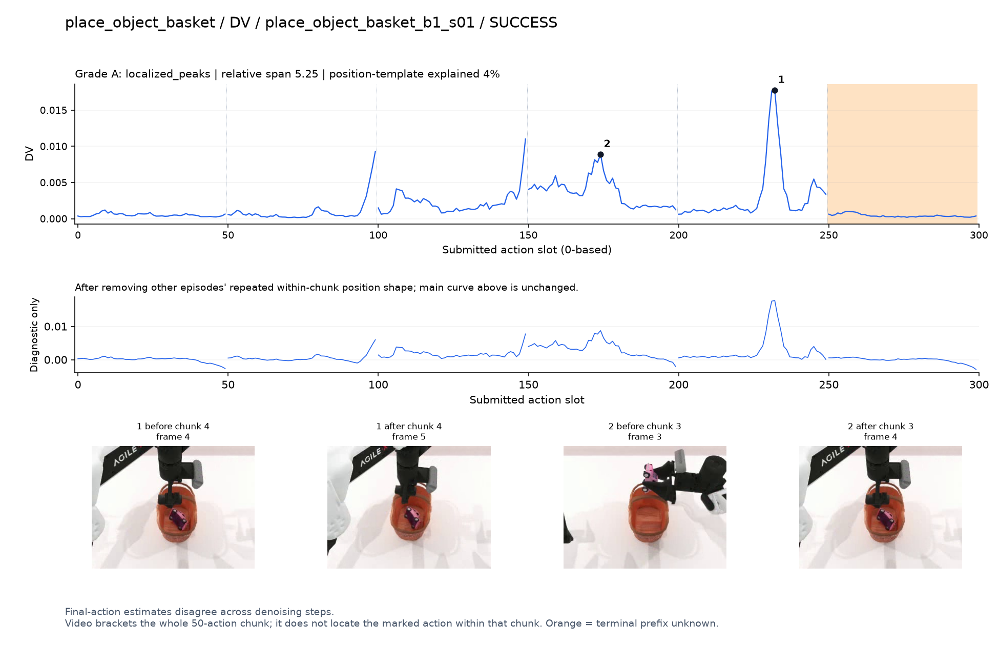
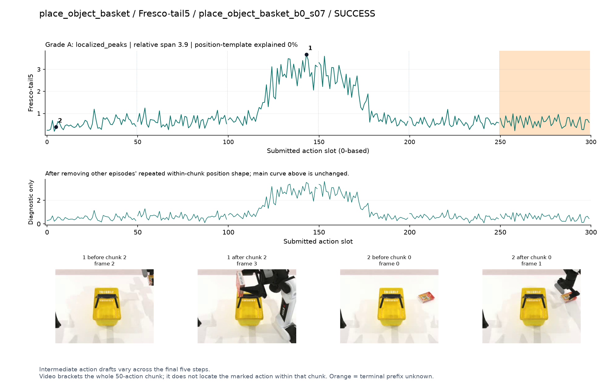
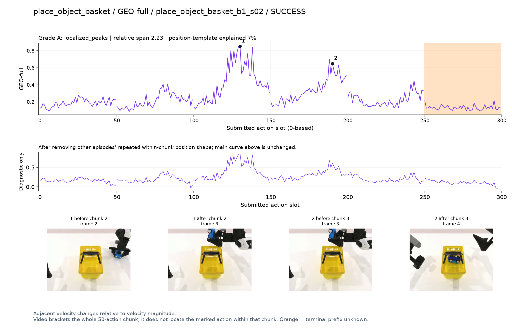
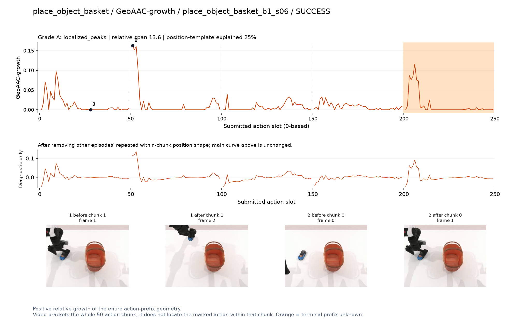
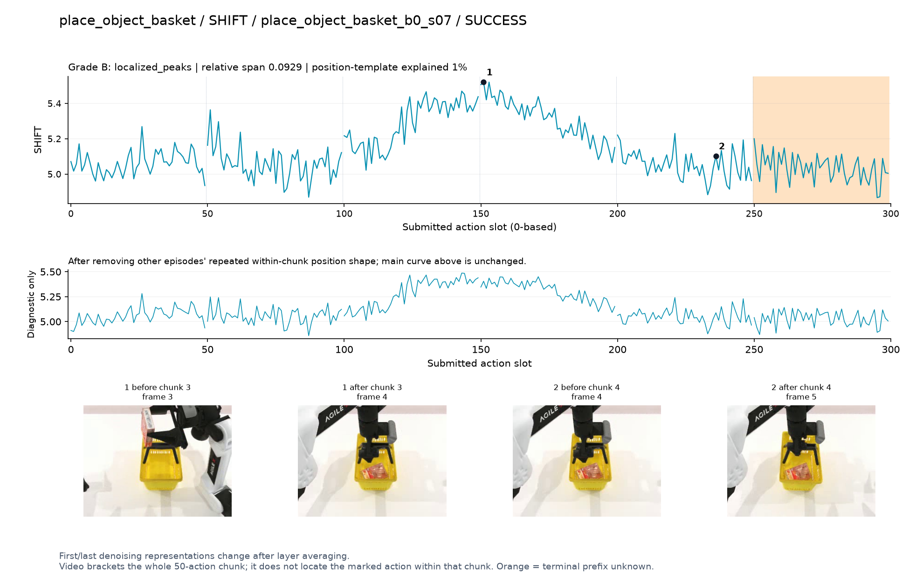
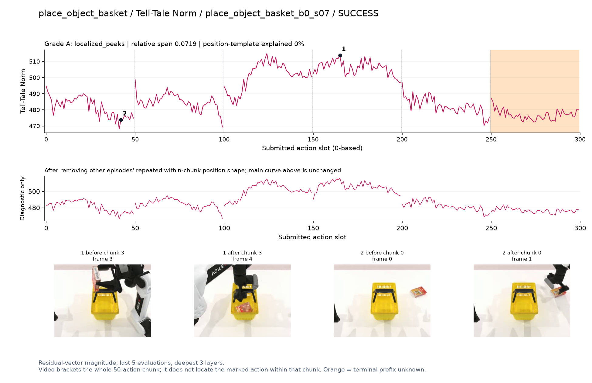
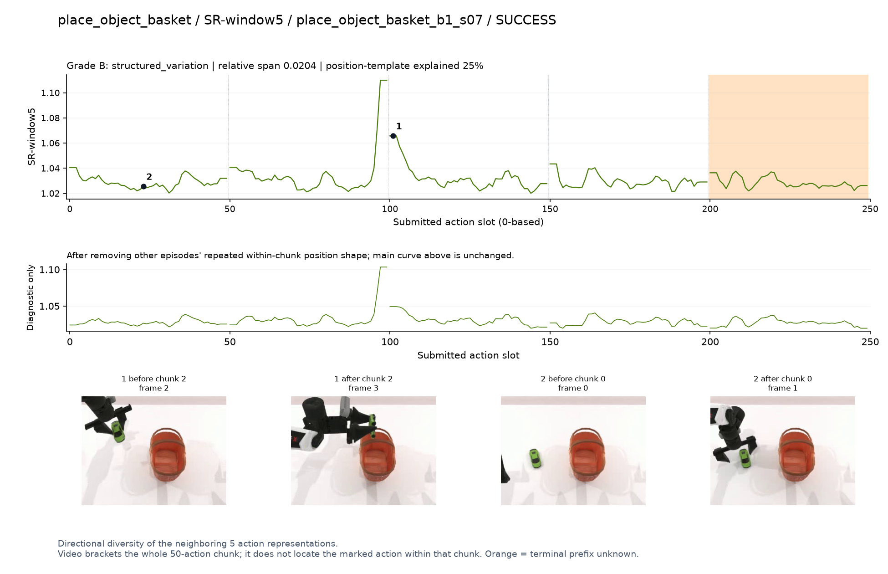
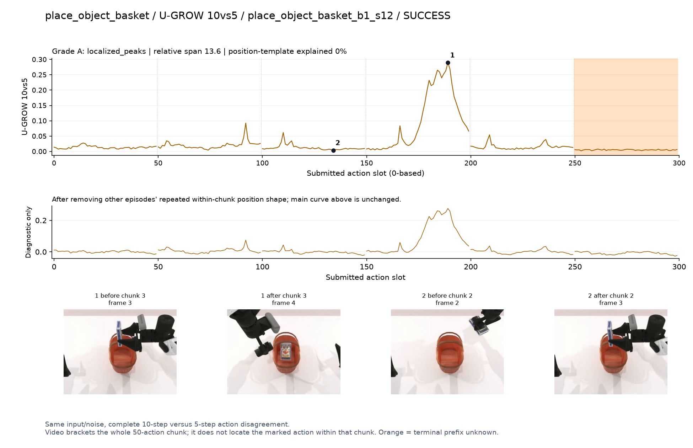

# place_object_basket

[全部任务](../README.md#全部任务) · [按信号看](../README.md#按信号看)

主图保留逐动作原始值；细虚线为chunk边界，橙色为终止段实际执行长度不明，未用于筛选。帧只对应chunk前后，不能精确定位某个h的接触瞬间。A/B/C是形态筛选等级，优先读人工备注。

## DV

**可解释候选**：候选：q3入篮和q4篮内调整有高区。

轨迹 `place_object_basket_b1_s01`；成功；种子 `422600`；正式验收。

[PNG原图](../figures/place_object_basket/dv.png) · [SVG矢量图](../figures/place_object_basket/dv.svg) · [完整元数据](../entries/place_object_basket/dv.json)

对应帧：[1 before q4](../frames/place_object_basket/place_object_basket_b1_s01/f004.jpg) · [1 after q4](../frames/place_object_basket/place_object_basket_b1_s01/f005.jpg) · [2 before q3](../frames/place_object_basket/place_object_basket_b1_s01/f003.jpg) · [2 after q3](../frames/place_object_basket/place_object_basket_b1_s01/f004.jpg)

## Fresco-tail5

**受其他因素影响**：阶段候选但混杂强：q2/q3存在清楚宽峰，和物体入篮同时发生，仍主要测路径长度。

轨迹 `place_object_basket_b0_s07`；成功；种子 `420500`；正式验收。

[PNG原图](../figures/place_object_basket/fresco.png) · [SVG矢量图](../figures/place_object_basket/fresco.svg) · [完整元数据](../entries/place_object_basket/fresco.json)

对应帧：[1 before q2](../frames/place_object_basket/place_object_basket_b0_s07/f002.jpg) · [1 after q2](../frames/place_object_basket/place_object_basket_b0_s07/f003.jpg) · [2 before q0](../frames/place_object_basket/place_object_basket_b0_s07/f000.jpg) · [2 after q0](../frames/place_object_basket/place_object_basket_b0_s07/f001.jpg)

## GEO-full

**可解释候选**：候选：q2持物到篮口、q3放入篮内各有峰。

轨迹 `place_object_basket_b1_s02`；成功；种子 `422500`；正式验收。

[PNG原图](../figures/place_object_basket/geo.png) · [SVG矢量图](../figures/place_object_basket/geo.svg) · [完整元数据](../entries/place_object_basket/geo.json)

对应帧：[1 before q2](../frames/place_object_basket/place_object_basket_b1_s02/f002.jpg) · [1 after q2](../frames/place_object_basket/place_object_basket_b1_s02/f003.jpg) · [2 before q3](../frames/place_object_basket/place_object_basket_b1_s02/f003.jpg) · [2 after q3](../frames/place_object_basket/place_object_basket_b1_s02/f004.jpg)

## GeoAAC-growth

**受其他因素影响**：谨慎：q1提物的前缀开头孤立峰，未直接指向入篮。

轨迹 `place_object_basket_b1_s06`；成功；种子 `422900`；正式验收。

[PNG原图](../figures/place_object_basket/geoaac.png) · [SVG矢量图](../figures/place_object_basket/geoaac.svg) · [完整元数据](../entries/place_object_basket/geoaac.json)

对应帧：[1 before q1](../frames/place_object_basket/place_object_basket_b1_s06/f001.jpg) · [1 after q1](../frames/place_object_basket/place_object_basket_b1_s06/f002.jpg) · [2 before q0](../frames/place_object_basket/place_object_basket_b1_s06/f000.jpg) · [2 after q0](../frames/place_object_basket/place_object_basket_b1_s06/f001.jpg)

## SHIFT

**受其他因素影响**：阶段候选但混杂强：与Fresco同轨迹入篮时宽高区，不足以证明是语义难度。

轨迹 `place_object_basket_b0_s07`；成功；种子 `420500`；正式验收。

[PNG原图](../figures/place_object_basket/shift.png) · [SVG矢量图](../figures/place_object_basket/shift.svg) · [完整元数据](../entries/place_object_basket/shift.json)

对应帧：[1 before q3](../frames/place_object_basket/place_object_basket_b0_s07/f003.jpg) · [1 after q3](../frames/place_object_basket/place_object_basket_b0_s07/f004.jpg) · [2 before q4](../frames/place_object_basket/place_object_basket_b0_s07/f004.jpg) · [2 after q4](../frames/place_object_basket/place_object_basket_b0_s07/f005.jpg)

## Tell-Tale Norm

**可解释候选**：优先阶段候选：q2/q3持物越过篮口并放入时宽高区，之后回落。

轨迹 `place_object_basket_b0_s07`；成功；种子 `420500`；正式验收。

[PNG原图](../figures/place_object_basket/norm.png) · [SVG矢量图](../figures/place_object_basket/norm.svg) · [完整元数据](../entries/place_object_basket/norm.json)

对应帧：[1 before q3](../frames/place_object_basket/place_object_basket_b0_s07/f003.jpg) · [1 after q3](../frames/place_object_basket/place_object_basket_b0_s07/f004.jpg) · [2 before q0](../frames/place_object_basket/place_object_basket_b0_s07/f000.jpg) · [2 after q0](../frames/place_object_basket/place_object_basket_b0_s07/f001.jpg)

## SR-window5

**受其他因素影响**：谨慎：q2接近篮口的高值主要在chunk开头。

轨迹 `place_object_basket_b1_s07`；成功；种子 `422100`；正式验收。

[PNG原图](../figures/place_object_basket/sr.png) · [SVG矢量图](../figures/place_object_basket/sr.svg) · [完整元数据](../entries/place_object_basket/sr.json)

对应帧：[1 before q2](../frames/place_object_basket/place_object_basket_b1_s07/f002.jpg) · [1 after q2](../frames/place_object_basket/place_object_basket_b1_s07/f003.jpg) · [2 before q0](../frames/place_object_basket/place_object_basket_b1_s07/f000.jpg) · [2 after q0](../frames/place_object_basket/place_object_basket_b1_s07/f001.jpg)

## U-GROW 10vs5

**可解释候选**：候选：q3物体由篮口上方落入篮内时明显高区。

轨迹 `place_object_basket_b1_s12`；成功；种子 `422000`；正式验收。

[PNG原图](../figures/place_object_basket/ugrow.png) · [SVG矢量图](../figures/place_object_basket/ugrow.svg) · [完整元数据](../entries/place_object_basket/ugrow.json)

对应帧：[1 before q3](../frames/place_object_basket/place_object_basket_b1_s12/f003.jpg) · [1 after q3](../frames/place_object_basket/place_object_basket_b1_s12/f004.jpg) · [2 before q2](../frames/place_object_basket/place_object_basket_b1_s12/f002.jpg) · [2 after q2](../frames/place_object_basket/place_object_basket_b1_s12/f003.jpg)
